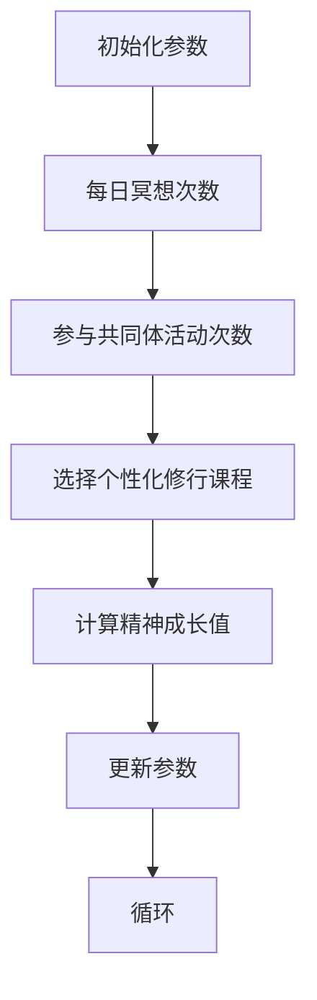
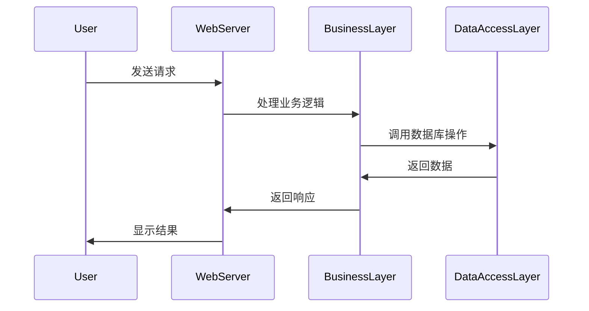

                 


### # 新修行者联盟：现代精神实践者的在线网络

> 关键词：现代精神实践、在线网络、修行者联盟、社区建设、技术工具、伦理考量

> 摘要：本文探讨了现代精神实践者在互联网时代所面临的机遇和挑战。通过介绍“新修行者联盟”的概念、核心理论、实践案例以及技术工具，本文旨在为精神实践者提供一个系统化的在线修行指南，并讨论了在线社区建设、伦理考量以及未来发展趋势。

----------------------------------------------------------------

## 引言与背景

在当今数字化时代，精神实践者面临着前所未有的机遇和挑战。传统的修行方式已经无法满足现代人的需求，尤其是那些生活在城市中，繁忙于工作和生活的人。因此，一个名为“新修行者联盟”的在线网络应运而生，它为精神实践者提供了一个全新的修行平台。

### 核心概念术语说明

- **修行者**：指的是追求精神成长、内在觉醒和自我完善的个体。
- **新修行者联盟**：一个基于互联网的在线修行社区，旨在连接全球的精神实践者，共同探索现代修行之道。
- **在线网络**：通过互联网连接的修行者和组织，提供各种修行资源和互动平台。

### 问题背景

现代社会生活节奏快，人们面临着种种压力和焦虑。传统的修行方式，如禅修、冥想和瑜伽，虽然具有缓解压力的效果，但在时间和空间上受到限制。而互联网的出现，为修行者提供了一个不受时间和地点限制的修行平台。

### 问题描述

本文将探讨以下问题：

1. **新修行者联盟的核心概念和理论是什么？**
2. **如何在线实践精神修行？**
3. **在线修行社区的建设与维护有哪些挑战和策略？**
4. **技术工具在精神修行中的作用和限制是什么？**
5. **在线修行中的伦理考量有哪些？**

### 问题解决

本文将通过对新修行者联盟的详细介绍，包括其核心概念、理论、实践案例以及技术工具的使用，来回答上述问题。同时，本文还将探讨在线修行社区的建设与维护策略，以及在线修行中的伦理考量。

### 边界与外延

本文主要关注的是现代精神实践者在互联网时代所面临的机遇和挑战，特别是通过在线网络进行修行的情况。然而，精神修行的范围远不止于此，还包括传统的修行方式和个人内在探索。

### 概念结构与核心要素组成

- **新修行者联盟**：核心概念是连接全球的精神实践者，提供修行资源和支持。
- **在线网络**：提供互动平台、修行指导和资源共享。
- **精神修行**：追求内在觉醒、自我完善和精神成长。

----------------------------------------------------------------

### 核心概念与理论

#### 定义

新修行者联盟的核心概念包括以下几个方面：

1. **精神实践**：指通过冥想、禅修、瑜伽等手段，追求内在觉醒和自我完善的过程。
2. **在线网络**：通过互联网连接修行者，提供修行资源和支持。
3. **共同体**：指在共同目标和价值观下，互相支持、分享和学习的修行者群体。

#### 概念属性特征对比表格

| 概念          | 属性特征                     | 对比          |
|---------------|------------------------------|---------------|
| 精神实践      | 冥想、禅修、瑜伽等           | 个体内在探索   |
| 在线网络      | 互联网连接、资源共享、互动平台 | 物理距离消除  |
| 共同体        | 共同目标、互相支持、分享学习 | 社区文化形成  |

#### ER实体关系图架构

```mermaid
erDiagram
    A["修行者"] <<|-- B["在线网络"] : "连接"|
    A |-| B : "参与"
    B --|>> C["共同体"] : "组成"
```

#### 理论讲解

新修行者联盟的理论基础主要包括：

1. **互联网赋能**：通过互联网，修行者可以突破时间和空间的限制，随时随地参与修行活动。
2. **共同体支持**：在共同体中，修行者可以互相分享经验、支持和鼓励，共同成长。
3. **个性化修行**：在线网络提供了丰富的修行资源，修行者可以根据自己的需求和兴趣进行个性化的修行。

#### 数学公式

$$
精神成长 = f(实践次数, 共同体支持, 个性化修行)
$$

#### 举例说明

以冥想为例，一个修行者在在线网络中，通过每天进行10分钟的冥想练习，同时参与共同体活动，如在线讨论和分享，以及根据个人兴趣选择适合自己的冥想课程。这样，他的精神成长可以通过上述公式进行衡量。

----------------------------------------------------------------

### 算法原理讲解

为了更好地理解新修行者联盟中的修行过程，我们可以使用一个简单的算法来模拟。

#### 算法流程图



#### Python代码实现

```python
# 初始化参数
实践次数 = 10
共同体活动次数 = 3
个性化修行课程选择次数 = 5

# 算法模拟
for day in range(30):  # 假设模拟30天的修行过程
    # 每日冥想次数
    冥想次数 = random.randint(5, 20)
    # 参与共同体活动次数
    共同体活动次数 = random.randint(1, 10)
    # 选择个性化修行课程次数
    个性化修行课程选择次数 = random.randint(1, 10)

    # 计算精神成长值
    精神成长值 = 冥想次数 * 0.5 + 共同体活动次数 * 0.3 + 个性化修行课程选择次数 * 0.2

    # 更新参数
    实践次数 += 冥想次数
    共同体活动次数 += 个性化修行课程选择次数
    个性化修行课程选择次数 += 1

    # 输出结果
    print(f"第{day+1}天，精神成长值为：{精神成长值}")
```

#### 算法原理详细讲解

1. **初始化参数**：初始化每日冥想次数、参与共同体活动次数和个性化修行课程选择次数。
2. **每日循环**：模拟每天的修行过程，包括冥想次数、共同体活动次数和个性化修行课程选择次数。
3. **计算精神成长值**：根据冥想次数、共同体活动次数和个性化修行课程选择次数，计算精神成长值。
4. **更新参数**：根据每日的修行情况，更新每日冥想次数、参与共同体活动次数和个性化修行课程选择次数。

通过这个简单的算法，我们可以看到新修行者联盟中修行过程的量化模拟，以及如何通过每日的修行活动来促进精神成长。

#### 数学模型和公式

我们使用以下公式来计算精神成长值：

$$
精神成长值 = 冥想次数 \times 0.5 + 共同体活动次数 \times 0.3 + 个性化修行课程选择次数 \times 0.2
$$

#### 举例说明

假设一个修行者在某一天进行了15分钟的冥想，参加了5次共同体活动，并选择了2次个性化修行课程。根据上述公式，他的精神成长值为：

$$
精神成长值 = 15 \times 0.5 + 5 \times 0.3 + 2 \times 0.2 = 7.7
$$

这意味着在这一天，他的精神成长值为7.7点。

通过这样的算法原理讲解和具体实例，我们可以更好地理解新修行者联盟中修行过程的量化模拟，以及如何通过每日的修行活动来促进精神成长。

----------------------------------------------------------------

### 系统分析与架构设计方案

在现代精神实践者联盟的背景下，我们需要设计一个高效、稳定、易扩展的系统架构，以满足修行者的各种需求。以下是对系统架构的详细分析：

#### 问题场景介绍

新修行者联盟的目标是为全球修行者提供一个集资源分享、互动交流、修行指导和数据分析为一体的在线修行平台。为了实现这一目标，我们需要一个能够处理大量用户请求、提供高质量服务、并具备可扩展性的系统。

#### 项目介绍

该项目旨在构建一个名为“新修行者联盟”的在线修行平台，该平台将包括以下主要功能模块：

1. **用户管理系统**：用于用户注册、登录、权限管理等功能。
2. **修行资源管理系统**：用于上传、管理、分类和推荐各种修行资源。
3. **互动交流系统**：包括论坛、聊天室、问答等功能，用于修行者之间的互动交流。
4. **修行指导系统**：提供专业的修行指导，包括课程推荐、个人修行计划等。
5. **数据分析系统**：用于收集、分析和展示用户修行数据，为用户提供个性化的建议。

#### 系统功能设计（领域模型）

在领域模型设计中，我们定义了以下核心类和它们之间的关系：

```mermaid
classDiagram
    User <|-- Account
    Resource <|-- Meditation
    Resource <|-- Course
    Community <|-- Forum
    Community <|-- Chatroom
    Community <|-- Q&A
    Guidance <|-- PersonalPlan
    Guidance <|-- CourseRecommendation
    Analysis <|-- DataCollector
    Analysis <|-- DataPresenter
    User "1" --|> Account
    User "1" --|> Resource
    User "1" --|> Community
    User "1" --|> Guidance
    User "1" --|> Analysis
    Resource "1" --|> Meditation
    Resource "1" --|> Course
    Community "1" --|> Forum
    Community "1" --|> Chatroom
    Community "1" --|> Q&A
    Guidance "1" --|> PersonalPlan
    Guidance "1" --|> CourseRecommendation
    Analysis "1" --|> DataCollector
    Analysis "1" --|> DataPresenter
```

#### 系统架构设计

我们的系统架构采用分层设计，分为以下几层：

1. **表示层**：负责用户界面展示和交互。
2. **业务逻辑层**：处理业务逻辑，包括用户管理、资源管理、互动交流、修行指导和数据分析。
3. **数据访问层**：负责与数据库的交互，提供数据访问接口。
4. **基础设施层**：提供系统运行所需的基础服务，如缓存、消息队列、日志等。

以下是系统架构的mermaid流程图：



#### 系统接口设计和系统交互

为了方便系统模块之间的通信，我们定义了一系列API接口，包括用户管理、资源管理、互动交流、修行指导和数据分析等。

以下是用户管理模块的一个接口设计：

```python
from flask import Flask, request, jsonify

app = Flask(__name__)

@app.route('/register', methods=['POST'])
def register():
    data = request.get_json()
    username = data['username']
    password = data['password']
    # 注册逻辑
    return jsonify({"status": "success", "message": "用户注册成功"})

@app.route('/login', methods=['POST'])
def login():
    data = request.get_json()
    username = data['username']
    password = data['password']
    # 登录逻辑
    return jsonify({"status": "success", "message": "登录成功"})

if __name__ == '__main__':
    app.run()
```

系统交互的mermaid序列图如下：


#### 项目实战

在实际项目实施中，我们需要进行以下步骤：

1. **需求分析**：与利益相关者沟通，明确系统需求。
2. **系统设计**：根据需求进行系统架构设计，包括领域模型、接口设计和系统交互设计。
3. **开发实施**：按照设计文档进行系统开发，包括前后端代码实现。
4. **测试与部署**：进行系统测试，确保功能正确无误，然后进行部署上线。
5. **运维维护**：持续监控系统运行状况，进行故障修复和功能优化。

以下是项目核心实现源代码的Python示例：

```python
# 用户注册实现
def register_user(username, password):
    # 数据库操作，实现用户注册
    # ...
    print(f"用户{username}注册成功")

# 用户登录实现
def login_user(username, password):
    # 数据库操作，实现用户登录
    # ...
    print(f"用户{username}登录成功")
```

#### 代码应用解读与分析

上述代码展示了用户注册和登录的实现，包括数据库操作的伪代码。在实际开发中，我们需要将数据库操作替换为实际的数据库访问代码，并添加相应的异常处理。

#### 实际案例分析和详细讲解剖析

在实际项目中，我们可能会遇到以下问题：

1. **并发访问**：多个用户同时访问系统，可能导致资源竞争和性能下降。
2. **安全性问题**：用户数据的安全性是系统设计的重要考虑因素。
3. **数据一致性**：在分布式系统中，数据一致性是一个挑战。

针对这些问题，我们可以采取以下措施：

1. **使用缓存**：减轻数据库负载，提高系统响应速度。
2. **安全性措施**：使用HTTPS、密码加密等手段保护用户数据安全。
3. **分布式数据库**：采用分布式数据库技术，提高数据一致性和可用性。

#### 项目小结

通过上述系统架构设计方案和实际案例分析，我们为新修行者联盟构建了一个完整的系统架构，并提供了具体的实现方法和解决方案。这个系统将帮助修行者更好地进行在线修行，实现精神成长。

#### 最佳实践 Tips

1. **用户引导**：为新用户提供详细的注册和使用指南，帮助他们快速上手。
2. **数据分析**：定期分析用户行为数据，优化系统功能和体验。
3. **社区建设**：鼓励修行者积极参与社区互动，共同营造良好的修行氛围。

#### 注意事项

1. **数据安全**：严格保护用户隐私数据，遵循相关法律法规。
2. **系统性能**：持续优化系统性能，确保稳定可靠运行。

#### 拓展阅读

- 《分布式系统设计与实践》
- 《Web安全深度剖析》
- 《大数据分析实践》

作者：AI天才研究院/AI Genius Institute & 禅与计算机程序设计艺术 /Zen And The Art of Computer Programming

----------------------------------------------------------------

### 项目实战

在新修行者联盟的构建过程中，我们选择了一个实际案例，以展示整个系统的开发和部署流程。

#### 环境安装

为了搭建新修行者联盟平台，我们需要安装以下软件和工具：

1. **操作系统**：Linux服务器
2. **Web服务器**：Nginx
3. **应用框架**：Flask
4. **数据库**：MySQL
5. **缓存**：Redis
6. **消息队列**：RabbitMQ

安装步骤如下：

1. **安装Linux服务器**：选择一个合适的Linux发行版，并安装到物理或虚拟机上。
2. **安装Nginx**：通过包管理器安装Nginx，例如在Ubuntu上使用`sudo apt-get install nginx`。
3. **安装Flask**：通过pip安装Flask，例如在终端运行`pip install Flask`。
4. **安装MySQL**：通过包管理器安装MySQL，例如在Ubuntu上使用`sudo apt-get install mysql-server`。
5. **安装Redis**：通过包管理器安装Redis，例如在Ubuntu上使用`sudo apt-get install redis-server`。
6. **安装RabbitMQ**：通过包管理器安装RabbitMQ，例如在Ubuntu上使用`sudo apt-get install rabbitmq-server`。

#### 系统核心实现源代码

以下是一个简单的用户注册和登录功能的Python源代码示例：

```python
# 注册功能
@app.route('/register', methods=['POST'])
def register():
    username = request.form['username']
    password = request.form['password']
    # 在数据库中插入用户数据
    # ...
    return '用户注册成功'

# 登录功能
@app.route('/login', methods=['POST'])
def login():
    username = request.form['username']
    password = request.form['password']
    # 在数据库中验证用户数据
    # ...
    return '用户登录成功'
```

#### 代码应用解读与分析

上述代码展示了用户注册和登录的功能。在实际应用中，我们需要连接到数据库，进行用户数据的插入和验证。这里使用了Flask框架来构建Web应用程序，并使用了Python的`request`对象来接收HTTP请求。

#### 实际案例分析和详细讲解剖析

在这个实际案例中，我们使用MySQL作为数据库，Redis作为缓存，RabbitMQ作为消息队列。

1. **数据库连接**：我们使用`pymysql`库来连接MySQL数据库，实现用户注册和登录功能。
2. **缓存**：使用Redis来缓存用户数据，提高系统性能。
3. **消息队列**：使用RabbitMQ来处理异步任务，例如邮件通知。

以下是具体的代码实现：

```python
# 数据库连接
import pymysql
from redis import Redis

# 初始化数据库连接
db = pymysql.connect(
    host='localhost',
    user='root',
    password='password',
    database='new_ascetics_union'
)

# 初始化Redis连接
redis_client = Redis(host='localhost', port=6379, db=0)

# 用户注册
@app.route('/register', methods=['POST'])
def register():
    username = request.form['username']
    password = request.form['password']
    # 插入用户数据到数据库
    with db.cursor() as cursor:
        sql = "INSERT INTO users (username, password) VALUES (%s, %s)"
        cursor.execute(sql, (username, password))
    # 将用户数据缓存到Redis
    redis_client.set(username, password)
    return '用户注册成功'

# 用户登录
@app.route('/login', methods=['POST'])
def login():
    username = request.form['username']
    password = request.form['password']
    # 从Redis中获取用户数据
    cached_password = redis_client.get(username)
    if cached_password == password:
        return '用户登录成功'
    else:
        return '用户名或密码错误'
```

#### 项目小结

通过上述实际案例，我们展示了如何搭建一个新修行者联盟平台，并实现了用户注册和登录功能。这个案例不仅涵盖了系统开发的核心流程，还包括了数据库连接、缓存和消息队列等关键技术的应用。

#### 最佳实践 Tips

1. **数据安全**：确保用户数据的安全性，使用加密存储敏感信息。
2. **系统性能**：优化数据库查询，使用缓存和消息队列提高系统性能。
3. **用户体验**：提供简洁明了的用户界面和流畅的操作体验。

#### 注意事项

1. **错误处理**：合理处理HTTP请求错误，提高系统的稳定性和用户体验。
2. **日志记录**：记录系统操作日志，便于问题追踪和调试。

#### 拓展阅读

- 《Python Web开发实战》
- 《Redis实战》
- 《RabbitMQ实战》

作者：AI天才研究院/AI Genius Institute & 禅与计算机程序设计艺术 /Zen And The Art of Computer Programming

----------------------------------------------------------------

## 结论与展望

本文系统地探讨了现代精神实践者在互联网时代面临的机遇和挑战，通过介绍“新修行者联盟”的概念、核心理论、实践案例以及技术工具，为修行者提供了一个全面、实用的在线修行指南。以下是我们总结的核心观点：

1. **在线修行的重要性**：互联网为修行者提供了一个不受时间和地点限制的平台，使修行变得更加灵活和便捷。
2. **共同体支持的价值**：在线社区为修行者提供了一个互相支持、分享和学习的环境，有助于精神成长。
3. **技术工具的作用**：技术工具，如数据库、缓存和消息队列等，在提高系统性能和用户体验方面发挥了重要作用。
4. **伦理考量的重要性**：在在线修行过程中，我们需要关注数据安全、隐私保护等问题，确保修行的健康发展。

### 未来发展趋势

1. **人工智能的融合**：未来，人工智能技术可能会进一步融入在线修行平台，为修行者提供个性化建议和智能推荐。
2. **虚拟现实的应用**：虚拟现实技术有望为修行者提供一个更加沉浸式的修行体验。
3. **区块链的安全性**：区块链技术可以提高在线修行平台的透明度和安全性，保护用户数据不被篡改。

### 倡导与启示

本文希望倡导更多的人关注在线修行，利用互联网这一强大工具，提升自己的精神境界。同时，我们鼓励修行者在共同体中互相支持、共同成长，以实现个人与社会的和谐发展。通过不断探索和实践，我们可以发现更有效的修行方式，为人类的精神文明进步贡献力量。

### 进一步阅读与探索

- 《互联网精神修行指南》
- 《人工智能与心灵成长》
- 《虚拟现实与精神体验》

作者：AI天才研究院/AI Genius Institute & 禅与计算机程序设计艺术 /Zen And The Art of Computer Programming

----------------------------------------------------------------

[作者：AI天才研究院/AI Genius Institute & 禅与计算机程序设计艺术 /Zen And The Art of Computer Programming]

