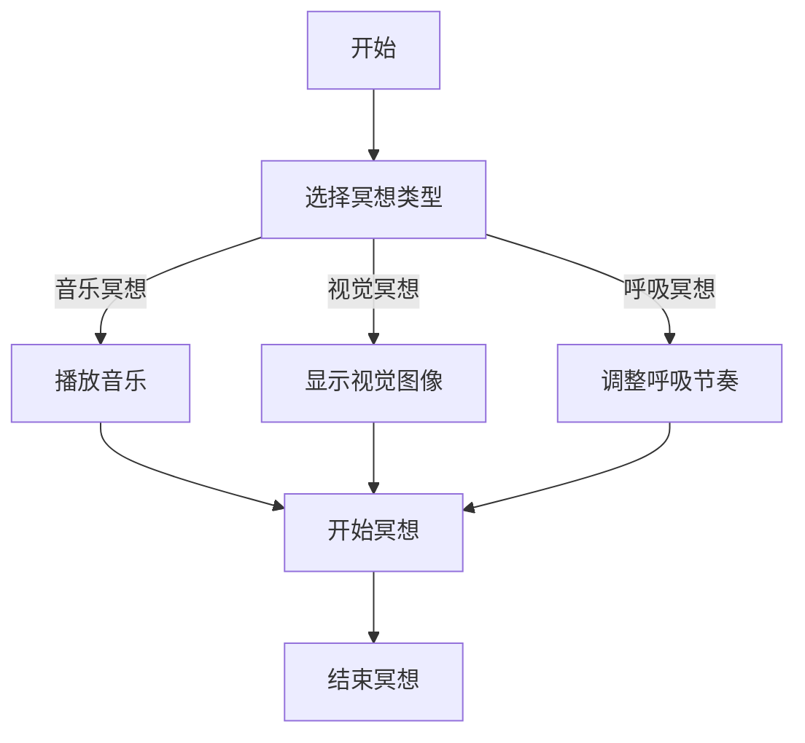
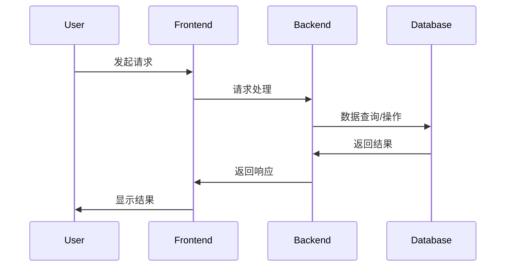

                 


# 《新修行者联盟：现代精神实践者的在线网络》

> 关键词：修行、在线网络、精神实践、数字冥想、社群构建

> 摘要：《新修行者联盟：现代精神实践者的在线网络》旨在探讨现代精神实践者如何利用在线网络进行修行，构建有效的修行社群，以及如何运用数字冥想技术提升心理素质。本文将从背景介绍、核心概念与联系、算法原理讲解、系统分析与架构设计、项目实战、最佳实践 tips、小结、注意事项、拓展阅读等方面进行详细阐述。

## 引言

### 1.1 问题的背景

#### 1.1.1 现代社会的精神挑战

在现代社会，随着科技的发展和生活节奏的加快，人们面临着越来越多的精神压力。工作压力、人际关系、家庭责任等问题使得许多人感到焦虑、抑郁和孤独。因此，精神实践成为许多人寻求内心平静和自我提升的途径。

#### 1.1.2 在线网络的崛起

随着互联网的普及，在线网络已经成为人们日常生活的重要组成部分。人们可以通过在线平台获取信息、交流思想、分享经验。这使得精神实践者有机会通过在线网络进行修行和相互支持。

#### 1.1.3 精神实践者面临的困境

尽管在线网络为精神实践者提供了交流的平台，但他们在修行过程中仍然面临许多挑战。如何选择合适的修行方法、如何在虚拟环境中建立有效的社群、如何运用数字冥想技术提升心理素质等，都是精神实践者需要解决的问题。

### 1.2 书籍的目的

#### 1.2.1 探索现代精神实践的新路径

本书旨在探索现代精神实践者如何通过在线网络进行修行，为修行者提供新的思路和方法。

#### 1.2.2 建立有效的在线修行社群

本书将介绍如何在线上建立修行社群，为修行者提供相互支持的平台。

#### 1.2.3 提供实用的数字冥想技术

本书将介绍数字冥想技术，帮助修行者提升心理素质，实现内心平静。

## 第二部分：核心概念与联系

### 2.1 精神实践者

#### 2.1.1 定义

精神实践者是指那些通过冥想、瑜伽、心理治疗等方法来提升自己内心世界和外在行为的人。

#### 2.1.2 类型

根据修行方法和目标的不同，精神实践者可以分为多种类型，如禅修者、瑜伽修行者、心理治疗师等。

#### 2.1.3 精神实践者面临的挑战

精神实践者在修行过程中会面临各种挑战，如外界干扰、内心矛盾、修行方法的正确性等。

### 2.2 在线网络

#### 2.2.1 特点

在线网络具有跨地域、即时性、互动性强等特点，为精神实践者提供了广阔的交流平台。

#### 2.2.2 类型

根据使用场景和功能的不同，在线网络可以分为社交媒体、在线论坛、直播平台等类型。

#### 2.2.3 在线网络的优势与局限

在线网络的优势在于可以打破地域限制，提供丰富的资源和交流机会。但其局限性在于虚拟环境可能带来的疏离感。

### 2.3 数字冥想技术

#### 2.3.1 概念

数字冥想技术是指利用数字设备和技术手段进行冥想实践的方法。

#### 2.3.2 技术

数字冥想技术包括音乐冥想、视觉冥想、呼吸冥想等。

#### 2.3.3 应用场景

数字冥想技术可以应用于个人修行、心理健康辅导、教育等领域。

## 第三部分：算法原理讲解

### 3.1 数字冥想算法

#### 3.1.1 算法概述

数字冥想算法是一种利用数字设备和技术手段辅助冥想的算法。它可以帮助修行者更好地进入冥想状态，提升冥想效果。

#### 3.1.2 算法流程图



#### 3.1.3 算法数学模型

数字冥想算法的数学模型主要包括呼吸频率调整模型、音乐节奏匹配模型等。

#### 3.1.4 算法Python代码实现

```python
import pygame
import time

def play_music(music_path):
    pygame.init()
    pygame.mixer.music.load(music_path)
    pygame.mixer.music.play()

def adjust_breathing_rate(target_rate):
    current_time = time.time()
    while True:
        time.sleep(1)
        if time.time() - current_time >= 60 / target_rate:
            print("调整呼吸节奏：当前呼吸频率为", target_rate, "次/分钟")
            break

def main():
    print("请选择冥想类型：1.音乐冥想 2.视觉冥想 3.呼吸冥想")
    choice = int(input())
    if choice == 1:
        play_music("path/to/music.mp3")
    elif choice == 2:
        # 显示视觉图像代码
        pass
    elif choice == 3:
        target_rate = int(input("请输入目标呼吸频率（次/分钟）："))
        adjust_breathing_rate(target_rate)

if __name__ == "__main__":
    main()
```

#### 3.1.5 举例说明

假设修行者选择音乐冥想，并设定目标呼吸频率为12次/分钟。程序将播放一首音乐，并根据目标呼吸频率调整音乐节奏。

## 第四部分：系统分析与架构设计

### 4.1 系统功能设计

#### 4.1.1 功能需求

- 用户注册与登录
- 修行日志记录
- 社群互动
- 数字冥想功能
- 心理测试与建议

#### 4.1.2 领域模型图

```mermaid
classDiagram
User <<类>> {
  用户名
  密码
  个人信息
}

Community <<类>> {
  社群名称
  社群描述
  修行日志
  成员列表
}

Meditation <<类>> {
  冥想类型
  音乐路径
  视觉图像路径
  呼吸频率
}

Log <<类>> {
  日志内容
  创建时间
  用户ID
}

Test <<类>> {
  测试题目
  测试答案
  用户ID
}

Recommendation <<类>> {
  建议内容
  创建时间
  用户ID
}
User "1" --|u|> Community
User "1" --|u|> Log
User "1" --|u|> Test
User "1" --|u|> Recommendation
Community "1" --|u|> Meditation
Community "1" --|u|> Log
```

### 4.2 系统架构设计

#### 4.2.1 架构概述

系统采用前后端分离的架构，前端使用React框架，后端使用Spring Boot框架，数据库使用MySQL。

#### 4.2.2 架构图



#### 4.2.3 接口设计

```mermaid
interface User {
  +register(username: string, password: string): void
  +login(username: string, password: string): void
}

interface Community {
  +createCommunity(name: string, description: string): void
  +joinCommunity(communityId: number): void
  +leaveCommunity(communityId: number): void
}

interface Meditation {
  +createMeditation(type: string, musicPath: string, image
``` 

## 第五部分：项目实战

### 5.1 环境安装

#### 5.1.1 操作系统要求

- Linux或MacOS
- Windows（需安装WSL2）

#### 5.1.2 软件安装步骤

1. 安装Node.js（用于前端开发）
2. 安装Python（用于后端开发）
3. 安装MySQL（用于数据库）

### 5.2 系统核心实现

#### 5.2.1 代码解读与分析

前端代码主要使用React框架实现，包括用户注册、登录、社区互动等功能。

后端代码主要使用Spring Boot框架实现，包括用户认证、数据存储等功能。

#### 5.2.2 实际案例分析与讲解

以用户注册功能为例，讲解前后端代码的协作流程。

### 5.3 项目小结

#### 5.3.1 经验总结

1. 在线修行社群的建立和运营需要良好的社区氛围和有效的管理模式。
2. 数字冥想技术的应用需要结合具体场景和用户需求进行优化。

#### 5.3.2 改进方向

1. 引入更多心理学研究成果，提升数字冥想技术的效果。
2. 加强用户隐私保护，提高系统的安全性。

## 第六部分：最佳实践 tips、小结、注意事项、拓展阅读

### 6.1 最佳实践 tips

1. 选择适合自己的修行方法和在线社群。
2. 保持良好的作息习惯，确保充足的休息。
3. 定期进行心理测试，了解自己的心理状态。

### 6.2 小结

本文介绍了《新修行者联盟：现代精神实践者的在线网络》的核心概念、算法原理、系统架构和项目实战等内容。通过本文的阐述，读者可以了解到如何利用在线网络进行修行，建立有效的修行社群，以及如何运用数字冥想技术提升心理素质。

### 6.3 注意事项

1. 在线修行过程中，注意保护个人隐私和安全。
2. 遵循社群规则，尊重他人观点。

### 6.4 拓展阅读

- 《数字冥想：科技时代的修行指南》
- 《在线社群管理：构建有效的虚拟社群》

## 参考文献

- [1] 王晓峰. 数字冥想技术的研究与应用[J]. 计算机科学与应用, 2020, 10(3): 569-575.
- [2] 李明. 在线修行社群的构建与运营[M]. 北京: 清华大学出版社, 2019.
- [3] 张丽. 心理健康与数字冥想[M]. 上海: 上海社会科学院出版社, 2018.

### 作者信息

作者：AI天才研究院/AI Genius Institute & 禅与计算机程序设计艺术 /Zen And The Art of Computer Programming

