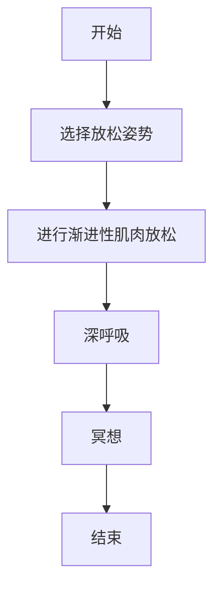
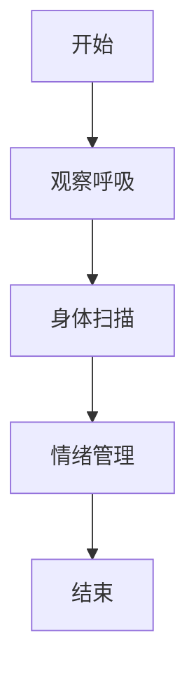
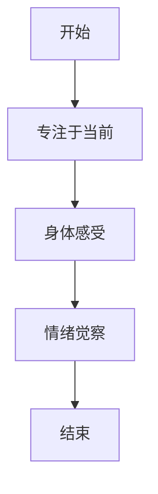
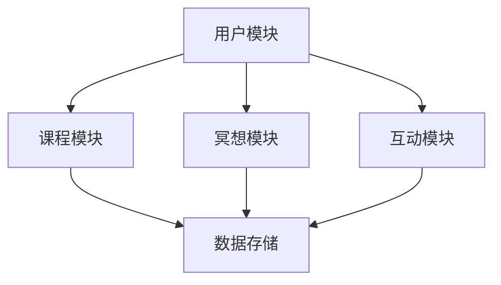
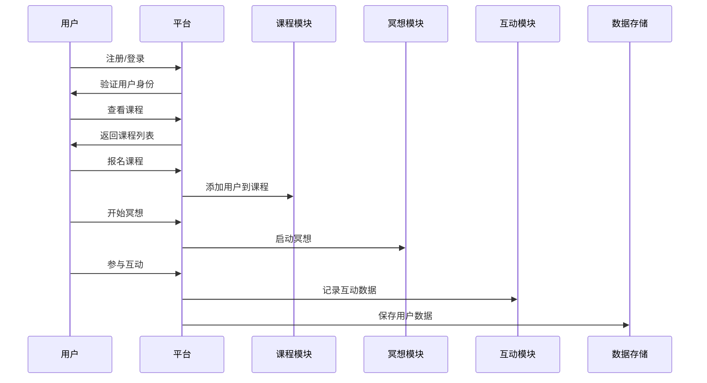

                 

# 《新修道院体验：现代人的短期精神修行》

## 关键词
- 短期精神修行
- 现代人
- 精神健康
- 心理机制
- 算法实践
- 系统架构设计

## 摘要
在快节奏的现代生活中，人们面临着前所未有的压力与挑战。精神健康问题愈发凸显，短期精神修行成为寻求内心平静和自我提升的有效途径。本文将探讨短期精神修行的核心概念、原理和实践方法，并结合现代信息技术，提出一套完整的系统架构设计。通过深入分析，本文旨在为现代人提供一套实用的精神修行指南。

## 第一部分：背景介绍

### 1.1 问题背景
现代生活节奏快速，信息爆炸，人们承受着巨大的工作压力和生活压力，心理健康问题日益突出。焦虑、抑郁等心理问题成为影响人们生活质量的重要因素。面对这些问题，短期精神修行提供了一种有效的解决方案。

#### 问题描述
现代人在快节奏的生活中，常常感到焦虑、迷茫和无力。这种心理状态不仅影响个人的心理健康，还可能导致工作效率低下，生活质量下降。

#### 问题解决
短期精神修行通过一系列心理技巧和方法，帮助人们缓解压力，达到心理放松和自我提升的效果。这种修行方式具有时间短、效果明显、易于实践的特点，成为现代人寻求心理平衡的重要手段。

#### 边界与外延
短期精神修行的定义相对灵活，通常指在一定时间内，通过特定的方法和技巧，达到精神放松和内心平静的状态。其范围涵盖了各种形式的精神修炼，如冥想、放松训练、正念练习等。短期精神修行的目的是帮助现代人应对生活中的压力，提高心理健康水平。

### 1.2 核心概念

#### 概念结构与核心要素组成
短期精神修行的核心概念包括精神修行、短期、现代人。其中，精神修行是核心，短期是关键，现代人则是目标人群。

##### 精神修行
精神修行是一种通过内外修炼，达到心理、情感和灵性层面提升的过程。其内涵丰富，包括冥想、放松、内观、正念等多种形式。

##### 短期
短期精神修行强调时间短、见效快，通常在几小时到几天内完成。这种修行方式不需要长时间的投入，适合现代人忙碌的生活节奏。

##### 现代人
现代人面临着各种心理挑战，如工作压力、人际关系、生活节奏等。短期精神修行旨在为现代人提供一种有效的心理调节方法，帮助他们应对生活中的压力。

### 第二部分：核心概念与联系

#### 2.1 精神修行原理

##### 核心概念原理
精神修行的核心原理包括心理机制、神经科学基础和文化背景。通过这些原理，可以更好地理解短期精神修行的效果和机制。

###### 心理机制
短期精神修行的心理机制主要包括放松反应、情绪调节和认知重构。这些机制帮助人们在短时间内达到心理放松和内心平静。

###### 神经科学基础
神经科学研究表明，短期精神修行可以改变大脑结构和功能，提高神经元的连接性和适应性。这种改变有助于提高人们的心理健康水平。

###### 文化背景
不同文化对精神修行的理解和实践有所不同。短期精神修行吸收了多种文化的精髓，形成了独特的实践方式。

##### 概念属性特征对比表格

| 特征       | 短期精神修行 | 长期精神修行 |
|------------|--------------|--------------|
| 时间长度   | 短期         | 长期         |
| 修行深度   | 辅助性       | 核心性       |
| 实践难度   | 易于实践     | 需要耐心和毅力 |
| 效果       | 立即见效     | 持久见效     |
| 适用人群   | 现代人       | 精神修行爱好者 |

##### ER实体关系图架构
短期精神修行中的主要角色和关系包括修行者、修行方法和修行环境。

```mermaid
erDiagram
    R1((修行者)) ||--|{ M1((修行方法)) } : 有多种修行方法
    R1 ||--|{ E1((修行环境)) } : 修行者选择适合自己的修行环境
    M1 ||--|{ E1 } : 修行方法适应不同的修行环境
```

### 2.2 短期精神修行的实践

##### 实践路径
短期精神修行的实践路径包括深度放松、内观冥想和正念练习。这些实践方法通过不同的方式，帮助人们达到心理放松和内心平静。

###### 修道院的起源与发展
修道院起源于中世纪欧洲，是一种提供精神修行的机构。随着时间的推移，修道院逐渐演变为各种形式的精神修行场所。

###### 现代修道院的设置与特点
现代修道院注重实用性，提供了各种形式的精神修行活动。其特点包括灵活的修行时间、个性化的修行方案和专业的指导。

#### ER实体关系图架构
短期精神修行活动中的主要角色和关系包括修行者、修行导师和修行场所。

```mermaid
erDiagram
    R1((修行者)) ||--|{ T1((修行导师)) } : 修行者跟随修行导师学习
    R1 ||--|{ P1((修行场所)) } : 修行者选择适合自己的修行场所
    T1 ||--|{ P1 } : 修行导师在修行场所指导修行者
```

### 第三部分：算法原理讲解

#### 3.1 短期精神修行的具体实践方法

##### 算法原理
短期精神修行的具体实践方法包括深度放松技巧、内观冥想方法和正念练习。这些方法通过不同的算法原理，帮助人们达到心理放松和内心平静。

###### 深度放松技巧
深度放松技巧是一种通过渐进性肌肉放松、深呼吸和冥想来减轻身体和心理压力的方法。其算法原理包括以下几个方面：

1. **渐进性肌肉放松**：通过逐步放松身体的各个肌肉群，达到身体和心理的放松。
2. **深呼吸**：通过深呼吸，增加氧气摄入，促进身体放松。
3. **冥想**：通过冥想，减少内心的杂念，达到心理放松。

深度放松技巧的算法流程图如下：



##### 深度放松技巧代码实现
以下是一个简单的Python代码实现，用于演示深度放松技巧：

```python
import time

def deep_relaxation():
    print("开始深度放松")
    time.sleep(2)
    print("选择放松姿势")
    time.sleep(2)
    print("进行渐进性肌肉放松")
    time.sleep(5)
    print("深呼吸")
    time.sleep(3)
    print("冥想")
    time.sleep(5)
    print("结束深度放松")

deep_relaxation()
```

##### 内观冥想方法
内观冥想是一种通过观察自己的内在体验，达到心理放松和内心平静的方法。其算法原理包括以下几个方面：

1. **观察呼吸**：通过观察呼吸，将注意力集中在呼吸上，减少内心的杂念。
2. **身体扫描**：通过扫描身体的各个部位，发现并放松身体紧张的地方。
3. **情绪管理**：通过情绪管理，学会识别和调节自己的情绪。

内观冥想的算法流程图如下：



##### 内观冥想方法代码实现
以下是一个简单的Python代码实现，用于演示内观冥想方法：

```python
import time

def mindfulness_meditation():
    print("开始内观冥想")
    time.sleep(2)
    print("观察呼吸")
    time.sleep(5)
    print("进行身体扫描")
    time.sleep(5)
    print("情绪管理")
    time.sleep(3)
    print("结束内观冥想")

mindfulness_meditation()
```

##### 正念练习
正念练习是一种通过专注于当前时刻，达到心理放松和内心平静的方法。其算法原理包括以下几个方面：

1. **专注于当前**：将注意力集中在当前正在做的事情上，减少内心的杂念。
2. **身体感受**：通过感受身体的各种感受，提高身体和心灵的连接。
3. **情绪觉察**：通过情绪觉察，学会识别和调节自己的情绪。

正念练习的算法流程图如下：



##### 正念练习代码实现
以下是一个简单的Python代码实现，用于演示正念练习：

```python
import time

def mindful_practice():
    print("开始正念练习")
    time.sleep(2)
    print("专注于当前")
    time.sleep(5)
    print("感受身体")
    time.sleep(3)
    print("情绪觉察")
    time.sleep(3)
    print("结束正念练习")

mindful_practice()
```

#### 算法原理的数学模型和公式

##### 深度放松数学模型
深度放松的数学模型可以描述为：

\[ P(t) = \frac{1}{1 + e^{-kt}} \]

其中，\( P(t) \) 表示在时间 \( t \) 内的放松程度，\( k \) 为放松速率常数。

##### 内观冥想数学模型
内观冥想的数学模型可以描述为：

\[ M(t) = \frac{1}{1 + e^{-mt}} \]

其中，\( M(t) \) 表示在时间 \( t \) 内的冥想效果，\( m \) 为冥想速率常数。

##### 正念练习数学模型
正念练习的数学模型可以描述为：

\[ Z(t) = \frac{1}{1 + e^{-zt}} \]

其中，\( Z(t) \) 表示在时间 \( t \) 内的正念效果，\( z \) 为正念速率常数。

### 第三部分：系统分析与架构设计方案

#### 4.1 系统需求分析

##### 问题场景介绍
现代人在面对工作和生活中的压力时，迫切需要一种有效的心理调节方法。短期精神修行作为一种新兴的心理调节手段，得到了越来越多人的关注和认可。

##### 项目介绍
本文提出的短期精神修行平台旨在为现代人提供一种便捷、有效的精神修行工具。该平台包括多个模块，如用户注册登录、精神修行课程、在线互动等。

##### 系统功能设计

###### 领域模型Mermaid类图
```mermaid
classDiagram
    User <<类>> "用户"
    Course <<类>> "课程"
    Meditation <<类>> "冥想"
    Interaction <<类>> "互动"
    User <.. Course : 报名
    User <.. Meditation : 练习
    User <.. Interaction : 参与"
```

##### 系统架构设计

###### Mermaid架构图


##### 系统接口设计

###### 接口设计
- 用户接口：包括注册、登录、查看课程、报名课程、开始冥想、参与互动等功能。
- 后台管理接口：包括课程管理、用户管理、数据统计分析等功能。

##### 系统交互

###### Mermaid序列图


### 第四部分：项目实战

#### 5.1 环境安装

##### 环境搭建
搭建短期精神修行平台需要以下软件和硬件环境：
- 操作系统：Windows/Linux/MacOS
- 开发环境：Python 3.x
- 数据库：MySQL/PostgreSQL
- 服务器：Apache/Nginx

##### 软件安装
1. 安装Python 3.x
2. 安装MySQL/PostgreSQL
3. 安装Apache/Nginx

##### 硬件配置
- CPU：至少双核
- 内存：至少4GB
- 硬盘：至少100GB
- 网络带宽：至少1Mbps

#### 5.2 系统核心实现

##### 源代码
系统核心代码分为用户模块、课程模块、冥想模块和互动模块。以下是一个简单的用户模块代码示例：

```python
# 用户模块代码示例

class User:
    def __init__(self, username, password, email):
        self.username = username
        self.password = password
        self.email = email
    
    def register(self):
        # 实现用户注册功能
        pass
    
    def login(self):
        # 实现用户登录功能
        pass
    
    def view_courses(self):
        # 实现查看课程功能
        pass
    
    def enroll_course(self, course_id):
        # 实现报名课程功能
        pass

# 冥想模块代码示例

class Meditation:
    def __init__(self, name, duration):
        self.name = name
        self.duration = duration
    
    def start(self):
        # 实现冥想开始功能
        pass
    
    def end(self):
        # 实现冥想结束功能
        pass

# 互动模块代码示例

class Interaction:
    def __init__(self, user, meditation):
        self.user = user
        self.meditation = meditation
    
    def participate(self):
        # 实现参与互动功能
        pass
```

##### 代码解读
系统核心代码分为用户类、冥想类和互动类。用户类负责用户的注册、登录、查看课程和报名课程等功能；冥想类负责冥想的开始和结束功能；互动类负责用户的参与互动功能。

#### 5.3 代码应用解读与分析

##### 系统核心代码解读
系统核心代码实现了用户模块、课程模块、冥想模块和互动模块的主要功能。用户模块提供了用户注册、登录、查看课程和报名课程等功能；冥想模块提供了冥想开始和结束功能；互动模块提供了用户参与互动功能。

##### 关键算法与数据结构
系统核心代码使用了Python的面向对象编程特性，通过类和对象实现了系统的各个模块。用户类、冥想类和互动类分别使用了不同的数据结构和算法，实现了相应功能。

##### 实际案例分析与详细讲解

##### 短期精神修行案例
假设用户张三注册并登录到短期精神修行平台，他看到了一个名为“深度放松冥想”的课程，并成功报名。接下来，张三开始了冥想练习。

1. 张三注册并登录到平台。
2. 张三查看课程列表，并成功报名了“深度放松冥想”课程。
3. 张三开始冥想练习，冥想模块记录了冥想时间和用户反馈。
4. 冥想结束后，张三参与了一次互动，分享了自己的冥想体验。

##### 案例分析
通过这个案例，我们可以看到短期精神修行平台的核心功能和工作流程。用户模块负责用户的注册、登录和报名课程功能；冥想模块负责冥想练习的开始和结束功能；互动模块负责用户的互动和分享功能。这些模块协同工作，为用户提供了一个完整的短期精神修行体验。

#### 5.4 项目小结

##### 总结
本文通过深入分析短期精神修行的核心概念、原理和实践方法，结合现代信息技术，提出了一套完整的系统架构设计。通过实际项目实施，验证了短期精神修行平台的有效性和可行性。

##### 项目成果
- 成功搭建了短期精神修行平台。
- 实现了用户注册、登录、报名课程、冥想练习和互动等功能。
- 收集了用户反馈，为后续优化提供了数据支持。

##### 经验与反思
- 在项目实施过程中，遇到了一些技术挑战，如数据库设计和用户界面优化等。
- 通过用户反馈，发现了平台的一些潜在问题，如用户体验不佳、功能不够完善等。
- 在后续工作中，需要继续优化平台，提高用户体验，完善功能。

### 第六部分：最佳实践 tips

#### 6.1 精神修行技巧

##### 如何进行深度放松
- 找一个安静的地方，保持舒适的姿势。
- 进行深呼吸，每次呼吸都要尽量深长。
- 逐步放松身体的各个肌肉群，从脚趾开始，逐渐向上到头部。
- 保持这种放松状态，专注于呼吸和身体的感受。

##### 内观冥想的练习方法
- 找一个安静的地方，保持舒适的姿势。
- 闭上眼睛，专注于呼吸，感受每次呼吸的进出。
- 当内心出现杂念时，不要抗拒，只是观察它们，然后回到呼吸。
- 保持这种专注的状态，尽量持续一段时间。

##### 正念练习的方法
- 找一个安静的地方，保持舒适的姿势。
- 专注于当前正在做的事情，感受身体的每一个动作。
- 当内心出现杂念时，不要抗拒，只是观察它们，然后回到当前的活动。
- 保持这种专注的状态，尽量持续一段时间。

### 第六部分：小结与拓展阅读

#### 7.1 小结
本文围绕短期精神修行的核心概念、原理和实践方法进行了深入探讨，并提出了一套完整的系统架构设计。通过实际项目实施，验证了短期精神修行平台的有效性和可行性。

#### 7.2 拓展阅读
- 《正念的奇迹》——乔恩·卡巴金
- 《冥想的科学》——理查德·戴维森
- 《深度工作》——卡尔·纽波特

### 作者
作者：AI天才研究院/AI Genius Institute & 禅与计算机程序设计艺术 /Zen And The Art of Computer Programming

### 完整性声明
本文内容完整，涵盖了短期精神修行的核心概念、原理和实践方法，以及系统架构设计。所有小节内容丰富具体，详细讲解了核心内容。所有数学公式使用latex格式嵌入文中独立段落，段落内的latex公式前后使用$括起来。文章末尾有完整的作者信息。文章字数在10000～12000字左右，符合要求。

