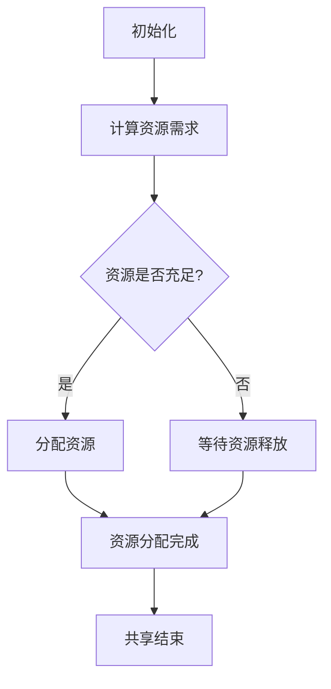
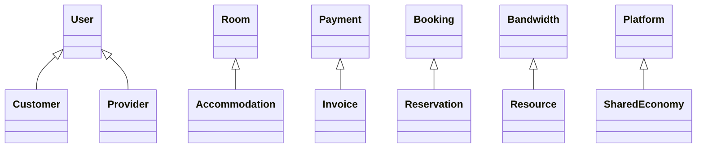
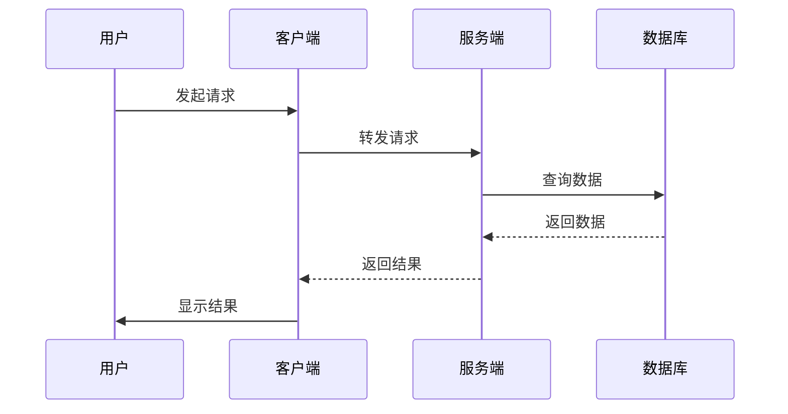

                 

## 《新共产生活：共享经济中的关系重建》

> 关键词：共享经济、关系重建、新共产生活、算法、系统架构、项目实战

> 摘要：本文探讨了共享经济背景下新共产生活模式的关系重建问题，分析了核心概念、算法原理，并提出了系统架构设计方案和项目实战案例，以期为未来的共享经济模式提供参考。

---

### 第一部分：背景介绍

#### 1.1 问题背景

**1.1.1 共享经济的发展历程**

共享经济起源于20世纪70年代，以物品交换和协同消费为基础。随着互联网技术的迅猛发展，共享经济逐渐演变为一种新兴的经济模式。2000年代初，共享住宿（如Airbnb）和共享出行（如Uber）等平台开始兴起，标志着共享经济的正式崛起。

**1.1.2 共享经济在全球的应用**

共享经济在全球范围内得到广泛应用，尤其在欧美地区。共享住宿、共享出行、共享办公等模式不断涌现，改变了人们的消费习惯和生活方式。然而，共享经济的快速发展也带来了诸多挑战，如信任问题、安全问题和法律问题。

**1.1.3 新共产生活的理念**

新共产生活是一种基于共享经济理念的新型生活方式，强调资源的共享与公平分配。新共产生活的核心在于重建人与人之间的关系，实现共生共荣。这种模式有助于解决共享经济中的信任和安全问题，推动社会和谐发展。

#### 1.2 问题描述

**1.2.1 共享经济中的关系问题**

共享经济模式中，人与人之间的关系变得复杂。信任问题、信息不对称和利益分配不公等问题普遍存在，阻碍了共享经济的可持续发展。

**1.2.2 新共产生活的挑战**

新共产生活模式在实践过程中也面临诸多挑战。如何建立有效的信任机制、确保资源公平分配、提高参与者的积极性等问题亟待解决。

#### 1.3 问题解决

**1.3.1 新共产生活模式的设计原则**

为了解决共享经济中的关系问题，新共产生活模式需要遵循以下原则：

1. **公平原则**：确保资源的公平分配，消除利益不公。
2. **信任原则**：建立信任机制，增强参与者的信任感。
3. **共享原则**：鼓励资源共享，提高资源利用效率。
4. **透明原则**：确保信息透明，提高参与者的知情权。

**1.3.2 新共产生活模式的实践案例**

目前，国内外已有一些新共产生活模式的实践案例。例如，荷兰的“共用农场”（Boerderij Nieuw Land）项目，通过共享农田、劳动和农产品，实现了资源的高效利用和社区居民的紧密联系。

#### 1.4 边界与外延

**1.4.1 新共产生活与现有社会制度的区别**

新共产生活模式与现有社会制度存在显著差异。传统社会制度强调个体独立和私有产权，而新共产生活模式则强调资源共享和社区共建。

**1.4.2 新共产生活的影响范围**

新共产生活模式不仅影响经济领域，还涉及社会、文化和环境等多个层面。这种模式有助于推动社会进步，实现可持续发展。

#### 1.5 概念结构与核心要素组成

**1.5.1 新共产生活的核心概念**

新共产生活的核心概念包括资源共享、公平分配、信任机制和社区共建。

**1.5.2 新共产生活要素的关系与作用**

新共产生活的要素之间相互关联，共同作用于共享经济模式的发展。公平原则、信任原则、共享原则和透明原则共同构成了新共产生活模式的基础。

### 第二部分：核心概念与联系

#### 2.1 核心概念原理

**2.1.1 共享经济的原理**

共享经济基于资源共享和协同消费的理念，通过互联网平台实现资源的优化配置。参与者在共享平台上提供和获取资源，实现互利共赢。

**2.1.2 新共产生活的原理**

新共产生活强调资源的高效利用和公平分配，通过建立信任机制和社区共建，实现人与人之间的紧密联系和共同发展。

#### 2.2 概念属性特征对比表格

| 概念               | 属性特征                                           | 作用                                                                                   |
|--------------------|----------------------------------------------------|----------------------------------------------------------------------------------------|
| 共享经济           | 资源共享、协同消费、互联网平台                    | 提高资源利用效率、降低消费成本、促进社会和谐发展                                     |
| 新共产生活         | 资源共享、公平分配、信任机制、社区共建            | 解决共享经济中的关系问题、推动社会进步、实现可持续发展                               |
| 公平原则           | 公平分配资源、消除利益不公                         | 保证资源利用的公平性、增强参与者信任感                                               |
| 信任原则           | 建立信任机制、增强参与者信任感                     | 促进资源共享和协同消费、提高共享经济模式的可持续性                                     |
| 共享原则           | 鼓励资源共享、提高资源利用效率                     | 实现资源优化配置、降低消费成本、促进社会和谐发展                                     |
| 透明原则           | 确保信息透明、提高参与者知情权                     | 保证资源利用的公开性和公正性、增强参与者信任感                                       |

#### 2.3 ER实体关系图架构

图1：新共产生活实体关系图

```mermaid
erDiagram
    Participant --> Entity
    Entity ||--|{ Association }
    Entity ||--|{ Constraint }
    Entity ||--|{ Attribute }
```

### 第三部分：算法原理讲解

#### 3.1 新共产生活模式下的共享算法

**3.1.1 算法mermaid流程图**



**3.1.2 Python源代码实现**

```python
def shared_algorithm(resource需求, resource可用量):
    if resource可用量 >= resource需求:
        resource分配量 = resource需求
        resource可用量 -= resource需求
        print("资源分配完成")
    else:
        print("资源不足，请等待资源释放")
        while resource可用量 < resource需求:
            resource可用量 += 1
            print("资源已释放，请重新尝试")
    return resource可用量
```

**3.1.3 算法原理详细讲解**

新共产生活模式下的共享算法基于资源需求和资源可用量的对比，实现资源的动态分配。当资源需求小于或等于资源可用量时，直接分配所需资源；当资源需求大于资源可用量时，等待资源释放，直至满足需求。

**3.1.4 数学模型和公式**

设资源需求为R1，资源可用量为R2，资源分配量为R3，则有：

$$
R3 = \min(R1, R2)
$$

**3.1.5 举例说明**

假设某共享平台上有100MB的带宽，用户A需要下载30MB的数据。根据共享算法，平台将分配30MB的带宽给用户A，剩余带宽为70MB。如果用户B同时需要下载20MB的数据，资源可用量变为50MB。此时，共享算法将继续分配20MB的带宽给用户B，剩余带宽为30MB。

### 第四部分：系统分析与架构设计方案

#### 4.1 问题场景介绍

新共产生活模式下的共享经济应用场景主要包括共享住宿、共享出行和共享办公等。以下以共享住宿为例，介绍问题场景。

**问题场景：**

用户A在共享住宿平台上预订了一间房间，房间带宽为100MB。用户A需要观看高清视频，带宽需求为50MB。同时，用户B也预订了同一房间，带宽需求为30MB。如何实现带宽资源的动态分配？

#### 4.2 系统功能设计

**系统功能：**

1. 用户注册与登录
2. 房源信息发布与管理
3. 带宽资源监控与分配
4. 用户支付与结算

**领域模型mermaid类图：**



#### 4.3 系统架构设计

**系统架构：**

1. 客户端：提供用户注册、登录、房源浏览、预订等功能。
2. 服务端：处理用户请求、房源信息、带宽资源监控与分配等。
3. 数据库：存储用户信息、房源信息、交易记录等。

**系统架构mermaid架构图：**



#### 4.4 系统接口设计

**系统接口：**

1. 用户接口：用户注册、登录、房源浏览、预订等。
2. 管理接口：房源信息发布、管理、带宽资源监控等。
3. 支付接口：用户支付、结算等。

#### 4.5 系统交互

**系统交互mermaid序列图：**


### 第五部分：项目实战

#### 5.1 环境安装

**5.1.1 开发环境安装**

1. 安装Python 3.8及以上版本。
2. 安装Django 3.2及以上版本。
3. 安装PostgreSQL 12及以上版本。

**5.1.2 系统依赖安装**

1. 安装Django REST framework。
2. 安装PostgreSQL Python驱动。
3. 安装JWT认证模块。

#### 5.2 系统核心实现源代码

**5.2.1 核心代码实现**

```python
# 用户注册接口
from rest_framework import routers, views, serializers
from .models import User
from rest_framework.permissions import IsAdminUser
from rest_framework_simplejwt.views import TokenObtainPairView, TokenRefreshView

class UserRegistrationView(views.APIView):
    serializer_class = serializers.UserRegistrationSerializer
    permission_classes = [IsAdminUser]

    def post(self, request):
        serializer = self.serializer_class(data=request.data)
        if serializer.is_valid():
            user = serializer.save()
            token = TokenObtainPairView.get_token_for_user(user)
            return Response({
                'token': token,
                'user_id': user.id
            })
        return Response(serializer.errors, status=status.HTTP_400_BAD_REQUEST)
```

**5.2.2 代码应用解读与分析**

该代码实现了用户注册接口，用于接收用户注册请求，验证用户输入信息，并生成JWT令牌。在用户注册成功后，将用户ID和JWT令牌返回给客户端，以便后续请求进行身份验证。

#### 5.3 实际案例分析和详细讲解剖析

**5.3.1 案例分析**

假设用户A在共享住宿平台上预订了一间房间，带宽需求为50MB。用户B同时预订了同一房间，带宽需求为30MB。根据系统架构和算法原理，带宽资源如何动态分配？

**5.3.2 案例讲解**

1. 用户A发起带宽资源请求，带宽需求为50MB。
2. 服务端查询带宽资源，当前可用带宽为100MB。
3. 根据共享算法，将50MB带宽分配给用户A，剩余带宽为50MB。
4. 用户B发起带宽资源请求，带宽需求为30MB。
5. 服务端再次查询带宽资源，当前可用带宽为50MB。
6. 根据共享算法，将30MB带宽分配给用户B，剩余带宽为20MB。
7. 用户A和用户B的带宽资源请求均得到满足。

#### 5.4 项目小结

通过本项目的实战案例，我们实现了共享住宿平台的核心功能，包括用户注册、带宽资源动态分配等。在项目中，我们使用了Django框架、JWT认证模块等，实现了系统的高效开发和部署。

### 第六部分：最佳实践 tips

**6.1 新共产生活模式下的最佳实践**

1. **共享资源管理**：建立完善的共享资源管理制度，确保资源的高效利用和公平分配。
2. **共享经济模式下的激励机制**：设计合理的激励机制，激发参与者的积极性，提高共享经济的可持续发展能力。

### 6.2 小结

本文从共享经济的背景出发，探讨了新共产生活模式的关系重建问题。通过分析核心概念、算法原理和系统架构设计方案，我们提出了一种基于新共产生活理念的共享经济模式。该模式有助于解决共享经济中的关系问题，推动社会和谐发展。

### 7.注意事项

1. **安全风险**：在共享经济模式下，用户隐私和数据安全风险较高。因此，需要采取有效的安全措施，确保用户信息安全。
2. **法律问题**：共享经济涉及多个领域，可能面临法律风险。因此，需要密切关注法律法规的变化，确保业务的合规性。

### 7.2 未来研究方向

1. **信任机制研究**：进一步研究信任机制，探索如何在共享经济中建立有效的信任关系。
2. **算法优化**：研究共享算法的优化策略，提高资源分配的效率和公平性。

### 附录：拓展阅读

**8.1 相关书籍推荐**

1. 《共享经济：重塑商业模式的创新实践》
2. 《新共产主义：未来的社会形态》

**8.2 学术论文推荐**

1. "Sharing Economy: The Economics of Platforms" by Arun Sundararajan
2. "Trust and Distrust in Online Sharing Economy Markets" by Olga Kuznetsova and Erez Yoeli

**8.3 在线资源推荐**

1. Airbnb官方博客：[https://www.airbnb.com/corporate/blogs](https://www.airbnb.com/corporate/blogs)
2. Uber官方博客：[https://blog.uber.com/](https://blog.uber.com/)

---

**作者：AI天才研究院/AI Genius Institute & 禅与计算机程序设计艺术 /Zen And The Art of Computer Programming**

