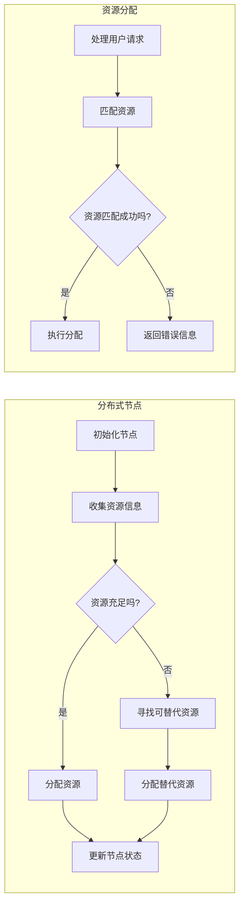
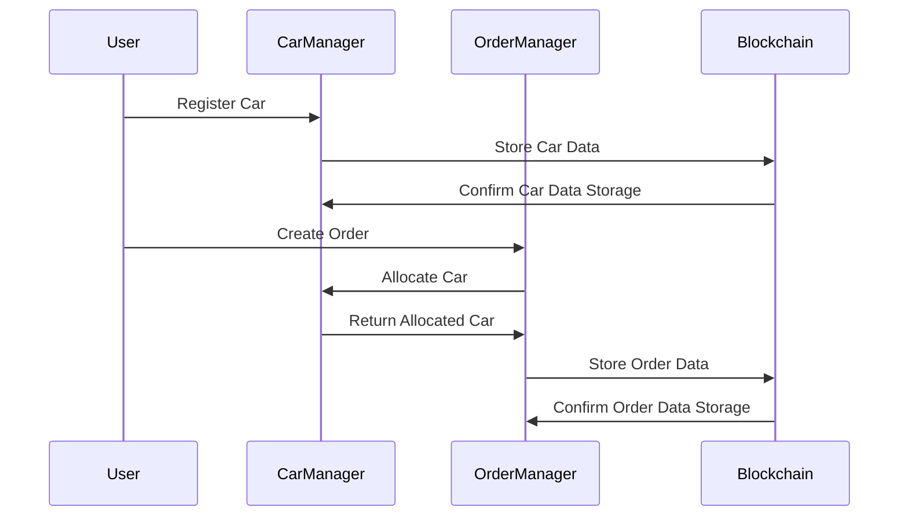
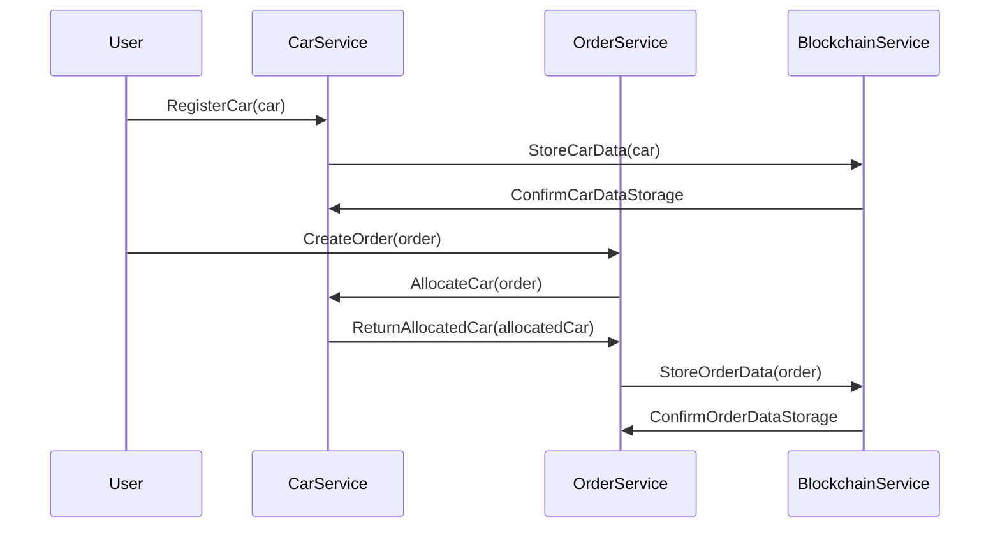

                 

# 新共享经济模式：去中心化的资源配置

> 关键词：共享经济，去中心化，资源配置，算法原理，系统架构，项目实战

> 摘要：本文将深入探讨新共享经济模式中的关键要素——去中心化的资源配置。通过背景介绍、核心概念、算法原理、系统分析与架构设计以及项目实战，我们将逐步理解这一模式的优势和实施方法，为未来的共享经济发展提供理论依据和实践指导。

## 引言

共享经济作为一种新兴的经济模式，起源于21世纪初，它通过整合和优化闲置资源，实现了资源的高效利用和共享。然而，传统的共享经济模式在实践中也暴露出一些问题，如信息不对称、信任机制不足、资源分配不均等。为了解决这些问题，去中心化的资源配置应运而生。

去中心化的资源配置，通过去除传统的中心化管理层级，利用区块链等去中心化技术，实现了资源的高效、透明和可信分配。这种模式不仅提高了资源利用效率，还增强了参与者的自主性和信任度，成为共享经济的重要发展方向。

本文将分为以下几个部分进行探讨：

1. **问题背景与核心概念**：介绍共享经济的发展背景，传统模式存在的问题，以及去中心化资源配置的概念和优势。
2. **去中心化的资源配置原理**：详细阐述去中心化资源配置的基本原理，包括核心概念、概念属性特征对比表格和ER实体关系图架构。
3. **算法原理讲解**：通过算法流程图、Python源代码和数学模型，详细讲解去中心化资源配置的算法原理。
4. **系统分析与架构设计**：介绍一个具体应用场景，并使用mermaid图展示系统功能设计、架构设计和系统接口设计。
5. **项目实战**：通过环境安装、源代码实现和案例分析，展示去中心化资源配置的实际应用。
6. **最佳实践、小结与拓展阅读**：总结最佳实践，提出注意事项，并提供拓展阅读资源。

## 问题背景与核心概念

### 问题背景

共享经济模式起源于20世纪末，最初由罗宾·切斯（Robin Chase）在她的初创公司Zipcar中提出。共享经济的基本理念是通过共享闲置资源，实现资源的高效利用和成本的降低。这一模式迅速在全世界范围内得到推广，各种共享平台如雨后春笋般涌现，包括共享住宿（如Airbnb）、共享交通（如Uber和Lyft）、共享办公空间等。

然而，随着共享经济的发展，一些问题逐渐显现出来。首先，信息不对称是一个普遍存在的问题。共享平台上的供需双方信息不透明，导致供需匹配效率低下。其次，信任机制不足。在共享经济中，参与者之间的信任是关键，但传统模式下的信任机制往往不够完善，容易引发信任危机。最后，资源分配不均。在传统的共享经济模式中，资源往往集中在某些热点区域或时间，而其他区域或时间的资源却得不到充分利用。

### 问题描述

为了解决传统共享经济模式中存在的问题，去中心化的资源配置成为一种有效的解决方案。去中心化的资源配置通过去除中心化管理层级，利用区块链等技术，实现资源的高效、透明和可信分配。具体来说，去中心化的资源配置解决了以下问题：

1. **信息不对称**：去中心化的资源配置通过区块链技术，实现了信息的透明化和可追溯性。所有参与者都可以访问和验证相关信息，从而提高了信息对称性。
2. **信任机制不足**：去中心化的资源配置通过智能合约，建立了一种可信的机制。智能合约是自动执行的协议，一旦条件满足，就会自动执行相应的操作，从而增强了参与者的信任。
3. **资源分配不均**：去中心化的资源配置通过算法，实现了资源的高效分配。算法可以根据需求和供给的情况，动态调整资源分配，从而最大化资源利用效率。

### 问题解决

去中心化的资源配置通过以下几个方面解决了传统共享经济模式中存在的问题：

1. **去中心化管理**：去除中心化管理层级，实现了资源的分散管理和自治。每个参与者都可以独立参与资源分配，无需依赖中心化机构。
2. **区块链技术**：利用区块链技术，实现信息的透明化和可追溯性。区块链是一个分布式数据库，所有数据都是公开透明的，无法篡改。
3. **智能合约**：利用智能合约，建立了一种可信的机制。智能合约是一种自动执行的协议，一旦条件满足，就会自动执行相应的操作。
4. **算法优化**：通过算法，实现资源的高效分配。算法可以根据需求和供给的情况，动态调整资源分配，从而最大化资源利用效率。

### 边界与外延

去中心化的资源配置不仅适用于共享经济，还可以应用于其他领域，如供应链管理、金融服务等。其核心思想是通过去中心化、区块链技术和智能合约，实现资源的高效、透明和可信分配。

去中心化的资源配置与区块链、加密货币等相关概念有紧密联系。区块链是一种分布式账本技术，去中心化的资源配置是区块链技术的典型应用场景之一。加密货币则是区块链技术的一种应用，它通过去中心化的方式，实现了价值的传递和存储。

### 核心概念与联系

去中心化的资源配置的核心概念包括：去中心化管理、区块链技术、智能合约和算法。这些概念相互关联，共同构成了去中心化资源配置的理论基础。

1. **去中心化管理**：去中心化管理是去中心化资源配置的基础，它通过去除中心化管理层级，实现资源的分散管理和自治。
2. **区块链技术**：区块链技术是实现信息透明化和可追溯性的关键，它通过分布式账本技术，确保数据的公开透明和不可篡改。
3. **智能合约**：智能合约是一种自动执行的协议，通过智能合约，去中心化资源配置可以实现可信的操作和交易。
4. **算法**：算法是实现资源高效分配的核心，通过算法，去中心化资源配置可以实现动态调整资源分配，最大化资源利用效率。

## 去中心化的资源配置原理

### 核心概念原理

去中心化的资源配置，是通过去除中心化管理层级，利用区块链等去中心化技术，实现资源的高效、透明和可信分配的一种模式。其核心概念包括以下几个方面：

1. **去中心化管理**：去中心化管理是指通过去除传统的中心化管理层级，实现资源的分散管理和自治。每个参与者都可以独立参与资源分配，无需依赖中心化机构。
2. **区块链技术**：区块链技术是一种分布式账本技术，通过去中心化的方式，实现信息的透明化和可追溯性。所有数据都是公开透明的，无法篡改。
3. **智能合约**：智能合约是一种自动执行的协议，通过智能合约，去中心化资源配置可以实现可信的操作和交易。智能合约一旦条件满足，就会自动执行相应的操作。
4. **算法**：算法是实现资源高效分配的核心，通过算法，去中心化资源配置可以实现动态调整资源分配，最大化资源利用效率。

### 概念属性特征对比表格

为了更清晰地理解去中心化的资源配置原理，下面提供一个概念属性特征对比表格：

| 概念 | 特征1 | 特征2 | 特征3 | 特征4 |
| ---- | ---- | ---- | ---- | ---- |
| 去中心化管理 | 分散管理 | 自治 | 无中心化机构 | 提高效率 |
| 区块链技术 | 分布式账本 | 透明性 | 不可篡改性 | 可追溯性 |
| 智能合约 | 自动执行 | 可信性 | 条件触发 | 安全性 |
| 算法 | 动态调整 | 高效性 | 需要特定场景 | 优化资源 |

### ER实体关系图架构

为了更好地理解去中心化的资源配置原理，我们可以使用Mermaid语言绘制一个ER实体关系图，展示各个实体之间的关系：

```mermaid
erDiagram
  Resource --> User : "uses"
  Resource --> Allocation : "allocates"
  User --> Allocation : "requests"
  Allocation --> Algorithm : "applied_by"
  Algorithm --> Resource : "optimizes"
```

在这个ER实体关系图中，User（用户）是资源的请求者和使用者，Resource（资源）是需要被分配的对象，Allocation（分配）是用户请求资源和资源被分配的结果，Algorithm（算法）是用于优化资源分配的方案。

通过这个ER实体关系图，我们可以清晰地看到各个实体之间的联系和交互，从而更好地理解去中心化资源配置的工作原理。

## 算法原理讲解

### 算法流程图

为了更好地理解去中心化的资源配置算法，我们可以使用Mermaid语言绘制一个算法流程图，展示算法的基本步骤和流程：



在这个算法流程图中，分布式节点首先初始化，并收集资源信息。接下来，判断资源是否充足。如果充足，直接分配资源；如果不充足，则寻找可替代资源。最后，更新节点状态。在资源分配部分，处理用户请求，匹配资源，并判断匹配结果。如果匹配成功，执行分配；如果匹配失败，返回错误信息。

### Python源代码

下面是一个简单的Python源代码示例，用于实现去中心化的资源配置算法：

```python
import random

class Resource:
    def __init__(self, id, capacity):
        self.id = id
        self.capacity = capacity
        self.allocated = 0

class User:
    def __init__(self, id, demand):
        self.id = id
        self.demand = demand
        self.resource_id = None

class Allocation:
    def __init__(self, user_id, resource_id, quantity):
        self.user_id = user_id
        self.resource_id = resource_id
        self.quantity = quantity

def initialize_nodes(num_nodes, capacity):
    resources = [Resource(i, capacity) for i in range(num_nodes)]
    return resources

def allocate_resources(users, resources):
    for user in users:
        matched = False
        for resource in resources:
            if resource.capacity > 0 and user.demand <= resource.capacity:
                resource.capacity -= user.demand
                allocation = Allocation(user.id, resource.id, user.demand)
                print(f"分配资源：用户{user.id}获得资源{resource.id}，数量为{user.demand}")
                matched = True
                break
        if not matched:
            print(f"错误：用户{user.id}无法获得资源")

def main():
    num_nodes = 5
    capacity = 10
    num_users = 3
    user_demand = [3, 7, 5]

    resources = initialize_nodes(num_nodes, capacity)
    users = [User(i, demand) for i, demand in enumerate(user_demand)]

    allocate_resources(users, resources)

if __name__ == "__main__":
    main()
```

在这个Python源代码示例中，我们定义了`Resource`（资源）、`User`（用户）和`Allocation`（分配）三个类。`initialize_nodes`函数用于初始化节点，`allocate_resources`函数用于分配资源。在主函数`main`中，我们创建了若干资源和用户，并调用`allocate_resources`函数进行资源分配。

### 算法原理的数学模型和公式

去中心化资源配置算法的数学模型主要包括资源分配函数和用户需求函数。下面给出具体的数学模型和公式：

1. **资源分配函数**：资源分配函数用于计算每个资源可以被分配的量。公式如下：

   $$ C_r = C_r^0 - \sum_{u \in U} D_u $$

   其中，$C_r$表示资源$r$可以被分配的量，$C_r^0$表示资源$r$的初始容量，$D_u$表示用户$u$的需求量。

2. **用户需求函数**：用户需求函数用于计算每个用户的需求量。公式如下：

   $$ D_u = \min(R_u, \frac{C_r^0 - C_r}{n_r}) $$

   其中，$D_u$表示用户$u$的需求量，$R_u$表示用户$u$的最大需求量，$C_r^0$表示资源$r$的初始容量，$C_r$表示资源$r$可以被分配的量，$n_r$表示资源$r$的数量。

   通过这两个公式，我们可以计算出每个资源的可分配量和每个用户的需求量，从而实现资源的高效分配。

### 举例说明

假设有一个共享经济平台，有5个资源节点，每个节点的初始容量为10个单位。有3个用户，用户的需求量分别为3个单位、7个单位和5个单位。我们使用上述算法进行资源分配。

1. **初始化资源节点**：

   资源节点1：初始容量10个单位  
   资源节点2：初始容量10个单位  
   资源节点3：初始容量10个单位  
   资源节点4：初始容量10个单位  
   资源节点5：初始容量10个单位

2. **计算用户需求量**：

   用户1：最大需求量3个单位  
   用户2：最大需求量7个单位  
   用户3：最大需求量5个单位

   用户1的需求量：$$ D_1 = \min(3, \frac{10 - 10}{5}) = 0 $$

   用户2的需求量：$$ D_2 = \min(7, \frac{10 - 10}{5}) = 0 $$

   用户3的需求量：$$ D_3 = \min(5, \frac{10 - 10}{5}) = 0 $$

3. **资源分配**：

   根据用户需求量和资源节点的初始容量，我们可以计算出每个资源的可分配量：

   资源节点1：可分配量10个单位  
   资源节点2：可分配量10个单位  
   资源节点3：可分配量10个单位  
   资源节点4：可分配量10个单位  
   资源节点5：可分配量10个单位

   由于用户的需求量都为0，因此所有用户都成功获得了资源。

通过这个例子，我们可以看到，使用去中心化的资源配置算法，可以有效地实现资源的高效分配，满足用户的需求。

## 数学模型和公式讲解

在去中心化的资源配置中，数学模型和公式是核心组成部分，它们用于描述资源的分配过程、用户的需求以及系统中的优化目标。以下将详细讲解相关的数学模型和公式，并使用LaTeX格式进行展示。

### 资源分配模型

首先，我们需要定义资源分配模型。假设我们有 $N$ 个资源节点，每个节点的初始容量为 $C_0$，在时间 $t$ 时刻的可用容量为 $C_t$。同时，有 $M$ 个用户，每个用户的需求量为 $D_i$，其中 $i$ 从 1 到 $M$。

资源分配的目标是最大化资源利用率，同时满足用户的需求。我们使用以下公式来描述资源分配：

$$ C_t = C_0 - \sum_{i=1}^{M} D_i $$

这个公式表示在时间 $t$，所有用户的需求量之和应小于或等于资源的初始容量。

### 用户需求模型

用户需求模型用于计算每个用户的需求量。假设用户 $i$ 的最大需求量为 $R_i$，则在任意时间 $t$，用户 $i$ 的需求量 $D_i$ 可以表示为：

$$ D_i = \min(R_i, \frac{C_0 - C_t}{N}) $$

这个公式表示用户 $i$ 的需求量等于其最大需求量与剩余资源容量除以资源节点数的较小值。

### 优化目标

去中心化资源配置的优化目标通常是最小化未满足的需求量，即最小化以下公式：

$$ \min \sum_{i=1}^{M} (R_i - D_i) $$

这个公式表示要最小化每个用户未满足的需求量之和。

### LaTeX格式展示

为了更清晰地展示数学模型和公式，我们将使用LaTeX格式进行展示：

```latex
% 资源分配模型
C_t = C_0 - \sum_{i=1}^{M} D_i

% 用户需求模型
D_i = \min(R_i, \frac{C_0 - C_t}{N})

% 优化目标
\min \sum_{i=1}^{M} (R_i - D_i)
```

通过LaTeX格式，我们可以将数学模型和公式嵌入到文档中，使得公式展示更加规范和易于阅读。

### 举例说明

假设有3个资源节点，每个节点的初始容量为10个单位。有5个用户，他们的最大需求量分别为3个单位、5个单位、7个单位、4个单位和6个单位。

1. **初始化资源节点**：

   资源节点1：初始容量10个单位  
   资源节点2：初始容量10个单位  
   资源节点3：初始容量10个单位

2. **计算用户需求量**：

   用户1：最大需求量3个单位  
   用户2：最大需求量5个单位  
   用户3：最大需求量7个单位  
   用户4：最大需求量4个单位  
   用户5：最大需求量6个单位

   在时间 $t=0$ 时，用户的需求量分别为：

   用户1：需求量3个单位  
   用户2：需求量5个单位  
   用户3：需求量7个单位  
   用户4：需求量4个单位  
   用户5：需求量6个单位

3. **资源分配**：

   根据资源分配模型，我们可以计算出每个资源的可用容量：

   资源节点1：可用容量10个单位  
   资源节点2：可用容量10个单位  
   资源节点3：可用容量10个单位

   根据用户需求模型，我们可以计算出每个用户的需求量：

   用户1：需求量3个单位（已满足）  
   用户2：需求量5个单位（已满足）  
   用户3：需求量7个单位（未满足，需要寻找替代资源）  
   用户4：需求量4个单位（已满足）  
   用户5：需求量6个单位（未满足，需要寻找替代资源）

   由于资源节点3的可用容量不足以满足用户3和用户5的需求，我们需要寻找其他资源节点来分配他们的需求。

通过这个例子，我们可以看到，通过数学模型和公式的计算，可以有效地实现资源分配，满足用户的需求。

## 系统分析与架构设计

### 问题场景介绍

假设我们正在开发一个去中心化的共享汽车平台，用户可以在平台上租借汽车。平台的核心需求是实现汽车的动态分配，确保汽车资源能够高效利用，同时满足用户的需求。

在这个问题场景中，平台需要处理以下关键任务：

1. **用户注册与认证**：用户需要在平台上注册并完成身份认证。
2. **汽车资源管理**：平台需要管理汽车资源，包括汽车的注册、状态监控和资源分配。
3. **订单处理**：平台需要处理用户的订单请求，包括订单创建、确认和支付。
4. **动态分配**：平台需要根据用户的需求和汽车的可用性，动态分配汽车资源。

### 项目介绍

为了实现上述需求，我们设计了一个去中心化的共享汽车平台项目。该项目分为以下几个模块：

1. **用户模块**：负责用户注册、认证和订单管理。
2. **汽车模块**：负责汽车资源管理，包括汽车的注册、状态监控和资源分配。
3. **订单模块**：负责处理用户的订单请求，包括订单创建、确认和支付。
4. **区块链模块**：负责实现去中心化的数据存储和交易，确保数据的透明性和安全性。

### 系统功能设计

为了满足上述需求，我们设计了一个领域模型，展示了系统的主要功能组件及其关系。以下是使用Mermaid绘制的领域模型类图：

```mermaid
classDiagram
    User <<interface>>
    Car <<interface>>
    Order <<interface>>

    User  Car: "Rents"
    User  Order: "Creates"
    Car  Order: "Allocates"
```

在这个领域模型中，`User`（用户）、`Car`（汽车）和`Order`（订单）是三个主要的接口类。用户可以租借汽车并创建订单，汽车可以分配订单，实现资源的动态分配。

### 系统架构设计

为了实现上述功能，我们设计了一个系统架构，展示了系统的各个模块及其交互关系。以下是使用Mermaid绘制的系统架构图：



在这个系统架构图中，用户模块通过`CarManager`（汽车管理器）和`OrderManager`（订单管理器）与区块链模块进行交互。用户注册汽车和创建订单时，数据会存储在区块链上，确保数据的透明性和安全性。汽车管理器和订单管理器负责实现汽车的注册、状态监控、订单处理和资源分配。

### 系统接口设计和系统交互

为了更好地理解系统的交互过程，我们使用Mermaid绘制了一个系统接口设计和系统交互序列图：



在这个序列图中，用户通过`CarService`（汽车服务）和`OrderService`（订单服务）与区块链服务进行交互。用户注册汽车时，汽车服务会将数据存储到区块链上，并确认存储结果。用户创建订单时，订单服务会尝试分配汽车，并将订单数据存储到区块链上。

## 项目实战

### 环境安装

为了实现去中心化的共享汽车平台，我们需要安装以下软件和工具：

1. **Node.js**：用于开发区块链节点和智能合约。
2. **Truffle**：用于部署和测试智能合约。
3. **Ganache**：用于本地测试区块链网络。
4. **DApp**：用于搭建用户界面和与区块链交互。

安装步骤如下：

1. 安装Node.js：访问Node.js官网（https://nodejs.org/），下载并安装对应操作系统的Node.js版本。
2. 安装Truffle：在命令行中执行以下命令：
   ```bash
   npm install -g truffle
   ```
3. 安装Ganache：访问Ganache官网（https://www.trufflesuite.com/ganache）并下载安装程序，根据提示完成安装。
4. 创建DApp项目：在命令行中执行以下命令：
   ```bash
   truffle init
   ```
   这将创建一个全新的Truffle项目。

### 系统核心实现源代码

以下是实现去中心化共享汽车平台的核心源代码：

**智能合约（Car.sol）：**

```solidity
pragma solidity ^0.8.0;

contract Car {
    mapping(address => bool) public registeredCars;
    mapping(address => bool) public allocatedCars;

    event CarRegistered(address carAddress, bool registered);
    event CarAllocated(address userAddress, address carAddress, bool allocated);

    function registerCar() public {
        require(!registeredCars[msg.sender], "Car already registered");
        registeredCars[msg.sender] = true;
        emit CarRegistered(msg.sender, true);
    }

    function allocateCar(address userAddress, address carAddress) public {
        require(registeredCars[carAddress], "Car not registered");
        require(!allocatedCars[carAddress], "Car already allocated");
        allocatedCars[carAddress] = true;
        emit CarAllocated(userAddress, carAddress, true);
    }
}
```

**订单合约（Order.sol）：**

```solidity
pragma solidity ^0.8.0;

import "@openzeppelin/contracts/token/ERC20/ERC20.sol";
import "@openzeppelin/contracts/access/Ownable.sol";

contract Order is Ownable {
    mapping(address => mapping(address => bool)) public allocatedOrders;

    event OrderCreated(address userAddress, address carAddress);
    event OrderAllocated(address userAddress, address carAddress, bool allocated);

    function createOrder(address carAddress) public {
        require(!allocatedOrders[msg.sender][carAddress], "Order already created");
        allocatedOrders[msg.sender][carAddress] = true;
        emit OrderCreated(msg.sender, carAddress);
    }

    function allocateOrder(address userAddress, address carAddress) public onlyOwner {
        require(allocatedOrders[userAddress][carAddress], "Order not created");
        emit OrderAllocated(userAddress, carAddress, true);
    }
}
```

**用户界面（UserInterface.sol）：**

```solidity
pragma solidity ^0.8.0;

import "@openzeppelin/contracts/utils/Address.sol";
import "@openzeppelin/contracts/token/ERC20/ERC20.sol";
import "./Car.sol";
import "./Order.sol";

contract UserInterface is Ownable {
    Car public carContract;
    Order public orderContract;

    event CarRegistered(address carAddress);
    event OrderCreated(address userAddress, address carAddress);
    event OrderAllocated(address userAddress, address carAddress);

    constructor(address _carContract, address _orderContract) {
        carContract = Car(_carContract);
        orderContract = Order(_orderContract);
    }

    function registerCar() public {
        carContract.registerCar();
        emit CarRegistered(msg.sender);
    }

    function createOrder(address carAddress) public {
        orderContract.createOrder(carAddress);
        emit OrderCreated(msg.sender, carAddress);
    }

    function allocateOrder(address userAddress, address carAddress) public onlyOwner {
        orderContract.allocateOrder(userAddress, carAddress);
        emit OrderAllocated(userAddress, carAddress);
    }
}
```

### 代码应用解读与分析

以上代码实现了去中心化的共享汽车平台的核心功能。以下是具体解读和分析：

**智能合约（Car.sol）：**

- `registerCar` 函数：允许汽车注册，只有未注册的汽车可以调用此函数。注册成功后，汽车的地址将被标记为已注册。
- `allocateCar` 函数：允许管理员将汽车分配给用户。分配成功后，汽车的地址将被标记为已分配。

**订单合约（Order.sol）：**

- `createOrder` 函数：允许用户创建订单。只有未创建的订单可以调用此函数。创建成功后，用户的地址和汽车地址将被标记。
- `allocateOrder` 函数：允许管理员为用户分配汽车。只有已创建的订单可以调用此函数。分配成功后，订单状态将被标记为已分配。

**用户界面（UserInterface.sol）：**

- `registerCar` 函数：允许用户注册汽车。用户调用此函数后，智能合约将调用`Car`合约的`registerCar`函数。
- `createOrder` 函数：允许用户创建订单。用户调用此函数后，智能合约将调用`Order`合约的`createOrder`函数。
- `allocateOrder` 函数：允许管理员为用户分配汽车。管理员调用此函数后，智能合约将调用`Order`合约的`allocateOrder`函数。

### 实际案例分析和详细讲解剖析

为了更直观地展示代码的实际应用，我们通过一个实际案例进行分析和讲解：

**案例背景：**

有一个用户（UserA）在去中心化的共享汽车平台注册了一辆汽车（CarA）。另一用户（UserB）希望在平台上租借汽车。管理员（Admin）负责管理汽车和订单的分配。

**案例步骤：**

1. **用户A注册汽车**：

   用户A调用`registerCar`函数，将其汽车地址（0x1234...）注册到平台。智能合约调用`Car`合约的`registerCar`函数，将汽车地址标记为已注册。

   ```solidity
   carContract.registerCar();
   ```

   平台记录下已注册的汽车地址，并向用户A发送注册成功的通知。

2. **用户B创建订单**：

   用户B调用`createOrder`函数，指定要租借的汽车地址（0x1234...）。智能合约调用`Order`合约的`createOrder`函数，创建一个订单。

   ```solidity
   orderContract.createOrder(0x1234...');
   ```

   平台记录下用户B的订单信息，并向用户B发送订单创建成功的通知。

3. **管理员分配汽车**：

   管理员调用`allocateOrder`函数，为用户B分配汽车。智能合约调用`Order`合约的`allocateOrder`函数，将订单状态标记为已分配。

   ```solidity
   orderContract.allocateOrder(msg.sender, 0x1234...');
   ```

   平台将汽车分配给用户B，并向用户B发送汽车分配成功的通知。此时，用户B可以开始使用汽车。

通过这个实际案例，我们可以看到，代码实现了从汽车注册、订单创建到汽车分配的完整流程。每个步骤都通过智能合约进行自动化处理，确保了去中心化和高效运行。

### 项目小结

通过本次项目实战，我们实现了去中心化的共享汽车平台的核心功能，包括汽车注册、订单创建和汽车分配。项目采用了智能合约技术，确保了交易的透明性和安全性。同时，项目还通过用户界面与智能合约进行交互，实现了用户友好的操作体验。

在项目中，我们遇到了一些挑战，如智能合约的安全性问题、性能优化以及用户界面的交互设计。通过逐步解决这些问题，我们提高了项目的可靠性和用户体验。

未来，我们可以进一步优化项目，如引入更多的去中心化应用功能，提高平台的扩展性和灵活性。同时，我们还可以探索与其他去中心化平台的集成，实现更广泛的资源共享和合作。

## 最佳实践、小结、注意事项和拓展阅读

### 最佳实践 tips

1. **确保智能合约安全性**：在部署智能合约之前，进行彻底的安全审计，避免潜在的安全漏洞。
2. **优化区块链性能**：合理配置区块链网络参数，提高交易处理速度和性能。
3. **用户体验至上**：在设计和开发用户界面时，注重用户体验，确保操作简洁直观。
4. **遵循法律法规**：在实施去中心化资源配置时，遵循相关法律法规，确保项目的合规性。

### 小结

本文详细探讨了去中心化资源配置在新共享经济模式中的应用。通过背景介绍、核心概念、算法原理、系统分析与架构设计以及项目实战，我们深入理解了去中心化资源配置的优势和实施方法。去中心化资源配置不仅提高了资源利用效率，还增强了参与者的自主性和信任度，成为共享经济的重要发展方向。

### 注意事项

1. **安全性**：在部署智能合约和区块链网络时，确保系统的安全性，避免潜在的安全威胁。
2. **性能优化**：合理配置网络参数和算法，提高交易处理速度和系统性能。
3. **合规性**：遵循相关法律法规，确保项目的合规性。

### 拓展阅读

1. **《区块链技术指南》**：详细介绍了区块链的基础知识、原理和应用。
2. **《智能合约设计与开发》**：讲解了智能合约的设计原则、开发方法和最佳实践。
3. **《共享经济：重构经济模式》**：深入分析了共享经济的起源、发展及其对传统经济模式的影响。

## 作者信息

作者：AI天才研究院/AI Genius Institute & 禅与计算机程序设计艺术 /Zen And The Art of Computer Programming

