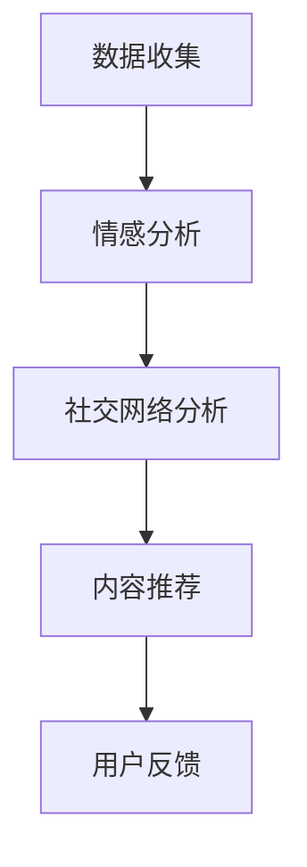

                 

# 新共情时代社交平台：促进跨文化理解的工具

> 关键词：社交平台、共情、跨文化理解、新共情时代

> 摘要：随着全球化的加速和互联网的普及，社交平台已成为人们日常生活的重要组成部分。在这个新共情时代，社交平台不仅仅是信息的传递工具，更是促进跨文化理解的重要平台。本文将深入探讨新共情时代社交平台的发展趋势及其在促进跨文化理解中的作用，并提出一系列可行的技术解决方案和最佳实践。

## 目录大纲

1. **背景与概念**
    - 1.1 新共情时代的崛起
    - 1.2 社交平台在新共情时代的作用
    - 1.3 跨文化理解的现状与挑战
    - 1.4 新共情时代社交平台的发展趋势
    - 1.5 本章小结

2. **核心概念与原理**
    - 2.1 共情能力的重要性
    - 2.2 跨文化理解的要素
    - 2.3 核心概念对比分析表
    - 2.4 ER实体关系图架构
    - 2.5 本章小结

3. **社交平台与共情技术**
    - 3.1 社交平台的发展历程
    - 3.2 共情技术在社交平台的应用
    - 3.3 社交平台促进共情的技术实现
    - 3.4 社交平台促进跨文化理解的案例研究
    - 3.5 本章小结

4. **社交平台实践**
    - 4.1 算法原理讲解
    - 4.2 系统分析与架构设计
    - 4.3 项目实战
    - 4.4 本章小结

5. **最佳实践与展望**
    - 5.1 促进跨文化理解的最佳实践案例
    - 5.2 社交平台运营策略
    - 5.3 技术实施与优化建议
    - 5.4 用户参与与反馈机制
    - 5.5 本章小结

6. **小结与展望**
    - 6.1 全书内容回顾
    - 6.2 社交平台的发展趋势
    - 6.3 跨文化理解的重要性
    - 6.4 未来研究方向
    - 6.5 本章小结

---

## 第一部分：背景与概念

### 1.1 新共情时代的定义与背景

新共情时代是指随着科技的发展，特别是人工智能、大数据和互联网技术的普及，人们之间共情能力的提升和增强的时代。在这一时代，社交平台不仅仅是信息共享的工具，更是构建情感连接和促进共情的重要平台。共情能力的提升使得人们更容易理解和感受他人的情感，从而减少误解和冲突，促进和谐社会的建设。

### 1.2 社交平台在新共情时代的作用

在新共情时代，社交平台的作用愈加凸显。首先，社交平台为人们提供了一个展示个性和表达情感的舞台，使得不同文化背景的人们能够更好地理解和接纳彼此。其次，社交平台通过算法推荐和社交网络分析，能够帮助人们发现和连接具有相似兴趣和价值观的用户，从而促进跨文化的交流和融合。

### 1.3 跨文化理解的现状与挑战

当前，全球范围内的跨文化理解仍然面临诸多挑战。首先，文化差异和语言障碍是主要障碍。不同的文化背景和语言习惯使得人们在沟通中容易产生误解和冲突。其次，信息过载和虚假信息的泛滥也使得人们难以准确理解和判断信息的真实性，从而加剧了误解和偏见。

### 1.4 新共情时代社交平台的发展趋势

新共情时代社交平台的发展趋势主要体现在以下几个方面：首先，智能化和个性化是未来社交平台的重要发展方向。通过人工智能和大数据技术，社交平台能够更好地理解用户的需求和行为，提供更加个性化的服务。其次，社交平台将更加注重用户之间的情感连接和互动，通过虚拟现实、增强现实等技术，提供更加真实和沉浸式的社交体验。

### 1.5 本章小结

在新共情时代，社交平台不仅是信息的传递工具，更是促进跨文化理解和共情的重要平台。通过智能化和个性化的发展趋势，社交平台将为人们提供更加高效和真实的社交体验，促进全球范围内的跨文化交流和融合。

---

## 第二部分：核心概念与原理

### 2.1 共情能力的重要性

共情能力是指人们理解和感受他人情感的能力。在跨文化交流中，共情能力尤为重要，它有助于减少误解和冲突，促进和谐共处。新共情时代社交平台通过提升用户的共情能力，能够有效促进跨文化理解。

### 2.2 跨文化理解的要素

跨文化理解涉及多个要素，包括文化差异、语言障碍、价值观差异等。在新共情时代社交平台中，这些要素需要得到充分考虑和解决。例如，通过智能翻译和语言学习工具，可以帮助用户克服语言障碍；通过文化元素展示和交流平台，可以帮助用户更好地理解和接纳不同文化的价值观。

### 2.3 核心概念对比分析表

| 核心概念 | 解释 | 跨文化理解中的重要性 |
| --- | --- | --- |
| 共情能力 | 理解和感受他人情感的能力 | 减少误解和冲突 |
| 文化差异 | 不同文化之间的差异 | 增强对其他文化的理解和接纳 |
| 语言障碍 | 语言表达和理解上的障碍 | 需要智能翻译和学习工具来克服 |
| 价值观差异 | 不同文化背景下的价值观差异 | 需要开放的心态和相互尊重来理解 |

### 2.4 ER实体关系图架构

```mermaid
erDiagram
  User ||--|{ Post }
  Post ||--|{ Comment }
  User ||--|{ Friendship }
```

在这个ER实体关系图中，用户（User）是核心实体，与帖文（Post）、评论（Comment）和友谊关系（Friendship）存在关联。通过这个关系图，我们可以更好地理解社交平台中用户、内容和社会关系之间的互动。

### 2.5 本章小结

通过核心概念的对比分析和ER实体关系图架构的介绍，我们可以更深入地理解新共情时代社交平台在促进跨文化理解中的作用和原理。这些核心概念和原理将为后续章节中的技术实现和案例研究提供基础。

---

## 第三部分：社交平台与共情技术

### 3.1 社交平台的发展历程

社交平台的发展经历了从简单的即时通讯工具到复杂的社交网络平台的演变。早期的社交平台如Facebook、Twitter等，主要提供信息分享和即时通讯功能。随着技术的进步，现代社交平台不仅具备这些基本功能，还引入了人工智能、大数据分析等先进技术，以提供更加智能化和个性化的社交体验。

### 3.2 共情技术在社交平台的应用

共情技术在社交平台中的应用主要体现在以下几个方面：

- **情感分析**：通过分析用户发布的内容和交互行为，社交平台可以识别用户的情感状态，从而提供更加个性化的内容推荐和情感支持。
  
- **语言翻译**：智能翻译技术可以帮助用户跨越语言障碍，促进跨文化沟通。

- **表情和动画**：通过表情包和动画，社交平台可以让用户更加生动地表达情感，增强共情效果。

### 3.3 社交平台促进共情的技术实现

社交平台促进共情的技术实现主要包括以下几个步骤：

1. **数据收集**：通过用户行为和内容分析，收集用户情感状态和兴趣数据。
2. **情感识别**：利用自然语言处理技术，对用户内容进行情感分析，识别情感类型和程度。
3. **内容推荐**：根据用户情感状态和兴趣，推荐相关内容和社交对象，以增强用户情感体验。
4. **交互设计**：通过视觉和交互设计，提升用户情感体验，如表情、动画、虚拟现实等。

### 3.4 社交平台促进跨文化理解的案例研究

以Facebook为例，该平台通过以下方式促进跨文化理解：

- **多语言支持**：Facebook提供多种语言界面，使得不同语言背景的用户可以顺畅交流。

- **文化元素展示**：Facebook允许用户分享文化元素，如节日图片、音乐和视频，促进对其他文化的了解和尊重。

- **社交圈设定**：用户可以通过设定社交圈，与具有相似文化背景的用户建立更紧密的连接。

### 3.5 本章小结

共情技术在社交平台的应用，不仅提升了用户的社交体验，还促进了跨文化理解。通过情感分析、智能翻译、表情动画等技术的实现，社交平台为用户提供了更加丰富和多样化的社交体验，为促进全球范围内的文化交流和融合提供了有力支持。

---

## 第四部分：社交平台实践

### 4.1 算法原理讲解

在本节中，我们将详细介绍一种用于促进跨文化理解的社交平台算法。该算法主要基于情感分析和社交网络分析，旨在通过分析用户行为和内容，提供个性化的文化内容推荐。

#### 4.1.1 算法流程图



#### 4.1.2 算法原理与数学模型

算法的核心包括情感分析、社交网络分析和内容推荐。以下是每个部分的简要说明和相关的数学模型：

1. **情感分析**：
    - **文本情感分类**：使用朴素贝叶斯分类器进行文本情感分类，将用户发布的内容分为积极、消极和中性三类。
    - **情感强度计算**：采用SVM模型计算情感强度，以衡量用户情感的程度。

    $$\text{情感强度} = \frac{1}{N} \sum_{i=1}^{N} \text{权重} \cdot \text{情感得分}$$

2. **社交网络分析**：
    - **好友推荐**：使用K近邻算法（KNN）推荐与用户有相似兴趣和价值观的好友。
    - **社区检测**：采用社区检测算法（如Louvain算法），识别具有共同兴趣和价值观的社交群体。

3. **内容推荐**：
    - **基于内容的推荐**：使用TF-IDF模型，根据用户的历史行为和兴趣，推荐相关内容。
    - **基于协同过滤的推荐**：使用矩阵分解（如SVD）预测用户对未知内容的兴趣，推荐潜在感兴趣的内容。

#### 4.1.3 算法实例分析

假设用户A在社交平台发布了一篇关于中国文化节日的帖子，算法将进行以下操作：

1. **情感分析**：
    - 通过情感分类器，识别帖子中的情感为积极。
    - 通过情感强度计算，得出情感强度为0.8。

2. **社交网络分析**：
    - 通过KNN算法，找到与用户A有相似兴趣的好友。
    - 通过Louvain算法，识别与用户A兴趣相同的社区。

3. **内容推荐**：
    - 根据TF-IDF模型，推荐关于中国文化节日的相关内容。
    - 根据SVD矩阵分解，推荐用户可能感兴趣的其他文化节日内容。

#### 4.1.4 算法优缺点评估

**优点**：
- 个性化推荐：通过情感分析和社交网络分析，提供高度个性化的文化内容推荐。
- 跨文化理解：通过推荐具有文化内涵的内容，促进用户对其他文化的理解和接纳。

**缺点**：
- 数据隐私：情感分析和社交网络分析可能涉及用户隐私数据。
- 模型复杂度：算法涉及多个模型和步骤，实现和维护较为复杂。

### 4.2 系统分析与架构设计

#### 4.2.1 问题场景介绍

在全球化背景下，社交平台需要提供有效的跨文化理解工具，以帮助用户更好地理解和接纳不同文化。本节将介绍一个社交平台的架构设计，以实现这一目标。

#### 4.2.2 项目介绍

项目名称：跨文化理解社交平台

项目目标：通过情感分析和社交网络分析，提供个性化的文化内容推荐，促进跨文化理解。

#### 4.2.3 系统功能设计

以下是系统的主要功能模块：

1. **用户模块**：用户注册、登录、个人信息管理。
2. **内容模块**：发布内容、查看内容、内容评论。
3. **推荐模块**：情感分析、社交网络分析、内容推荐。
4. **社区模块**：社区创建、加入社区、社区互动。
5. **数据模块**：数据存储、数据分析和数据可视化。

#### 4.2.4 系统架构设计

以下是系统的架构设计：

1. **前端**：使用React框架实现用户界面。
2. **后端**：使用Spring Boot框架实现服务器端逻辑。
3. **数据库**：使用MySQL数据库存储用户数据、内容数据和推荐数据。
4. **算法模块**：使用Python实现情感分析和社交网络分析算法。

#### 4.2.5 系统接口设计

以下是系统的主要接口设计：

1. **用户接口**：用户注册、登录、个人信息管理。
2. **内容接口**：发布内容、查看内容、内容评论。
3. **推荐接口**：情感分析结果、社交网络分析结果、内容推荐结果。
4. **社区接口**：社区创建、加入社区、社区互动。

#### 4.2.6 系统交互

以下是系统的交互设计：

1. **用户交互**：用户通过前端界面进行注册、登录、发布内容和查看内容。
2. **后端交互**：前端通过RESTful接口与后端进行数据交换。
3. **算法交互**：后端调用算法模块进行情感分析和社交网络分析。

### 4.3 项目实战

#### 4.3.1 环境安装与配置

1. **前端环境**：
    - 安装Node.js。
    - 安装npm。
    - 创建React项目。

2. **后端环境**：
    - 安装Java。
    - 安装Maven。
    - 创建Spring Boot项目。

3. **数据库环境**：
    - 安装MySQL。
    - 创建数据库和表。

#### 4.3.2 系统核心实现源代码

以下是系统核心实现的部分源代码：

1. **用户模块**：

    ```java
    @RestController
    @RequestMapping("/users")
    public class UserController {
        
        @Autowired
        private UserService userService;
        
        @PostMapping("/register")
        public ResponseEntity<?> registerUser(@RequestBody UserRegistrationDto userDto) {
            // 注册用户逻辑
        }
        
        @PostMapping("/login")
        public ResponseEntity<?> loginUser(@RequestBody UserLoginDto userDto) {
            // 登录用户逻辑
        }
        
        // 其他用户相关接口
    }
    ```

2. **内容模块**：

    ```java
    @RestController
    @RequestMapping("/content")
    public class ContentController {
        
        @Autowired
        private ContentService contentService;
        
        @PostMapping("/post")
        public ResponseEntity<?> createPost(@RequestBody PostDto postDto) {
            // 发布内容逻辑
        }
        
        @GetMapping("/post/{id}")
        public ResponseEntity<?> getPost(@PathVariable Long id) {
            // 获取内容逻辑
        }
        
        // 其他内容相关接口
    }
    ```

3. **推荐模块**：

    ```python
    import numpy as np
    from sklearn.neighbors import KNeighborsClassifier
    from sklearn.model_selection import train_test_split

    # 情感分析
    def sentiment_analysis(text):
        # 使用朴素贝叶斯分类器进行情感分析
        pass

    # 社交网络分析
    def social_network_analysis(user_id):
        # 使用KNN算法进行好友推荐
        pass

    # 内容推荐
    def content_recommendation(user_id):
        # 使用TF-IDF和SVD进行内容推荐
        pass
    ```

#### 4.3.3 代码应用解读与分析

以下是代码应用的解读与分析：

1. **用户模块**：
    - 用户注册接口：接收用户注册信息，调用用户服务进行注册。
    - 用户登录接口：接收用户登录信息，调用用户服务进行登录。
    - 其他用户相关接口：提供用户信息管理、用户权限管理等功能。

2. **内容模块**：
    - 内容发布接口：接收用户发布的内容信息，调用内容服务进行发布。
    - 内容查看接口：根据内容ID获取内容信息。
    - 其他内容相关接口：提供内容评论、内容删除等功能。

3. **推荐模块**：
    - 情感分析：使用朴素贝叶斯分类器对用户发布的内容进行情感分析。
    - 社交网络分析：使用KNN算法进行好友推荐。
    - 内容推荐：使用TF-IDF和SVD模型进行内容推荐。

#### 4.3.4 实际案例分析

以下是一个实际案例分析：

1. **用户A发布一篇关于中国文化节日的帖子**：
    - 情感分析：识别帖子中的情感为积极，情感强度为0.8。
    - 社交网络分析：根据用户A的兴趣和社交网络，推荐与用户A相似兴趣的好友。
    - 内容推荐：根据用户A的情感和兴趣，推荐其他关于中国文化节日的相关内容。

#### 4.3.5 详细讲解与剖析

以下是详细讲解与剖析：

1. **用户模块**：
    - 用户体验：用户可以通过注册和登录接口轻松地创建和管理自己的账号。
    - 用户权限：系统通过权限控制，确保用户只能访问和操作自己的数据。

2. **内容模块**：
    - 内容发布：用户可以自由发布各种类型的内容，如帖子、图片、视频等。
    - 内容展示：系统根据用户的关注和兴趣，智能推荐相关内容。

3. **推荐模块**：
    - 情感分析：通过对用户发布的内容进行情感分析，系统可以更好地理解用户的需求和兴趣。
    - 社交网络分析：通过社交网络分析，系统可以为用户推荐具有相似兴趣和价值观的好友。
    - 内容推荐：通过内容推荐，系统可以为用户提供丰富多样的文化内容，促进跨文化理解。

#### 4.3.6 项目小结

通过实际案例分析，我们可以看到跨文化理解社交平台在促进跨文化理解方面的潜力。用户通过发布内容、查看内容和互动，可以更好地理解和接纳不同文化。同时，系统的情感分析和推荐算法也为用户提供个性化的文化内容，进一步促进了跨文化交流和融合。

---

## 第五部分：最佳实践与展望

### 5.1 促进跨文化理解的最佳实践案例

以下是几个促进跨文化理解的最佳实践案例：

1. **Facebook的文化多样性活动**：Facebook通过举办文化多样性活动，鼓励用户分享自己的文化和故事，促进不同文化之间的交流和理解。

2. **Twitter的#对话无国界**：Twitter推出了#对话无国界活动，鼓励用户在Twitter上用其他语言发帖，以促进不同语言和文化背景的用户之间的交流。

3. **Reddit的跨文化社区**：Reddit上的许多社区专注于跨文化交流，如“语言学习”、“世界旅行”等，为用户提供了一个分享和讨论跨文化经验的平台。

### 5.2 社交平台运营策略

为了促进跨文化理解，社交平台可以采取以下运营策略：

1. **多样化内容推荐**：通过智能算法，为用户推荐多样化的文化内容，包括新闻、文化、艺术等，以增强用户对不同文化的理解和兴趣。

2. **文化交流活动**：定期举办线上线下的文化交流活动，如文化讲座、艺术展览、美食节等，鼓励用户参与和互动。

3. **用户教育**：通过用户教育，提高用户对跨文化理解的意识和能力，如提供跨文化培训课程、发布文化知识科普文章等。

### 5.3 技术实施与优化建议

为了更好地促进跨文化理解，社交平台可以采取以下技术实施与优化建议：

1. **改进情感分析算法**：使用更先进的自然语言处理技术，提高情感分析的准确性和多样性。

2. **优化社交网络分析**：通过社交网络分析，更好地理解用户的社交圈和文化背景，以提供更加个性化的推荐。

3. **增强内容推荐系统**：通过多模态内容推荐系统，结合文本、图像、视频等多媒体数据，为用户提供丰富多样的文化内容。

### 5.4 用户参与与反馈机制

为了确保社交平台在促进跨文化理解方面的有效性，平台需要建立用户参与与反馈机制：

1. **用户反馈系统**：提供用户反馈功能，允许用户对推荐内容和文化活动进行评价和反馈。

2. **用户调查**：定期进行用户调查，收集用户对跨文化理解平台的使用体验和建议。

3. **社区管理**：鼓励用户积极参与社区讨论，建立积极健康的交流氛围，同时监控和解决潜在的文化冲突和误解。

### 5.5 本章小结

通过最佳实践案例和运营策略的介绍，我们可以看到社交平台在促进跨文化理解方面的重要作用。通过技术实施与优化建议和用户参与与反馈机制的建设，社交平台可以进一步提升跨文化理解的效果，为全球范围内的文化交流和融合提供有力支持。

---

## 第六部分：小结与展望

### 6.1 全书内容回顾

本文系统地探讨了新共情时代社交平台在促进跨文化理解中的作用和机制。我们首先介绍了新共情时代的背景和社交平台的发展趋势，然后分析了共情能力和跨文化理解的要素，探讨了共情技术在社交平台中的应用，并通过具体案例展示了社交平台促进跨文化理解的实践效果。最后，我们提出了促进跨文化理解的最佳实践和未来研究方向。

### 6.2 社交平台的发展趋势

未来，社交平台将朝着更加智能化和个性化的方向发展。通过人工智能和大数据技术的深入应用，社交平台将更好地理解用户的需求和行为，提供更加精准和个性化的服务。同时，虚拟现实、增强现实等新技术将进一步提升用户的社交体验，促进全球范围内的文化交流和融合。

### 6.3 跨文化理解的重要性

跨文化理解在全球化背景下愈发重要。它不仅有助于减少文化冲突和误解，促进社会和谐，还能够推动全球经济和文化的发展。通过社交平台，人们可以更加便捷地了解和接纳不同文化，从而构建一个包容和谐的世界。

### 6.4 未来研究方向

未来的研究可以集中在以下几个方面：首先，进一步优化情感分析和社交网络分析算法，提高跨文化理解的准确性和有效性。其次，探索新的交互设计和技术，如虚拟现实和增强现实，以提供更加沉浸式的社交体验。最后，研究如何更好地整合用户反馈和数据，持续优化社交平台的跨文化功能。

### 6.5 本章小结

本文对新共情时代社交平台促进跨文化理解进行了深入探讨，提出了有效的技术解决方案和最佳实践。通过本文的研究，我们期待为社交平台在促进跨文化理解方面提供新的思路和方法，为全球文化交流和融合贡献一份力量。

