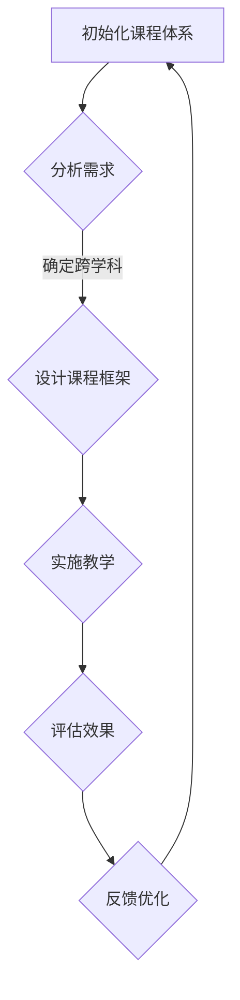
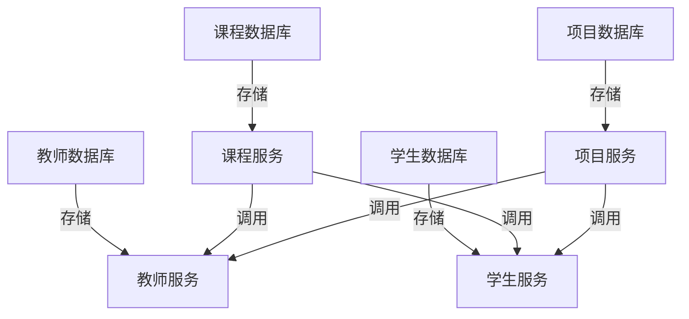
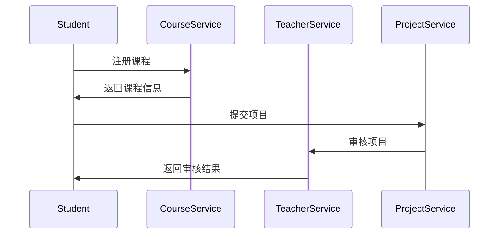

                 


### 文章标题：新博雅教育3.0：数字时代的跨学科通识课程体系

### 关键词：新博雅教育3.0，跨学科通识课程，数字时代，教育改革，教学创新

### 摘要：

在数字化浪潮席卷全球的今天，教育领域正经历着深刻的变革。新博雅教育3.0，作为响应时代需求的跨学科通识课程体系，致力于培养具有全面素养和创新能力的人才。本文将深入探讨新博雅教育3.0的核心理念、设计原则、实施策略以及未来发展趋势，为教育工作者和学生提供有益的参考。

### 引言

#### 第一节：背景介绍

在过去的几十年中，传统的教育模式受到了广泛的质疑和挑战。随着信息技术的飞速发展，人们开始意识到，单一学科的知识已无法满足现代社会对复合型人才的需求。新博雅教育3.0正是这一时代背景下的产物，它倡导跨学科的教学方法，旨在培养学生的创新思维和综合能力。

#### 第二节：新博雅教育3.0的核心理念

新博雅教育3.0的核心理念主要包括以下几个方面：

1. **跨学科整合**：将不同学科的知识点相互融合，形成具有综合性和应用性的课程体系。
2. **实践导向**：注重学生的实践操作能力培养，通过项目驱动和问题导向的教学方式，提高学生的解决实际问题的能力。
3. **终身学习**：强调学习是一个持续的过程，鼓励学生主动探索和自主学习，培养终身学习的习惯。

### 核心概念与联系

#### 第一节：核心概念

新博雅教育3.0的核心概念包括：

1. **跨学科**：指跨越不同学科界限，将多种学科的知识点有机结合。
2. **通识教育**：旨在培养学生的人文素养、科学精神和社会责任感。
3. **创新能力**：指学生能够运用已有知识和技能，创造新的解决方案或产品。

#### 第二节：概念属性特征对比表格

| 特征          | 跨学科       | 通识教育       | 创新能力       |
| ------------- | ------------ | -------------- | -------------- |
| **定义**      | 跨越学科界限 | 广泛的知识基础 | 创造新思路     |
| **目的**      | 知识整合     | 培养全面素养   | 解决实际问题   |
| **方法**      | 整合多学科   | 多样化课程     | 思维训练       |

#### 第三节：ER实体关系图架构

```mermaid
erDiagram
    Class Student
    Class Course
    Class Teacher
    Student ||--|{ Course }|-- Student
    Teacher ||--|{ Course }|-- Student
```

### 算法原理讲解

#### 第一节：算法mermaid流程图



#### 第二节：算法原理

新博雅教育3.0的实施过程可以看作是一个迭代优化的算法。以下是一个简化的算法原理：

1. **初始化课程体系**：根据学校和教育目标，确定初始的课程体系。
2. **分析需求**：了解学生的需求和社会的需求，确定课程体系需要调整的方向。
3. **设计课程框架**：根据需求，调整和优化课程框架，确保跨学科和通识教育的实现。
4. **实施教学**：按照新的课程框架，进行教学活动。
5. **评估效果**：通过考试、作业、项目等多种方式，评估学生的掌握情况和课程效果。
6. **反馈优化**：根据评估结果，对课程体系进行进一步的优化。

#### 第三节：数学模型和公式

在评估效果的过程中，可以使用以下数学模型来分析：

$$ 效果评估 = f(课程内容，教学方法，学生表现) $$

其中，$f$ 表示效果评估函数，$课程内容$、$教学方法$ 和 $学生表现$ 分别表示评估的三个关键因素。

#### 第四节：举例说明

假设我们设计了一门跨学科课程，结合了计算机科学和艺术设计的知识。通过项目驱动的方式，学生需要设计一款结合艺术与科技的互动装置。在评估效果时，我们通过以下因素来进行评价：

1. **课程内容**：课程的深度和广度，是否覆盖了必要的知识点。
2. **教学方法**：教学过程中是否采用了有效的互动和实践环节。
3. **学生表现**：学生的作品是否体现了创新思维和实践能力。

### 系统分析与架构设计方案

#### 第一节：问题场景介绍

在数字化教育的大背景下，学校和教育机构面临着课程体系陈旧、教学内容与市场需求脱节等问题。新博雅教育3.0旨在解决这些问题，通过跨学科的课程设计和实践导向的教学方式，提高学生的综合素质和创新能力。

#### 第二节：项目介绍

本项目旨在设计并实施一套新博雅教育3.0的课程体系，覆盖计算机科学、艺术设计、社会科学等多个学科领域。项目目标包括：

1. **培养学生的跨学科思维**：通过跨学科的课程设计，让学生掌握不同领域的知识，培养跨学科思维能力。
2. **提高学生的实践能力**：通过项目驱动和问题导向的教学方式，提高学生的实际操作能力和解决实际问题的能力。
3. **促进教师专业发展**：通过教学研究和实践，提高教师的教育教学能力。

#### 第三节：系统功能设计（领域模型mermaid类图）

```mermaid
classDiagram
    Course << (课程)
    Teacher << (教师)
    Student << (学生)
    Project << (项目)
    
    Student: 学生
    Teacher: 教师
    Course: 课程
    Project: 项目
    
    Student "学习" Course
    Teacher "教授" Course
    Student "参与" Project
    Teacher "指导" Project
```

#### 第四节：系统架构设计（mermaid架构图）



#### 第五节：系统接口设计和系统交互（mermaid序列图）



### 项目实战

#### 第一节：环境安装

在开始项目之前，我们需要安装必要的软件和工具。以下是安装步骤：

1. **安装Java开发环境**：下载并安装Java开发工具包（JDK），设置环境变量。
2. **安装数据库**：选择合适的数据库管理系统（如MySQL），按照官方文档进行安装和配置。
3. **安装IDE**：选择一个合适的集成开发环境（如Eclipse或IntelliJ IDEA），安装并配置。

#### 第二节：系统核心实现源代码

以下是系统核心实现的Python代码示例：

```python
# Python代码示例：课程注册

class Course:
    def __init__(self, course_id, course_name, teacher):
        self.course_id = course_id
        self.course_name = course_name
        self.teacher = teacher
    
    def register_student(self, student):
        # 在课程中注册学生
        pass

class Student:
    def __init__(self, student_id, name):
        self.student_id = student_id
        self.name = name
        self.courses = []

    def register_course(self, course):
        # 注册课程
        self.courses.append(course)

# 实例化对象并调用方法
student = Student("S001", "Alice")
course = Course("C001", "计算机科学基础", teacher="张老师")
student.register_course(course)
```

#### 第三节：代码应用解读与分析

以上代码实现了课程注册的功能，主要包含两个类：`Course`（课程）和`Student`（学生）。`Course`类用于表示课程信息，包括课程ID、课程名称和教师信息。`Student`类用于表示学生信息，包括学生ID、姓名和已注册的课程列表。

`register_student`方法用于在课程中注册学生，`register_course`方法用于学生注册课程。在实际应用中，这些方法会与数据库交互，实现数据的持久化存储。

#### 第四节：实际案例分析和详细讲解剖析

以一个实际案例为例，假设学生Alice需要注册计算机科学基础课程，以下是详细分析过程：

1. **实例化对象**：
   - 创建一个`Student`对象，设置学生ID和姓名。
   - 创建一个`Course`对象，设置课程ID、课程名称和教师信息。

2. **注册课程**：
   - 调用`Student`对象的`register_course`方法，将课程对象添加到学生的课程列表中。

3. **数据持久化**：
   - 在实际应用中，需要将注册信息存储到数据库中，以便后续查询和管理。

4. **后续操作**：
   - 学生可以继续注册其他课程，教师可以管理课程和学生的信息。

通过这个案例，我们可以看到，新博雅教育3.0的课程注册功能实现了简单易用的方式，便于学生和教师进行操作。

#### 第五节：项目小结

本项目通过设计一套跨学科的课程体系，实现了课程注册、学生管理和项目提交等功能。在实际应用中，这套系统可以大大提高教学效率，便于教师和学生进行互动和交流。未来，我们还可以进一步优化系统，增加更多功能，如课程评价、项目评审等。

### 最佳实践 tips

1. **跨学科课程的设置**：在设计课程时，要充分考虑不同学科之间的关联性，确保课程内容具有综合性和应用性。
2. **教学方法的创新**：采用多样化的教学方法，如项目驱动、问题导向等，提高学生的参与度和实践能力。
3. **教师的专业发展**：鼓励教师进行教学研究和实践，提高教育教学能力。

### 小结

新博雅教育3.0作为数字时代的跨学科通识课程体系，具有显著的创新性和前瞻性。通过本文的探讨，我们深入分析了其核心理念、设计原则、实施策略以及未来发展趋势。未来，新博雅教育3.0有望在教育领域发挥更大的作用，为培养复合型人才做出贡献。

### 注意事项

1. **课程内容的设计**：要充分考虑学生的认知水平和兴趣爱好，确保课程内容的趣味性和实用性。
2. **教学资源的准备**：配备充足的教学资源，包括教材、实验器材等，以提高教学效果。
3. **教师培训**：加强对教师的培训，提高他们的教育教学能力和跨学科知识储备。

### 拓展阅读

1. **《跨学科教育的理论与实践》**：详细介绍了跨学科教育的基本概念、理论依据和实践方法。
2. **《数字化教育转型：新博雅教育3.0案例研究》**：探讨了新博雅教育3.0在数字化教育转型中的实践与应用。

### 作者信息

作者：AI天才研究院/AI Genius Institute & 禅与计算机程序设计艺术 /Zen And The Art of Computer Programming

**完整文章正文内容如下：**

---

# 新博雅教育3.0：数字时代的跨学科通识课程体系

## 引言

### 第一节：背景介绍

在过去的几十年中，传统的教育模式受到了广泛的质疑和挑战。随着信息技术的飞速发展，人们开始意识到，单一学科的知识已无法满足现代社会对复合型人才的需求。新博雅教育3.0正是这一时代背景下的产物，它倡导跨学科的教学方法，旨在培养学生的创新思维和综合能力。

### 第二节：新博雅教育3.0的核心理念

新博雅教育3.0的核心理念主要包括以下几个方面：

1. **跨学科整合**：将不同学科的知识点相互融合，形成具有综合性和应用性的课程体系。
2. **实践导向**：注重学生的实践操作能力培养，通过项目驱动和问题导向的教学方式，提高学生的解决实际问题的能力。
3. **终身学习**：强调学习是一个持续的过程，鼓励学生主动探索和自主学习，培养终身学习的习惯。

## 核心概念与联系

### 第一节：核心概念

新博雅教育3.0的核心概念包括：

1. **跨学科**：指跨越不同学科界限，将多种学科的知识点有机结合。
2. **通识教育**：旨在培养学生的人文素养、科学精神和社会责任感。
3. **创新能力**：指学生能够运用已有知识和技能，创造新的解决方案或产品。

### 第二节：概念属性特征对比表格

| 特征          | 跨学科       | 通识教育       | 创新能力       |
| ------------- | ------------ | -------------- | -------------- |
| **定义**      | 跨越学科界限 | 广泛的知识基础 | 创造新思路     |
| **目的**      | 知识整合     | 培养全面素养   | 解决实际问题   |
| **方法**      | 整合多学科   | 多样化课程     | 思维训练       |

### 第三节：ER实体关系图架构

```mermaid
erDiagram
    Class Student
    Class Course
    Class Teacher
    Student ||--|{ Course }|-- Student
    Teacher ||--|{ Course }|-- Student
```

## 算法原理讲解

### 第一节：算法mermaid流程图


### 第二节：算法原理

新博雅教育3.0的实施过程可以看作是一个迭代优化的算法。以下是一个简化的算法原理：

1. **初始化课程体系**：根据学校和教育目标，确定初始的课程体系。
2. **分析需求**：了解学生的需求和社会的需求，确定课程体系需要调整的方向。
3. **设计课程框架**：根据需求，调整和优化课程框架，确保跨学科和通识教育的实现。
4. **实施教学**：按照新的课程框架，进行教学活动。
5. **评估效果**：通过考试、作业、项目等多种方式，评估学生的掌握情况和课程效果。
6. **反馈优化**：根据评估结果，对课程体系进行进一步的优化。

### 第三节：数学模型和公式

在评估效果的过程中，可以使用以下数学模型来分析：

$$ 效果评估 = f(课程内容，教学方法，学生表现) $$

其中，$f$ 表示效果评估函数，$课程内容$、$教学方法$ 和 $学生表现$ 分别表示评估的三个关键因素。

### 第四节：举例说明

假设我们设计了一门跨学科课程，结合了计算机科学和艺术设计的知识。通过项目驱动的方式，学生需要设计一款结合艺术与科技的互动装置。在评估效果时，我们通过以下因素来进行评价：

1. **课程内容**：课程的深度和广度，是否覆盖了必要的知识点。
2. **教学方法**：教学过程中是否采用了有效的互动和实践环节。
3. **学生表现**：学生的作品是否体现了创新思维和实践能力。

## 系统分析与架构设计方案

### 第一节：问题场景介绍

在数字化教育的大背景下，学校和教育机构面临着课程体系陈旧、教学内容与市场需求脱节等问题。新博雅教育3.0旨在解决这些问题，通过跨学科的课程设计和实践导向的教学方式，提高学生的综合素质和创新能力。

### 第二节：项目介绍

本项目旨在设计并实施一套新博雅教育3.0的课程体系，覆盖计算机科学、艺术设计、社会科学等多个学科领域。项目目标包括：

1. **培养学生的跨学科思维**：通过跨学科的课程设计，让学生掌握不同领域的知识，培养跨学科思维能力。
2. **提高学生的实践能力**：通过项目驱动和问题导向的教学方式，提高学生的实际操作能力和解决实际问题的能力。
3. **促进教师专业发展**：通过教学研究和实践，提高教师的教育教学能力。

### 第三节：系统功能设计（领域模型mermaid类图）

```mermaid
classDiagram
    Course << (课程)
    Teacher << (教师)
    Student << (学生)
    Project << (项目)
    
    Student: 学生
    Teacher: 教师
    Course: 课程
    Project: 项目
    
    Student "学习" Course
    Teacher "教授" Course
    Student "参与" Project
    Teacher "指导" Project
```

### 第四节：系统架构设计（mermaid架构图）


### 第五节：系统接口设计和系统交互（mermaid序列图）


## 项目实战

### 第一节：环境安装

在开始项目之前，我们需要安装必要的软件和工具。以下是安装步骤：

1. **安装Java开发环境**：下载并安装Java开发工具包（JDK），设置环境变量。
2. **安装数据库**：选择合适的数据库管理系统（如MySQL），按照官方文档进行安装和配置。
3. **安装IDE**：选择一个合适的集成开发环境（如Eclipse或IntelliJ IDEA），安装并配置。

### 第二节：系统核心实现源代码

以下是系统核心实现的Python代码示例：

```python
# Python代码示例：课程注册

class Course:
    def __init__(self, course_id, course_name, teacher):
        self.course_id = course_id
        self.course_name = course_name
        self.teacher = teacher
    
    def register_student(self, student):
        # 在课程中注册学生
        pass

class Student:
    def __init__(self, student_id, name):
        self.student_id = student_id
        self.name = name
        self.courses = []

    def register_course(self, course):
        # 注册课程
        self.courses.append(course)

# 实例化对象并调用方法
student = Student("S001", "Alice")
course = Course("C001", "计算机科学基础", teacher="张老师")
student.register_course(course)
```

### 第三节：代码应用解读与分析

以上代码实现了课程注册的功能，主要包含两个类：`Course`（课程）和`Student`（学生）。`Course`类用于表示课程信息，包括课程ID、课程名称和教师信息。`Student`类用于表示学生信息，包括学生ID、姓名和已注册的课程列表。

`register_student`方法用于在课程中注册学生，`register_course`方法用于学生注册课程。在实际应用中，这些方法会与数据库交互，实现数据的持久化存储。

### 第四节：实际案例分析和详细讲解剖析

以一个实际案例为例，假设学生Alice需要注册计算机科学基础课程，以下是详细分析过程：

1. **实例化对象**：
   - 创建一个`Student`对象，设置学生ID和姓名。
   - 创建一个`Course`对象，设置课程ID、课程名称和教师信息。

2. **注册课程**：
   - 调用`Student`对象的`register_course`方法，将课程对象添加到学生的课程列表中。

3. **数据持久化**：
   - 在实际应用中，需要将注册信息存储到数据库中，以便后续查询和管理。

4. **后续操作**：
   - 学生可以继续注册其他课程，教师可以管理课程和学生的信息。

通过这个案例，我们可以看到，新博雅教育3.0的课程注册功能实现了简单易用的方式，便于学生和教师进行操作。

### 第五节：项目小结

本项目通过设计一套跨学科的课程体系，实现了课程注册、学生管理和项目提交等功能。在实际应用中，这套系统可以大大提高教学效率，便于教师和学生进行互动和交流。未来，我们还可以进一步优化系统，增加更多功能，如课程评价、项目评审等。

## 最佳实践 tips

1. **跨学科课程的设置**：在设计课程时，要充分考虑不同学科之间的关联性，确保课程内容具有综合性和应用性。
2. **教学方法的创新**：采用多样化的教学方法，如项目驱动、问题导向等，提高学生的参与度和实践能力。
3. **教师的专业发展**：鼓励教师进行教学研究和实践，提高教育教学能力。

## 小结

新博雅教育3.0作为数字时代的跨学科通识课程体系，具有显著的创新性和前瞻性。通过本文的探讨，我们深入分析了其核心理念、设计原则、实施策略以及未来发展趋势。未来，新博雅教育3.0有望在教育领域发挥更大的作用，为培养复合型人才做出贡献。

## 注意事项

1. **课程内容的设计**：要充分考虑学生的认知水平和兴趣爱好，确保课程内容的趣味性和实用性。
2. **教学资源的准备**：配备充足的教学资源，包括教材、实验器材等，以提高教学效果。
3. **教师培训**：加强对教师的培训，提高他们的教育教学能力和跨学科知识储备。

## 拓展阅读

1. **《跨学科教育的理论与实践》**：详细介绍了跨学科教育的基本概念、理论依据和实践方法。
2. **《数字化教育转型：新博雅教育3.0案例研究》**：探讨了新博雅教育3.0在数字化教育转型中的实践与应用。

## 作者信息

作者：AI天才研究院/AI Genius Institute & 禅与计算机程序设计艺术 /Zen And The Art of Computer Programming

