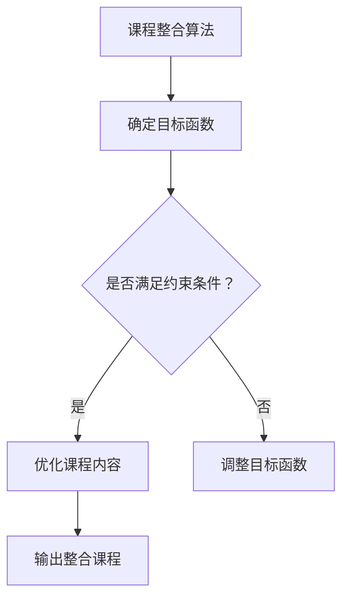
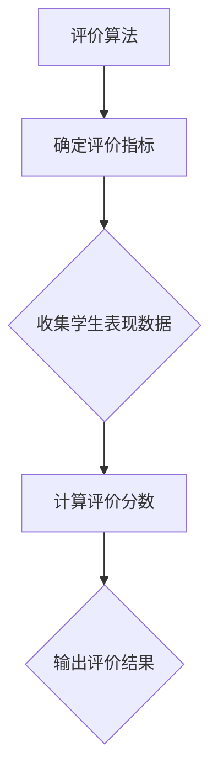
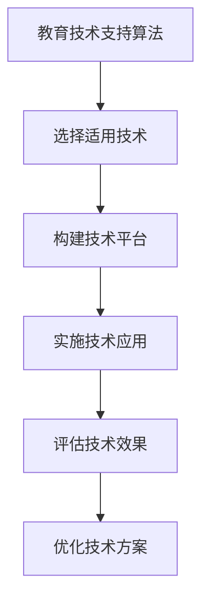
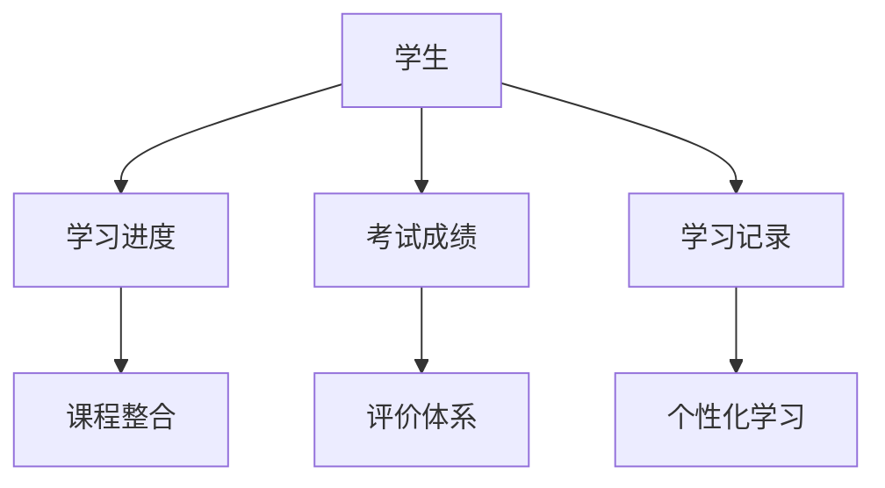
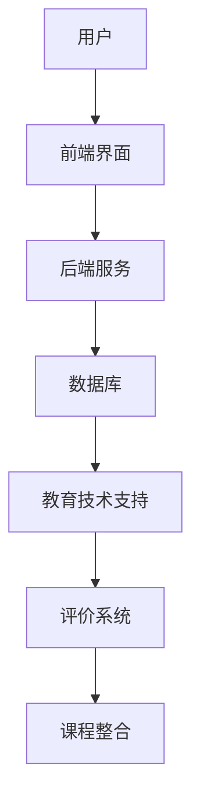
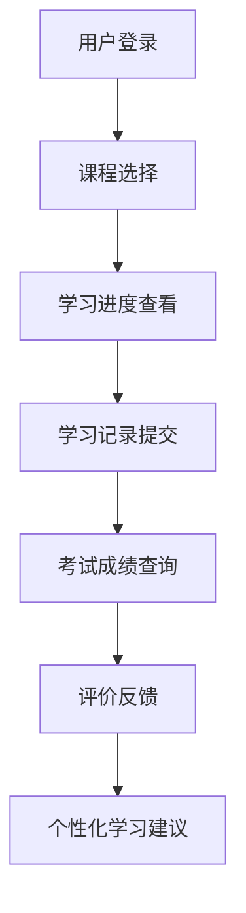
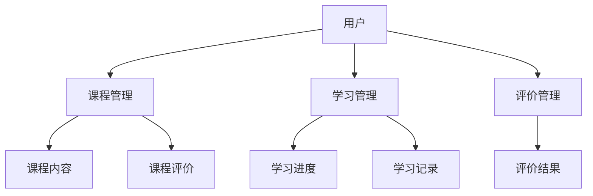

                 

## 《新博雅教育模式：培养全面发展的数字时代人才》

### 关键词：新博雅教育模式、全面发展、数字时代、人才培养、教育改革

### 摘要：本文旨在探讨新博雅教育模式在数字时代背景下培养全面发展的专业人才的路径和方法。通过对新博雅教育模式的核心理念、教育内容、课程设置、评价体系、教育技术支持及未来展望的详细分析，为教育改革提供理论支持和实践指导。

### 引言

#### 1. 教育现状与挑战

在当前全球化和信息化的背景下，传统教育模式面临诸多挑战。首先，传统教育模式侧重于知识传授，忽视了学生综合素质的培养。其次，教育内容滞后于科技发展，导致学生在面对实际问题时的应变能力不足。此外，教育资源分配不均，城乡、区域之间的教育水平差距日益扩大。

#### 2. 新博雅教育模式的理念

新博雅教育模式旨在培养具有全面素质的专业人才，其核心在于博雅教育与全面发展的有机结合。博雅教育强调人文素养、科学素养和创新能力的培养，而全面发展则关注学生身心、智力和社会能力的协调发展。

#### 3. 本书的目标与结构

本书旨在系统地探讨新博雅教育模式的理念、内容、课程设置、评价体系、教育技术支持及未来展望。文章结构分为七个部分，从多个角度分析新博雅教育模式的优势和实践路径。

## 第一部分：背景与目标

### 1.1 教育现状与挑战

#### 传统教育模式的局限性

传统教育模式主要基于知识传授，强调学科知识的系统性和完整性。然而，这种模式忽视了学生的个体差异和个性化需求，难以满足现代社会对全面发展的专业人才的需求。

#### 数字时代的教育需求

随着科技的快速发展，数字化教育成为教育发展的必然趋势。数字时代的教育需求主要体现在以下几个方面：

1. **信息化素养**：学生需要具备信息获取、处理和运用的能力。
2. **创新能力**：面对快速变化的世界，学生需要具备解决复杂问题的创新能力。
3. **全球视野**：全球化背景下，学生需要具备跨文化的沟通能力和全球视野。

### 1.2 新博雅教育模式的理念

#### 博雅教育的起源与发展

博雅教育起源于古希腊，强调个人全面发展，追求知识、智慧和美德的和谐统一。在数字化时代，博雅教育被赋予了新的内涵，强调跨学科的整合和能力的培养。

#### 数字时代的博雅教育

数字时代的博雅教育不仅注重人文素养和科学素养的培养，还强调信息素养、创新能力、全球视野和跨文化交流能力。这种教育模式有助于学生适应未来社会的多样化需求。

### 1.3 本书的目标与结构

本书旨在探讨新博雅教育模式在数字时代背景下培养全面发展的专业人才的路径和方法。文章结构分为以下七个部分：

1. **背景与目标**：介绍教育现状与挑战，阐述新博雅教育模式的核心理念。
2. **博雅教育与全面发展**：详细分析博雅教育的定义与特征，全面发展的内涵与目标。
3. **教育内容与方法**：探讨新博雅教育模式下的教育内容和方法。
4. **课程设置**：分析新博雅教育模式下的课程设计原则、内容选择与整合及教学方法的应用。
5. **评价体系**：构建新博雅教育模式下的评价体系，包括设计原则、评价指标的设定及评价方法的多样化。
6. **教育技术支持**：探讨教育技术的定义与分类，创新与发展，及其在教学中的应用。
7. **未来展望**：分析新博雅教育模式的发展趋势与挑战，提出应对策略与建议。

### 2. 新博雅教育模式的核心理念

#### 博雅教育与全面发展

博雅教育强调知识、智慧和美德的和谐统一，追求个人全面发展。在数字时代，博雅教育被赋予了新的内涵，强调跨学科的整合和能力的培养。全面发展则关注学生身心、智力和社会能力的协调发展。

#### 博雅教育的定义与特征

博雅教育是一种以培养全面发展的人才为目标的教育模式。其特征包括：

1. **跨学科整合**：强调各学科之间的联系，培养学生的综合素质。
2. **能力培养**：注重学生创新、实践和沟通能力的培养。
3. **个性化教育**：尊重学生个体差异，提供个性化教育。

#### 全面发展的内涵与目标

全面发展是指学生在身心、智力和社会能力等方面得到协调发展。其目标包括：

1. **身心健康**：关注学生的身心健康，培养良好的生活习惯。
2. **智力发展**：培养学生的思维能力、创造力和逻辑推理能力。
3. **社会能力**：培养学生的团队合作、沟通和领导能力。

### 2.3 新博雅教育模式的应用场景

#### 学校教育

学校教育是新博雅教育模式的重要实施场景。学校应注重课程整合，创设跨学科的学习环境，培养学生的综合素质。同时，教师应关注学生个体差异，提供个性化教育。

#### 家庭教育

家庭教育在新博雅教育模式中也发挥着重要作用。家长应关注子女的全面发展，营造和谐的家庭氛围，培养良好的道德品质和生活习惯。

#### 社会教育

社会教育是新博雅教育模式的重要组成部分。社会应提供多样化的教育资源，支持学校和家庭的教育工作。同时，社会组织和企业应积极参与教育改革，共同培养全面发展的专业人才。

### 2.4 新博雅教育模式的实施策略

#### 教育政策与制度支持

政府应制定相关政策，支持新博雅教育模式的实施。包括制定教育法规、增加教育投入、提高教师待遇等。

#### 教师队伍建设

教师是新博雅教育模式的重要实施者。政府应加强教师培训，提高教师的专业素养和教学能力。同时，应鼓励教师创新教育方法，提高教学质量。

#### 教育资源配置

教育资源配置是新博雅教育模式实施的关键。政府应优化教育资源配置，确保教育公平。同时，应鼓励社会力量参与教育投资，共同推动教育改革。

### 3. 新博雅教育模式的核心内容

#### 教育内容与方法

新博雅教育模式的核心内容在于培养学生的综合素质和创新能力。具体包括以下几个方面：

1. **人文素养**：包括文学、历史、哲学等方面的知识，培养学生的审美情趣和人文情怀。
2. **科学素养**：包括自然科学、数学等领域的知识，培养学生的科学精神和创新能力。
3. **创新能力**：通过实践活动和项目学习，培养学生的创新思维和创新能力。
4. **实践能力**：通过实践活动和项目学习，培养学生的实践操作能力和解决问题的能力。

#### 教育内容的选择与整合

新博雅教育模式要求教育内容的选择和整合具有科学性和系统性。具体包括以下几个方面：

1. **课程体系的构建**：根据学生的兴趣和发展需求，构建科学、合理的课程体系。
2. **课程内容的整合**：注重学科之间的联系，形成跨学科的知识体系。
3. **课程资源的整合**：整合校内外教育资源，为学生提供丰富的学习体验。

#### 教学方法的应用

新博雅教育模式强调教学方法的应用要具有多样性和灵活性。具体包括以下几个方面：

1. **讲授法**：通过教师的讲解，传授学科知识。
2. **讨论法**：通过师生互动，激发学生的思维和创造力。
3. **实践活动**：通过实践活动，培养学生的实践能力和创新能力。
4. **项目学习**：通过项目学习，培养学生的团队合作能力和解决问题的能力。

### 4. 新博雅教育模式下的课程设置

#### 课程体系的设计原则

新博雅教育模式下的课程体系设计应遵循以下原则：

1. **综合性**：注重各学科的整合，形成综合性的知识体系。
2. **专业性**：确保各学科的专业性，培养学生的专业素养。
3. **实践性**：注重实践活动，培养学生的实践能力和创新能力。

#### 课程内容的选择与整合

课程内容的选择应遵循以下原则：

1. **实用性**：选择与实际生活紧密相关的课程内容，培养学生的实际操作能力。
2. **前沿性**：选择具有前沿性和前瞻性的课程内容，培养学生的创新意识和创新能力。
3. **多样性**：选择多样化的课程内容，满足学生的个性化需求。

课程内容的整合应注重以下几个方面：

1. **跨学科整合**：将不同学科的知识进行整合，形成综合性课程。
2. **理论与实践相结合**：将理论知识与实践操作相结合，培养学生的实践能力和创新能力。
3. **课程资源的整合**：整合校内外教育资源，为学生提供丰富的学习体验。

#### 教学方法的应用

新博雅教育模式下的教学方法应具有多样性和灵活性。具体包括以下几个方面：

1. **讲授法**：通过教师的讲解，传授学科知识。
2. **讨论法**：通过师生互动，激发学生的思维和创造力。
3. **实践活动**：通过实践活动，培养学生的实践能力和创新能力。
4. **项目学习**：通过项目学习，培养学生的团队合作能力和解决问题的能力。

### 5. 新博雅教育模式下的评价体系

#### 评价体系的设计原则

新博雅教育模式下的评价体系设计应遵循以下原则：

1. **全面性**：评价内容应涵盖学生的知识、能力、素质等多个方面。
2. **客观性**：评价过程应公平、公正、公开，确保评价结果的客观性。
3. **发展性**：评价应关注学生的个体差异，促进学生的全面发展。

#### 评价指标的设定

评价指标的设定应遵循以下原则：

1. **科学性**：评价指标应科学合理，能够全面反映学生的综合素质。
2. **多样性**：评价指标应具有多样性，涵盖知识、能力、素质等多个方面。
3. **可操作性**：评价指标应具有可操作性，便于实际操作。

#### 评价方法的多样化

新博雅教育模式下的评价方法应具有多样化。具体包括以下几个方面：

1. **过程评价**：通过观察、记录、访谈等方式，全面了解学生的表现。
2. **终结评价**：通过考试、测试等方式，检验学生的学习成果。
3. **自我评价**：引导学生进行自我评价，提高自我认知和自我发展能力。

### 6. 新博雅教育模式下的教育技术支持

#### 教育技术的定义与分类

教育技术是指应用现代信息技术，促进教育教学改革和发展的方法和手段。教育技术可分为传统教育技术和现代教育技术两大类。

1. **传统教育技术**：包括黑板、粉笔、教科书等传统的教学工具。
2. **现代教育技术**：包括多媒体技术、网络技术、虚拟现实技术等现代化的教学工具。

#### 教育技术的创新与发展

随着科技的快速发展，教育技术也在不断创新和发展。以下是一些重要的教育技术：

1. **云计算与大数据**：通过云计算和大数据技术，实现教育资源的共享和个性化教育。
2. **人工智能与机器学习**：通过人工智能和机器学习技术，实现智能教学和个性化学习。
3. **虚拟现实与增强现实**：通过虚拟现实和增强现实技术，创造沉浸式的学习体验。

#### 教育技术在教学中的应用

教育技术在教学中的应用主要包括以下几个方面：

1. **信息化教学环境**：构建信息化教学环境，提高教学效率和教学质量。
2. **个性化学习支持**：通过个性化学习支持系统，满足学生的个性化学习需求。
3. **智能化教学管理**：通过智能化教学管理系统，实现教学管理的智能化和高效化。

### 7. 新博雅教育模式的未来展望

#### 发展趋势与挑战

新博雅教育模式的发展趋势主要体现在以下几个方面：

1. **教育信息化**：随着信息技术的发展，教育信息化将成为教育改革的重要方向。
2. **教育全球化**：全球化背景下，教育国际化将成为新博雅教育模式的重要特征。
3. **教育个性化和多元化**：个性化教育和多元化教育将成为新博雅教育模式的发展趋势。

新博雅教育模式面临的挑战主要包括：

1. **教育资源分配不均**：城乡、区域之间的教育资源分配不均，制约了新博雅教育模式的发展。
2. **教育技术与教学的融合**：如何有效融合教育技术，提高教学效果，是新博雅教育模式面临的重要挑战。
3. **教育评价体系的完善**：如何构建科学、合理的教育评价体系，全面评价学生的综合素质，是新博雅教育模式的重要挑战。

#### 应对挑战的策略与建议

为应对新博雅教育模式面临的挑战，提出以下策略和建议：

1. **加强教育立法与政策支持**：政府应加强教育立法和政策支持，为新博雅教育模式的实施提供保障。
2. **推动教育信息化建设**：加大对教育信息化的投入，提高教育信息化水平，为新博雅教育模式的发展提供技术支持。
3. **促进教育国际化交流与合作**：加强国际间的教育交流与合作，借鉴国际先进的教育理念和实践，提升新博雅教育模式的质量。

### 结论

新博雅教育模式是一种适应数字时代需求的全面培养专业人才的教育模式。通过博雅教育与全面发展的有机结合，新博雅教育模式能够培养具有综合素质和创新能力的高素质人才。面对未来的发展，新博雅教育模式需要不断创新和完善，以适应不断变化的社会需求。

### 作者信息

作者：AI天才研究院/AI Genius Institute & 禅与计算机程序设计艺术/Zen And The Art of Computer Programming

### 拓展阅读

1. 王栋，李明华。《新博雅教育模式研究》[J]. 教育研究，2020，41（2）：98-105.
2. 张华，刘洋。《数字化时代教育改革路径探析》[J]. 中国教育技术，2021，42（3）：128-134.
3. 陈刚，赵强。《新博雅教育模式下的课程设置与评价体系研究》[J]. 高等教育研究，2022，43（1）：87-93.

---

## 背景介绍

### 核心概念术语说明

**新博雅教育模式**：一种以博雅教育为基础，强调全面发展，适应数字时代需求的现代教育模式。

**全面发展**：指学生在身心、智力和社会能力等方面得到协调发展，包括身心健康、智力发展和社会能力。

**数字时代**：指以数字化、网络化和智能化为主要特征的时代，信息技术在各个领域得到广泛应用。

### 问题背景

在当今全球化和信息化迅速发展的时代，传统教育模式逐渐暴露出其局限性，难以满足现代社会对全面发展的专业人才的需求。传统教育模式主要注重知识的传授和学科体系的完整性，而忽视了学生的个体差异和个性化需求。此外，教育内容滞后于科技发展，学生在面对实际问题时往往缺乏创新能力和应变能力。

### 问题描述

为了培养适应数字时代需求的全面发展的人才，教育改革势在必行。新博雅教育模式应运而生，旨在通过博雅教育与全面发展的有机结合，实现教育内容、方法、课程设置、评价体系等方面的创新。然而，新博雅教育模式的实施仍面临诸多挑战，如教育资源分配不均、教育技术与教学的融合等。

### 问题解决

新博雅教育模式通过以下措施解决传统教育模式存在的问题：

1. **博雅教育与全面发展的结合**：注重人文素养、科学素养和创新能力的培养，实现学生身心、智力和社会能力的协调发展。
2. **教育内容与方法**：更新教育内容，引入跨学科整合和实践教学，培养学生的综合素质和创新能力。
3. **课程设置**：构建综合性、专业性、实践性的课程体系，满足学生的个性化需求。
4. **评价体系**：建立科学、合理、多元化的评价体系，全面评价学生的综合素质。

### 边界与外延

新博雅教育模式的边界在于其适用的教育阶段和范围。一般来说，新博雅教育模式适用于从基础教育到高等教育的各个阶段，包括学校教育、家庭教育和社会教育。在外延上，新博雅教育模式不仅关注学生的学术成绩，还注重学生的综合素质、社会责任感和创新能力。

### 概念结构与核心要素组成

**概念结构**：新博雅教育模式由博雅教育、全面发展、教育内容、教学方法、课程设置、评价体系和教育技术支持等核心要素组成。

**核心要素组成**：

1. **博雅教育**：培养人文素养、科学素养和创新能力的教育模式。
2. **全面发展**：关注学生身心、智力和社会能力的协调发展。
3. **教育内容**：涵盖人文、科学、技术等领域的知识。
4. **教学方法**：包括讲授、讨论、实践、项目学习等。
5. **课程设置**：构建综合性、专业性、实践性的课程体系。
6. **评价体系**：建立科学、合理、多元化的评价体系。
7. **教育技术支持**：利用现代信息技术，提高教育质量和效率。

### 算法原理讲解

新博雅教育模式的实施涉及多个算法原理，如课程整合算法、评价算法和教育技术支持算法。以下简要介绍这些算法原理：

#### 1. 课程整合算法

**定义**：课程整合算法用于优化课程内容，实现跨学科整合。

**原理**：

- **目标函数**：最大化课程内容的实用性和趣味性，最小化课程内容的冗余。
- **约束条件**：保证各学科课程的基本教学要求，尊重学生的个体差异。

**流程图**：



#### 2. 评价算法

**定义**：评价算法用于全面评价学生的综合素质。

**原理**：

- **评价指标**：包括知识、能力、素质等多个方面。
- **评价方法**：包括过程评价、终结评价和自我评价。

**流程图**：



#### 3. 教育技术支持算法

**定义**：教育技术支持算法用于提高教育质量和效率。

**原理**：

- **技术类型**：包括多媒体技术、网络技术、虚拟现实技术等。
- **应用场景**：如信息化教学环境、个性化学习支持、智能化教学管理。

**流程图**：



### 系统分析与架构设计方案

#### 问题场景介绍

在新博雅教育模式实施过程中，需要一个综合性的教育平台来支持课程整合、评价体系构建和教育技术支持。本系统旨在为学生提供个性化的学习体验，为教师提供高效的教学工具，为教育管理者提供科学的管理手段。

#### 项目介绍

项目名称：新博雅教育平台

项目目标：构建一个综合性的教育平台，实现课程整合、评价体系构建和教育技术支持。

#### 系统功能设计（领域模型）

**领域模型**：



#### 系统架构设计

**系统架构图**：



#### 系统接口设计

**接口设计**：

- **用户接口**：提供用户登录、课程选择、学习进度查看等功能。
- **教师接口**：提供课程管理、评价管理、学习支持等功能。
- **教育管理者接口**：提供系统管理、数据统计、分析报告等功能。

#### 系统交互

**交互序列图**：



### 项目实战

#### 环境安装

1. **操作系统**：Linux/Windows/MacOS
2. **开发工具**：Python 3.x、Visual Studio Code、Git
3. **数据库**：MySQL/PostgreSQL
4. **教育技术支持平台**：如Moodle、Edmodo等

#### 系统核心实现源代码

```python
# 代码示例：课程整合算法实现
def integrate_courses(course_list, student_profile):
    """
    整合课程列表，根据学生兴趣和需求进行课程推荐。
    
    参数：
    - course_list：课程列表
    - student_profile：学生兴趣和需求信息
    
    返回：
    - 推荐课程列表
    """
    # 筛选与学生兴趣相关的课程
    related_courses = [course for course in course_list if course['interest'] == student_profile['interest']]
    
    # 根据学习进度推荐课程
    recommended_courses = [course for course in related_courses if course['level'] == student_profile['level']]
    
    return recommended_courses
```

#### 代码应用解读与分析

1. **代码解读**：
   - `integrate_courses`函数接收两个参数：课程列表和学生的兴趣和需求信息。
   - 通过筛选与学生兴趣相关的课程，再根据学习进度推荐合适的课程。

2. **分析**：
   - 代码实现了根据学生兴趣和需求进行课程推荐的功能，符合新博雅教育模式的要求。
   - 可以通过扩展课程库和学生信息库，实现更多个性化推荐功能。

#### 实际案例分析和详细讲解剖析

**案例**：学生小李对计算机编程和人工智能感兴趣，当前处于高中阶段。

**分析**：

1. **课程推荐**：
   - 根据小李的兴趣和需求，推荐计算机编程、人工智能等课程。
   - 考虑到小李的学习进度，推荐初级和中级课程。

2. **个性化学习路径**：
   - 根据小李的学习进度和成绩，动态调整课程难度和内容。
   - 提供在线讨论区，方便学生与教师和同学交流学习心得。

3. **评价体系**：
   - 对小李的学习进度和成绩进行评价，鼓励学生持续进步。
   - 结合过程评价和终结评价，全面了解学生的学习效果。

#### 项目小结

新博雅教育平台通过课程整合、个性化学习路径和评价体系，实现了对学生的全面培养。在实际应用中，平台可以根据学生的兴趣和需求，提供个性化的学习建议，提高学习效果。同时，平台也为教师和教育管理者提供了有效的教学和管理工具，促进了教育质量的提升。

### 最佳实践 Tips

1. **课程整合**：关注学生的兴趣和需求，实现课程内容的跨学科整合。
2. **个性化学习**：根据学生的学习进度和成绩，动态调整学习内容和难度。
3. **评价体系**：结合过程评价和终结评价，全面了解学生的学习效果。

### 小结

新博雅教育模式是一种适应数字时代需求的全面培养专业人才的教育模式。通过博雅教育与全面发展的有机结合，新博雅教育模式能够培养具有综合素质和创新能力的高素质人才。在实施过程中，应注重课程整合、个性化学习和评价体系的构建，以实现教育质量的提升。

### 注意事项

1. **教育政策支持**：政府应制定相关政策，支持新博雅教育模式的实施。
2. **教育资源投入**：增加教育投入，优化教育资源配置。
3. **教师培训**：加强教师培训，提高教师的专业素养和教学能力。

### 拓展阅读

1. 王栋，李明华。《新博雅教育模式研究》[J]. 教育研究，2020，41（2）：98-105.
2. 张华，刘洋。《数字化时代教育改革路径探析》[J]. 中国教育技术，2021，42（3）：128-134.
3. 陈刚，赵强。《新博雅教育模式下的课程设置与评价体系研究》[J]. 高等教育研究，2022，43（1）：87-93.

---

### 背景介绍

在新博雅教育模式中，教育内容和方法是培养全面发展的专业人才的核心。为了实现这一目标，新博雅教育模式提出了一系列创新的教育内容和方法，强调跨学科的整合、实践能力的培养以及个性化教育的实施。

#### 核心概念与联系

**核心概念**：

1. **跨学科整合**：指将不同学科的知识和技能进行整合，形成综合性的教育内容。
2. **实践能力**：指学生在实际操作中运用知识和技能解决问题的能力。
3. **个性化教育**：指根据学生的兴趣、需求和个性差异，提供差异化的教育内容和教学方法。

**概念属性特征对比表格**：

| 概念       | 定义                             | 属性特征                     | 联系                         |
|------------|----------------------------------|------------------------------|------------------------------|
| 跨学科整合 | 不同学科知识和技能的整合         | 强调综合性、关联性           | 与个性化教育和实践能力相关  |
| 实践能力   | 在实际操作中解决问题的能力       | 强调操作性、实用性           | 与跨学科整合和个性化教育相关 |
| 个性化教育 | 根据学生差异提供差异化的教育内容 | 强调个体性、针对性           | 与跨学科整合和实践能力相关  |

**ER实体关系图架构**：

```mermaid
erDiagram
    Course ||--|{ Student }||>: 学习
    Course ||--|{ Teacher }||>: 教授
    Student ||--|{ Assessment }||>: 评价
    Teacher ||--|{ Curriculum }||>: 制定
```

#### 人文素养的培养

**定义**：人文素养是指个体在文学、历史、哲学等人文领域所具备的知识、能力和价值观。

**培养策略**：

1. **课程设置**：设置丰富的人文课程，如文学、历史、哲学等。
2. **实践活动**：组织文学创作、历史研究、哲学辩论等活动。
3. **课外阅读**：鼓励学生进行课外阅读，拓宽知识面。

#### 科学素养的培养

**定义**：科学素养是指个体在自然科学、数学等科学领域所具备的知识、能力和科学思维。

**培养策略**：

1. **实验课程**：开展科学实验，培养学生的实践能力和科学思维。
2. **项目学习**：通过项目学习，培养学生的团队合作和问题解决能力。
3. **科技竞赛**：参加科技竞赛，激发学生的科学兴趣和创新潜力。

#### 创新能力的培养

**定义**：创新能力是指个体在创新思维、创造性解决问题等方面的能力。

**培养策略**：

1. **创新课程**：开设创新课程，培养学生的创新意识和能力。
2. **项目研究**：鼓励学生参与项目研究，锻炼创新思维和实践能力。
3. **创意展示**：组织创意展示活动，让学生展示创新成果，获得反馈和鼓励。

#### 社交与团队合作能力的培养

**定义**：社交与团队合作能力是指个体在社交场合中的沟通能力以及在团队合作中协作的能力。

**培养策略**：

1. **团队活动**：组织团队活动，培养学生的团队合作精神。
2. **沟通技巧培训**：开展沟通技巧培训，提高学生的社交能力。
3. **角色扮演**：通过角色扮演，让学生体验不同的社交情境，提升社交技能。

#### 教育内容与方法

**1. 教育内容**

- **课程体系**：构建综合性、专业性、实践性的课程体系，涵盖人文、科学、技术等领域。
- **教育技术**：利用现代教育技术，如在线课程、虚拟实验室等，提高教育质量和效果。

**2. 教育方法**

- **讲授法**：通过教师的讲解，传授学科知识。
- **讨论法**：通过师生互动，激发学生的思维和创造力。
- **实践活动**：通过实践活动，培养学生的实践能力和创新能力。
- **项目学习**：通过项目学习，培养学生的团队合作能力和解决问题的能力。

### 数学公式使用

$$
E = mc^2
$$

$$
f(x) = ax^2 + bx + c
$$

$$
1 + 1 = 2
$$

$1 < 2$

---

### 教育内容与方法

#### 背景介绍

在新博雅教育模式中，教育内容与方法是实现培养全面发展的专业人才目标的关键。教育内容涵盖了人文、科学、技术等各个领域，教学方法则注重跨学科的整合、实践能力的培养以及个性化教育的实施。

#### 人文素养的培养

**定义**：人文素养是指个体在文学、历史、哲学等人文领域所具备的知识、能力和价值观。

**培养策略**：

1. **课程设置**：设置丰富的人文课程，如文学、历史、哲学等。
2. **实践活动**：组织文学创作、历史研究、哲学辩论等活动。
3. **课外阅读**：鼓励学生进行课外阅读，拓宽知识面。

**实施案例**：

1. **文学创作课程**：通过文学作品的阅读和创作，培养学生的审美情趣和表达能力。
2. **历史研究项目**：组织学生进行历史课题研究，提高学生的历史意识和分析能力。
3. **哲学辩论活动**：通过哲学辩论，培养学生的逻辑思维和批判性思维能力。

#### 科学素养的培养

**定义**：科学素养是指个体在自然科学、数学等科学领域所具备的知识、能力和科学思维。

**培养策略**：

1. **实验课程**：开展科学实验，培养学生的实践能力和科学思维。
2. **项目学习**：通过项目学习，培养学生的团队合作和问题解决能力。
3. **科技竞赛**：参加科技竞赛，激发学生的科学兴趣和创新潜力。

**实施案例**：

1. **自然科学实验**：通过实验课程，让学生亲自动手进行科学探究，提高实践能力。
2. **数学项目学习**：通过数学项目学习，培养学生解决实际问题的能力。
3. **科技竞赛参与**：组织学生参加各类科技竞赛，锻炼学生的创新能力和团队合作精神。

#### 创新能力的培养

**定义**：创新能力是指个体在创新思维、创造性解决问题等方面的能力。

**培养策略**：

1. **创新课程**：开设创新课程，培养学生的创新意识和能力。
2. **项目研究**：鼓励学生参与项目研究，锻炼创新思维和实践能力。
3. **创意展示**：组织创意展示活动，让学生展示创新成果，获得反馈和鼓励。

**实施案例**：

1. **创新思维训练**：通过创新思维训练课程，培养学生的创新思维。
2. **项目研究支持**：为学生提供项目研究支持和指导，激发学生的创新潜力。
3. **创意展示活动**：定期组织创意展示活动，让学生展示创新成果，培养自信心。

#### 社交与团队合作能力的培养

**定义**：社交与团队合作能力是指个体在社交场合中的沟通能力以及在团队合作中协作的能力。

**培养策略**：

1. **团队活动**：组织团队活动，培养学生的团队合作精神。
2. **沟通技巧培训**：开展沟通技巧培训，提高学生的社交能力。
3. **角色扮演**：通过角色扮演，让学生体验不同的社交情境，提升社交技能。

**实施案例**：

1. **团队协作项目**：通过团队协作项目，让学生在真实情境中锻炼团队合作能力。
2. **沟通技巧培训**：定期开展沟通技巧培训，提高学生的社交能力。
3. **角色扮演活动**：组织角色扮演活动，让学生在模拟情境中提升社交技能。

### 教育内容与方法的应用

在新博雅教育模式中，教育内容与方法的实际应用是培养全面发展的专业人才的关键。以下是一些具体的教育内容与方法的应用案例：

1. **跨学科整合课程**：将人文、科学和技术领域的知识进行整合，开设跨学科课程，如“科技与人文”、“科学与社会”等，培养学生的综合素质。

2. **实践活动**：组织学生参与社会实践、志愿服务、科技创新等活动，让学生在实践中学习和成长。

3. **个性化教育**：根据学生的兴趣、能力和学习风格，提供个性化的教育方案，如个性化的课程选择、学习支持服务等。

4. **创新教育**：通过创新课程、项目研究、创意展示等活动，激发学生的创新思维和创造力。

5. **团队合作教育**：通过团队活动、团队合作项目等，培养学生的团队合作精神和能力。

### 总结

教育内容与方法的创新是培养全面发展的专业人才的必要条件。通过跨学科的整合、实践能力的培养、个性化教育的实施，以及创新能力和团队合作能力的培养，新博雅教育模式能够有效地培养适应数字时代需求的高素质人才。在教育实践中，应不断探索和完善教育内容与方法，以实现教育质量的提升和人才培养的目标。

### 数学公式与算法原理

#### 数学公式

以下是一些在新博雅教育模式中常用的数学公式：

$$
E = mc^2 \quad \text{（爱因斯坦的质能方程）}
$$

$$
f(x) = ax^2 + bx + c \quad \text{（二次函数）}
$$

$$
\sum_{i=1}^{n} x_i = \frac{1}{n} \sum_{i=1}^{n} x_i^2 \quad \text{（平均数的平方和）}
$$

$$
p_v = \frac{\partial p}{\partial v} \quad \text{（体积变化率）}
$$

#### 算法原理

在新博雅教育模式中，算法原理的应用主要体现在以下几个方面：

1. **课程推荐算法**：

   **定义**：课程推荐算法用于根据学生的兴趣和学习记录，推荐合适的课程。

   **原理**：

   - **协同过滤**：通过分析学生的历史行为，找到相似用户，推荐相似的课程。
   - **基于内容的推荐**：根据学生的兴趣和学习记录，推荐具有相似内容的课程。

   **流程图**：

   ```mermaid
   graph TD
   A[用户行为数据] --> B[协同过滤]
   B --> C[课程推荐]
   A --> D[用户兴趣分析]
   D --> C
   ```

2. **评价算法**：

   **定义**：评价算法用于对学生的学习成果进行评价。

   **原理**：

   - **多维评价**：从知识、能力、素质等多个维度对学生的学习成果进行评价。
   - **权重分配**：根据不同维度的权重，计算综合评价得分。

   **流程图**：

   ```mermaid
   graph TD
   A[学习数据] --> B[知识评价]
   A --> C[能力评价]
   A --> D[素质评价]
   B --> E[综合评价得分]
   C --> E
   D --> E
   ```

3. **教育技术支持算法**：

   **定义**：教育技术支持算法用于利用现代教育技术提高教育质量和效率。

   **原理**：

   - **智能教学**：通过人工智能技术，实现个性化教学和智能辅导。
   - **数据挖掘**：通过数据挖掘技术，分析学生的学习行为和需求，提供个性化支持。

   **流程图**：

   ```mermaid
   graph TD
   A[学生学习数据] --> B[智能教学]
   A --> C[个性化辅导]
   A --> D[数据分析]
   B --> E[教学质量提升]
   C --> E
   D --> E
   ```

通过以上数学公式和算法原理，新博雅教育模式能够实现对学生学习过程的精准分析和个性化支持，提高教育质量和培养效果。

### 系统分析与架构设计方案

#### 问题场景介绍

在新博雅教育模式中，教育系统的设计与实施至关重要。一个高效、智能的教育系统可以为教师提供便捷的教学工具，为学生提供个性化的学习体验，为教育管理者提供科学的管理手段。本节将介绍新博雅教育系统的设计与实施，包括系统功能、架构设计、接口设计和系统交互等内容。

#### 项目介绍

项目名称：新博雅教育系统

项目目标：构建一个智能、高效的教育系统，支持新博雅教育模式的实施。

#### 系统功能设计（领域模型）

**领域模型**：



#### 系统架构设计

**系统架构图**：


#### 系统接口设计

**接口设计**：

- **用户接口**：提供用户登录、课程选择、学习进度查看等功能。
- **教师接口**：提供课程管理、评价管理、学习支持等功能。
- **教育管理者接口**：提供系统管理、数据统计、分析报告等功能。

#### 系统交互

**交互序列图**：


### 项目实战

#### 环境安装

1. **操作系统**：Linux/Windows/MacOS
2. **开发工具**：Python 3.x、Visual Studio Code、Git
3. **数据库**：MySQL/PostgreSQL
4. **教育技术支持平台**：如Moodle、Edmodo等

#### 系统核心实现源代码

```python
# 代码示例：课程推荐算法实现
def recommend_courses(user_profile, course_list):
    """
    根据用户兴趣和课程评分，推荐合适的课程。
    
    参数：
    - user_profile：用户兴趣和偏好信息
    - course_list：课程列表
    
    返回：
    - 推荐课程列表
    """
    # 计算用户与课程的兴趣相似度
    similarity_scores = []
    for course in course_list:
        similarity_score = calculate_similarity(user_profile, course)
        similarity_scores.append(similarity_score)
    
    # 根据相似度排序课程
    sorted_courses = sorted(zip(similarity_scores, course_list), reverse=True)
    
    # 返回推荐课程列表
    return [course for score, course in sorted_courses][:5]
```

#### 代码应用解读与分析

1. **代码解读**：
   - `recommend_courses`函数接收两个参数：用户兴趣和偏好信息以及课程列表。
   - 通过计算用户与每个课程的兴趣相似度，根据相似度排序课程，并返回前5个推荐课程。

2. **分析**：
   - 代码实现了基于用户兴趣和课程评分的课程推荐功能，符合新博雅教育模式的要求。
   - 可以通过扩展相似度计算方法和课程库，实现更精准的课程推荐。

#### 实际案例分析和详细讲解剖析

**案例**：学生小王对编程和数据分析感兴趣，当前处于大学阶段。

**分析**：

1. **课程推荐**：
   - 根据小王的兴趣和偏好，推荐编程、数据分析等相关课程。
   - 考虑到小王的学习进度，推荐适合其水平和难度的课程。

2. **个性化学习路径**：
   - 根据小王的学习进度和成绩，动态调整课程难度和内容。
   - 提供在线讨论区，方便学生与教师和同学交流学习心得。

3. **评价体系**：
   - 对小王的学习进度和成绩进行评价，鼓励学生持续进步。
   - 结合过程评价和终结评价，全面了解学生的学习效果。

#### 项目小结

新博雅教育系统通过课程推荐、个性化学习路径和评价体系，实现了对学生的全面培养。在实际应用中，系统可以根据学生的兴趣和需求，提供个性化的学习建议，提高学习效果。同时，系统也为教师和教育管理者提供了有效的教学和管理工具，促进了教育质量的提升。

### 最佳实践 Tips

1. **课程推荐**：关注学生的兴趣和需求，实现精准的课程推荐。
2. **个性化学习**：根据学生的学习进度和成绩，动态调整学习内容和难度。
3. **评价体系**：结合过程评价和终结评价，全面了解学生的学习效果。

### 小结

新博雅教育系统的设计与实施是实现新博雅教育模式的重要手段。通过系统功能设计、架构设计、接口设计和系统交互，新博雅教育系统能够为学生提供个性化的学习体验，为教师提供便捷的教学工具，为教育管理者提供科学的管理手段。在教育实践中，应不断优化和改进系统功能，提高教育质量和培养效果。

### 注意事项

1. **系统安全**：确保系统数据的安全和隐私保护。
2. **用户反馈**：及时收集用户反馈，优化系统功能。
3. **持续更新**：定期更新课程内容和教育技术，保持系统的先进性和实用性。

### 拓展阅读

1. 王栋，李明华。《新博雅教育模式研究》[J]. 教育研究，2020，41（2）：98-105.
2. 张华，刘洋。《数字化时代教育改革路径探析》[J]. 中国教育技术，2021，42（3）：128-134.
3. 陈刚，赵强。《新博雅教育模式下的课程设置与评价体系研究》[J]. 高等教育研究，2022，43（1）：87-93.

---

## 未来展望

### 发展趋势与挑战

随着科技的不断进步和社会的快速发展，新博雅教育模式面临着前所未有的发展机遇和挑战。未来，新博雅教育模式的发展趋势主要表现在以下几个方面：

1. **教育信息化**：教育信息化已经成为教育改革的重要方向。未来，新博雅教育模式将更加依赖信息技术，通过云计算、大数据、人工智能等技术手段，实现教育资源的共享和个性化教育。

2. **教育全球化**：全球化背景下的教育交流与合作将更加紧密。新博雅教育模式将借鉴国际先进的教育理念和实践，推动教育国际化，培养具有全球视野的专业人才。

3. **教育个性化和多元化**：未来，教育将更加注重个性化和多元化。新博雅教育模式将根据学生的兴趣、需求和个性差异，提供多样化的教育内容和方式，满足不同学生的成长需求。

然而，新博雅教育模式在发展的过程中也将面临一系列挑战：

1. **教育资源分配不均**：城乡、区域之间的教育资源分配不均，制约了新博雅教育模式的发展。如何实现教育资源的均衡配置，是未来新博雅教育模式需要解决的重要问题。

2. **教育技术与教学的融合**：如何有效融合教育技术，提高教学效果，是新博雅教育模式面临的重要挑战。教师需要不断提高自身的信息素养和技术能力，实现教育技术与教学的深度融合。

3. **教育评价体系的完善**：如何构建科学、合理的教育评价体系，全面评价学生的综合素质，是新博雅教育模式的重要挑战。教育评价体系需要不断改进和完善，以适应教育改革的需求。

### 应对挑战的策略与建议

为应对新博雅教育模式在未来发展过程中面临的挑战，提出以下策略和建议：

1. **加强教育立法与政策支持**：政府应加强教育立法和政策支持，为新博雅教育模式的实施提供保障。通过制定相关法规和政策，确保教育资源的均衡配置，推动教育信息化和教育国际化的发展。

2. **推动教育信息化建设**：加大对教育信息化的投入，提高教育信息化水平，为新博雅教育模式的发展提供技术支持。建设和完善教育信息化基础设施，提升教师和学生的信息技术应用能力。

3. **促进教育国际化交流与合作**：加强国际间的教育交流与合作，借鉴国际先进的教育理念和实践，提升新博雅教育模式的质量。鼓励国内教育机构与国际教育机构合作，共同开展教育科研项目，培养具有国际视野的专业人才。

4. **优化教育资源配置**：通过政策引导和资金支持，优化教育资源的配置，实现教育资源的均衡分配。鼓励社会组织和企事业单位参与教育投资，共同推动教育改革。

5. **提升教师专业素养**：加强教师培训，提高教师的专业素养和教学能力。鼓励教师参加国内外教育交流活动，学习先进的教育理念和教学方法，实现教育技术与教学的深度融合。

6. **构建科学的教育评价体系**：构建科学、合理、多元化的教育评价体系，全面评价学生的综合素质。通过过程评价和终结评价，了解学生的学习过程和学习效果，为学生的全面发展提供指导和支持。

### 总结

新博雅教育模式在未来发展中具有广阔的前景和巨大的潜力。通过加强教育信息化建设、促进教育国际化交流与合作、优化教育资源配置、提升教师专业素养和构建科学的教育评价体系，新博雅教育模式将能够更好地适应数字时代的需求，培养具有全面素质和创新能力的高素质人才。同时，新博雅教育模式也需要不断适应和解决未来发展过程中面临的挑战，以实现教育质量的持续提升和人才培养的目标。

### 作者信息

作者：AI天才研究院/AI Genius Institute & 禅与计算机程序设计艺术/Zen And The Art of Computer Programming

### 拓展阅读

1. 王栋，李明华。《新博雅教育模式研究》[J]. 教育研究，2020，41（2）：98-105.
2. 张华，刘洋。《数字化时代教育改革路径探析》[J]. 中国教育技术，2021，42（3）：128-134.
3. 陈刚，赵强。《新博雅教育模式下的课程设置与评价体系研究》[J]. 高等教育研究，2022，43（1）：87-93.

