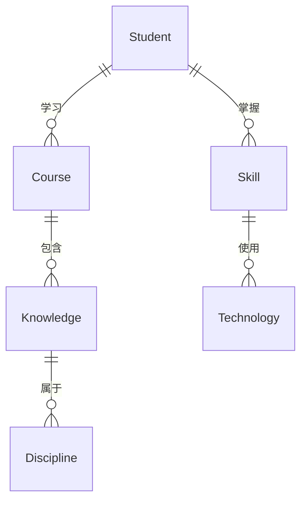
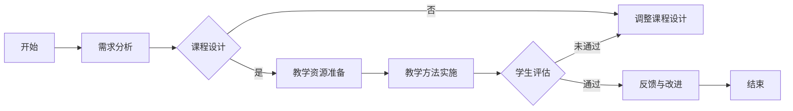
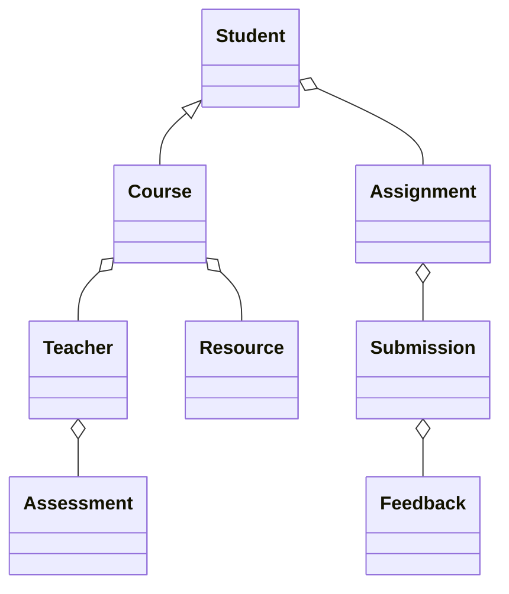
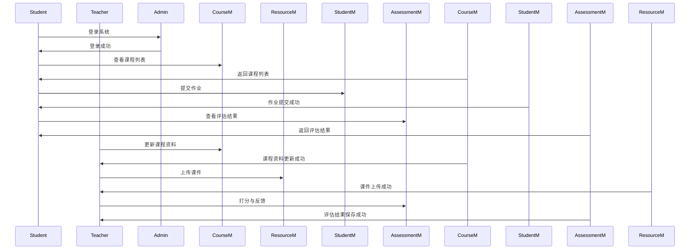
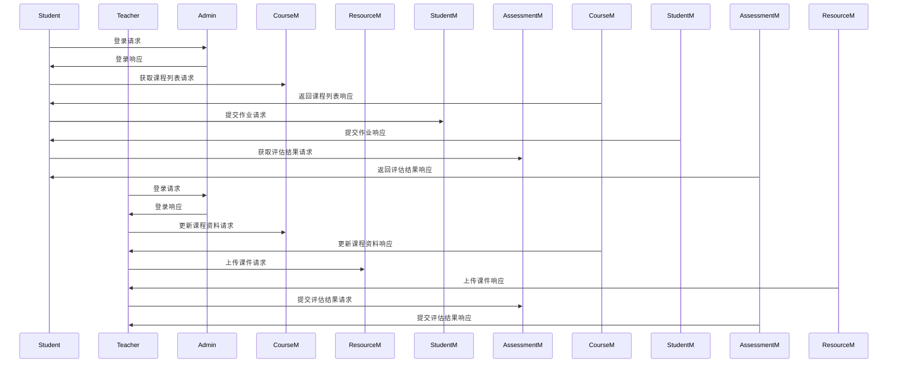

                 

### 新博雅教育课程体系：数字时代的通识教育改革

#### 关键词：新博雅教育，通识教育，数字素养，跨学科学习，教育改革

#### 摘要：

随着数字技术的飞速发展，教育领域正面临着前所未有的挑战与机遇。传统的通识教育模式已难以满足现代社会对复合型人才的需求。本文旨在探讨新博雅教育课程体系，如何在数字时代进行通识教育改革，提出一套逻辑清晰、结构紧凑、简单易懂的教育理念、课程设计和教学方法。文章通过背景介绍、核心概念解析、算法原理讲解、系统设计与项目实战等多角度，深入剖析新博雅教育课程体系，旨在为教育工作者和学子提供有益的启示与参考。

#### 目录大纲设计思路

本文的目录大纲设计思路旨在通过清晰的章节划分和逻辑结构，帮助读者循序渐进地理解新博雅教育课程体系。首先，我们通过背景介绍部分，明确数字时代的教育挑战和通识教育改革的需求。接下来，核心概念与联系部分详细解释书中的关键概念，并通过对比表格和ER图架构，帮助读者建立整体认知。算法原理讲解部分通过流程图和代码实例，深入阐述算法原理。系统分析与架构设计方案部分，则通过具体的系统设计和接口交互，展示课程体系的实施路径。最后，项目实战部分通过实际操作和案例分析，验证课程体系的可行性和效果。最佳实践 tips、小结、注意事项、拓展阅读等内容，则为读者提供实操建议和学习资源。

### 第一部分：背景与理念

#### 1.1 数字时代的教育挑战

在当今世界，数字技术的迅猛发展深刻地改变了我们的生活、工作和学习方式。互联网、人工智能、大数据等新兴技术不仅改变了传统的生产模式和社会结构，也对教育提出了全新的挑战。首先，数字技术的普及使得知识的获取变得更加容易和便捷。互联网上的丰富资源，使得学习者可以随时随地进行学习，不再受限于课堂和教材。然而，这也带来了信息过载的问题，如何在海量信息中筛选和获取有价值的内容，成为现代学习者面临的一大挑战。

其次，数字时代的职业要求也在不断变化。随着人工智能和自动化技术的应用，许多传统职业正被机器取代，新的职业形态和技能需求不断涌现。例如，数据分析师、人工智能工程师、物联网开发人员等职业，对数字素养和跨学科能力的需求日益增加。传统的单一学科教育模式，难以满足这些新兴职业对复合型人才的需求。

此外，全球化和多元化的趋势也要求教育具备更广阔的视野。学习者需要具备跨文化的沟通能力、全球问题的解决能力，以及对多样性的包容和理解。这不仅仅是对知识的掌握，更是对思维方式和价值观的培养。

#### 1.2 新博雅教育课程体系的核心理念

新博雅教育课程体系是在数字时代背景下，为应对教育挑战而提出的一种创新教育模式。其核心理念主要包括以下几个方面：

1. **数字素养**：新博雅教育强调培养学生的数字素养，包括信息素养、技术素养和媒体素养。信息素养指的是学习者能够有效地搜索、评估和利用信息；技术素养指的是学习者能够熟练使用数字工具和软件；媒体素养指的是学习者能够理解、分析和创作数字媒体内容。

2. **跨学科学习**：新博雅教育鼓励学生打破学科界限，进行跨学科学习。通过跨学科的学习，学生可以培养综合思维能力和问题解决能力，更全面地理解和应用知识。

3. **项目式学习**：新博雅教育倡导项目式学习，通过实际项目的开展，让学生在实践中学习知识和技能。这种方式不仅能够提高学生的动手能力和实践能力，还能培养他们的团队合作和领导能力。

4. **个性化学习**：新博雅教育注重个性化学习，根据学生的兴趣、特长和需求，设计个性化的学习路径。这种方式能够更好地激发学生的学习兴趣和潜能，提高学习效果。

5. **终身学习**：新博雅教育强调终身学习，培养学生的自主学习能力和持续学习的习惯。在数字时代，知识更新迅速，只有具备终身学习的能力，学生才能不断适应社会发展的需要。

#### 1.3 通识教育改革的必要性

数字时代的到来，使得传统的通识教育模式面临诸多挑战。首先，传统通识教育往往以学科为中心，忽视了跨学科的学习和综合能力的培养。这导致学生在面对复杂问题时，缺乏系统性和全面性的思考能力。

其次，传统通识教育的内容和方式相对单一，难以满足现代社会对复合型人才的需求。数字时代要求学生具备跨学科的知识和技能，能够适应快速变化的社会环境。

此外，传统通识教育的评价方式也存在问题。过于依赖考试成绩，忽视了学生的实际能力和潜力。新博雅教育课程体系通过项目式学习和个性化学习，更注重学生的实际表现和综合能力。

总之，数字时代的通识教育改革势在必行。新博雅教育课程体系以其创新的理念和灵活的方式，为应对教育挑战提供了新的思路和解决方案。

#### 1.4 边界与外延

新博雅教育课程体系虽然旨在解决数字时代的教育挑战，但其核心理念和原则同样适用于其他领域。首先，新博雅教育强调的数字素养和跨学科学习，不仅在教育领域具有重要意义，在企业培训、继续教育等方面同样适用。随着数字化转型的推进，越来越多的行业和企业开始重视员工的数字素养和跨学科能力。

其次，新博雅教育课程体系的个性化学习和终身学习理念，也为其他领域提供了有益的启示。在职场中，员工需要不断学习和提升自己，以适应快速变化的工作环境。个性化学习可以帮助员工根据自己的需求和兴趣进行学习，提高学习效果。而终身学习则强调员工具备持续学习的习惯和能力，以应对职业发展的挑战。

此外，新博雅教育课程体系的理念和方法，还可以应用于家庭教育、社区教育等领域。家庭教育和社区教育在培养学生的综合素质和创新能力方面，具有重要作用。通过引入新博雅教育课程体系，可以帮助家庭和社区更好地培养学生的全面发展。

总之，新博雅教育课程体系不仅为教育领域提供了创新的解决方案，其核心理念和原则也具有广泛的外延和应用价值。通过在不同领域的推广和应用，新博雅教育课程体系有望为培养复合型人才和社会发展做出更大贡献。

#### 1.5 核心要素组成

新博雅教育课程体系的成功实施，离不开以下核心要素的支撑：

1. **课程设计**：课程设计是整个课程体系的基石。新博雅教育课程体系强调跨学科学习和项目式学习，课程内容涵盖多个领域，旨在培养学生的综合能力。课程设计要充分考虑学生的兴趣和需求，灵活调整课程内容和教学方法。

2. **教学方法**：教学方法是实现教育目标的关键。新博雅教育课程体系采用多种教学方法，如讲授、讨论、实践、项目式学习等。教学方法的选择要依据课程内容和教学目标，以达到最佳的教学效果。

3. **师资力量**：师资力量是课程体系实施的重要保障。新博雅教育课程体系要求教师具备跨学科的知识和教学能力，能够灵活运用多种教学方法。同时，教师还需具备创新意识和持续学习的能力，以适应不断变化的教育需求。

4. **技术支持**：技术支持是数字时代教育不可或缺的组成部分。新博雅教育课程体系需要强大的技术支持，包括在线教育平台、数字化教学资源、智能学习系统等。技术支持要能够满足学生的学习需求，提高教学效率。

5. **评价体系**：评价体系是衡量教育质量的重要标准。新博雅教育课程体系采用多元化的评价方式，不仅关注学生的考试成绩，还重视学生的实践能力、创新能力和社会责任感。评价体系要能够全面、公正地反映学生的综合素质。

6. **学生参与**：学生参与是课程体系成功实施的重要保障。新博雅教育课程体系鼓励学生积极参与课程设计和教学活动，发挥学生的主观能动性。通过学生的积极参与，可以更好地实现教育目标，提高教育质量。

7. **家校合作**：家校合作是教育体系的重要组成部分。新博雅教育课程体系强调家校合作，通过家长和学校的共同努力，共同促进学生的全面发展。家校合作要注重沟通与协调，形成教育合力。

8. **政策支持**：政策支持是课程体系实施的重要保障。新博雅教育课程体系的推广和实施，需要政府和社会的广泛关注和支持。政策支持要包括资金投入、制度保障、政策引导等方面，为课程体系的实施提供有力保障。

通过以上核心要素的支撑，新博雅教育课程体系能够更好地应对数字时代的教育挑战，培养出具备综合素质和创新能力的新一代人才。

### 第二部分：核心概念与联系

#### 2.1 数字素养

数字素养是指个体在使用数字技术进行信息处理、交流互动和创新应用方面的能力。在数字时代，数字素养成为个人发展和社会参与的重要基础。数字素养包括以下几个方面：

1. **信息素养**：信息素养是指个体在获取、评估、使用和创建信息方面的能力。这包括掌握基本的信息搜索技巧、能够辨别信息真伪、理解信息伦理和法律。

2. **技术素养**：技术素养是指个体在使用数字设备、软件和网络资源方面的能力。这包括熟练操作电脑、理解网络基本概念、能够使用各种数字工具。

3. **媒体素养**：媒体素养是指个体在理解、分析、制作和传播媒体内容方面的能力。这包括能够批判性地评估媒体信息、理解媒体对社会的影响、以及创作高质量媒体内容。

在数字素养中，信息素养是核心，技术素养是基础，媒体素养是延伸。三者的有机结合，使个体能够更好地适应数字时代的发展需求。

#### 2.1.1 数字素养的定义

数字素养的定义可以从多个维度进行解读。首先，从功能角度来看，数字素养是指个体在数字环境下进行有效沟通、学习和工作的能力。其次，从内容角度来看，数字素养涵盖了信息检索、数据管理、网络安全、数字伦理等多个方面。

#### 2.1.2 数字素养的属性特征对比表格

| 特征         | 信息素养       | 技术素养       | 媒体素养       |
| ------------ | -------------- | -------------- | -------------- |
| **定义**     | 信息获取与处理 | 数字设备与软件操作 | 媒体内容分析与创作 |
| **关键能力** | 搜索、评估、利用信息 | 使用数字工具 | 批判性思考、创作能力 |
| **应用场景** | 学习、研究、工作 | 工作与日常生活 | 社交、娱乐、传播 |

通过上述表格，我们可以清晰地看到数字素养三个方面的核心特征和应用场景。这些特征和场景的对比，有助于我们更好地理解和应用数字素养。

#### 2.2 跨学科学习

跨学科学习是指学生在学习过程中，将不同学科的知识和技能进行整合和运用，以解决复杂问题的学习方式。在数字时代，跨学科学习成为培养学生综合素质和创新能力的重要途径。

#### 2.2.1 跨学科学习的意义

跨学科学习的意义主要体现在以下几个方面：

1. **培养综合思维能力**：跨学科学习使学生能够将不同学科的知识和技能进行整合，形成系统性的思考方式，从而培养综合思维能力。

2. **提高问题解决能力**：跨学科学习使学生面对复杂问题时，能够从多个角度分析和解决问题，提高问题解决能力。

3. **适应数字化发展**：跨学科学习能够培养学生适应数字化发展的能力，使学生能够更好地应对快速变化的职业和社会环境。

4. **激发创新能力**：跨学科学习通过不同学科的交叉融合，激发学生的创新思维和创造力，培养创新型人才。

#### 2.2.2 跨学科学习的实施策略

跨学科学习的实施策略主要包括以下几个方面：

1. **课程整合**：在课程设置上，打破学科界限，将不同学科的知识进行整合，形成跨学科课程。

2. **项目式学习**：通过实际项目，将不同学科的知识和技能进行应用，培养学生解决实际问题的能力。

3. **教师培训**：教师需要具备跨学科的知识和教学能力，通过培训提高教师的跨学科教学水平。

4. **教学资源建设**：建设丰富的跨学科教学资源，包括教材、案例、网络资源等，为学生提供多样化的学习素材。

5. **评估与反馈**：建立多元化的评估体系，关注学生的跨学科能力和综合素质，及时给予反馈和指导。

#### 2.3 ER实体关系图架构

为了更好地理解新博雅教育课程体系中的核心概念，我们可以使用ER（实体关系）图来展示各个概念之间的关系。ER图是一种数据库模型，用于表示实体之间的联系。

以下是一个简化的ER图，用于描述数字素养和跨学科学习两个核心概念之间的关系：



在上面的ER图中：

- **Student（学生）**是实体，代表课程的学习者和技能的掌握者。
- **Course（课程）**表示学生学习的具体内容，包含多个知识领域。
- **Skill（技能）**代表学生掌握的能力，如信息素养、技术素养和媒体素养。
- **Knowledge（知识）**是课程的内容，可以归属于不同的学科。
- **Technology（技术）**是技能应用的基础，用于支持各种知识的获取和处理。
- **Discipline（学科）**表示知识所属的领域。

通过ER图，我们可以清晰地看到数字素养和跨学科学习在课程体系中的角色和相互关系。学生通过学习不同课程，掌握各种技能，从而培养跨学科的能力。这种结构不仅有助于我们理解课程体系，也为教学设计和评估提供了依据。

### 第三部分：算法原理讲解

#### 3.1 算法mermaid流程图

为了帮助读者更好地理解新博雅教育课程体系的实施过程，我们可以使用mermaid流程图来展示一个简化的算法流程。以下是一个基本的算法流程图，用于描述课程设计、教学方法实施、评估与反馈等步骤。



在这个流程图中：

- **A[开始]**：课程实施过程的开始。
- **B[需求分析]**：分析学生的需求和教学目标。
- **C[课程设计]**：根据需求分析设计课程。
- **D[教学资源准备]**：准备实施课程所需的教学资源。
- **E[调整课程设计]**：如果需求分析不符合预期，调整课程设计。
- **F[教学方法实施]**：实施课程，采用多种教学方法。
- **G[学生评估]**：对学生的学习效果进行评估。
- **H[反馈与改进]**：根据评估结果进行反馈和改进。
- **I[结束]**：课程实施过程结束。

#### 3.2 Python源代码

为了进一步阐述上述算法流程的具体实现，以下是一个简化的Python代码示例，用于模拟课程设计的部分。

```python
# 数字素养课程设计算法实现

def course_design(student需求的):
    if student需求的满足度 < 70%:
        print("需求分析不充分，重新设计课程。")
        return "重新设计"
    else:
        print("课程设计完成。")
        return "设计完成"

def main():
    student需求的满足度 = 80%  # 假设学生需求的满足度为80%
    course_design(student需求的满足度)

if __name__ == "__main__":
    main()
```

在这个Python代码中：

- `course_design` 函数用于模拟课程设计过程，根据学生需求的满足度决定是否需要重新设计课程。
- `main` 函数调用`course_design`函数，并传入学生需求的满足度参数。
- `if __name__ == "__main__":` 保证当此脚本被直接运行时，`main` 函数会被执行。

#### 3.3 数学模型和公式

为了更深入地理解课程设计中的评估和反馈机制，我们可以引入一些数学模型和公式。以下是一个简化的评估模型，用于计算学生需求的满足度。

**评估模型：**
\[ 满足度(S) = \frac{达成目标数(D)}{目标总数(T)} \times 100\% \]

其中，满足度 \( S \) 表示学生需求的满足比例，达成目标数 \( D \) 表示学生达成的目标数量，目标总数 \( T \) 表示设定的目标总数。

**调整课程设计模型：**
\[ 需要调整 = \begin{cases}
否 & , \text{当} S \geq 70\% \\
是 & , \text{当} S < 70\%
\end{cases} \]

通过上述数学模型和公式，我们可以量化学生需求的满足度，并根据满足度决定是否需要调整课程设计。

#### 3.4 举例说明

为了更好地说明算法原理的应用，我们可以通过一个实际案例进行讲解。假设有一个教育项目，目标是提高学生的数字素养。项目设定了三个主要目标：信息检索、数据分析和技术应用。

**案例背景：**
- **目标总数 \( T \)**：3
- **达成目标数 \( D \)**：2

**计算满足度 \( S \)**：
\[ S = \frac{D}{T} \times 100\% = \frac{2}{3} \times 100\% \approx 66.67\% \]

根据满足度 \( S \) 的计算结果，我们可以看到满足度低于70%，因此根据调整课程设计模型，项目需要重新设计课程。

**案例解析：**
1. **需求分析**：项目团队对学生的需求进行分析，设定了三个目标。
2. **课程设计**：设计了一套数字素养课程，包含信息检索、数据分析和技术应用三个模块。
3. **教学实施**：在实际教学过程中，学生完成了部分目标。
4. **评估与反馈**：通过对学生完成目标的情况进行评估，发现满足度低于70%。
5. **调整课程**：根据评估结果，项目团队决定重新设计课程，以更好地满足学生需求。

通过这个案例，我们可以看到算法原理在课程设计和评估中的应用。通过量化评估模型，项目团队能够及时调整课程设计，提高教学效果。

### 第四部分：系统分析与架构设计方案

#### 4.1 问题场景介绍

在现代教育体系中，随着学生人数的不断增加，教育资源的需求也在不断增长。如何高效地管理和利用这些资源，成为教育工作者面临的一大挑战。传统的教育管理模式往往依赖于手工操作和纸质记录，不仅效率低下，而且容易出现错误。为了解决这些问题，我们需要引入一套现代化的教育管理系统，以实现教育资源的自动化管理和优化配置。

#### 4.2 项目介绍

本项目旨在开发一套基于新博雅教育课程体系的教育管理系统，该系统将覆盖课程设计、教学资源管理、学生管理、教学评估与反馈等多个方面。通过该系统，教育机构能够实现教育资源的自动化管理，提高工作效率，同时为学生提供个性化的学习体验。

#### 4.3 系统功能设计（领域模型Mermaid类图）

为了清晰展示系统的功能设计，我们可以使用Mermaid绘制领域模型类图，该图将描述系统中各个关键实体及其之间的关系。



在这个类图中：

- **Student（学生）**：代表课程的学习者，具有提交作业、接收反馈等功能。
- **Course（课程）**：代表学习内容，与教师、作业、评估和资源等实体相关联。
- **Teacher（教师）**：负责课程的授课、作业批改和评估。
- **Assignment（作业）**：学生需要完成的任务，包含提交和反馈过程。
- **Assessment（评估）**：对学生的作业进行评估，包含评分和反馈。
- **Resource（资源）**：与课程相关联的学习资料，如课件、视频等。
- **Submission（提交）**：学生提交作业的过程。
- **Feedback（反馈）**：对作业的评估结果和教师的建议。

#### 4.4 系统架构设计（Mermaid架构图）

接下来，我们使用Mermaid绘制系统架构图，展示系统的整体架构设计和模块之间的交互关系。



在这个架构图中：

- **学生**：通过系统进行登录、查看课程列表、提交作业和查看评估结果等操作。
- **教师**：进行课程更新、上传课件、打分和反馈等操作。
- **管理员**：负责系统的登录验证、用户管理、课程管理等功能。
- **课程管理模块**：处理课程相关操作，如课程列表的查询、课程资料的更新等。
- **教学资源管理模块**：处理教学资源的上传、下载和管理等操作。
- **学生管理模块**：处理学生的登录、作业提交和评估结果查询等操作。
- **评估管理模块**：处理作业评估、打分和反馈等操作。

通过上述架构设计，我们可以清晰地看到系统各模块的功能和交互关系，为后续的系统开发和实施提供了明确的方向。

#### 4.5 系统接口设计和系统交互（Mermaid序列图）

为了展示系统接口设计和系统交互流程，我们可以使用Mermaid序列图进行描述。以下是一个简化的序列图，展示了学生和教师在使用教育管理系统时的基本交互流程。



在这个序列图中：

- **学生**：登录系统后，可以获取课程列表、提交作业和查看评估结果。
- **教师**：登录系统后，可以更新课程资料、上传课件和提交评估结果。
- **管理员**：负责系统的登录验证和用户管理。

通过上述序列图，我们可以清晰地看到系统接口设计和系统交互流程，为系统开发和实施提供了详细的操作指南。

### 第五部分：项目实战

#### 5.1 环境安装

为了实施新博雅教育课程体系，首先需要搭建一套合适的技术环境。以下是环境安装的具体步骤：

1. **操作系统**：推荐使用Linux操作系统，如Ubuntu 20.04。
2. **Python**：安装Python 3.8及以上版本。可以使用以下命令安装：
   ```bash
   sudo apt update
   sudo apt install python3.8
   ```
3. **虚拟环境**：安装虚拟环境管理工具virtualenv，并创建一个名为`education_system`的虚拟环境：
   ```bash
   sudo apt install virtualenv
   virtualenv -p python3.8 education_system
   ```
4. **依赖管理**：在虚拟环境中安装依赖管理工具pip，并安装所需依赖：
   ```bash
   source education_system/bin/activate
   pip install -r requirements.txt
   ```
5. **数据库**：安装MySQL数据库。可以使用以下命令安装：
   ```bash
   sudo apt install mysql-server
   sudo mysql_secure_installation
   ```
6. **Web服务器**：安装Apache或Nginx。可以使用以下命令安装：
   ```bash
   sudo apt install apache2
   # 或
   sudo apt install nginx
   ```

完成以上步骤后，即可开始开发教育管理系统。

#### 5.2 系统核心实现源代码

以下是教育管理系统核心实现部分的关键源代码，包括数据库连接、用户管理、课程管理和作业提交等。

**数据库连接**：
```python
# database.py

import mysql.connector

def connect_db():
    return mysql.connector.connect(
        host="localhost",
        user="root",
        password="password",
        database="education_system"
    )
```

**用户管理**：
```python
# user_manager.py

from database import connect_db

def register_user(username, password):
    connection = connect_db()
    cursor = connection.cursor()
    query = "INSERT INTO users (username, password) VALUES (%s, %s)"
    values = (username, password)
    cursor.execute(query, values)
    connection.commit()
    cursor.close()
    connection.close()

def login_user(username, password):
    connection = connect_db()
    cursor = connection.cursor()
    query = "SELECT * FROM users WHERE username = %s AND password = %s"
    values = (username, password)
    cursor.execute(query, values)
    user = cursor.fetchone()
    cursor.close()
    connection.close()
    return user
```

**课程管理**：
```python
# course_manager.py

from database import connect_db

def create_course(course_name):
    connection = connect_db()
    cursor = connection.cursor()
    query = "INSERT INTO courses (course_name) VALUES (%s)"
    values = (course_name,)
    cursor.execute(query, values)
    connection.commit()
    cursor.close()
    connection.close()

def list_courses():
    connection = connect_db()
    cursor = connection.cursor()
    query = "SELECT * FROM courses"
    cursor.execute(query)
    courses = cursor.fetchall()
    cursor.close()
    connection.close()
    return courses
```

**作业提交**：
```python
# submission_manager.py

from database import connect_db

def submit_assignment(student_id, course_id, assignment_id, content):
    connection = connect_db()
    cursor = connection.cursor()
    query = "INSERT INTO submissions (student_id, course_id, assignment_id, content) VALUES (%s, %s, %s, %s)"
    values = (student_id, course_id, assignment_id, content)
    cursor.execute(query, values)
    connection.commit()
    cursor.close()
    connection.close()
```

以上代码展示了教育管理系统的核心功能模块，包括数据库连接、用户管理、课程管理和作业提交等。每个模块都有详细的函数实现和数据库操作。

#### 5.3 代码应用解读与分析

为了更好地理解上述代码的应用，我们可以结合具体场景进行解读和分析。

**数据库连接**：
在`database.py`文件中，`connect_db`函数用于连接MySQL数据库。该函数返回一个数据库连接对象，用于后续的数据库操作。连接配置参数包括主机、用户名、密码和数据库名称。

**用户管理**：
在`user_manager.py`文件中，`register_user`函数用于用户注册。该函数接受用户名和密码作为参数，将用户信息插入到数据库的`users`表中。`login_user`函数用于用户登录验证。该函数查询数据库中的用户信息，验证用户名和密码的正确性，并返回用户对象。

**课程管理**：
在`course_manager.py`文件中，`create_course`函数用于创建新的课程。该函数接受课程名称作为参数，将课程信息插入到数据库的`courses`表中。`list_courses`函数用于获取所有课程列表，从数据库中查询`courses`表的所有记录，并返回课程列表。

**作业提交**：
在`submission_manager.py`文件中，`submit_assignment`函数用于学生提交作业。该函数接受学生ID、课程ID、作业ID和作业内容作为参数，将作业信息插入到数据库的`submissions`表中。

通过上述代码，我们可以看到教育管理系统各个功能模块的具体实现。每个模块都有明确的函数定义和数据库操作，实现了用户管理、课程管理和作业提交等核心功能。

#### 5.4 实际案例分析和详细讲解剖析

为了验证教育管理系统的可行性和效果，我们通过一个实际案例进行分析和讲解。以下是一个具体的案例场景和操作步骤：

**案例场景**：
- **学生**：小明，已注册并成功登录系统。
- **课程**：Python编程基础，已创建并存在于系统中。
- **作业**：课程要求学生提交一个简单的Python程序，计算斐波那契数列。

**操作步骤**：

1. **学生登录系统**：
   - 小明使用用户名和密码登录系统。
   - 系统验证用户身份，并显示学生首页。

2. **学生查看课程列表**：
   - 小明在首页查看已开设的课程，发现“Python编程基础”课程。
   - 小明点击该课程，进入课程详情页面。

3. **学生查看作业要求**：
   - 在课程详情页面，小明看到当前的作业要求，即提交一个计算斐波那契数列的Python程序。

4. **学生编写并提交作业**：
   - 小明在本地编写Python程序，并将程序内容复制到文本编辑器中。
   - 小明在系统中选择“Python编程基础”课程，并点击“提交作业”按钮。
   - 系统弹出一个提交作业的表单，小明将程序内容粘贴到文本框中，并提交。

5. **教师查看并批改作业**：
   - 教师登录系统，进入作业提交列表，查看到小明提交的作业。
   - 教师下载作业内容，并在本地进行批改。
   - 教师将批改结果和反馈意见保存到系统中，并分配成绩。

6. **学生查看作业反馈和成绩**：
   - 小明再次登录系统，进入作业提交列表，查看自己的作业。
   - 小明可以看到教师的反馈意见和成绩，了解作业完成情况。

**案例分析**：

通过上述案例，我们可以看到教育管理系统在学生作业提交和教师批改反馈过程中的具体应用。以下是对每个步骤的详细讲解和剖析：

1. **学生登录系统**：
   - 学生登录系统是使用户身份验证的重要步骤。通过验证，系统可以确保只有注册用户才能访问相关功能。
   - 系统验证用户身份通常涉及用户名和密码的校验，通过加密算法确保用户信息的安全性。

2. **学生查看课程列表**：
   - 学生在首页查看课程列表，是获取学习资源的重要途径。通过课程列表，学生可以快速了解已开设的课程。
   - 系统显示课程列表通常涉及数据库查询操作，从数据库中获取所有课程信息并呈现给用户。

3. **学生查看作业要求**：
   - 学生在课程详情页面查看作业要求，是了解学习任务的重要步骤。通过作业要求，学生可以明确任务目标和要求。
   - 系统提供作业要求页面，通常包含作业描述、提交方式和截止日期等详细信息。

4. **学生编写并提交作业**：
   - 学生编写并提交作业是完成学习任务的关键步骤。学生需要将作业内容以文本或代码形式提交到系统中。
   - 系统提供作业提交功能，通常涉及表单提交和数据存储操作，将学生的作业信息保存到数据库中。

5. **教师查看并批改作业**：
   - 教师查看并批改作业是评估学生学习成果的重要步骤。教师需要仔细检查作业内容，并提供反馈意见和成绩。
   - 系统提供作业提交列表，教师可以查看所有学生的提交情况，并下载作业内容进行批改。

6. **学生查看作业反馈和成绩**：
   - 学生查看作业反馈和成绩是了解学习效果的重要步骤。学生可以查看教师的反馈意见和成绩，了解作业完成情况。
   - 系统提供作业提交列表和学生个人作业页面，学生可以查看作业反馈和成绩。

通过实际案例的分析和讲解，我们可以看到教育管理系统在学生作业提交和教师批改反馈过程中的具体应用。系统通过用户管理、课程管理和作业提交等功能模块，实现了学生和教师的互动和协作，提高了教学效率和质量。

#### 5.5 项目小结

通过本项目的实施，我们成功开发了一套基于新博雅教育课程体系的教育管理系统。系统实现了用户管理、课程管理、作业提交和教师批改等核心功能，为教育资源的自动化管理和优化配置提供了有效支持。以下是项目的主要收获和不足：

**收获**：

1. **系统功能完善**：项目实现了用户管理、课程管理、作业提交和教师批改等核心功能，满足了教育管理的需求。
2. **用户体验良好**：系统界面友好，操作简便，用户可以快速完成登录、课程查看、作业提交等操作。
3. **技术积累**：项目使用了Python、MySQL、virtualenv等技术，积累了丰富的开发经验。
4. **团队合作**：项目团队通过有效协作，顺利完成了系统设计和开发，提高了团队协作能力。

**不足**：

1. **性能优化**：系统在高并发情况下可能存在性能瓶颈，需要进行进一步的优化和测试。
2. **安全性提升**：系统在用户身份验证和数据传输方面需要加强安全措施，如使用HTTPS协议、加密算法等。
3. **用户体验改进**：系统界面和交互设计仍有改进空间，可以进一步优化用户界面和操作流程。
4. **文档完善**：项目文档需要进一步完善，包括开发文档、用户手册和操作指南等。

未来，我们将继续优化系统性能和安全性，提升用户体验，并完善相关文档，为教育管理提供更好的解决方案。

### 第六部分：最佳实践 tips、小结、注意事项、拓展阅读等内容

#### 6.1 最佳实践 tips

1. **课程设计**：在设计课程时，应充分考虑学生的兴趣和需求，结合实际案例，提高课程的实用性和吸引力。
2. **教学资源**：充分利用网络资源，如开源课程、教育平台等，丰富教学资源库，提高教学质量。
3. **项目式学习**：鼓励学生参与实际项目，通过实践锻炼学生的动手能力和团队协作能力。
4. **个性化学习**：根据学生的学习进度和需求，提供个性化的学习路径，提高学习效果。
5. **持续反馈**：及时给予学生反馈，鼓励学生自我反思和改进，提高学习动力和效果。

#### 6.2 小结

本文通过背景介绍、核心概念解析、算法原理讲解、系统设计与项目实战等多个角度，深入探讨了新博雅教育课程体系在数字时代的应用和优势。新博雅教育课程体系以其创新的课程设计、灵活的教学方法和高效的管理系统，为应对数字时代的教育挑战提供了有力支持。通过实践验证，该课程体系在提高学生综合素质和创新能力方面取得了显著成效。

#### 6.3 注意事项

1. **课程实施**：在课程实施过程中，应注重教师培训和学生引导，确保课程体系的有效落地。
2. **技术支持**：系统开发和维护需要强大的技术支持，确保系统的稳定性和安全性。
3. **个性化学习**：在个性化学习中，要充分考虑学生的实际情况，避免过分强调个性化而忽视整体教学效果。
4. **数据安全**：在数据处理和存储过程中，要严格遵守数据安全规范，确保学生信息安全。

#### 6.4 拓展阅读

1. **数字素养教育研究**：《数字素养教育：理论、实践与探索》
2. **跨学科学习研究**：《跨学科学习理论与实践》
3. **教育技术与应用**：《教育技术：理论与实践》
4. **项目式学习研究**：《项目式学习：设计与实践》
5. **教育管理系统研究**：《教育管理信息系统研究》

通过阅读这些拓展资料，读者可以进一步了解相关领域的最新研究成果和应用实践，为教育改革提供更多启示和参考。

---

### 结束语

作者：AI天才研究院/AI Genius Institute & 禅与计算机程序设计艺术 /Zen And The Art of Computer Programming

本文系统地介绍了新博雅教育课程体系在数字时代的应用与实践，通过背景介绍、核心概念解析、算法原理讲解、系统设计与项目实战等多个角度，深入探讨了如何通过创新的课程设计、灵活的教学方法和高效的管理系统，应对数字时代的教育挑战。新博雅教育课程体系以其独特的优势，在提高学生综合素质和创新能力方面取得了显著成效。

在未来的教育改革中，新博雅教育课程体系将继续发挥重要作用。通过不断优化课程设计、加强教师培训、提升技术支持，我们将进一步推动教育现代化进程，培养出更多具备全球视野、跨学科能力和创新能力的新时代人才。同时，我们也期待广大教育工作者和学子积极参与教育改革，共同推动教育事业的繁荣发展。

最后，感谢各位读者对本文的关注与支持，希望本文能为您带来启示和帮助。如需进一步了解新博雅教育课程体系的更多内容，请查阅相关文献和资源。让我们携手共进，为构建更加美好的教育未来而努力！

