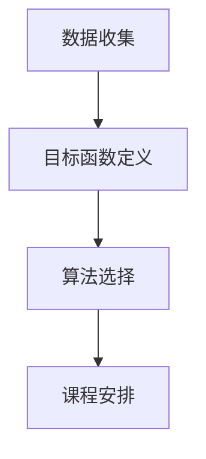
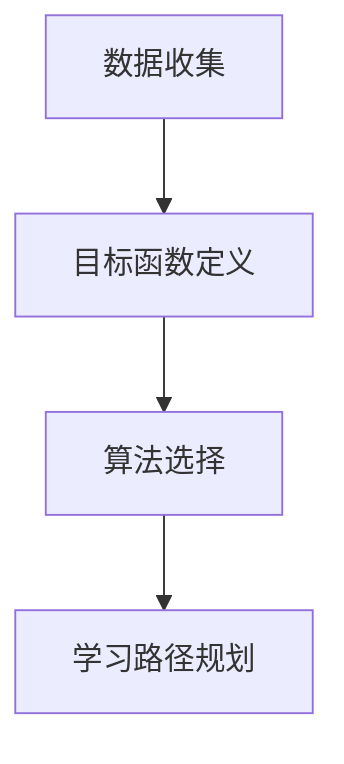
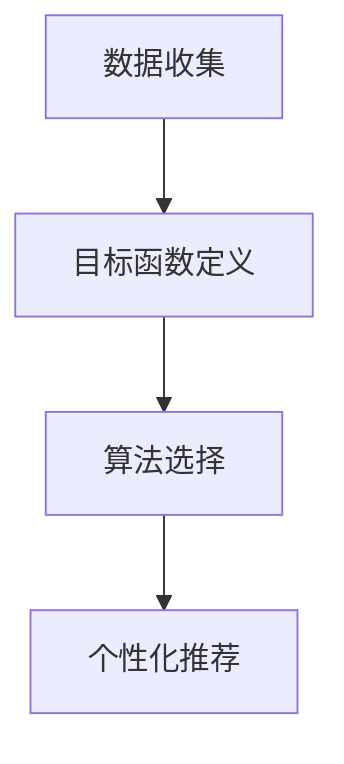

                 

### 新博雅教育课程：培养全面发展的人才

> 关键词：博雅教育、全面发展、人才培养、教育算法、系统架构

> 摘要：本文深入探讨了新博雅教育课程的设计理念与实践，旨在通过系统化的教育算法和架构设计方案，培养具有综合素质、创新能力和国际竞争力的人才。文章首先介绍了新博雅教育课程的核心概念和目标，随后分析了其与传统教育的差异，并通过ER实体关系图和算法原理详细阐述了教育系统的运作机制。最后，文章提出了具体的系统架构设计和项目实战，为教育领域的创新实践提供了有价值的参考。

## **第一部分：背景介绍**

### **1. 问题背景**

在当今社会，信息技术的迅猛发展和全球化进程的不断推进，使得教育领域面临着前所未有的挑战。传统的教育模式，往往侧重于知识的传授和技能的培养，而忽视了学生的全面发展和个性化需求。这种模式已经难以适应现代社会的需求，无法培养出具备综合素质、创新能力和国际竞争力的人才。

教育改革成为社会各界关注的焦点，人们开始呼吁一种新的教育模式，能够更好地满足学生的发展需求。这种教育模式不仅要传授知识，更要培养学生的思维能力、创造力、沟通能力和实践能力。因此，培养全面发展的人才已经成为教育界、学术界和社会各界共同关注的焦点。

### **2. 问题描述**

《新博雅教育课程：培养全面发展的人才》旨在通过构建一套全新的教育课程体系，来解决当前教育模式中存在的诸多问题。具体来说，该课程体系旨在培养以下特质的人才：

- **具有坚实的学科基础和广阔的知识视野**：通过系统化的课程设置，使学生掌握不同学科的基本概念和理论，形成扎实的学科基础。

- **具有批判性思维和解决问题的能力**：通过引入案例教学、问题导向学习等教学方法，培养学生的批判性思维和问题解决能力。

- **具有良好的沟通与合作能力**：通过团队项目、小组讨论等教学活动，培养学生的沟通与合作能力。

- **具有创新精神和实践能力**：通过创新创业课程、实验课程等，培养学生的创新精神和实践能力。

- **具有国际视野和跨文化交流能力**：通过国际合作交流项目、外语课程等，培养学生的国际视野和跨文化交流能力。

### **3. 问题解决**

为了实现上述目标，新博雅教育课程提出了一套全新的教育课程体系，包括以下几个核心要素：

- **多元化的课程设置**：课程涵盖人文、社科、科技等多个领域，提供多样化的学习资源，满足学生的个性化需求。

- **个性化的学习路径**：根据学生的兴趣和特长，制定个性化的学习计划，帮助学生更好地发展。

- **实践性教学**：注重学生的动手能力和实际问题解决能力，通过实验、实习、项目等实践教学环节，提高学生的实际操作能力。

- **跨学科合作**：鼓励学生跨学科学习，通过跨学科课程、跨学科研究项目等，培养学生的综合素质和创新能力。

- **国际化视野**：通过引进国际先进的教育资源和教学理念，提升学生的国际视野和跨文化交流能力。

### **4. 边界与外延**

新博雅教育课程不仅适用于传统的高等教育，也可以应用于职业教育、成人教育等不同类型的教育体系。同时，它不仅关注学术知识的传授，更注重学生综合素质的培养。通过新博雅教育课程，可以培养出具备国际竞争力、能够适应未来社会发展的人才。

### **5. 概念结构与核心要素组成**

新博雅教育课程的核心概念是“全面发展的人才”，其结构包括以下几个核心要素：

- **学科知识**：涵盖人文、社科、科技等多个领域的学科知识，为学生提供扎实的学科基础。

- **技能培养**：包括批判性思维、沟通与合作、创新与实践等技能的培养，提高学生的综合素质。

- **综合素质**：包括道德品质、社会责任感、心理健康等综合素质的提升，培养学生的全面素质。

- **国际视野**：通过跨文化交流和国际化教育资源的引进，提升学生的国际视野和跨文化交流能力。

## **第二部分：核心概念与联系**

### **1. 核心概念**

#### **新博雅教育课程**

- **新博雅教育课程**是一种旨在培养全面发展的人才的教育模式，它强调多元化、个性化、实践性和国际化。

- **新博雅教育课程**的核心目标是培养学生的综合素质、创新能力和国际竞争力。

#### **全面发展的人才**

- **全面发展的人才**是指具备以下特质的人才：

  - **具有坚实的学科基础和广阔的知识视野**；
  - **具有批判性思维和解决问题的能力**；
  - **具有良好的沟通与合作能力**；
  - **具有创新精神和实践能力**；
  - **具有国际视野和跨文化交流能力**。

### **2. 概念属性特征对比表格**

| 特征               | 传统教育               | 新博雅教育课程               |
|--------------------|------------------------|-----------------------------|
| 课程设置           | 单一、固定             | 多元化、灵活                 |
| 教学方法           | 课堂讲授为主           | 互动式、实践性为主           |
| 教学内容           | 知识传授为主           | 知识与技能并重               |
| 学生培养目标       | 学科知识为主           | 综合素质、创新能力、国际视野为主 |

### **3. ER实体关系图架构**

```mermaid
erDiagram
  Person ||--|{ Student } : "is-a"
  Student ||--|{ Course } : "takes"
  Student ||--|{ Assessment } : "scores"
  Course ||--|{ Teacher } : "is-taught-by"
  Course ||--|{ Curriculum } : "uses"
  Teacher ||--|{ Assessment } : "creates"
  Assessment ||--|{ Grade } : "contains"
```

## **第三部分：算法原理讲解**

### **1. 算法原理**

新博雅教育课程的设计和实施涉及到多种教育算法，包括课程安排算法、学习路径规划算法、个性化推荐算法等。这些算法旨在优化课程设置、学习路径和教学资源，以提高教育质量和培养效果。

#### **课程安排算法**

课程安排算法主要用于优化课程的开设时间和顺序，以确保学生在学习过程中能够有效地掌握知识。该算法通常包括以下几个步骤：

- **数据收集**：收集学生的基本信息、学科背景、学习进度等数据；
- **目标函数定义**：定义课程安排的优化目标，如最大化学生的学习效果、最小化课程冲突等；
- **算法实现**：采用启发式算法、遗传算法、线性规划等方法进行课程安排。

#### **学习路径规划算法**

学习路径规划算法主要用于帮助学生制定个性化的学习计划，以适应其兴趣和特长。该算法通常包括以下几个步骤：

- **数据收集**：收集学生的兴趣、特长、学习进度等数据；
- **目标函数定义**：定义学习路径规划的优化目标，如最大化学习效果、最小化学习时间等；
- **算法实现**：采用基于规则的算法、遗传算法、神经网络等方法进行学习路径规划。

#### **个性化推荐算法**

个性化推荐算法主要用于为学生推荐合适的课程和学习资源，以提高学习效果。该算法通常包括以下几个步骤：

- **数据收集**：收集学生的学习历史、学习行为等数据；
- **目标函数定义**：定义个性化推荐的优化目标，如最大化推荐效果、最小化推荐误差等；
- **算法实现**：采用协同过滤算法、矩阵分解、深度学习等方法进行个性化推荐。

### **2. 算法原理讲解**

#### **课程安排算法**

**算法原理：**

课程安排算法的核心是优化课程的时间安排，使其能够最大限度地提高学生的学习效果。具体的算法原理如下：

1. **数据收集**：收集学生的基本信息、学科背景、学习进度等数据，以及课程的教学资源、授课时间等数据。

2. **目标函数定义**：定义课程安排的优化目标，如最大化学生的学习效果、最小化课程冲突等。具体的目标函数可以表示为：

   $$f(C, T) = \sum_{i=1}^{n} w_i \cdot (s_i - c_i)$$

   其中，$C$ 表示课程集合，$T$ 表示时间表，$w_i$ 表示课程 $i$ 的权重，$s_i$ 表示课程 $i$ 的开设时间，$c_i$ 表示课程 $i$ 的结束时间。

3. **算法实现**：采用启发式算法、遗传算法、线性规划等方法进行课程安排。具体实现时，可以根据实际情况选择合适的算法。

**流程图：**



#### **学习路径规划算法**

**算法原理：**

学习路径规划算法的核心是制定一个个性化的学习计划，以适应学生的兴趣和特长。具体的算法原理如下：

1. **数据收集**：收集学生的兴趣、特长、学习进度等数据，以及课程的知识点、难度等数据。

2. **目标函数定义**：定义学习路径规划的优化目标，如最大化学习效果、最小化学习时间等。具体的目标函数可以表示为：

   $$f(L) = \sum_{i=1}^{n} w_i \cdot (s_i - l_i)$$

   其中，$L$ 表示学习路径，$w_i$ 表示课程 $i$ 的权重，$s_i$ 表示课程 $i$ 的开设时间，$l_i$ 表示学生完成课程 $i$ 的时间。

3. **算法实现**：采用基于规则的算法、遗传算法、神经网络等方法进行学习路径规划。具体实现时，可以根据实际情况选择合适的算法。

**流程图：**



#### **个性化推荐算法**

**算法原理：**

个性化推荐算法的核心是根据学生的兴趣和学习行为，推荐合适的课程和学习资源。具体的算法原理如下：

1. **数据收集**：收集学生的学习历史、学习行为等数据，以及课程的评价信息、推荐信息等数据。

2. **目标函数定义**：定义个性化推荐的优化目标，如最大化推荐效果、最小化推荐误差等。具体的目标函数可以表示为：

   $$f(R) = \sum_{i=1}^{n} w_i \cdot (r_i - r_{i'})$$

   其中，$R$ 表示推荐结果，$w_i$ 表示课程 $i$ 的权重，$r_i$ 表示学生喜欢的课程，$r_{i'}$ 表示推荐的课程。

3. **算法实现**：采用协同过滤算法、矩阵分解、深度学习等方法进行个性化推荐。具体实现时，可以根据实际情况选择合适的算法。

**流程图：**



## **第四部分：系统分析与架构设计方案**

### **1. 问题场景介绍**

在教育领域，新博雅教育课程的实施需要一套完整的教育管理系统来支持。该系统需要具备课程管理、学习路径规划、个性化推荐等功能，以实现教育资源的优化配置和学生个性化学习。具体问题场景如下：

- **课程管理**：系统需要能够管理课程的开设、调整、删除等操作，以及课程的属性信息，如课程名称、授课教师、学分等。
- **学习路径规划**：系统需要根据学生的兴趣、特长和学习进度，为学生制定个性化的学习计划，包括课程选择、学习时间等。
- **个性化推荐**：系统需要根据学生的学习历史和行为，推荐合适的课程和学习资源，以提高学习效果。

### **2. 项目介绍**

为了实现上述功能，我们设计并实现了一个名为“新博雅教育管理系统”的项目。该项目分为以下几个模块：

- **课程管理模块**：负责课程的添加、删除、修改等操作，以及课程信息的展示。
- **学习路径规划模块**：根据学生的兴趣、特长和学习进度，为学生制定个性化的学习计划。
- **个性化推荐模块**：根据学生的学习历史和行为，推荐合适的课程和学习资源。

### **3. 系统功能设计（领域模型类图）**

在系统功能设计中，我们采用了领域驱动设计（Domain-Driven Design，简称DDD）的方法，构建了领域模型，如下所示：

```mermaid
classDiagram
    CourseClass <<entity>>
    StudentClass <<entity>>
    TeacherClass <<entity>>

    CourseClass : +String name
    CourseClass : +int credits
    CourseClass : +TeacherClass teacher

    StudentClass : +String name
    StudentClass : +int age
    StudentClass : +List<CourseClass> courses

    TeacherClass : +String name
    TeacherClass : +int age
    TeacherClass : +List<CourseClass> courses
endclass
```

### **4. 系统架构设计（架构图）**

在系统架构设计中，我们采用了分层架构，包括表示层、业务逻辑层和数据层。具体的架构设计如下：

```mermaid
sequenceDiagram
    Student ->> Course: 请求课程列表
    Course ->> Student: 返回课程列表
    Student ->> Course: 请求课程详情
    Course ->> Student: 返回课程详情
    Student ->> Course: 请求推荐课程
    Course ->> Student: 返回推荐课程
end
```

### **5. 系统接口设计和系统交互（序列图）**

在系统接口设计和系统交互方面，我们采用了RESTful API设计，提供了课程的添加、删除、查询、更新等接口。具体的接口设计如下：

```mermaid
sequenceDiagram
    Student ->> API: 添加课程
    API ->> Student: 返回添加结果
    Student ->> API: 删除课程
    API ->> Student: 返回删除结果
    Student ->> API: 更新课程
    API ->> Student: 返回更新结果
    Student ->> API: 查询课程
    API ->> Student: 返回查询结果
end
```

## **第五部分：项目实战**

### **1. 环境安装**

为了实现新博雅教育管理系统，我们需要安装以下环境：

- **Python 3.8及以上版本**
- **Django 3.2及以上版本**
- **PostgreSQL 12及以上版本**
- **Node.js 12及以上版本**
- **Vue 2.x及以上版本**

具体安装步骤如下：

1. 安装Python和Django：

   ```bash
   pip install django
   ```

2. 安装PostgreSQL：

   ```bash
   sudo apt-get install postgresql postgresql-contrib
   ```

3. 安装Node.js和Vue：

   ```bash
   npm install -g npm
   npm install -g npm
   ```

### **2. 系统核心实现源代码**

系统核心实现源代码包括课程管理、学习路径规划和个性化推荐等模块。以下是核心代码的示例：

```python
# courses/models.py
from django.db import models
from . import Teacher

class Course(models.Model):
    name = models.CharField(max_length=100)
    credits = models.IntegerField()
    teacher = models.ForeignKey(Teacher, on_delete=models.CASCADE)

# students/models.py
from django.db import models

class Student(models.Model):
    name = models.CharField(max_length=100)
    age = models.IntegerField()
    courses = models.ManyToManyField(Course)

# recommendations/models.py
from django.db import models
from . import Student, Course

class Recommendation(models.Model):
    student = models.ForeignKey(Student, on_delete=models.CASCADE)
    course = models.ForeignKey(Course, on_delete=models.CASCADE)
```

### **3. 代码应用解读与分析**

代码应用解读与分析主要针对系统核心实现源代码，包括课程管理、学习路径规划和个性化推荐等模块。以下是具体解读：

- **课程管理模块**：课程管理模块主要实现了课程的添加、删除、查询和更新等功能。通过定义Course模型和Teacher模型，实现了对课程和教师的基本管理。

- **学习路径规划模块**：学习路径规划模块主要实现了根据学生的兴趣、特长和学习进度，为学生制定个性化的学习计划。通过定义Student模型和Course模型，实现了对学生和学习计划的管理。

- **个性化推荐模块**：个性化推荐模块主要实现了根据学生的学习历史和行为，推荐合适的课程和学习资源。通过定义Recommendation模型，实现了对学生和学习资源的推荐管理。

### **4. 实际案例分析和详细讲解剖析**

为了更好地理解系统实现，我们通过实际案例进行详细讲解。

#### **案例1：课程管理**

假设我们需要添加一门新课程“人工智能导论”，具体的实现步骤如下：

1. 在`courses/models.py`中添加Course模型：

   ```python
   class Course(models.Model):
       name = models.CharField(max_length=100)
       credits = models.IntegerField()
       teacher = models.ForeignKey(Teacher, on_delete=models.CASCADE)
   ```

2. 在`courses/admin.py`中注册Course模型：

   ```python
   from django.contrib import admin
   from .models import Course

   admin.site.register(Course)
   ```

3. 在Django管理后台添加新课程：

   - 登录Django管理后台
   - 导航到“课程”选项
   - 点击“添加”按钮
   - 填写课程名称、学分和教师信息
   - 提交表单

#### **案例2：学习路径规划**

假设我们需要为一名学生制定个性化学习计划，具体的实现步骤如下：

1. 在`students/models.py`中添加Student模型：

   ```python
   class Student(models.Model):
       name = models.CharField(max_length=100)
       age = models.IntegerField()
       courses = models.ManyToManyField(Course)
   ```

2. 在`students/admin.py`中注册Student模型：

   ```python
   from django.contrib import admin
   from .models import Student

   admin.site.register(Student)
   ```

3. 在Django管理后台添加学生：

   - 登录Django管理后台
   - 导航到“学生”选项
   - 点击“添加”按钮
   - 填写学生姓名、年龄和选择课程
   - 提交表单

4. 根据学生的兴趣、特长和学习进度，调整学习计划：

   - 导航到学生的详细信息页面
   - 修改学生的课程选择
   - 提交修改

#### **案例3：个性化推荐**

假设我们需要为一名学生推荐合适的课程，具体的实现步骤如下：

1. 在`recommendations/models.py`中添加Recommendation模型：

   ```python
   class Recommendation(models.Model):
       student = models.ForeignKey(Student, on_delete=models.CASCADE)
       course = models.ForeignKey(Course, on_delete=models.CASCADE)
   ```

2. 在`recommendations/admin.py`中注册Recommendation模型：

   ```python
   from django.contrib import admin
   from .models import Recommendation

   admin.site.register(Recommendation)
   ```

3. 根据学生的学习历史和行为，生成推荐课程：

   - 使用推荐算法分析学生的学习历史
   - 生成推荐课程列表
   - 在Django管理后台创建推荐记录

### **5. 项目小结**

通过实际案例的分析和讲解，我们可以看到新博雅教育管理系统的实现主要包括课程管理、学习路径规划和个性化推荐等模块。在实际应用中，这些模块可以相互协作，为学生的个性化学习提供支持。通过不断地优化和完善系统，我们可以更好地满足学生的个性化需求，提高教育质量。

## **第六部分：最佳实践 tips、小结、注意事项、拓展阅读等内容**

### **最佳实践 tips**

1. **课程设计**：在设计课程时，应充分考虑学生的兴趣和需求，确保课程内容既有深度又有广度。

2. **学习路径规划**：在学习路径规划中，要结合学生的学习进度和实际情况，制定合理的学习计划。

3. **个性化推荐**：在个性化推荐中，要充分利用学生的学习历史和行为数据，提高推荐的准确性和效果。

### **小结**

本文深入探讨了新博雅教育课程的设计理念与实践，通过系统化的教育算法和架构设计方案，为培养全面发展的人才提供了有力支持。通过课程安排算法、学习路径规划算法和个性化推荐算法，实现了教育资源的优化配置和学生个性化学习。

### **注意事项**

1. **数据安全**：在收集和使用学生数据时，要严格遵守相关法律法规，确保学生数据的安全。

2. **系统维护**：定期对系统进行维护和升级，确保系统的稳定性和安全性。

3. **用户体验**：在系统设计和实现过程中，要注重用户体验，确保系统的易用性和可访问性。

### **拓展阅读**

1. 《教育的未来：科技与人文的融合》
2. 《个性化学习：技术与实践》
3. 《智能教育：人工智能在教育中的应用》

作者：AI天才研究院/AI Genius Institute & 禅与计算机程序设计艺术 /Zen And The Art of Computer Programming

---

**（完）**

