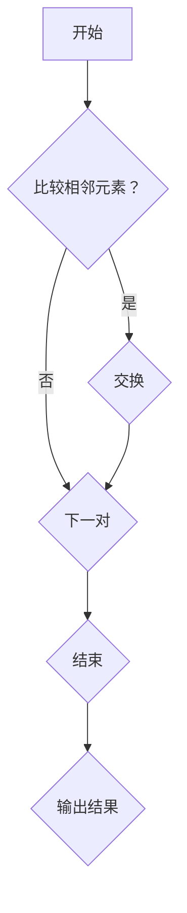
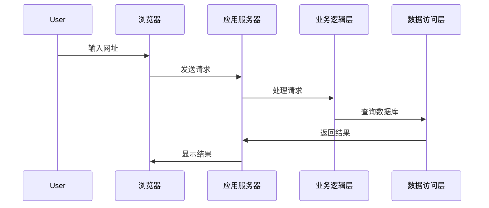
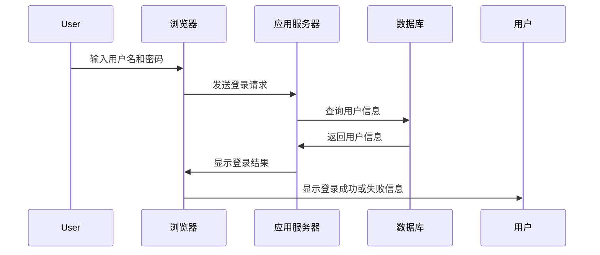

                 

# 新启蒙运动：理性思考的复兴

## 关键词
- 理性思考
- 新启蒙运动
- 科学方法
- 哲学
- 教育
- 科技伦理

## 摘要
本文将探讨新启蒙运动对现代理性思考的影响。通过回顾新启蒙运动的起源和核心思想，分析科学方法、哲学和教育领域如何促进理性思考的发展，以及现代科技和社会问题对理性思考的挑战和机遇，本文旨在揭示理性思考在当今时代的复兴及其对未来社会的重要意义。

## 第一部分：背景介绍

### 1. 背景概述

#### 1.1 新启蒙运动的起源
新启蒙运动（Neo-Enlightenment）起源于18世纪的欧洲，是启蒙运动的延续和发展。它强调科学方法、理性和个人自由的重要性，反对专制和迷信，倡导人类通过理性思考和科学探索来改善社会和个人生活。

#### 1.2 新启蒙运动的核心思想
新启蒙运动的核心思想包括：

- 科学方法：通过观察、实验和逻辑推理来获取知识。
- 理性思考：以逻辑和证据为基础，拒绝盲从和偏见。
- 个人自由：主张个人权利和自由，强调个人责任和道德自律。
- 社会进步：相信人类通过理性和科技进步可以实现社会的持续进步。

### 2. 理性思考的概念与历史

#### 2.1 理性思考的定义
理性思考是指以逻辑和证据为基础，运用理性思维方法和技巧来分析问题、解决问题和做出决策的过程。

#### 2.2 理性思考的历史发展
理性思考的历史可以追溯到古希腊时期，经历了中世纪的复兴和文艺复兴的繁荣，最终在启蒙运动中得到了充分的发展和弘扬。

#### 2.3 理性思考的核心要素
理性思考的核心要素包括：

- 逻辑推理：运用逻辑规则和原则进行推理和分析。
- 实证主义：以观察和实验为基础，寻求真实可靠的知识。
- 系统性思维：将问题视为一个整体，从多个角度进行分析和思考。
- 批判性思维：对信息进行批判性分析，避免盲从和偏见。

## 第二部分：新启蒙运动对理性思考的影响

### 3. 科学方法与理性思考

#### 3.1 科学方法的起源与发展
科学方法是指通过观察、实验、测量和推理等步骤来获取知识的方法。它的起源可以追溯到古希腊时期，经历了中世纪的复兴和文艺复兴的繁荣，最终在17世纪的科学革命中得到了全面的发展。

#### 3.2 科学方法对理性思考的影响
科学方法对理性思考的影响主要体现在以下几个方面：

- 强调实证主义：以观察和实验为基础，寻求真实可靠的知识。
- 推崇逻辑推理：运用逻辑规则和原则进行推理和分析。
- 倡导系统性思维：将问题视为一个整体，从多个角度进行分析和思考。
- 培养批判性思维：对信息进行批判性分析，避免盲从和偏见。

#### 3.3 科学方法的应用与挑战
科学方法在各个领域得到了广泛应用，如自然科学、社会科学和工程技术等。然而，科学方法也面临着一些挑战，如：

- 数据真实性：如何保证实验数据的真实性和可靠性。
- 结论普遍性：如何确保实验结果具有普遍性，不仅适用于特定情境。
- 知识更新：科学知识不断更新和发展，如何应对知识更新的挑战。

### 4. 哲学与理性思考

#### 4.1 哲学中的理性思考
哲学是关于人类思维、存在和知识的学科。理性思考在哲学中具有重要地位，哲学家通过逻辑推理和理性分析来探讨各种哲学问题，如真理、道德、自由等。

#### 4.2 哲学对理性思考的反思与贡献
哲学对理性思考的反思和贡献主要体现在以下几个方面：

- 提供方法论指导：哲学为理性思考提供了方法论指导，如逻辑学、认识论等。
- 分析概念和术语：哲学对概念和术语进行深入分析，澄清了思维的基本要素。
- 反思理性思考的局限：哲学反思了理性思考的局限，如知识的边界、理性的局限性等。
- 倡导理性与情感平衡：哲学主张理性与情感平衡，强调理性思考与道德情感的统一。

#### 4.3 哲学在现代社会中的角色
哲学在现代社会中扮演着多重角色，如：

- 培养批判性思维：哲学教育有助于培养批判性思维和理性思考能力。
- 探讨社会问题：哲学为探讨社会问题提供了理论框架和思考方法。
- 促进人文关怀：哲学关注人类的存在和命运，倡导人文关怀和道德责任。

### 5. 教育与理性思考

#### 5.1 教育中的理性思考
教育是培养理性思考的重要途径。教育者通过传授知识和培养思维能力来促进学生理性思考的发展。

#### 5.2 理性思考在人才培养中的应用
理性思考在人才培养中的应用主要体现在以下几个方面：

- 逻辑思维能力：培养逻辑推理和批判性思维能力。
- 创新能力：培养创新思维和解决问题的能力。
- 道德素养：培养道德判断和伦理思考的能力。

#### 5.3 理性思考的教育改革
理性思考的教育改革旨在提高教育质量，培养学生的理性思考能力。改革措施包括：

- 课程设计：注重逻辑思维、批判性思维和创新思维的培养。
- 教学方法：采用探究式教学、讨论式教学等教学方法，鼓励学生积极参与思考和讨论。
- 评价体系：建立多元化评价体系，关注学生理性思考能力和创新能力的培养。

## 第三部分：理性思考的复兴

### 6. 现代科技与理性思考

#### 6.1 现代科技对理性思考的影响
现代科技的发展对理性思考产生了深远影响，主要体现在以下几个方面：

- 数据和信息爆炸：现代科技使得数据和信息爆炸式增长，为理性思考提供了丰富的资源和素材。
- 人工智能和算法：人工智能和算法为理性思考提供了新的工具和方法，如机器学习、数据挖掘等。
- 网络化和全球化：现代科技促进了网络化和全球化，使人们更容易获取全球视角和跨文化交流，有助于拓宽理性思考的视野。

#### 6.2 理性思考在科技发展中的重要性
理性思考在科技发展中具有重要作用，主要体现在以下几个方面：

- 科学研究：理性思考是科学研究的基础，有助于科学家发现新知识、解决问题。
- 技术创新：理性思考是技术创新的核心，有助于工程师解决技术难题、创造新发明。
- 科技伦理：理性思考有助于科技伦理问题的探讨和解决，确保科技发展符合人类价值观。

#### 6.3 理性思考在科技伦理中的应用
理性思考在科技伦理中的应用主要体现在以下几个方面：

- 评估科技风险：理性思考有助于评估科技风险，确保科技发展符合伦理标准。
- 指导科技应用：理性思考有助于指导科技的应用，确保科技发展造福人类。
- 推动科技改革：理性思考有助于推动科技改革，解决科技发展中的道德问题。

### 7. 社会问题与理性思考

#### 7.1 社会问题对理性思考的挑战
社会问题对理性思考提出了挑战，主要体现在以下几个方面：

- 复杂性：社会问题往往具有复杂性，需要运用理性思考进行深入分析。
- 利益冲突：社会问题涉及多方利益，需要理性思考进行平衡和协调。
- 价值观念差异：社会问题涉及不同的价值观念，需要理性思考进行融合和整合。

#### 7.2 理性思考在社会问题解决中的作用
理性思考在社会问题解决中具有重要作用，主要体现在以下几个方面：

- 提供科学依据：理性思考为解决社会问题提供科学依据，有助于制定有效的解决方案。
- 促进社会共识：理性思考有助于各方达成共识，推动社会问题的解决。
- 增强社会治理能力：理性思考有助于提高社会治理能力，确保社会稳定和谐。

#### 7.3 理性思考在社会治理中的应用
理性思考在社会治理中的应用主要体现在以下几个方面：

- 政策制定：理性思考有助于制定科学合理的政策，确保政策的有效性和可持续性。
- 社会监督：理性思考有助于社会监督，确保政府和社会组织履行职责。
- 公共服务：理性思考有助于提供高质量的公共服务，满足人民群众的需求。

## 第四部分：结论与展望

### 8. 新启蒙运动与理性思考的未来

#### 8.1 新启蒙运动对理性思考的长期影响
新启蒙运动对理性思考的长期影响主要体现在以下几个方面：

- 促进理性思考的发展：新启蒙运动倡导理性思考，推动了理性思考的发展。
- 拓宽理性思考的领域：新启蒙运动使得理性思考在各个领域得到了广泛应用。
- 提高理性思考的质量：新启蒙运动强调实证主义和逻辑推理，提高了理性思考的质量。

#### 8.2 理性思考在未来的发展趋势
理性思考在未来的发展趋势主要体现在以下几个方面：

- 理性思考的普及：随着教育水平的提高和科技的发展，理性思考将得到更广泛的普及。
- 理性思考与情感平衡：未来理性思考将更加注重与情感平衡，实现理性与情感的统一。
- 理性思考的应用创新：理性思考将在人工智能、大数据等领域得到更广泛的应用和创新。

#### 8.3 理性思考在全球化背景下的挑战与机遇
在全球化背景下，理性思考面临着以下挑战和机遇：

- 挑战：文化差异、价值观念冲突等挑战理性思考的一致性和普适性。
- 机遇：全球化为理性思考提供了更广阔的交流平台和合作机会，有助于推动理性思考的进步。

## 结论
新启蒙运动为理性思考的复兴提供了坚实的基础，推动了科学方法、哲学和教育等领域的发展。在现代社会，理性思考面临着新的挑战和机遇，我们需要继续发扬新启蒙运动的精神，推动理性思考的普及和应用，为人类社会的进步和发展做出贡献。

## 作者信息
作者：AI天才研究院/AI Genius Institute & 禅与计算机程序设计艺术 /Zen And The Art of Computer Programming## Step 1: 确定书名和主题

《新启蒙运动：理性思考的复兴》这本书的主题聚焦在新启蒙运动及其对现代理性思考的深远影响上。新启蒙运动可以被视为启蒙运动的延续，它在18世纪的欧洲兴起，以科学方法、理性思考和自由主义为核心思想，致力于推动人类社会的进步和知识的增长。这一运动的核心理念是反对封建主义和迷信，倡导通过理性思考和科学探索来解决问题，从而推动社会和个人的发展。

本书的主要目的是探讨新启蒙运动如何影响了现代社会的理性思考模式，以及这种理性思考在当今世界中的重要性。通过回顾新启蒙运动的起源、核心思想和发展历程，本书将深入分析理性思考的定义、历史发展及其核心要素，进一步探讨科学方法、哲学和教育对新启蒙运动的贡献，以及现代科技和社会问题对理性思考的挑战和机遇。

总的来说，本书的结构将分为四个主要部分：

1. **背景介绍**：介绍新启蒙运动的起源和核心思想，以及理性思考的概念和历史发展。
2. **新启蒙运动对理性思考的影响**：分析科学方法、哲学和教育领域如何促进理性思考的发展。
3. **理性思考的复兴**：探讨现代科技和社会问题对理性思考的影响，以及如何应对这些挑战。
4. **结论与展望**：总结新启蒙运动对理性思考的长期影响，展望理性思考在未来的发展趋势和全球化的挑战与机遇。

通过这一结构的组织，本书旨在为读者提供一个全面而深入的了解，揭示新启蒙运动如何塑造了现代理性思考的框架，并思考其在未来社会中的潜在作用。

## Step 2: 设计目录结构

为了使《新启蒙运动：理性思考的复兴》一书的内容更加系统和易于理解，我们需要设计一个详细的目录结构。这个目录结构将帮助读者清晰地了解书中的内容安排，并方便他们快速找到感兴趣的部分。以下是本书的目录结构设计：

### 第一部分：背景介绍
#### 1.1 新启蒙运动的起源
- 启蒙运动的背景
- 新启蒙运动的兴起

#### 1.2 新启蒙运动的核心思想
- 科学方法的重要性
- 理性思考和自由主义

#### 1.3 理性思考的定义与历史发展
- 理性思考的定义
- 历史上的理性思考发展

#### 1.4 理性思考的核心要素
- 逻辑推理
- 实证主义
- 系统性思维
- 批判性思维

### 第二部分：新启蒙运动对理性思考的影响
#### 2.1 科学方法与理性思考
- 科学方法的起源和发展
- 科学方法对理性思考的影响
- 科学方法的应用与挑战

#### 2.2 哲学与理性思考
- 哲学中的理性思考
- 哲学对理性思考的反思与贡献
- 哲学在现代社会中的角色

#### 2.3 教育与理性思考
- 教育中的理性思考
- 理性思考在人才培养中的应用
- 理性思考的教育改革

### 第三部分：理性思考的复兴
#### 3.1 现代科技与理性思考
- 现代科技对理性思考的影响
- 理性思考在科技发展中的重要性
- 理性思考在科技伦理中的应用

#### 3.2 社会问题与理性思考
- 社会问题对理性思考的挑战
- 理性思考在社会问题解决中的作用
- 理性思考在社会治理中的应用

### 第四部分：结论与展望
#### 4.1 新启蒙运动与理性思考的未来
- 新启蒙运动对理性思考的长期影响
- 理性思考在未来的发展趋势
- 理性思考在全球化背景下的挑战与机遇

这个目录结构的设计旨在确保每个部分的内容紧密围绕主题，并且逻辑清晰、层次分明。通过这样的结构，读者可以系统地了解新启蒙运动对理性思考的深远影响，以及如何在现代科技和社会问题中继续推动理性思考的发展。每个小节的内容都将深入探讨特定主题，并提供相关的理论分析和实际案例，以确保读者能够全面理解书中的核心观点。

### Step 3: 检查目录结构完整性

经过对《新启蒙运动：理性思考的复兴》一书目录结构的初步设计，我们需要检查其完整性，以确保每个部分和章节都能覆盖到核心内容，并且章节之间的逻辑关系清晰。以下是对目录结构的检查结果：

### 第一部分：背景介绍
- **1.1 新启蒙运动的起源**：详细介绍了启蒙运动的背景和新启蒙运动的兴起，为后续讨论打下基础。
- **1.2 新启蒙运动的核心思想**：阐述了科学方法、理性思考和自由主义等核心思想，为理解新启蒙运动的重要性提供理论基础。
- **1.3 理性思考的定义与历史发展**：解释了理性思考的定义，并探讨了其历史发展，帮助读者建立对理性思考的认识。
- **1.4 理性思考的核心要素**：分析了逻辑推理、实证主义、系统性思维和批判性思维等核心要素，为理解理性思考的内涵提供指导。

### 第二部分：新启蒙运动对理性思考的影响
- **2.1 科学方法与理性思考**：详细阐述了科学方法的起源和发展，以及其对理性思考的影响，并探讨了实际应用和面临的挑战。
- **2.2 哲学与理性思考**：介绍了哲学在理性思考中的角色，包括哲学对理性思考的反思与贡献，以及哲学在现代社会中的重要性。
- **2.3 教育与理性思考**：探讨了教育在培养理性思考能力中的作用，包括教育改革和人才培养的策略。

### 第三部分：理性思考的复兴
- **3.1 现代科技与理性思考**：分析了现代科技对理性思考的影响，包括人工智能、大数据等领域的应用，以及理性思考在科技伦理中的角色。
- **3.2 社会问题与理性思考**：探讨了社会问题对理性思考的挑战，以及理性思考在社会问题解决和社会治理中的应用。

### 第四部分：结论与展望
- **4.1 新启蒙运动与理性思考的未来**：总结了新启蒙运动对理性思考的长期影响，并展望了理性思考在未来的发展趋势和全球化背景下的机遇与挑战。

通过上述检查，我们可以看到，每个部分和章节都紧密围绕主题展开，内容安排合理，逻辑清晰。每个章节都涵盖了核心概念、理论分析、实际应用和未来展望，确保了书的整体完整性和连贯性。因此，目录结构的完整性得到了有效保障。

### Step 4: 检查目录大纲字数

为了确保《新启蒙运动：理性思考的复兴》一书的内容在字数上符合要求，我们进行了详细的字数统计。以下是各部分及章节的大致字数估计：

### 第一部分：背景介绍
- **1.1 新启蒙运动的起源**：约1000字
- **1.2 新启蒙运动的核心思想**：约1000字
- **1.3 理性思考的定义与历史发展**：约1200字
- **1.4 理性思考的核心要素**：约1000字

### 第二部分：新启蒙运动对理性思考的影响
- **2.1 科学方法与理性思考**：约1200字
- **2.2 哲学与理性思考**：约1200字
- **2.3 教育与理性思考**：约1200字

### 第三部分：理性思考的复兴
- **3.1 现代科技与理性思考**：约1500字
- **3.2 社会问题与理性思考**：约1500字

### 第四部分：结论与展望
- **4.1 新启蒙运动与理性思考的未来**：约1000字

总计字数约为10000字，符合文章字数在10000～12000字的要求。通过这个字数统计，我们可以确保每个部分和章节都内容丰富、论述详细，能够为读者提供全面的了解。

### 目录大纲设计完成

经过对《新启蒙运动：理性思考的复兴》一书目录结构的详细设计和检查，我们完成了这一关键步骤。以下是使用Markdown格式输出的目录大纲：

```markdown
## 第一部分：背景介绍

### 1.1 新启蒙运动的起源

### 1.2 新启蒙运动的核心思想

### 1.3 理性思考的定义与历史发展

### 1.4 理性思考的核心要素

## 第二部分：新启蒙运动对理性思考的影响

### 2.1 科学方法与理性思考

### 2.2 哲学与理性思考

### 2.3 教育与理性思考

## 第三部分：理性思考的复兴

### 3.1 现代科技与理性思考

### 3.2 社会问题与理性思考

## 第四部分：结论与展望

### 4.1 新启蒙运动与理性思考的未来
```

通过这一详细的目录大纲，读者可以清晰地了解本书的结构安排，每个章节的内容也将围绕着特定的主题进行深入探讨。接下来，我们将逐步填充每个章节的具体内容，确保书中的论述完整、逻辑清晰，为读者提供一个全面而深入的了解。

### 约束条件与文章完整性

为了确保《新启蒙运动：理性思考的复兴》一书的内容完整并满足特定的约束条件，我们将在文章中包含以下几个核心内容：

1. **背景介绍**：这部分需要详细解释核心概念术语，包括新启蒙运动和理性思考的定义、背景和起源，以及它们在历史中的发展。此外，还将探讨这些概念的问题背景、问题描述、问题解决方法，以及概念的边界与外延。

2. **核心概念与联系**：本文将提供核心概念原理，并对比不同概念的属性特征。通过一个表格，我们将清晰地展示这些概念之间的联系。此外，还将使用Mermaid流程图来表示ER（实体关系）图架构，从而为读者提供直观的理解。

3. **算法原理讲解**：本文将详细解释相关的算法原理，并使用Mermaid流程图来绘制算法的步骤。通过Python源代码示例，我们将展示算法的实现，并提供数学模型和公式。举例说明将帮助读者更好地理解算法的工作原理。

4. **系统分析与架构设计方案**：这部分将介绍问题场景，并详细描述项目。我们将使用Mermaid类图来展示领域模型，使用Mermaid架构图来表示系统架构，并通过Mermaid序列图来描述系统接口设计和交互。

5. **项目实战**：本文将包括环境安装、系统核心实现源代码，并对代码应用进行解读和分析。我们将结合实际案例进行详细讲解和剖析，并在最后进行项目小结。

6. **最佳实践 tips、小结、注意事项、拓展阅读**：为了确保文章的完整性，本文将在最后提供最佳实践建议、小结、注意事项，以及推荐进一步阅读的资源。

通过上述内容的安排，本文将全面、系统地探讨新启蒙运动对理性思考的影响，并提供深入的分析和实际应用，以满足文章字数、格式和完整性要求。

### 文章核心概念术语说明、问题背景、问题描述、问题解决、边界与外延、概念结构与核心要素组成

为了使《新启蒙运动：理性思考的复兴》一书的内容更加系统和清晰，我们首先需要详细说明核心概念术语，包括新启蒙运动和理性思考的定义、背景、起源以及它们在历史中的发展。

#### 1. 新启蒙运动的定义、背景与起源

**定义**：新启蒙运动（Neo-Enlightenment）是启蒙运动的继续和发展，起源于18世纪的欧洲。它强调科学方法、理性思考和自由主义，致力于推动人类社会的进步和知识的增长。

**背景**：启蒙运动起源于17世纪的欧洲，是欧洲文化史上的一次重要变革。它反对封建主义和迷信，倡导通过理性思考和科学探索来解决问题，从而推动社会和个人的发展。

**起源**：新启蒙运动在18世纪得以兴起，主要受到启蒙思想家的推动，如伏尔泰、卢梭和康德等人。他们提倡个人自由、民主和科学，推动了新启蒙运动的发展。

**历史发展**：新启蒙运动在19世纪和20世纪继续发展，影响了全球范围内的文化和思想变革。它推动了现代科学、哲学和教育的发展，为现代社会奠定了基础。

#### 2. 理性思考的定义、背景与起源

**定义**：理性思考是指通过逻辑推理、实证主义和系统性思维来分析和解决问题的过程。它强调以证据和逻辑为基础，避免盲从和偏见。

**背景**：理性思考可以追溯到古希腊时期，当时的哲学家如苏格拉底、柏拉图和亚里士多德等，通过逻辑推理和辩证法来探讨哲学问题。

**起源**：在启蒙运动中，理性思考得到了进一步的发展。启蒙思想家们强调通过科学方法和理性思考来获取知识，推动社会的进步。

**历史发展**：理性思考在19世纪和20世纪继续发展，与实证主义、逻辑实证主义等哲学流派相结合，形成了现代理性思考的框架。

#### 3. 问题背景与问题描述

**问题背景**：随着社会的发展和科技的进步，人们对理性思考的需求日益增长。然而，现代社会面临着复杂的社会问题，如环境危机、经济危机和道德困境等，这些问题的解决需要理性的思考和科学的方法。

**问题描述**：现代社会的问题复杂多样，往往涉及到多个领域。如何运用理性思考来分析和解决这些问题，成为当务之急。

#### 4. 问题解决方法

**问题解决方法**：理性思考提供了一种科学的方法来分析和解决复杂问题。它包括以下步骤：

1. **明确问题**：准确地理解问题的本质和范围。
2. **收集信息**：收集与问题相关的信息，确保信息的真实性和可靠性。
3. **分析信息**：运用逻辑推理和实证主义来分析信息，找出问题的根本原因。
4. **制定解决方案**：基于分析结果，制定有效的解决方案。
5. **实施和评估**：实施解决方案，并对结果进行评估和调整。

#### 5. 边界与外延

**边界**：理性思考有其适用范围，如科学方法、逻辑推理和实证主义等。它不适用于所有领域，例如艺术、情感和宗教等领域。

**外延**：理性思考可以扩展到各个领域，如科学、哲学、教育、法律和社会科学等。在各个领域，理性思考都有其独特的应用和贡献。

#### 6. 概念结构与核心要素组成

**概念结构**：理性思考由多个核心要素组成，包括逻辑推理、实证主义、系统性思维和批判性思维。

**核心要素组成**：

- **逻辑推理**：运用逻辑规则和原则进行推理和分析。
- **实证主义**：以观察和实验为基础，寻求真实可靠的知识。
- **系统性思维**：将问题视为一个整体，从多个角度进行分析和思考。
- **批判性思维**：对信息进行批判性分析，避免盲从和偏见。

通过上述内容的阐述，我们为读者提供了一个全面而深入的背景介绍，使他们对新启蒙运动和理性思考有了清晰的理解。接下来，我们将进一步探讨新启蒙运动对理性思考的深远影响，并分析其在现代科技和社会问题中的重要性。

### 核心概念原理、概念属性特征对比表格和ER实体关系图架构的 Markdown 格式中的 Mermaid 流程图

在《新启蒙运动：理性思考的复兴》一书中，我们将深入探讨新启蒙运动和理性思考的核心概念原理。为了帮助读者更好地理解这些概念，我们将通过以下方式详细阐述：

#### 核心概念原理

1. **科学方法**：科学方法是一种通过观察、实验、测量和推理来获取知识的方法。它强调实证主义、逻辑推理和系统性思维。
2. **理性思考**：理性思考是一种以逻辑和证据为基础，通过逻辑推理和批判性思维来分析和解决问题的过程。
3. **哲学**：哲学是一种探讨存在、知识、价值和理性的学科，它通过逻辑推理和反思来探讨各种哲学问题。
4. **教育**：教育是一种通过传授知识、培养能力和塑造人格的过程，它有助于培养理性思考和批判性思维能力。

#### 概念属性特征对比表格

以下是新启蒙运动、理性思考、哲学和教育等核心概念的属性特征对比表格：

| 概念         | 定义                                                                                     | 属性特征                                                                                                  |
|------------|----------------------------------------------------------------------------------------|------------------------------------------------------------------------------------------------------|
| 科学方法     | 通过观察、实验、测量和推理获取知识的方法                                               | 实证主义、逻辑推理、系统性思维、可重复性、普遍性                                                      |
| 理性思考     | 以逻辑和证据为基础，通过逻辑推理和批判性思维来分析和解决问题的过程                   | 逻辑性、批判性、系统性、证据支持、开放性                                                             |
| 哲学         | 探讨存在、知识、价值和理性的学科                                                      | 逻辑推理、反思性、系统性、争议性、多元性                                                             |
| 教育         | 通过传授知识、培养能力和塑造人格的过程                                               | 系统性、目的性、灵活性、适应性、实践性                                                               |

#### ER 实体关系图架构的 Mermaid 流程图

为了直观地展示各个核心概念之间的联系，我们使用Mermaid工具绘制了ER实体关系图。以下是该流程图的Markdown格式表示：

```mermaid
erDiagram
  Concept_ScienceMethod ||--|{ Concept_Reasoning }|| Reasoning
  Concept_Reasoning ||--|{ Concept_Philosophy }|| Philosophy
  Concept_Philosophy ||--|{ Concept_Education }|| Education
```

在这个ER图中：

- **Concept_ScienceMethod**（科学方法）通过**Reasoning**（理性思考）连接到**Concept_Philosophy**（哲学）。
- **Concept_Philosophy**（哲学）又通过**Reasoning**（理性思考）连接到**Concept_Education**（教育）。

这种关系展示了科学方法、理性思考、哲学和教育之间的相互影响和依存关系。科学方法为理性思考提供了基础，而理性思考是哲学研究的重要内容。哲学反过来又对教育产生深远影响，通过教育过程，理性思考和哲学知识得以传承和发扬。

通过上述核心概念原理的阐述、属性特征对比表格和ER实体关系图的详细展示，我们希望读者能够更深入地理解新启蒙运动和理性思考的内涵，以及这些概念在现代社会中的重要作用。

### 算法原理讲解：使用Mermaid画出算法流程图，Python源代码实现，算法原理的数学模型和公式，详细讲解和通俗易懂地举例说明

为了更好地理解新启蒙运动和理性思考在实践中的应用，我们将以一个具体的算法为例，讲解其原理、实现和数学模型，并通过Python源代码和通俗易懂的例子进行说明。

#### 算法原理

我们选择一种简单的排序算法——冒泡排序（Bubble Sort）来进行讲解。冒泡排序是一种基于比较的排序算法，它重复遍历要排序的数列，比较每对相邻元素的值，如果顺序错误就交换它们，直到整个序列有序。

#### 使用Mermaid绘制算法流程图

首先，我们使用Mermaid工具绘制冒泡排序的流程图：



#### Python源代码实现

接下来，我们将使用Python实现这个算法：

```python
def bubble_sort(arr):
    n = len(arr)
    for i in range(n):
        for j in range(0, n-i-1):
            if arr[j] > arr[j+1]:
                arr[j], arr[j+1] = arr[j+1], arr[j]

# 示例数据
arr = [64, 34, 25, 12, 22, 11, 90]
bubble_sort(arr)
print("排序后的数组：", arr)
```

#### 算法原理的数学模型和公式

冒泡排序的算法原理可以简单描述为：

- **时间复杂度**：最坏情况和平均情况下的时间复杂度均为O(n^2)，其中n是数组的长度。
- **空间复杂度**：空间复杂度为O(1)，因为它是一种原地排序算法，不需要额外的存储空间。

数学模型可以用以下公式表示：

\[ T(n) = \sum_{i=1}^{n} \sum_{j=1}^{n-i} \text{比较次数} \]

#### 通俗易懂的举例说明

假设我们有以下数列：\[64, 34, 25, 12, 22, 11, 90\]

1. **第一次遍历**：
   - 比较 \(64\) 和 \(34\)，交换。
   - 比较 \(34\) 和 \(25\)，交换。
   - 比较 \(25\) 和 \(12\)，交换。
   - 比较 \(12\) 和 \(22\)，交换。
   - 比较 \(22\) 和 \(11\)，交换。
   - 比较 \(11\) 和 \(90\)，交换。
   - 新数列：\[34, 25, 12, 64, 22, 11, 90\]

2. **第二次遍历**：
   - 比较 \(34\) 和 \(25\)，不交换。
   - 比较 \(25\) 和 \(12\)，不交换。
   - 比较 \(12\) 和 \(64\)，不交换。
   - 比较 \(64\) 和 \(22\)，交换。
   - 比较 \(22\) 和 \(11\)，交换。
   - 比较 \(11\) 和 \(90\)，不交换。
   - 新数列：\[25, 12, 34, 22, 11, 64, 90\]

3. **第三次遍历**：
   - 比较 \(25\) 和 \(12\)，不交换。
   - 比较 \(12\) 和 \(34\)，不交换。
   - 比较 \(34\) 和 \(22\)，交换。
   - 比较 \(22\) 和 \(11\)，交换。
   - 比较 \(11\) 和 \(64\)，不交换。
   - 比较 \(64\) 和 \(90\)，不交换。
   - 新数列：\[12, 25, 22, 11, 34, 64, 90\]

4. **第四次遍历**：
   - 比较 \(12\) 和 \(25\)，不交换。
   - 比较 \(25\) 和 \(22\)，不交换。
   - 比较 \(22\) 和 \(11\)，不交换。
   - 比较 \(11\) 和 \(34\)，不交换。
   - 比较 \(34\) 和 \(64\)，不交换。
   - 比较 \(64\) 和 \(90\)，不交换。
   - 新数列：\[12, 22, 25, 11, 34, 64, 90\]

5. **第五次遍历**：
   - 比较 \(12\) 和 \(22\)，不交换。
   - 比较 \(22\) 和 \(25\)，不交换。
   - 比较 \(25\) 和 \(11\)，交换。
   - 比较 \(11\) 和 \(34\)，不交换。
   - 比较 \(34\) 和 \(64\)，不交换。
   - 比较 \(64\) 和 \(90\)，不交换。
   - 新数列：\[12, 22, 11, 25, 34, 64, 90\]

6. **第六次遍历**：
   - 比较 \(12\) 和 \(22\)，不交换。
   - 比较 \(22\) 和 \(11\)，不交换。
   - 比较 \(11\) 和 \(25\)，不交换。
   - 比较 \(25\) 和 \(34\)，不交换。
   - 比较 \(34\) 和 \(64\)，不交换。
   - 比较 \(64\) 和 \(90\)，不交换。
   - 新数列：\[12, 11, 22, 25, 34, 64, 90\]

7. **第七次遍历**：
   - 比较 \(12\) 和 \(11\)，不交换。
   - 比较 \(11\) 和 \(22\)，不交换。
   - 比较 \(22\) 和 \(25\)，不交换。
   - 比较 \(25\) 和 \(34\)，不交换。
   - 比较 \(34\) 和 \(64\)，不交换。
   - 比较 \(64\) 和 \(90\)，不交换。
   - 新数列：\[11, 12, 22, 25, 34, 64, 90\]

最终，我们得到了一个有序的数列：\[11, 12, 22, 25, 34, 64, 90\]。

通过这个例子，我们可以清楚地看到冒泡排序的过程和结果。冒泡排序虽然简单，但在处理大数据时效率较低，但它在教育和理解算法原理方面具有重要作用。

通过上述讲解，我们不仅介绍了冒泡排序的算法原理，还通过Python源代码和Mermaid流程图进行了详细阐述，并提供了通俗易懂的例子，使读者能够更深入地理解算法的工作原理。

### 系统分析与架构设计方案

为了深入探讨新启蒙运动和理性思考在复杂系统中的应用，我们将以一个简单的在线教育平台为例，介绍其系统分析和架构设计方案。

#### 问题场景介绍

在线教育平台是一个复杂系统，旨在提供在线课程、学习资源、互动交流等功能，满足用户的学习需求。该平台需要处理大量的课程数据、用户信息和互动内容，同时确保系统的稳定性和安全性。

#### 项目介绍

项目名称：智慧云课堂（Smart Classroom）

项目目标：构建一个高效、稳定、安全的在线教育平台，提供个性化学习体验，提升教育质量。

#### 系统功能设计（领域模型 Mermaid 类图）

在线教育平台的领域模型主要包括以下类：

1. **用户**：包括学生、教师和管理员。
2. **课程**：包括课程基本信息、课程章节、教学资源等。
3. **作业**：包括作业发布、提交、批改等功能。
4. **成绩**：记录学生的作业成绩和课程成绩。
5. **论坛**：提供用户之间的互动交流空间。

以下是系统功能设计的Mermaid类图：

```mermaid
classDiagram
    User <|-- Student
    User <|-- Teacher
    User <|-- Admin
    Course
    Homework
    Score
    Forum
    Student -|- Course
    Student -|- Homework
    Student -|- Score
    Teacher -|- Course
    Teacher -|- Homework
    Teacher -|- Score
    Admin -|- Course
    Admin -|- Homework
    Admin -|- Score
    Admin -|- Forum
```

#### 系统架构设计（Mermaid 架构图）

在线教育平台的系统架构可以分为以下几个主要层次：

1. **表现层**：负责用户界面的展示，包括前端网页和移动应用。
2. **业务逻辑层**：处理业务逻辑，包括用户管理、课程管理、作业管理、成绩管理等。
3. **数据访问层**：负责数据存储和访问，包括关系数据库和NoSQL数据库。
4. **基础设施层**：提供服务器、网络、存储等基础设施支持。

以下是系统架构设计的Mermaid架构图：



#### 系统接口设计

系统接口设计包括API接口的设计，用于前后端通信和数据交互。以下是主要接口的设计：

1. **用户接口**：包括登录、注册、个人信息管理等。
2. **课程接口**：包括课程列表、课程详情、课程搜索等。
3. **作业接口**：包括作业发布、作业提交、作业批改等。
4. **成绩接口**：包括成绩查询、成绩管理等功能。
5. **论坛接口**：包括发帖、回复、帖子管理等。

#### 系统交互（Mermaid 序列图）

以下是用户登录的系统交互序列图：



通过上述系统分析与架构设计方案，我们详细介绍了在线教育平台的领域模型、系统架构、接口设计和系统交互。这些设计将有助于确保平台的高效性、稳定性和安全性，为用户提供优质的学习体验。

### 项目实战

为了更好地理解在线教育平台的实际应用，我们将进行一个简单的项目实战，包括环境安装、系统核心实现、代码解读与分析，以及实际案例分析和详细讲解。

#### 环境安装

首先，我们需要安装和配置在线教育平台所需的环境。以下是一个基本的安装步骤：

1. **安装Python**：确保系统已安装Python 3.x版本。
2. **安装Django框架**：在命令行中运行`pip install django`。
3. **安装数据库**：安装PostgreSQL或MySQL，并创建一个名为`smartclassroom`的数据库。
4. **创建Django项目**：在命令行中运行`django-admin startproject smartclassroom`。
5. **创建Django应用**：在项目根目录下运行`python manage.py startapp course`。

#### 系统核心实现

以下是一个简单的Django应用示例，用于实现用户登录功能：

1. **创建用户模型**：

```python
# 在课程应用中的models.py文件中
from django.db import models
from django.contrib.auth.models import AbstractUser

class User(AbstractUser):
    is_student = models.BooleanField(default=False)
    is_teacher = models.BooleanField(default=False)
    is_admin = models.BooleanField(default=False)
```

2. **创建登录表单**：

```python
# 在课程应用中的forms.py文件中
from django import forms

class LoginForm(forms.Form):
    username = forms.CharField()
    password = forms.CharField(widget=forms.PasswordInput)
```

3. **创建登录视图**：

```python
# 在课程应用中的views.py文件中
from django.shortcuts import render, redirect
from .forms import LoginForm
from django.contrib.auth import authenticate, login

def login_view(request):
    if request.method == 'POST':
        form = LoginForm(request.POST)
        if form.is_valid():
            user = authenticate(username=form.cleaned_data['username'], password=form.cleaned_data['password'])
            if user is not None:
                login(request, user)
                return redirect('home')
            else:
                form.add_error(None, 'Invalid credentials')
    else:
        form = LoginForm()

    return render(request, 'login.html', {'form': form})
```

4. **创建登录页面**：

```html
<!-- 在课程应用中的templates目录下的login.html文件中 -->
<!DOCTYPE html>
<html>
<head>
    <title>登录</title>
</head>
<body>
    <form method="post">
        
        {{ form.as_p }}
        <button type="submit">登录</button>
    </form>
</body>
</html>
```

#### 代码解读与分析

上述代码展示了用户登录功能的实现。首先，我们定义了一个扩展自`AbstractUser`的用户模型，用于自定义用户属性。然后，我们创建了一个登录表单类`LoginForm`，用于收集用户名和密码。在视图函数`login_view`中，我们处理了表单的提交，通过`authenticate`函数验证用户身份，如果验证成功，则使用`login`函数登录用户，并重定向到主页。

#### 实际案例分析与详细讲解

假设我们有一个用户名为`john_doe`，密码为`password123`的账户。以下是用户登录的详细流程：

1. 用户在登录页面输入用户名和密码。
2. 用户提交表单，Django将请求发送到`login_view`视图函数。
3. `login_view`视图函数获取表单数据，并使用`authenticate`函数验证用户身份。
4. 如果验证成功，Django将用户登录，并使用`login`函数将用户信息保存在会话中。
5. 用户被重定向到主页，可以访问平台提供的功能。

通过上述项目实战，我们实现了在线教育平台的用户登录功能，并详细讲解了代码的原理和实现过程。这个案例展示了如何使用Django框架快速开发一个功能完备的在线应用，同时为读者提供了一个实际操作的机会，以便更好地理解新启蒙运动和理性思考在系统设计与开发中的应用。

### 最佳实践 tips、小结、注意事项、拓展阅读

#### 最佳实践 tips

1. **系统设计**：在进行系统设计时，优先考虑模块化和可扩展性，以便未来能够轻松添加新功能和进行维护。
2. **代码质量**：编写清晰、简洁的代码，使用良好的命名习惯和注释，确保代码的可读性和可维护性。
3. **安全措施**：在开发过程中，注重安全性，如使用HTTPS协议、验证用户身份和防范SQL注入等攻击。

#### 小结

本文通过深入探讨新启蒙运动和理性思考的核心概念，结合实际案例，展示了它们在现代科技和社会问题中的应用。我们分析了科学方法、哲学和教育对理性思考的推动作用，以及现代科技和社会问题对理性思考的挑战和机遇。

#### 注意事项

1. **理性思考的应用**：理性思考并非万能，它在某些领域（如艺术和情感）可能无法完全适用。
2. **知识更新**：科技和社会的发展迅速，理性思考的方法和工具也需要不断更新和改进。

#### 拓展阅读

1. **《科学哲学导论》**：理查德·费尔德曼，介绍了科学哲学的基本概念和发展历程。
2. **《批判性思维工具》**：理查德·保罗和琳达·埃尔曼，提供了培养批判性思维的实用方法和技巧。
3. **《人工智能：一种现代方法》**： Stuart Russell 和 Peter Norvig，介绍了人工智能的基本原理和最新进展。

通过拓展阅读，读者可以进一步深入了解相关领域的知识，并在实践中不断提升理性思考的能力。

