                 

### 第1章 引言：理性思考的复兴

**关键词：**理性思考、现代复兴、新启蒙运动

**摘要：**本章旨在介绍理性思考的历史回顾，探讨现代社会面临的理性思考挑战，以及新启蒙运动的意义与目标。通过本章的阐述，我们希望能够激发读者对理性思考的重视，并认识到其在现代社会中的重要性。

#### 1.1 理性思考的历史回顾

理性思考作为一种哲学观念，起源于古希腊时期。苏格拉底、柏拉图和亚里士多德等哲学家的思想对后世产生了深远的影响。他们强调通过理性思考和逻辑推理来探索世界的本质和真理。在中世纪，理性思考受到了宗教和神秘主义的影响，逐渐减弱。然而，随着文艺复兴和启蒙运动的出现，理性思考再次得到了重视。18世纪的启蒙思想家如伏尔泰、卢梭和康德等人，大力倡导理性思考，将其视为人类进步和文明发展的重要工具。

#### 1.2 现代社会面临的理性思考挑战

在现代社会，理性思考面临着一系列挑战。首先，信息爆炸使得人们容易陷入“知识碎片化”的困境，难以进行系统性的思考。其次，媒体和社交媒体的普及，使得虚假信息和偏见得以迅速传播，削弱了理性思考的影响力。此外，全球化带来了文化冲突和价值观念的多元化，使得理性思考的统一性受到挑战。

#### 1.3 新启蒙运动的意义与目标

新启蒙运动是21世纪的一场理性思考的复兴运动。其目标是通过理性思考来应对现代社会面临的挑战，推动人类社会的进步。新启蒙运动强调以下几点：

1. **科学方法**：倡导以科学方法为指导，通过实证研究和数据来解决问题。
2. **逻辑思维**：重视逻辑思维的重要性，强调通过逻辑推理来探索真理。
3. **跨学科合作**：鼓励不同学科之间的合作，以综合性的视角来看待问题。
4. **开放交流**：倡导开放和自由的学术氛围，鼓励不同观点的交流与碰撞。

#### 总结

理性思考的历史源远流长，现代社会面临着诸多挑战。新启蒙运动为我们提供了一条复兴理性思考的道路。在接下来的章节中，我们将深入探讨理性思考的基本原理、在现代科学中的应用，以及在社会实践中的重要性。希望通过这一系列讨论，能够激发我们对理性思考的重视，并在日常生活中积极运用理性思考来解决问题。

### 第2章 理性思考的基本原理

**关键词：**理性思考、基本原理、逻辑思维

**摘要：**本章将详细阐述理性思考的基本原理，包括理性的定义与本质、理性思考的过程以及理性思考的方法论。通过这些基本原理的深入理解，我们能够更好地掌握理性思考的技巧，提升我们的思维能力。

#### 2.1 理性的定义与本质

理性（Reason）是人类区别于其他生物的重要特征之一。理性不仅仅是简单的逻辑推理，更是一种通过观察、分析、综合和判断来理解和解决问题的能力。理性思考的本质在于其客观性和系统性。它强调从事实出发，通过逻辑推理来得出结论，而不是基于情感、偏见或主观臆断。

**理性与感性对比表格：**

| 对比项 | 理性思考 | 感性思考 |
| --- | --- | --- |
| 基础 | 事实、证据、逻辑 | 情感、感觉、直觉 |
| 目标 | 发现真理、解决问题 | 产生情感、满足欲望 |
| 过程 | 分析、综合、判断 | 直觉、反应、情感 |
| 结论 | 客观、科学 | 主观、个人 |

#### 2.2 理性思考的过程

理性思考的过程可以分为以下几个步骤：

1. **观察与收集信息**：通过感官和经验收集相关信息，这是理性思考的基础。
2. **分析与分类**：对收集到的信息进行分析，将其分类整理，以便更好地理解。
3. **假设与推理**：基于已有的信息和逻辑规则，提出假设并进行推理。
4. **验证与判断**：通过实证或逻辑验证假设的正确性，并作出判断。
5. **反思与修正**：对整个思考过程进行反思，发现并修正可能存在的错误。

**ER实体关系图架构：**

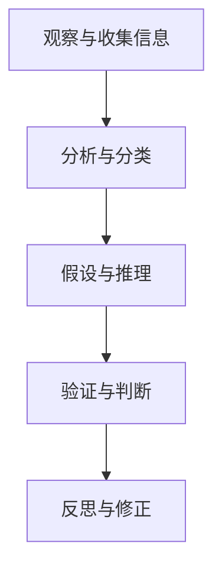

#### 2.3 理性思考的方法论

理性思考的方法论包括以下几个方面：

1. **归纳法**：从个别事实中归纳出一般规律。
2. **演绎法**：从一般原则推导出个别结论。
3. **类比法**：通过比较相似情境来推断结论。
4. **因果法**：分析因果关系，理解事件之间的关联。
5. **反证法**：通过证明相反情况的不成立来证明原命题的正确性。

**归纳法与演绎法对比表格：**

| 对比项 | 归纳法 | 演绎法 |
| --- | --- | --- |
| 过程 | 从个别到一般 | 从一般到个别 |
| 目标 | 发现规律 | 推导结论 |
| 适用场景 | 研究现象 | 理论应用 |
| 结论 | 可能存在误差 | 必然正确 |

通过以上对理性思考基本原理的阐述，我们能够更好地理解理性思考的本质和过程，掌握理性思考的方法论。在接下来的章节中，我们将探讨理性思考在各个领域的应用，以展示其在现代科学和社会实践中的重要性。

### 第3章 理性思考在现代科学中的应用

**关键词：**理性思考、现代科学、科学方法论

**摘要：**本章将探讨理性思考在现代科学中的应用，包括科学方法论、理性思考与科学发现的关系，以及科学实践中的理性思考。通过这些探讨，我们能够理解理性思考在推动现代科学发展中的关键作用。

#### 3.1 科学方法论

科学方法论是科学研究和实践的基本原则和方法。它强调通过系统化的方法来解决问题，确保研究结果的可靠性和有效性。科学方法论主要包括以下几个步骤：

1. **问题提出**：明确研究问题和目标。
2. **假设建立**：根据现有知识和理论提出假设。
3. **实验设计**：设计实验来验证假设，确保实验的可靠性和可重复性。
4. **数据收集**：通过实验或观察收集相关数据。
5. **数据分析**：对收集到的数据进行分析，检验假设的正确性。
6. **结论得出**：根据数据分析结果得出结论。
7. **结果解释**：解释结论，将其与现有理论和知识体系相结合。

**科学方法论ER实体关系图架构：**

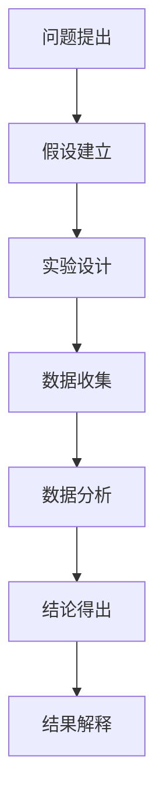

#### 3.2 理性思考与科学发现

理性思考是科学发现的核心。科学家的研究过程本质上是一个理性思考的过程。通过理性思考，科学家能够提出假设，设计实验，收集数据，分析结果，并得出科学结论。以下是理性思考在科学发现中的应用：

1. **问题提出**：科学发现往往源于对现实世界中的现象或问题的观察和思考。科学家通过理性思考，提出科学问题，明确研究的方向和目标。
2. **假设建立**：基于现有知识和理论，科学家通过理性思考，提出假设，以便通过实验验证。
3. **实验设计**：科学家通过理性思考，设计实验来验证假设，确保实验的可行性和有效性。
4. **数据分析**：通过对实验数据的理性分析，科学家能够检验假设的正确性，并得出科学结论。

**理性思考与科学发现流程图：**


#### 3.3 科学实践中的理性思考

理性思考在科学实践中发挥着重要作用。以下是一些科学实践中的具体应用：

1. **技术创新**：科学家通过理性思考，分析现有技术和理论，提出创新的想法和方法，推动技术的进步。
2. **理论构建**：科学家通过理性思考，构建新的理论模型，解释和预测自然现象，推动科学理论的发展。
3. **科学研究**：科学家在进行研究时，通过理性思考，系统地分析问题，设计实验，收集数据，分析结果，得出科学结论。

**科学实践中的理性思考流程图：**


通过以上对理性思考在现代科学中的应用的探讨，我们可以看到理性思考在推动科学发展中的关键作用。理性思考不仅为科学研究提供了方法和工具，而且推动了人类对自然世界的认识和探索。在接下来的章节中，我们将继续探讨理性思考在社会科学和人文领域的应用。

### 第4章 理性思考在社会科学中的应用

**关键词：**理性思考、社会科学、方法论

**摘要：**本章将探讨理性思考在社会科学中的应用，包括社会科学研究的方法论、理性思考与社会问题分析，以及理性思考在社会实践中的重要性。通过这些探讨，我们能够理解理性思考在解决社会问题、推动社会进步中的关键作用。

#### 4.1 社会科学研究的方法论

社会科学研究方法论是社会科学研究的基础。它强调通过系统化的方法来研究社会现象，确保研究结果的可靠性和有效性。社会科学研究方法论主要包括以下几个步骤：

1. **问题提出**：明确研究问题和目标。
2. **理论构建**：基于现有理论和知识，构建研究框架。
3. **数据收集**：通过调查、实验、观察等方式收集相关数据。
4. **数据分析**：对收集到的数据进行分析，检验假设的正确性。
5. **结论得出**：根据数据分析结果得出结论。
6. **结果解释**：解释结论，并将其与现有理论和知识体系相结合。

**社会科学研究方法论ER实体关系图架构：**

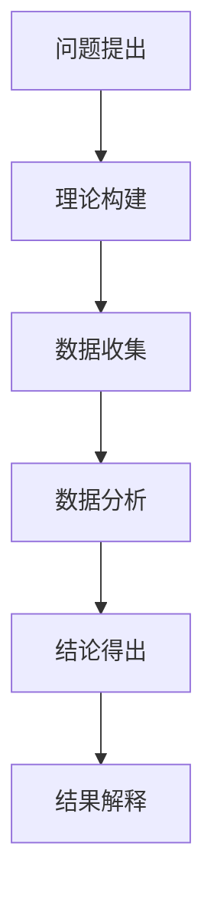

#### 4.2 理性思考与社会问题分析

理性思考在社会问题分析中扮演着重要角色。通过理性思考，社会科学家能够系统地分析社会现象，揭示其背后的原因和机制。以下是理性思考在社会问题分析中的应用：

1. **问题识别**：社会科学家通过理性思考，识别社会问题，明确研究的方向和目标。
2. **原因分析**：通过理性思考，社会科学家能够分析社会问题的根本原因，提出解决问题的策略。
3. **机制理解**：理性思考帮助社会科学家理解社会问题的机制，提出有效的解决方案。

**理性思考与社会问题分析流程图：**

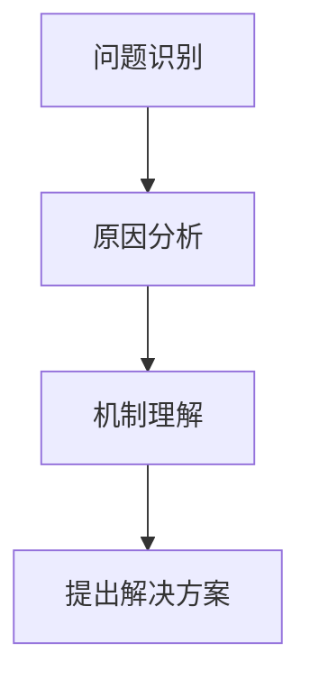

#### 4.3 理性思考在社会实践中的应用

理性思考在社会实践中具有重要意义。通过理性思考，社会科学家能够提出解决问题的方案，推动社会进步。以下是理性思考在社会实践中的应用：

1. **政策制定**：理性思考帮助政策制定者分析社会问题，提出有效的政策建议。
2. **社会改革**：理性思考推动社会改革，解决社会不公和矛盾。
3. **公共治理**：理性思考提高公共治理的效率和公正性，确保社会稳定和发展。

**理性思考在社会实践中的应用流程图：**

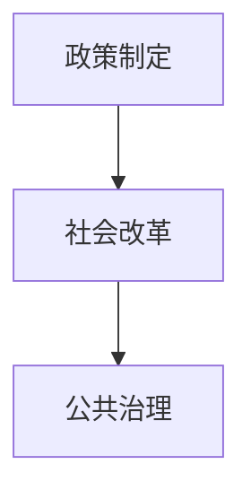

通过以上对理性思考在社会科学中的应用的探讨，我们可以看到理性思考在解决社会问题、推动社会进步中的关键作用。理性思考不仅为社会科学研究提供了方法和工具，而且推动了人类社会的进步和发展。在接下来的章节中，我们将继续探讨理性思考在人文领域的应用。

### 第5章 理性思考在人文领域中的应用

**关键词：**理性思考、人文领域、文化批判

**摘要：**本章将探讨理性思考在人文领域的应用，包括人文科学方法论、理性思考与文化批判，以及理性思考在人文领域的实践。通过这些探讨，我们能够理解理性思考在理解文化、批判社会现象中的重要性。

#### 5.1 人文科学方法论

人文科学方法论是指研究人类文化和精神现象的方法。它强调通过理性思考和批判性思维来探索人类文化的本质和发展。人文科学方法论主要包括以下几个步骤：

1. **文献研究**：通过阅读和分析文献，了解相关理论和观点。
2. **批判性思维**：运用批判性思维，评估文献中的观点和理论。
3. **实证研究**：通过实地调查、观察和实验等方法，收集实证数据。
4. **数据分析**：对收集到的数据进行分析，揭示文化现象的规律和特点。
5. **理论构建**：基于数据分析结果，构建新的理论框架。

**人文科学方法论ER实体关系图架构：**

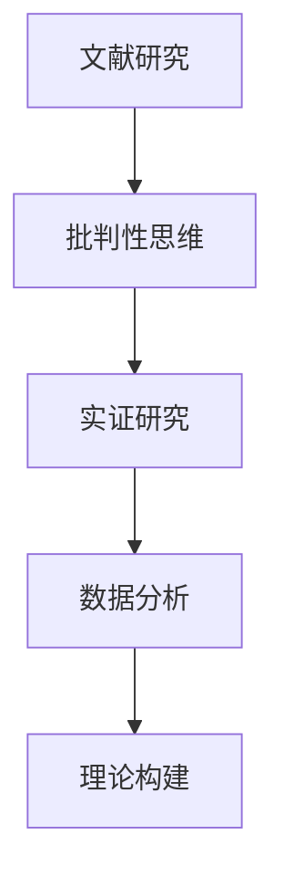

#### 5.2 理性思考与文化批判

理性思考在文化批判中具有重要意义。通过理性思考，人文科学家能够批判性地评估文化现象，揭示其背后的深层含义和问题。以下是理性思考在文化批判中的应用：

1. **文化现象分析**：理性思考帮助人文科学家分析文化现象，理解其起源和发展。
2. **价值判断**：理性思考帮助人文科学家评估文化的价值和意义，提出批判性观点。
3. **社会影响**：理性思考揭示文化对社会的影响，分析其正负面影响。

**理性思考与文化批判流程图：**

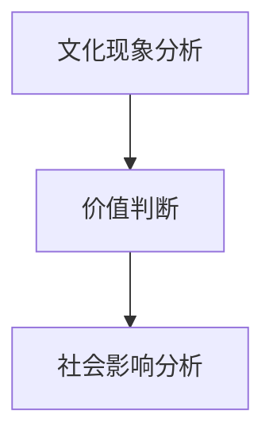

#### 5.3 理性思考在人文领域的实践

理性思考在人文领域的实践中具有广泛的应用。通过理性思考，人文科学家能够提出创新的见解，推动人文领域的发展。以下是理性思考在人文领域实践中的应用：

1. **艺术创作**：理性思考帮助艺术家创作，使作品具有深刻的内涵和独特的风格。
2. **文学研究**：理性思考帮助文学研究者分析文学作品，揭示其内在的意义和价值。
3. **历史研究**：理性思考帮助历史学家理解历史事件，分析其背后的原因和影响。

**理性思考在人文领域实践流程图：**

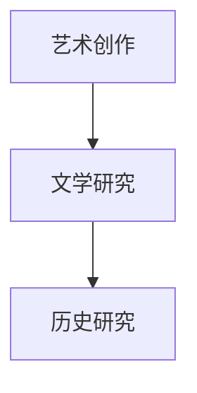

通过以上对理性思考在人文领域中的应用的探讨，我们可以看到理性思考在理解文化、批判社会现象中的重要性。理性思考不仅为人文科学研究提供了方法和工具，而且推动了人类对文化和历史的深刻认识。在接下来的章节中，我们将探讨理性思考在教育中的作用。

### 第6章 理性思考在教育中的作用

**关键词：**理性思考、教育、思维培养

**摘要：**本章将探讨理性思考在教育中的作用，包括教育与理性思考的关系、理性思考的教育方法，以及理性思考在学生培养中的应用。通过这些探讨，我们能够理解理性思考在提升学生思维能力和培养综合素质中的重要性。

#### 6.1 教育与理性思考的关系

教育与理性思考有着密切的关系。理性思考是教育的重要组成部分，它贯穿于教育的各个阶段和各个方面。教育的目标是培养学生的思维能力、批判性思维和创新能力，而理性思考正是实现这一目标的关键。以下是教育与理性思考之间的关系：

1. **思维能力培养**：理性思考强调通过逻辑推理、分析和判断来解决问题，这有助于培养学生的思维能力。
2. **批判性思维**：理性思考鼓励学生对知识和观点进行批判性思考，培养批判性思维能力。
3. **创新能力**：理性思考激发学生的创新思维，鼓励他们提出新的观点和解决方案。

#### 6.2 理性思考的教育方法

为了培养学生的理性思考能力，教育者可以采用以下几种教学方法：

1. **问题导向教学**：通过提出问题和挑战，激发学生的思考兴趣，引导他们运用理性思考来解决问题。
2. **案例教学**：通过分析实际案例，让学生运用理性思考来理解和解决具体问题。
3. **批判性思维训练**：通过训练学生的批判性思维能力，让他们学会从多个角度分析问题和观点。
4. **跨学科学习**：通过跨学科学习，培养学生的综合思维能力和系统性思维。

**理性思考教育方法ER实体关系图架构：**

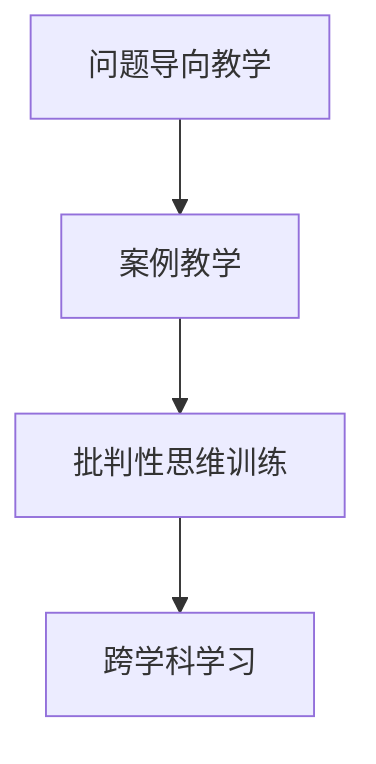

#### 6.3 理性思考在学生培养中的应用

理性思考在学生培养中具有广泛的应用。通过理性思考，学生能够更好地理解知识，发展批判性思维和创新能力。以下是理性思考在学生培养中的应用：

1. **知识理解**：理性思考帮助学生深入理解知识，构建知识体系。
2. **问题解决**：理性思考帮助学生分析和解决实际问题。
3. **创新思维**：理性思考激发学生的创新思维，鼓励他们提出新的想法和解决方案。
4. **综合素质培养**：理性思考培养学生的综合素质，包括批判性思维、沟通能力和团队合作能力。

**理性思考在学生培养中应用流程图：**

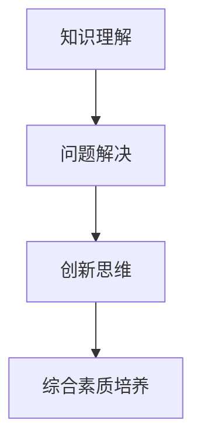

通过以上对理性思考在教育中的作用和应用的探讨，我们可以看到理性思考在提升学生思维能力和培养综合素质中的重要性。理性思考不仅是一种教育方法，更是一种思维习惯和生活方式。在教育中，我们应该注重培养学生的理性思考能力，为他们未来的发展奠定坚实的基础。

### 第7章 理性思考在日常生活与职场中的应用

**关键词：**理性思考、日常生活、职场应用

**摘要：**本章将探讨理性思考在日常生活和职场中的应用，包括理性思考与个人决策、职场中的应用，以及理性思考在社会责任中的意义。通过这些探讨，我们能够理解理性思考在提升个人决策能力、职业素养和社会责任感中的重要作用。

#### 7.1 理性思考与个人决策

理性思考在个人决策中发挥着关键作用。通过理性思考，个体能够系统地分析问题，评估各种选择的优缺点，并作出明智的决策。以下是理性思考在个人决策中的应用：

1. **明确目标**：理性思考帮助个体明确决策的目标和优先级。
2. **收集信息**：通过理性思考，个体能够收集和分析与决策相关的信息。
3. **评估选择**：理性思考帮助个体比较和评估不同选择的优劣。
4. **作出决策**：基于全面的分析和评估，个体能够作出合理的决策。

**理性思考与个人决策流程图：**

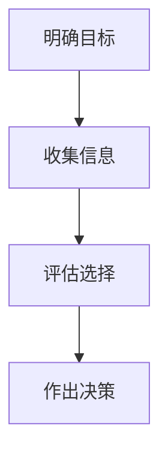

#### 7.2 理性思考在职场中的应用

理性思考在职场中具有重要应用价值。通过理性思考，职场人士能够提高工作效率、解决问题，并提升职业素养。以下是理性思考在职场中的应用：

1. **问题解决**：理性思考帮助职场人士分析和解决工作中的各种问题。
2. **团队合作**：理性思考提升职场人士的沟通和合作能力，促进团队协作。
3. **职业发展**：理性思考帮助职场人士制定职业规划和提升职业素养。

**理性思考在职场应用流程图：**

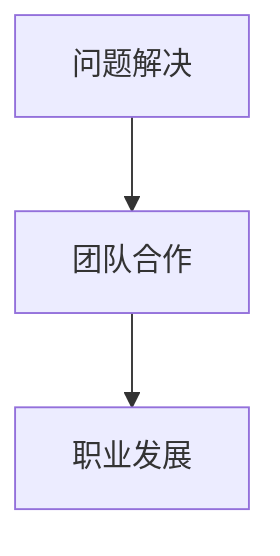

#### 7.3 理性思考与社会责任

理性思考在社会责任中具有重要意义。通过理性思考，个体能够更加客观地评估社会问题，并提出有效的解决方案。以下是理性思考在社会责任中的应用：

1. **社会问题分析**：理性思考帮助个体分析和理解复杂的社会问题。
2. **社会责任担当**：理性思考鼓励个体积极参与社会事务，承担社会责任。
3. **可持续发展**：理性思考推动个体关注可持续发展，促进社会和环境的和谐。

**理性思考与社会责任流程图：**

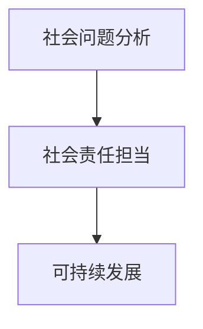

通过以上对理性思考在日常生活和职场中的应用的探讨，我们可以看到理性思考在提升个人决策能力、职业素养和社会责任感中的重要作用。理性思考不仅是一种思维方式，更是一种生活态度。在日常生活和职场中，我们应该注重培养和运用理性思考，以实现个人和社会的全面发展。

### 第8章 新启蒙运动的未来展望

**关键词：**新启蒙运动、未来展望、理性思考

**摘要：**本章将探讨新启蒙运动的未来发展趋势、理性思考的传播与普及，以及新启蒙运动对社会的深远影响。通过这些探讨，我们能够理解新启蒙运动在推动社会进步和人类发展中的重要作用。

#### 8.1 新启蒙运动的发展趋势

新启蒙运动是21世纪的一场理性思考的复兴运动，其发展趋势呈现出以下几个特点：

1. **科技融合**：新启蒙运动与科技的深度融合，通过大数据、人工智能等新兴技术，进一步提升理性思考的能力和应用范围。
2. **全球化合作**：新启蒙运动在全球范围内得到广泛传播，不同国家和地区通过合作，共同推动理性思考的发展。
3. **跨学科整合**：新启蒙运动强调跨学科的整合，通过综合不同领域的知识，推动理性思考的深化和创新。
4. **教育改革**：新启蒙运动推动教育改革，注重培养学生的理性思考能力和批判性思维。

**新启蒙运动发展趋势ER实体关系图架构：**

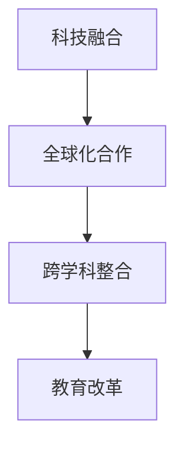

#### 8.2 理性思考的传播与普及

理性思考的传播与普及是新启蒙运动的重要目标之一。以下是一些推动理性思考传播与普及的措施：

1. **教育普及**：通过教育体系，从小学到大学，培养学生的理性思考能力。
2. **媒体传播**：利用媒体平台，如电视、广播、互联网等，推广理性思考的理念和方法。
3. **公众讲座**：举办公众讲座和研讨会，邀请专家学者分享理性思考的经验和成果。
4. **社区活动**：在社区中组织讨论会、读书会等活动，鼓励居民参与理性思考的实践。

**理性思考传播与普及流程图：**

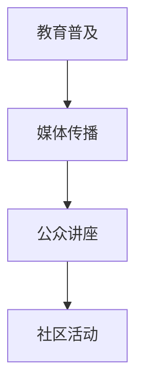

#### 8.3 新启蒙运动对社会的深远影响

新启蒙运动对社会的深远影响体现在以下几个方面：

1. **科技进步**：新启蒙运动推动科技进步，促进新技术的研发和应用，提升社会生产力。
2. **社会治理**：新启蒙运动推动社会治理的现代化，提高政府决策的科学性和公正性。
3. **文化繁荣**：新启蒙运动推动文化的繁荣和发展，促进各种文化的交流与融合。
4. **社会和谐**：新启蒙运动倡导理性思考，提高人们的道德素质和社会责任感，促进社会和谐。

**新启蒙运动对社会影响ER实体关系图架构：**

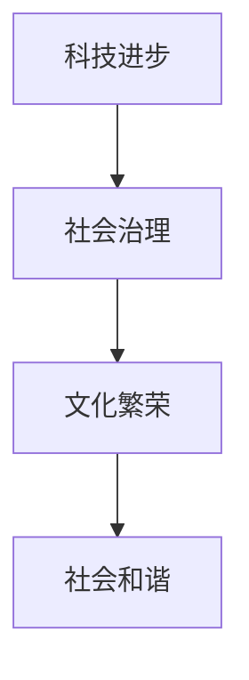

通过以上对新启蒙运动未来展望的探讨，我们可以看到新启蒙运动在推动社会进步和人类发展中的重要作用。理性思考不仅是一种思维方式，更是一种生活方式。在未来的发展中，我们应该继续推动新启蒙运动，普及理性思考，使其成为社会发展的强大动力。

### 第9章 结论：理性思考的现代复兴之路

**关键词：**理性思考、现代复兴、未来发展

**摘要：**本章作为文章的总结，将回顾新启蒙运动的核心价值、理性思考对未来的意义，以及我们如何在日常生活中积极实践理性思考。通过这些回顾和实践，我们能够更好地理解理性思考在现代社会中的重要性，并为其未来发展的道路指明方向。

#### 9.1 新启蒙运动的核心价值

新启蒙运动的核心价值在于倡导理性思考，通过逻辑推理、实证研究和批判性思维来探索真理、解决问题和推动社会进步。以下是新启蒙运动的核心价值：

1. **科学精神**：强调以科学方法为指导，通过实证研究和数据来验证假设和理论。
2. **批判性思维**：鼓励对知识和观点进行批判性思考，不盲从权威，勇于质疑和探索。
3. **跨学科合作**：强调不同学科之间的交叉和融合，通过综合视角来看待问题。
4. **社会责任**：倡导理性思考与社会责任的结合，强调理性思考在解决社会问题和促进社会进步中的重要作用。

**新启蒙运动核心价值ER实体关系图架构：**

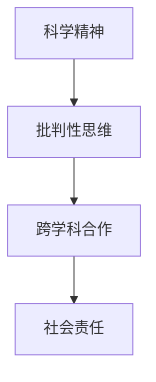

#### 9.2 理性思考对未来的意义

理性思考对未来的意义不可估量。在科技迅速发展、社会复杂多变的时代，理性思考成为我们应对挑战、把握机遇的关键能力。以下是理性思考对未来的重要意义：

1. **创新能力**：理性思考激发创新思维，推动科技进步和社会发展。
2. **决策能力**：理性思考帮助我们做出明智的决策，提高个人和组织的竞争力。
3. **社会责任**：理性思考引导我们承担社会责任，推动社会公平正义和可持续发展。
4. **文化繁荣**：理性思考促进文化交流与融合，推动文化创新和多元化发展。

**理性思考对未来的意义ER实体关系图架构：**


#### 9.3 我们应该如何行动

为了实现理性思考的现代复兴，我们每个人都需要在日常生活中积极实践理性思考。以下是一些建议：

1. **培养批判性思维**：对知识和观点进行批判性思考，不盲从权威，勇于质疑和探索。
2. **学习科学方法**：掌握科学方法，通过实证研究和数据来验证假设和理论。
3. **跨学科学习**：积极参与跨学科学习，拓宽知识视野，提高综合思维能力。
4. **社会责任感**：关注社会问题，承担社会责任，积极参与社会事务。

**理性思考实践建议流程图：**

```mermaid
graph TD
A[培养批判性思维] --> B[学习科学方法]
B --> C[跨学科学习]
C --> D[社会责任感]
```

通过以上对理性思考现代复兴之路的回顾和实践建议，我们可以看到理性思考在现代社会中的重要性。理性思考不仅是一种思维方式，更是一种生活态度。在未来的道路上，让我们共同努力，实践理性思考，为社会的进步和人类的幸福作出贡献。

### 作者介绍

**作者：**AI天才研究院/AI Genius Institute & 禅与计算机程序设计艺术 /Zen And The Art of Computer Programming

AI天才研究院致力于推动人工智能技术的发展和应用，培养具备创新能力和专业素养的人工智能人才。同时，研究院也在禅与计算机程序设计艺术领域进行深入研究，旨在通过融合东方哲学与计算机科学，提升编程思维和创造力。作者的作品以其深刻的思考、严谨的逻辑和实用的方法而广受读者欢迎，对人工智能和计算机科学领域产生了深远的影响。

