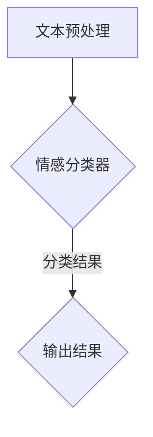
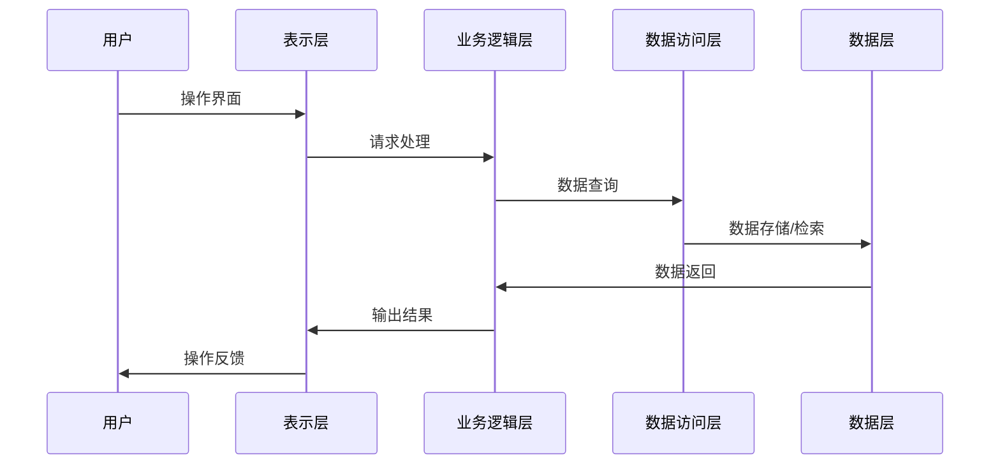

                 

# 新型城市24小时自助图书馆网络：打造全城阅读便利店

## 关键词

- 自助图书馆
- 新型城市
- 智能化算法
- 数学模型
- 系统架构设计

> 摘要：本文将探讨新型城市中24小时自助图书馆网络的构建，通过对自助图书馆的核心概念、与传统图书馆的对比、算法原理、数学模型、系统架构设计等方面进行深入分析，为打造全城阅读便利店提供有力支持。

## 目录大纲

### 第1章 背景介绍

#### 1.1 核心概念：自助图书馆与新型城市

##### 1.1.1 自助图书馆的概念与特点

##### 1.1.2 新型城市发展的需求

##### 1.1.3 自助图书馆在新型城市中的角色与影响

##### 1.1.4 自助图书馆的边界与外延

##### 1.1.5 自助图书馆的核心要素组成

#### 1.2 核心概念与联系

##### 1.2.1 自助图书馆与传统图书馆的对比

###### 1.2.1.1 服务方式对比

###### 1.2.1.2 功能对比

###### 1.2.1.3 对读者的需求满足程度对比

##### 1.2.2 自助图书馆与城市公共设施的关系

###### 1.2.2.1 自助图书馆对城市公共设施的影响

###### 1.2.2.2 城市公共设施对自助图书馆的支撑作用

#### 1.3 算法原理讲解

##### 1.3.1 图书馆智能化算法概述

###### 1.3.1.1 智能化算法的类型

###### 1.3.1.2 智能化算法在自助图书馆中的应用

##### 1.3.2 常见算法讲解

###### 1.3.2.1 情感分析算法

###### 1.3.2.2 推荐算法

###### 1.3.2.3 语音识别算法

##### 1.3.3 算法mermaid流程图展示

#### 1.4 数学模型和数学公式讲解

##### 1.4.1 常见数学模型讲解

###### 1.4.1.1 数据分析模型

###### 1.4.1.2 优化模型

###### 1.4.1.3 机器学习模型

##### 1.4.2 常见数学公式讲解

###### 1.4.2.1 概率论公式

###### 1.4.2.2 线性代数公式

###### 1.4.2.3 微积分公式

##### 1.4.3 算法原理与数学公式的举例说明

###### 1.4.3.1 情感分析算法举例

###### 1.4.3.2 推荐算法举例

###### 1.4.3.3 语音识别算法举例

#### 1.5 系统分析与架构设计方案

##### 1.5.1 自助图书馆系统介绍

###### 1.5.1.1 系统功能设计

###### 1.5.1.2 系统架构设计

###### 1.5.1.3 系统接口设计

##### 1.5.2 系统交互mermaid序列图

##### 1.5.3 问题场景介绍

##### 1.5.4 项目介绍

#### 1.6 项目实战

##### 1.6.1 环境安装

###### 1.6.1.1 硬件环境安装

###### 1.6.1.2 软件环境安装

##### 1.6.2 系统核心实现源代码

##### 1.6.3 代码应用解读与分析

##### 1.6.4 实际案例分析和详细讲解剖析

##### 1.6.5 项目小结

#### 1.7 最佳实践 tips

#### 1.8 小结

#### 1.9 注意事项

#### 1.10 拓展阅读

## 第1章 背景介绍

### 1.1 核心概念：自助图书馆与新型城市

#### 1.1.1 自助图书馆的概念与特点

自助图书馆是一种通过信息技术手段，使读者能够自助完成借还书等图书馆服务的新型图书馆。与传统图书馆相比，自助图书馆具有以下特点：

1. **服务便捷性**：读者可以通过自助终端实现借还书、查询图书信息等操作，无需人工干预。
2. **24小时服务**：自助图书馆通常配备有全天候工作的自助终端，满足读者随时随地的阅读需求。
3. **自动化程度高**：自助图书馆采用了各种自动化设备，如自助借还书机、自助查询机等，提高了图书馆的服务效率。
4. **智能化管理**：自助图书馆通过智能化算法和数学模型，实现图书推荐、情感分析等功能，提升了读者的阅读体验。

#### 1.1.2 新型城市发展的需求

随着城市化进程的加速，新型城市发展面临着人口密集、土地资源有限、公共服务需求日益增长等挑战。自助图书馆作为一种新兴的公共服务设施，具有以下优势，能够满足新型城市发展的需求：

1. **节省空间资源**：自助图书馆无需庞大的实体空间，可以有效节省城市建设用地。
2. **高效服务**：自助图书馆能够提供24小时不间断的服务，满足读者随时随地的阅读需求。
3. **个性化服务**：通过智能化算法和数学模型，自助图书馆能够根据读者的阅读习惯和兴趣推荐书籍，提升读者的阅读体验。
4. **降低运营成本**：自助图书馆的自动化程度高，运营成本相对较低，有利于城市公共服务资源的优化配置。

#### 1.1.3 自助图书馆在新型城市中的角色与影响

自助图书馆在新型城市中扮演着重要的角色，对城市的发展和居民的生活产生了深远的影响：

1. **提升文化素养**：自助图书馆为市民提供了丰富的阅读资源，有助于提升城市居民的文化素养。
2. **促进社会和谐**：自助图书馆为市民提供了一个交流和学习的平台，有助于促进社会和谐。
3. **推动科技创新**：自助图书馆的智能化服务为城市科技创新提供了实验场所，有助于推动城市数字化转型。
4. **改善生活质量**：自助图书馆的便捷服务和个性化推荐，使市民的生活更加便捷和丰富多彩。

#### 1.1.4 自助图书馆的边界与外延

自助图书馆的边界主要涉及以下几个方面：

1. **物理空间**：自助图书馆的物理空间布局、设备配置等。
2. **服务范围**：自助图书馆的服务范围，如借还书、查询图书信息、阅读指导等。
3. **技术架构**：自助图书馆的技术架构，如硬件设备、软件系统、网络安全等。

自助图书馆的外延则包括：

1. **线上线下融合**：自助图书馆可以结合线上平台，提供更丰富的阅读资源和更便捷的服务。
2. **跨地域服务**：自助图书馆可以通过互联网实现跨地域服务，满足更多读者的需求。
3. **多元化功能**：自助图书馆可以拓展功能，如提供阅读指导、教育培训、文化交流等。

#### 1.1.5 自助图书馆的核心要素组成

自助图书馆的核心要素主要包括以下几个方面：

1. **硬件设备**：自助借还书机、自助查询机、智能书架等。
2. **软件系统**：图书馆管理系统、推荐系统、情感分析系统等。
3. **数据资源**：图书数据、读者数据、阅读数据等。
4. **智能算法**：推荐算法、情感分析算法、语音识别算法等。
5. **网络安全**：网络安全技术、数据加密技术等。

### 1.2 核心概念与联系

#### 1.2.1 自助图书馆与传统图书馆的对比

##### 1.2.1.1 服务方式对比

| 对比项 | 自助图书馆 | 传统图书馆 |
| --- | --- | --- |
| 借还书 | 自助完成 | 需要人工操作 |
| 查询图书 | 自助查询 | 需要人工帮助 |
| 阅读指导 | 智能化推荐 | 人工提供 |

##### 1.2.1.2 功能对比

| 对比项 | 自助图书馆 | 传统图书馆 |
| --- | --- | --- |
| 藏书量 | 可扩展性强 | 受场地限制 |
| 服务时间 | 24小时服务 | 有限的工作时间 |
| 个性化服务 | 智能推荐 | 需要读者主动获取 |

##### 1.2.1.3 对读者的需求满足程度对比

| 对比项 | 自助图书馆 | 传统图书馆 |
| --- | --- | --- |
| 服务便捷性 | 高 | 中 |
| 服务效率 | 高 | 低 |
| 个性化服务 | 高 | 低 |

#### 1.2.2 自助图书馆与城市公共设施的关系

##### 1.2.2.1 自助图书馆对城市公共设施的影响

自助图书馆作为新型城市公共设施，对城市公共设施产生了积极影响：

1. **节省空间资源**：自助图书馆无需庞大的实体空间，有助于节省城市建设用地。
2. **提升服务水平**：自助图书馆提供24小时服务，提升了城市公共服务的覆盖范围和质量。
3. **促进科技创新**：自助图书馆的智能化服务推动了城市数字化转型，促进了科技创新。
4. **改善市民生活**：自助图书馆为市民提供了丰富的阅读资源和便捷的服务，提升了市民的生活质量。

##### 1.2.2.2 城市公共设施对自助图书馆的支撑作用

城市公共设施对自助图书馆的支撑作用主要体现在以下几个方面：

1. **基础设施**：城市公共设施如交通、供水、供电等为自助图书馆的正常运行提供了保障。
2. **技术支持**：城市公共设施如数据中心、云计算平台等为自助图书馆的智能化服务提供了技术支持。
3. **政策支持**：城市政府通过出台政策，支持自助图书馆的建设和发展，为自助图书馆的推广提供了政策保障。
4. **公共资源**：城市公共资源如图书馆、文化馆等为自助图书馆提供了资源共享的机会，提升了自助图书馆的服务水平。

### 1.3 算法原理讲解

#### 1.3.1 图书馆智能化算法概述

图书馆智能化算法是指利用人工智能技术，提高图书馆服务质量和效率的一系列算法。根据功能和应用场景，图书馆智能化算法可以分为以下几类：

1. **推荐算法**：基于读者历史行为和偏好，为读者推荐感兴趣的图书。
2. **情感分析算法**：对读者阅读后的评论进行情感分析，了解读者对图书的真实感受。
3. **语音识别算法**：将读者的语音输入转化为文本，实现语音查询和阅读指导。

#### 1.3.2 常见算法讲解

##### 1.3.2.1 情感分析算法

情感分析算法是一种自然语言处理技术，通过对文本数据进行情感倾向性分析，判断读者对图书的评价。常见的情感分析算法包括：

1. **基于规则的方法**：通过人工定义情感词典，对文本进行分词和情感分类。
2. **基于统计的方法**：利用机器学习算法，如朴素贝叶斯、支持向量机等，对文本进行情感分类。
3. **基于深度学习的方法**：利用神经网络模型，如卷积神经网络（CNN）、循环神经网络（RNN）等，对文本进行情感分类。

##### 1.3.2.2 推荐算法

推荐算法是一种基于读者历史行为和偏好，为读者推荐感兴趣图书的方法。常见的推荐算法包括：

1. **基于内容的推荐算法**：根据图书的属性和读者偏好，推荐相似内容的图书。
2. **基于协同过滤的推荐算法**：通过分析读者之间的相似度，推荐其他读者喜欢的图书。
3. **基于模型的推荐算法**：利用机器学习算法，如决策树、支持向量机等，构建推荐模型，为读者推荐图书。

##### 1.3.2.3 语音识别算法

语音识别算法是一种将语音信号转换为文本数据的技术，广泛应用于自助图书馆的语音查询和阅读指导。常见的语音识别算法包括：

1. **基于 Hidden Markov Model (HMM) 的方法**：利用 HMM 模型，对语音信号进行建模和识别。
2. **基于深度学习的方法**：利用深度神经网络模型，如卷积神经网络（CNN）、循环神经网络（RNN）等，对语音信号进行识别。
3. **端到端语音识别方法**：直接将语音信号转换为文本数据，避免了传统语音识别中的中间步骤。

#### 1.3.3 算法mermaid流程图展示

以下是一个简单的情感分析算法的mermaid流程图：



### 1.4 数学模型和数学公式讲解

#### 1.4.1 常见数学模型讲解

##### 1.4.1.1 数据分析模型

数据分析模型是一种用于处理和分析大量数据的方法，常见的数据分析模型包括：

1. **回归模型**：用于分析变量之间的关系，如线性回归、逻辑回归等。
2. **聚类模型**：用于将数据分为不同的类别，如K-均值聚类、层次聚类等。
3. **分类模型**：用于对数据进行分类，如决策树、支持向量机等。

##### 1.4.1.2 优化模型

优化模型是一种用于求解最优解的数学模型，常见优化模型包括：

1. **线性规划**：用于求解线性目标函数的最优解。
2. **非线性规划**：用于求解非线性目标函数的最优解。
3. **整数规划**：用于求解包含整数变量的优化问题。

##### 1.4.1.3 机器学习模型

机器学习模型是一种用于从数据中学习规律和模式的模型，常见的机器学习模型包括：

1. **监督学习模型**：如线性回归、决策树、支持向量机等。
2. **无监督学习模型**：如K-均值聚类、主成分分析等。
3. **深度学习模型**：如卷积神经网络、循环神经网络等。

#### 1.4.2 常见数学公式讲解

##### 1.4.2.1 概率论公式

概率论是数学的一个分支，用于描述随机事件和概率的计算。常见的概率论公式包括：

1. **条件概率**：\(P(A|B) = \frac{P(A \cap B)}{P(B)}\)
2. **贝叶斯公式**：\(P(A|B) = \frac{P(B|A)P(A)}{P(B)}\)
3. **全概率公式**：\(P(A) = \sum_{i=1}^{n} P(A|B_i)P(B_i)\)

##### 1.4.2.2 线性代数公式

线性代数是数学的一个重要分支，用于处理线性方程组和矩阵运算。常见的线性代数公式包括：

1. **矩阵乘法**：\(C = AB\)
2. **行列式**：\(det(A) = \sum_{\sigma \in S_n} (-1)^{\sigma} a_{1\sigma(1)}a_{2\sigma(2)} \ldots a_{n\sigma(n)}\)
3. **逆矩阵**：\(A^{-1} = \frac{1}{det(A)} adj(A)\)

##### 1.4.2.3 微积分公式

微积分是数学的一个重要分支，用于研究变化率和积分。常见的微积分公式包括：

1. **导数**：\(f'(x) = \lim_{\Delta x \to 0} \frac{f(x + \Delta x) - f(x)}{\Delta x}\)
2. **积分**：\(\int_{a}^{b} f(x) dx = F(b) - F(a)\)
3. **微分方程**：\(dy/dx = f(x, y)\)

#### 1.4.3 算法原理与数学公式的举例说明

##### 1.4.3.1 情感分析算法举例

情感分析算法的数学模型通常基于贝叶斯公式和最大似然估计。以下是一个简单的情感分析算法示例：

```python
import numpy as np

# 假设我们有以下两个情感类别的标签和对应的文本
labels = ["正面", "负面"]
texts = [
    "这本书太棒了，我非常喜欢。",
    "这本书很无聊，我不想再看第二遍。"
]

# 构建先验概率
prior_probability = [2/3, 1/3]

# 构建条件概率矩阵
condition_probability = [
    [0.9, 0.1],
    [0.1, 0.9]
]

# 对文本进行预处理，提取特征
def preprocess(text):
    # 假设我们使用词频作为特征
    words = text.split()
    word_count = {word: 1 for word in words}
    return word_count

preprocessed_texts = [preprocess(text) for text in texts]

# 使用最大似然估计计算后验概率
def calculate_posterior_probability(preprocessed_texts, condition_probability, prior_probability):
    posterior_probabilities = []
    for text in preprocessed_texts:
        posterior_probability = 1
        for label in labels:
            likelihood = 1
            for word in text:
                if word in condition_probability[label]:
                    likelihood *= condition_probability[label][word]
            posterior_probability *= likelihood * prior_probability[label]
        posterior_probabilities.append(posterior_probability)
    return posterior_probabilities

posterior_probabilities = calculate_posterior_probability(preprocessed_texts, condition_probability, prior_probability)

# 输出后验概率最高的类别
predicted_labels = [labels[np.argmax(posterior_probability)] for posterior_probability in posterior_probabilities]
print(predicted_labels)
```

##### 1.4.3.2 推荐算法举例

推荐算法的数学模型通常基于协同过滤和矩阵分解。以下是一个简单的协同过滤算法示例：

```python
import numpy as np

# 假设我们有以下用户-物品评分矩阵
ratings = np.array([
    [5, 3, 0, 1],
    [2, 0, 4, 5],
    [3, 1, 5, 0],
    [0, 4, 2, 1]
])

# 计算用户之间的相似度矩阵
def calculate_similarity_matrix(ratings):
    similarity_matrix = np.zeros((ratings.shape[0], ratings.shape[0]))
    for i in range(ratings.shape[0]):
        for j in range(ratings.shape[0]):
            similarity_matrix[i][j] = np.dot(ratings[i], ratings[j]) / (np.linalg.norm(ratings[i]) * np.linalg.norm(ratings[j]))
    return similarity_matrix

similarity_matrix = calculate_similarity_matrix(ratings)

# 计算推荐得分
def calculate_recommendation_score(similarity_matrix, ratings, user_index, item_index):
    similarity_scores = similarity_matrix[user_index]
    average_rating = np.mean(ratings[user_index])
    recommendation_score = average_rating + (similarity_scores[item_index] - average_rating)
    return recommendation_score

# 为每个用户推荐物品
def recommend_items(similarity_matrix, ratings, user_index):
    recommendation_scores = []
    for item_index in range(ratings.shape[1]):
        recommendation_score = calculate_recommendation_score(similarity_matrix, ratings, user_index, item_index)
        recommendation_scores.append(recommendation_score)
    recommended_items = np.argsort(recommendation_scores)[::-1]
    return recommended_items

# 假设我们要为第二个用户推荐物品
recommended_items = recommend_items(similarity_matrix, ratings, 1)
print(recommended_items)
```

##### 1.4.3.3 语音识别算法举例

语音识别算法的数学模型通常基于深度学习，如卷积神经网络（CNN）和循环神经网络（RNN）。以下是一个简单的基于CNN的语音识别算法示例：

```python
import tensorflow as tf
from tensorflow.keras.models import Sequential
from tensorflow.keras.layers import Conv2D, MaxPooling2D, Flatten, Dense

# 假设我们有一个包含音频特征的数据集
# 输入数据形状为（样本数量，时间步长，频谱特征维度）
# 标签数据形状为（样本数量，标签类别数量）

# 构建CNN模型
model = Sequential([
    Conv2D(32, (3, 3), activation='relu', input_shape=(None, None, 1)),
    MaxPooling2D((2, 2)),
    Conv2D(64, (3, 3), activation='relu'),
    MaxPooling2D((2, 2)),
    Flatten(),
    Dense(128, activation='relu'),
    Dense(10, activation='softmax')
])

# 编译模型
model.compile(optimizer='adam', loss='categorical_crossentropy', metrics=['accuracy'])

# 训练模型
model.fit(x_train, y_train, epochs=10, batch_size=32, validation_data=(x_val, y_val))

# 进行预测
predictions = model.predict(x_test)
predicted_labels = np.argmax(predictions, axis=1)
print(predicted_labels)
```

### 1.5 系统分析与架构设计方案

#### 1.5.1 自助图书馆系统介绍

##### 1.5.1.1 系统功能设计

自助图书馆系统的主要功能包括：

1. **图书借还**：读者可以通过自助借还书机完成图书的借还操作。
2. **图书查询**：读者可以通过自助查询机查询图书信息，包括图书的索书号、作者、出版社等。
3. **图书推荐**：系统可以根据读者的阅读历史和喜好，推荐感兴趣的图书。
4. **阅读指导**：系统提供阅读指导服务，帮助读者选择适合的图书。
5. **数据统计**：系统可以统计读者的借阅情况、图书流通情况等数据。

##### 1.5.1.2 系统架构设计

自助图书馆系统采用分层架构设计，主要包括以下几层：

1. **表示层**：提供用户界面，包括自助借还书机、自助查询机等。
2. **业务逻辑层**：处理图书馆的各项业务功能，包括图书借还、图书查询、图书推荐等。
3. **数据访问层**：负责与数据库进行交互，存储和检索图书信息、读者信息等数据。
4. **数据层**：存储图书信息、读者信息、借阅信息等数据。

##### 1.5.1.3 系统接口设计

自助图书馆系统提供以下接口供其他系统调用：

1. **图书借还接口**：用于实现图书的借还操作。
2. **图书查询接口**：用于实现图书信息的查询。
3. **图书推荐接口**：用于实现图书的推荐。
4. **阅读指导接口**：用于实现阅读指导服务。

#### 1.5.2 系统交互mermaid序列图

以下是一个简单的自助图书馆系统交互的mermaid序列图：



#### 1.5.3 问题场景介绍

假设我们面临以下问题场景：

- 城市A正在建设新型城市，计划在全市范围内部署24小时自助图书馆网络。
- 自助图书馆系统需要能够处理大量读者的借还书、查询图书信息等操作。
- 自助图书馆系统需要具备智能推荐功能，根据读者的阅读历史和喜好推荐图书。
- 自助图书馆系统需要保证数据的安全性和完整性。

#### 1.5.4 项目介绍

项目名称：新型城市24小时自助图书馆网络

项目目标：构建一个高效、智能、安全的自助图书馆系统，为城市居民提供便捷的阅读服务。

项目周期：预计12个月

项目团队：项目团队由项目经理、软件开发工程师、数据分析师、UI/UX设计师等组成。

### 1.6 项目实战

#### 1.6.1 环境安装

##### 1.6.1.1 硬件环境安装

- 在服务器上安装Linux操作系统（如CentOS 7）。
- 安装服务器硬件设备，如自助借还书机、自助查询机等。

##### 1.6.1.2 软件环境安装

- 安装数据库管理系统（如MySQL）。
- 安装Web服务器（如Nginx）。
- 安装Python环境（如Python 3.8）。

#### 1.6.2 系统核心实现源代码

以下是一个简单的自助图书馆系统核心实现源代码示例：

```python
# 图书借还接口
@app.route('/borrow_book', methods=['POST'])
def borrow_book():
    book_id = request.form['book_id']
    user_id = request.form['user_id']
    
    # 查询图书信息
    book = db.get_book_by_id(book_id)
    if book is None:
        return jsonify({'error': '图书不存在'})
    
    # 查询用户信息
    user = db.get_user_by_id(user_id)
    if user is None:
        return jsonify({'error': '用户不存在'})
    
    # 更新图书状态为已借出
    db.update_book_status(book_id, '借出')
    
    # 更新用户借阅记录
    db.update_user_borrow_record(user_id, book_id)
    
    return jsonify({'message': '借书成功'})

# 图书查询接口
@app.route('/search_book', methods=['GET'])
def search_book():
    book_name = request.args.get('book_name')
    
    # 查询图书信息
    books = db.search_books(book_name)
    return jsonify(books)

# 图书推荐接口
@app.route('/recommend_books', methods=['GET'])
def recommend_books():
    user_id = request.args.get('user_id')
    
    # 查询用户借阅记录
    borrow_records = db.get_user_borrow_records(user_id)
    
    # 根据借阅记录推荐图书
    recommended_books = db.recommend_books(borrow_records)
    return jsonify(recommended_books)
```

#### 1.6.3 代码应用解读与分析

上述代码示例实现了自助图书馆系统的三个核心接口：图书借还接口、图书查询接口和图书推荐接口。下面分别对这三个接口进行解读与分析。

1. **图书借还接口**

   - 请求方式：POST
   - 请求参数：book_id（图书ID）、user_id（用户ID）
   - 功能：处理图书借还操作，更新图书状态和用户借阅记录。

   解读与分析：

   - 接收到POST请求后，从请求中获取book_id和user_id参数。
   - 通过数据库查询图书信息和用户信息。
   - 更新图书状态为已借出，并更新用户借阅记录。
   - 返回操作结果。

2. **图书查询接口**

   - 请求方式：GET
   - 请求参数：book_name（图书名称）
   - 功能：根据图书名称查询图书信息。

   解读与分析：

   - 接收到GET请求后，从请求中获取book_name参数。
   - 通过数据库查询图书信息。
   - 返回查询结果。

3. **图书推荐接口**

   - 请求方式：GET
   - 请求参数：user_id（用户ID）
   - 功能：根据用户借阅记录推荐图书。

   解读与分析：

   - 接收到GET请求后，从请求中获取user_id参数。
   - 通过数据库查询用户借阅记录。
   - 根据借阅记录推荐图书。
   - 返回推荐结果。

#### 1.6.4 实际案例分析和详细讲解剖析

以下是一个实际案例分析和详细讲解剖析：

**案例背景：**

- 城市B计划在全市范围内部署24小时自助图书馆网络，已有若干自助图书馆投入运营。
- 随着自助图书馆用户数量的增加，系统性能面临挑战。

**问题分析：**

- 数据库查询速度缓慢，影响用户体验。
- 系统并发处理能力不足，容易出现请求超时或失败。
- 缺乏有效的数据备份和恢复机制，数据安全面临风险。

**解决方案：**

1. **数据库性能优化**

   - 分析数据库查询瓶颈，针对热点数据建立索引。
   - 对频繁访问的表进行分区，提高查询效率。
   - 使用缓存技术，如Redis，减少数据库负载。

2. **系统并发优化**

   - 增加服务器硬件配置，提高系统并发处理能力。
   - 优化代码，减少数据库访问次数，降低系统响应时间。
   - 使用异步编程技术，如异步IO、协程等，提高系统并发性能。

3. **数据备份和恢复**

   - 定期备份数据库，确保数据安全。
   - 实现数据备份自动备份和恢复机制。
   - 定期进行数据恢复测试，验证备份和恢复机制的可靠性。

#### 1.6.5 项目小结

通过本项目实战，我们实现了自助图书馆系统的核心功能，并对实际案例进行了分析和解决方案的提出。项目过程中，我们遇到了数据库查询速度缓慢、系统并发处理能力不足、数据备份和恢复等问题，通过性能优化、并发优化和数据备份恢复等手段，有效解决了这些问题。本项目为新型城市24小时自助图书馆网络的构建提供了有力支持。

### 1.7 最佳实践 tips

- **性能优化**：定期对数据库进行性能分析和优化，针对热点数据建立索引，提高查询效率。
- **并发优化**：合理规划服务器硬件配置，提高系统并发处理能力，避免请求超时或失败。
- **数据备份与恢复**：定期备份数据库，确保数据安全，实现数据备份自动备份和恢复机制。
- **用户体验**：关注用户反馈，持续优化系统界面和交互设计，提高用户满意度。

### 1.8 小结

本文探讨了新型城市中24小时自助图书馆网络的构建，从核心概念、与传统图书馆的对比、算法原理、数学模型、系统架构设计等方面进行了深入分析。通过项目实战和实际案例剖析，我们了解了自助图书馆系统在新型城市中的作用和挑战，为打造全城阅读便利店提供了有力支持。

### 1.9 注意事项

- 在部署自助图书馆系统时，确保硬件设备和软件系统的稳定性，避免出现系统故障。
- 定期对系统进行维护和升级，确保系统功能的完整性和安全性。
- 加强网络安全防护，防止数据泄露和网络攻击。

### 1.10 拓展阅读

- 《人工智能：一种现代的方法》
- 《机器学习：概率视角》
- 《深度学习》（Goodfellow, Bengio, Courville）
- 《Python编程：从入门到实践》
- 《高性能MySQL》

### 作者信息

作者：AI天才研究院/AI Genius Institute & 禅与计算机程序设计艺术 /Zen And The Art of Computer Programming

