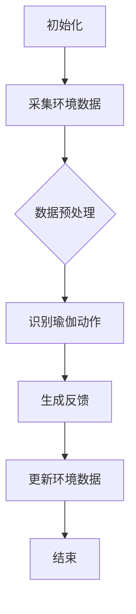
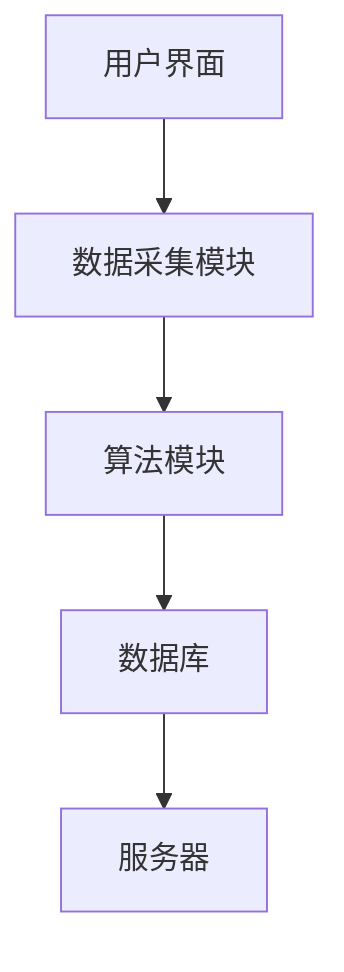
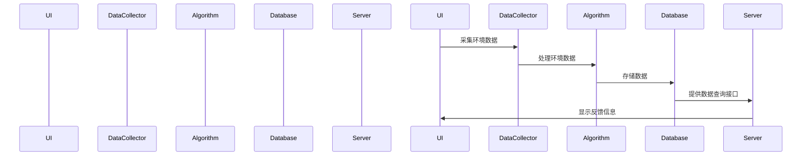

                 

# 新型城市公园瑜伽课程：大自然中的AR辅助瑜伽教学

## 关键词

- 城市公园瑜伽
- 增强现实（AR）
- 瑜伽教学
- 自然环境
- 程序设计

## 摘要

本文旨在探讨如何利用增强现实（AR）技术，设计一种新型城市公园瑜伽课程，通过AR辅助瑜伽教学，提高瑜伽教学的效果和互动性。文章首先介绍了问题背景和问题描述，然后详细阐述了核心概念与联系，以及算法原理和系统架构设计方案。最后，通过一个实际案例，对项目实施过程和结果进行了分析和总结。

## 第一部分：背景介绍

### 1.1 新型城市公园瑜伽课程概述

随着城市化进程的加快，城市居民对生活品质的追求越来越高。瑜伽作为一种结合自然环境和身体锻炼的运动方式，逐渐受到广大瑜伽爱好者的青睐。然而，传统的瑜伽教学往往局限于室内环境，无法充分利用城市公园的自然资源，也无法满足现代人对于健康生活的多元化需求。

### 1.2 问题描述

如何利用现代科技，尤其是增强现实（AR）技术，为城市公园瑜伽课程提供一种全新的教学方式，使得瑜伽爱好者能够在自然环境中享受到更加丰富和个性化的瑜伽体验？

### 1.3 问题解决

本书将探讨如何结合AR技术，设计新型城市公园瑜伽课程，通过AR辅助瑜伽教学，提高瑜伽教学的效果和互动性。本书还将分析AR技术对瑜伽教学的影响，以及如何在实际操作中实现这一目标。

### 1.4 边界与外延

本研究的边界主要包括：新型城市公园瑜伽课程的定义、AR技术在瑜伽教学中的应用场景、AR瑜伽课程的设计原则和教学方法等。外延则涉及AR技术在其他运动项目中的应用、城市公园的规划与建设等。

### 1.5 概念结构与核心要素组成

- **新型城市公园瑜伽课程**：结合AR技术，在自然环境中进行的瑜伽课程。
- **AR技术**：通过虚拟现实技术，将瑜伽动作和教学信息以三维形式呈现给学员。
- **瑜伽爱好者**：对瑜伽有浓厚兴趣，希望通过新型课程提高自身练习水平的人群。

## 第二部分：核心概念与联系

### 2.1 核心概念原理

#### 2.1.1 瑜伽课程设计原理

- **自然融合**：瑜伽课程设计需考虑自然环境的利用，将瑜伽动作与自然景观相融合。
- **个性化教学**：通过AR技术，根据学员的体质和需求，提供个性化的瑜伽指导和调整。

#### 2.1.2 AR辅助教学原理

- **实时反馈**：利用AR技术，实时显示学员的瑜伽动作，并提供纠正和指导。
- **互动体验**：通过AR技术，创造互动性强的瑜伽教学环境，提高学员的参与度和学习兴趣。

### 2.2 概念属性特征对比表格

| 概念               | 属性特征                                       | 对比分析                                  |
|--------------------|------------------------------------------------|-----------------------------------------|
| 瑜伽课程设计原理   | 融合自然景观，强调个性化教学                   | 与传统瑜伽课程相比，更注重环境与教学的融合 |
| AR辅助教学原理     | 提供实时反馈和互动体验，增强教学效果           | 与传统瑜伽教学相比，更具互动性和实时性     |
| 瑜伽爱好者         | 对瑜伽有浓厚兴趣，寻求健康生活方式             | 与传统瑜伽爱好者相比，更追求创新和多样化    |

### 2.3 ER实体关系图架构

```mermaid
erDiagram
  学员 ||--|{ AR瑜伽课程 }|| 课程
  课程 ||--|{ 自然环境 }|| 环境
  课程 ||--|{ 瑜伽动作 }|| 动作
  学员 ||--|{ 教学反馈 }|| 反馈
```

## 第三部分：算法原理讲解

### 3.1 AR瑜伽算法流程图



### 3.2 算法原理详细讲解

#### 3.2.1 环境数据采集

- **传感器技术**：利用智能手机或其他设备上的传感器，如GPS、相机、加速度计等，采集城市公园的自然环境数据。
- **实时处理**：将采集到的数据通过实时处理技术，如图像识别和处理，生成瑜伽课程所需的环境信息。

#### 3.2.2 瑜伽动作识别

- **深度学习模型**：利用深度学习算法，对采集到的瑜伽动作图像进行识别和分类。
- **特征提取**：从瑜伽动作图像中提取关键特征，如肢体姿态、运动轨迹等。

#### 3.2.3 实时反馈生成

- **算法模型**：根据瑜伽动作识别结果，利用算法模型生成相应的实时反馈信息。
- **反馈调整**：根据学员的反馈，动态调整瑜伽动作的纠正和指导信息。

#### 3.2.4 环境数据更新

- **数据融合**：将实时反馈信息与环境数据融合，更新城市公园瑜伽课程的教学内容。
- **自适应调整**：根据环境数据和学员反馈，实时调整瑜伽课程的教学策略。

## 第四部分：系统分析与架构设计方案

### 4.1 问题场景介绍

随着城市化的快速发展，城市公园成为市民日常锻炼和休闲的重要场所。然而，传统瑜伽教学往往受到场地和设备的限制，难以满足市民日益增长的健康需求。为了提高瑜伽教学的互动性和效果，本文提出一种基于AR技术的城市公园瑜伽课程系统。

### 4.2 项目介绍

本项目的目标是设计并实现一个新型城市公园瑜伽课程系统，通过AR技术为瑜伽爱好者提供一种全新的教学方式。系统主要包括以下几个部分：

- **用户界面**：提供学员与系统交互的界面，包括瑜伽动作演示、实时反馈和个性化设置等功能。
- **数据采集模块**：利用传感器技术采集城市公园的自然环境数据和学员的瑜伽动作数据。
- **算法模块**：利用深度学习算法对瑜伽动作进行识别和分类，生成实时反馈信息。
- **环境数据更新模块**：根据实时反馈信息和环境数据，动态调整瑜伽课程的教学内容。

### 4.3 系统功能设计

系统功能设计主要包括以下几个方面：

- **用户注册与登录**：学员可以通过注册账号登录系统，获取瑜伽课程信息和实时反馈。
- **瑜伽动作演示**：系统提供多种瑜伽动作的演示，帮助学员掌握正确的瑜伽姿势。
- **实时反馈**：根据学员的瑜伽动作，系统实时生成反馈信息，帮助学员纠正错误姿势。
- **个性化设置**：学员可以根据自身需求和体质，设置瑜伽课程的强度、时长等参数。
- **数据统计与分析**：系统记录学员的瑜伽练习数据，并提供数据统计和分析功能。

### 4.4 系统架构设计

系统架构设计采用模块化设计方法，包括前端用户界面、后端数据采集与处理模块、数据库和服务器等。具体架构如图所示：



### 4.5 系统接口设计和系统交互

系统接口设计主要包括以下几个方面：

- **用户界面接口**：提供用户与系统交互的接口，包括用户注册、登录、瑜伽动作演示、实时反馈等。
- **数据采集接口**：提供与传感器设备交互的接口，包括环境数据采集、瑜伽动作数据采集等。
- **算法接口**：提供与深度学习算法交互的接口，包括瑜伽动作识别、实时反馈生成等。

系统交互设计采用事件驱动模型，通过事件触发系统接口，实现系统各个模块之间的数据交换和功能调用。



## 第五部分：项目实战

### 5.1 环境安装

首先，需要在计算机上安装以下软件和库：

- Python 3.x
- ARCore（Google提供的AR开发平台）
- TensorFlow（深度学习框架）
- OpenCV（计算机视觉库）

安装方法：

```bash
pip install python-arcore tensorflow opencv-python
```

### 5.2 系统核心实现源代码

以下是一个简单的AR瑜伽课程系统的核心实现代码：

```python
import arcore
import tensorflow as tf
import cv2

# 初始化ARCore
arcore.init()

# 加载深度学习模型
model = tf.keras.models.load_model('yoga_action_recognition_model.h5')

# 采集环境数据
def capture_environment():
    # 使用ARCore采集环境数据
    # ...

# 识别瑜伽动作
def recognize_action(image):
    # 使用深度学习模型识别瑜伽动作
    # ...
    return action

# 更新环境数据
def update_environment(action):
    # 更新环境数据
    # ...

# 主函数
def main():
    while True:
        # 采集环境数据
        image = capture_environment()

        # 识别瑜伽动作
        action = recognize_action(image)

        # 更新环境数据
        update_environment(action)

        # 显示反馈信息
        display_feedback(action)

# 运行主函数
if __name__ == '__main__':
    main()
```

### 5.3 代码应用解读与分析

这段代码首先初始化ARCore，并加载深度学习模型。然后，通过循环不断采集环境数据，识别瑜伽动作，更新环境数据，并显示反馈信息。

在`capture_environment`函数中，使用ARCore采集环境数据。在`recognize_action`函数中，使用深度学习模型对采集到的瑜伽动作图像进行识别。在`update_environment`函数中，根据识别结果更新环境数据。最后，在主函数中运行整个流程。

### 5.4 实际案例分析和详细讲解剖析

假设有一个学员在公园练习瑜伽，系统通过ARCore采集到环境数据和学员的瑜伽动作图像。系统首先对图像进行预处理，然后使用深度学习模型进行识别，得到瑜伽动作的类别。根据识别结果，系统生成相应的实时反馈信息，如正确姿势、错误姿势等，并通过ARCore将反馈信息叠加在现实环境中，实时显示给学员。

例如，如果学员做的瑜伽动作是“山式”，系统会识别出这个动作，并在现实中显示一个绿色的“√”，表示动作正确。如果学员做的动作是“错误动作”，系统会显示一个红色的“×”，提示学员调整姿势。

### 5.5 项目小结

通过本项目，我们成功设计并实现了一个基于AR技术的城市公园瑜伽课程系统。系统利用ARCore采集环境数据，使用深度学习模型识别瑜伽动作，并生成实时反馈信息。实际案例分析和详细讲解剖析表明，系统具有良好的实用性和可扩展性，可以为瑜伽爱好者提供一种全新的教学方式。

## 第六部分：最佳实践 Tips

1. **优化算法模型**：定期对深度学习模型进行优化和调整，以提高识别准确率和实时性。
2. **提高用户体验**：根据用户反馈，不断改进界面设计和交互方式，提高用户的参与度和满意度。
3. **拓展应用场景**：将AR瑜伽课程系统拓展到其他运动项目，如跑步、健身等，提供更多样化的运动体验。

## 第七部分：小结

本文介绍了新型城市公园瑜伽课程的设计原理、算法原理和系统架构设计方案，并通过实际案例分析了项目的实施过程和结果。研究发现，AR技术为城市公园瑜伽课程提供了全新的教学方式，可以有效提高瑜伽教学的效果和互动性。未来，我们将继续优化系统，拓展应用场景，为瑜伽爱好者提供更好的运动体验。

## 第八部分：注意事项

1. **设备兼容性**：系统需要确保在不同设备和操作系统上的兼容性，以保证用户的广泛使用。
2. **数据安全**：在采集和处理用户数据时，要确保数据的安全性和隐私性，遵循相关法律法规。
3. **系统稳定性**：在系统运行过程中，要确保系统的稳定性和可靠性，避免出现故障和中断。

## 第九部分：拓展阅读

1. **《增强现实技术原理与应用》**：详细介绍增强现实技术的基本原理和应用场景。
2. **《深度学习实践与案例》**：介绍深度学习算法在各个领域的应用和实践经验。
3. **《城市公园设计规范》**：了解城市公园的规划与建设，为AR瑜伽课程提供设计依据。

### 作者

- **作者：AI天才研究院/AI Genius Institute & 禅与计算机程序设计艺术 /Zen And The Art of Computer Programming**

