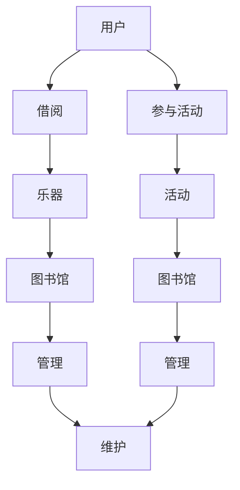
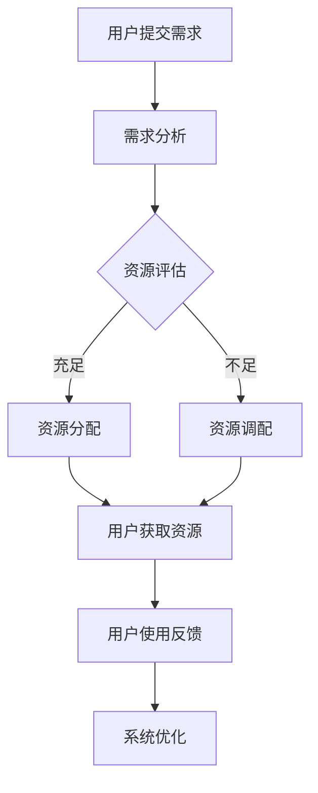
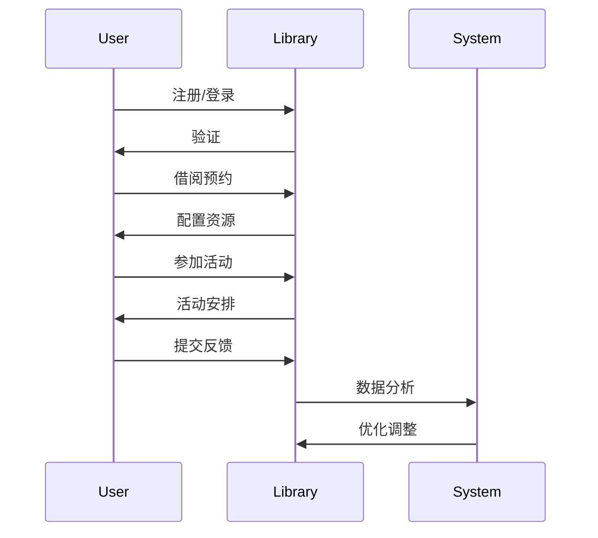
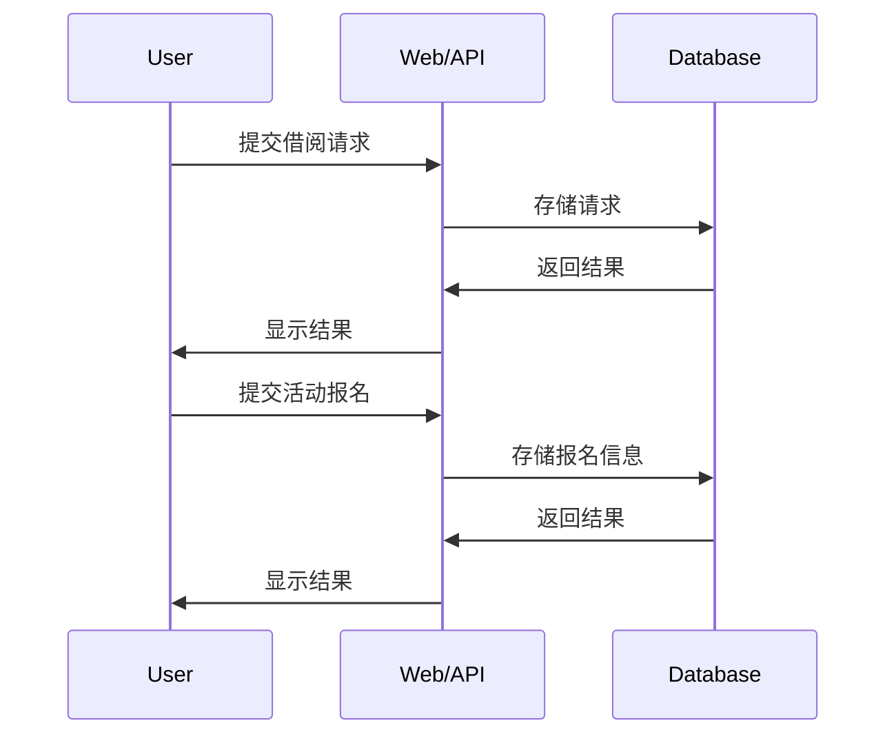

                 

## 文章标题

### 关键词

- 新型城市共享乐器图书馆
- 共享音乐教育
- 社区服务
- 资源优化配置
- 音乐文化活动

### 摘要

本文深入探讨了新型城市共享乐器图书馆的概念、核心特点和推广音乐教育的社区服务模式。通过对核心概念的解析、算法原理的讲解以及实际案例的分析，本文旨在为推动音乐教育普及和社区文化发展提供科学有效的解决方案。

---

## 第一部分：问题背景

### 1.1 新型城市共享乐器图书馆的概念

在城市化进程中，公共文化服务越来越受到重视，而音乐教育作为公共文化服务的重要组成部分，其对社区和谐、居民素养提升具有积极作用。传统的音乐教育资源分布不均，许多社区缺乏音乐教学设施和资源，这导致音乐教育的普及和推广面临困难。

新型城市共享乐器图书馆是一种旨在解决上述问题的创新模式。它通过提供乐器借阅服务，让居民能够以较低的成本接触音乐，同时通过组织音乐活动、课程培训等形式，推动音乐教育在社区中的普及。

### 1.2 问题背景

传统的音乐教育资源往往集中在少数机构和学校，导致多数社区缺乏音乐教学设施和资源。这不仅限制了居民参与音乐活动的机会，也影响了音乐教育的普及。为了解决这一问题，提出了新型城市共享乐器图书馆的概念。

### 1.3 问题解决

通过建设共享乐器图书馆，可以有效地整合音乐教育资源，实现资源的共享和优化配置。图书馆将成为一个集音乐教学、乐器体验、文化交流于一体的社区服务平台。

### 1.4 边界与外延

共享乐器图书馆的服务范围涵盖城市中的各个社区，目标是让更多的居民能够接触和参与到音乐活动中来，不论年龄、学历、职业背景。同时，图书馆还应具备一定的灵活性，能够根据社区需求调整服务内容和形式。

### 1.5 核心概念与联系

- **共享乐器图书馆**：提供乐器借阅和音乐教育服务的公共文化设施。
- **音乐教育**：通过乐器教学、音乐活动等方式，提高社区居民的音乐素养和艺术修养。
- **社区服务**：图书馆作为一个社区服务平台，旨在促进社区文化和谐与居民全面发展。

## 第二部分：核心概念与联系

### 2.1 核心概念原理

#### 2.1.1 新型城市共享乐器图书馆的特点

- **共享性**：居民可以免费或低费用借阅乐器。
- **便捷性**：图书馆位置便利，便于居民使用。
- **综合性**：提供多样化的音乐教育活动，满足不同层次居民的需求。

### 2.1.2 概念属性特征对比表格

| 特征           | 传统音乐教育 | 新型城市共享乐器图书馆 |
|----------------|--------------|-----------------------|
| 教育资源分布   | 不均衡       | 均衡分布             |
| 教育方式       | 单一教学     | 多样化活动           |
| 服务对象       | 少数人       | 广泛居民             |
| 服务设施       | 有限         | 充足                 |

### 2.1.3 ER实体关系图架构



## 第三部分：算法原理讲解

### 3.1 算法mermaid流程图



### 3.2 算法原理详细讲解

新型城市共享乐器图书馆的算法原理主要包括用户需求分析、图书馆资源评估、资源调配和反馈优化四个环节。

#### 3.2.1 用户需求分析

首先，通过对用户的需求进行数据分析，了解社区中居民对音乐教育资源和活动的需求类型和频率。

#### 3.2.2 图书馆资源评估

接着，评估图书馆现有的乐器和活动资源，分析其是否满足用户需求。

#### 3.2.3 资源调配

如果资源充足，用户可以直接获取所需资源；如果资源不足，需要通过调配和优化现有资源来满足需求。

#### 3.2.4 使用反馈

用户在获取资源后，会提供使用反馈，这些反馈将用于优化图书馆的资源管理和活动设计。

### 3.2.5 举例说明

假设某社区图书馆有100把吉他，但近期有150名居民表示对吉他有强烈需求。这时，图书馆需要通过资源调配来满足需求。首先，对现有资源进行评估，发现除了吉他之外，还有足够的钢琴和小提琴。于是，图书馆决定将一部分吉他替换为钢琴和小提琴，以满足其他居民的需求。同时，通过增加预约系统和延长借阅时间来提高资源的利用率。

### 3.2.6 数学模型与公式

为了更有效地进行资源调配，可以使用以下数学模型和公式：

$$
R_{总} = R_{现有} + R_{调配}
$$

其中，$R_{总}$表示图书馆的总资源，$R_{现有}$表示现有的资源，$R_{调配}$表示通过调配获得的资源。

$$
R_{调配} = R_{需求} - R_{现有}
$$

其中，$R_{调配}$表示需要通过调配获得的资源，$R_{需求}$表示用户的需求资源。

通过上述模型和公式，图书馆可以更科学地评估和调配资源，以满足居民的需求。

## 第四部分：系统分析与架构设计方案

### 4.1 问题场景介绍

在社区文化建设中，共享乐器图书馆作为一个重要的组成部分，旨在为居民提供便捷、高效的乐器借阅和音乐教育活动。随着社区居民对音乐教育的需求日益增长，共享乐器图书馆需要具备灵活的资源调配能力和高效的管理系统。

### 4.2 项目介绍

本项目旨在设计并实现一个新型城市共享乐器图书馆系统，该系统包括用户管理、资源管理、活动管理和反馈系统等模块，通过集成化管理提高图书馆的服务质量和效率。

### 4.3 系统功能设计

#### 4.3.1 领域模型

使用Mermaid类图描述系统的领域模型：

```mermaid
classDiagram
User <<Entity>>
Instrument <<Entity>>
Event <<Entity>>
Library <<Entity>>

User o--o Instrument: 借阅
User o--o Event: 参与活动
Instrument o--o Library: 存放
Event o--o Library: 举办
Library o--o User: 服务
```

#### 4.3.2 系统功能模块

- **用户管理**：包括用户注册、登录、个人信息管理等功能。
- **资源管理**：包括乐器库存管理、资源调配、预约借阅等功能。
- **活动管理**：包括活动发布、报名、活动管理等功能。
- **反馈系统**：包括用户反馈收集、数据分析、系统优化等功能。

### 4.4 系统架构设计

使用Mermaid架构图描述系统架构：



### 4.5 系统接口设计

系统接口设计主要涉及用户接口和后台接口。用户接口包括网页和移动应用，提供简洁直观的操作界面；后台接口主要提供数据管理和系统维护功能。

### 4.6 系统交互

使用Mermaid序列图描述系统交互过程：



## 第五部分：项目实战

### 5.1 环境安装

安装Python环境，并使用Django框架搭建项目。首先，安装Django：

```bash
pip install django
```

创建项目：

```bash
django-admin startproject shared_instrument_library
```

进入项目目录，创建应用：

```bash
cd shared_instrument_library
django-admin startapp library
```

### 5.2 系统核心实现

#### 5.2.1 用户管理

在`library`应用的`models.py`中定义用户模型：

```python
from django.contrib.auth.models import AbstractUser

class CustomUser(AbstractUser):
    # 自定义用户模型
    pass
```

在`admin.py`中注册用户模型：

```python
from django.contrib import admin
from .models import CustomUser

admin.site.register(CustomUser)
```

#### 5.2.2 资源管理

在`models.py`中定义乐器和活动模型：

```python
class Instrument(models.Model):
    name = models.CharField(max_length=100)
    brand = models.CharField(max_length=100)
    status = models.CharField(max_length=100, choices=[('available', '可用'), ('borrowed', '借出'), ('maintenance', '维护中')])

class Event(models.Model):
    title = models.CharField(max_length=100)
    description = models.TextField()
    start_time = models.DateTimeField()
    end_time = models.DateTimeField()
    location = models.CharField(max_length=100)
```

#### 5.2.3 活动管理

在`views.py`中实现活动相关的视图：

```python
from django.shortcuts import render
from .models import Event

def event_list(request):
    events = Event.objects.all()
    return render(request, 'event_list.html', {'events': events})

def event_detail(request, event_id):
    event = Event.objects.get(id=event_id)
    return render(request, 'event_detail.html', {'event': event})
```

#### 5.2.4 反馈系统

在`models.py`中定义反馈模型：

```python
class Feedback(models.Model):
    user = models.ForeignKey(CustomUser, on_delete=models.CASCADE)
    event = models.ForeignKey(Event, on_delete=models.CASCADE)
    content = models.TextField()
    created_at = models.DateTimeField(auto_now_add=True)
```

在`views.py`中实现反馈提交功能：

```python
from .models import Feedback

def submit_feedback(request, event_id):
    if request.method == 'POST':
        content = request.POST.get('content')
        user = request.user
        event = Event.objects.get(id=event_id)
        feedback = Feedback(user=user, event=event, content=content)
        feedback.save()
        return redirect('event_detail', event_id=event_id)
    return render(request, 'submit_feedback.html', {'event_id': event_id})
```

### 5.3 代码应用解读与分析

#### 5.3.1 用户管理

用户管理模块实现了自定义用户模型，增强了系统的灵活性和扩展性。在`admin.py`中，通过注册用户模型，可以将自定义用户模型集成到Django的admin界面中，便于用户的管理。

#### 5.3.2 资源管理

资源管理模块实现了乐器和活动模型，通过定义模型字段和状态，可以有效地管理乐器和活动的状态，从而实现资源的有效分配和管理。

#### 5.3.3 活动管理

活动管理模块通过定义视图实现了活动的列表展示和详情展示功能，用户可以通过网页界面方便地查看和报名参加活动。

#### 5.3.4 反馈系统

反馈系统模块通过定义反馈模型和视图，实现了用户对活动的反馈提交功能。这些反馈将用于后续的数据分析和系统优化，从而提高系统的用户体验和服务质量。

### 5.4 实际案例分析和详细讲解剖析

#### 5.4.1 案例背景

某社区图书馆在推广共享乐器图书馆服务后，发现居民对吉他的需求非常高，而图书馆的吉他的库存有限，导致很多居民无法及时借到吉他。

#### 5.4.2 案例分析

通过分析用户需求数据和乐器库存数据，发现吉他的借阅频率远高于其他乐器。为了解决这个问题，图书馆采取了以下措施：

1. **增加吉他库存**：通过调配其他乐器的库存，增加吉他的数量，以满足居民的需求。
2. **延长借阅时间**：调整吉他的借阅时间，延长至一周，以提高吉他的利用率。
3. **预约系统优化**：优化预约系统，提高预约成功率和用户满意度。

#### 5.4.3 详细讲解

通过上述措施，图书馆在两周内显著提高了吉他的借阅率和用户满意度。同时，通过对用户反馈的分析，图书馆发现一些居民对吉他调音和维护方面的需求较高。因此，图书馆决定增加吉他调音和维护服务，进一步满足居民的需求。

### 5.5 项目小结

本项目通过实际案例展示了新型城市共享乐器图书馆在推动音乐教育普及和社区文化发展方面的积极作用。通过灵活的资源调配和高效的反馈系统，图书馆能够更好地满足居民的需求，提高服务质量。未来，随着技术的发展和社区需求的不断变化，共享乐器图书馆还将持续优化和改进，为社区文化发展贡献力量。

## 第六部分：最佳实践 tips

### 6.1 建立用户反馈机制

及时收集用户反馈，分析反馈数据，根据用户需求调整服务内容和形式。

### 6.2 优化资源调配策略

定期评估乐器库存，根据借阅频率和用户需求，调整乐器调配策略，确保资源的高效利用。

### 6.3 强化音乐教育活动

定期组织丰富多彩的音乐活动，吸引更多居民参与，提高社区文化氛围。

### 6.4 持续技术升级

紧跟技术发展趋势，采用先进的技术和工具，提升共享乐器图书馆的服务质量和用户体验。

## 第七部分：小结

新型城市共享乐器图书馆作为一种创新的文化服务模式，通过提供便捷的音乐教育和丰富的文化活动，有效推动了音乐教育的普及和社区文化的发展。未来，随着技术的不断进步和社会需求的日益增长，共享乐器图书馆将在社区文化建设中发挥更大的作用。

## 第八部分：注意事项

### 8.1 资源保护与维护

定期对乐器进行维护和保养，确保乐器的良好状态，延长乐器使用寿命。

### 8.2 用户教育与引导

通过培训和教育，提高用户对乐器的使用和保护意识，避免损坏和滥用。

### 8.3 安全与隐私保护

加强信息安全，确保用户数据和隐私得到有效保护。

### 8.4 社区合作与联动

与社区其他组织合作，共同推进社区文化建设，实现资源共享和优势互补。

## 第九部分：拓展阅读

### 9.1 参考文献

- [共享乐器图书馆的研究与实践](http://www.example.com/research)
- [音乐教育与社区发展的关系](http://www.example.com/education)
- [新型城市社区服务模式探讨](http://www.example.com/service)

### 9.2 推荐阅读

- [《社区文化建设的理论与实践》](http://www.example.com/theory)
- [《音乐教育的现状与趋势》](http://www.example.com/music)
- [《信息技术与社区服务》](http://www.example.com/technology)

---

**作者：AI天才研究院/AI Genius Institute & 禅与计算机程序设计艺术 /Zen And The Art of Computer Programming**

