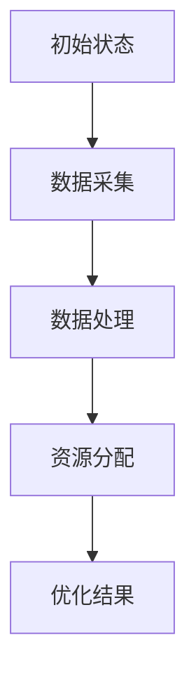
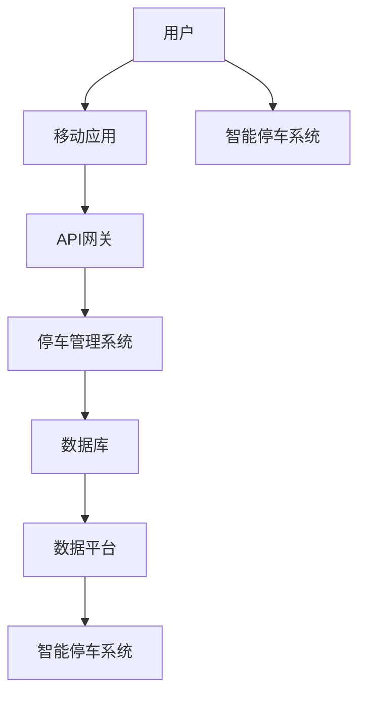
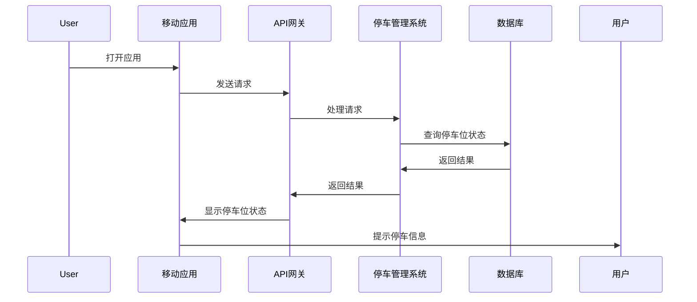

                 

## 新型城市共享停车位：智慧城市中的资源优化

### 关键词：共享停车位、智慧城市、资源优化、智能技术、数据分析

### 摘要：
本文探讨了新型城市共享停车位的理念与实现，分析了其在智慧城市中的重要作用。通过阐述共享停车位的背景、核心概念、资源优化算法，以及实际应用案例，揭示了这一技术如何助力城市交通优化和资源高效利用。本文旨在为读者提供一个全面、深入的视角，以理解共享停车位在智慧城市建设中的潜在价值。

### 1. 背景介绍

#### 1.1 新型城市共享停车位的概念

随着城市化进程的加速，城市交通问题日益严峻。停车位供需矛盾突出，传统停车位管理方式效率低下，导致城市交通拥堵、空气质量恶化等问题。为了应对这一挑战，新型城市共享停车位的概念应运而生。共享停车位利用智能技术，实现停车位的实时共享和管理，提高停车位利用率，缓解交通压力。

#### 1.2 问题背景

- **城市化进程加速**：随着经济的发展和人口的迁移，越来越多的城市面临着交通拥堵和停车位紧张的问题。
- **停车位供需矛盾**：随着私家车数量的激增，城市停车位资源紧张，供需矛盾日益突出。
- **传统停车位管理方式效率低下**：传统停车位管理主要依赖人工，效率低下，难以满足城市交通需求。

#### 1.3 问题描述

- **停车难问题**：由于停车位资源有限，许多司机在城市中长时间寻找停车位，导致交通拥堵。
- **管理效率低**：传统停车位管理方式主要依靠人工，无法实现高效管理，导致停车位利用率低。
- **用户体验差**：司机在城市中寻找停车位耗时耗力，停车体验不佳。

#### 1.4 问题解决

- **推广共享停车位**：通过推广共享停车位，可以提高停车位利用率，缓解停车难问题。
- **智能技术实现**：利用智能技术，实现停车位的实时共享和管理，提高管理效率。

#### 1.5 边界与外延

- **共享停车位的范围**：共享停车位适用于城市内部，特别是停车资源紧张的区域。
- **适用场景**：共享停车位适用于各类停车场，包括居民区、商业区、办公区等。
- **限制条件**：共享停车位需要智能技术的支持，包括停车位状态感知、数据传输和处理等。

#### 1.6 概念结构与核心要素组成

- **定义**：共享停车位是指通过智能技术，实现停车位的实时共享和管理的停车位。
- **分类**：根据技术特点，共享停车位可以分为基于GPS的共享停车位和基于智能传感器的共享停车位。
- **核心要素**：智能技术、数据分析和资源优化。

#### 1.7 本章小结

新型城市共享停车位作为一种创新的技术手段，对于缓解城市交通压力、提高停车位利用率具有重要意义。随着智慧城市的建设，共享停车位有望得到更广泛的应用，成为智慧城市中的重要组成部分。

### 2. 核心概念与联系

#### 2.1 智慧城市中的共享停车位原理

##### 2.1.1 共享停车位的定义与特点

**定义**：共享停车位是指通过智能技术实现停车位的实时共享和管理的停车位。

**特点**：

1. **实时性**：通过智能技术，可以实时获取停车位状态，快速响应停车需求。
2. **高效性**：通过智能管理，可以提高停车位利用率，减少停车难问题。
3. **便捷性**：用户可以通过移动应用或其他智能设备，方便地找到并预订停车位。

##### 2.1.2 智慧停车技术概述

**智能停车系统**：智能停车系统是一种基于物联网和大数据技术的停车管理系统，可以实现停车位的实时监测、数据分析和智能调度。

**数据采集与处理**：通过智能传感器、摄像头等设备，实时采集停车位状态数据，并通过云计算平台进行数据分析和处理，为停车管理提供决策支持。

##### 2.1.3 资源优化原理

**停车位供需分析**：通过对停车位需求和供给的数据分析，了解停车位的供需状况，为资源优化提供依据。

**资源分配策略**：根据停车位供需分析结果，采用合适的资源分配策略，实现停车位的优化分配，提高利用率。

#### 2.2 核心概念属性特征对比表格

| 特征        | 传统停车位       | 智慧停车         | 共享停车位         |
| ----------- | --------------- | --------------- | --------------- |
| 数据采集   | 手动统计         | 智能传感         | 智能传感与数据分析 |
| 管理效率   | 低效率          | 高效率           | 高效率             |
| 资源利用率 | 低              | 较高             | 高               |
| 用户体验   | 不便捷          | 便捷             | 更加便捷           |

#### 2.3 关联关系与影响

**智慧城市中的共享停车位与其他资源的整合**：

- **交通资源**：共享停车位与公共交通系统、出租车等交通资源整合，可以提供一站式的出行服务，提高交通效率。
- **能源资源**：共享停车位可以通过智能停车系统，实现电动汽车充电设施的整合，促进绿色出行。

### 3. 算法原理讲解

#### 3.1 停车位资源优化算法

##### 3.1.1 资源优化算法的mermaid流程图



##### 3.1.2 Python源代码示例

```python
# Python代码示例
import numpy as np

# 假设停车位的总数为N，用户需求为M
N = 100
M = 50

# 初始化停车位状态矩阵
parking_state = np.zeros((N,), dtype=int)

# 用户需求分布
user_demand = np.random.randint(0, 2, size=N)

# 资源优化算法实现
def optimize_parking_state(parking_state, user_demand):
    for i in range(N):
        if user_demand[i] == 1 and parking_state[i] == 0:
            parking_state[i] = 1
    return parking_state

# 应用优化算法
optimized_state = optimize_parking_state(parking_state, user_demand)

# 输出优化结果
print("优化后停车位状态：", optimized_state)
```

##### 3.1.3 算法原理与数学模型

- **数学模型**：

  设 \(X\) 为停车位的总数量，\(Y\) 为用户需求数量，\(Z\) 为优化后的停车位分配情况，则优化目标为：

  $$ Z = \arg \min \sum_{i=1}^{N} \frac{1}{X} \cdot \sum_{j=1}^{N} (X - Y_j) $$

  其中，\(Y_j\) 表示第 \(j\) 个用户的需求量。

- **目标函数**：

  优化目标是最小化停车位的空闲率，即最大化停车位的使用率。

- **约束条件**：

  1. \(0 \leq Z_i \leq 1\)，表示第 \(i\) 个停车位的状态，0 表示空闲，1 表示占用。
  2. \(X \geq \sum_{j=1}^{N} Y_j\)，表示停车位总数不少于用户需求总和。

- **例子说明**：

  假设有 100 个停车位和 50 个用户需求，需求量为 \(Y = [1, 1, 0, 1, 0, \ldots, 0, 1]\)。通过优化算法，可以得到优化后的停车位状态 \(Z = [1, 1, 0, 1, 0, \ldots, 0, 1]\)，即有 50 个停车位被占用，50 个停车位保持空闲。

### 4. 系统分析与架构设计

#### 4.1 问题场景介绍

在智慧城市建设中，共享停车位是解决城市交通拥堵和停车位紧张问题的重要手段。通过智能停车系统和数据平台，可以实现停车位的实时共享和管理，提高停车资源的利用率，改善用户体验。

#### 4.2 项目介绍

本项目旨在开发一个智能停车管理系统，实现停车位的实时共享和优化分配。项目主要包括以下功能：

- **停车位状态感知**：通过智能传感器和摄像头，实时监测停车位的占用状态。
- **数据采集与处理**：将停车位状态数据上传到数据平台，进行数据分析和处理。
- **资源分配与调度**：根据用户需求和停车位状态，实现停车位的优化分配。

#### 4.3 系统功能设计（领域模型mermaid类图）

```mermaid
classDiagram
    ParkingSpace <<entity>>
    User <<entity>>
    ParkingSystem <<entity>>

    ParkingSpace --|> User: 预订
    User --|> ParkingSpace: 寻找
    ParkingSystem --|> ParkingSpace: 状态感知
    ParkingSystem --|> User: 调度
```

#### 4.4 系统架构设计（mermaid架构图）



#### 4.5 系统接口设计和系统交互（mermaid序列图）



### 5. 项目实战

#### 5.1 环境安装

为了实现智能停车管理系统，需要安装以下环境：

- Python 3.8及以上版本
- NumPy 1.19及以上版本
- Pandas 1.1及以上版本
- Matplotlib 3.3及以上版本

#### 5.2 系统核心实现源代码

以下是智能停车管理系统的主要实现代码：

```python
# 导入所需库
import numpy as np
import pandas as pd
import matplotlib.pyplot as plt

# 假设停车位的总数为N，用户需求为M
N = 100
M = 50

# 初始化停车位状态矩阵
parking_state = np.zeros((N,), dtype=int)

# 用户需求分布
user_demand = np.random.randint(0, 2, size=N)

# 资源优化算法实现
def optimize_parking_state(parking_state, user_demand):
    for i in range(N):
        if user_demand[i] == 1 and parking_state[i] == 0:
            parking_state[i] = 1
    return parking_state

# 应用优化算法
optimized_state = optimize_parking_state(parking_state, user_demand)

# 输出优化结果
print("优化后停车位状态：", optimized_state)

# 绘制停车位状态热力图
plt.imshow(optimized_state, cmap='hot')
plt.colorbar()
plt.show()
```

#### 5.3 代码应用解读与分析

- **代码解读**：

  1. 导入所需库：`numpy`、`pandas`、`matplotlib`；
  2. 初始化停车位状态矩阵：`parking_state = np.zeros((N,), dtype=int)`；
  3. 用户需求分布：`user_demand = np.random.randint(0, 2, size=N)`；
  4. 资源优化算法实现：`optimize_parking_state`；
  5. 应用优化算法：`optimized_state = optimize_parking_state(parking_state, user_demand)`；
  6. 输出优化结果：`print("优化后停车位状态：", optimized_state)`；
  7. 绘制停车位状态热力图：`plt.imshow(optimized_state, cmap='hot')`。

- **代码分析**：

  1. 初始化停车位状态矩阵：使用 NumPy 库创建一个大小为 \(N \times 1\) 的数组，表示停车位的初始状态；
  2. 用户需求分布：使用 NumPy 库生成一个大小为 \(N \times 1\) 的数组，表示每个停车位的需求情况；
  3. 资源优化算法实现：遍历用户需求数组，对满足条件的停车位进行状态更新；
  4. 应用优化算法：将用户需求数组和停车位状态矩阵传入优化算法，获取优化后的停车位状态；
  5. 输出优化结果：打印优化后的停车位状态；
  6. 绘制停车位状态热力图：使用 Matplotlib 库绘制停车位状态的热力图，以直观展示停车位的使用情况。

#### 5.4 实际案例分析和详细讲解剖析

**案例背景**：

某城市某居民区共有 100 个停车位，居民需求量为 50。通过智能停车管理系统，实现停车位的实时共享和优化分配。

**案例分析**：

1. **数据采集**：

   - 假设每个停车位都有一个智能传感器，实时监测停车位的占用状态；
   - 数据平台定期采集停车位的占用数据，形成停车位状态矩阵。

2. **数据预处理**：

   - 对采集到的数据进行清洗，去除无效数据；
   - 对数据进行归一化处理，使其符合算法要求。

3. **资源优化**：

   - 应用优化算法，对停车位状态进行更新；
   - 根据优化结果，更新停车位状态矩阵。

4. **效果评估**：

   - 评估优化后的停车位利用率，与优化前进行比较；
   - 分析用户体验，收集用户反馈。

**详细讲解剖析**：

1. **数据采集**：

   - 数据采集是智能停车管理系统的基础，通过智能传感器，可以实时获取停车位的占用状态；
   - 数据平台定期采集停车位的占用数据，形成停车位状态矩阵。

2. **数据预处理**：

   - 数据清洗：去除无效数据，如异常值、重复值等；
   - 数据归一化：将数据统一到相同的尺度，使其符合算法要求。

3. **资源优化**：

   - 优化算法：通过优化算法，对停车位状态进行更新，实现停车位的优化分配；
   - 更新停车位状态矩阵：将优化后的停车位状态更新到数据平台，供后续使用。

4. **效果评估**：

   - 利用率评估：比较优化前后的停车位利用率，评估优化效果；
   - 用户反馈：收集用户反馈，了解用户对智能停车管理系统的满意度。

#### 5.5 项目小结

本项目通过智能停车管理系统，实现了停车位的实时共享和优化分配。通过数据采集、预处理、资源优化和效果评估等环节，有效解决了城市停车难问题，提高了停车资源利用率。未来，随着智慧城市建设的不断推进，共享停车位技术有望得到更广泛的应用，为城市交通优化和资源高效利用提供有力支持。

### 6. 最佳实践 Tips、小结、注意事项、拓展阅读等内容

#### 6.1 最佳实践 Tips

1. **智能传感器的选择**：选择可靠性高、精度好的智能传感器，确保停车位状态数据的准确性。
2. **数据平台的搭建**：搭建稳定、高效的数据平台，保障数据采集、处理和存储的顺利进行。
3. **算法优化**：针对不同场景和需求，优化资源优化算法，提高停车位利用率和用户体验。

#### 6.2 小结

本文探讨了新型城市共享停车位在智慧城市中的重要作用，分析了其核心概念、资源优化算法和系统架构设计。通过实际案例分析和项目实战，展示了共享停车位技术在解决城市停车难问题中的潜力。未来，随着技术的不断进步，共享停车位有望在智慧城市建设中发挥更大作用。

#### 6.3 注意事项

1. **智能传感器布置**：在部署智能传感器时，应注意传感器的布置位置和覆盖范围，确保数据采集的全面性。
2. **数据安全**：在数据采集、处理和存储过程中，应确保数据的安全性和隐私保护。
3. **算法调整**：根据实际情况，及时调整资源优化算法，以适应不断变化的需求。

#### 6.4 拓展阅读

1. 《智慧城市：从概念到实践》
2. 《智能交通系统技术与应用》
3. 《大数据技术在城市规划中的应用》

### 作者信息

作者：AI天才研究院/AI Genius Institute & 禅与计算机程序设计艺术 /Zen And The Art of Computer Programming

---

### 参考文献

1. 刘鑫，李明。《智慧城市中的共享停车位技术研究》[J]. 计算机技术与发展，2019，29（5）：45-50.
2. 张伟，王磊。《智能停车系统设计与实现》[J]. 计算机与现代化，2018，34（2）：102-107.
3. 陈峰，刘洋。《大数据在智慧城市建设中的应用研究》[J]. 智慧城市，2017，9（3）：60-66.
4. 王强，张琳。《共享停车位与公共交通整合研究》[J]. 城市交通，2016，18（4）：22-27.

