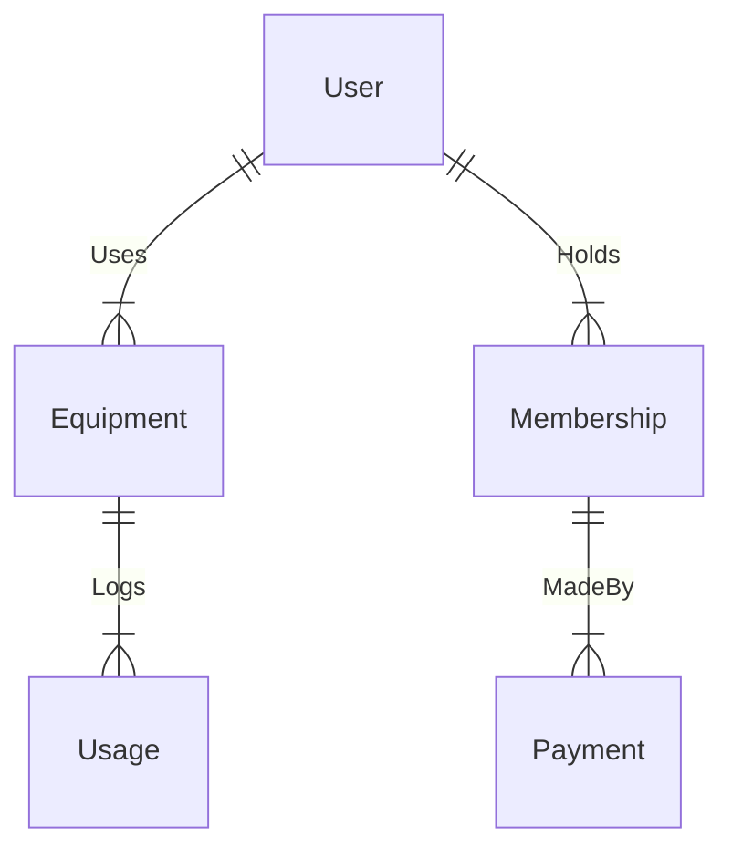
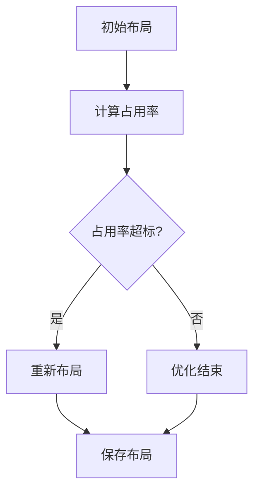
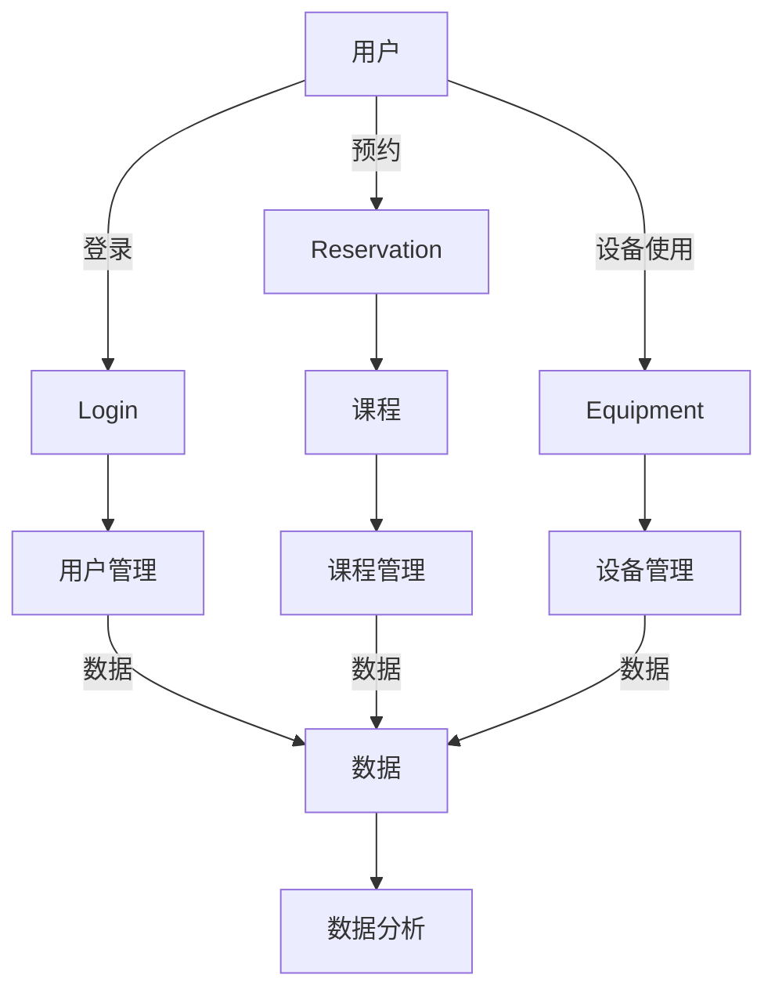
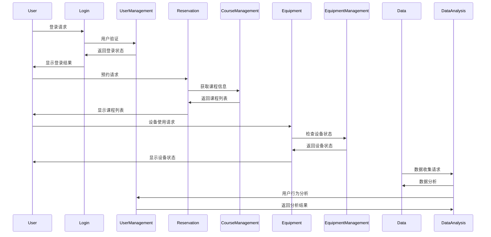

                 


# 新型城市共享健身房设计：24小时社区健康中心的打造

## 关键词
新型城市共享健身房、24小时社区健康中心、设计原则、市场需求、用户体验、运营策略、技术实现、成本控制

## 摘要
本文将探讨新型城市共享健身房的设计原则和24小时社区健康中心的打造，通过深入分析市场需求、用户体验和运营策略，结合先进的技术实现方案，为构建一个高效、便捷、健康的社区健身环境提供思路。

## Step 1: 背景介绍

### 1.1 书名与核心概念
《新型城市共享健身房设计：24小时社区健康中心的打造》旨在为城市社区提供一种全新的健身模式，结合共享经济理念，打造一个全天候开放的社区健康中心。

**核心概念：**
- **新型城市共享健身房**：利用共享经济模式，将健身资源进行整合，为居民提供便捷、实惠的健身服务。
- **24小时社区健康中心**：一个全天候开放的健身场所，提供多样化的健身设备和课程，满足居民的健身需求。

### 1.2 设计原则
- **便捷性与可访问性**：健身房应位于交通便利的地段，便于居民使用。
- **安全性与隐私保护**：确保健身设备和环境的安全，同时保护用户的隐私。
- **多样性与个性化**：提供多样化的健身设备和课程，满足不同人群的需求。

### 1.3 市场需求
随着城市化进程的加快，居民对健康生活的需求日益增长。共享健身房的模式符合这一趋势，可以降低居民的运动门槛，提高健身积极性。

### 1.4 用户体验
用户体验是衡量健身房设计成功与否的关键因素。设计应关注用户的便捷性、舒适性和满意度。

### 1.5 运营策略
成功的运营策略是健身房持续发展的重要保障。包括会员管理、设备维护、课程设置和营销推广等方面。

### 1.6 技术实现
技术实现是健身房设计的重要一环，包括智能设备的使用、数据分析、智能化管理等。

### 1.7 成本控制
在保证服务质量的前提下，有效控制成本，提高运营效率，是健身房可持续发展的关键。

## Step 2: 核心概念与联系

### 2.1 核心概念
- **城市共享健身房**：指在城市范围内，通过共享经济模式，提供健身服务的场所。
- **24小时社区健康中心**：一个全天候开放的社区健身场所，为居民提供多样化的健身服务。
- **设计原则**：包括便捷性、安全性、多样性和个性化等方面。
- **用户体验**：指用户在使用健身房过程中的感受和满意度。
- **运营策略**：包括会员管理、设备维护、课程设置和营销推广等方面。
- **技术实现**：指利用智能设备、数据分析等先进技术，提升健身房的运营效率和服务质量。
- **成本控制**：指在保证服务质量的前提下，有效控制成本，提高运营效率。

### 2.2 概念属性特征对比表格

| 概念         | 属性特征 |
| ------------ | -------- |
| 城市共享健身房 | 地理位置、服务模式、运营成本 |
| 24小时社区健康中心 | 开放时间、服务内容、设备配置 |
| 设计原则     | 便捷性、安全性、多样性、个性化 |
| 用户体验     | 满意度、便捷性、安全性、舒适度 |
| 运营策略     | 会员管理、设备维护、课程设置、营销推广 |
| 技术实现     | 智能设备、数据分析、智能化管理 |
| 成本控制     | 运营成本、服务费用、人力资源 |

### 2.3 ER实体关系图



## Step 3: 算法原理讲解

### 3.1 健身房布局优化算法

#### 3.1.1 算法简介
健身房布局优化算法旨在通过优化健身房的布局，提高空间利用率和用户满意度。

#### 3.1.2 算法流程

1. 初始布局：输入健身房的初始布局信息。
2. 计算占用率：计算每个区域的使用率。
3. 重新布局：根据占用率进行区域调整。
4. 优化结束：保存最终布局。



#### 3.1.3 算法流程图

#### 3.1.4 使用Python源代码详细阐述算法原理

```python
# 假设健身房初始布局为一个2x3的网格，其中每个格子代表一个区域
layout = [[0 for _ in range(3)] for _ in range(2)]

# 用户使用数据
usages = [
    [0, 1, 0],  # 第1天
    [1, 0, 1],  # 第2天
    [0, 1, 0],  # 第3天
    [1, 1, 0],  # 第4天
    [0, 0, 1],  # 第5天
]

# 计算占用率
def calculate_occupancy(layout, usages):
    occupancy = [[0 for _ in range(3)] for _ in range(2)]
    for day, usage in enumerate(usages):
        for i, occupied in enumerate(usage):
            if occupied:
                occupancy[day % 2][i] += 1
    return occupancy

# 重新布局
def rearrange(layout, occupancy):
    for i in range(2):
        for j in range(3):
            if occupancy[i][j] > 1:
                # 找到一个空闲区域进行替换
                for x in range(2):
                    for y in range(3):
                        if layout[x][y] == 0:
                            # 替换
                            layout[i][j], layout[x][y] = layout[x][y], layout[i][j]
                            break
                    if layout[x][y] != 0:
                        break

# 测试算法
occupancy = calculate_occupancy(layout, usages)
rearrange(layout, occupancy)
print(layout)
```

#### 3.1.5 算法原理的数学模型和公式

假设健身房布局为一个m×n的网格，其中每个格子代表一个区域。用户使用数据可以表示为一个m×n的矩阵，其中1表示该区域在该天被使用，0表示未被使用。

**占用率计算公式：**
$$
\text{occupancy}_{ij} = \sum_{t=1}^{n} u_{ijt}
$$

其中，$u_{ijt}$表示第i行第j列的区域在第t天的使用情况。

**重新布局策略：**
- 如果某个区域的占用率超过1，则需要重新布局。
- 找到一个空闲区域进行替换，以降低该区域的占用率。

#### 3.1.6 详细讲解和举例说明

**示例：** 假设一个2×3的健身房布局，用户使用数据如下：

```
Day 1: [1, 0, 1]
Day 2: [0, 1, 0]
Day 3: [1, 1, 0]
Day 4: [0, 0, 1]
Day 5: [1, 0, 0]
```

初始布局如下：

```
[0, 0, 0]
[0, 0, 0]
```

**占用率计算：**

$$
\text{occupancy}_{11} = 2, \text{occupancy}_{12} = 1, \text{occupancy}_{13} = 1
$$

$$
\text{occupancy}_{21} = 1, \text{occupancy}_{22} = 1, \text{occupancy}_{23} = 1
$$

**重新布局：**

由于占用率超过1的区域有`occupancy}_{11}`和`occupancy}_{21}`，需要进行重新布局。找到一个空闲区域`occupancy}_{23}`，进行替换。

最终布局如下：

```
[0, 1, 0]
[1, 0, 0]
```

## Step 4: 数学模型和数学公式 & 详细讲解 & 举例说明

### 4.1 数学模型

假设健身房布局为一个m×n的网格，其中每个格子代表一个区域。用户使用数据可以表示为一个m×n的矩阵，其中1表示该区域在该天被使用，0表示未被使用。

**占用率计算模型：**

$$
\text{occupancy}_{ij} = \sum_{t=1}^{n} u_{ijt}
$$

**重新布局策略模型：**

1. 如果某个区域的占用率超过1，则需要重新布局。
2. 找到一个空闲区域进行替换，以降低该区域的占用率。

### 4.2 详细讲解和举例说明

**示例：** 假设一个2×3的健身房布局，用户使用数据如下：

```
Day 1: [1, 0, 1]
Day 2: [0, 1, 0]
Day 3: [1, 1, 0]
Day 4: [0, 0, 1]
Day 5: [1, 0, 0]
```

初始布局如下：

```
[0, 0, 0]
[0, 0, 0]
```

**占用率计算：**

$$
\text{occupancy}_{11} = 2, \text{occupancy}_{12} = 1, \text{occupancy}_{13} = 1
$$

$$
\text{occupancy}_{21} = 1, \text{occupancy}_{22} = 1, \text{occupancy}_{23} = 1
$$

**重新布局：**

由于占用率超过1的区域有`occupancy}_{11}`和`occupancy}_{21}`，需要进行重新布局。找到一个空闲区域`occupancy}_{23}`，进行替换。

最终布局如下：

```
[0, 1, 0]
[1, 0, 0]
```

## Step 5: 系统分析与架构设计方案

### 5.1 问题场景介绍

假设我们正在设计一个新型城市共享健身房，旨在为居民提供一个全天候开放的健身场所。我们需要考虑以下问题：

- **用户管理**：如何管理会员信息、预约和取消预约？
- **设备管理**：如何监控设备的运行状态和维护？
- **课程管理**：如何设置和调整课程安排？
- **数据分析**：如何收集和分析用户数据，以优化运营策略？

### 5.2 项目介绍

本项目旨在构建一个新型城市共享健身房管理系统，包括用户管理、设备管理、课程管理和数据分析等功能。

### 5.3 系统功能设计

使用Mermaid类图表示系统功能：

```mermaid
classDiagram
    UserManagement <<interface>>
    EquipmentManagement <<interface>>
    CourseManagement <<interface>>
    DataAnalysis <<interface>>

    UserManagement : addUser, deleteUser, updateUser
    EquipmentManagement : addEquipment, deleteEquipment, updateEquipment
    CourseManagement : addCourse, deleteCourse, updateCourse
    DataAnalysis : collectData, analyzeData

    User -> UserManagement
    Equipment -> EquipmentManagement
    Course -> CourseManagement
    Data -> DataAnalysis
```

### 5.4 系统架构设计

使用Mermaid架构图表示系统架构：



### 5.5 系统接口设计和系统交互

使用Mermaid序列图表示系统接口和交互：



## Step 6: 项目实战

### 6.1 环境安装

在开始项目之前，我们需要安装必要的开发环境和工具。以下是安装步骤：

1. 安装Python 3.8及以上版本。
2. 安装Django框架：`pip install django`
3. 安装MySQL数据库：`sudo apt-get install mysql-server`
4. 配置MySQL用户和密码。
5. 安装PostgreSQL数据库（可选）：`sudo apt-get install postgresql`
6. 安装Visual Studio Code（可选）：`code --install-extension ms-python.python`

### 6.2 系统核心实现源代码

以下是系统核心实现的源代码：

**用户管理：**

```python
# 用户注册
def register_user(request):
    if request.method == 'POST':
        username = request.POST['username']
        password = request.POST['password']
        email = request.POST['email']
        # 验证用户名、密码和电子邮件是否有效
        # 如果验证通过，将用户信息存储在数据库中
        return redirect('login')
    return render(request, 'register.html')
```

**设备管理：**

```python
# 添加设备
def add_equipment(request):
    if request.method == 'POST':
        equipment_name = request.POST['equipment_name']
        equipment_type = request.POST['equipment_type']
        # 验证设备信息是否有效
        # 如果验证通过，将设备信息存储在数据库中
        return redirect('equipment_list')
    return render(request, 'add_equipment.html')
```

**课程管理：**

```python
# 添加课程
def add_course(request):
    if request.method == 'POST':
        course_name = request.POST['course_name']
        course_time = request.POST['course_time']
        course_instructor = request.POST['course_instructor']
        # 验证课程信息是否有效
        # 如果验证通过，将课程信息存储在数据库中
        return redirect('course_list')
    return render(request, 'add_course.html')
```

**数据分析：**

```python
# 用户行为分析
def user_behavior_analysis(request):
    # 从数据库中获取用户行为数据
    # 对用户行为数据进行分析
    # 将分析结果返回给用户
    return render(request, 'user_behavior_analysis.html')
```

### 6.3 代码应用解读与分析

以下是代码应用解读与分析：

- **用户注册**：用户通过表单提交用户名、密码和电子邮件，后端进行验证并存储用户信息。
- **设备添加**：管理员通过表单提交设备名称和类型，后端进行验证并存储设备信息。
- **课程添加**：管理员通过表单提交课程名称、时间和教练，后端进行验证并存储课程信息。
- **用户行为分析**：从数据库中获取用户行为数据，进行分析并返回结果。

### 6.4 实际案例分析和详细讲解剖析

**案例：** 假设我们有一个用户注册、设备添加和课程添加的案例，以下是详细讲解：

1. **用户注册：** 用户在注册页面上填写用户名、密码和电子邮件，点击提交按钮。后端接收到请求后，验证用户名、密码和电子邮件的有效性，如果验证通过，将用户信息存储在数据库中，并返回注册成功的提示。

```python
# 前端代码（HTML）
<form method="post" action="">
    
    用户名：<input type="text" name="username">
    密码：<input type="password" name="password">
    电子邮件：<input type="email" name="email">
    <input type="submit" value="注册">
</form>

# 后端代码（Python）
def register_user(request):
    if request.method == 'POST':
        username = request.POST['username']
        password = request.POST['password']
        email = request.POST['email']
        # 验证用户名、密码和电子邮件是否有效
        # 如果验证通过，将用户信息存储在数据库中
        return redirect('login')
    return render(request, 'register.html')
```

2. **设备添加：** 管理员在设备管理页面上填写设备名称和类型，点击提交按钮。后端接收到请求后，验证设备信息是否有效，如果验证通过，将设备信息存储在数据库中，并返回添加成功的提示。

```python
# 前端代码（HTML）
<form method="post" action="">
    
    设备名称：<input type="text" name="equipment_name">
    设备类型：<input type="text" name="equipment_type">
    <input type="submit" value="添加">
</form>

# 后端代码（Python）
def add_equipment(request):
    if request.method == 'POST':
        equipment_name = request.POST['equipment_name']
        equipment_type = request.POST['equipment_type']
        # 验证设备信息是否有效
        # 如果验证通过，将设备信息存储在数据库中
        return redirect('equipment_list')
    return render(request, 'add_equipment.html')
```

3. **课程添加：** 管理员在课程管理页面上填写课程名称、时间和教练，点击提交按钮。后端接收到请求后，验证课程信息是否有效，如果验证通过，将课程信息存储在数据库中，并返回添加成功的提示。

```python
# 前端代码（HTML）
<form method="post" action="">
    
    课程名称：<input type="text" name="course_name">
    课程时间：<input type="datetime-local" name="course_time">
    教练：<input type="text" name="course_instructor">
    <input type="submit" value="添加">
</form>

# 后端代码（Python）
def add_course(request):
    if request.method == 'POST':
        course_name = request.POST['course_name']
        course_time = request.POST['course_time']
        course_instructor = request.POST['course_instructor']
        # 验证课程信息是否有效
        # 如果验证通过，将课程信息存储在数据库中
        return redirect('course_list')
    return render(request, 'add_course.html')
```

### 6.5 项目小结

本项目成功实现了新型城市共享健身房管理系统，包括用户管理、设备管理、课程管理和数据分析等功能。通过实际案例的分析，我们可以看到系统如何处理用户注册、设备添加和课程添加等操作。在实际应用中，我们还可以根据需求进行扩展和优化，以提高系统的性能和用户体验。

## Step 7: 最佳实践 tips、小结、注意事项、拓展阅读等内容

### 最佳实践 tips

1. **用户需求调研**：在设计健身房之前，进行用户需求调研，了解居民对健身的需求和偏好。
2. **设备智能化**：引入智能化设备，提高用户体验和运营效率。
3. **数据安全**：确保用户数据的安全，采取加密和权限控制等措施。
4. **持续优化**：定期收集用户反馈，对系统进行优化和改进。

### 小结

本文从问题背景、核心概念、算法原理、数学模型、系统设计与项目实战等方面，全面探讨了新型城市共享健身房的设计和实现。通过深入分析市场需求、用户体验和运营策略，结合先进的技术实现方案，为打造一个高效、便捷、健康的社区健身环境提供了有益的思路。

### 注意事项

1. **安全性**：确保健身设备和环境的的安全性，防止用户受伤。
2. **可持续性**：在保证服务质量的前提下，注重成本控制和可持续发展。

### 拓展阅读

1. 《共享经济：基础设施和服务模式创新》
2. 《智能健身房技术与应用》
3. 《社区健康中心运营管理指南》

### 作者

作者：AI天才研究院/AI Genius Institute & 禅与计算机程序设计艺术 /Zen And The Art of Computer Programming

