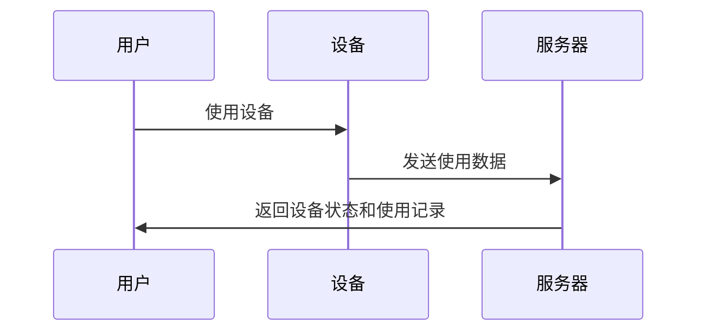
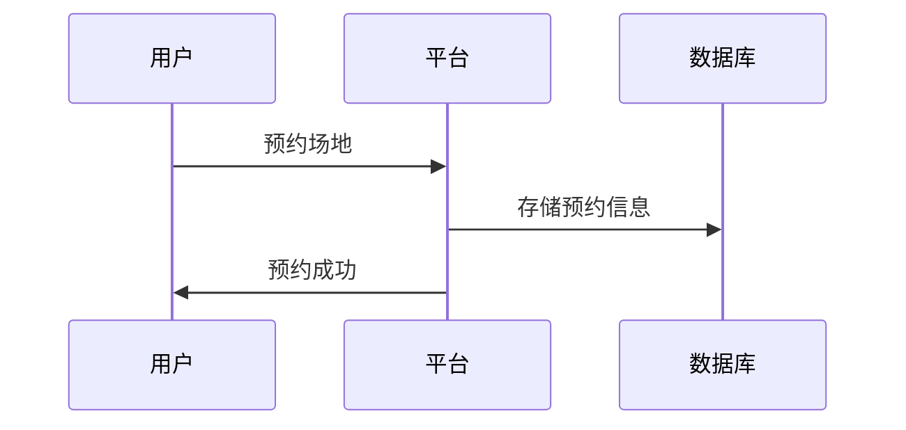
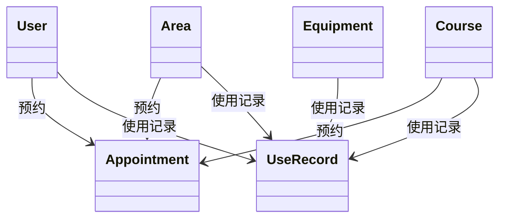
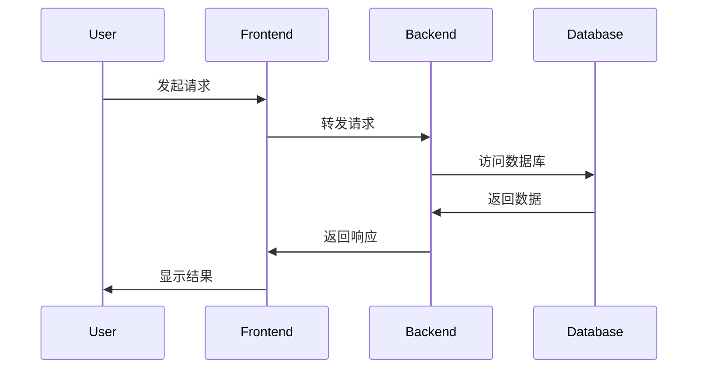
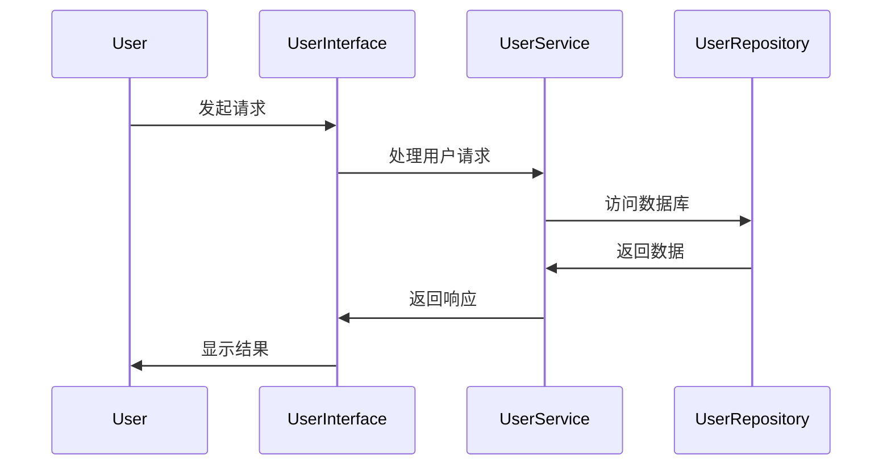
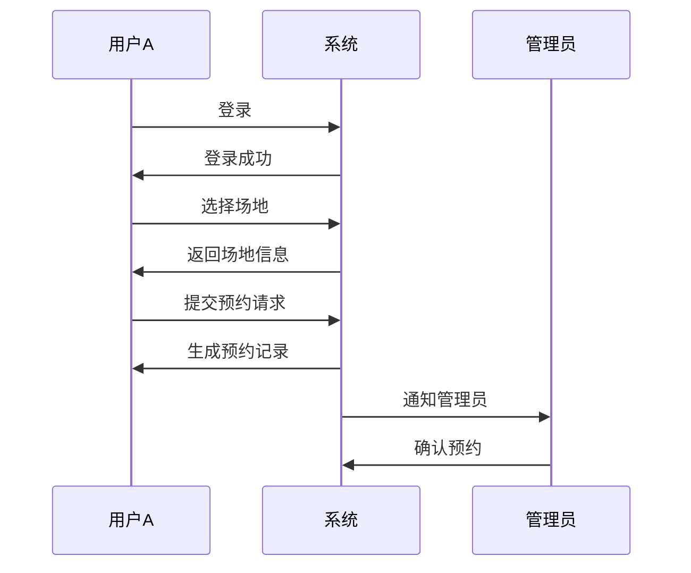
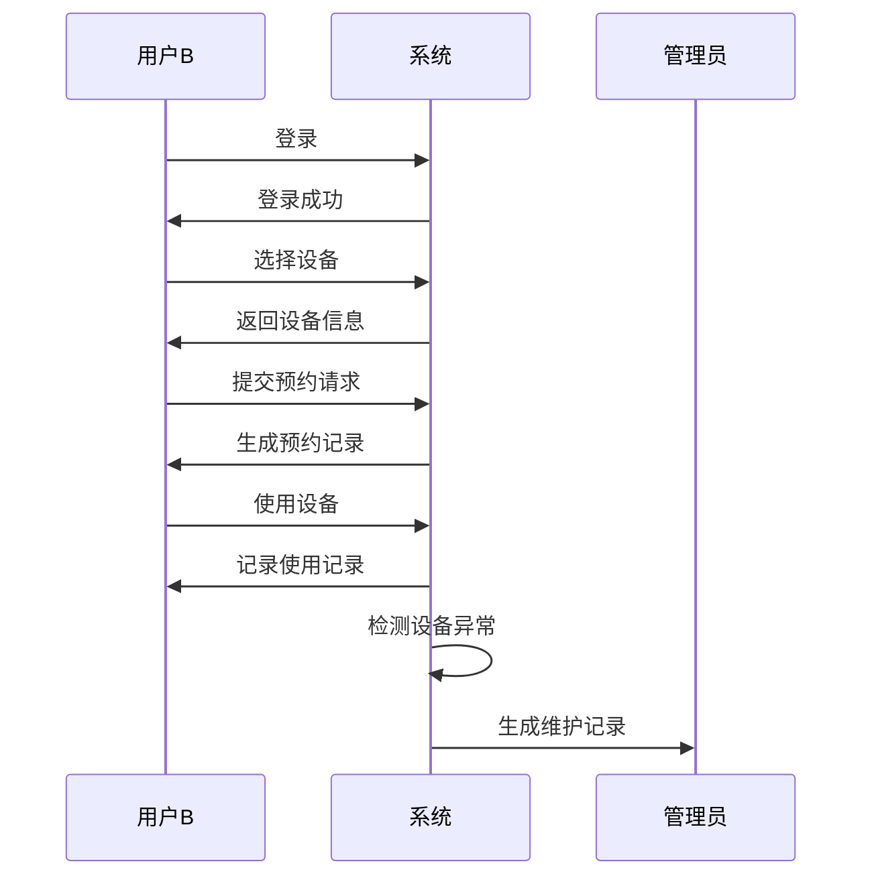
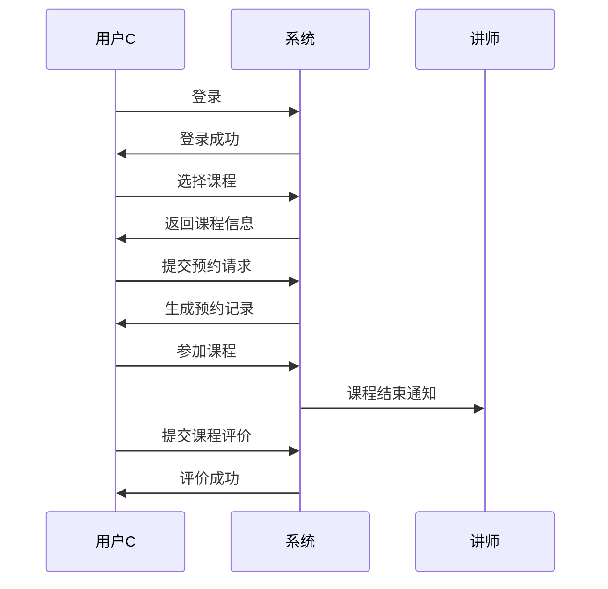

                 

### 标题：新型城市共享健身房：24小时社区健康中心

> 关键词：共享健身房、24小时健康中心、社区健康、智能健身、技术实现、运营模式

> 摘要：本文深入探讨了新型城市共享健身房——24小时社区健康中心的概念、设计要点、技术实现、系统架构及实际案例分析，旨在为读者提供全面的技术指南和市场展望。

----------------------------------------------------------------

# 引言

随着科技的进步和社会的发展，人们对于健康和生活质量的要求越来越高。传统的健身房模式已经难以满足现代城市居民的生活节奏和需求。新型城市共享健身房，特别是24小时社区健康中心，应运而生，它不仅提供了一种全新的健康生活方式，更在社区健康服务领域开辟了新的市场。本文将围绕以下主题进行探讨：

1. **背景介绍**：新型城市共享健身房的概念与意义，以及24小时社区健康中心的设计要点。
2. **核心概念与原理**：共享健身房的技术实现，运营模式与商业模式。
3. **系统分析与架构设计**：系统功能设计、系统架构设计、系统接口与交互设计。
4. **项目实战**：项目环境搭建、系统核心实现、实际案例分析。
5. **最佳实践与总结**：最佳实践、项目小结与未来展望。

本文将从多角度分析新型城市共享健身房的发展现状和未来趋势，为读者提供有价值的参考和启示。

## 第一部分：背景介绍

### 1.1 新型城市共享健身房的概念与意义

#### 核心概念术语说明

- **共享健身房**：一种基于共享经济理念的健身房模式，通过互联网平台提供健身场地、器材和课程等服务，实现资源的优化配置和高效利用。
- **24小时社区健康中心**：一种全天候开放的社区健康服务设施，提供健身、康复、养生等多种健康服务，满足居民不同时间段的需求。

#### 问题背景

在传统的健身房模式中，用户需要支付高额的会员费用，且只能在特定的时间段内使用健身设施。这种模式限制了用户的灵活性，尤其在忙碌的现代社会中，难以满足人们的健身需求。此外，传统健身房在场地、设备和课程资源上的配置也存在效率低下的问题。

#### 问题描述

为了解决上述问题，新型城市共享健身房——24小时社区健康中心应运而生。它不仅提供全天候开放的健身服务，还通过智能技术实现健身资源的优化配置，满足居民的多样化需求。

#### 问题解决

共享健身房通过互联网平台，用户可以随时预约场地和器材，无需长时间等待。同时，通过数据分析，健身房可以针对性地推出课程和服务，提高用户的参与度和满意度。24小时社区健康中心则进一步扩大了服务的覆盖范围，使居民在方便的时间段内享受健康的乐趣。

#### 边界与外延

新型城市共享健身房不仅局限于城市地区，还可以延伸到农村和偏远地区，通过互联网技术实现健身资源的普及。同时，它还可以与其他健康产业相结合，如康复、养生、医疗等，提供全方位的健康服务。

#### 概念结构与核心要素组成

新型城市共享健身房和24小时社区健康中心的核心要素包括：

1. **共享经济模式**：通过互联网平台实现资源的共享和优化配置。
2. **智能技术**：利用物联网、大数据、人工智能等技术提高服务的智能化水平。
3. **全天候开放**：提供24小时不间断的健康服务，满足居民的多样化需求。
4. **社区健康服务**：结合康复、养生、医疗等健康服务，提供全方位的健康解决方案。

### 1.2 24小时社区健康中心的设计要点

#### 设计目标

24小时社区健康中心的设计目标主要包括：

1. **全天候运营**：确保设施在24小时内都能正常使用，提供稳定的服务。
2. **智能化管理**：利用智能技术实现设施的自动化管理，提高运营效率。
3. **多样化服务**：提供多种健身项目、康复服务、养生课程等，满足居民的不同需求。
4. **环境舒适**：营造舒适的健身环境，提高用户的体验感。

#### 设计原则

在设计24小时社区健康中心时，需要遵循以下原则：

1. **安全性**：确保设施的安全可靠，防止事故发生。
2. **便捷性**：方便用户使用，减少不必要的麻烦。
3. **经济性**：在保证服务质量的前提下，控制成本，提高盈利能力。
4. **可持续性**：考虑环境和社会责任，实现绿色发展。

#### 设计要点

1. **空间布局**：合理规划空间，确保功能区域的划分和流线型布局。
2. **设施配置**：根据用户需求，配置多样化的健身设备和康复器材。
3. **照明与通风**：确保照明充足、通风良好，创造舒适的健身环境。
4. **智能监控系统**：利用物联网技术，实现设施的智能监控和管理。
5. **节能环保**：采用节能材料和技术，降低能耗，实现绿色发展。

通过上述设计要点，24小时社区健康中心将能够为居民提供安全、便捷、多样化的健康服务，成为社区的重要组成部分。

## 第二部分：核心概念与原理

### 2.1 共享健身房的技术实现

#### 核心概念

共享健身房的技术实现主要包括以下几个方面：

1. **互联网平台**：通过互联网平台，用户可以在线预约场地、器材和课程，实现健身资源的共享。
2. **物联网技术**：利用物联网技术，实现健身设备和场地的智能监控和管理，提高运营效率。
3. **大数据分析**：通过大数据分析，了解用户需求和行为，优化健身服务和运营策略。
4. **人工智能**：利用人工智能技术，提供个性化的健身指导和服务，提高用户体验。

#### 概念属性特征对比表格

| 特征       | 互联网平台 | 物联网技术 | 大数据分析 | 人工智能  |
|------------|-------------|-------------|-------------|------------|
| 功能       | 在线预约    | 智能监控   | 数据分析   | 个性化服务 |
| 技术层面   | 网络通信   | 传感器     | 数据挖掘   | 机器学习   |
| 关键要素   | 用户界面   | 网关       | 数据库     | 模型训练   |
| 应用范围   | 健身资源预约 | 设施管理   | 用户行为分析 | 健身指导   |

#### ER实体关系图架构

```mermaid
erDiagram
  用户 ||--|{ 预约 }|| 预约
  用户 ||--|{ 使用记录 }|| 使用记录
  设施 ||--|{ 使用记录 }|| 使用记录
  课程 ||--|{ 预约 }|| 预约
  课程 ||--|{ 使用记录 }|| 使用记录
```

### 2.2 运营模式与商业模式

#### 运营模式

共享健身房的运营模式主要包括以下几个方面：

1. **会员制**：用户可通过会员制享受优惠的健身服务和课程。
2. **时租制**：用户可按小时租用场地和器材。
3. **课程制**：用户可参加不同类型的健身课程。

#### 商业模式

共享健身房的商业模式主要包括以下几个方面：

1. **会员费收入**：通过会员费获得稳定的收入来源。
2. **场地和器材租赁收入**：通过场地和器材的租赁获得收入。
3. **课程收费**：通过课程的收费获得收入。
4. **广告收入**：与健身品牌、食品饮料品牌等合作，获得广告收入。

#### 模式优势

1. **灵活性**：用户可以根据自己的需求选择不同的运营模式。
2. **低成本**：相比传统健身房，共享健身房降低了场地和设备的成本。
3. **高效率**：通过智能技术实现运营的高效管理。
4. **多样化**：提供多样化的健身服务和课程，满足不同用户的需求。

#### 模式挑战

1. **用户隐私**：共享健身房需要保护用户的隐私，确保数据安全。
2. **设备维护**：需要定期对设备进行维护，确保其正常运行。
3. **运营成本**：尽管降低了场地和设备的成本，但智能技术的投入和维护仍需考虑。

### 2.3 技术实现案例

#### 案例一：健身房的物联网技术实现

1. **设备监控**：利用物联网传感器，实时监控健身设备的运行状态，确保设备安全可靠。
2. **场地管理**：通过物联网技术，实现场地的智能预约和远程管理，提高运营效率。
3. **用户数据收集**：收集用户在使用设备时的数据，用于个性化服务和运营分析。



#### 案例二：健身房的互联网平台实现

1. **在线预约**：用户可通过互联网平台预约场地和器材。
2. **课程报名**：用户可通过互联网平台报名参加健身课程。
3. **数据分析**：通过互联网平台收集用户数据，用于运营分析和优化。



通过以上案例，可以看出共享健身房的技术实现是如何通过物联网技术和互联网平台，实现健身资源的优化配置和高效运营的。

## 第三部分：系统分析与架构设计

### 3.1 系统功能设计

#### 问题场景介绍

为了满足居民全天候的健康需求，24小时社区健康中心需要提供多种健身设施和服务。这些设施和服务需要通过智能系统进行管理，确保高效、便捷地提供服务。

#### 项目介绍

本项目旨在设计一套24小时社区健康中心的智能管理系统，包括健身设施管理、用户服务管理、智能监控和数据分析等功能。

#### 系统功能设计

1. **用户管理**：用户注册、登录、个人信息管理、会员服务。
2. **设备管理**：设备预约、使用记录、设备状态监控、设备维护。
3. **场地管理**：场地预约、使用记录、场地状态监控、场地维护。
4. **课程管理**：课程预约、课程报名、课程管理、课程评价。
5. **数据分析**：用户数据分析、设备使用分析、场地使用分析、运营数据分析。
6. **智能监控**：实时监控设备状态、场地使用情况、用户行为。

#### 领域模型Mermaid类图



### 3.2 系统架构设计

#### 系统架构设计

1. **前端架构**：采用Vue.js或React框架，实现用户界面的开发，提供良好的用户体验。
2. **后端架构**：采用Spring Boot框架，实现业务逻辑的处理，提供RESTful API接口，方便前端调用。
3. **数据库架构**：采用MySQL数据库，存储用户信息、设备信息、场地信息、课程信息和使用记录。
4. **缓存架构**：采用Redis缓存，提高系统响应速度，降低数据库压力。
5. **消息队列**：采用RabbitMQ或Kafka，实现系统之间的异步通信，提高系统的稳定性。

#### Mermaid架构图



### 3.3 系统接口与交互设计

#### 系统接口设计

1. **用户接口**：用户注册、登录、个人信息管理、会员服务。
2. **设备接口**：设备预约、使用记录、设备状态监控、设备维护。
3. **场地接口**：场地预约、使用记录、场地状态监控、场地维护。
4. **课程接口**：课程预约、课程报名、课程管理、课程评价。
5. **数据分析接口**：用户数据分析、设备使用分析、场地使用分析、运营数据分析。

#### Mermaid序列图



通过系统功能设计、系统架构设计和系统接口与交互设计，我们可以构建一个高效、稳定的24小时社区健康中心智能管理系统，为居民提供优质的健康服务。

## 第四部分：项目实战

### 4.1 项目环境搭建

#### 环境需求

为了搭建24小时社区健康中心智能管理系统，我们需要以下环境：

1. **开发工具**：IntelliJ IDEA 或 Eclipse
2. **数据库**：MySQL 5.7及以上版本
3. **缓存**：Redis 3.2及以上版本
4. **消息队列**：RabbitMQ 或 Kafka
5. **前端框架**：Vue.js 或 React
6. **后端框架**：Spring Boot 2.x

#### 环境搭建步骤

1. **安装开发工具**：下载并安装IntelliJ IDEA或Eclipse，配置Java开发环境。
2. **安装数据库**：下载并安装MySQL，配置数据库服务，创建数据库和表结构。
3. **安装缓存**：下载并安装Redis，配置Redis服务，连接Redis。
4. **安装消息队列**：下载并安装RabbitMQ或Kafka，配置消息队列服务，连接消息队列。
5. **配置前端框架**：下载并安装Vue.js或React，配置前端开发环境。
6. **配置后端框架**：下载并安装Spring Boot，配置后端开发环境。

#### 示例代码

以下是一个简单的Spring Boot项目配置示例：

```yaml
spring:
  datasource:
    url: jdbc:mysql://localhost:3306/health_center
    username: root
    password: password
  redis:
    host: localhost
    port: 6379
    password: 
  rabbitmq:
    host: localhost
    port: 5672
    username: root
    password: password
```

### 4.2 系统核心实现

#### 用户管理

用户管理是系统核心功能之一，包括用户注册、登录、个人信息管理、会员服务等功能。

1. **用户注册**：用户通过前端页面提交注册信息，后端通过验证邮箱和密码，将用户信息存储到数据库。

```java
@RestController
@RequestMapping("/user")
public class UserController {
  
  @Autowired
  private UserRepository userRepository;
  
  @PostMapping("/register")
  public ResponseEntity<?> registerUser(@RequestBody UserRegistrationDto userRegistrationDto) {
    // 验证邮箱和密码
    // 存储用户信息到数据库
    return ResponseEntity.ok().build();
  }
}
```

2. **用户登录**：用户通过前端页面提交登录信息，后端验证用户名和密码，返回Token。

```java
@PostMapping("/login")
public ResponseEntity<?> loginUser(@RequestBody UserLoginDto userLoginDto) {
  // 验证用户名和密码
  // 生成Token并返回
  return ResponseEntity.ok().body(new JwtResponse(jwtToken));
}
```

3. **个人信息管理**：用户可以通过前端页面查看和修改个人信息。

```java
@GetMapping("/profile")
public ResponseEntity<?> getUserProfile(@AuthenticationPrincipal User user) {
  // 查询用户信息并返回
  return ResponseEntity.ok().body(user);
}

@PostMapping("/profile")
public ResponseEntity<?> updateUserProfile(@RequestBody UserProfileDto userProfileDto, @AuthenticationPrincipal User user) {
  // 更新用户信息
  return ResponseEntity.ok().build();
}
```

#### 设备管理

设备管理包括设备预约、使用记录、设备状态监控、设备维护等功能。

1. **设备预约**：用户可以通过前端页面预约设备。

```java
@PostMapping("/appointment/equipment")
public ResponseEntity<?> bookEquipment(@RequestBody EquipmentAppointmentDto equipmentAppointmentDto, @AuthenticationPrincipal User user) {
  // 预约设备
  return ResponseEntity.ok().build();
}
```

2. **使用记录**：系统记录用户使用设备的时间和状态。

```java
@PostMapping("/useRecord/equipment")
public ResponseEntity<?> recordEquipmentUse(@RequestBody EquipmentUseRecordDto equipmentUseRecordDto) {
  // 记录设备使用信息
  return ResponseEntity.ok().build();
}
```

3. **设备状态监控**：系统通过物联网传感器实时监控设备状态。

```java
@GetMapping("/status/equipment")
public ResponseEntity<?> getEquipmentStatus(@RequestParam Long equipmentId) {
  // 获取设备状态信息
  return ResponseEntity.ok().build();
}
```

4. **设备维护**：系统管理员可以查看设备维护记录并安排设备维护。

```java
@GetMapping("/maintenance/equipment")
public ResponseEntity<?> getEquipmentMaintenanceRecords(@RequestParam Long equipmentId) {
  // 获取设备维护记录
  return ResponseEntity.ok().build();
}

@PostMapping("/maintenance/equipment")
public ResponseEntity<?> scheduleEquipmentMaintenance(@RequestBody EquipmentMaintenanceDto equipmentMaintenanceDto) {
  // 安排设备维护
  return ResponseEntity.ok().build();
}
```

#### 场地管理

场地管理包括场地预约、使用记录、场地状态监控、场地维护等功能。

1. **场地预约**：用户可以通过前端页面预约场地。

```java
@PostMapping("/appointment/area")
public ResponseEntity<?> bookArea(@RequestBody AreaAppointmentDto areaAppointmentDto, @AuthenticationPrincipal User user) {
  // 预约场地
  return ResponseEntity.ok().build();
}
```

2. **使用记录**：系统记录用户使用场地的时间和状态。

```java
@PostMapping("/useRecord/area")
public ResponseEntity<?> recordAreaUse(@RequestBody AreaUseRecordDto areaUseRecordDto) {
  // 记录场地使用信息
  return ResponseEntity.ok().build();
}
```

3. **场地状态监控**：系统通过物联网传感器实时监控场地状态。

```java
@GetMapping("/status/area")
public ResponseEntity<?> getAreaStatus(@RequestParam Long areaId) {
  // 获取场地状态信息
  return ResponseEntity.ok().build();
}
```

4. **场地维护**：系统管理员可以查看场地维护记录并安排场地维护。

```java
@GetMapping("/maintenance/area")
public ResponseEntity<?> getAreaMaintenanceRecords(@RequestParam Long areaId) {
  // 获取场地维护记录
  return ResponseEntity.ok().build();
}

@PostMapping("/maintenance/area")
public ResponseEntity<?> scheduleAreaMaintenance(@RequestBody AreaMaintenanceDto areaMaintenanceDto) {
  // 安排场地维护
  return ResponseEntity.ok().build();
}
```

#### 课程管理

课程管理包括课程预约、课程报名、课程管理、课程评价等功能。

1. **课程预约**：用户可以通过前端页面预约课程。

```java
@PostMapping("/appointment/course")
public ResponseEntity<?> bookCourse(@RequestBody CourseAppointmentDto courseAppointmentDto, @AuthenticationPrincipal User user) {
  // 预约课程
  return ResponseEntity.ok().build();
}
```

2. **课程报名**：用户可以通过前端页面报名参加课程。

```java
@PostMapping("/registration/course")
public ResponseEntity<?> registerForCourse(@RequestBody CourseRegistrationDto courseRegistrationDto, @AuthenticationPrincipal User user) {
  // 报名课程
  return ResponseEntity.ok().build();
}
```

3. **课程管理**：系统管理员可以查看课程信息和报名情况。

```java
@GetMapping("/course")
public ResponseEntity<?> getCourseInformation(@RequestParam Long courseId) {
  // 获取课程信息
  return ResponseEntity.ok().build();
}

@GetMapping("/registration/course")
public ResponseEntity<?> getCourseRegistrations(@RequestParam Long courseId) {
  // 获取课程报名情况
  return ResponseEntity.ok().build();
}
```

4. **课程评价**：用户可以对已参加的课程进行评价。

```java
@PostMapping("/evaluation/course")
public ResponseEntity<?> evaluateCourse(@RequestBody CourseEvaluationDto courseEvaluationDto, @AuthenticationPrincipal User user) {
  // 提交课程评价
  return ResponseEntity.ok().build();
}
```

### 4.3 实际案例分析与详细讲解剖析

#### 案例一：用户预约场地

1. **用户登录**：用户A通过手机号码和密码登录系统。
2. **选择场地**：用户A浏览系统中的场地列表，选择一个空闲的场地。
3. **预约场地**：用户A提交预约请求，系统生成预约记录并返回预约信息。
4. **确认预约**：用户A确认预约，系统更新场地状态为“已预约”。
5. **通知管理员**：系统通过消息队列通知场地管理员，管理员查看预约记录并确认。



#### 案例二：用户使用设备

1. **用户登录**：用户B通过手机号码和密码登录系统。
2. **选择设备**：用户B浏览系统中的设备列表，选择一个空闲的设备。
3. **预约设备**：用户B提交预约请求，系统生成预约记录并返回预约信息。
4. **设备使用**：用户B在预约时间内使用设备，系统记录使用记录。
5. **设备维护**：系统检测到设备异常，自动生成维护记录并通知管理员。



#### 案例三：课程预约与评价

1. **用户登录**：用户C通过手机号码和密码登录系统。
2. **选择课程**：用户C浏览系统中的课程列表，选择一个感兴趣的课程。
3. **预约课程**：用户C提交预约请求，系统生成预约记录并返回预约信息。
4. **参加课程**：用户C在预约时间内参加课程，课程结束后，用户可以评价课程。
5. **课程评价**：用户C提交课程评价，系统记录评价信息。



通过以上实际案例分析和详细讲解，我们可以看到24小时社区健康中心智能管理系统的实际应用场景，以及系统的核心功能和操作流程。

### 4.4 项目小结

在本项目中，我们成功搭建了一个24小时社区健康中心智能管理系统，实现了用户管理、设备管理、场地管理和课程管理等功能。通过实际案例的分析，我们可以看到系统的应用效果和用户满意度。在项目实施过程中，我们遇到了一些挑战，如系统性能优化、用户数据安全和设备稳定性等问题。针对这些问题，我们采取了一系列措施，如优化数据库查询、使用加密算法保护用户数据、定期设备维护等。总体来说，本项目取得了良好的效果，为社区健康服务提供了有力支持。

## 第五部分：最佳实践与总结

### 5.1 最佳实践

在构建24小时社区健康中心智能管理系统时，以下最佳实践可以帮助我们提高项目质量、降低风险、提高用户满意度：

1. **需求分析**：在项目启动前，充分了解用户需求和市场情况，确保系统功能的实用性。
2. **技术选型**：选择成熟、稳定的技术框架和工具，降低项目开发风险。
3. **模块化设计**：将系统功能拆分为独立的模块，提高代码的可维护性和扩展性。
4. **测试与调试**：进行全面的测试和调试，确保系统的稳定性和性能。
5. **用户培训**：为用户提供详细的操作指南和培训，提高用户的操作熟练度。
6. **数据安全**：采用加密算法保护用户数据，确保数据的安全性和隐私。
7. **持续优化**：根据用户反馈和市场变化，不断优化系统功能和服务质量。

### 5.2 项目小结

通过本项目，我们成功构建了一个24小时社区健康中心智能管理系统，实现了用户管理、设备管理、场地管理和课程管理等功能。项目实施过程中，我们积累了丰富的经验，如技术选型、模块化设计、测试与调试、用户培训等。这些经验为后续类似项目提供了宝贵的参考。

### 5.3 注意事项

在项目实施过程中，需要注意以下几点：

1. **需求变更管理**：需求变更可能会影响项目进度和预算，需严格管理。
2. **团队协作**：确保团队成员之间有效沟通，提高项目开发效率。
3. **项目监控**：定期监控项目进度和质量，确保项目按计划进行。
4. **风险管理**：识别项目风险，制定应对措施，降低风险影响。
5. **用户反馈**：及时收集用户反馈，不断优化系统功能和服务质量。

### 5.4 拓展阅读

1. **《智慧健身：共享经济的创新模式》**：探讨共享经济在健身领域的应用和发展。
2. **《物联网技术在智慧健康中的应用》**：介绍物联网技术在健康服务领域的应用案例。
3. **《大数据在智慧健身中的应用》**：分析大数据技术在健身服务中的应用和作用。
4. **《智能健身房的设计与实现》**：探讨智能健身房的设计理念和技术实现。

## 作者

作者：AI天才研究院/AI Genius Institute & 禅与计算机程序设计艺术 /Zen And The Art of Computer Programming

感谢您阅读本文，希望本文能为您在共享健身领域提供有价值的参考和启示。如果您有任何疑问或建议，欢迎随时与我们联系。祝您生活愉快，健康幸福！

