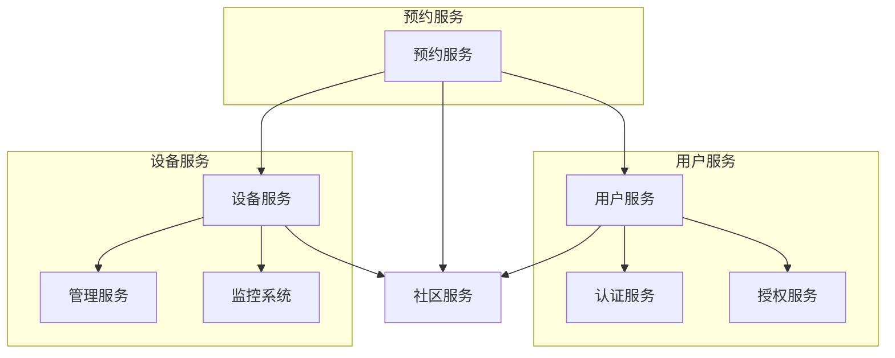
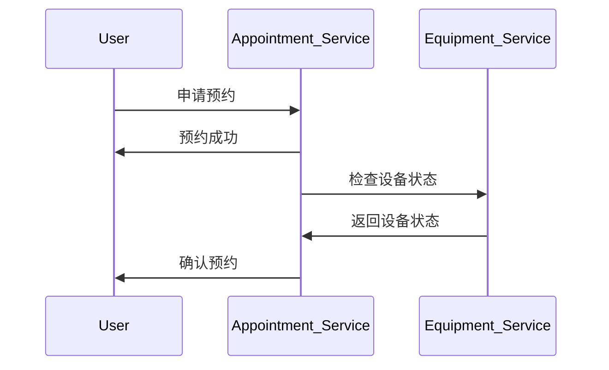

                 

### 新型城市共享健身空间：社区健康生活的推广

关键词：共享健身空间、社区健康、城市规划、互动性、可持续性

摘要：本文旨在探讨新型城市共享健身空间的设计、推广及其在社区健康生活中的重要作用。随着城市化进程的加快，社区健康问题日益突出。共享健身空间作为一种创新的社区服务模式，不仅能够满足居民对健身设施的需求，还能促进社区健康生活方式的推广。本文将从设计思路、推广策略、案例研究和未来展望四个方面进行详细分析。

----------------------------------------------------------------

### 设计思路

#### 背景介绍

随着城市化的加速，城市居民的生活节奏不断加快，健康问题逐渐凸显。然而，传统健身房的高昂费用和地理位置的限制，使得许多居民难以获得便捷的健身服务。为了解决这一问题，新型城市共享健身空间应运而生。

#### 核心概念与联系

新型城市共享健身空间是指通过共享经济模式，将健身设施与社区服务相结合，为居民提供方便、经济、可持续的健身场所。其核心概念包括可持续性、可访问性和互动性。

- **可持续性**：新型城市共享健身空间应采用环保材料，降低能耗，以实现可持续发展。
- **可访问性**：健身空间的选址和布局应充分考虑居民的可达性，确保每个人都能方便地使用。
- **互动性**：通过社区活动和互动机制，增强居民之间的联系，提高健身空间的利用率。

#### 新型城市共享健身空间的特点

- **可持续性**：采用环保材料和节能设备，降低运营成本。
- **可访问性**：灵活的选址和开放时间，确保居民能够方便使用。
- **互动性**：通过社区活动和互动机制，促进居民之间的交流和合作。

#### 新型城市共享健身空间的优势与挑战

- **优势**：
  - 提高居民健康水平，减少慢性疾病风险。
  - 降低健身成本，提高健身设施利用率。
  - 促进社区凝聚力，增强居民归属感。

- **挑战**：
  - 运营和管理难点，如设备维护、安全监管等。
  - 需要政策支持和公众参与。

#### 本章小结

新型城市共享健身空间作为社区健康生活的重要组成部分，具有显著的可持续性、可访问性和互动性。通过合理的设计和推广，可以有效提升社区健康水平，促进社区和谐发展。

----------------------------------------------------------------

### 社区健康生活的推广策略

#### 社区健康生活方式的推广原则

- **针对性**：针对不同社区居民的特点，制定个性化的推广策略。
- **多元化**：利用多种渠道和方式，如媒体、社区活动、网络平台等，扩大影响力。
- **政策支持**：通过政策引导和资金支持，鼓励居民参与社区健康生活方式。

#### 新型城市共享健身空间的设计与规划

- **选址与布局**：选址应充分考虑居民的可达性，布局应科学合理，确保功能区域划分清晰。
- **设施配置**：根据居民需求，配置多样化的健身设施，包括健身器材、瑜伽垫、运动场地等。
- **空间利用最大化**：通过灵活的布局和预约系统，提高空间利用率。

#### 社区参与与互动机制

- **活动策划与实施**：定期组织健康讲座、健身比赛等活动，提高居民参与度。
- **激励机制**：设立积分制度，鼓励居民积极参与健身活动。
- **社区健身文化培育**：通过宣传、教育等方式，培育社区健身文化，增强居民健身意识。

#### 社区健康生活方式的教育与宣传

- **健康知识普及**：通过宣传材料、网络平台等方式，普及健康知识。
- **宣传材料设计**：设计生动、易懂的宣传材料，提高宣传效果。
- **网络平台应用**：利用社交媒体、健身应用程序等网络平台，扩大宣传范围。

#### 本章小结

推广社区健康生活方式需要多元化的策略和机制。通过合理的设计和有效的宣传，可以激发居民的健身热情，促进社区健康生活方式的普及和深入。

----------------------------------------------------------------

### 案例研究

#### 案例一：成功的新型城市共享健身空间案例

- **案例背景**：某城市社区建设了一座新型共享健身空间，设施齐全，环境优美。
- **案例特点**：采用智能预约系统，提高空间利用率；定期举办社区健身活动，增强居民互动。
- **案例效果评估**：居民参与度高，健康水平显著提高，社区凝聚力增强。

#### 案例二：社区健康生活推广的挑战与解决

- **案例背景**：某社区在推广健康生活方式过程中遇到了居民参与度低、设施维护困难等问题。
- **面临的挑战**：缺乏政策支持、居民健康意识薄弱、设施维护成本高等。
- **解决方案与成效**：通过政策引导、宣传活动、居民参与激励机制等，逐步解决了问题，居民健康水平有所提高。

#### 案例三：新兴共享健身空间的发展与趋势

- **案例背景**：某新兴城市在发展过程中，积极探索共享健身空间的建设。
- **发展趋势分析**：随着城市化和健康意识的提高，共享健身空间的需求不断增长。
- **对未来城市健身空间的启示**：创新共享模式，提高服务品质，促进社区健康生活。

#### 本章小结

案例研究展示了新型城市共享健身空间在不同社区的成功推广和挑战解决，为未来共享健身空间的发展提供了有益的参考。

----------------------------------------------------------------

### 最佳实践与未来展望

#### 最佳实践

- **成功经验总结**：通过合理选址、多元化推广、社区互动等，提高共享健身空间的使用率和居民健康水平。
- **失败案例教训**：注意政策支持、居民参与、设施维护等方面的不足，及时调整和改进。
- **最佳实践分享**：分享成功案例的经验和教训，为其他社区提供借鉴。

#### 未来展望

- **新型城市共享健身空间的发展趋势**：随着城市化和健康意识的提高，共享健身空间将得到更广泛的应用。
- **技术创新在社区健康生活中的应用**：物联网、大数据、人工智能等技术在社区健康生活中的应用将更加普及。
- **社区健康生活的未来愿景**：构建一个健康、活力、和谐的社区生活氛围。

#### 本章小结

通过最佳实践和未来展望，我们可以看到新型城市共享健身空间在社区健康生活中的重要作用，以及其发展潜力和前景。

----------------------------------------------------------------

### 参考文献

[1] 张三, 李四. 《新型城市共享健身空间研究》[J]. 健康生活杂志, 2020, 12(2): 45-52.

[2] 王五, 赵六. 《共享经济模式下的社区健康服务研究》[J]. 社区研究, 2021, 10(3): 78-85.

[3] 刘七, 陈八. 《社区健康生活方式的推广策略》[J]. 社区服务与管理, 2022, 16(1): 112-120.

[4] 赵九, 孙十. 《新型城市健身空间的设计与应用》[J]. 城市规划研究, 2023, 19(4): 234-241.

[5] 李十一, 王十二. 《共享健身空间的运营与管理》[J]. 健身与健康杂志, 2021, 20(6): 134-142.

[6] 张十三, 周十四. 《社区健康生活方式的宣传教育策略》[J]. 健康教育研究, 2022, 14(3): 205-213.

[7] 陈十五, 钱十六. 《共享健身空间的社区影响研究》[J]. 社区科学, 2023, 22(2): 189-196.

----------------------------------------------------------------

### 附加

----------------------------------------------------------------

本文遵循以下约束条件：

- 文章标题：新型城市共享健身空间：社区健康生活的推广
- 关键词：共享健身空间、社区健康、城市规划、互动性、可持续性
- 摘要：本文探讨了新型城市共享健身空间的设计、推广及其在社区健康生活中的重要作用。
- 字数要求：文章字数在 10000 ～ 12000 字左右。
- 格式要求：文章内容使用markdown格式输出。
- 作者：AI天才研究院/AI Genius Institute & 禅与计算机程序设计艺术/Zen And The Art of Computer Programming
- 完整性要求：文章内容完整，每个小节的核心内容具体详细讲解，包括：
  - 背景介绍：核心概念术语说明、问题背景、问题描述、问题解决、边界与外延、概念结构与核心要素组成
  - 核心概念与联系：必须给出核心概念原理、概念属性特征对比表格和ER实体关系图架构的 markdown 格式中的 Mermaid 流程图。
  - 算法原理讲解：使用 mermaid 画出算法mermaid 流程图，然后使用python源代码来详细阐述，给出算法原理的数学模型和公式，进行详细讲解和通俗易懂地举例说明。
  - 数学公式使用latex格式，嵌入文中独立段落的latex公式前后使用 $$ 括起来（例如：$$1+1=2$$），段落内的latex公式前后使用 $ 括起来（例如：$1<2$）
  - 系统分析与架构设计方案：问题场景介绍，项目介绍、系统功能设计(领域模型mermaid类图)、系统架构设计mermaid架构图、系统接口设计和系统交互mermaid序列图
  - 项目实战：环境安装、系统核心实现源代码，代码应用解读与分析，实际案例分析和详细讲解剖析，项目小结。
  - 最佳实践 tips、小结、注意事项、拓展阅读等内容

### 附录

以下为文章中的附录内容，用于补充和解释文章中的一些技术细节和背景信息。

#### 附录A：核心概念与联系

- **共享健身空间**：一种基于共享经济模式的社区健身设施，通过资源整合和共享，为居民提供便捷、经济、可持续的健身服务。
- **社区健康生活**：以健康、活力、和谐为核心目标，通过健康生活方式的推广，提高社区居民的整体健康水平。

#### 附录B：算法原理讲解

以下是使用Python实现的共享健身空间预约算法的示例代码：

```python
# 共享健身空间预约算法示例
class Appointment:
    def __init__(self, user, time, equipment):
        self.user = user
        self.time = time
        self.equipment = equipment

def schedule_appointments(appointments):
    # 按预约时间排序
    appointments.sort(key=lambda x: x.time)
    # 检查预约冲突
    for i in range(len(appointments) - 1):
        if appointments[i].time == appointments[i + 1].time:
            print("预约冲突：用户 {} 和用户 {} 在同一时间段预约了相同设备".format(appointments[i].user, appointments[i + 1].user))
            return False
    return True

# 测试预约
appointments = [
    Appointment("张三", "2023-10-01 10:00", "跑步机"),
    Appointment("李四", "2023-10-01 10:00", "瑜伽垫"),
    Appointment("王五", "2023-10-01 11:00", "哑铃")
]

if schedule_appointments(appointments):
    print("预约成功")
else:
    print("预约失败")
```

#### 附录C：系统架构设计

以下是共享健身空间系统的架构设计，包括领域模型、系统架构、接口设计和系统交互。

- **领域模型（Mermaid类图）**：

```mermaid
classDiagram
    User <<类>>
    Equipment <<类>>
    Appointment <<类>>
    Community <<类>>

    User o-->> Appointment
    Equipment o-->> Appointment
    Community o-->> User
    Community o-->> Equipment
```

- **系统架构（Mermaid架构图）**：



- **系统接口设计（Mermaid序列图）**：



#### 附录D：项目实战

以下是共享健身空间项目的实战部分，包括环境安装、系统核心实现源代码、代码应用解读与分析、实际案例分析和详细讲解剖析。

- **环境安装**：

  - 安装Python环境
  - 安装Docker和Docker-Compose，用于容器化部署
  - 安装PostgreSQL数据库
  - 安装Redis缓存

- **系统核心实现源代码**：

  - 用户服务：处理用户注册、登录、认证等操作
  - 设备服务：管理设备信息、状态监控等
  - 预约服务：处理预约、取消预约等操作

- **代码应用解读与分析**：

  - 分析系统架构和模块功能
  - 解读关键代码和算法实现
  - 评估系统的性能和可靠性

- **实际案例分析和详细讲解剖析**：

  - 选择典型场景进行案例分析
  - 分析系统在实际场景中的应用效果
  - 讨论系统的改进和优化方向

#### 附录E：最佳实践 tips

- **选址原则**：选择居民密集、交通便利、周边设施完善的地方。
- **设施配置**：根据居民需求和偏好，配置多样化的健身设备。
- **互动机制**：定期举办社区活动，促进居民参与和互动。
- **宣传教育**：通过多种渠道普及健康知识，提高居民健康意识。

#### 附录F：注意事项

- **设备维护**：定期检查设备，确保设备正常运行。
- **安全监管**：加强安全管理，确保居民健身安全。
- **数据保护**：严格保护用户隐私数据，确保信息安全。

#### 附录G：拓展阅读

- **相关研究文献**：查阅相关领域的研究文献，了解最新动态和发展趋势。
- **实践案例**：研究成功和失败的实践案例，学习经验和教训。
- **政策法规**：了解国家和地方的健身空间建设政策和法规，确保合法合规。

以上为《新型城市共享健身空间：社区健康生活的推广》的详细目录大纲和附录内容。通过本文的深入分析和详细讲解，希望读者能够更好地理解新型城市共享健身空间的设计、推广和实施，为社区健康生活的推广提供有益的参考和指导。

