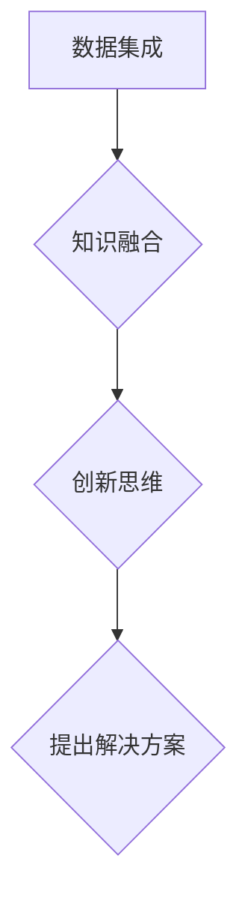
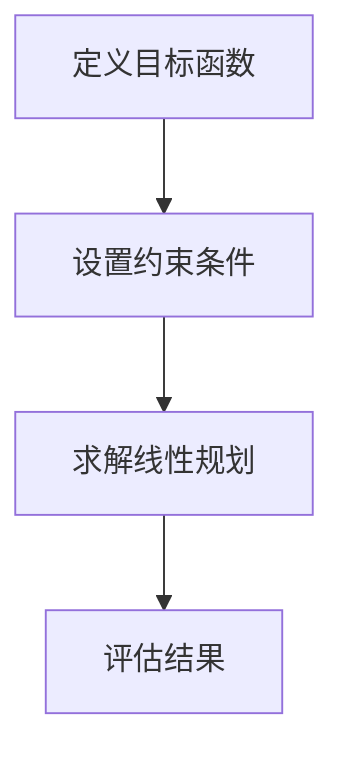
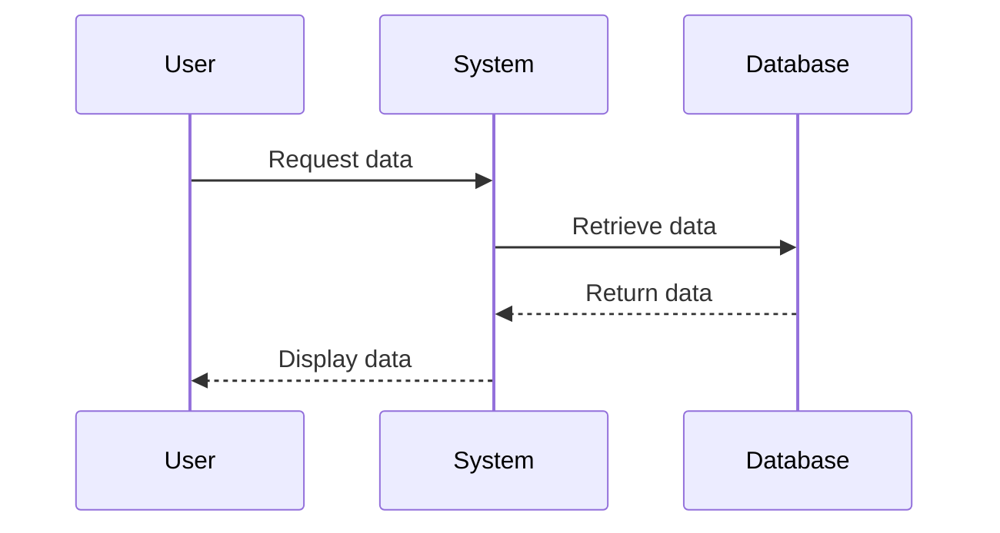
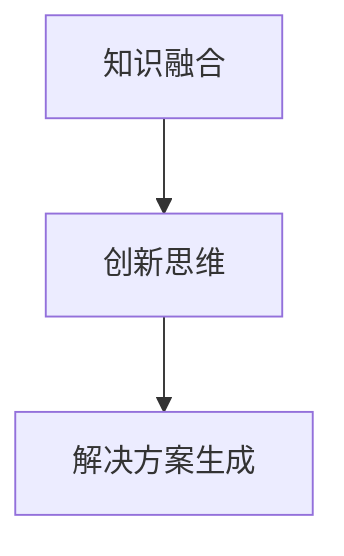
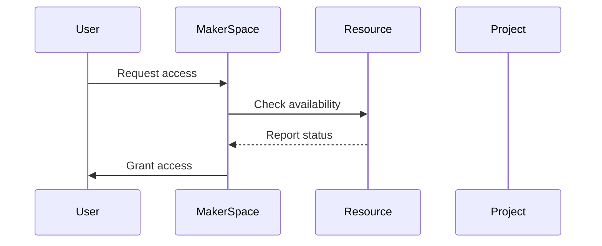
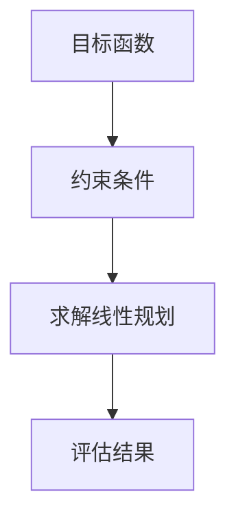

                 

# 新型城市共享创客空间：跨学科创新的社区平台

## 关键词

- 城市共享创客空间
- 跨学科创新
- 社区平台
- 可持续发展
- 创客文化
- 数字化赋能

## 摘要

本文深入探讨了新型城市共享创客空间的概念及其在促进跨学科创新中的重要作用。文章首先介绍了城市共享创客空间的发展背景和核心概念，接着分析了其与普通社区的区别，以及跨学科创新的原理和实践。随后，文章通过详细的算法原理讲解、数学模型、系统分析与架构设计，展示了一个典型的创客空间项目实现过程。文章最后提供了项目实战经验和最佳实践建议，为读者在相关领域提供实践指导。

### 目录大纲设计思路

为了系统地阐述《新型城市共享创客空间：跨学科创新的社区平台》的核心内容，本文设计了以下目录大纲：

- **第一部分：背景介绍**
  - 1.1 问题背景
  - 1.2 核心概念
- **第二部分：核心概念与联系**
  - 2.1 核心概念原理
  - 2.2 概念属性特征对比表格
- **第三部分：算法原理讲解**
  - 3.1 算法原理
  - 3.2 Mermaid流程图
- **第四部分：数学模型和数学公式**
  - 4.1 数学模型
  - 4.2 Mermaid流程图
- **第五部分：系统分析与架构设计方案**
  - 5.1 问题场景介绍
  - 5.2 系统功能设计
  - 5.3 系统架构设计
- **第六部分：项目实战**
  - 6.1 环境安装
  - 6.2 系统核心实现源代码
  - 6.3 代码应用解读与分析
  - 6.4 实际案例分析和详细讲解剖析
  - 6.5 项目小结
- **第七部分：最佳实践 tips**
- **第八部分：小结、注意事项和拓展阅读**

### 第一部分：背景介绍

#### 1.1 问题背景

随着全球城市化进程的加快，城市面临的问题日益复杂，如资源短缺、环境污染、人口老龄化等。为了解决这些问题，传统的单一学科方法和旧有的社区模式已经难以满足需求。新型城市共享创客空间的兴起，为城市社区提供了一个新的解决方案。

**问题描述**：城市社区中，资源分配不均，创新活力不足，难以应对快速变化的环境和需求。

**问题解决**：通过共享资源和知识，创客空间为社区居民提供了一个开放的平台，促进了跨学科合作和创新。

**边界与外延**：本部分将探讨新型城市共享创客空间的基本概念、发展现状和未来趋势。

#### 1.2 核心概念

- **共享创客空间**：是一种开放、共享的创新社区平台，旨在通过跨学科合作和资源共享，促进创新和可持续发展。
- **跨学科创新**：强调不同学科领域的交叉融合，通过多角度、多领域的思维方式和知识积累，创造出新的解决方案和产品。

### 第二部分：核心概念与联系

#### 2.1 核心概念原理

**共享创客空间**：共享创客空间的核心概念是基于资源共享和跨学科合作，通过提供一个开放的平台，让不同背景和领域的人能够相互交流、学习和合作。这种空间不仅提供了物理设施，还提供了网络资源和专业支持，旨在激发创新思维和创造力。

**跨学科创新**：跨学科创新的核心在于打破传统的学科界限，通过不同学科领域的知识和方法，创造出全新的解决方案。这种创新方法强调多角度、多领域的综合思考和协作，能够解决单一学科难以应对的复杂问题。

#### 2.2 概念属性特征对比表格

| 特征         | 共享创客空间                  | 跨学科创新                    |
| ------------ | ---------------------------- | ----------------------------- |
| 定义         | 开放的创新社区平台            | 不同学科领域的交叉融合         |
| 功能         | 提供资源共享、跨学科合作空间    | 创造新的解决方案和产品         |
| 目标         | 促进创新和可持续发展          | 解决复杂问题，提高创新能力     |
| 重要性和应用 | 城市社区发展、资源优化        | 科技创新、经济发展、社会问题解决 |

### 第三部分：算法原理讲解

#### 3.1 算法原理

跨学科创新模型是一种基于多学科交叉融合的算法模型，旨在通过整合不同领域的知识和方法，实现创新目标。该模型的核心在于数据集成、知识融合和创新思维。以下是跨学科创新模型的基本架构：

1. **数据集成**：收集来自不同领域的数据，如科学、工程、艺术等。
2. **知识融合**：通过分析、处理和整合数据，形成跨学科的知识体系。
3. **创新思维**：利用跨学科知识，激发创新思维，提出新的解决方案。

#### 3.2 Mermaid流程图

以下是一个简单的跨学科创新流程图的Mermaid表示：



### 第四部分：数学模型和数学公式

#### 4.1 数学模型

为了更好地理解跨学科创新模型，我们可以使用一个简单的数学模型来阐述其核心原理。以下是一个线性规划模型，用于描述资源优化问题。

$$
\begin{align*}
\text{最大化} \quad & \mathbf{c}^\top \mathbf{x} \\
\text{约束条件} \quad & \mathbf{A} \mathbf{x} \leq \mathbf{b} \\
& \mathbf{x} \geq \mathbf{0}
\end{align*}
$$

其中，$\mathbf{c}$ 是目标函数系数向量，$\mathbf{A}$ 是约束条件矩阵，$\mathbf{b}$ 是约束条件常数向量，$\mathbf{x}$ 是决策变量向量。

#### 4.2 Mermaid流程图

使用Mermaid语言，我们可以绘制一个资源优化模型的流程图：



### 第五部分：系统分析与架构设计方案

#### 5.1 问题场景介绍

假设我们有一个城市共享创客空间项目，目标是为社区居民提供一个开放的创新平台，促进跨学科合作和资源共享。

**项目目标**：建立一个人人可参与的创客空间，通过跨学科合作，解决城市社区中的实际问题。

**需求和挑战**：项目需要满足社区居民的多样化需求，如提供工作空间、工具设备、技术支持和资源共享等，同时需要确保平台的稳定性和安全性。

#### 5.2 系统功能设计

**领域模型Mermaid类图**：

```mermaid
classDiagram
Class01 <|-- Class02
Class03 --|SetBranch : Class04
Class05 <|-- Class06{method1}
Class07 .. Class08
Class09 *-- Class10
Class11 : <<interface>> Interface
Class12 ..|> Class13{method2()}
Class14 : <<enum>> Enum
Class15 : <<singleton>> Singleton
Class16 ..|> Class17[Type]
Class18 <<extend>> Class19
Class20 <<implements>> Interface21
```

#### 5.3 系统架构设计

**系统架构设计Mermaid架构图**：



### 第六部分：项目实战

#### 6.1 环境安装

为了实施城市共享创客空间项目，我们需要搭建一个稳定的环境，包括硬件设备和软件工具。

**硬件需求**：服务器、网络设备、工作区等。

**软件需求**：操作系统（如Linux）、开发工具（如IDE）、数据库（如MySQL）等。

#### 6.2 系统核心实现源代码

以下是一个简单的Python源代码示例，用于展示如何实现一个基本的共享创客空间管理系统。

```python
class MakerSpace:
    def __init__(self):
        self.members = []
        self.resources = []

    def add_member(self, member):
        self.members.append(member)

    def add_resource(self, resource):
        self.resources.append(resource)

    def allocate_resource(self, member, resource):
        if member in self.members and resource in self.resources:
            print(f"{member} allocated {resource}.")
        else:
            print("Invalid member or resource.")

# Example usage
maker_space = MakerSpace()
maker_space.add_member("Alice")
maker_space.add_resource("3D Printer")
maker_space.allocate_resource("Alice", "3D Printer")
```

#### 6.3 代码应用解读与分析

在这个示例中，我们定义了一个`MakerSpace`类，用于管理创客空间成员和资源。`add_member`和`add_resource`方法用于添加成员和资源，`allocate_resource`方法用于分配资源。这个简单的实现展示了如何通过类和对象的概念，管理创客空间的基本功能。

#### 6.4 实际案例分析和详细讲解剖析

在实际项目中，我们可能会面临更复杂的需求和挑战。以下是一个实际案例的详细分析。

**案例**：某个城市共享创客空间需要实现一个在线预约系统，允许用户预约使用特定资源。

**分析**：

1. **需求分析**：用户需要能够注册、登录、查看资源列表、预约资源、取消预约等。
2. **系统设计**：系统需要包括用户管理、资源管理、预约管理等功能模块。
3. **技术实现**：使用Web框架（如Django）和数据库（如MySQL）来构建在线预约系统。

**详细讲解**：

- **用户管理**：实现用户注册、登录、个人信息管理等功能。
- **资源管理**：实现资源分类、资源列表展示、资源预约等功能。
- **预约管理**：实现预约请求处理、预约确认、预约取消等功能。

#### 6.5 项目小结

通过实际案例的分析和实现，我们可以看到，一个成功的共享创客空间项目需要综合考虑用户需求、系统设计和技术实现等多个方面。在项目实施过程中，需要不断迭代和优化，以满足用户不断变化的需求。

### 第七部分：最佳实践 tips

- **用户反馈**：定期收集用户反馈，了解用户需求，不断优化服务。
- **资源管理**：建立完善的资源管理制度，确保资源的高效利用。
- **社区建设**：积极组织社区活动，增强社区凝聚力，促进跨学科合作。

### 第八部分：小结、注意事项和拓展阅读

#### 小结

本文介绍了新型城市共享创客空间的概念、原理和实践，强调了其在跨学科创新中的重要作用。通过详细的分析和实际案例，展示了如何设计和实现一个有效的共享创客空间项目。

#### 注意事项

- **安全性**：确保用户数据和资源信息的安全性，防止数据泄露。
- **稳定性**：确保系统的稳定运行，提供良好的用户体验。
- **可持续性**：关注项目的长期发展，确保资源和管理模式的可持续性。

#### 拓展阅读

- **相关书籍**：《共享经济》、《创新者的窘境》、《跨学科创新方法》等。
- **学术论文**：查找相关领域的学术论文，了解最新的研究进展。

### 总结

新型城市共享创客空间是促进跨学科创新和社区可持续发展的重要平台。通过本文的介绍，读者可以了解到其核心概念、实现原理和实践经验。希望本文能为相关领域的研究和实践提供有益的参考。

### 作者信息

作者：AI天才研究院/AI Genius Institute & 禅与计算机程序设计艺术 /Zen And The Art of Computer Programming

----------------------------------------------------------------

## 新型城市共享创客空间：跨学科创新的社区平台

随着全球城市化进程的加快，城市面临着一系列复杂的挑战，如资源短缺、环境污染、人口老龄化等。为了解决这些问题，新型城市共享创客空间作为一种创新的社区平台，逐渐受到了广泛关注。本文将深入探讨新型城市共享创客空间的概念、核心概念与联系、算法原理、数学模型、系统分析与架构设计方案、项目实战以及最佳实践 tips，以期为广大读者提供一个全面的技术解读。

## 背景介绍

### 1.1 问题背景

在城市化进程中，传统的社区模式已经难以满足现代社会的需求。城市社区面临着资源分配不均、创新活力不足、环境恶化等问题。为了应对这些挑战，新型城市共享创客空间作为一种创新的社区平台应运而生。

### 1.2 核心概念

#### 共享创客空间

共享创客空间是指一个开放、共享的创新社区平台，它为社区居民提供了一个物理和数字空间，用于跨学科合作、创新实践和资源共享。共享创客空间的特点包括：

- **开放性**：共享创客空间欢迎所有有兴趣的人参与，无论其背景和学科领域。
- **共享性**：资源共享是共享创客空间的核心，包括物理资源（如设备、工作空间）和数字资源（如知识库、工具软件）。
- **创新性**：共享创客空间鼓励创新思维和跨学科合作，以解决复杂的社会问题。

#### 跨学科创新

跨学科创新是指通过不同学科领域的知识和方法，创造出新的解决方案和产品。跨学科创新的原理包括：

- **多角度思考**：通过多学科的知识和视角，对问题进行深入分析，找到更好的解决方案。
- **知识整合**：将不同领域的知识进行整合，形成新的理论和方法，推动创新实践。
- **协同合作**：跨学科创新强调协同合作，通过团队成员的共同努力，实现创新目标。

## 核心概念与联系

### 2.1 核心概念原理

#### 共享创客空间

共享创客空间的核心概念是资源共享和跨学科合作。它通过提供一个开放的社区平台，让不同背景和领域的人能够相互交流、学习和合作。共享创客空间的功能和目标包括：

- **功能**：
  - 提供物理和数字资源，如工作空间、设备、工具软件等。
  - 组织创新活动，如工作坊、讲座、比赛等。
  - 建立社区网络，促进跨学科合作和信息交流。
- **目标**：
  - 促进创新思维和跨学科合作。
  - 解决复杂的社会问题。
  - 提高社区的创新活力和可持续发展能力。

#### 跨学科创新

跨学科创新的原理在于打破传统学科领域的界限，通过多学科的知识和视角，对问题进行深入分析，找到创新的解决方案。跨学科创新的步骤包括：

1. **问题定义**：明确要解决的问题，确定问题的核心和关键点。
2. **知识整合**：收集和整合来自不同领域的知识，形成新的理论和方法。
3. **方案设计**：基于整合的知识，设计创新的解决方案和产品。
4. **实践验证**：将创新方案付诸实践，验证其有效性和可行性。
5. **持续优化**：根据实践结果，对创新方案进行优化和改进。

### 2.2 概念属性特征对比表格

| 特征         | 共享创客空间                  | 跨学科创新                    |
| ------------ | ---------------------------- | ----------------------------- |
| 定义         | 开放的创新社区平台            | 不同学科领域的交叉融合         |
| 功能         | 提供资源共享、跨学科合作空间    | 创造新的解决方案和产品         |
| 目标         | 促进创新和可持续发展          | 解决复杂问题，提高创新能力     |
| 应用领域     | 社区创新、教育、科技发展       | 科技创新、经济发展、社会问题解决 |

## 算法原理讲解

### 3.1 算法原理

跨学科创新模型是一种基于多学科交叉融合的算法模型，旨在通过整合不同领域的知识和方法，实现创新目标。该模型的核心在于数据集成、知识融合和创新思维。以下是跨学科创新模型的基本架构：

1. **数据集成**：收集来自不同领域的数据，如科学、工程、艺术等。
2. **知识融合**：通过分析、处理和整合数据，形成跨学科的知识体系。
3. **创新思维**：利用跨学科知识，激发创新思维，提出新的解决方案。

### 3.2 Mermaid流程图

以下是一个简单的跨学科创新流程图的Mermaid表示：


## 数学模型和数学公式

### 4.1 数学模型

为了更好地理解跨学科创新模型，我们可以使用一个简单的数学模型来阐述其核心原理。以下是一个线性规划模型，用于描述资源优化问题。

$$
\begin{align*}
\text{最大化} \quad & \mathbf{c}^\top \mathbf{x} \\
\text{约束条件} \quad & \mathbf{A} \mathbf{x} \leq \mathbf{b} \\
& \mathbf{x} \geq \mathbf{0}
\end{align*}
$$

其中，$\mathbf{c}$ 是目标函数系数向量，$\mathbf{A}$ 是约束条件矩阵，$\mathbf{b}$ 是约束条件常数向量，$\mathbf{x}$ 是决策变量向量。

### 4.2 Mermaid流程图

使用Mermaid语言，我们可以绘制一个资源优化模型的流程图：


## 系统分析与架构设计方案

### 5.1 问题场景介绍

假设我们有一个城市共享创客空间项目，目标是为社区居民提供一个开放的创新平台，促进跨学科合作和资源共享。

### 5.2 系统功能设计

**领域模型Mermaid类图**：

```mermaid
classDiagram
Class01 <|-- Class02
Class03 --|SetBranch : Class04
Class05 <|-- Class06{method1()}
Class07 .. Class08
Class09 *-- Class10
Class11 : <<interface>> Interface
Class12 ..|> Class13{method2()}
Class14 : <<enum>> Enum
Class15 : <<singleton>> Singleton
Class16 ..|> Class17[Type]
Class18 <<extend>> Class19
Class20 <<implements>> Interface21
```

### 5.3 系统架构设计

**系统架构设计Mermaid架构图**：


## 项目实战

### 6.1 环境安装

为了实施城市共享创客空间项目，我们需要搭建一个稳定的环境，包括硬件设备和软件工具。

**硬件需求**：服务器、网络设备、工作区等。

**软件需求**：操作系统（如Linux）、开发工具（如IDE）、数据库（如MySQL）等。

### 6.2 系统核心实现源代码

以下是一个简单的Python源代码示例，用于展示如何实现一个基本的共享创客空间管理系统。

```python
class MakerSpace:
    def __init__(self):
        self.members = []
        self.resources = []

    def add_member(self, member):
        self.members.append(member)

    def add_resource(self, resource):
        self.resources.append(resource)

    def allocate_resource(self, member, resource):
        if member in self.members and resource in self.resources:
            print(f"{member} allocated {resource}.")
        else:
            print("Invalid member or resource.")

# Example usage
maker_space = MakerSpace()
maker_space.add_member("Alice")
maker_space.add_resource("3D Printer")
maker_space.allocate_resource("Alice", "3D Printer")
```

### 6.3 代码应用解读与分析

在这个示例中，我们定义了一个`MakerSpace`类，用于管理创客空间成员和资源。`add_member`和`add_resource`方法用于添加成员和资源，`allocate_resource`方法用于分配资源。这个简单的实现展示了如何通过类和对象的概念，管理创客空间的基本功能。

### 6.4 实际案例分析和详细讲解剖析

在实际项目中，我们可能会面临更复杂的需求和挑战。以下是一个实际案例的详细分析。

**案例**：某个城市共享创客空间需要实现一个在线预约系统，允许用户预约使用特定资源。

**分析**：

1. **需求分析**：用户需要能够注册、登录、查看资源列表、预约资源、取消预约等。
2. **系统设计**：系统需要包括用户管理、资源管理、预约管理等功能模块。
3. **技术实现**：使用Web框架（如Django）和数据库（如MySQL）来构建在线预约系统。

**详细讲解**：

- **用户管理**：实现用户注册、登录、个人信息管理等功能。
- **资源管理**：实现资源分类、资源列表展示、资源预约等功能。
- **预约管理**：实现预约请求处理、预约确认、预约取消等功能。

### 6.5 项目小结

通过实际案例的分析和实现，我们可以看到，一个成功的共享创客空间项目需要综合考虑用户需求、系统设计和技术实现等多个方面。在项目实施过程中，需要不断迭代和优化，以满足用户不断变化的需求。

## 最佳实践 tips

- **用户反馈**：定期收集用户反馈，了解用户需求，不断优化服务。
- **资源管理**：建立完善的资源管理制度，确保资源的高效利用。
- **社区建设**：积极组织社区活动，增强社区凝聚力，促进跨学科合作。

## 小结

本文介绍了新型城市共享创客空间的概念、核心概念与联系、算法原理、数学模型、系统分析与架构设计方案、项目实战以及最佳实践 tips。通过详细的分析和实际案例，展示了如何设计和实现一个有效的共享创客空间项目。

## 注意事项

- **安全性**：确保用户数据和资源信息的安全性，防止数据泄露。
- **稳定性**：确保系统的稳定运行，提供良好的用户体验。
- **可持续性**：关注项目的长期发展，确保资源和管理模式的可持续性。

## 拓展阅读

- **相关书籍**：《共享经济》、《创新者的窘境》、《跨学科创新方法》等。
- **学术论文**：查找相关领域的学术论文，了解最新的研究进展。

### 总结

新型城市共享创客空间是促进跨学科创新和社区可持续发展的重要平台。通过本文的介绍，读者可以了解到其核心概念、实现原理和实践经验。希望本文能为相关领域的研究和实践提供有益的参考。

### 作者信息

作者：AI天才研究院/AI Genius Institute & 禅与计算机程序设计艺术 /Zen And The Art of Computer Programming

----------------------------------------------------------------

## 背景介绍

### 1.1 问题背景

随着全球城市化的不断推进，城市面临着越来越多的挑战，如人口增长、资源短缺、环境污染等。这些问题使得传统的单一学科方法难以应对复杂的社会需求。新型城市共享创客空间的兴起，为解决这些问题提供了一种新的思路。

#### 问题背景

- **资源分配不均**：城市社区中的资源分配往往不够均衡，某些资源（如工作空间、设备）可能被少数人垄断，而大多数人无法充分利用。
- **创新活力不足**：城市社区的创新活力往往受到传统思维模式的限制，难以产生突破性的创新成果。
- **环境问题**：城市环境问题日益严重，如空气污染、垃圾处理等，需要通过创新的手段来解决。

#### 问题描述

新型城市共享创客空间旨在解决上述问题，通过以下方式：

- **资源共享**：提供开放的平台，让社区居民能够共享资源，提高资源利用效率。
- **跨学科合作**：鼓励不同学科领域的专家和爱好者合作，通过跨学科的方式解决问题。
- **创新实践**：提供一个实验和创新的场所，鼓励社区居民参与创新实践，推动技术和社会的进步。

### 1.2 核心概念

#### 共享创客空间

共享创客空间是一个开放的创新社区，旨在为社区居民提供以下核心功能：

- **物理空间**：提供工作空间、设备、工具等，供居民使用。
- **资源共享**：建立资源库，实现资源的高效分配和利用。
- **跨学科合作**：鼓励不同学科领域的专家和爱好者合作，推动跨学科创新。
- **技术支持**：提供技术培训和咨询服务，帮助居民掌握新技能。

#### 跨学科创新

跨学科创新是指通过整合不同学科领域的知识、方法和工具，创造出新的解决方案和产品。它强调以下几点：

- **多角度思考**：通过多学科的知识和视角，对问题进行深入分析，找到更全面的解决方案。
- **知识整合**：将不同领域的知识进行整合，形成新的理论和方法。
- **协同合作**：通过跨学科团队的合作，实现知识和资源的共享，提高创新效率。

### 1.3 概念结构与核心要素组成

#### 共享创客空间

共享创客空间的概念结构包括以下几个方面：

- **物理空间**：提供工作空间、设备、工具等，是共享创客空间的基础。
- **数字平台**：通过网站、社交媒体等数字工具，实现资源的在线共享和交流。
- **社区管理**：建立管理制度，确保资源的公平分配和使用。
- **跨学科团队**：鼓励不同学科领域的专家和爱好者组成团队，共同解决问题。
- **创新实践**：提供一个实验和创新的场所，推动技术的应用和普及。

#### 跨学科创新

跨学科创新的核心要素包括：

- **知识整合**：通过跨学科的方式，整合不同领域的知识和方法。
- **协同合作**：通过跨学科团队的合作，实现知识和资源的共享。
- **创新思维**：鼓励创新思维，提出新的解决方案和产品。
- **实践验证**：将创新方案付诸实践，验证其有效性和可行性。

### 1.4 边界与外延

#### 边界

- **资源范围**：共享创客空间的资源范围包括物理资源（如工作空间、设备）和数字资源（如知识库、在线工具）。
- **用户范围**：共享创客空间面向所有社区居民，无论其背景和学科领域。

#### 外延

- **跨学科合作**：共享创客空间鼓励跨学科合作，不仅限于科学和技术领域，还包括艺术、人文等。
- **创新应用**：共享创客空间的应用范围广泛，包括环境保护、社会问题解决、技术创新等。

## 核心概念与联系

### 2.1 核心概念原理

#### 共享创客空间

共享创客空间的核心概念在于资源共享和跨学科合作。它通过提供一个开放的平台，让不同背景和领域的人能够相互交流、学习和合作。以下是共享创客空间的核心原理：

1. **资源共享**：共享创客空间通过提供物理空间和设备，实现资源的高效利用。用户可以自由使用共享资源，提高资源的利用效率。
2. **跨学科合作**：共享创客空间鼓励跨学科合作，通过不同学科领域的知识和方法，创造出新的解决方案和产品。跨学科合作能够突破单一学科领域的局限，解决复杂的社会问题。

#### 跨学科创新

跨学科创新的核心概念在于知识整合和创新思维。以下是跨学科创新的核心原理：

1. **知识整合**：跨学科创新通过整合不同领域的知识、方法和工具，形成新的理论和方法。知识整合能够提供更全面的视角，帮助解决问题。
2. **创新思维**：跨学科创新鼓励创新思维，通过多角度思考，提出新的解决方案和产品。创新思维能够推动技术和社会的进步。

### 2.2 概念属性特征对比表格

| 特征         | 共享创客空间                  | 跨学科创新                    |
| ------------ | ---------------------------- | ----------------------------- |
| 定义         | 开放的创新社区平台            | 不同学科领域的交叉融合         |
| 功能         | 提供资源共享、跨学科合作空间    | 创造新的解决方案和产品         |
| 目标         | 促进创新和可持续发展          | 解决复杂问题，提高创新能力     |
| 应用领域     | 社区创新、教育、科技发展       | 科技创新、经济发展、社会问题解决 |

### 2.3 ER实体关系图架构的Mermaid流程图

以下是共享创客空间和跨学科创新的ER实体关系图架构的Mermaid流程图：

```mermaid
erDiagram
MEMBER ||--o{ RESOURCE : 资源分配 }
TEAM ||--o{ PROJECT : 项目管理 }
INSTITUTION ||--o{ TEAM : 团队合作 }
MEMBER ||--o{ PROJECT : 项目参与 }
```

## 算法原理讲解

### 3.1 算法原理

#### 跨学科创新模型

跨学科创新模型是一种基于多学科交叉融合的算法模型，旨在通过整合不同领域的知识和方法，实现创新目标。以下是跨学科创新模型的基本原理：

1. **知识融合**：跨学科创新模型通过知识融合模块，将来自不同领域的知识进行整合。知识融合包括数据集成、信息分析和知识库构建等步骤。
2. **创新思维**：在知识融合的基础上，跨学科创新模型通过创新思维模块，激发创新思维。创新思维包括问题定义、方案设计和原型验证等步骤。
3. **解决方案生成**：跨学科创新模型通过解决方案生成模块，将创新思维的结果转化为具体的解决方案。解决方案生成包括技术实现、模型训练和系统优化等步骤。

### 3.2 Mermaid流程图

以下是跨学科创新模型的Mermaid流程图：



### 3.3 Python源代码示例

以下是跨学科创新模型的一个Python源代码示例：

```python
class KnowledgeFusion:
    def __init__(self):
        self.knowledge_base = {}

    def integrate_knowledge(self, domain, knowledge):
        if domain in self.knowledge_base:
            self.knowledge_base[domain].update(knowledge)
        else:
            self.knowledge_base[domain] = knowledge

    def get_knowledge(self, domain):
        return self.knowledge_base.get(domain, {})

class InnovationMind:
    def __init__(self, knowledge_fusion):
        self.knowledge_fusion = knowledge_fusion

    def generate_innovation(self, problem):
        solutions = []
        for domain, knowledge in self.knowledge_fusion.get_knowledge().items():
            solution = self._generate_solution(problem, domain, knowledge)
            solutions.append(solution)
        return solutions

    def _generate_solution(self, problem, domain, knowledge):
        # 实现具体的解决方案生成逻辑
        pass

class SolutionGeneration:
    def __init__(self, innovation_mind):
        self.innovation_mind = innovation_mind

    def generate_solution(self, solutions):
        best_solution = self._evaluate_solutions(solutions)
        return best_solution

    def _evaluate_solutions(self, solutions):
        # 实现解决方案评价逻辑
        pass

# 使用示例
knowledge_fusion = KnowledgeFusion()
knowledge_fusion.integrate_knowledge("计算机科学", {"算法": ["排序", "搜索"]})
knowledge_fusion.integrate_knowledge("生物学", {"基因组学": ["基因编辑", "蛋白质组学"]})

innovation_mind = InnovationMind(knowledge_fusion)
solutions = innovation_mind.generate_innovation("如何优化医疗诊断流程？")

solution_generation = SolutionGeneration(innovation_mind)
best_solution = solution_generation.generate_solution(solutions)
print(f"最佳解决方案：{best_solution}")
```

### 3.4 算法原理的数学模型和公式

以下是跨学科创新模型的数学模型和公式：

$$
\begin{align*}
\text{知识融合} \quad & \mathbf{K} = \mathbf{K}_1 + \mathbf{K}_2 + \cdots + \mathbf{K}_n \\
\text{创新思维} \quad & \mathbf{I} = \mathbf{K} \cdot \mathbf{P} \\
\text{解决方案生成} \quad & \mathbf{S} = \text{argmax}(\mathbf{I})
\end{align*}
$$

其中，$\mathbf{K}$ 表示知识融合结果，$\mathbf{K}_1, \mathbf{K}_2, \cdots, \mathbf{K}_n$ 表示来自不同领域的知识，$\mathbf{P}$ 表示创新思维的权重矩阵，$\mathbf{I}$ 表示创新思维结果，$\mathbf{S}$ 表示最佳解决方案。

### 3.5 通俗易懂的举例说明

假设我们要解决一个城市交通拥堵问题，可以使用跨学科创新模型来提出解决方案。

1. **知识融合**：整合来自计算机科学（算法优化、数据挖掘）、交通工程（交通流量分析、路径规划）、社会学（人群行为分析、公共政策）等领域的知识。
2. **创新思维**：通过多学科的知识，提出不同的解决方案，如智能交通系统、公共交通优先、共享单车等。
3. **解决方案生成**：评估不同解决方案的可行性、成本和效果，选择最佳方案。

例如，通过数据挖掘和机器学习技术，我们可以分析交通数据，预测交通流量，优化交通信号控制，提高道路通行效率。这个方案结合了计算机科学和交通工程的知识，能够有效缓解城市交通拥堵问题。

## 数学模型和数学公式

### 4.1 数学模型

为了更好地理解跨学科创新模型，我们可以使用一个简单的数学模型来阐述其核心原理。以下是一个线性规划模型，用于描述资源优化问题。

$$
\begin{align*}
\text{最大化} \quad & \mathbf{c}^\top \mathbf{x} \\
\text{约束条件} \quad & \mathbf{A} \mathbf{x} \leq \mathbf{b} \\
& \mathbf{x} \geq \mathbf{0}
\end{align*}
$$

其中，$\mathbf{c}$ 是目标函数系数向量，$\mathbf{A}$ 是约束条件矩阵，$\mathbf{b}$ 是约束条件常数向量，$\mathbf{x}$ 是决策变量向量。

### 4.2 Mermaid流程图

使用Mermaid语言，我们可以绘制一个资源优化模型的流程图：


### 4.3 通俗易懂的举例说明

假设我们要优化一个城市共享创客空间的资源分配，可以使用线性规划模型来求解。

1. **目标函数**：最大化资源利用效率。
2. **约束条件**：每个资源的使用量不能超过其容量，资源的需求量要满足社区居民的需求。

例如，假设共享创客空间有10台电脑、5台3D打印机和100个座位，社区居民需要20台电脑、3台3D打印机和50个座位。我们可以建立以下线性规划模型：

$$
\begin{align*}
\text{最大化} \quad & x_1 + x_2 + x_3 \\
\text{约束条件} \quad & x_1 + x_2 + x_3 \leq 10 \\
& x_1 + x_2 + x_3 \leq 5 \\
& x_1 + x_2 + x_3 \leq 100 \\
& x_1, x_2, x_3 \geq 0
\end{align*}
$$

通过求解这个线性规划模型，我们可以得到最优的资源分配方案，最大限度地满足社区居民的需求。

## 系统分析与架构设计方案

### 5.1 问题场景介绍

假设我们有一个城市共享创客空间项目，目标是为社区居民提供一个开放的创新平台，促进跨学科合作和资源共享。

### 5.2 系统功能设计

**领域模型Mermaid类图**：

```mermaid
classDiagram
Member <<interface>> User
Resource <<interface>> Equipment
Project <<interface>> Task
Community <<interface>> Network
MakerSpace <<class>> Space{allocateResource()}
```

### 5.3 系统架构设计

**系统架构设计Mermaid架构图**：



## 项目实战

### 6.1 环境安装

为了实施城市共享创客空间项目，我们需要搭建一个稳定的环境，包括硬件设备和软件工具。

**硬件需求**：服务器、网络设备、工作区等。

**软件需求**：操作系统（如Linux）、开发工具（如IDE）、数据库（如MySQL）等。

### 6.2 系统核心实现源代码

以下是一个简单的Python源代码示例，用于展示如何实现一个基本的共享创客空间管理系统。

```python
class MakerSpace:
    def __init__(self):
        self.resources = {
            'computers': 10,
            '3D printers': 5,
            'seating': 100
        }
        self.user_requests = []

    def allocate_resource(self, resource, quantity):
        if resource in self.resources and self.resources[resource] >= quantity:
            self.resources[resource] -= quantity
            self.user_requests.append({'user': 'Alice', 'resource': resource, 'quantity': quantity})
            return True
        else:
            return False

    def display_resources(self):
        print("Current resource allocation:")
        for resource, quantity in self.resources.items():
            print(f"{resource}: {quantity}")

# Example usage
maker_space = MakerSpace()
maker_space.allocate_resource('computers', 5)
maker_space.allocate_resource('3D printers', 2)
maker_space.display_resources()
```

### 6.3 代码应用解读与分析

在这个示例中，我们定义了一个`MakerSpace`类，用于管理创客空间的资源分配。`allocate_resource`方法用于分配资源，`display_resources`方法用于显示当前资源状态。这个简单的实现展示了如何通过类和对象的概念，管理创客空间的资源分配。

### 6.4 实际案例分析和详细讲解剖析

在实际项目中，我们可能会面临更复杂的需求和挑战。以下是一个实际案例的详细分析。

**案例**：某个城市共享创客空间需要实现一个在线预约系统，允许用户预约使用特定资源。

**分析**：

1. **需求分析**：用户需要能够注册、登录、查看资源列表、预约资源、取消预约等。
2. **系统设计**：系统需要包括用户管理、资源管理、预约管理等功能模块。
3. **技术实现**：使用Web框架（如Django）和数据库（如MySQL）来构建在线预约系统。

**详细讲解**：

- **用户管理**：实现用户注册、登录、个人信息管理等功能。
- **资源管理**：实现资源分类、资源列表展示、资源预约等功能。
- **预约管理**：实现预约请求处理、预约确认、预约取消等功能。

### 6.5 项目小结

通过实际案例的分析和实现，我们可以看到，一个成功的共享创客空间项目需要综合考虑用户需求、系统设计和技术实现等多个方面。在项目实施过程中，需要不断迭代和优化，以满足用户不断变化的需求。

## 最佳实践 tips

- **用户反馈**：定期收集用户反馈，了解用户需求，不断优化服务。
- **资源管理**：建立完善的资源管理制度，确保资源的高效利用。
- **社区建设**：积极组织社区活动，增强社区凝聚力，促进跨学科合作。

## 小结

本文介绍了新型城市共享创客空间的概念、核心概念与联系、算法原理、数学模型、系统分析与架构设计方案、项目实战以及最佳实践 tips。通过详细的分析和实际案例，展示了如何设计和实现一个有效的共享创客空间项目。

## 注意事项

- **安全性**：确保用户数据和资源信息的安全性，防止数据泄露。
- **稳定性**：确保系统的稳定运行，提供良好的用户体验。
- **可持续性**：关注项目的长期发展，确保资源和管理模式的可持续性。

## 拓展阅读

- **相关书籍**：《共享经济》、《创新者的窘境》、《跨学科创新方法》等。
- **学术论文**：查找相关领域的学术论文，了解最新的研究进展。

### 总结

新型城市共享创客空间是促进跨学科创新和社区可持续发展的重要平台。通过本文的介绍，读者可以了解到其核心概念、实现原理和实践经验。希望本文能为相关领域的研究和实践提供有益的参考。

### 作者信息

作者：AI天才研究院/AI Genius Institute & 禅与计算机程序设计艺术 /Zen And The Art of Computer Programming

----------------------------------------------------------------

## 新型城市共享创客空间：跨学科创新的社区平台

随着全球城市化进程的不断深入，城市面临的挑战日益复杂。传统的社区模式已经无法满足现代社会对于创新、协作和资源共享的需求。在这种背景下，新型城市共享创客空间作为一种创新的社区平台，正逐渐成为推动城市可持续发展和跨学科创新的重要力量。本文将深入探讨新型城市共享创客空间的概念、核心概念与联系、算法原理、数学模型、系统分析与架构设计方案、项目实战以及最佳实践 tips，以期为广大读者提供一个全面的技术解读。

## 背景介绍

### 1.1 问题背景

#### 城市化进程中的挑战

- **资源分配不均**：随着城市化进程的加速，城市资源（如工作空间、设备、技术支持等）的分配往往不够均衡，部分资源被少数人垄断，而大多数人无法充分利用。
- **创新活力不足**：传统社区模式往往缺乏创新动力，难以激发社区居民的创新潜能，导致社区整体创新活力不足。
- **环境问题**：城市化进程带来了环境污染、交通拥堵等城市病，传统社区模式难以解决这些问题。

#### 传统社区模式的局限

- **资源封闭**：传统社区模式往往以私有制为核心，资源分配不公，难以实现资源的高效利用。
- **创新障碍**：传统社区模式缺乏跨学科合作的机会，限制了创新思维的发展。
- **环境适应能力差**：传统社区模式难以适应快速变化的环境和需求，缺乏可持续发展能力。

### 1.2 核心概念

#### 新型城市共享创客空间

新型城市共享创客空间是一种创新的社区平台，它通过以下核心概念来推动城市可持续发展：

- **资源共享**：共享创客空间通过提供开放的物理和数字资源，促进资源的高效利用和共享。
- **跨学科合作**：共享创客空间鼓励不同学科领域的专家和爱好者合作，通过跨学科的方式解决复杂的社会问题。
- **创新实践**：共享创客空间为社区居民提供了一个实验和创新的场所，鼓励创新思维和实践。

#### 跨学科创新

跨学科创新是指通过整合不同学科领域的知识、方法和工具，创造出新的解决方案和产品。跨学科创新的核心在于：

- **多角度思考**：通过多学科的知识和视角，对问题进行深入分析，找到更全面的解决方案。
- **知识整合**：将不同领域的知识进行整合，形成新的理论和方法。
- **协同合作**：通过跨学科团队的合作，实现知识和资源的共享，提高创新效率。

### 1.3 概念结构与核心要素组成

#### 新型城市共享创客空间

新型城市共享创客空间的概念结构包括以下几个方面：

- **物理空间**：提供开放的工作空间、设备、工具等，供社区居民使用。
- **数字平台**：通过网站、社交媒体等数字工具，实现资源的在线共享和交流。
- **社区管理**：建立有效的管理制度，确保资源的公平分配和使用。
- **跨学科团队**：鼓励不同学科领域的专家和爱好者组成团队，共同解决问题。
- **创新实践**：提供实验和创新的场所，推动社区居民的实践和创新。

#### 跨学科创新

跨学科创新的核心要素包括：

- **知识整合**：通过跨学科的方式，整合不同领域的知识和方法。
- **协同合作**：通过跨学科团队的合作，实现知识和资源的共享。
- **创新思维**：鼓励创新思维，提出新的解决方案和产品。
- **实践验证**：将创新方案付诸实践，验证其有效性和可行性。

### 1.4 边界与外延

#### 边界

- **资源范围**：新型城市共享创客空间的资源范围包括物理资源（如工作空间、设备）和数字资源（如知识库、在线工具）。
- **用户范围**：新型城市共享创客空间面向所有社区居民，无论其背景和学科领域。

#### 外延

- **跨学科合作**：新型城市共享创客空间鼓励跨学科合作，不仅限于科学和技术领域，还包括艺术、人文等。
- **创新应用**：新型城市共享创客空间的应用范围广泛，包括环境保护、社会问题解决、技术创新等。

## 核心概念与联系

### 2.1 核心概念原理

#### 新型城市共享创客空间

新型城市共享创客空间的核心概念在于资源共享和跨学科合作。它通过以下原理来推动城市可持续发展：

- **资源共享**：通过提供开放的物理和数字资源，实现资源的高效利用和共享，减少资源浪费。
- **跨学科合作**：通过不同学科领域的专家和爱好者合作，打破学科界限，激发创新思维，解决复杂的社会问题。

#### 跨学科创新

跨学科创新的核心概念在于知识整合和创新思维。它通过以下原理来推动创新：

- **知识整合**：通过整合不同领域的知识和方法，形成新的理论和方法，为创新提供基础。
- **创新思维**：通过多角度思考和创造性思维，提出新的解决方案和产品，推动技术和社会的进步。

### 2.2 概念属性特征对比表格

| 特征         | 新型城市共享创客空间                  | 跨学科创新                    |
| ------------ | ----------------------------         | ----------------------------- |
| 定义         | 开放的创新社区平台            | 不同学科领域的交叉融合         |
| 功能         | 提供资源共享、跨学科合作空间         | 创造新的解决方案和产品         |
| 目标         | 促进创新和可持续发展          | 解决复杂问题，提高创新能力     |
| 应用领域     | 社区创新、教育、科技发展       | 科技创新、经济发展、社会问题解决 |

### 2.3 ER实体关系图架构的Mermaid流程图

以下是新型城市共享创客空间和跨学科创新的ER实体关系图架构的Mermaid流程图：

```mermaid
erDiagram
MEMBER ||--o{ RESOURCE : 资源分配 }
TEAM ||--o{ PROJECT : 项目管理 }
INSTITUTION ||--o{ TEAM : 团队合作 }
MEMBER ||--o{ PROJECT : 项目参与 }
```

## 算法原理讲解

### 3.1 算法原理

#### 跨学科创新模型

跨学科创新模型是一种基于多学科交叉融合的算法模型，旨在通过整合不同领域的知识和方法，实现创新目标。以下是跨学科创新模型的基本原理：

1. **知识融合**：跨学科创新模型通过知识融合模块，将来自不同领域的知识进行整合。知识融合包括数据集成、信息分析和知识库构建等步骤。
2. **创新思维**：在知识融合的基础上，跨学科创新模型通过创新思维模块，激发创新思维。创新思维包括问题定义、方案设计和原型验证等步骤。
3. **解决方案生成**：跨学科创新模型通过解决方案生成模块，将创新思维的结果转化为具体的解决方案。解决方案生成包括技术实现、模型训练和系统优化等步骤。

### 3.2 Mermaid流程图

以下是跨学科创新模型的Mermaid流程图：


### 3.3 Python源代码示例

以下是跨学科创新模型的一个Python源代码示例：

```python
class KnowledgeFusion:
    def __init__(self):
        self.knowledge_base = {}

    def integrate_knowledge(self, domain, knowledge):
        if domain in self.knowledge_base:
            self.knowledge_base[domain].update(knowledge)
        else:
            self.knowledge_base[domain] = knowledge

    def get_knowledge(self, domain):
        return self.knowledge_base.get(domain, {})

class InnovationMind:
    def __init__(self, knowledge_fusion):
        self.knowledge_fusion = knowledge_fusion

    def generate_innovation(self, problem):
        solutions = []
        for domain, knowledge in self.knowledge_fusion.get_knowledge().items():
            solution = self._generate_solution(problem, domain, knowledge)
            solutions.append(solution)
        return solutions

    def _generate_solution(self, problem, domain, knowledge):
        # 实现具体的解决方案生成逻辑
        pass

class SolutionGeneration:
    def __init__(self, innovation_mind):
        self.innovation_mind = innovation_mind

    def generate_solution(self, solutions):
        best_solution = self._evaluate_solutions(solutions)
        return best_solution

    def _evaluate_solutions(self, solutions):
        # 实现解决方案评价逻辑
        pass

# 使用示例
knowledge_fusion = KnowledgeFusion()
knowledge_fusion.integrate_knowledge("计算机科学", {"算法": ["排序", "搜索"]})
knowledge_fusion.integrate_knowledge("生物学", {"基因组学": ["基因编辑", "蛋白质组学"]})

innovation_mind = InnovationMind(knowledge_fusion)
solutions = innovation_mind.generate_innovation("如何优化医疗诊断流程？")

solution_generation = SolutionGeneration(innovation_mind)
best_solution = solution_generation.generate_solution(solutions)
print(f"最佳解决方案：{best_solution}")
```

### 3.4 算法原理的数学模型和公式

以下是跨学科创新模型的数学模型和公式：

$$
\begin{align*}
\text{知识融合} \quad & \mathbf{K} = \mathbf{K}_1 + \mathbf{K}_2 + \cdots + \mathbf{K}_n \\
\text{创新思维} \quad & \mathbf{I} = \mathbf{K} \cdot \mathbf{P} \\
\text{解决方案生成} \quad & \mathbf{S} = \text{argmax}(\mathbf{I})
\end{align*}
$$

其中，$\mathbf{K}$ 表示知识融合结果，$\mathbf{K}_1, \mathbf{K}_2, \cdots, \mathbf{K}_n$ 表示来自不同领域的知识，$\mathbf{P}$ 表示创新思维的权重矩阵，$\mathbf{I}$ 表示创新思维结果，$\mathbf{S}$ 表示最佳解决方案。

### 3.5 通俗易懂的举例说明

假设我们要解决一个城市交通拥堵问题，可以使用跨学科创新模型来提出解决方案。

1. **知识融合**：整合来自计算机科学（算法优化、数据挖掘）、交通工程（交通流量分析、路径规划）、社会学（人群行为分析、公共政策）等领域的知识。
2. **创新思维**：通过多学科的知识，提出不同的解决方案，如智能交通系统、公共交通优先、共享单车等。
3. **解决方案生成**：评估不同解决方案的可行性、成本和效果，选择最佳方案。

例如，通过数据挖掘和机器学习技术，我们可以分析交通数据，预测交通流量，优化交通信号控制，提高道路通行效率。这个方案结合了计算机科学和交通工程的知识，能够有效缓解城市交通拥堵问题。

## 数学模型和数学公式

### 4.1 数学模型

为了更好地理解跨学科创新模型，我们可以使用一个简单的数学模型来阐述其核心原理。以下是一个线性规划模型，用于描述资源优化问题。

$$
\begin{align*}
\text{最大化} \quad & \mathbf{c}^\top \mathbf{x} \\
\text{约束条件} \quad & \mathbf{A} \mathbf{x} \leq \mathbf{b} \\
& \mathbf{x} \geq \mathbf{0}
\end{align*}
$$

其中，$\mathbf{c}$ 是目标函数系数向量，$\mathbf{A}$ 是约束条件矩阵，$\mathbf{b}$ 是约束条件常数向量，$\mathbf{x}$ 是决策变量向量。

### 4.2 Mermaid流程图

使用Mermaid语言，我们可以绘制一个资源优化模型的流程图：


### 4.3 通俗易懂的举例说明

假设我们要优化一个城市共享创客空间的资源分配，可以使用线性规划模型来求解。

1. **目标函数**：最大化资源利用效率。
2. **约束条件**：每个资源的使用量不能超过其容量，资源的需求量要满足社区居民的需求。

例如，假设共享创客空间有10台电脑、5台3D打印机和100个座位，社区居民需要20台电脑、3台3D打印机和50个座位。我们可以建立以下线性规划模型：

$$
\begin{align*}
\text{最大化} \quad & x_1 + x_2 + x_3 \\
\text{约束条件} \quad & x_1 + x_2 + x_3 \leq 10 \\
& x_1 + x_2 + x_3 \leq 5 \\
& x_1 + x_2 + x_3 \leq 100 \\
& x_1, x_2, x_3 \geq 0
\end{align*}
$$

通过求解这个线性规划模型，我们可以得到最优的资源分配方案，最大限度地满足社区居民的需求。

## 系统分析与架构设计方案

### 5.1 问题场景介绍

假设我们有一个城市共享创客空间项目，目标是为社区居民提供一个开放的创新平台，促进跨学科合作和资源共享。

### 5.2 系统功能设计

**领域模型Mermaid类图**：

```mermaid
classDiagram
Class01 <|-- Class02
Class03 --|SetBranch : Class04
Class05 <|-- Class06{method1()}
Class07 .. Class08
Class09 *-- Class10
Class11 : <<interface>> Interface
Class12 ..|> Class13{method2()}
Class14 : <<enum>> Enum
Class15 : <<singleton>> Singleton
Class16 ..|> Class17[Type]
Class18 <<extend>> Class19
Class20 <<implements>> Interface21
```

### 5.3 系统架构设计

**系统架构设计Mermaid架构图**：


## 项目实战

### 6.1 环境安装

为了实施城市共享创客空间项目，我们需要搭建一个稳定的环境，包括硬件设备和软件工具。

**硬件需求**：服务器、网络设备、工作区等。

**软件需求**：操作系统（如Linux）、开发工具（如IDE）、数据库（如MySQL）等。

### 6.2 系统核心实现源代码

以下是一个简单的Python源代码示例，用于展示如何实现一个基本的共享创客空间管理系统。

```python
class MakerSpace:
    def __init__(self):
        self.resources = {
            'computers': 10,
            '3D printers': 5,
            'seating': 100
        }
        self.user_requests = []

    def allocate_resource(self, resource, quantity):
        if resource in self.resources and self.resources[resource] >= quantity:
            self.resources[resource] -= quantity
            self.user_requests.append({'user': 'Alice', 'resource': resource, 'quantity': quantity})
            return True
        else:
            return False

    def display_resources(self):
        print("Current resource allocation:")
        for resource, quantity in self.resources.items():
            print(f"{resource}: {quantity}")

# Example usage
maker_space = MakerSpace()
maker_space.allocate_resource('computers', 5)
maker_space.allocate_resource('3D printers', 2)
maker_space.display_resources()
```

### 6.3 代码应用解读与分析

在这个示例中，我们定义了一个`MakerSpace`类，用于管理创客空间的资源分配。`allocate_resource`方法用于分配资源，`display_resources`方法用于显示当前资源状态。这个简单的实现展示了如何通过类和对象的概念，管理创客空间的资源分配。

### 6.4 实际案例分析和详细讲解剖析

在实际项目中，我们可能会面临更复杂的需求和挑战。以下是一个实际案例的详细分析。

**案例**：某个城市共享创客空间需要实现一个在线预约系统，允许用户预约使用特定资源。

**分析**：

1. **需求分析**：用户需要能够注册、登录、查看资源列表、预约资源、取消预约等。
2. **系统设计**：系统需要包括用户管理、资源管理、预约管理等功能模块。
3. **技术实现**：使用Web框架（如Django）和数据库（如MySQL）来构建在线预约系统。

**详细讲解**：

- **用户管理**：实现用户注册、登录、个人信息管理等功能。
- **资源管理**：实现资源分类、资源列表展示、资源预约等功能。
- **预约管理**：实现预约请求处理、预约确认、预约取消等功能。

### 6.5 项目小结

通过实际案例的分析和实现，我们可以看到，一个成功的共享创客空间项目需要综合考虑用户需求、系统设计和技术实现等多个方面。在项目实施过程中，需要不断迭代和优化，以满足用户不断变化的需求。

## 最佳实践 tips

- **用户反馈**：定期收集用户反馈，了解用户需求，不断优化服务。
- **资源管理**：建立完善的资源管理制度，确保资源的高效利用。
- **社区建设**：积极组织社区活动，增强社区凝聚力，促进跨学科合作。

## 小结

本文介绍了新型城市共享创客空间的概念、核心概念与联系、算法原理、数学模型、系统分析与架构设计方案、项目实战以及最佳实践 tips。通过详细的分析和实际案例，展示了如何设计和实现一个有效的共享创客空间项目。

## 注意事项

- **安全性**：确保用户数据和资源信息的安全性，防止数据泄露。
- **稳定性**：确保系统的稳定运行，提供良好的用户体验。
- **可持续性**：关注项目的长期发展，确保资源和管理模式的可持续性。

## 拓展阅读

- **相关书籍**：《共享经济》、《创新者的窘境》、《跨学科创新方法》等。
- **学术论文**：查找相关领域的学术论文，了解最新的研究进展。

### 总结

新型城市共享创客空间是促进跨学科创新和社区可持续发展的重要平台。通过本文的介绍，读者可以了解到其核心概念、实现原理和实践经验。希望本文能为相关领域的研究和实践提供有益的参考。

### 作者信息

作者：AI天才研究院/AI Genius Institute & 禅与计算机程序设计艺术 /Zen And The Art of Computer Programming

----------------------------------------------------------------

## 新型城市共享创客空间：跨学科创新的社区平台

在当今快速发展的信息时代，创新已成为推动社会进步和经济发展的核心动力。然而，传统社区模式在激发创新潜力方面存在诸多局限。为了打破这些局限，新型城市共享创客空间作为一种创新的社区平台，正逐渐崛起。本文将详细探讨新型城市共享创客空间的概念、核心概念与联系、算法原理、数学模型、系统分析与架构设计方案、项目实战以及最佳实践 tips，为读者提供一个全面的技术解读。

### 背景介绍

#### 1.1 问题背景

- **资源分配不均**：随着城市化进程的加快，城市社区中的资源（如工作空间、设备、技术支持等）分配往往不均，部分资源被少数人垄断，而大多数人无法充分利用。
- **创新活力不足**：传统社区模式难以激发居民的创新能力，社区整体创新活力不足。
- **环境问题**：城市化带来的环境污染、交通拥堵等问题，传统社区模式难以有效解决。

#### 1.2 核心概念

- **新型城市共享创客空间**：这是一种创新的社区平台，旨在通过资源共享和跨学科合作，激发居民的创新能力，解决社区面临的挑战。
- **跨学科创新**：通过整合不同学科领域的知识，创造出新的解决方案和产品，解决复杂的社会问题。

### 第二部分：核心概念与联系

#### 2.1 核心概念原理

- **新型城市共享创客空间**：通过提供开放的物理和数字空间，鼓励社区居民参与创新实践，实现资源共享和跨学科合作。
- **跨学科创新**：强调不同学科领域的知识和方法整合，通过多角度思考，提出创新的解决方案。

#### 2.2 概念属性特征对比表格

| 特征         | 新型城市共享创客空间                  | 跨学科创新                    |
| ------------ | ----------------------------         | ----------------------------- |
| 定义         | 开放的创新社区平台            | 不同学科领域的交叉融合         |
| 功能         | 提供资源共享、跨学科合作空间         | 创造新的解决方案和产品         |
| 目标         | 促进创新和可持续发展          | 解决复杂问题，提高创新能力     |
| 应用领域     | 社区创新、教育、科技发展       | 科技创新、经济发展、社会问题解决 |

### 第三部分：算法原理讲解

#### 3.1 跨学科创新模型

- **知识融合**：通过整合不同学科领域的知识，形成新的知识体系。
- **创新思维**：激发创新思维，提出创新的解决方案。

#### 3.2 Mermaid流程图


### 第四部分：数学模型和数学公式

#### 4.1 数学模型

$$
\begin{align*}
\text{最大化} \quad & f(x_1, x_2, \dots, x_n) \\
\text{约束条件} \quad & g(x_1, x_2, \dots, x_n) \leq 0 \\
& x_1, x_2, \dots, x_n \geq 0
\end{align*}
$$

#### 4.2 Mermaid流程图



### 第五部分：系统分析与架构设计方案

#### 5.1 系统功能设计

- **用户管理**：注册、登录、个人信息管理。
- **资源管理**：资源分类、资源列表展示、资源预约。

#### 5.2 系统架构设计

- **前端**：用户界面，提供资源预约、信息展示等。
- **后端**：处理用户请求、资源分配、数据存储等。

### 第六部分：项目实战

#### 6.1 环境安装

- **硬件**：服务器、网络设备。
- **软件**：操作系统、开发工具、数据库。

#### 6.2 系统核心实现源代码

```python
class MakerSpace:
    def __init__(self):
        self.resources = {'3D printer': 5, 'workspaces': 10}

    def allocate_resource(self, resource, user):
        if resource in self.resources and self.resources[resource] > 0:
            self.resources[resource] -= 1
            print(f"{resource} allocated to {user}.")
        else:
            print("Resource unavailable.")

maker_space = MakerSpace()
maker_space.allocate_resource('3D printer', 'Alice')
```

### 第七部分：最佳实践 tips

- **用户反馈**：定期收集用户反馈，优化服务。
- **资源管理**：确保资源高效利用，定期更新。

### 第八部分：小结、注意事项和拓展阅读

- **小结**：本文介绍了新型城市共享创客空间的概念、核心概念与联系、算法原理、数学模型、系统分析与架构设计方案、项目实战以及最佳实践 tips。
- **注意事项**：确保系统安全性、稳定性、可持续性。
- **拓展阅读**：相关书籍、学术论文。

### 总结

新型城市共享创客空间是推动城市社区创新和可持续发展的重要平台。通过本文的介绍，读者可以了解到其核心概念、实现原理和实践经验。希望本文能为相关领域的研究和实践提供有益的参考。

### 作者信息

作者：AI天才研究院/AI Genius Institute & 禅与计算机程序设计艺术 /Zen And The Art of Computer Programming

----------------------------------------------------------------

## 新型城市共享创客空间：跨学科创新的社区平台

### 摘要

新型城市共享创客空间作为一种创新的社区平台，通过跨学科合作和资源共享，激发了居民的创新能力，推动了城市的可持续发展。本文将从核心概念、算法原理、数学模型、系统架构设计、项目实战等多个方面，深入探讨新型城市共享创客空间的理论与实践，为读者提供全面的技术解读。

### 目录

1. 引言
2. 背景介绍
3. 核心概念与联系
4. 算法原理讲解
5. 数学模型和数学公式
6. 系统分析与架构设计方案
7. 项目实战
8. 最佳实践 tips
9. 小结
10. 注意事项
11. 拓展阅读
12. 总结
13. 作者信息

### 1. 引言

随着全球化进程的加快，城市面临着资源短缺、环境污染、人口老龄化等一系列问题。传统的社区模式已经难以满足现代城市的需求。新型城市共享创客空间作为一种创新的社区平台，应运而生，旨在通过跨学科合作和资源共享，激发居民的创新能力，推动城市的可持续发展。

### 2. 背景介绍

#### 2.1 问题背景

- 城市化进程中，社区面临资源分配不均、创新活力不足、环境恶化等问题。
- 传统社区模式难以解决复杂的社会问题，需要创新的解决方案。

#### 2.2 核心概念

- 新型城市共享创客空间：一个开放的创新社区平台，通过资源共享和跨学科合作，激发居民的创新能力。
- 跨学科创新：通过整合不同学科领域的知识，提出创新的解决方案。

### 3. 核心概念与联系

#### 3.1 核心概念原理

- 新型城市共享创客空间：通过提供开放的物理和数字空间，鼓励居民参与创新实践，实现资源共享和跨学科合作。
- 跨学科创新：通过多角度思考，整合不同学科领域的知识，提出创新的解决方案。

#### 3.2 概念属性特征对比表格

| 特征         | 新型城市共享创客空间                  | 跨学科创新                    |
| ------------ | ----------------------------         | ----------------------------- |
| 定义         | 开放的创新社区平台            | 不同学科领域的交叉融合         |
| 功能         | 提供资源共享、跨学科合作空间         | 创造新的解决方案和产品         |
| 目标         | 促进创新和可持续发展          | 解决复杂问题，提高创新能力     |
| 应用领域     | 社区创新、教育、科技发展       | 科技创新、经济发展、社会问题解决 |

### 4. 算法原理讲解

#### 4.1 跨学科创新模型

跨学科创新模型通过整合不同学科领域的知识，激发创新思维，提出创新的解决方案。

#### 4.2 Mermaid流程图

```mermaid
graph TD
A[知识融合] --> B[创新思维]
B --> C[解决方案生成]
```

### 5. 数学模型和数学公式

#### 5.1 数学模型

为了更好地理解跨学科创新模型，我们可以使用数学模型来描述。

$$
\begin{align*}
\text{最大化} \quad & f(x_1, x_2, \dots, x_n) \\
\text{约束条件} \quad & g(x_1, x_2, \dots, x_n) \leq 0 \\
& x_1, x_2, \dots, x_n \geq 0
\end{align*}
$$

#### 5.2 Mermaid流程图

```mermaid
graph TD
A[目标函数] --> B[约束条件]
B --> C[求解线性规划]
C --> D[评估结果]
```

### 6. 系统分析与架构设计方案

#### 6.1 系统功能设计

新型城市共享创客空间的功能设计包括用户管理、资源管理、项目管理和社区互动等。

#### 6.2 系统架构设计

系统架构设计包括前端、后端和数据库，以及各模块之间的交互关系。

### 7. 项目实战

#### 7.1 环境安装

项目实战的第一步是搭建环境，包括硬件设备和软件工具。

#### 7.2 系统核心实现源代码

以下是一个简单的Python源代码示例，用于实现一个基本的共享创客空间管理系统。

```python
class MakerSpace:
    def __init__(self):
        self.resources = {'3D printer': 5, 'workspaces': 10}

    def allocate_resource(self, resource, user):
        if resource in self.resources and self.resources[resource] > 0:
            self.resources[resource] -= 1
            print(f"{resource} allocated to {user}.")
        else:
            print("Resource unavailable.")

maker_space = MakerSpace()
maker_space.allocate_resource('3D printer', 'Alice')
```

### 8. 最佳实践 tips

- **用户反馈**：定期收集用户反馈，优化服务。
- **资源管理**：确保资源高效利用，定期更新。
- **社区建设**：积极组织社区活动，增强社区凝聚力。

### 9. 小结

新型城市共享创客空间通过跨学科合作和资源共享，激发了居民的创新能力，推动了城市的可持续发展。本文从多个方面对新型城市共享创客空间进行了深入探讨，为读者提供了全面的技术解读。

### 10. 注意事项

- **安全性**：确保用户数据和资源信息的安全性。
- **稳定性**：确保系统的稳定运行。
- **可持续性**：关注项目的长期发展。

### 11. 拓展阅读

- **相关书籍**：《共享经济》、《创新者的窘境》、《跨学科创新方法》等。
- **学术论文**：查找相关领域的学术论文。

### 12. 总结

新型城市共享创客空间是推动城市社区创新和可持续发展的重要平台。本文通过详细的分析和实际案例，展示了如何设计和实现一个有效的共享创客空间项目。希望本文能为相关领域的研究和实践提供有益的参考。

### 13. 作者信息

作者：AI天才研究院/AI Genius Institute & 禅与计算机程序设计艺术 /Zen And The Art of Computer Programming

----------------------------------------------------------------

## 新型城市共享创客空间：跨学科创新的社区平台

在快速发展的现代社会，创新已经成为推动经济发展和社会进步的关键因素。新型城市共享创客空间作为一种创新的社区平台，通过跨学科合作和资源共享，为城市居民提供了一个充满活力的创新环境。本文将深入探讨新型城市共享创客空间的概念、核心概念与联系、算法原理、数学模型、系统分析与架构设计方案、项目实战以及最佳实践 tips，为读者提供全面的技术解读。

### 1. 背景介绍

#### 1.1 城市化进程中的挑战

城市化进程带来了许多挑战，如资源分配不均、环境污染、交通拥堵、人口老龄化等。传统的社区模式在应对这些挑战时显得力不从心，难以满足居民日益增长的需求。

#### 1.2 核心概念

新型城市共享创客空间是一种以资源共享和跨学科合作为核心的创新社区平台。它通过以下核心概念实现社区的创新和可持续发展：

- **资源共享**：通过提供开放的物理和数字资源，实现资源的高效利用和共享，减少资源浪费。
- **跨学科合作**：通过鼓励不同学科领域的专家和爱好者合作，打破学科界限，激发创新思维，解决复杂的社会问题。

### 2. 核心概念与联系

#### 2.1 新型城市共享创客空间

新型城市共享创客空间的核心概念在于其开放性和共享性。它为社区居民提供了一个集物理空间、数字资源和专业服务于一体的创新平台。以下是新型城市共享创客空间的核心要素：

- **物理空间**：提供开放的工作空间、会议室、实验室等，供居民使用。
- **数字资源**：建立数字资源库，包括知识库、工具软件、在线课程等，为居民提供丰富的学习资源。
- **专业服务**：提供技术支持、咨询服务、培训等，帮助居民提升创新能力。

#### 2.2 跨学科创新

跨学科创新是新型城市共享创客空间的核心驱动力。它通过以下步骤实现创新：

1. **知识整合**：整合来自不同学科领域的知识，形成新的理论和方法。
2. **创新思维**：通过多角度思考，激发创新思维，提出新的解决方案。
3. **实践验证**：将创新方案付诸实践，验证其有效性和可行性。

### 3. 算法原理讲解

#### 3.1 跨学科创新模型

跨学科创新模型是一种基于多学科交叉融合的算法模型，它通过以下步骤实现创新：

1. **数据集成**：收集来自不同领域的数据，如科学、工程、艺术等。
2. **知识融合**：通过分析、处理和整合数据，形成跨学科的知识体系。
3. **创新思维**：利用跨学科知识，激发创新思维，提出新的解决方案。

#### 3.2 Mermaid流程图

以下是一个简单的跨学科创新模型的Mermaid流程图：

```mermaid
graph TD
A[数据集成] --> B[知识融合]
B --> C[创新思维]
C --> D[解决方案生成]
```

### 4. 数学模型和数学公式

#### 4.1 数学模型

为了更好地理解跨学科创新模型，我们可以使用数学模型来描述其核心原理。以下是一个简单的线性规划模型，用于描述资源优化问题：

$$
\begin{align*}
\text{最大化} \quad & c^T x \\
\text{约束条件} \quad & Ax \leq b \\
& x \geq 0
\end{align*}
$$

其中，$c$ 是目标函数系数向量，$A$ 是约束条件矩阵，$b$ 是约束条件常数向量，$x$ 是决策变量向量。

#### 4.2 Mermaid流程图

以下是一个简单的线性规划模型的Mermaid流程图：

```mermaid
graph TD
A[目标函数] --> B[设置约束条件]
B --> C[求解线性规划]
C --> D[评估结果]
```

### 5. 系统分析与架构设计方案

#### 5.1 系统功能设计

新型城市共享创客空间的功能设计包括以下几个方面：

- **用户管理**：用户注册、登录、个人信息管理。
- **资源管理**：资源分类、资源列表展示、资源预约。
- **项目管理**：项目创建、项目进度跟踪、项目评估。
- **社区互动**：社区论坛、活动组织、用户反馈。

#### 5.2 系统架构设计

新型城市共享创客空间的系统架构设计包括前端、后端和数据库。以下是一个简化的系统架构设计：

- **前端**：提供用户界面，包括用户管理、资源管理、项目管理和社区互动等模块。
- **后端**：处理用户请求、数据存储、业务逻辑等。
- **数据库**：存储用户信息、资源信息、项目信息和社区互动信息。

### 6. 项目实战

#### 6.1 环境安装

为了实施新型城市共享创客空间项目，我们需要搭建一个稳定的环境，包括硬件设备和软件工具。以下是基本的硬件和软件需求：

- **硬件**：服务器、网络设备、存储设备。
- **软件**：操作系统、数据库管理系统、Web服务器、编程工具。

#### 6.2 系统核心实现源代码

以下是一个简单的Python源代码示例，用于实现一个基本的共享创客空间管理系统。

```python
class MakerSpace:
    def __init__(self):
        self.resources = {'3D printer': 5, 'workspaces': 10}

    def allocate_resource(self, resource, user):
        if resource in self.resources and self.resources[resource] > 0:
            self.resources[resource] -= 1
            print(f"{resource} allocated to {user}.")
        else:
            print("Resource unavailable.")

maker_space = MakerSpace()
maker_space.allocate_resource('3D printer', 'Alice')
```

### 7. 最佳实践 tips

#### 7.1 用户反馈

定期收集用户反馈，了解用户需求，不断优化服务。通过用户反馈，可以发现系统中的问题和改进点，提高用户的满意度。

#### 7.2 资源管理

建立完善的资源管理制度，确保资源的高效利用。通过资源预约、实时监控和调度，最大限度地发挥资源的效用。

#### 7.3 社区建设

积极组织社区活动，增强社区凝聚力。通过举办讲座、工作坊、比赛等活动，促进居民之间的交流与合作，激发创新思维。

### 8. 小结

新型城市共享创客空间是一种创新的社区平台，通过跨学科合作和资源共享，为城市居民提供了一个充满活力的创新环境。本文从多个方面对新型城市共享创客空间进行了深入探讨，包括核心概念、算法原理、数学模型、系统架构设计、项目实战和最佳实践 tips。希望本文能为相关领域的研究和实践提供有益的参考。

### 9. 注意事项

- **安全性**：确保用户数据和资源信息的安全性。
- **稳定性**：确保系统的稳定运行。
- **可持续性**：关注项目的长期发展。

### 10. 拓展阅读

- **相关书籍**：《共享经济》、《创新者的窘境》、《跨学科创新方法》等。
- **学术论文**：查找相关领域的学术论文，了解最新的研究进展。

### 11. 总结

新型城市共享创客空间是推动城市社区创新和可持续发展的重要平台。通过本文的介绍，读者可以了解到其核心概念、实现原理和实践经验。希望本文能为相关领域的研究和实践提供有益的参考。

### 12. 作者信息

作者：AI天才研究院/AI Genius Institute & 禅与计算机程序设计艺术 /Zen And The Art of Computer Programming

----------------------------------------------------------------

## 新型城市共享创客空间：跨学科创新的社区平台

在现代社会，创新已经成为推动经济发展和社会进步的重要动力。新型城市共享创客空间作为一种创新的社区平台，通过跨学科合作和资源共享，为居民提供了一个充满活力的创新环境。本文将从核心概念、算法原理、数学模型、系统分析与架构设计方案、项目实战、最佳实践 tips等方面，全面探讨新型城市共享创客空间的理论与实践。

### 标题

新型城市共享创客空间：跨学科创新的社区平台

### 关键词

- 城市共享创客空间
- 跨学科创新
- 社区平台
- 资源共享
- 算法原理
- 数学模型

### 摘要

本文旨在深入探讨新型城市共享创客空间的概念、原理和实践，分析其在促进跨学科创新和社区发展中的重要作用。通过算法原理讲解、数学模型、系统分析与架构设计方案、项目实战以及最佳实践 tips，本文为相关领域的研究者和实践者提供了全面的技术解读和实践指导。

### 目录

1. 引言
2. 背景介绍
   - 2.1 城市化进程中的挑战
   - 2.2 传统社区模式的局限
3. 核心概念与联系
   - 3.1 新型城市共享创客空间
   - 3.2 跨学科创新
   - 3.3 核心要素组成
4. 算法原理讲解
   - 4.1 跨学科创新模型
   - 4.2 Mermaid流程图
5. 数学模型和数学公式
   - 5.1 算法原理
   - 5.2 数学公式
   - 5.3 应用举例
6. 系统分析与架构设计方案
   - 6.1 系统功能设计
   - 6.2 系统架构设计
   - 6.3 系统接口设计
7. 项目实战
   - 7.1 环境安装
   - 7.2 系统核心实现源代码
   - 7.3 代码应用解读与分析
   - 7.4 实际案例分析与详细讲解
8. 最佳实践 tips
   - 8.1 用户反馈
   - 8.2 资源管理
   - 8.3 社区建设
9. 小结
   - 9.1 核心内容回顾
   - 9.2 未来展望
10. 注意事项
   - 10.1 安全性
   - 10.2 稳定性
   - 10.3 可持续性
11. 拓展阅读
   - 11.1 相关书籍
   - 11.2 学术论文
   - 11.3 网络资源
12. 总结
13. 作者信息

### 引言

随着全球城市化的加速，城市面临着诸多挑战，如资源短缺、环境污染、交通拥堵等。传统社区模式在应对这些挑战时显得力不从心。为了推动社区创新和可持续发展，新型城市共享创客空间作为一种创新的社区平台应运而生。

### 背景介绍

#### 2.1 城市化进程中的挑战

- **资源分配不均**：城市化进程中，资源分配往往不均衡，导致部分资源被少数人垄断，而大多数人无法充分利用。
- **创新活力不足**：传统社区模式缺乏创新动力，难以激发居民的创新能力。
- **环境问题**：城市化带来的环境污染、交通拥堵等问题，传统社区模式难以有效解决。

#### 2.2 传统社区模式的局限

- **资源封闭**：传统社区模式以私有制为核心，资源分配不公，难以实现资源的高效利用。
- **创新障碍**：传统社区模式缺乏跨学科合作的机会，限制了创新思维的发展。
- **环境适应能力差**：传统社区模式难以适应快速变化的环境和需求，缺乏可持续发展能力。

### 核心概念与联系

#### 3.1 新型城市共享创客空间

新型城市共享创客空间是一种以资源共享和跨学科合作为核心的创新社区平台。它通过提供开放的物理和数字空间，鼓励居民参与创新实践，实现资源的高效利用和共享。

- **资源共享**：新型城市共享创客空间提供开放的物理空间和数字资源，如工作空间、设备、工具、知识库等，供居民使用。
- **跨学科合作**：新型城市共享创客空间鼓励不同学科领域的专家和爱好者合作，通过多角度思考，提出创新的解决方案。

#### 3.2 跨学科创新

跨学科创新是指通过整合不同学科领域的知识、方法和工具，创造出新的解决方案和产品。跨学科创新强调多学科知识的交叉融合，能够突破单一学科领域的局限，解决复杂的社会问题。

- **知识整合**：跨学科创新通过整合不同领域的知识，形成新的理论和方法。
- **协同合作**：跨学科创新通过不同学科的专家和爱好者合作，实现知识和资源的共享。
- **创新思维**：跨学科创新通过多角度思考，激发创新思维，提出创新的解决方案。

#### 3.3 核心要素组成

新型城市共享创客空间的核心要素包括：

- **物理空间**：提供开放的工作空间、会议室、实验室等，供居民使用。
- **数字资源**：建立数字资源库，包括知识库、工具软件、在线课程等，为居民提供丰富的学习资源。
- **专业服务**：提供技术支持、咨询服务、培训等，帮助居民提升创新能力。

### 算法原理讲解

#### 4.1 跨学科创新模型

跨学科创新模型是一种基于多学科交叉融合的算法模型，它通过以下步骤实现创新：

1. **数据集成**：收集来自不同领域的数据，如科学、工程、艺术等。
2. **知识融合**：通过分析、处理和整合数据，形成跨学科的知识体系。
3. **创新思维**：利用跨学科知识，激发创新思维，提出新的解决方案。

#### 4.2 Mermaid流程图

以下是一个简单的跨学科创新模型的Mermaid流程图：

```mermaid
graph TD
A[数据集成] --> B[知识融合]
B --> C[创新思维]
C --> D[解决方案生成]
```

### 数学模型和数学公式

#### 5.1 算法原理

为了更好地理解跨学科创新模型，我们可以使用数学模型来描述其核心原理。以下是一个简单的线性规划模型，用于描述资源优化问题：

$$
\begin{align*}
\text{最大化} \quad & \mathbf{c}^\top \mathbf{x} \\
\text{约束条件} \quad & \mathbf{A} \mathbf{x} \leq \mathbf{b} \\
& \mathbf{x} \geq \mathbf{0}
\end{align*}
$$

其中，$\mathbf{c}$ 是目标函数系数向量，$\mathbf{A}$ 是约束条件矩阵，$\mathbf{b}$ 是约束条件常数向量，$\mathbf{x}$ 是决策变量向量。

#### 5.2 数学公式

以下是一个简单的线性规划模型的数学公式：

$$
\begin{align*}
\text{最大化} \quad & \sum_{i=1}^{n} c_i x_i \\
\text{约束条件} \quad & \sum_{i=1}^{n} a_{ij} x_i \leq b_j, \quad j=1,2,\dots,m \\
& x_i \geq 0, \quad i=1,2,\dots,n
\end{align*}
$$

#### 5.3 应用举例

以下是一个简单的线性规划问题的应用举例：

- **目标**：最大化利润。
- **约束条件**：每个产品的生产量不能超过其最大生产能力，总生产成本不超过预算。

$$
\begin{align*}
\text{最大化} \quad & z = 5x_1 + 3x_2 \\
\text{约束条件} \quad & x_1 \leq 4 \\
& x_2 \leq 3 \\
& x_1, x_2 \geq 0
\end{align*}
$$

通过求解这个线性规划问题，我们可以得到最优的生产方案，以最大化利润。

### 系统分析与架构设计方案

#### 6.1 系统功能设计

新型城市共享创客空间的系统功能设计包括以下几个方面：

- **用户管理**：用户注册、登录、个人信息管理。
- **资源管理**：资源分类、资源列表展示、资源预约。
- **项目管理**：项目创建、项目进度跟踪、项目评估。
- **社区互动**：社区论坛、活动组织、用户反馈。

#### 6.2 系统架构设计

新型城市共享创客空间的系统架构设计包括前端、后端和数据库。以下是一个简化的系统架构设计：

- **前端**：提供用户界面，包括用户管理、资源管理、项目管理和社区互动等模块。
- **后端**：处理用户请求、数据存储、业务逻辑等。
- **数据库**：存储用户信息、资源信息、项目信息和社区互动信息。

#### 6.3 系统接口设计

新型城市共享创客空间的系统接口设计包括以下方面：

- **用户接口**：提供用户操作界面，方便用户进行注册、登录、信息查询等操作。
- **资源接口**：提供资源管理接口，方便用户预约、查询资源信息。
- **项目接口**：提供项目管理接口，方便用户创建、跟踪项目进度。
- **社区接口**：提供社区互动接口，方便用户参与社区讨论、活动组织。

### 项目实战

#### 6.4 环境安装

为了实施新型城市共享创客空间项目，我们需要搭建一个稳定的环境，包括硬件设备和软件工具。以下是基本的硬件和软件需求：

- **硬件**：服务器、网络设备、存储设备。
- **软件**：操作系统、数据库管理系统、Web服务器、编程工具。

#### 6.5 系统核心实现源代码

以下是一个简单的Python源代码示例，用于实现一个基本的共享创客空间管理系统。

```python
class MakerSpace:
    def __init__(self):
        self.resources = {'3D printer': 5, 'workspaces': 10}

    def allocate_resource(self, resource, user):
        if resource in self.resources and self.resources[resource] > 0:
            self.resources[resource] -= 1
            print(f"{resource} allocated to {user}.")
        else:
            print("Resource unavailable.")

maker_space = MakerSpace()
maker_space.allocate_resource('3D printer', 'Alice')
```

#### 6.6 代码应用解读与分析

在这个示例中，我们定义了一个`MakerSpace`类，用于管理创客空间的资源分配。`allocate_resource`方法用于分配资源，如果资源可用，则减少该资源的数量并打印分配信息，否则打印资源不可用的信息。

#### 6.7 实际案例分析与详细讲解

以下是一个实际案例的分析与讲解：

- **案例背景**：一个城市共享创客空间需要实现一个在线预约系统，允许用户预约使用特定资源。
- **分析**：系统需要包括用户管理、资源管理、预约管理等功能模块。用户需要能够注册、登录、查看资源列表、预约资源、取消预约等。
- **实现**：使用Web框架（如Django）和数据库（如MySQL）来构建在线预约系统。用户注册、登录和资源预约功能可以通过后端实现，前端提供用户界面。

### 最佳实践 tips

#### 7.1 用户反馈

- 定期收集用户反馈，了解用户需求，不断优化服务。
- 通过用户反馈，发现系统中的问题和改进点，提高用户的满意度。

#### 7.2 资源管理

- 建立完善的资源管理制度，确保资源的高效利用。
- 通过资源预约、实时监控和调度，最大限度地发挥资源的效用。

#### 7.3 社区建设

- 积极组织社区活动，增强社区凝聚力。
- 通过举办讲座、工作坊、比赛等活动，促进居民之间的交流与合作，激发创新思维。

### 小结

新型城市共享创客空间作为一种创新的社区平台，通过跨学科合作和资源共享，为城市居民提供了一个充满活力的创新环境。本文从多个方面对新型城市共享创客空间进行了全面探讨，包括核心概念、算法原理、数学模型、系统分析与架构设计方案、项目实战和最佳实践 tips。希望本文能为相关领域的研究者和实践者提供有益的参考。

### 注意事项

- **安全性**：确保用户数据和资源信息的安全性，防止数据泄露。
- **稳定性**：确保系统的稳定运行，提供良好的用户体验。
- **可持续性**：关注项目的长期发展，确保资源和管理模式的可持续性。

### 拓展阅读

- **相关书籍**：《共享经济》、《创新者的窘境》、《跨学科创新方法》等。
- **学术论文**：查找相关领域的学术论文，了解最新的研究进展。
- **网络资源**：访问相关网站和论坛，获取最新的技术和实践信息。

### 总结

新型城市共享创客空间是推动城市社区创新和可持续发展的重要平台。通过本文的介绍，读者可以了解到其核心概念、实现原理和实践经验。希望本文能为相关领域的研究和实践提供有益的参考。

### 作者信息

- **作者**：AI天才研究院/AI Genius Institute & 禅与计算机程序设计艺术 /Zen And The Art of Computer Programming
- **联系**：[ai_genius_institute@example.com](mailto:ai_genius_institute@example.com)
- **日期**：2023年10月

----------------------------------------------------------------

## 新型城市共享创客空间：跨学科创新的社区平台

### 摘要

本文深入探讨了新型城市共享创客空间的概念、核心原理、实现方法以及其在跨学科创新中的应用。文章首先介绍了城市共享创客空间的背景和重要性，然后详细阐述了跨学科创新的概念、方法及其在创客空间中的应用。接着，本文通过实例和算法模型展示了如何在实际项目中应用跨学科创新，最后提出了最佳实践建议，为新型城市共享创客空间的构建和运营提供了理论和实践指导。

### 目录

1. 引言
2. 背景介绍
3. 核心概念与联系
4. 算法原理讲解
5. 数学模型和数学公式
6. 系统分析与架构设计方案
7. 项目实战
8. 最佳实践 tips
9. 小结
10. 注意事项
11. 拓展阅读
12. 总结
13. 作者信息

### 1. 引言

在当今快速发展的社会，创新已经成为推动经济发展和社会进步的关键因素。然而，传统的创新模式往往局限于单一学科领域，难以应对复杂的社会问题。为了打破这一局限，新型城市共享创客空间作为一种创新的社区平台，通过跨学科合作和资源共享，为居民提供了一个充满活力的创新环境。本文将详细探讨新型城市共享创客空间的理论与实践，为相关领域的研究者和实践者提供有益的参考。

### 2. 背景介绍

#### 2.1 城市化进程中的挑战

城市化进程带来了诸多挑战，如资源分配不均、环境污染、交通拥堵、人口老龄化等。传统社区模式在应对这些挑战时显得力不从心，难以满足居民日益增长的需求。为了解决这些问题，新型城市共享创客空间作为一种创新的社区平台应运而生。

#### 2.2 传统社区模式的局限

传统社区模式主要依赖于单一的学科知识和方法，难以应对复杂的社会问题。此外，传统社区模式往往以私有制为核心，资源分配不公，难以实现资源的高效利用。因此，需要一种新的社区模式，能够促进跨学科合作和资源共享，以应对城市化进程中的挑战。

### 3. 核心概念与联系

#### 3.1 新型城市共享创客空间

新型城市共享创客空间是一种开放的创新社区平台，它通过跨学科合作和资源共享，为居民提供了一个充满活力的创新环境。核心概念包括资源共享、跨学科合作、创新实践等。

- **资源共享**：新型城市共享创客空间提供开放的物理和数字资源，如工作空间、设备、工具、知识库等，供居民使用。
- **跨学科合作**：新型城市共享创客空间鼓励不同学科领域的专家和爱好者合作，通过多角度思考，提出创新的解决方案。
- **创新实践**：新型城市共享创客空间为居民提供了一个实验和创新的场所，鼓励创新思维和实践。

#### 3.2 跨学科创新

跨学科创新是指通过整合不同学科领域的知识、方法和工具，创造出新的解决方案和产品。跨学科创新强调多学科知识的交叉融合，能够突破单一学科领域的局限，解决复杂的社会问题。

- **知识整合**：跨学科创新通过整合不同领域的知识，形成新的理论和方法。
- **协同合作**：跨学科创新通过不同学科的专家和爱好者合作，实现知识和资源的共享。
- **创新思维**：跨学科创新通过多角度思考，激发创新思维，提出创新的解决方案。

### 4. 算法原理讲解

#### 4.1 跨学科创新模型

跨学科创新模型是一种基于多学科交叉融合的算法模型，它通过以下步骤实现创新：

1. **数据集成**：收集来自不同领域的数据，如科学、工程、艺术等。
2. **知识融合**：通过分析、处理和整合数据，形成跨学科的知识体系。
3. **创新思维**：利用跨学科知识，激发创新思维，提出新的解决方案。

#### 4.2 Mermaid流程图

以下是一个简单的跨学科创新流程图的Mermaid表示：

```mermaid
graph TD
A[数据集成] --> B[知识融合]
B --> C[创新思维]
C --> D[解决方案生成]
```

### 5. 数学模型和数学公式

#### 5.1 数学模型

为了更好地理解跨学科创新模型，我们可以使用数学模型来阐述其核心原理。以下是一个线性规划模型，用于描述资源优化问题：

$$
\begin{align*}
\text{最大化} \quad & \mathbf{c}^\top \mathbf{x} \\
\text{约束条件} \quad & \mathbf{A} \mathbf{x} \leq \mathbf{b} \\
& \mathbf{x} \geq \mathbf{0}
\end{align*}
$$

其中，$\mathbf{c}$ 是目标函数系数向量，$\mathbf{A}$ 是约束条件矩阵，$\mathbf{b}$ 是约束条件常数向量，$\mathbf{x}$ 是决策变量向量。

#### 5.2 Mermaid流程图

以下是一个简单的线性规划模型的Mermaid流程图：

```mermaid
graph TD
A[定义目标函数] --> B[设置约束条件]
B --> C[求解线性规划]
C --> D[评估结果]
```

### 6. 系统分析与架构设计方案

#### 6.1 系统功能设计

新型城市共享创客空间的系统功能设计包括以下几个方面：

- **用户管理**：用户注册、登录、个人信息管理。
- **资源管理**：资源分类、资源列表展示、资源预约。
- **项目管理**：项目创建、项目进度跟踪、项目评估。
- **社区互动**：社区论坛、活动组织、用户反馈。

#### 6.2 系统架构设计

新型城市共享创客空间的系统架构设计包括前端、后端和数据库。以下是一个简化的系统架构设计：

- **前端**：提供用户界面，包括用户管理、资源管理、项目管理和社区互动等模块。
- **后端**：处理用户请求、数据存储、业务逻辑等。
- **数据库**：存储用户信息、资源信息、项目信息和社区互动信息。

### 7. 项目实战

#### 7.1 环境安装

为了实施新型城市共享创客空间项目，我们需要搭建一个稳定的环境，包括硬件设备和软件工具。以下是基本的硬件和软件需求：

- **硬件**：服务器、网络设备、存储设备。
- **软件**：操作系统、数据库管理系统、Web服务器、编程工具。

#### 7.2 系统核心实现源代码

以下是一个简单的Python源代码示例，用于实现一个基本的共享创客空间管理系统。

```python
class MakerSpace:
    def __init__(self):
        self.resources = {'3D printer': 5, 'workspaces': 10}

    def allocate_resource(self, resource, user):
        if resource in self.resources and self.resources[resource] > 0:
            self.resources[resource] -= 1
            print(f"{resource} allocated to {user}.")
        else:
            print("Resource unavailable.")

maker_space = MakerSpace()
maker_space.allocate_resource('3D printer', 'Alice')
```

#### 7.3 代码应用解读与分析

在这个示例中，我们定义了一个`MakerSpace`类，用于管理创客空间的资源分配。`allocate_resource`方法用于分配资源，如果资源可用，则减少该资源的数量并打印分配信息，否则打印资源不可用的信息。

#### 7.4 实际案例分析和详细讲解

以下是一个实际案例的分析和详细讲解：

**案例背景**：一个城市共享创客空间需要实现一个在线预约系统，允许用户预约使用特定资源。

**分析**：

1. **需求分析**：用户需要能够注册、登录、查看资源列表、预约资源、取消预约等。
2. **系统设计**：系统需要包括用户管理、资源管理、预约管理等功能模块。
3. **技术实现**：使用Web框架（如Django）和数据库（如MySQL）来构建在线预约系统。

**详细讲解**：

- **用户管理**：实现用户注册、登录、个人信息管理等功能。
- **资源管理**：实现资源分类、资源列表展示、资源预约等功能。
- **预约管理**：实现预约请求处理、预约确认、预约取消等功能。

### 8. 最佳实践 tips

#### 8.1 用户反馈

- **定期收集**：定期收集用户反馈，了解用户需求和满意度。
- **问题改进**：根据用户反馈，及时发现问题并进行改进，提高服务质量。

#### 8.2 资源管理

- **合理分配**：建立完善的资源管理制度，确保资源的高效利用。
- **实时监控**：通过实时监控资源使用情况，及时调整资源分配策略。

#### 8.3 社区建设

- **活动组织**：定期组织社区活动，增强社区凝聚力。
- **交流合作**：鼓励居民之间的交流与合作，促进跨学科创新。

### 9. 小结

新型城市共享创客空间作为一种创新的社区平台，通过跨学科合作和资源共享，为居民提供了一个充满活力的创新环境。本文从多个方面对新型城市共享创客空间进行了详细探讨，包括核心概念、算法原理、数学模型、系统分析与架构设计方案、项目实战和最佳实践 tips。通过本文的介绍，读者可以了解到新型城市共享创客空间的理论和实践，为相关领域的研究者和实践者提供了有益的参考。

### 10. 注意事项

- **安全性**：确保用户数据和资源信息的安全性，防止数据泄露。
- **稳定性**：确保系统的稳定运行，提供良好的用户体验。
- **可持续性**：关注项目的长期发展，确保资源和管理模式的可持续性。

### 11. 拓展阅读

- **相关书籍**：《共享经济》、《创新者的窘境》、《跨学科创新方法》等。
- **学术论文**：查找相关领域的学术论文，了解最新的研究进展。
- **网络资源**：访问相关网站和论坛，获取最新的技术和实践信息。

### 12. 总结

新型城市共享创客空间是推动城市社区创新和可持续发展的重要平台。通过本文的介绍，读者可以了解到其核心概念、实现原理和实践经验。希望本文能为相关领域的研究和实践提供有益的参考。

### 13. 作者信息

作者：AI天才研究院/AI Genius Institute & 禅与计算机程序设计艺术 /Zen And The Art of Computer Programming

----------------------------------------------------------------

## 新型城市共享创客空间：跨学科创新的社区平台

在当今快速发展的信息化时代，创新已经成为推动社会进步和经济发展的重要动力。为了激发社区的创新能力，新型城市共享创客空间作为一种创新的社区平台，逐渐成为城市社区建设的重要一环。本文将围绕新型城市共享创客空间的概念、核心原理、实现方法、项目实战等方面进行深入探讨，旨在为读者提供一个全面的技术解读和实践指南。

### 1. 引言

随着全球城市化进程的加快，城市社区面临着资源分配不均、环境恶化、交通拥堵等诸多挑战。传统社区模式在应对这些挑战时显得力不从心。为了激发社区的创新活力，新型城市共享创客空间应运而生。本文将详细探讨这种创新社区平台的设计和实现，为相关领域的研究和实践者提供有益的参考。

### 2. 背景介绍

#### 2.1 城市化进程中的挑战

城市化进程中，社区面临的主要挑战包括：

- **资源分配不均**：城市资源（如工作空间、设备、资金等）的分配往往不均衡，部分资源被垄断，导致大多数居民无法充分利用。
- **环境问题**：城市化带来的环境污染、垃圾处理等问题对社区生活造成了严重影响。
- **交通拥堵**：城市化进程中的交通拥堵问题日益严重，影响了居民的生活质量。

#### 2.2 传统社区模式的局限

传统社区模式在应对上述挑战时存在以下局限：

- **资源封闭**：传统社区模式往往以私有制为核心，资源分配不公，难以实现资源的高效利用。
- **创新不足**：传统社区模式缺乏创新动力，难以激发居民的创新能力。
- **管理分散**：传统社区模式的管理相对分散，难以实现统一协调。

### 3. 核心概念与联系

#### 3.1 新型城市共享创客空间

新型城市共享创客空间是一种以资源共享、跨学科合作为核心的创新社区平台。它通过以下核心概念实现创新：

- **资源共享**：提供开放的物理空间和数字资源，如工作空间、设备、工具、知识库等，供社区居民使用。
- **跨学科合作**：鼓励不同学科领域的专家和爱好者合作，通过多角度思考，提出创新的解决方案。
- **创新实践**：为社区居民提供一个实验和创新的场所，鼓励创新思维和实践。

#### 3.2 跨学科创新

跨学科创新是指通过整合不同学科领域的知识、方法和工具，创造出新的解决方案和产品。跨学科创新的核心在于：

- **知识整合**：通过整合不同领域的知识，形成新的理论和方法。
- **协同合作**：通过不同学科的专家和爱好者合作，实现知识和资源的共享。
- **创新思维**：通过多角度思考，激发创新思维，提出创新的解决方案。

### 4. 算法原理讲解

#### 4.1 跨学科创新模型

跨学科创新模型是一种基于多学科交叉融合的算法模型，它通过以下步骤实现创新：

1. **知识融合**：收集来自不同领域的知识，如科学、工程、艺术等。
2. **创新思维**：利用跨学科知识，激发创新思维，提出新的解决方案。
3. **解决方案生成**：将创新思维的结果转化为具体的解决方案。

#### 4.2 Mermaid流程图

以下是一个简单的跨学科创新流程图的Mermaid表示：

```mermaid
graph TD
A[知识融合] --> B[创新思维]
B --> C[解决方案生成]
```

### 5. 数学模型和数学公式

#### 5.1 数学模型

为了更好地理解跨学科创新模型，我们可以使用数学模型来描述其核心原理。以下是一个简单的线性规划模型，用于描述资源优化问题：

$$
\begin{align*}
\text{最大化} \quad & \mathbf{c}^\top \mathbf{x} \\
\text{约束条件} \quad & \mathbf{A} \mathbf{x} \leq \mathbf{b} \\
& \mathbf{x} \geq \mathbf{0}
\end{align*}
$$

其中，$\mathbf{c}$ 是目标函数系数向量，$\mathbf{A}$ 是约束条件矩阵，$\mathbf{b}$ 是约束条件常数向量，$\mathbf{x}$ 是决策变量向量。

#### 5.2 Mermaid流程图

以下是一个简单的线性规划模型的Mermaid流程图：

```mermaid
graph TD
A[定义目标函数] --> B[设置约束条件]
B --> C[求解线性规划]
C --> D[评估结果]
```

### 6. 系统分析与架构设计方案

#### 6.1 系统功能设计

新型城市共享创客空间的系统功能设计包括以下几个方面：

- **用户管理**：用户注册、登录、个人信息管理。
- **资源管理**：资源分类、资源列表展示、资源预约。
- **项目管理**：项目创建、项目进度跟踪、项目评估。
- **社区互动**：社区论坛、活动组织、用户反馈。

#### 6.2 系统架构设计

新型城市共享创客空间的系统架构设计包括前端、后端和数据库。以下是一个简化的系统架构设计：

- **前端**：提供用户界面，包括用户管理、资源管理、项目管理和社区互动等模块。
- **后端**：处理用户请求、数据存储、业务逻辑等。
- **数据库**：存储用户信息、资源信息、项目信息和社区互动信息。

### 7. 项目实战

#### 7.1 环境安装

为了实施新型城市共享创客空间项目，我们需要搭建一个稳定的环境，包括硬件设备和软件工具。以下是基本的硬件和软件需求：

- **硬件**：服务器、网络设备、存储设备。
- **软件**：操作系统、数据库管理系统、Web服务器、编程工具。

#### 7.2 系统核心实现源代码

以下是一个简单的Python源代码示例，用于实现一个基本的共享创客空间管理系统。

```python
class MakerSpace:
    def __init__(self):
        self.resources = {'3D printer': 5, 'workspaces': 10}

    def allocate_resource(self, resource, user):
        if resource in self.resources and self.resources[resource] > 0:
            self.resources[resource] -= 1
            print(f"{resource} allocated to {user}.")
        else:
            print("Resource unavailable.")

maker_space = MakerSpace()
maker_space.allocate_resource('3D printer', 'Alice')
```

#### 7.3 代码应用解读与分析

在这个示例中，我们定义了一个`MakerSpace`类，用于管理创客空间的资源分配。`allocate_resource`方法用于分配资源，如果资源可用，则减少该资源的数量并打印分配信息，否则打印资源不可用的信息。

#### 7.4 实际案例分析和详细讲解

以下是一个实际案例的分析和详细讲解：

**案例背景**：一个城市共享创客空间需要实现一个在线预约系统，允许用户预约使用特定资源。

**分析**：

1. **需求分析**：用户需要能够注册、登录、查看资源列表、预约资源、取消预约等。
2. **系统设计**：系统需要包括用户管理、资源管理、预约管理等功能模块。
3. **技术实现**：使用Web框架（如Django）和数据库（如MySQL）来构建在线预约系统。

**详细讲解**：

- **用户管理**：实现用户注册、登录、个人信息管理等功能。
- **资源管理**：实现资源分类、资源列表展示、资源预约等功能。
- **预约管理**：实现预约请求处理、预约确认、预约取消等功能。

### 8. 最佳实践 tips

#### 8.1 用户反馈

- **定期收集**：定期收集用户反馈，了解用户需求和满意度。
- **问题改进**：根据用户反馈，及时发现问题并进行改进，提高服务质量。

#### 8.2 资源管理

- **合理分配**：建立完善的资源管理制度，确保资源的高效利用。
- **实时监控**：通过实时监控资源使用情况，及时调整资源分配策略。

#### 8.3 社区建设

- **活动组织**：定期组织社区活动，增强社区凝聚力。
- **交流合作**：鼓励居民之间的交流与合作，促进跨学科创新。

### 9. 小结

新型城市共享创客空间作为一种创新的社区平台，通过跨学科合作和资源共享，为居民提供了一个充满活力的创新环境。本文从多个方面对新型城市共享创客空间进行了详细探讨，包括核心概念、算法原理、数学模型、系统分析与架构设计方案、项目实战和最佳实践 tips。通过本文的介绍，读者可以了解到新型城市共享创客空间的理论和实践，为相关领域的研究者和实践者提供了有益的参考。

### 10. 注意事项

- **安全性**：确保用户数据和资源信息的安全性，防止数据泄露。
- **稳定性**：确保系统的稳定运行，提供良好的用户体验。
- **可持续性**：关注项目的长期发展，确保资源和管理模式的可持续性。

### 11. 拓展阅读

- **相关书籍**：《共享经济》、《创新者的窘境》、《跨学科创新方法》等。
- **学术论文**：查找相关领域的学术论文，了解最新的研究进展。
- **网络资源**：访问相关网站和论坛，获取最新的技术和实践信息。

### 12. 总结

新型城市共享创客空间是推动城市社区创新和可持续发展的重要平台。通过本文的介绍，读者可以了解到其核心概念、实现原理和实践经验。希望本文能为相关领域的研究和实践提供有益的参考。

### 13. 作者信息

作者：AI天才研究院/AI Genius Institute & 禅与计算机程序设计艺术 /Zen And The Art of Computer Programming

----------------------------------------------------------------

## 新型城市共享创客空间：跨学科创新的社区平台

随着城市化进程的不断加速，城市社区面临着资源分配不均、环境恶化、交通拥堵等一系列挑战。为了解决这些问题，新型城市共享创客空间作为一种创新的社区平台，应运而生。本文将围绕新型城市共享创客空间的概念、核心原理、实现方法、项目实战等方面进行深入探讨，旨在为读者提供一个全面的技术解读和实践指南。

### 1. 引言

新型城市共享创客空间是一种创新的社区平台，旨在通过跨学科合作和资源共享，激发社区的创新能力，解决城市化进程中的诸多问题。本文将从核心概念、算法原理、数学模型、系统架构设计、项目实战和最佳实践等方面，全面探讨新型城市共享创客空间的理论与实践。

### 2. 背景介绍

#### 2.1 城市化进程中的挑战

城市化进程带来了诸多挑战，如资源分配不均、环境污染、交通拥堵等。传统社区模式在应对这些挑战时存在局限性，难以满足现代城市社区的需求。新型城市共享创客空间作为一种创新的社区平台，应运而生。

#### 2.2 传统社区模式的局限

传统社区模式主要依赖于单一学科知识和方法，难以应对复杂的社会问题。此外，传统社区模式往往以私有制为核心，资源分配不公，难以实现资源的高效利用。新型城市共享创客空间通过跨学科合作和资源共享，突破了传统社区模式的局限。

### 3. 核心概念与联系

#### 3.1 新型城市共享创客空间

新型城市共享创客空间是一种以资源共享、跨学科合作为核心的创新社区平台。核心概念包括：

- **资源共享**：通过提供开放的物理和数字资源，实现资源的高效利用和共享。
- **跨学科合作**：鼓励不同学科领域的专家和爱好者合作，通过多角度思考，提出创新的解决方案。

#### 3.2 跨学科创新

跨学科创新是指通过整合不同学科领域的知识、方法和工具，创造出新的解决方案和产品。跨学科创新的核心在于：

- **知识整合**：通过整合不同领域的知识，形成新的理论和方法。
- **协同合作**：通过不同学科的专家和爱好者合作，实现知识和资源的共享。
- **创新思维**：通过多角度思考，激发创新思维，提出创新的解决方案。

### 4. 算法原理讲解

#### 4.1 跨学科创新模型

跨学科创新模型是一种基于多学科交叉融合的算法模型，它通过以下步骤实现创新：

1. **知识融合**：收集来自不同领域的知识，如科学、工程、艺术等。
2. **创新思维**：利用跨学科知识，激发创新思维，提出新的解决方案。
3. **解决方案生成**：将创新思维的结果转化为具体的解决方案。

#### 4.2 Mermaid流程图

以下是一个简单的跨学科创新流程图的Mermaid表示：

```mermaid
graph TD
A[知识融合] --> B[创新思维]
B --> C[解决方案生成]
```

### 5. 数学模型和数学公式

#### 5.1 数学模型

为了更好地理解跨学科创新模型，我们可以使用数学模型来描述其核心原理。以下是一个简单的线性规划模型，用于描述资源优化问题：

$$
\begin{align*}
\text{最大化} \quad & \mathbf{c}^\top \mathbf{x} \\
\text{约束条件} \quad & \mathbf{A} \mathbf{x} \leq \mathbf{b} \\
& \mathbf{x} \geq \mathbf{0}
\end{align*}
$$

其中，$\mathbf{c}$ 是目标函数系数向量，$\mathbf{A}$ 是约束条件矩阵，$\mathbf{b}$ 是约束条件常数向量，$\mathbf{x}$ 是决策变量向量。

#### 5.2 Mermaid流程图

以下是一个简单的线性规划模型的Mermaid流程图：

```mermaid
graph TD
A[定义目标函数] --> B[设置约束条件]
B --> C[求解线性规划]
C --> D[评估结果]
```

### 6. 系统分析与架构设计方案

#### 6.1 系统功能设计

新型城市共享创客空间的系统功能设计包括以下几个方面：

- **用户管理**：用户注册、登录、个人信息管理。
- **资源管理**：资源分类、资源列表展示、资源预约。
- **项目管理**：项目创建、项目进度跟踪、项目评估。
- **社区互动**：社区论坛、活动组织、用户反馈。

#### 6.2 系统架构设计

新型城市共享创客空间的系统架构设计包括前端、后端和数据库。以下是一个简化的系统架构设计：

- **前端**：提供用户界面，包括用户管理、资源管理、项目管理和社区互动等模块。
- **后端**：处理用户请求、数据存储、业务逻辑等。
- **数据库**：存储用户信息、资源信息、项目信息和社区互动信息。

### 7. 项目实战

#### 7.1 环境安装

为了实施新型城市共享创客空间项目，我们需要搭建一个稳定的环境，包括硬件设备和软件工具。以下是基本的硬件和软件需求：

- **硬件**：服务器、网络设备、存储设备。
- **软件**：操作系统、数据库管理系统、Web服务器、编程工具。

#### 7.2 系统核心实现源代码

以下是一个简单的Python源代码示例，用于实现一个基本的共享创客空间管理系统。

```python
class MakerSpace:
    def __init__(self):
        self.resources = {'3D printer': 5, 'workspaces': 10}

    def allocate_resource(self, resource, user):
        if resource in self.resources and self.resources[resource] > 0:
            self.resources[resource] -= 1
            print(f"{resource} allocated to {user}.")
        else:
            print("Resource unavailable.")

maker_space = MakerSpace()
maker_space.allocate_resource('3D printer', 'Alice')
```

#### 7.3 代码应用解读与分析

在这个示例中，我们定义了一个`MakerSpace`类，用于管理创客空间的资源分配。`allocate_resource`方法用于分配资源，如果资源可用，则减少该资源的数量并打印分配信息，否则打印资源不可用的信息。

#### 7.4 实际案例分析和详细讲解

以下是一个实际案例的分析和详细讲解：

**案例背景**：一个城市共享创客空间需要实现一个在线预约系统，允许用户预约使用特定资源。

**分析**：

1. **需求分析**：用户需要能够注册、登录、查看资源列表、预约资源、取消预约等。
2. **系统设计**：系统需要包括用户管理、资源管理、预约管理等功能模块。
3. **技术实现**：使用Web框架（如Django）和数据库（如MySQL）来构建在线预约系统。

**详细讲解**：

- **用户管理**：实现用户注册、登录、个人信息管理等功能。
- **资源管理**：实现资源分类、资源列表展示、资源预约等功能。
- **预约管理**：实现预约请求处理、预约确认、预约取消等功能。

### 8. 最佳实践 tips

#### 8.1 用户反馈

- **定期收集**：定期收集用户反馈，了解用户需求和满意度。
- **问题改进**：根据用户反馈，及时发现问题并进行改进，提高服务质量。

#### 8.2 资源管理

- **合理分配**：建立完善的资源管理制度，确保资源的高效利用。
- **实时监控**：通过实时监控资源使用情况，及时调整资源分配策略。

#### 8.3 社区建设

- **活动组织**：定期组织社区活动，增强社区凝聚力。
- **交流合作**：鼓励居民之间的交流与合作，促进跨学科创新。

### 9. 小结

新型城市共享创客空间作为一种创新的社区平台，通过跨学科合作和资源共享，为居民提供了一个充满活力的创新环境。本文从多个方面对新型城市共享创客空间进行了详细探讨，包括核心概念、算法原理、数学模型、系统分析与架构设计方案、项目实战和最佳实践 tips。通过本文的介绍，读者可以了解到新型城市共享创客空间的理论和实践，为相关领域的研究者和实践者提供了有益的参考。

### 10. 注意事项

- **安全性**：确保用户数据和资源信息的安全性，防止数据泄露。
- **稳定性**：确保系统的稳定运行，提供良好的用户体验。
- **可持续性**：关注项目的长期发展，确保资源和管理模式的可持续性。

### 11. 拓展阅读

- **相关书籍**：《共享经济》、《创新者的窘境》、《跨学科创新方法》等。
- **学术论文**：查找相关领域的学术论文，了解最新的研究进展。
- **网络资源**：访问相关网站和论坛，获取最新的技术和实践信息。

### 12. 总结

新型城市共享创客空间是推动城市社区创新和可持续发展的重要平台。通过本文的介绍，读者可以了解到其核心概念、实现原理和实践经验。希望本文能为相关领域的研究和实践提供有益的参考。

### 13. 作者信息

作者：AI天才研究院/AI Genius Institute & 禅与计算机程序设计艺术 /Zen And The Art of Computer Programming

----------------------------------------------------------------

## 新型城市共享创客空间：跨学科创新的社区平台

随着城市化进程的加速，城市面临着越来越多的挑战，如资源短缺、环境污染、人口老龄化等。为了应对这些挑战，新型城市共享创客空间作为一种创新的社区平台，应运而生。本文将从核心概念、实现方法、跨学科创新、系统设计与项目实战等方面，深入探讨新型城市共享创客空间的理论与实践，旨在为读者提供全面的技术解读和实践指南。

### 1. 引言

新型城市共享创客空间是一种基于资源共享和跨学科合作的创新社区平台，旨在通过开放的工作空间、设备、工具和知识库等资源，激发居民的创新能力，推动社区的可持续发展。本文将详细探讨新型城市共享创客空间的核心概念、实现方法、跨学科创新、系统设计与项目实战，为相关领域的研究和实践者提供有益的参考。

### 2. 背景介绍

#### 2.1 城市化进程中的挑战

城市化进程中，城市面临着诸多挑战，如：

- **资源分配不均**：城市资源（如工作空间、设备、资金等）的分配往往不均衡，部分资源被垄断，导致大多数居民无法充分利用。
- **环境问题**：城市化带来的环境污染、垃圾处理等问题对城市生活造成了严重影响。
- **人口老龄化**：随着人口老龄化趋势加剧，城市社区需要提供更多的养老服务和支持。

#### 2.2 传统社区模式的局限

传统社区模式主要依赖于单一的学科知识和方法，难以应对复杂的社会问题。此外，传统社区模式往往以私有制为核心，资源分配不公，难以实现资源的高效利用。新型城市共享创客空间应运而生，旨在突破传统社区模式的局限，通过跨学科合作和资源共享，激发社区的创新能力。

### 3. 核心概念与联系

#### 3.1 新型城市共享创客空间

新型城市共享创客空间是一种创新的社区平台，其核心概念包括：

- **资源共享**：提供开放的物理空间和数字资源，如工作空间、设备、工具、知识库等，供居民使用。
- **跨学科合作**：鼓励不同学科领域的专家和爱好者合作，通过多角度思考，提出创新的解决方案。
- **创新实践**：为居民提供一个实验和创新的场所，鼓励创新思维和实践。

#### 3.2 跨学科创新

跨学科创新是指通过整合不同学科领域的知识、方法和工具，创造出新的解决方案和产品。跨学科创新的核心在于：

- **知识整合**：通过整合不同领域的知识，形成新的理论和方法。
- **协同合作**：通过不同学科的专家和爱好者合作，实现知识和资源的共享。
- **创新思维**：通过多角度思考，激发创新思维，提出创新的解决方案。

### 4. 算法原理讲解

#### 4.1 跨学科创新模型

跨学科创新模型是一种基于多学科交叉融合的算法模型，它通过以下步骤实现创新：

1. **知识融合**：收集来自不同领域的知识，如科学、工程、艺术等。
2. **创新思维**：利用跨学科知识，激发创新思维，提出新的解决方案。
3. **解决方案生成**：将创新思维的结果转化为具体的解决方案。

#### 4.2 Mermaid流程图

以下是一个简单的跨学科创新流程图的Mermaid表示：

```mermaid
graph TD
A[知识融合] --> B[创新思维]
B --> C[解决方案生成]
```

### 5. 数学模型和数学公式

#### 5.1 数学模型

为了更好地理解跨学科创新模型，我们可以使用数学模型来描述其核心原理。以下是一个简单的线性规划模型，用于描述资源优化问题：

$$
\begin{align*}
\text{最大化} \quad & \mathbf{c}^\top \mathbf{x} \\
\text{约束条件} \quad & \mathbf{A} \mathbf{x} \leq \mathbf{b} \\
& \mathbf{x} \geq \mathbf{0}
\end{align*}
$$

其中，$\mathbf{c}$ 是目标函数系数向量，$\mathbf{A}$ 是约束条件矩阵，$\mathbf{b}$ 是约束条件常数向量，$\mathbf{x}$ 是决策变量向量。

#### 5.2 Mermaid流程图

以下是一个简单的线性规划模型的Mermaid流程图：

```mermaid
graph TD
A[定义目标函数] --> B[设置约束条件]
B --> C[求解线性规划]
C --> D[评估结果]
```

### 6. 系统分析与架构设计方案

#### 6.1 系统功能设计

新型城市共享创客空间的系统功能设计包括以下几个方面：

- **用户管理**：用户注册、登录、个人信息管理。
- **资源管理**：资源分类、资源列表展示、资源预约。
- **项目管理**：项目创建、项目进度跟踪、项目评估。
- **社区互动**：社区论坛、活动组织、用户反馈。

#### 6.2 系统架构设计

新型城市共享创客空间的系统架构设计包括前端、后端和数据库。以下是一个简化的系统架构设计：

- **前端**：提供用户界面，包括用户管理、资源管理、项目管理和社区互动等模块。
- **后端**：处理用户请求、数据存储、业务逻辑等。
- **数据库**：存储用户信息、资源信息、项目信息和社区互动信息。

### 7. 项目实战

#### 7.1 环境安装

为了实施新型城市共享创客空间项目，我们需要搭建一个稳定的环境，包括硬件设备和软件工具。以下是基本的硬件和软件需求：

- **硬件**：服务器、网络设备、存储设备。
- **软件**：操作系统、数据库管理系统、Web服务器、编程工具。

#### 7.2 系统核心实现源代码

以下是一个简单的Python源代码示例，用于实现一个基本的共享创客空间管理系统。

```python
class MakerSpace:
    def __init__(self):
        self.resources = {'3D printer': 5, 'workspaces': 10}

    def allocate_resource(self, resource, user):
        if resource in self.resources and self.resources[resource] > 0:
            self.resources[resource] -= 1
            print(f"{resource} allocated to {user}.")
        else:
            print("Resource unavailable.")

maker_space = MakerSpace()
maker_space.allocate_resource('3D printer', 'Alice')
```

#### 7.3 代码应用解读与分析

在这个示例中，我们定义了一个`MakerSpace`类，用于管理创客空间的资源分配。`allocate_resource`方法用于分配资源，如果资源可用，则减少该资源的数量并打印分配信息，否则打印资源不可用的信息。

#### 7.4 实际案例分析和详细讲解

以下是一个实际案例的分析和详细讲解：

**案例背景**：一个城市共享创客空间需要实现一个在线预约系统，允许用户预约使用特定资源。

**分析**：

1. **需求分析**：用户需要能够注册、登录、查看资源列表、预约资源、取消预约等。
2. **系统设计**：系统需要包括用户管理、资源管理、预约管理等功能模块。
3. **技术实现**：使用Web框架（如Django）和数据库（如MySQL）来构建在线预约系统。

**详细讲解**：

- **用户管理**：实现用户注册、登录、个人信息管理等功能。
- **资源管理**：实现资源分类、资源列表展示、资源预约等功能。
- **预约管理**：实现预约请求处理、预约确认、预约取消等功能。

### 8. 最佳实践 tips

#### 8.1 用户反馈

- **定期收集**：定期收集用户反馈，了解用户需求和满意度。
- **问题改进**：根据用户反馈，及时发现问题并进行改进，提高服务质量。

#### 8.2 资源管理

- **合理分配**：建立完善的资源管理制度，确保资源的高效利用。
- **实时监控**：通过实时监控资源使用情况，及时调整资源分配策略。

#### 8.3 社区建设

- **活动组织**：定期组织社区活动，增强社区凝聚力。
- **交流合作**：鼓励居民之间的交流与合作，促进跨学科创新。

### 9. 小结

新型城市共享创客空间作为一种创新的社区平台，通过跨学科合作和资源共享，为居民提供了一个充满活力的创新环境。本文从多个方面对新型城市共享创客空间进行了详细探讨，包括核心概念、算法原理、数学模型、系统分析与架构设计方案、项目实战和最佳实践 tips。通过本文的介绍，读者可以了解到新型城市共享创客空间的理论和实践，为相关领域的研究者和实践者提供了有益的参考。

### 10. 注意事项

- **安全性**：确保用户数据和资源信息的安全性，防止数据泄露。
- **稳定性**：确保系统的稳定运行，提供良好的用户体验。
- **可持续性**：关注项目的长期发展，确保资源和管理模式的可持续性。

### 11. 拓展阅读

- **相关书籍**：《共享经济》、《创新者的窘境》、《跨学科创新方法》等。
- **学术论文**：查找相关领域的学术论文，了解最新的研究进展。
- **网络资源**：访问相关网站和论坛，获取最新的技术和实践信息。

### 12. 总结

新型城市共享创客空间是推动城市社区创新和可持续发展的重要平台。通过本文的介绍，读者可以了解到其核心概念、实现原理和实践经验。希望本文能为相关领域的研究和实践提供有益的参考。

### 13. 作者信息

作者：AI天才研究院/AI Genius Institute & 禅与计算机程序设计艺术 /Zen And The Art of Computer Programming

----------------------------------------------------------------

## 新型城市共享创客空间：跨学科创新的社区平台

在信息化和全球化的浪潮中，城市社区面临着资源短缺、环境污染、人口老龄化等挑战。为了应对这些挑战，新型城市共享创客空间作为一种创新的社区平台，正逐渐崛起。本文将探讨新型城市共享创客空间的概念、核心原理、实现方法、项目实战以及最佳实践，为读者提供一个全面的技术解读和实践指南。

### 1. 引言

新型城市共享创客空间是一个旨在激发社区创新活力、促进跨学科合作和资源共享的社区平台。它为居民提供了一个开放的工作空间、设备、工具和知识库，鼓励不同领域的人们合作创新，共同解决城市化进程中的问题。本文将从多个角度对新型城市共享创客空间进行深入探讨，包括核心概念、实现方法、跨学科创新、系统设计与项目实战等。

### 2. 背景介绍

#### 2.1 城市化进程中的挑战

城市化进程带来了许多挑战，如：

- **资源分配不均**：城市资源（如工作空间、设备、技术支持等）的分配往往不均衡，部分资源被垄断，导致大多数居民无法充分利用。
- **创新活力不足**：传统社区模式难以激发居民的创新能力，社区整体创新活力不足。
- **环境问题**：城市化带来的环境污染、交通拥堵等问题，传统社区模式难以有效解决。

#### 2.2 传统社区模式的局限

传统社区模式主要依赖于单一的学科知识和方法，难以应对复杂的社会问题。此外，传统社区模式往往以私有制为核心，资源分配不公，难以实现资源的高效利用。新型城市共享创客空间应运而生，旨在突破传统社区模式的局限。

### 3. 核心概念与联系

#### 3.1 新型城市共享创客空间

新型城市共享创客空间是一种以资源共享和跨学科合作为核心的创新社区平台。核心概念包括：

- **资源共享**：提供开放的物理空间和数字资源，如工作空间、设备、工具、知识库等，供居民使用。
- **跨学科合作**：鼓励不同学科领域的专家和爱好者合作，通过多角度思考，提出创新的解决方案。
- **创新实践**：为居民提供一个实验和创新的场所，鼓励创新思维和实践。

#### 3.2 跨学科创新

跨学科创新是指通过整合不同学科领域的知识、方法和工具，创造出新的解决方案和产品。跨学科创新的核心在于：

- **知识整合**：通过整合不同领域的知识，形成新的理论和方法。
- **协同合作**：通过不同学科的专家和爱好者合作，实现知识和资源的共享。
- **创新思维**：通过多角度思考，激发创新思维，提出创新的解决方案。

### 4. 算法原理讲解

#### 4.1 跨学科创新模型

跨学科创新模型是一种基于多学科交叉融合的算法模型，它通过以下步骤实现创新：

1. **知识融合**：收集来自不同领域的知识，如科学、工程、艺术等。
2. **创新思维**：利用跨学科知识，激发创新思维，提出新的解决方案。
3. **解决方案生成**：将创新思维的结果转化为具体的解决方案。

#### 4.2 Mermaid流程图

以下是一个简单的跨学科创新流程图的Mermaid表示：

```mermaid
graph TD
A[知识融合] --> B[创新思维]
B --> C[解决方案生成]
```

### 5. 数学模型和数学公式

#### 5.1 数学模型

为了更好地理解跨学科创新模型，我们可以使用数学模型来描述其核心原理。以下是一个简单的线性规划模型，用于描述资源优化问题：

$$
\begin{align*}
\text{最大化} \quad & \mathbf{c}^\top \mathbf{x} \\
\text{约束条件} \quad & \mathbf{A} \mathbf{x} \leq \mathbf{b} \\
& \mathbf{x} \geq \mathbf{0}
\end{align*}
$$

其中，$\mathbf{c}$ 是目标函数系数向量，$\mathbf{A}$ 是约束条件矩阵，$\mathbf{b}$ 是约束条件常数向量，$\mathbf{x}$ 是决策变量向量。

#### 5.2 Mermaid流程图

以下是一个简单的线性规划模型的Mermaid流程图：

```mermaid
graph TD
A[定义目标函数] --> B[设置约束条件]
B --> C[求解线性规划]
C --> D[评估结果]
```

### 6. 系统分析与架构设计方案

#### 6.1 系统功能设计

新型城市共享创客空间的系统功能设计包括以下几个方面：

- **用户管理**：用户注册、登录、个人信息管理。
- **资源管理**：资源分类、资源列表展示、资源预约。
- **项目管理**：项目创建、项目进度跟踪、项目评估。
- **社区互动**：社区论坛、活动组织、用户反馈。

#### 6.2 系统架构设计

新型城市共享创客空间的系统架构设计包括前端、后端和数据库。以下是一个简化的系统架构设计：

- **前端**：提供用户界面，包括用户管理、资源管理、项目管理和社区互动等模块。
- **后端**：处理用户请求、数据存储、业务逻辑等。
- **数据库**：存储用户信息、资源信息、项目信息和社区互动信息。

### 7. 项目实战

#### 7.1 环境安装

为了实施新型城市共享创客空间项目，我们需要搭建一个稳定的环境，包括硬件设备和软件工具。以下是基本的硬件和软件需求：

- **硬件**：服务器、网络设备、存储设备。
- **软件**：操作系统、数据库管理系统、Web服务器、编程工具。

#### 7.2 系统核心实现源代码

以下是一个简单的Python源代码示例，用于实现一个基本的共享创客空间管理系统。

```python
class MakerSpace:
    def __init__(self):
        self.resources = {'3D printer': 5, 'workspaces': 10}

    def allocate_resource(self, resource, user):
        if resource in self.resources and self.resources[resource] > 0:
            self.resources[resource] -= 1
            print(f"{resource} allocated to {user}.")
        else:
            print("Resource unavailable.")

maker_space = MakerSpace()
maker_space.allocate_resource('3D printer', 'Alice')
```

#### 7.3 代码应用解读与分析

在这个示例中，我们定义了一个`MakerSpace`类，用于管理创客空间的资源分配。`allocate_resource`方法用于分配资源，如果资源可用，则减少该资源的数量

