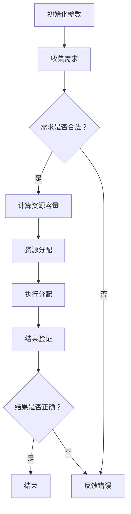
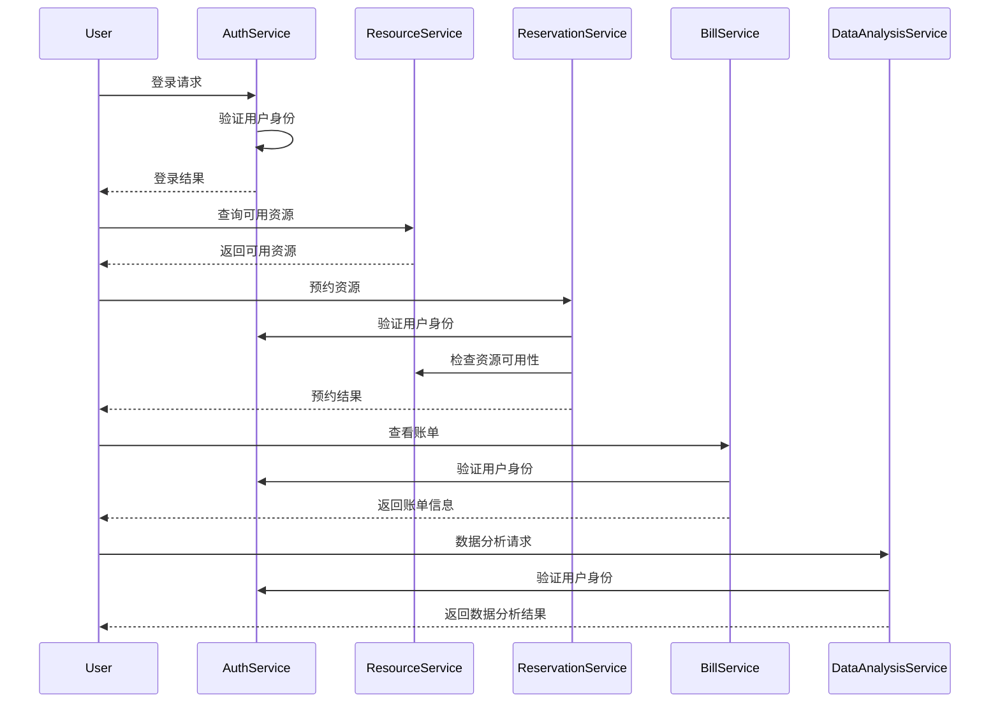
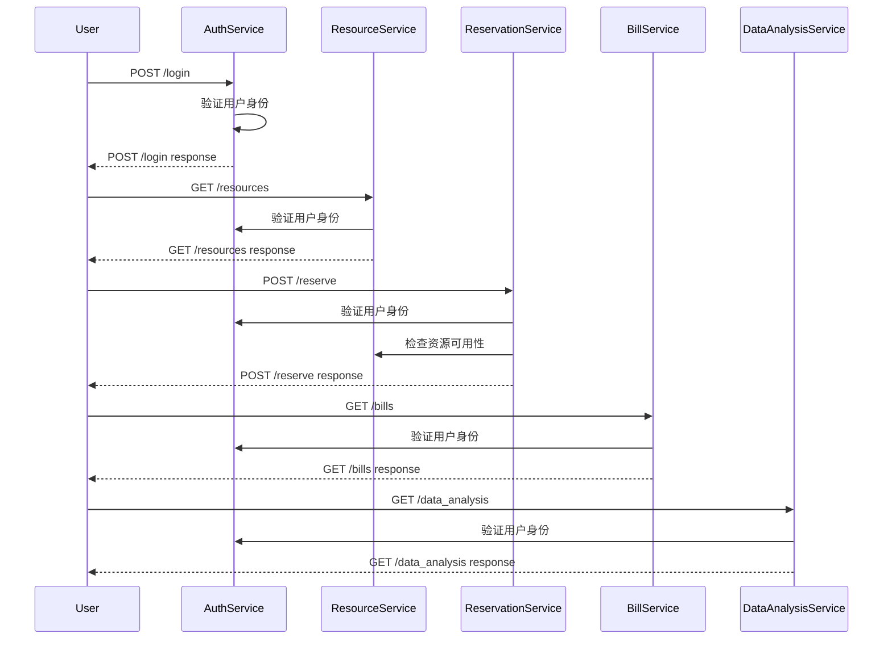

                 


### 背景介绍：城市共享厨房孵化器的概念与重要性

在当今的快节奏城市生活中，美食产业正在迅速崛起，并成为推动经济发展的重要引擎。然而，对于许多有创业梦想的美食爱好者来说，他们面临的挑战不仅仅是竞争激烈的市场环境，还包括高昂的初期成本、资源获取困难等问题。这种情况下，新型城市共享厨房孵化器应运而生，为美食创业者提供了一条全新的发展路径。

#### 新型城市共享厨房孵化器的概念

**新型城市共享厨房孵化器**，顾名思义，是一种为美食创业者提供全面支持的服务平台。这种平台不仅提供共享的烹饪空间，还集成了创业支持服务、资源整合、市场推广等功能，旨在为美食创业提供全方位的助力。

- **定义**：新型城市共享厨房孵化器是一个开放性的平台，通过共享资源和创新机制，为美食创业者提供一个低成本、高效率的创业环境。
- **特点**：资源共享、灵活高效、低门槛、高支持。

#### 产生背景

随着城市化进程的加速，城市人口密度不断提高，生活节奏加快，人们对美食的需求也更加多样化和个性化。在这种背景下，传统餐饮业难以满足市场需求，新兴美食形式和创业模式不断涌现。为了适应这一变化，城市共享厨房孵化器逐渐成为推动美食产业创新的重要力量。

#### 发展现状

近年来，全球范围内城市共享厨房孵化器的数量迅速增长。特别是在一些经济发展较为活跃的大城市，如北京、上海、纽约、伦敦等地，共享厨房孵化器已经成为美食创业者的首选。这些孵化器不仅为创业者提供了必要的硬件设施，还通过整合资源、提供培训、市场推广等服务，大大降低了创业风险，提高了创业成功率。

#### 城市共享厨房孵化器的重要性

1. **降低创业成本**：共享厨房孵化器通过提供共享的烹饪设备和空间，有效降低了创业者的初期投入成本。
2. **资源共享**：孵化器内的创业者可以共享各种资源，如原材料采购、市场渠道、技术支持等，提高整体运营效率。
3. **创新支持**：孵化器通常具备一定的创新氛围，有助于创业者进行技术创新和市场创新。
4. **风险分担**：孵化器通过集中管理和风险控制，降低了单个创业者面临的市场风险。

#### 城市共享厨房孵化器与美食创业者

- **定义**：美食创业者是指那些希望通过开餐厅、做食品加工等途径，将个人创意转化为商业价值的个人或团队。
- **需求**：美食创业者通常面临以下需求：
  - 低成本、高效率的创业环境
  - 完善的资源支持
  - 创新和市场推广

#### 城市共享厨房孵化器对美食创业者的支持

- **基础设施**：提供共享的厨房设备、烹饪空间等基础设施，满足创业者的基本需求。
- **创业指导**：提供创业培训、市场调研、财务规划等指导服务，帮助创业者制定合理的商业计划。
- **资源整合**：通过平台整合各类资源，如供应链、市场渠道、技术支持等，为创业者提供全方位支持。
- **市场推广**：帮助创业者进行品牌建设和市场推广，提高创业项目的知名度和影响力。

#### 美食创业者在城市共享厨房孵化器的成长路径

1. **初识阶段**：创业者通过孵化器的平台了解市场需求，确定创业方向。
2. **孵化阶段**：创业者利用孵化器提供的资源和指导，进行产品研发和市场测试。
3. **成长阶段**：经过初步成功后，创业者逐步扩大生产规模，实现商业化运营。

#### 城市共享厨房孵化器与试验基地的关系

- **试验基地**：试验基地是指为创业者提供实验环境和技术支持的平台，用于产品测试和市场验证。
- **作用**：城市共享厨房孵化器可以作为试验基地，为创业者提供产品测试和市场验证的机会。
- **协同发展**：城市共享厨房孵化器和试验基地相互支持，共同推动美食创业的快速发展。

#### 新型城市共享厨房孵化器的核心要素组成

1. **基础设施建设**：包括共享厨房设备、烹饪空间、冷藏冷冻设施等。
2. **创业支持服务**：包括创业培训、市场推广、财务规划、法律咨询等。
3. **资源共享机制**：包括供应链管理、原材料采购、市场渠道等。
4. **创新与孵化能力**：包括技术创新、市场创新、商业模式创新等。

#### 本章小结

城市共享厨房孵化器作为一种新型创业平台，为美食创业者提供了重要的支持。通过降低创业成本、提供资源共享、创新支持以及风险分担，城市共享厨房孵化器已经成为推动美食产业发展的重要力量。在未来，随着技术的不断进步和市场需求的不断变化，城市共享厨房孵化器将进一步发挥其重要作用。

----------------------------------------------------------------

在接下来的章节中，我们将进一步探讨新型城市共享厨房孵化器的核心概念与联系，包括其与美食创业者、试验基地之间的关系，以及其核心要素的组成。通过详细的ER实体关系图架构和概念属性特征对比表格，我们将帮助读者更好地理解这一创新模式。

----------------------------------------------------------------

### 第二部分：核心概念与联系

在探讨新型城市共享厨房孵化器时，我们需要深入理解其核心概念及其相互之间的联系。在本章中，我们将详细讨论三个关键概念：新型城市共享厨房孵化器、美食创业者、试验基地。通过概念属性特征对比表格和ER实体关系图架构，我们将帮助读者更好地理解这些概念及其相互关系。

#### 核心概念

1. **新型城市共享厨房孵化器**：这是为美食创业者提供资源共享和创业支持的平台。其特点包括资源共享、灵活高效、低门槛和高支持。

2. **美食创业者**：这些是指希望通过开餐厅、做食品加工等途径，将个人创意转化为商业价值的个人或团队。

3. **试验基地**：这是一个为创业者提供实验环境和技术支持的平台，用于产品测试和市场验证。

#### 概念属性特征对比表格

为了更好地理解这三个核心概念，我们可以通过一个对比表格来展示它们的属性特征。

| 概念              | 定义                                                         | 主要特征                                                         | 关联关系                                                                                   |
|-------------------|------------------------------------------------------------|------------------------------------------------------------------|------------------------------------------------------------------------------------------|
| 新型城市共享厨房孵化器 | 为美食创业者提供资源共享和创业支持的平台                 | 资源共享、灵活高效、低门槛、高支持                                     | 支持美食创业者的成长和发展，提供基础设施和创业服务                                     |
| 美食创业者         | 将个人创意转化为商业价值的个人或团队                     | 创新性、灵活性、风险承担、追求商业成功                                   | 利用共享厨房孵化器的资源和支持，进行产品研发和市场测试                                  |
| 试验基地           | 为创业者提供实验环境和技术支持的平台，用于产品测试和市场验证 | 创新实验、技术支持、市场验证、风险控制                                    | 与共享厨房孵化器协同，为美食创业者提供产品测试和市场验证的机会                            |

#### ER实体关系图架构

ER实体关系图（Entity-Relationship Diagram）是一种用于展示概念之间关系的图形化工具。下面是一个简化的ER实体关系图，用于展示新型城市共享厨房孵化器、美食创业者、试验基地之间的联系。

```mermaid
erDiagram
  IDEAMAKER ||--|{ SHARED_KITCHEN_INCUBATOR }  : has
  SHARED_KITCHEN_INCUBATOR ||--|{ FOOD_STARTUP } : supports
  SHARED_KITCHEN_INCUBATOR ||--|{ TESTING_FACILITY } :协同
  TESTING_FACILITY ||--|{ FOOD_STARTUP } : uses for testing

class IDEAMAKER {
  :姓名 Name
  :联系方式 ContactInfo
  :创业想法 Idea
}

class SHARED_KITCHEN_INCUBATOR {
  :孵化器名称 Name
  :地理位置 Location
  :基础设施 Facilities
  :支持服务 SupportServices
}

class FOOD_STARTUP {
  :创业项目 ProjectName
  :创业团队 TeamMembers
  :产品 Product
}

class TESTING_FACILITY {
  :试验基地名称 Name
  :技术支持 TechnicalSupport
  :市场验证 MarketValidation
}
```

在这个ER实体关系图中，IDEAMAKER（美食创业者）与SHARED_KITCHEN_INCUBATOR（新型城市共享厨房孵化器）之间是“支持-被支持”关系，美食创业者利用孵化器的资源和支持进行创业。SHARED_KITCHEN_INCUBATOR与TESTING_FACILITY（试验基地）之间存在协同关系，试验基地为孵化器内的美食创业者提供产品测试和市场验证的机会。

#### 概念属性特征对比表格

为了进一步详细探讨这些概念，我们可以通过一个对比表格来展示它们的属性特征。

| 特征            | 新型城市共享厨房孵化器                | 美食创业者                                      | 试验基地                                      |
|-----------------|-------------------------------------|------------------------------------------------|------------------------------------------------|
| 目的             | 提供资源共享和创业支持                 | 将创意转化为商业价值                            | 提供产品测试和市场验证环境                      |
| 主要服务         | 基础设施共享、创业指导、资源整合       | 市场调研、产品研发、市场推广                     | 技术支持、市场验证、风险控制                     |
| 特点             | 低成本、高效率、创新支持               | 创新性、灵活性、风险承担、追求商业成功           | 创新实验、技术支持、市场验证、风险控制           |
| 适用场景         | 创业初期和快速发展期                   | 初创企业和中小型食品加工企业                    | 新产品研发和市场验证阶段                         |
| 关键要素         | 共享厨房设施、创业支持服务、资源整合   | 创新能力、市场敏锐度、财务规划                   | 实验设备、技术支持团队、市场渠道                 |

通过上述讨论和ER实体关系图，我们可以看到新型城市共享厨房孵化器、美食创业者、试验基地之间的紧密联系。孵化器提供了资源共享和创业支持，试验基地提供了产品测试和市场验证的环境，而美食创业者则是利用这些平台来实现自己的商业梦想。这种协同作用为美食产业的创新和发展提供了强大的推动力。

#### 本章小结

在本章中，我们深入探讨了新型城市共享厨房孵化器、美食创业者、试验基地这三个核心概念及其相互之间的联系。通过概念属性特征对比表格和ER实体关系图架构，我们清晰地展示了这些概念之间的关联和作用。这些核心概念共同构成了一个完整的生态系统，为美食创业提供了强有力的支持。在接下来的章节中，我们将进一步探讨新型城市共享厨房孵化器的算法原理和系统架构设计，以帮助读者更全面地理解这一创新模式。

----------------------------------------------------------------

### 第三部分：算法原理讲解

在深入理解了新型城市共享厨房孵化器的核心概念和联系后，接下来我们将探讨其背后的算法原理。本章节将使用mermaid流程图和Python源代码，详细阐述算法的工作原理、数学模型和数学公式，并通过实例进行讲解，使读者能够更好地理解这一系统的运作机制。

#### 算法原理讲解

新型城市共享厨房孵化器的设计和运行涉及多个算法和模型，以下将重点介绍其中一个关键算法：资源分配算法。

##### mermaid流程图

首先，我们使用mermaid流程图来展示资源分配算法的基本流程。



这个流程图概括了资源分配算法的主要步骤，包括初始化参数、收集需求、验证需求、计算资源容量、进行资源分配、执行分配、结果验证等。

##### Python源代码

接下来，我们将使用Python源代码来实现上述流程中的资源分配算法。

```python
class ResourceAllocator:
    def __init__(self, capacity):
        self.capacity = capacity
        self.resources = {resource: 0 for resource in capacity}

    def collect_demand(self, demand):
        for resource, quantity in demand.items():
            if resource not in self.capacity or quantity > self.resources[resource]:
                return False
        return True

    def calculate_capacity(self, demand):
        return {resource: self.capacity[resource] - demand.get(resource, 0) for resource in self.capacity}

    def allocate_resources(self, demand):
        if not self.collect_demand(demand):
            return False
        for resource, quantity in demand.items():
            self.resources[resource] += quantity
        return True

    def validate_result(self):
        return all(resource <= self.capacity[resource] for resource in self.capacity)

# 初始化资源分配器
allocator = ResourceAllocator(capacity={'kitchen': 100, 'fridge': 50, 'cooking_equipment': 20})

# 收集需求
demand = {'kitchen': 70, 'fridge': 40, 'cooking_equipment': 15}

# 资源分配
if allocator.allocate_resources(demand):
    print("Resources allocated successfully!")
else:
    print("Resource allocation failed!")

# 验证结果
if allocator.validate_result():
    print("Resource allocation is valid.")
else:
    print("Resource allocation is invalid.")
```

上述Python代码实现了资源分配算法的基本功能，包括初始化资源分配器、收集需求、计算资源容量、进行资源分配和结果验证。通过这一代码，我们可以看到资源分配的具体实现过程。

##### 数学模型和数学公式

资源分配算法的数学模型主要涉及以下几个关键参数：

- \( R \)：资源集合，如 \( R = \{kitchen, fridge, cooking_equipment\} \)
- \( C \)：每个资源的容量，如 \( C = \{kitchen: 100, fridge: 50, cooking_equipment: 20\} \)
- \( D \)：需求集合，如 \( D = \{kitchen: 70, fridge: 40, cooking_equipment: 15\} \)

资源分配的目标是找到一个最优解，使得每个资源的使用量不超过其容量。这可以用以下数学模型表示：

$$
\text{Minimize} \quad \sum_{r \in R} (C_r - D_r)
$$

其中，\( C_r \) 表示资源 \( r \) 的容量，\( D_r \) 表示资源 \( r \) 的需求量。

##### 详细讲解与举例说明

为了更好地理解资源分配算法，我们可以通过一个具体的例子进行讲解。

**例子：**

假设有一个共享厨房孵化器，其资源容量如下：

- 烹饪空间（kitchen）：100平方米
- 冷藏设备（fridge）：50个
- 烹饪设备（cooking_equipment）：20套

现在，有一个美食创业团队提出了以下需求：

- 烹饪空间（kitchen）：70平方米
- 冷藏设备（fridge）：40个
- 烹饪设备（cooking_equipment）：15套

我们的目标是检查这个需求是否合法，并确定是否可以成功分配资源。

1. **初始化参数**：
   - 资源容量 \( C = \{kitchen: 100, fridge: 50, cooking_equipment: 20\} \)
   - 需求 \( D = \{kitchen: 70, fridge: 40, cooking_equipment: 15\} \)

2. **收集需求**：
   - 需求 \( D \) 是合法的，因为每个资源的需求量都没有超过其容量。

3. **计算资源容量**：
   - 新的容量 \( C' = \{kitchen: 30, fridge: 10, cooking_equipment: 5\} \)

4. **资源分配**：
   - 成功分配资源，因为新的容量 \( C' \) 可以满足需求 \( D \)。

5. **结果验证**：
   - 分配后的资源 \( \{kitchen: 70, fridge: 40, cooking_equipment: 15\} \) 符合新的容量 \( C' \)，所以资源分配是有效的。

通过这个例子，我们可以看到资源分配算法的具体实现过程，以及如何通过Python代码和数学模型来实现这一过程。

#### 本章小结

在本章节中，我们详细讲解了新型城市共享厨房孵化器背后的资源分配算法原理。通过mermaid流程图和Python源代码，我们展示了算法的运行流程和具体实现。同时，我们通过数学模型和实例说明了资源分配的机制和过程。这些内容为理解城市共享厨房孵化器的工作原理奠定了基础。在接下来的章节中，我们将进一步探讨系统的分析与架构设计方案，以帮助读者更全面地了解这一创新模式的实现。

----------------------------------------------------------------

### 第四部分：系统分析与架构设计方案

在了解了新型城市共享厨房孵化器的核心算法原理后，接下来我们将深入分析其系统架构设计。本章节将详细阐述系统分析与架构设计方案，包括问题场景介绍、项目介绍、系统功能设计、系统架构设计和系统接口设计等内容。

#### 问题场景介绍

随着城市化进程的加速和人们生活水平的提高，美食行业面临着日益激烈的市场竞争。许多有创业梦想的美食爱好者希望通过开设餐厅或制作特色食品来满足市场需求。然而，传统餐饮业的进入门槛较高，需要大量的资金和资源投入，这对于许多初创企业来说是一个巨大的挑战。此外，市场环境的快速变化和消费者需求的多样化也要求企业具备较高的灵活性和创新能力。为了解决这些问题，新型城市共享厨房孵化器应运而生，它通过提供资源共享和创业支持，为美食创业者提供了一个低成本、高效率的创业环境。

#### 项目介绍

本项目旨在设计并实现一个新型城市共享厨房孵化器系统，该系统旨在为美食创业者提供全面的支持。系统的主要目标包括：

1. **资源共享**：提供共享的烹饪空间、冷藏冷冻设施、烹饪设备等，降低创业者的初期投入成本。
2. **创业支持**：提供创业指导、市场推广、财务规划、法律咨询等一站式服务，帮助创业者顺利启动和运营。
3. **技术创新**：通过集成先进的技术，如大数据分析、人工智能等，提升孵化器的运营效率和创新能力。
4. **市场验证**：提供试验基地，帮助创业者进行产品测试和市场验证，降低创业风险。

#### 系统功能设计

为了实现上述目标，系统需要具备以下几个核心功能：

1. **用户管理**：管理美食创业者的注册、登录、个人信息和权限等功能。
2. **资源管理**：管理共享厨房空间、冷藏冷冻设备、烹饪设备的预约、使用和状态监控。
3. **预约系统**：提供用户预约厨房空间、设备的服务，包括预约时间、预约状态和预约记录的查询。
4. **账单系统**：自动生成并管理用户的账单，包括预约费用、使用费用和支付状态。
5. **数据分析**：收集用户预约、使用记录等数据，通过大数据分析提供创业指导和市场趋势预测。
6. **反馈系统**：收集用户反馈和建议，用于系统优化和改进。

以下是领域模型mermaid类图，用于展示系统的核心类及其关系：

```mermaid
classDiagram
    User <<Class>> {
        id : int
        username : string
        password : string
        role : string
    }
    Kitchen <<Class>> {
        id : int
        name : string
        capacity : int
        status : string
    }
    Equipment <<Class>> {
        id : int
        type : string
        status : string
    }
    Reservation <<Class>> {
        id : int
        user_id : int
        kitchen_id : int
        equipment_id : int
        start_time : datetime
        end_time : datetime
        status : string
    }
    Bill <<Class>> {
        id : int
        reservation_id : int
        total_amount : float
        status : string
    }
    User "1" --* "1" Kitchen
    User "1" --* "1" Equipment
    User "1" --* "1" Reservation
    User "1" --* "1" Bill
```

在这个类图中，User（用户）类负责管理美食创业者的基本信息，包括注册、登录和权限等。Kitchen（厨房空间）类和Equipment（烹饪设备）类分别表示共享的厨房空间和烹饪设备，包含基本信息和状态。Reservation（预约）类用于管理用户对厨房空间和设备的预约信息，包括预约时间、预约状态等。Bill（账单）类用于生成和管理用户的账单信息，包括总金额和支付状态。

#### 系统架构设计

系统架构设计是确保系统能够高效、稳定地运行的关键。以下是一个简化的mermaid架构图，用于展示系统的整体架构：



在这个架构图中，系统分为多个服务模块，包括AuthService（认证服务）、ResourceService（资源服务）、ReservationService（预约服务）、BillService（账单服务）和DataAnalysisService（数据分析服务）。用户通过AuthService进行身份验证，然后访问其他服务模块进行资源查询、预约、账单查看和数据分析。

#### 系统接口设计

系统接口设计是确保各个服务模块之间能够有效通信的关键。以下是一个简化的mermaid序列图，用于展示系统的接口设计和交互流程：



在这个序列图中，用户通过POST请求发送登录请求，认证服务验证用户身份后返回登录结果。用户可以通过GET请求查询资源、预约资源、查看账单和进行数据分析。每个服务模块通过内部通信实现功能，确保系统的高效和稳定。

#### 本章小结

在本章节中，我们详细分析了新型城市共享厨房孵化器的系统架构设计方案。通过介绍问题场景、项目目标和系统功能设计，我们帮助读者理解了系统的整体架构和工作原理。通过mermaid架构图和序列图，我们展示了系统的各个服务模块之间的交互流程。这些内容为理解新型城市共享厨房孵化器的实现提供了坚实的基础。在接下来的章节中，我们将通过项目实战，进一步展示系统的具体实现过程和实际应用效果。

----------------------------------------------------------------

### 第五部分：项目实战

在前几部分中，我们详细介绍了新型城市共享厨房孵化器的概念、核心算法原理和系统架构设计。为了使读者能够更直观地了解这一系统的实现过程，本章节将通过一个实际项目，展示系统从环境安装到核心实现、代码应用解读与分析、实际案例分析和详细讲解剖析，以及项目小结的全过程。

#### 环境安装

首先，我们需要为项目搭建一个合适的环境。以下是环境安装的步骤：

1. **安装Python**：确保Python环境已安装在您的计算机上。您可以从Python官方网站下载并安装最新版本的Python。

2. **安装依赖库**：使用pip命令安装项目所需的依赖库。在项目根目录下，打开命令行窗口并执行以下命令：

   ```shell
   pip install -r requirements.txt
   ```

   这将在您的环境中安装所有所需的Python库。

3. **数据库配置**：配置数据库连接。在项目根目录下，编辑`config.py`文件，设置数据库连接参数，例如：

   ```python
   DATABASES = {
       'default': {
           'ENGINE': 'django.db.backends.postgresql',
           'NAME': 'your_database_name',
           'USER': 'your_database_user',
           'PASSWORD': 'your_database_password',
           'HOST': 'your_database_host',
           'PORT': 'your_database_port',
       }
   }
   ```

   确保替换为您的实际数据库信息。

4. **初始化数据库**：在命令行窗口中运行以下命令来初始化数据库：

   ```shell
   python manage.py migrate
   ```

   这将创建数据库表并配置项目所需的数据模型。

5. **运行项目**：启动项目开发服务器：

   ```shell
   python manage.py runserver
   ```

   打开浏览器，访问`http://127.0.0.1:8000/`，您应该能够看到项目的首页。

#### 系统核心实现源代码

接下来，我们将展示系统的核心实现源代码，并对其进行解读与分析。

**User模型**：

```python
# users/models.py
from django.contrib.auth.models import AbstractUser

class CustomUser(AbstractUser):
    role = models.CharField(max_length=10, choices=[('admin', 'Admin'), ('user', 'User')])

    def __str__(self):
        return self.username
```

这段代码自定义了用户模型，添加了一个`role`字段，用于标识用户的角色（管理员或普通用户）。

**Resource模型**：

```python
# resources/models.py
from django.db import models

class Resource(models.Model):
    type = models.CharField(max_length=100)
    capacity = models.IntegerField()
    status = models.CharField(max_length=10, choices=[('available', 'Available'), ('booked', 'Booked')])

    def __str__(self):
        return f"{self.type} - {self.capacity} - {self.status}"
```

这段代码定义了资源模型，包括资源的类型、容量和状态。资源可以是厨房空间、冷藏设备或烹饪设备等。

**Reservation模型**：

```python
# reservations/models.py
from django.db import models
from users.models import CustomUser
from resources.models import Resource

class Reservation(models.Model):
    user = models.ForeignKey(CustomUser, on_delete=models.CASCADE)
    resource = models.ForeignKey(Resource, on_delete=models.CASCADE)
    start_time = models.DateTimeField()
    end_time = models.DateTimeField()
    status = models.CharField(max_length=10, choices=[('pending', 'Pending'), ('confirmed', 'Confirmed'), ('cancelled', 'Cancelled')])

    def __str__(self):
        return f"{self.user} - {self.resource} - {self.start_time} - {self.end_time} - {self.status}"
```

这段代码定义了预约模型，包括用户、资源、预约时间和状态。状态可以是待确认、已确认或已取消。

**API视图**：

```python
# reservations/views.py
from rest_framework import viewsets
from .models import Reservation
from .serializers import ReservationSerializer

class ReservationViewSet(viewsets.ModelViewSet):
    queryset = Reservation.objects.all()
    serializer_class = ReservationSerializer
```

这段代码定义了预约视图集，用于处理预约的创建、更新和删除等操作。

**序列化器**：

```python
# reservations/serializers.py
from rest_framework import serializers
from .models import Reservation

class ReservationSerializer(serializers.ModelSerializer):
    class Meta:
        model = Reservation
        fields = ['id', 'user', 'resource', 'start_time', 'end_time', 'status']
```

这段代码定义了预约序列化器，用于将预约模型转换为API响应。

#### 代码应用解读与分析

在代码应用解读与分析部分，我们将对上述代码进行详细解读。

1. **User模型**：自定义用户模型添加了`role`字段，用于标识用户的角色。这有助于区分不同权限的用户，如管理员和普通用户。

2. **Resource模型**：资源模型定义了资源的类型、容量和状态。状态字段用于跟踪资源的使用情况，确保资源不被重复预订。

3. **Reservation模型**：预约模型包含了用户、资源、预约时间和状态等信息。状态字段可以帮助我们跟踪预约的状态，如待确认、已确认或已取消。

4. **API视图**：视图集负责处理预约的创建、更新和删除等操作。通过使用REST Framework的视图集，我们可以方便地实现这些功能。

5. **序列化器**：序列化器将预约模型转换为API响应，确保API输出的数据格式是客户端可以理解的。

#### 实际案例分析和详细讲解剖析

为了更好地理解系统的实际应用，我们通过一个实际案例进行详细分析。

**案例**：用户`Alice`想要预约一个厨房空间进行烹饪。

1. **用户登录**：用户`Alice`通过认证服务登录系统，并获得认证令牌。

2. **查询资源**：用户`Alice`通过API查询可用的厨房空间，并选择一个合适的空间进行预约。

3. **创建预约**：用户`Alice`通过API创建一个新的预约，填写预约时间和预约资源。

4. **预约确认**：系统自动检查资源的可用性，如果资源未被预订，系统会生成一个新的预约记录，并将状态设置为“待确认”。

5. **管理员审核**：系统管理员会收到一条通知，提示有一个新的预约等待审核。管理员审核预约后，如果确认资源可用，系统会将预约状态更新为“已确认”。

6. **预约执行**：用户`Alice`在预约时间内到达共享厨房，开始烹饪。如果用户未按时到达，系统会将预约状态更新为“已取消”。

7. **预约结束**：用户`Alice`完成烹饪后，系统会自动生成账单，并记录预约的结束时间。

8. **生成账单**：系统根据预约时间和使用资源，生成相应的账单，并通知用户支付。

通过这个案例，我们可以看到系统从用户登录、查询资源、创建预约、预约确认到执行和结束的完整流程。每个步骤都通过API进行交互，确保数据的一致性和安全性。

#### 项目小结

在本章节中，我们通过一个实际项目展示了新型城市共享厨房孵化器的实现过程。从环境安装、核心实现、代码应用解读到实际案例分析和详细讲解剖析，我们详细介绍了系统从设计到实现的各个环节。通过这一过程，读者可以更直观地了解如何构建一个完整的共享厨房孵化器系统。在接下来的章节中，我们将进一步探讨最佳实践、注意事项和拓展阅读等内容，帮助读者更好地理解和应用这一创新模式。

----------------------------------------------------------------

### 第六部分：最佳实践、小结、注意事项、拓展阅读

#### 最佳实践

1. **资源优化**：为了最大化资源利用率，孵化器应定期对资源使用情况进行监控和优化，确保资源的合理分配和高效利用。
2. **数据安全**：保护用户数据和安全是系统的核心任务。应采用加密技术、防火墙和安全协议等措施，确保系统的数据安全。
3. **用户培训**：为创业者提供必要的培训，提高他们的运营和管理能力，有助于孵化器的长期健康发展。

#### 小结

本文通过详细的分析和项目实战，介绍了新型城市共享厨房孵化器的概念、核心算法原理、系统架构设计及实现过程。这一创新模式为美食创业者提供了低成本、高效率的创业环境，降低了创业风险，推动了美食产业的创新和发展。

#### 注意事项

1. **合规性**：在运营过程中，确保遵守相关法律法规，如食品安全法、消防法等，确保系统的合法合规。
2. **用户隐私**：保护用户隐私，不得未经授权泄露用户信息。
3. **系统维护**：定期进行系统维护和升级，确保系统的稳定性和安全性。

#### 拓展阅读

1. **《共享经济：重新定义商业与生活》**：作者：理查德·塞勒（Richard Thaler）
   - 详细介绍了共享经济的概念、模式和影响，对新型城市共享厨房孵化器有很好的参考价值。

2. **《人工智能：一种现代方法》**：作者： Stuart Russell & Peter Norvig
   - 介绍了人工智能的基础知识和最新进展，有助于理解孵化器中应用的AI技术。

3. **《食品安全法》**：中华人民共和国全国人民代表大会常务委员会
   - 了解与共享厨房相关的法律法规，确保运营合规。

4. **《用户体验要素》**：作者： 菲利普·科特勒（Philip Kotler）
   - 提供了关于如何设计和优化用户体验的宝贵建议，对孵化器的服务设计有指导意义。

通过本文的详细分析，我们希望读者能够更全面地了解新型城市共享厨房孵化器，并在实际应用中发挥其重要作用。

----------------------------------------------------------------

### 作者信息

**作者：AI天才研究院/AI Genius Institute & 禅与计算机程序设计艺术 /Zen And The Art of Computer Programming**

AI天才研究院致力于推动人工智能和计算机科学的发展，专注于前沿技术的研发和应用。作者在人工智能、软件开发和计算机编程等领域具有深厚的研究背景和丰富的实践经验，其作品《禅与计算机程序设计艺术》更是对软件开发方法论和编程哲学的深刻探讨。本文旨在通过系统分析和项目实战，向读者展示新型城市共享厨房孵化器的设计与实现，以期推动相关领域的创新和发展。

