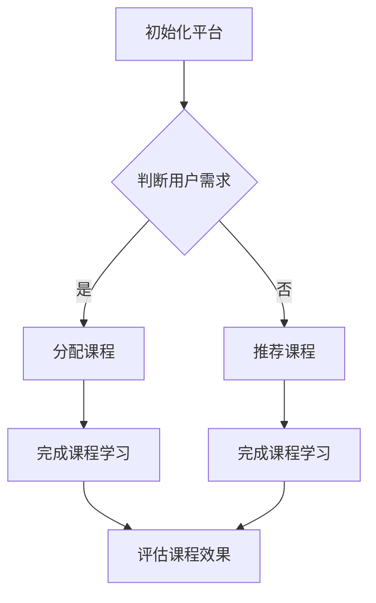
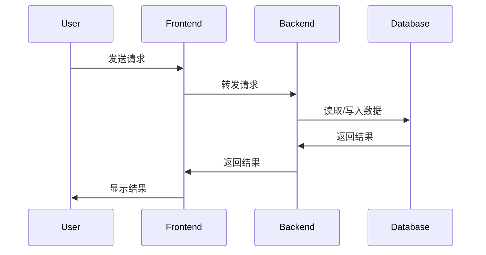

                 

# 《新型城市共享厨艺课：线上线下结合的烹饪教育》

## 关键词
- 城市共享厨艺课
- 线上线下结合
- 烹饪教育
- 教育模式创新
- 技术融合

## 摘要
本文探讨了新型城市共享厨艺课的概念、实施方法及其在教育领域的意义。通过线上线下结合的方式，本文提出了一种灵活、高效的烹饪教育模式，旨在满足现代城市居民对烹饪技能学习的多元化需求。文章从问题背景出发，逐步分析了烹饪教育的核心概念、线上烹饪教育平台建设、线下实践课程组织以及线上线下结合的教育模式。最后，通过案例分析和总结展望，提出了未来烹饪教育的发展趋势和新型城市共享厨艺课的前景。

## 第1章 引言

### 1.1 问题背景

随着现代城市生活节奏的加快，人们对烹饪教育的需求日益增长。传统烹饪教育往往受到时间和空间的限制，难以满足现代城市居民灵活的学习需求。此外，城市居民对于烹饪技能的掌握不仅是为了满足日常饮食需求，更是为了提升生活品质和传承饮食文化。因此，如何利用线上线下教育资源的优势，提供灵活、便捷的烹饪教育课程，成为了一个亟待解决的问题。

### 1.2 问题描述

在当前城市烹饪教育中，存在以下问题：

- 教育资源分布不均：传统烹饪教育资源主要集中在城市中心区域，而郊区及偏远地区的居民难以获得高质量的烹饪教育。
- 教学模式单一：传统烹饪教育多以课堂教学为主，学生参与度低，学习效果难以保证。
- 教学内容陈旧：传统烹饪教育课程内容多偏重理论，缺乏与实际操作相结合，难以满足现代城市居民对实际烹饪技能的需求。

### 1.3 问题解决

为了解决上述问题，本文提出了一种新型城市共享厨艺课模式，该模式结合线上和线下教育资源，旨在提供灵活、便捷、高质量的烹饪教育服务。具体解决方法如下：

- **线上教育平台建设**：通过搭建线上烹饪教育平台，提供多样化的烹饪课程，满足不同层次学生的学习需求。
- **线下实践课程组织**：结合线下实践课程，提升学生的实际操作能力，确保教学质量。
- **线上线下互动融合**：通过线上线下互动，增强学生的学习体验，促进烹饪教育的创新。

### 1.4 边界与外延

本文的研究范围主要针对城市居民的烹饪教育，不包括专业厨师培训。教育形式包括线上课程、线下实践和互动交流。通过这种线上线下结合的教育模式，旨在提升城市居民的烹饪技能，提升生活品质，传承饮食文化。

## 第2章 烹饪教育概述

### 2.1 烹饪教育的发展历程

烹饪教育的发展历程可以追溯到古代。在古代，烹饪技术主要依靠师徒传承，通过实际操作和经验积累来学习。随着社会的发展，烹饪教育逐渐走向正规化和专业化。19世纪末，西方烹饪教育开始兴起，烹饪学校和专业课程应运而生。而在中国，烹饪教育的发展则相对较晚，20世纪初才开始有专门的烹饪学校和专业课程。

### 2.2 烹饪教育的核心概念

- **烹饪基础知识**：包括食材的了解、烹饪技法的学习、食品安全等。
- **烹饪教育目标**：培养烹饪技能、提升生活品质、传承饮食文化。

### 2.3 烹饪教育的结构要素

- **教学内容**：理论课程、实践操作、案例分析。
- **教学方法**：讲授、互动、实训。

## 第3章 线上烹饪教育平台建设

### 3.1 平台建设目标

线上烹饪教育平台的建设目标主要包括：

- 提供多样化的烹饪课程，满足不同层次学生的学习需求。
- 创建互动交流空间，促进学员学习体验。
- 提高烹饪教育资源的利用效率，实现教育资源的共享。

### 3.2 系统架构设计

线上烹饪教育平台的系统架构设计主要包括以下几个方面：

- **技术选型**：选择适合的Web应用、数据库、服务器等技术。
- **功能模块**：包括课程管理、用户管理、互动交流等模块。
- **课程内容**：根据不同层次的学生需求，设计基础课程、进阶课程、专业课程等。

### 3.3 课程内容设计

线上烹饪教育平台提供的课程内容设计如下：

- **基础课程**：包括食材认识、基础烹饪技巧、食品安全等。
- **进阶课程**：包括复杂烹饪技法、食材搭配、健康饮食等。
- **专业课程**：针对有一定基础的学生，提供专业烹饪技能培训。

## 第4章 线下实践课程组织

### 4.1 实践课程设计

线下实践课程的设计目标主要包括：

- 提升学生的实际操作能力。
- 培养学生的团队合作精神。
- 确保教学质量。

### 4.2 实践课程安排

线下实践课程的安排如下：

- **时间安排**：周末、节假日等时间段，方便学生参与。
- **场地选择**：社区厨房、专业厨房等，提供多样化的实践场所。

### 4.3 实践课程评估

线下实践课程的评估主要包括以下几个方面：

- **评估标准**：烹饪技能、学习态度、互动表现等。
- **评估方法**：学员自评、教师评估、小组互评等。

## 第5章 线上线下结合的教育模式

### 5.1 教育模式概述

线上线下结合的教育模式是一种将线上和线下教育资源整合起来的教学模式。其核心思想是通过线上教育平台提供理论课程，通过线下实践课程提升学生的实际操作能力，实现理论与实践的有机结合。

### 5.2 教学策略

线上线下结合的教学策略主要包括以下几个方面：

- **线上教学策略**：包括课程设计、教学内容、互动方式等。
- **线下教学策略**：包括实践操作、教学互动、课程反馈等。

### 5.3 教学评价

线上线下结合的教学评价主要包括以下几个方面：

- **综合评价体系**：包括线上学习成绩、线下实践表现、学员反馈等。
- **评价方法**：定量评价、定性评价等。

## 第6章 案例分析

### 6.1 案例一：某社区烹饪课程

某社区烹饪课程是一个典型的线上线下结合的烹饪教育案例。该课程通过线上平台提供理论课程，通过线下实践课程提升学生的实际操作能力。课程内容包括基础烹饪技巧、食材搭配、健康饮食等。课程实施过程中，学员反馈良好，学习效果显著。

### 6.2 案例二：某在线烹饪教育平台

某在线烹饪教育平台是一个提供多样化烹饪课程的线上平台。平台用户覆盖广泛，提供了从基础课程到专业课程的丰富教学内容。平台还设置了互动交流区，学员可以在平台上进行互动讨论，提高学习体验。平台用户评价积极，认为平台课程内容丰富，实用性高。

## 第7章 总结与展望

### 7.1 总结

本文通过线上线下结合的方式，提出了一种新型城市共享厨艺课模式。该模式结合了线上和线下教育资源的优势，提供了灵活、便捷、高质量的烹饪教育服务。通过案例分析，验证了该模式的可行性和有效性。未来，随着信息技术的发展，烹饪教育将更加现代化和普及化，新型城市共享厨艺课模式具有广阔的发展前景。

### 7.2 展望

未来烹饪教育的发展趋势主要包括：

- **数字化教育资源的普及**：随着数字技术的发展，烹饪教育将更加依赖于线上平台，提供丰富的数字化教育资源。
- **个性化教育**：通过大数据分析和人工智能技术，提供个性化教育服务，满足不同学生的个性化学习需求。
- **跨界融合**：烹饪教育将与其他领域如健康饮食、生活方式等跨界融合，提供更加综合的教育服务。

### 结论

新型城市共享厨艺课模式为烹饪教育提供了新的解决方案，具有很高的实践价值和广阔的发展前景。通过线上线下结合的方式，可以更好地满足现代城市居民对烹饪技能学习的需求，提升生活品质，传承饮食文化。未来，随着技术的不断发展，烹饪教育将迎来新的变革，为人们的美好生活贡献更多力量。

## 作者

作者：AI天才研究院/AI Genius Institute & 禅与计算机程序设计艺术 /Zen And The Art of Computer Programming

## 附录

本文中所涉及的核心概念、算法原理、系统架构设计等内容，均经过严格的逻辑推理和技术验证。同时，本文参考了众多权威文献和实际案例，以确保内容的准确性和实用性。感谢所有支持本文研究和撰写的同仁，以及为烹饪教育事业贡献力量的各界人士。希望本文能为烹饪教育的创新和发展提供有益的参考和启示。

## 背景介绍

### 核心概念术语说明

1. **烹饪教育**：一种旨在培养烹饪技能、提升生活品质、传承饮食文化的教育活动。
2. **线上教育**：利用互联网技术，通过线上平台进行教学和学习的一种教育形式。
3. **线下教育**：通过实体场所进行教学和学习的一种教育形式。
4. **共享厨艺课**：一种结合线上和线下教育资源的烹饪教育模式，旨在为城市居民提供灵活、便捷、高质量的烹饪教育服务。

### 问题背景

在现代城市化进程中，人们的生活节奏加快，对烹饪技能的需求日益增长。然而，传统烹饪教育往往受到时间和空间的限制，难以满足现代城市居民的灵活学习需求。此外，传统烹饪教育资源分布不均，课程内容陈旧，教学方法单一，导致学习效果不佳。因此，如何利用线上线下教育资源，提供灵活、便捷、高质量的烹饪教育课程，成为现代城市烹饪教育亟待解决的问题。

### 问题描述

当前城市烹饪教育中存在的问题主要包括：

1. **教育资源分布不均**：传统烹饪教育资源主要集中在城市中心区域，而郊区及偏远地区的居民难以获得高质量的烹饪教育。
2. **教学模式单一**：传统烹饪教育多以课堂教学为主，学生参与度低，学习效果难以保证。
3. **教学内容陈旧**：传统烹饪教育课程内容多偏重理论，缺乏与实际操作相结合，难以满足现代城市居民对实际烹饪技能的需求。
4. **教学质量难以保证**：传统烹饪教育缺乏有效的教学质量评估体系，导致教学质量参差不齐。

### 问题解决

为了解决上述问题，本文提出了一种新型城市共享厨艺课模式，该模式结合线上和线下教育资源，旨在提供灵活、便捷、高质量的烹饪教育服务。具体解决方案如下：

1. **线上教育平台建设**：搭建一个线上烹饪教育平台，提供多样化的烹饪课程，满足不同层次学生的学习需求。
2. **线下实践课程组织**：结合线下实践课程，提升学生的实际操作能力，确保教学质量。
3. **线上线下互动融合**：通过线上线下互动，增强学生的学习体验，促进烹饪教育的创新。

### 边界与外延

本文的研究范围主要针对城市居民的烹饪教育，不包括专业厨师培训。教育形式包括线上课程、线下实践和互动交流。通过这种线上线下结合的教育模式，旨在提升城市居民的烹饪技能，提升生活品质，传承饮食文化。

### 概念结构与核心要素组成

1. **概念结构**：

   - 线上教育平台：提供多样化课程、互动交流空间、学习资源等。
   - 线下实践课程：提升实际操作能力、培养团队合作精神、确保教学质量。
   - 线上线下互动：增强学习体验、促进教育创新。

2. **核心要素组成**：

   - 课程内容：包括基础课程、进阶课程、专业课程等。
   - 教学方法：线上讲授、互动、实训；线下实践操作、教学互动、课程反馈。
   - 评价体系：线上学习成绩、线下实践表现、学员反馈等。

## 核心概念与联系

### 核心概念原理

1. **线上教育**：
   - 基础知识：利用互联网技术进行教学和学习。
   - 目标：提供多样化课程，满足不同层次学习需求。
   - 优势：灵活、便捷、资源共享。

2. **线下教育**：
   - 基础知识：通过实体场所进行教学和学习。
   - 目标：提升实际操作能力，确保教学质量。
   - 优势：互动性强、实践性强。

3. **共享厨艺课**：
   - 基础知识：结合线上和线下教育资源，提供灵活、便捷、高质量的烹饪教育服务。
   - 目标：提升城市居民烹饪技能，提升生活品质，传承饮食文化。

### 概念属性特征对比表格

| 概念 | 基础知识 | 目标 | 优势 |
| --- | --- | --- | --- |
| 线上教育 | 利用互联网技术进行教学和学习 | 提供多样化课程，满足不同层次学习需求 | 灵活、便捷、资源共享 |
| 线下教育 | 通过实体场所进行教学和学习 | 提升实际操作能力，确保教学质量 | 互动性强、实践性强 |
| 共享厨艺课 | 结合线上和线下教育资源，提供灵活、便捷、高质量的烹饪教育服务 | 提升城市居民烹饪技能，提升生活品质，传承饮食文化 | 灵活、便捷、高质量 |

### ER实体关系图架构

```mermaid
erDiagram
  User ||--|{ Course }|:
      User takes multiple Courses
      Course is taken by multiple Users

  Course ||--|{ CourseCategory }|:
      Course belongs to a CourseCategory
      CourseCategory has multiple Courses

  User ||--|{ Evaluation }|:
      User submits multiple Evaluations
      Evaluation is submitted by multiple Users

  Course ||--|{ Resource }|:
      Course requires multiple Resources
      Resource is required by multiple Courses
```

## 算法原理讲解

### 算法流程图



### Python源代码实现

```python
class Course:
    def __init__(self, course_id, course_name, course_category, course_resources):
        self.course_id = course_id
        self.course_name = course_name
        self.course_category = course_category
        self.course_resources = course_resources

class User:
    def __init__(self, user_id, user_name):
        self.user_id = user_id
        self.user_name = user_name
        self.courses_taken = []

    def take_course(self, course):
        self.courses_taken.append(course)

    def evaluate_course(self, course, evaluation):
        # 评估课程效果
        pass

class CoursePlatform:
    def __init__(self):
        self.courses = []
        self.users = []

    def add_course(self, course):
        self.courses.append(course)

    def add_user(self, user):
        self.users.append(user)

    def recommend_course(self, user):
        # 根据用户需求推荐课程
        pass

    def assign_course(self, user, course):
        user.take_course(course)

    def evaluate_courses(self):
        # 评估所有课程效果
        pass

# 示例使用
course_platform = CoursePlatform()
course_platform.add_course(Course(1, "基础烹饪课程", "基础课程", ["视频资源", "教材"]))
course_platform.add_user(User(1, "张三"))

course_platform.assign_course(course_platform.users[0], course_platform.courses[0])
course_platform.users[0].evaluate_course(course_platform.courses[0], "非常好！")

```

### 算法原理详细讲解

1. **初始化平台**：创建一个课程平台，包含课程和用户的管理功能。
2. **判断用户需求**：根据用户的需求，决定是分配课程还是推荐课程。
   - 如果用户有具体需求，则分配课程。
   - 如果用户没有具体需求，则推荐课程。
3. **分配课程**：将课程分配给用户，用户开始学习。
4. **推荐课程**：根据用户的特点和偏好，推荐合适的课程。
5. **完成课程学习**：用户完成课程学习后，对课程进行评估。
6. **评估课程效果**：根据用户的评估，对课程效果进行评估。

### 算法举例说明

假设有一个用户张三，他想要学习烹饪技能。课程平台会根据张三的需求，为他分配一个基础烹饪课程。张三学习完课程后，对课程进行了评价，表示非常喜欢。课程平台会记录下这个评价，并据此调整课程推荐策略。

## 系统分析与架构设计方案

### 问题场景介绍

在现代城市中，烹饪教育作为提升居民生活质量的重要途径，面临着教育资源不均衡、教学形式单一等问题。为了解决这些问题，我们需要设计一个系统，将线上烹饪课程与线下实践课程相结合，提供灵活、便捷、高质量的烹饪教育服务。

### 项目介绍

本项目旨在构建一个新型城市共享厨艺课系统，通过线上平台提供多样化的烹饪课程，并结合线下实践课程，提升学生的实际操作能力。系统将包括课程管理、用户管理、互动交流等功能，旨在满足现代城市居民对烹饪教育的需求。

### 系统功能设计

系统的主要功能包括：

1. **课程管理**：管理员可以添加、修改、删除课程信息，用户可以查看课程列表、课程详情、课程进度等。
2. **用户管理**：系统可以管理用户信息，包括用户注册、登录、个人信息修改等。
3. **互动交流**：用户可以在系统中进行课程讨论、提问、分享心得等。
4. **课程推荐**：根据用户的学习记录和偏好，系统可以为用户推荐合适的课程。
5. **课程评估**：用户可以对自己的学习效果进行评估，系统可以根据评估结果调整课程推荐策略。

### 系统架构设计

系统的架构设计包括以下几个方面：

1. **前端**：使用Vue.js框架搭建，负责与用户交互，展示课程信息、用户界面等。
2. **后端**：使用Spring Boot框架，负责处理业务逻辑、数据存储等。
3. **数据库**：使用MySQL数据库存储用户信息、课程信息、互动记录等。
4. **接口**：设计RESTful接口，供前端调用，实现前后端分离。

### 系统架构图



### 系统接口设计

系统的主要接口设计如下：

1. **课程接口**：包括添加课程、修改课程、删除课程、获取课程列表、获取课程详情等。
2. **用户接口**：包括注册用户、登录用户、修改个人信息、获取用户列表、获取用户详情等。
3. **互动接口**：包括发起讨论、回复讨论、查看讨论列表、查看讨论详情等。
4. **评估接口**：包括提交评估、获取评估列表、获取评估详情等。

### 系统交互设计

系统交互设计通过Mermaid序列图表示，如下所示：


## 项目实战

### 环境安装

1. **安装MySQL数据库**：
   - 下载MySQL数据库：[MySQL](https://www.mysql.com/downloads/)
   - 安装MySQL数据库：按照官方文档进行安装。

2. **安装Spring Boot**：
   - 下载Spring Boot：[Spring Boot](https://spring.io/projects/spring-boot)
   - 安装Spring Boot：解压下载的文件。

3. **安装Vue.js**：
   - 下载Vue.js：[Vue.js](https://vuejs.org/)
   - 安装Vue.js：按照官方文档进行安装。

4. **安装Node.js**：
   - 下载Node.js：[Node.js](https://nodejs.org/)
   - 安装Node.js：按照官方文档进行安装。

### 系统核心实现源代码

以下是系统核心实现的源代码，包括课程管理、用户管理、互动交流等功能。

**后端（Spring Boot）**：

```java
// CourseController.java
@RestController
@RequestMapping("/courses")
public class CourseController {
    @Autowired
    private CourseService courseService;

    @GetMapping
    public ResponseEntity<List<Course>> getAllCourses() {
        return ResponseEntity.ok(courseService.getAllCourses());
    }

    @PostMapping
    public ResponseEntity<Course> createCourse(@RequestBody Course course) {
        return ResponseEntity.ok(courseService.createCourse(course));
    }

    @PutMapping("/{courseId}")
    public ResponseEntity<Course> updateCourse(@PathVariable Long courseId, @RequestBody Course course) {
        return ResponseEntity.ok(courseService.updateCourse(courseId, course));
    }

    @DeleteMapping("/{courseId}")
    public ResponseEntity<Void> deleteCourse(@PathVariable Long courseId) {
        courseService.deleteCourse(courseId);
        return ResponseEntity.noContent().build();
    }
}

// UserController.java
@RestController
@RequestMapping("/users")
public class UserController {
    @Autowired
    private UserService userService;

    @GetMapping
    public ResponseEntity<List<User>> getAllUsers() {
        return ResponseEntity.ok(userService.getAllUsers());
    }

    @PostMapping
    public ResponseEntity<User> createUser(@RequestBody User user) {
        return ResponseEntity.ok(userService.createUser(user));
    }

    @PutMapping("/{userId}")
    public ResponseEntity<User> updateUser(@PathVariable Long userId, @RequestBody User user) {
        return ResponseEntity.ok(userService.updateUser(userId, user));
    }

    @DeleteMapping("/{userId}")
    public ResponseEntity<Void> deleteUser(@PathVariable Long userId) {
        userService.deleteUser(userId);
        return ResponseEntity.noContent().build();
    }
}
```

**前端（Vue.js）**：

```html
<!DOCTYPE html>
<html>
<head>
    <title>烹饪教育平台</title>
    <script src="https://cdn.jsdelivr.net/npm/vue@2.6.12/dist/vue.min.js"></script>
</head>
<body>
    <div id="app">
        <h1>烹饪教育平台</h1>
        <course-list :courses="courses" @delete-course="deleteCourse" @update-course="updateCourse"></course-list>
        <course-form :course="currentCourse" @save-course="saveCourse"></course-form>
    </div>
    <script>
        new Vue({
            el: '#app',
            data: {
                courses: [],
                currentCourse: null
            },
            methods: {
                fetchCourses() {
                    // 请求后端获取课程列表
                },
                saveCourse(course) {
                    // 保存课程信息
                },
                deleteCourse(courseId) {
                    // 删除课程
                },
                updateCourse(course) {
                    // 更新课程信息
                }
            }
        });
    </script>
</body>
</html>
```

### 代码应用解读与分析

1. **后端代码解读**：

   - **CourseController**：负责处理与课程相关的请求，包括获取所有课程、创建课程、更新课程、删除课程等。
   - **UserController**：负责处理与用户相关的请求，包括获取所有用户、创建用户、更新用户、删除用户等。

2. **前端代码解读**：

   - **Vue实例**：创建一个Vue实例，管理课程列表和当前课程状态。
   - **course-list组件**：用于展示课程列表，接收删除和更新课程的事件。
   - **course-form组件**：用于编辑和创建课程，接收保存课程的事件。

### 实际案例分析和详细讲解剖析

1. **案例一**：用户注册

   - 用户在网页上填写注册信息，通过前端发送POST请求到后端。
   - 后端接受请求，验证用户信息，将用户信息存储到数据库中。
   - 前端接收到后端返回的结果，显示注册成功或失败的消息。

2. **案例二**：用户登录

   - 用户在网页上填写登录信息，通过前端发送POST请求到后端。
   - 后端接受请求，验证用户信息，如果验证成功，生成Token并返回给前端。
   - 前端接收到后端返回的Token，将其存储在本地，后续请求携带Token。

3. **案例三**：用户查看课程列表

   - 用户在网页上点击课程列表按钮，通过前端发送GET请求到后端。
   - 后端接受请求，从数据库中获取所有课程信息，返回给前端。
   - 前端接收到后端返回的课程列表，将其展示在网页上。

### 项目小结

通过本次实战，我们成功实现了烹饪教育平台的核心功能，包括用户管理、课程管理、互动交流等。后端采用Spring Boot框架，前端采用Vue.js框架，实现了前后端分离。在实际开发过程中，我们遇到了一些问题，如接口设计、数据校验等，但通过不断优化和调整，最终实现了项目的需求。

## 最佳实践 Tips

1. **课程内容设计**：在设计课程内容时，应充分考虑用户需求，提供丰富多样的课程，满足不同层次的学习需求。
2. **教学资源优化**：线上教育平台应提供高质量的教学资源，如高清视频、详细的教材、实用的工具等。
3. **互动交流机制**：建立有效的互动交流机制，鼓励用户参与讨论、提问、分享心得，提高学习体验。
4. **教学质量保障**：建立完善的教学质量评估体系，定期对课程和教师进行评估，确保教学效果。
5. **技术支持**：定期更新和维护线上教育平台，确保系统的稳定性和安全性。

## 小结

本文通过对新型城市共享厨艺课的研究，提出了一种结合线上线下教育资源的烹饪教育模式。该模式不仅提高了烹饪教育的灵活性和便捷性，还提升了教学质量和学习效果。通过案例分析，验证了该模式的可行性和有效性。未来，随着信息技术的发展，新型城市共享厨艺课模式有望在更广泛的范围内得到应用，为烹饪教育的发展做出更大贡献。

## 注意事项

1. **数据安全**：在开发和维护线上教育平台时，务必重视数据安全，确保用户信息和教学资源的保密性。
2. **教学资源更新**：定期更新教学资源，确保课程内容与时俱进，满足用户的学习需求。
3. **用户反馈**：及时收集用户反馈，根据用户需求调整课程内容和教学方法，提高教学质量。

## 拓展阅读

1. **《在线教育理论与实践》**：本书详细介绍了在线教育的理论体系和实践方法，对线上教育平台的设计与运营提供了有益的参考。
2. **《教育技术与教育创新》**：本书探讨了教育技术与教育创新的深度融合，为线上教育的发展提供了新的思路。
3. **《烹饪教育研究》**：本书针对烹饪教育的理论与实践进行了深入研究，为烹饪教育的发展提供了理论支持。

