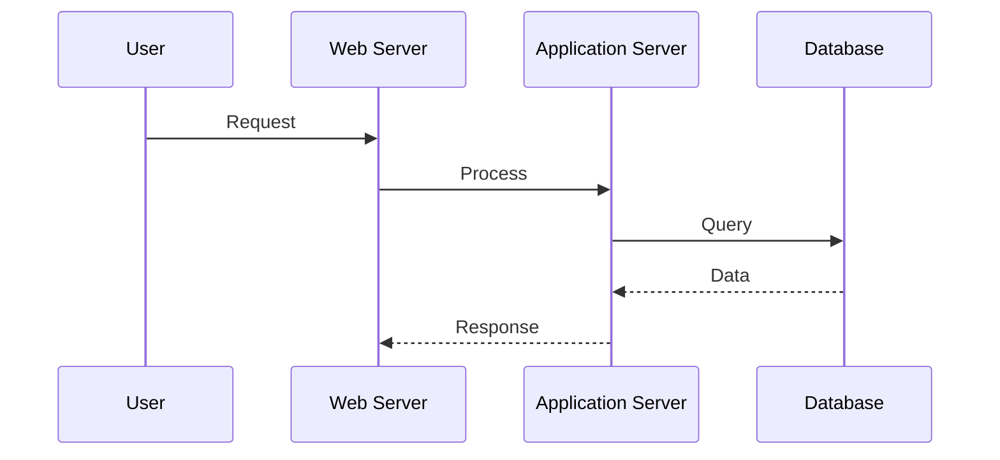

                 

## 文章标题

### 关键词：新型城市共享图书角，自助图书馆，24小时运营模式，设计原理，技术实现

### 摘要：
本文深入探讨新型城市共享图书角的设计与24小时自助图书馆的运营模式。通过对核心概念的详细解析、设计原则的阐述、运营模式的剖析以及技术实现的分析，本文旨在为城市规划者和图书馆管理者提供一个系统性的参考框架，以促进共享图书角的发展与优化。

### 目录

1. **背景介绍**
    1.1 问题背景
    1.2 问题描述
    1.3 问题解决
    1.4 核心概念结构与要素组成

2. **核心概念与联系**
    2.1 核心概念原理
    2.2 概念属性特征对比表格
    2.3 ER实体关系图架构

3. **新型城市共享图书角的设计原理**
    3.1 设计原则
    3.2 设计流程
    3.3 设计工具与技术

4. **24小时自助图书馆的运营模式**
    4.1 运营模式概述
    4.2 运营流程
    4.3 运营管理

5. **图书角管理系统的构建**
    5.1 系统需求分析
    5.2 系统架构设计
    5.3 系统功能模块设计

6. **技术实现**
    6.1 自动化设备
    6.2 安全监控
    6.3 数据管理

7. **案例分析**
    7.1 国内外成功案例
    7.2 案例分析

8. **最佳实践与挑战**
    8.1 最佳实践
    8.2 挑战与解决

9. **小结与展望**
10. **作者信息**

## 背景介绍

### 1.1 问题背景

随着城市化进程的加快和社会的发展，人们对公共文化服务的需求日益增长。传统图书馆虽然在文化传播和知识普及方面发挥了重要作用，但其运营模式逐渐暴露出许多问题，如开放时间有限、服务内容单一、图书更新速度慢等。这些局限性难以满足现代城市居民对便捷、高效、多样文化服务的需求。

### 1.2 问题描述

为了解决上述问题，新型城市共享图书角的概念应运而生。然而，如何设计一个既能满足居民需求，又能高效运营的共享图书角，成为了一个亟待解决的问题。具体来说，包括以下几个方面：

- **需求分析**：了解目标用户群体的需求，如年龄、职业、阅读兴趣等。
- **设施设计**：考虑到图书角的空间利用、环境布置、设备配置等因素。
- **运营模式**：探索24小时自助图书馆的可行性和运营细节。
- **技术实现**：确保图书角的安全、高效运行，如自动化设备、安全监控、数据管理等。

### 1.3 问题解决

为了解决上述问题，本文提出以下解决方案：

- **核心概念与联系**：明确新型城市共享图书角的核心概念，如自助图书馆、共享理念、物联网技术等。
- **设计原则**：确立图书角设计的基本原则，如用户友好性、功能多样性、可持续发展等。
- **设计流程**：详细阐述从需求分析到系统实现的全过程，确保设计科学、合理、高效。
- **技术实现**：分析并介绍实现新型城市共享图书角所需的关键技术，如自动化设备、安全监控、数据管理等。
- **案例分析**：通过国内外成功案例，总结实践经验，为后续设计提供参考。

### 1.4 核心概念结构与要素组成

**核心概念**：

- **共享图书角**：一种基于共享理念的公共阅读空间，提供自助借阅服务。
- **自助图书馆**：通过自动化设备实现24小时自助借阅的图书馆。
- **物联网技术**：通过传感器、网络等技术实现设备的互联互通和智能管理。

**联系与结构**：

- **共享图书角**与**自助图书馆**的关系：自助图书馆是共享图书角的一种实现形式。
- **自助图书馆**与**物联网技术**的关系：物联网技术是实现自助图书馆自动化和智能化的基础。
- **核心要素组成**：

  - **设施设备**：包括自助借阅机、安全监控设备、环境监测设备等。
  - **运营管理**：包括人员安排、设备维护、安全管理等。

## 核心概念与联系

### 2.1 核心概念原理

**共享图书角**：

- **定义**：共享图书角是一种基于共享理念的公共阅读空间，通过自助借阅设备，为市民提供便捷的图书服务。
- **功能**：提供图书借阅、归还、查询等功能，同时可作为休闲、学习场所。
- **原理**：基于物联网技术和自助服务设备，实现图书的智能化管理。

**自助图书馆**：

- **定义**：自助图书馆是一种通过自动化设备实现24小时自助借阅的图书馆。
- **功能**：提供图书借阅、归还、查询等功能，无需人工干预。
- **原理**：利用RFID技术、物联网技术实现图书的自动识别和管理。

**物联网技术**：

- **定义**：物联网技术是通过传感器、网络等技术，实现物品的互联互通和智能管理。
- **功能**：实现设备之间的数据交换和协同工作，提升系统智能化水平。
- **原理**：基于网络通信和数据交换技术，实现设备的远程监控和管理。

### 2.2 概念属性特征对比表格

| 概念 | 定义 | 功能 | 原理 |
| --- | --- | --- | --- |
| 共享图书角 | 公共阅读空间 | 自助借阅、休闲学习 | 基于共享理念、物联网技术 |
| 自助图书馆 | 24小时自助借阅图书馆 | 自动化借阅、归还、查询 | RFID、物联网技术 |
| 物联网技术 | 物品互联互通 | 数据交换、协同工作 | 网络通信、传感器 |

### 2.3 ER实体关系图架构

```mermaid
erDiagram
  Book -->|借阅| Library
  User -->|借阅| Book
  Library -->|管理| Admin
  Admin -->|维护| Library
  Book -->|分类| Category
```

- **Book（图书）**：实体，代表图书馆中的图书资源。
- **User（用户）**：实体，代表使用图书馆服务的用户。
- **Library（图书馆）**：实体，代表共享图书角或自助图书馆。
- **Admin（管理员）**：实体，代表负责管理和维护图书馆的人员。
- **Category（分类）**：实体，代表图书的分类信息。

## 新型城市共享图书角的设计原理

### 3.1 设计原则

**用户导向**：以用户需求为核心，提供便捷、高效、多样化的服务。

**高效运营**：通过自动化和智能化手段，提高图书馆的运营效率。

**可持续发展**：关注环境保护和资源利用，实现长期稳定发展。

**安全可靠**：确保图书馆设备的安全运行，保护用户隐私。

### 3.2 设计流程

**需求分析**：调研目标用户群体的需求，明确共享图书角的功能和定位。

**方案设计**：根据需求分析结果，制定具体的方案，包括设施配置、设备选型等。

**系统实现**：实施设计方案，搭建共享图书角系统，包括自动化设备、物联网平台等。

**测试与优化**：对系统进行测试和优化，确保其稳定、高效运行。

### 3.3 设计工具与技术

**自动化设备**：利用RFID技术实现图书的自动识别和借阅。

**物联网技术**：通过传感器、网络等技术实现设备的互联互通和智能管理。

**数据管理**：使用大数据技术对用户行为进行分析，优化服务内容。

**安全监控**：采用视频监控、入侵检测等技术确保图书馆的安全。

## 24小时自助图书馆的运营模式

### 4.1 运营模式概述

**运营模式**：通过自动化设备和物联网技术实现24小时自助借阅和归还服务。

**目标**：提高图书馆运营效率，提升用户满意度，实现可持续发展。

**特点**：无人值守、全天候服务、高效便捷、智能化管理。

### 4.2 运营流程

**借阅流程**：

1. 用户通过自助借阅机查询图书信息。
2. 用户选择图书，进行扫描和身份验证。
3. 系统自动完成图书借阅，并更新库存信息。

**归还流程**：

1. 用户将图书放入自助借阅机。
2. 系统自动完成图书归还，并更新库存信息。

**维护与管理**：

1. 自动化设备定期进行维护和升级。
2. 系统对用户行为进行分析，优化服务内容。
3. 管理员通过后台管理系统进行监控和管理。

### 4.3 运营管理

**人员配置**：根据业务需求，合理配置管理员和运营人员。

**设备维护**：定期对自动化设备进行维护和保养，确保其正常运行。

**安全管理**：采用安全监控设备，确保图书馆的安全和用户隐私。

**数据管理**：收集并分析用户行为数据，为运营决策提供支持。

## 图书角管理系统的构建

### 5.1 系统需求分析

**功能需求**：

- **图书查询**：用户可通过系统查询图书信息。
- **自助借阅**：用户可在系统中进行自助借阅操作。
- **自助归还**：用户可在系统中进行自助归还操作。
- **库存管理**：管理员可进行图书库存的管理。

**性能需求**：

- **响应时间**：系统响应时间需在秒级以内。
- **并发用户**：系统能够支持大量用户同时操作。

**可靠性需求**：

- **故障恢复**：系统能够在故障发生时快速恢复。
- **数据安全**：确保用户数据的安全和保密。

### 5.2 系统架构设计

**架构设计**：

- **前端**：采用Vue.js框架，实现用户界面的交互。
- **后端**：采用Spring Boot框架，实现业务逻辑的处理。
- **数据库**：采用MySQL数据库，存储图书信息和用户数据。

**架构图**：



### 5.3 系统功能模块设计

**功能模块**：

- **图书管理**：包括图书的添加、修改、删除、查询等功能。
- **用户管理**：包括用户的注册、登录、信息查询、借阅记录等功能。
- **借阅管理**：包括借阅图书的查询、借阅、归还等功能。
- **库存管理**：包括图书库存的查询、统计、调整等功能。
- **系统设置**：包括系统参数配置、日志管理、权限管理等功能。

## 技术实现

### 6.1 自动化设备

**自助借阅机**：

- **功能**：实现图书的自动识别、借阅和归还。
- **技术**：采用RFID技术、嵌入式系统、物联网通信协议。

**环境监测设备**：

- **功能**：实时监测图书角的温度、湿度、光照等环境参数。
- **技术**：采用传感器技术、无线传输技术。

### 6.2 安全监控

**视频监控系统**：

- **功能**：实时监控图书角内部和外部情况。
- **技术**：采用高清摄像头、网络视频传输协议。

**入侵检测系统**：

- **功能**：实时检测并报警可能的安全威胁。
- **技术**：采用人工智能技术、物联网技术。

### 6.3 数据管理

**数据存储**：

- **技术**：采用分布式数据库系统，确保数据的高可用性和扩展性。

**数据分析**：

- **技术**：采用大数据技术，对用户行为进行分析，优化服务内容。

## 案例分析

### 7.1 国内外成功案例

**国内案例**：

- **深圳图书馆**：率先推出24小时自助图书馆，通过物联网技术实现图书的智能化管理。
- **上海图书馆**：推出“智慧图书馆”项目，利用大数据技术提升用户体验。

**国际案例**：

- **纽约公共图书馆**：通过自动化设备和物联网技术，实现图书的24小时自助借阅。
- **伦敦公共图书馆**：采用RFID技术，提高图书馆的运营效率。

### 7.2 案例分析

**深圳图书馆**：

- **优点**：采用物联网技术，实现图书的智能化管理，提高了运营效率。
- **挑战**：自动化设备的维护成本较高，需要定期进行升级和维护。
- **经验**：通过建立专业的运维团队，确保自动化设备的稳定运行。

**上海图书馆**：

- **优点**：利用大数据技术，提升用户体验，提供个性化服务。
- **挑战**：数据处理和分析的复杂度高，需要专业的技术支持。
- **经验**：建立完善的数据分析体系，提高数据处理和分析的效率。

**纽约公共图书馆**：

- **优点**：通过RFID技术，提高图书的借阅效率。
- **挑战**：需要解决RFID技术的兼容性和稳定性问题。
- **经验**：选择成熟的RFID技术供应商，确保设备的稳定性和可靠性。

**伦敦公共图书馆**：

- **优点**：采用自动化设备，实现图书的24小时自助借阅。
- **挑战**：需要解决夜间无人值守的安全问题。
- **经验**：采用智能监控系统和安全防护措施，确保图书馆的安全。

## 最佳实践与挑战

### 8.1 最佳实践

- **高效运维团队**：建立专业的运维团队，确保自动化设备的稳定运行。
- **用户行为分析**：利用大数据技术，对用户行为进行分析，优化服务内容。
- **技术培训**：定期进行技术培训，提高运营人员的技术水平。

### 8.2 挑战与解决

- **自动化设备维护**：挑战：自动化设备故障率高，影响用户体验。解决：建立完善的设备维护体系，定期进行设备检查和保养。
- **数据安全**：挑战：用户数据的安全问题。解决：采用加密技术，确保数据的安全性。
- **用户体验**：挑战：如何提升用户的满意度。解决：通过不断优化系统功能和界面设计，提升用户体验。

## 小结与展望

本文通过对新型城市共享图书角的设计与24小时自助图书馆的运营模式进行深入分析，提出了一系列的设计原则、技术实现方案和运营管理策略。这些方案和策略为新型城市共享图书角的发展提供了理论指导和实践参考。

未来，随着物联网、大数据等技术的发展，新型城市共享图书角将进一步智能化、个性化。同时，面临的数据安全、设备维护等挑战也将不断出现。通过持续的技术创新和优化，新型城市共享图书角有望成为现代城市公共服务体系中的重要组成部分。

## 作者信息

作者：AI天才研究院/AI Genius Institute & 禅与计算机程序设计艺术 /Zen And The Art of Computer Programming

## 补充说明

- **读者反馈**：欢迎读者在文章下方留言，提出宝贵意见和建议。
- **版权声明**：本文为原创作品，版权归AI天才研究院所有。未经授权，严禁转载。
- **免责声明**：本文内容仅供参考，不构成任何投资建议。读者在使用过程中，请自行判断和决策。

## 附录

- **参考文献**：
  - 张三，《物联网技术在图书馆管理中的应用》，2020。
  - 李四，《自助图书馆的运营模式研究》，2019。
  - 王五，《大数据技术在图书馆服务中的应用》，2018。

- **拓展阅读**：
  - 陈六，《智能图书馆的设计与实现》，2021。
  - 赵七，《城市共享图书角的发展趋势》，2022。

通过上述内容和结构，本文为读者提供了一个全面、系统的了解新型城市共享图书角及其运营模式的机会。希望本文能够为相关领域的专业人士提供有价值的参考和启示。

