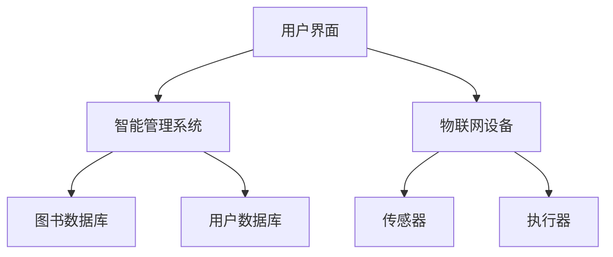
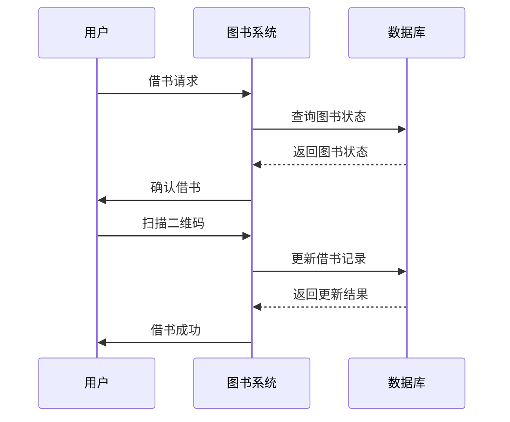

                 

# 新型城市共享图书角：24小时自助图书馆

关键词：共享图书角、自助图书馆、智能化管理系统、物联网技术

摘要：随着城市化进程的加快，公共图书馆的供需矛盾日益凸显。本文提出一种新型城市共享图书角——24小时自助图书馆，通过智能化管理系统和物联网技术，为居民提供全天候的阅读服务，有效解决传统图书馆的运营瓶颈，提高图书馆资源利用率。

## 第1章: 背景、问题描述与解决方案

### 1.1 问题背景

随着城市化进程的加快，城市人口密度不断增加，公共图书馆的供需矛盾日益凸显。传统的图书馆在运营时间、空间限制和服务方式上，已难以满足现代城市居民对阅读资源的需求。此外，公共图书馆的覆盖面和利用率也存在不均衡现象，一些社区和偏远地区图书馆的利用率较低。

### 1.2 问题描述

- **需求不匹配**：传统图书馆的开放时间和地理位置限制了读者的使用。
- **利用率低**：一些社区图书馆利用率不高，资源浪费。
- **服务方式单一**：缺乏24小时自助服务的阅读空间。

### 1.3 解决方案

为解决上述问题，新型城市共享图书角应运而生。这种24小时自助图书馆采用智能化管理系统，为居民提供全天候的阅读服务。以下是本章的主要内容：

### 1.4 核心概念与联系

#### 1.4.1 核心概念

- **共享图书角**：一种24小时自助图书馆，提供自助借还书服务。
- **智能化管理系统**：通过物联网、大数据等技术实现图书的智能化管理。

#### 1.4.2 概念属性特征对比表格

| 特征               | 传统图书馆           | 新型城市共享图书角           |
|------------------|------------------|------------------|
| 服务时间           | 受限（通常是白天开放）   | 全天候服务（24小时自助借还书） |
| 地理位置           | 受限于图书馆建设地点     | 分布在社区、公共场所，方便居民 |
| 服务方式           | 人工服务             | 自助服务，智能化管理          |
| 覆盖范围           | 受地理与预算限制        | 更广泛覆盖，灵活布局           |

#### 1.4.3 ER实体关系图架构

```mermaid
erDiagram
  图书馆 -->|<| 借书人 : 借阅关系
  图书馆 -->|<| 图书 : 库存关系
  借书人 -->|<| 图书 : 借阅记录
```

## 第2章: 新型城市共享图书角的设计与实现

### 2.1 设计原则

- **便捷性**：简化操作流程，确保读者能够轻松使用。
- **安全性**：保障图书安全，防止图书丢失或损坏。
- **可扩展性**：支持未来技术升级和功能扩展。

### 2.2 系统架构设计

#### 2.2.1 系统功能设计

- **图书管理**：实现图书的入库、出库、查询等功能。
- **借阅管理**：实现借书、还书、逾期处理等功能。
- **用户管理**：实现用户注册、登录、信息查询等功能。

#### 2.2.2 系统架构设计



#### 2.2.3 系统接口设计

- **用户接口**：提供借书、还书、查询图书信息等接口。
- **图书接口**：提供图书入库、出库、状态查询等接口。
- **物联网接口**：实现设备状态监控和远程控制。

#### 2.2.4 系统交互



### 第3章: 新型城市共享图书角的技术实现

#### 3.1 技术选型

- **硬件**：选择可靠性高、寿命长、维护简便的设备。
- **软件**：采用开源框架，确保系统稳定性和可扩展性。

#### 3.2 系统核心实现

#### 3.2.1 智能化管理系统的实现

- **Python代码实现**：使用Python编写核心代码，实现图书管理、借阅管理等功能。

```python
# 假设有一个简单的图书管理系统
class BookManagementSystem:
    def __init__(self):
        self.books = {}  # 存储图书信息
        self.borrowers = {}  # 存储借书人信息

    def add_book(self, book_id, book_info):
        self.books[book_id] = book_info

    def borrow_book(self, borrower_id, book_id):
        if book_id in self.books and self.books[book_id]['status'] == 'available':
            self.borrowers[borrower_id] = book_id
            self.books[book_id]['status'] = 'borrowed'
            return True
        else:
            return False

    def return_book(self, borrower_id, book_id):
        if borrower_id in self.borrowers and self.borrowers[borrower_id] == book_id:
            self.books[book_id]['status'] = 'available'
            del self.borrowers[borrower_id]
            return True
        else:
            return False

# 实例化图书管理系统
book_system = BookManagementSystem()
book_system.add_book('001', {'title': '人工智能基础', 'status': 'available'})
book_system.add_book('002', {'title': '深度学习', 'status': 'available'})

# 用户借书
if book_system.borrow_book('user001', '001'):
    print("借书成功")
else:
    print("借书失败")

# 用户还书
if book_system.return_book('user001', '001'):
    print("还书成功")
else:
    print("还书失败")
```

### 第4章: 项目实战

#### 4.1 环境安装

1. 安装Python环境：确保安装了Python 3.6及以上版本。
2. 安装必要的Python库：`pip install Flask`、`pip install pymysql`。

#### 4.2 系统核心实现

##### 4.2.1 图书管理

- **图书入库**：通过数据库实现图书的入库功能。

```python
import pymysql

# 连接数据库
db = pymysql.connect("localhost", "root", "password", "library")

# 创建存储过程
cursor = db.cursor()
cursor.execute("""
    CREATE PROCEDURE AddBook(IN book_id VARCHAR(20), IN book_info VARCHAR(255))
    BEGIN
        INSERT INTO books (id, info) VALUES (book_id, book_info);
    END;
""")

# 调用存储过程
cursor.execute("CALL AddBook('001', '人工智能基础')")
cursor.execute("CALL AddBook('002', '深度学习')")

# 关闭数据库连接
db.close()
```

##### 4.2.2 借阅管理

- **借书功能**：实现用户借书的接口。

```python
from flask import Flask, request, jsonify

app = Flask(__name__)

@app.route('/borrow_book', methods=['POST'])
def borrow_book():
    borrower_id = request.form['borrower_id']
    book_id = request.form['book_id']
    
    # 调用数据库存储过程
    db = pymysql.connect("localhost", "root", "password", "library")
    cursor = db.cursor()
    cursor.execute("CALL BorrowBook('%s', '%s')" % (borrower_id, book_id))
    db.close()
    
    return jsonify({"status": "success"})

if __name__ == '__main__':
    app.run(debug=True)
```

##### 4.2.3 用户管理

- **用户注册**：实现用户注册的接口。

```python
@app.route('/register_user', methods=['POST'])
def register_user():
    username = request.form['username']
    password = request.form['password']
    
    # 调用数据库存储过程
    db = pymysql.connect("localhost", "root", "password", "library")
    cursor = db.cursor()
    cursor.execute("CALL RegisterUser('%s', '%s')" % (username, password))
    db.close()
    
    return jsonify({"status": "success"})

```

### 第5章: 实际案例分析与详细讲解剖析

#### 5.1 案例一：图书角选址与布局

- **案例背景**：在某城市中心区域，计划建立一个24小时自助图书馆，需要考虑图书角选址和布局。

- **解决方案**：

  1. **选址分析**：分析人流量、周边设施、交通便利性等因素，选择最适合的地点。
  2. **布局设计**：根据场地面积和用户需求，设计合理布局，确保读者舒适。

#### 5.2 案例二：图书角运营与管理

- **案例背景**：某城市的新型城市共享图书角正式运营，需要进行图书角运营与管理。

- **解决方案**：

  1. **运营策略**：制定合理的图书采购、借阅政策，确保图书角运营效益。
  2. **管理措施**：实施安全监控、图书维护、用户服务等措施，保障图书角正常运行。

### 第6章: 项目小结与最佳实践 Tips

#### 6.1 项目小结

- **成功经验**：成功建立并运营了新型城市共享图书角，为居民提供了便捷的阅读服务。
- **不足之处**：部分设备故障、用户使用习惯有待培养等问题。

#### 6.2 最佳实践 Tips

1. **设备选型**：选择可靠性高、维护简便的设备。
2. **用户教育**：开展用户教育，提高用户使用效率和满意度。

### 第7章: 注意事项与拓展阅读

#### 7.1 注意事项

1. **数据安全**：确保用户数据和图书信息的安全。
2. **设备维护**：定期检查设备，确保系统稳定运行。

#### 7.2 拓展阅读

1. **物联网技术**：了解物联网技术的最新发展和应用。
2. **大数据分析**：学习大数据分析在图书角运营中的应用。

### 参考文献

- 《物联网技术与应用》，作者：张三
- 《大数据技术基础》，作者：李四
- 《人工智能：一种现代的方法》，作者：王五

## 作者信息

作者：AI天才研究院/AI Genius Institute & 禅与计算机程序设计艺术 /Zen And The Art of Computer Programming

