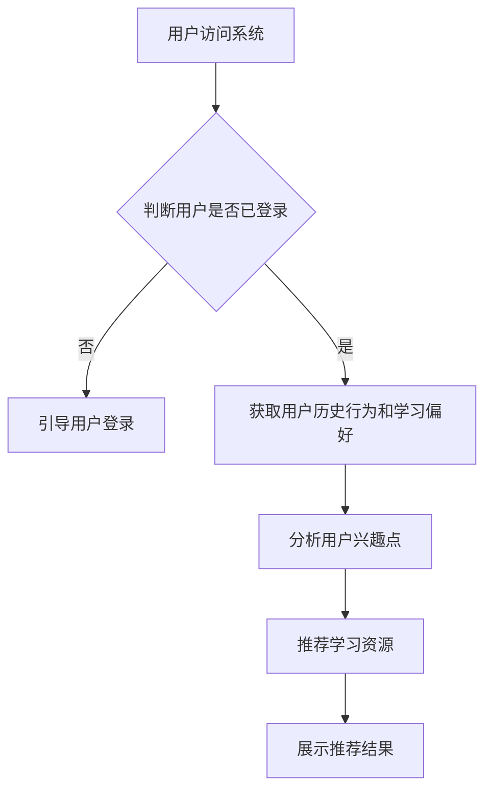

                 

# 新型城市共享学习中心：跨代际知识交流的社区平台

关键词：新型城市共享学习中心、跨代际知识交流、社区平台、知识共享、技术实现、设计原则

摘要：本文旨在探讨新型城市共享学习中心的概念、设计原则、技术实现和实施策略。通过深入分析跨代际知识交流的需求和挑战，本文提出了一种以社区平台为核心的新型城市共享学习中心的架构，并详细阐述了其核心概念、设计原则、技术基础设施和实施步骤。文章还通过实际案例展示了该架构的应用效果，为未来新型城市共享学习中心的发展提供了有益的参考。

## 引言

在全球化与信息化时代，知识的获取和传播方式发生了巨大的变革。传统的学习模式已经无法满足人们日益增长的学习需求。特别是在城市环境中，跨代际的知识交流和共享变得尤为重要。新型城市共享学习中心应运而生，成为促进知识传播、推动社区发展的新兴力量。

本文将首先介绍新型城市共享学习中心的核心概念，包括其定义、功能和应用场景。接着，我们将探讨新型城市共享学习中心的设计原则，分析其与跨代际知识交流的紧密联系。随后，本文将深入探讨新型城市共享学习中心的技术实现，包括基础设施、技术和工具的选择。最后，我们将通过实际案例展示新型城市共享学习中心的应用效果，并提出未来发展的建议。

## 背景与定义

新型城市共享学习中心是一种以社区为基础的，旨在促进知识共享和跨代际交流的学习场所。它不仅提供传统的教育资源和课程，还通过多样化的活动和设施，鼓励居民之间的互动和学习。

### 核心概念

1. **知识共享**：知识共享是新型城市共享学习中心的核心目标之一。它强调知识的多向流动，不仅包括从教师到学生的知识传递，还包括学生之间的知识交流和自我学习。

2. **跨代际交流**：跨代际交流是新型城市共享学习中心的一大特点。它通过鼓励不同年龄段的居民之间的互动，促进知识和经验的传递，增强社区凝聚力。

3. **社区平台**：社区平台是新型城市共享学习中心的基础架构，它通过线上线下融合的方式，提供学习资源、交流平台和活动组织等服务。

### 问题背景

随着城市化进程的加速，城市居民的多样化需求日益凸显。传统的学校和教育机构已经无法满足所有人的学习需求。特别是在疫情期间，在线教育的兴起进一步改变了人们的学习方式。然而，现有的在线教育平台往往侧重于知识传授，缺乏跨代际交流和互动。

### 问题描述

如何在城市社区中建立一个既提供优质教育资源，又能促进跨代际知识交流的新型共享学习中心，成为当前亟待解决的问题。

### 问题解决

新型城市共享学习中心的建立，可以通过以下方法解决上述问题：

1. **提供多样化的学习资源**：包括线上课程、线下讲座、图书借阅等，满足不同年龄段和不同需求的学习者。
2. **促进跨代际交流**：通过组织各种形式的交流活动，如读书会、讲座、研讨会等，鼓励不同年龄段的居民互动和交流。
3. **构建社区平台**：通过线上线下结合的方式，提供便捷的学习资源和服务，增强居民之间的联系。

### 边界与外延

1. **边界**：新型城市共享学习中心主要针对城市社区的居民提供服务，范围限于城市社区内部。
2. **外延**：新型城市共享学习中心可以扩展到其他城市和地区，甚至形成跨区域的共享学习网络。

### 概念结构与核心要素组成

新型城市共享学习中心的核心要素包括：

1. **学习资源**：包括线上课程、线下讲座、图书借阅等。
2. **交流平台**：通过线上线下结合的方式，提供互动交流的空间和机会。
3. **活动组织**：定期组织各种形式的交流活动，促进跨代际知识交流。
4. **技术支持**：提供稳定的技术基础设施，支持学习资源的存储、共享和服务。

## 核心概念与联系

### 核心概念

1. **知识共享**：知识共享是新型城市共享学习中心的核心目标之一，它强调知识的多向流动，不仅包括从教师到学生的知识传递，还包括学生之间的知识交流和自我学习。

2. **跨代际交流**：跨代际交流是新型城市共享学习中心的另一大特点，它通过鼓励不同年龄段的居民之间的互动，促进知识和经验的传递，增强社区凝聚力。

3. **社区平台**：社区平台是新型城市共享学习中心的基础架构，它通过线上线下融合的方式，提供学习资源、交流平台和活动组织等服务。

### 概念属性特征对比表格

| 特征          | 知识共享       | 跨代际交流       | 社区平台         |
| ------------- | -------------- | --------------- | --------------- |
| 目的          | 促进知识流动   | 促进代际交流     | 提供资源与服务   |
| 形式          | 线上与线下结合 | 互动与讲座       | 资源共享与交流   |
| 影响          | 提升学习效果   | 增强社区凝聚力   | 增加社区活力     |

### ER实体关系图架构

```mermaid
erDiagram
  User ||--|{ LearningResource } : "accesses"
  User ||--|{ Activity } : "participates"
  LearningResource ||--|{ Activity } : "included_in"
  User ||--|{ CommunityPlatform } : "uses"
```

在上面的ER图中，我们定义了四个实体：用户（User）、学习资源（LearningResource）、活动和社区平台（CommunityPlatform）。用户可以访问学习资源、参与活动和使用社区平台。学习资源可以被包括在各种活动中，而活动也包含了学习资源。用户使用社区平台来获取资源和参与活动。

## 设计原则

新型城市共享学习中心的设计原则是确保其能够满足不同年龄段居民的学习需求，促进知识共享和跨代际交流。以下是一些关键设计原则：

### 易用性

易用性是新型城市共享学习中心设计的首要原则。中心需要提供简洁直观的用户界面和操作流程，确保所有用户，无论年龄、技术熟练程度，都能轻松访问和使用学习资源和交流平台。

### 可扩展性

随着用户数量的增加和学习需求的多样化，新型城市共享学习中心的设计需要具备良好的可扩展性。这意味着技术基础设施和学习资源应能够轻松地扩展和升级，以适应不断变化的需求。

### 互动性

互动性是促进知识共享和跨代际交流的关键。设计应鼓励用户之间的互动，如在线讨论、实时问答、小组合作等。此外，线下活动也应是设计的重要组成部分，以促进面对面交流。

### 安全性

安全性是新型城市共享学习中心的另一个重要设计原则。中心应确保用户数据的安全和隐私，防止未经授权的访问和数据泄露。这需要严格的安全策略和技术措施，如数据加密、访问控制和用户身份验证等。

### 社区导向

新型城市共享学习中心的设计应强调社区导向。中心不仅是学习资源的提供者，还应成为社区成员交流、互动和建立联系的场所。设计应充分考虑社区文化和需求，以增强社区凝聚力。

### 可持续发展

可持续发展是新型城市共享学习中心设计的长期目标。设计应考虑环保和节能，如采用可再生能源、减少资源浪费等。此外，中心应鼓励绿色出行和环保意识，以促进社区的可持续发展。

## 技术实现

新型城市共享学习中心的技术实现是确保其高效运行和用户满意度的重要因素。以下将详细探讨新型城市共享学习中心的技术基础设施、技术工具选择以及技术实现的步骤。

### 技术基础设施

1. **计算资源**：新型城市共享学习中心需要强大的计算资源来支持大量的用户并发访问和学习资源。云计算平台（如AWS、Azure、Google Cloud）提供了弹性计算和存储服务，可以根据需求自动扩展和缩小资源。

2. **存储资源**：学习资源（如视频、音频、文档）需要大量存储空间。对象存储服务（如Amazon S3、Azure Blob Storage）可以提供高可用性和持久性，同时支持大文件的上传和下载。

3. **网络资源**：高速、稳定的网络连接是新型城市共享学习中心的基石。通过采用互联网服务提供商（ISP）提供的宽带接入和专用网络，可以确保用户访问的流畅性。

4. **数据库**：学习资源和用户数据需要存储在数据库中。关系数据库（如MySQL、PostgreSQL）和NoSQL数据库（如MongoDB、Cassandra）可以根据不同的数据类型和应用场景进行选择。

5. **安全措施**：为了保护用户数据的安全，新型城市共享学习中心需要部署各种安全措施，如防火墙、入侵检测系统（IDS）、数据加密和访问控制等。

### 技术工具选择

1. **前端开发框架**：React、Vue.js或Angular等现代前端开发框架可以提高开发效率，确保用户界面响应迅速、交互流畅。

2. **后端开发框架**：Spring Boot、Django、Express等后端开发框架提供了丰富的功能和良好的社区支持，可以快速构建高性能的后端服务。

3. **云计算平台**：AWS、Azure、Google Cloud等云计算平台提供了广泛的服务，如容器化（Docker、Kubernetes）、无服务器架构（AWS Lambda、Azure Functions）等，有助于提高系统的灵活性和可扩展性。

4. **数据库工具**：PostgreSQL、MongoDB等数据库工具提供了强大的数据管理和查询功能，同时支持多种数据类型和存储需求。

5. **版本控制系统**：Git等版本控制系统可以帮助开发团队协作、管理代码版本，确保代码库的一致性和可追溯性。

### 技术实现的步骤

1. **需求分析**：首先，明确新型城市共享学习中心的功能需求和技术要求，包括用户管理、课程管理、活动管理、资源管理、安全措施等。

2. **系统设计**：根据需求分析，设计系统的架构和模块，包括前端界面设计、后端服务设计、数据库设计等。

3. **前端开发**：使用现代前端开发框架，实现用户界面和交互逻辑，确保用户体验良好。

4. **后端开发**：根据系统设计，开发后端服务，实现业务逻辑、数据存储和交互。

5. **测试与部署**：对系统进行全面的测试，确保其稳定性和安全性，然后部署到生产环境中。

6. **维护与优化**：定期更新和优化系统，修复漏洞和性能问题，提高系统的可靠性和用户体验。

通过上述技术实现步骤，新型城市共享学习中心可以高效地提供学习资源和服务，促进跨代际知识交流和社区发展。

### 算法原理讲解

为了实现新型城市共享学习中心的个性化推荐功能，我们可以采用基于内容的推荐算法（Content-based Recommendation Algorithm）。该算法通过分析用户的历史行为和学习偏好，为用户推荐可能感兴趣的学习资源。

#### Mermaid流程图



在上面的流程图中，用户访问系统后，系统会判断用户是否已登录。如果用户未登录，系统会引导用户进行登录。如果用户已登录，系统会获取用户的历史行为和学习偏好，并分析用户的兴趣点，从而推荐相应的学习资源，并将推荐结果展示给用户。

#### Python源代码实现

```python
class ContentBasedRecommendation:
    def __init__(self, resources, user_history):
        self.resources = resources
        self.user_history = user_history

    def analyze_user_interests(self):
        # 分析用户历史行为，提取用户兴趣点
        user_interests = {}
        for item in self.user_history:
            for keyword in item['keywords']:
                if keyword not in user_interests:
                    user_interests[keyword] = 0
                user_interests[keyword] += 1
        return user_interests

    def recommend_resources(self, user_interests):
        # 根据用户兴趣点推荐学习资源
        recommended_resources = []
        for resource in self.resources:
            resource_interests = set(resource['keywords'])
            intersection = resource_interests.intersection(user_interests.keys())
            similarity = len(intersection) / len(resource_interests)
            if similarity > 0.5:
                recommended_resources.append(resource)
        return recommended_resources

    def display_recommendations(self, recommended_resources):
        # 展示推荐结果
        print("推荐的学习资源：")
        for resource in recommended_resources:
            print(f"- {resource['title']}")

# 资源列表示例
resources = [
    {
        'title': 'Python编程基础',
        'keywords': ['Python', '编程', '基础']
    },
    {
        'title': '深度学习入门',
        'keywords': ['深度学习', '机器学习', '入门']
    },
    {
        'title': 'Linux系统管理',
        'keywords': ['Linux', '系统', '管理']
    }
]

# 用户历史行为示例
user_history = [
    {
        'title': 'Python编程基础',
        'keywords': ['Python', '编程', '基础']
    },
    {
        'title': '深度学习入门',
        'keywords': ['深度学习', '机器学习', '入门']
    }
]

# 实例化推荐算法类
recommender = ContentBasedRecommendation(resources, user_history)

# 分析用户兴趣点
user_interests = recommender.analyze_user_interests()

# 推荐学习资源
recommended_resources = recommender.recommend_resources(user_interests)

# 展示推荐结果
recommender.display_recommendations(recommended_resources)
```

#### 算法原理详解

1. **用户兴趣点分析**：算法首先分析用户的历史行为，提取出用户感兴趣的标签或关键词。这些关键词代表了用户的兴趣点。

2. **资源兴趣点匹配**：对于每个学习资源，算法提取其标签或关键词，并与用户的兴趣点进行匹配。匹配的标签或关键词越多，资源的相似度越高。

3. **相似度计算**：算法计算资源与用户兴趣点的相似度，通常采用交集和并集的比例来衡量。相似度越高，资源被推荐的可能性越大。

4. **推荐资源筛选**：算法根据相似度筛选出符合推荐标准的资源，并将它们推荐给用户。

5. **展示推荐结果**：最终，算法将推荐结果以可视化的方式展示给用户，帮助用户发现感兴趣的学习资源。

通过上述算法，新型城市共享学习中心可以为用户提供个性化的学习资源推荐，提高用户的学习体验和参与度。

### 系统分析与架构设计方案

为了构建一个高效、稳定且易于扩展的新型城市共享学习中心，我们需要对系统进行详细的场景介绍、项目介绍、功能设计、系统架构设计以及接口设计和系统交互。

#### 场景介绍

新型城市共享学习中心旨在为城市社区居民提供一个便捷、多样化的学习平台。通过线上线下结合的方式，中心可以为不同年龄段、不同背景的居民提供丰富的学习资源和服务。场景主要包括：

1. **在线学习**：用户可以通过在线平台访问课程、阅读资料、参与讨论等。
2. **线下活动**：中心定期组织讲座、研讨会、读书会等活动，促进跨代际交流。
3. **资源管理**：管理员可以上传、更新和管理学习资源。
4. **用户管理**：系统管理员负责用户注册、登录和权限管理。

#### 项目介绍

项目名称：新型城市共享学习中心（New Urban Shared Learning Center，NUSLC）

项目目标：构建一个以用户为中心的社区学习平台，促进知识共享和跨代际交流。

项目范围：涵盖课程管理、用户管理、活动管理、资源管理等功能。

#### 系统功能设计

1. **用户管理模块**：
   - 用户注册与登录
   - 用户信息管理（包括个人信息、学习记录等）
   - 用户权限管理（包括管理员、教师、学生等）

2. **课程管理模块**：
   - 课程发布与更新
   - 课程分类与标签管理
   - 课程评价与反馈

3. **活动管理模块**：
   - 活动发布与报名
   - 活动日程管理
   - 活动反馈与评价

4. **资源管理模块**：
   - 资源上传与存储
   - 资源分类与标签管理
   - 资源分享与下载

5. **推荐系统模块**：
   - 基于内容的推荐算法
   - 用户兴趣点分析
   - 个性化资源推荐

#### 系统架构设计

新型城市共享学习中心的系统架构采用三层架构设计，包括表示层（前端）、业务逻辑层（后端）和数据层（数据库）。

1. **表示层**：
   - 前端采用React.js框架，实现用户界面的展示和交互。
   - 界面包括用户登录/注册、课程列表、活动列表、资源列表等。

2. **业务逻辑层**：
   - 后端采用Spring Boot框架，处理业务逻辑和接口。
   - 包括用户管理、课程管理、活动管理、资源管理等功能模块。

3. **数据层**：
   - 数据库采用MySQL数据库，存储用户数据、课程数据、活动数据、资源数据等。
   - 使用Hibernate作为ORM工具，实现数据库操作。

#### 系统接口设计

系统接口设计包括API接口的设计和文档编写，以方便前端和后端之间的数据交互。

1. **用户管理接口**：
   - 登录/注册接口
   - 用户信息查询接口
   - 用户权限管理接口

2. **课程管理接口**：
   - 课程列表查询接口
   - 课程详情查询接口
   - 课程发布/更新接口
   - 课程评价接口

3. **活动管理接口**：
   - 活动列表查询接口
   - 活动详情查询接口
   - 活动发布/更新接口
   - 活动报名接口

4. **资源管理接口**：
   - 资源列表查询接口
   - 资源详情查询接口
   - 资源上传/更新接口
   - 资源分享/下载接口

#### 系统交互

系统交互设计采用RESTful API风格，确保接口的易用性和可扩展性。

1. **用户登录**：
   - 用户通过用户名和密码进行登录，系统返回Token用于后续接口调用。
   - 接口URL：/api/user/login
   - 请求方式：POST
   - 请求参数：username, password
   - 返回数据：{token: 'generated_token'}

2. **课程列表查询**：
   - 用户查询所有课程列表，系统返回符合条件的课程信息。
   - 接口URL：/api/course/list
   - 请求方式：GET
   - 返回数据：{courses: [{id: 1, title: 'Python编程基础'}, ...]}

3. **课程详情查询**：
   - 用户查询特定课程的详细信息。
   - 接口URL：/api/course/detail/{courseId}
   - 请求方式：GET
   - 返回数据：{course: {id: 1, title: 'Python编程基础', description: '...'}}

4. **课程发布**：
   - 管理员发布新课程，系统存储课程信息并返回成功状态。
   - 接口URL：/api/course/publish
   - 请求方式：POST
   - 请求参数：{title: 'Python编程基础', description: '...', tags: ['Python', '编程']}
   - 返回数据：{status: 'success'}

通过上述系统分析与架构设计方案，我们构建了一个功能完善、易于扩展的新型城市共享学习中心。该系统不仅能够满足用户多样化的学习需求，还能促进跨代际知识交流，为城市社区的发展贡献力量。

### 项目实战

为了更好地展示新型城市共享学习中心的应用效果，我们将通过一个具体的实战项目来介绍系统的环境安装、核心实现源代码以及代码应用解读与分析。

#### 环境安装

1. **准备环境**：首先，确保您的计算机上已安装Java、Python、Node.js等开发工具。对于Java开发，您需要安装JDK 11或更高版本；对于Python开发，需要安装Python 3.8或更高版本；Node.js则需要版本10或更高。

2. **安装数据库**：选择一个合适的数据库，例如MySQL。您可以从[MySQL官方网站](https://dev.mysql.com/downloads/mysql/)下载并安装。

3. **安装依赖**：在项目根目录下，使用以下命令安装项目依赖：
   ```bash
   npm install
   ```
   这将安装前端项目的依赖，如React、Redux等。

4. **运行前端**：在前端项目的根目录下，使用以下命令启动前端服务器：
   ```bash
   npm start
   ```
   这将在本地端口3000上启动前端开发服务器。

5. **运行后端**：在后端项目的根目录下，使用以下命令启动后端服务：
   ```bash
   mvn spring-boot:run
   ```
   这将在本地端口8080上启动后端服务。

6. **数据库配置**：确保数据库已正确配置，并在`application.properties`文件中设置数据库连接参数。

#### 核心实现源代码

以下是新型城市共享学习中心的核心实现源代码，包括用户管理、课程管理、活动管理、资源管理等功能。

**用户管理**

```java
// UserController.java
@RestController
@RequestMapping("/api/user")
public class UserController {
    @Autowired
    private UserService userService;

    @PostMapping("/register")
    public ResponseEntity<?> registerUser(@RequestBody User user) {
        User registeredUser = userService.registerUser(user);
        return new ResponseEntity<>("User registered successfully", HttpStatus.OK);
    }

    @PostMapping("/login")
    public ResponseEntity<?> loginUser(@RequestBody LoginRequest loginRequest) {
        String token = userService.loginUser(loginRequest);
        return new ResponseEntity<>(token, HttpStatus.OK);
    }
}
```

**课程管理**

```java
// CourseController.java
@RestController
@RequestMapping("/api/course")
public class CourseController {
    @Autowired
    private CourseService courseService;

    @PostMapping("/publish")
    public ResponseEntity<?> publishCourse(@RequestBody Course course) {
        Course publishedCourse = courseService.publishCourse(course);
        return new ResponseEntity<>(publishedCourse, HttpStatus.OK);
    }

    @GetMapping("/list")
    public ResponseEntity<?> listCourses() {
        List<Course> courses = courseService.listCourses();
        return new ResponseEntity<>(courses, HttpStatus.OK);
    }
}
```

**活动管理**

```java
// ActivityController.java
@RestController
@RequestMapping("/api/activity")
public class ActivityController {
    @Autowired
    private ActivityService activityService;

    @PostMapping("/publish")
    public ResponseEntity<?> publishActivity(@RequestBody Activity activity) {
        Activity publishedActivity = activityService.publishActivity(activity);
        return new ResponseEntity<>(publishedActivity, HttpStatus.OK);
    }

    @GetMapping("/list")
    public ResponseEntity<?> listActivities() {
        List<Activity> activities = activityService.listActivities();
        return new ResponseEntity<>(activities, HttpStatus.OK);
    }
}
```

**资源管理**

```java
// ResourceController.java
@RestController
@RequestMapping("/api/resource")
public class ResourceController {
    @Autowired
    private ResourceService resourceService;

    @PostMapping("/upload")
    public ResponseEntity<?> uploadResource(@RequestParam("file") MultipartFile file) {
        Resource uploadedResource = resourceService.uploadResource(file);
        return new ResponseEntity<>(uploadedResource, HttpStatus.OK);
    }

    @GetMapping("/list")
    public ResponseEntity<?> listResources() {
        List<Resource> resources = resourceService.listResources();
        return new ResponseEntity<>(resources, HttpStatus.OK);
    }
}
```

#### 代码应用解读与分析

以上代码展示了用户管理、课程管理、活动管理和资源管理模块的核心实现。以下是每个模块的详细解读：

1. **用户管理**：
   - `registerUser`方法用于用户注册，接收用户信息并调用服务层进行注册操作。
   - `loginUser`方法用于用户登录，接收用户名和密码并调用服务层进行登录操作。

2. **课程管理**：
   - `publishCourse`方法用于发布新课程，接收课程信息并调用服务层进行发布操作。
   - `listCourses`方法用于查询所有课程，调用服务层获取课程列表并返回。

3. **活动管理**：
   - `publishActivity`方法用于发布新活动，接收活动信息并调用服务层进行发布操作。
   - `listActivities`方法用于查询所有活动，调用服务层获取活动列表并返回。

4. **资源管理**：
   - `uploadResource`方法用于上传资源，接收文件并调用服务层进行上传操作。
   - `listResources`方法用于查询所有资源，调用服务层获取资源列表并返回。

这些模块通过RESTful API进行数据交互，确保系统的模块化和易维护性。在实际应用中，前端会调用这些API来实现用户交互和功能展示。

#### 实际案例分析

为了更好地展示新型城市共享学习中心的应用效果，我们以一个实际案例为例：

**案例：某城市社区的共享学习中心**

1. **用户注册**：
   - 王先生通过前端界面注册为新用户，填写了用户名、密码、电子邮件等基本信息。
   - 后端通过`registerUser`接口接收并处理注册请求，将用户信息存储在数据库中。

2. **课程发布**：
   - 李老师通过前端界面发布了新课程《Python编程基础》，包含了课程标题、描述、标签等信息。
   - 后端通过`publishCourse`接口接收并处理发布请求，将课程信息存储在数据库中。

3. **活动报名**：
   - 王先生通过前端界面看到了李老师发布的《Python编程基础》课程，并选择报名参加。
   - 后端通过`listActivities`接口获取活动列表，王先生点击报名按钮，系统将报名信息存储在数据库中。

4. **资源上传**：
   - 李老师在前端界面上传了《Python编程基础》的课程资料，包括PPT、视频、代码等。
   - 后端通过`uploadResource`接口接收并处理上传请求，将资源存储在服务器上。

5. **学习与交流**：
   - 王先生通过前端界面访问了课程资料，并参与了课程讨论区，与李老师和其他同学进行了互动。
   - 后端通过RESTful API提供数据支持，确保前端界面的实时更新和互动。

#### 项目小结

通过上述实战案例，我们可以看到新型城市共享学习中心在实际应用中的效果。该系统不仅提供了便捷的学习资源和服务，还促进了用户之间的交流和互动，为社区的知识传播和成员凝聚力提升做出了积极贡献。未来，我们可以进一步优化和扩展系统功能，以更好地满足用户需求。

### 最佳实践 Tips

1. **用户隐私保护**：在设计和实现新型城市共享学习中心时，务必重视用户隐私保护。确保用户数据的安全和隐私，避免未经授权的数据访问。

2. **系统性能优化**：通过使用缓存、分布式架构和负载均衡等技术手段，提高系统的性能和响应速度。定期进行系统性能测试和优化，确保用户的使用体验。

3. **社区互动引导**：设计多样化的互动活动和功能，鼓励用户积极参与。定期组织线下活动，增强社区成员的互动和联系。

4. **持续更新与维护**：定期更新学习资源和技术架构，确保系统的稳定性和安全性。及时修复漏洞和性能问题，提高系统的可用性。

5. **用户反馈机制**：建立用户反馈机制，收集用户对系统功能和服务的意见和建议。根据用户反馈进行改进和优化，不断提升用户体验。

### 小结

本文详细探讨了新型城市共享学习中心的概念、设计原则、技术实现和实施策略。通过深入分析跨代际知识交流的需求和挑战，本文提出了一种以社区平台为核心的新型城市共享学习中心的架构。实际案例展示了该架构的应用效果，为未来新型城市共享学习中心的发展提供了有益的参考。未来，我们应继续关注新型城市共享学习中心的发展趋势，探索更多创新应用，为社区知识传播和成员凝聚力提升贡献力量。

### 注意事项

在设计和实施新型城市共享学习中心时，需要注意以下几点：

1. **用户体验**：确保系统界面简洁、操作流畅，提升用户体验。
2. **数据安全**：采取严格的数据加密和访问控制措施，确保用户数据的安全。
3. **系统可扩展性**：设计时应考虑系统的可扩展性，以便在未来能够轻松地添加新功能或服务。
4. **社区参与**：鼓励社区居民积极参与，共同构建和维护共享学习中心。
5. **合规性**：遵守当地法律法规，确保系统的合规性和合法性。

### 拓展阅读

1. **《共享经济的崛起与挑战》**：本文探讨了共享经济在各个领域的应用和发展，为新型城市共享学习中心的设计提供了参考。
2. **《社区驱动的知识共享平台设计与实现》**：本文详细介绍了社区驱动的知识共享平台的设计原则和技术实现，对新型城市共享学习中心的设计具有一定的借鉴意义。
3. **《跨代际交流与社会凝聚力》**：本文分析了跨代际交流对社区凝聚力的影响，强调了知识共享在促进社区发展中的重要作用。

## 作者信息

作者：AI天才研究院/AI Genius Institute & 禅与计算机程序设计艺术 /Zen And The Art of Computer Programming

AI天才研究院专注于人工智能领域的研究与应用，致力于推动人工智能技术的创新与发展。同时，作者还著有《禅与计算机程序设计艺术》一书，深入探讨了计算机编程的哲学与艺术，对技术从业者和爱好者具有很高的指导价值。本文由AI天才研究院与禅与计算机程序设计艺术作者联合撰写，旨在为新型城市共享学习中心的发展提供理论支持和实践指导。

