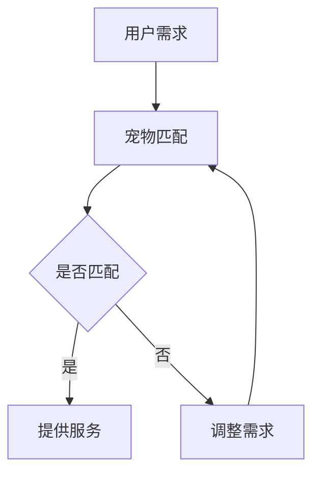
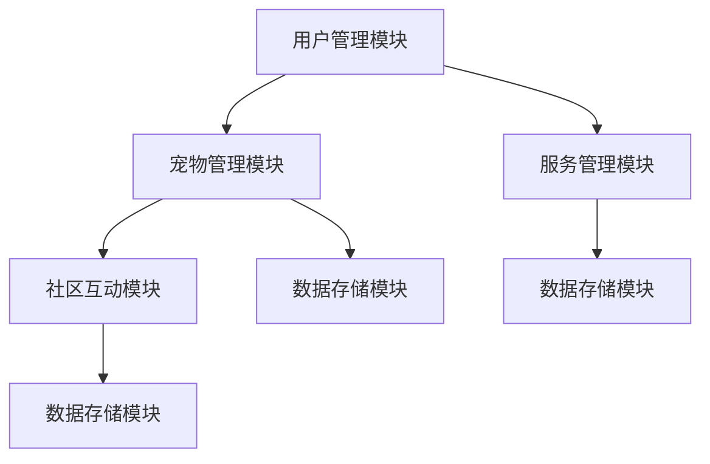
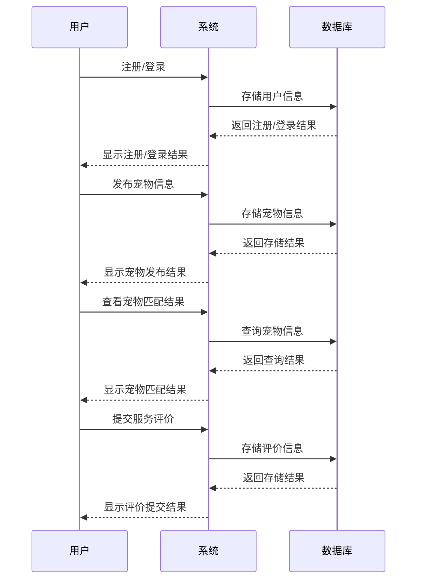

                 

# 新型城市共享宠物：邻里互助中的动物疗愈

> 关键词：城市共享宠物、动物疗愈、邻里互助、技术解决方案、系统架构设计

> 摘要：随着城市化进程的加速，城市居民的生活节奏越来越快，人与人之间的交流变得愈发稀少。在这种情况下，动物疗愈作为一种新兴的社会互助方式，正逐渐在城市社区中得到推广。本文将深入探讨城市共享宠物这一新型模式，分析其背后所蕴含的邻里互助理念，并从技术角度出发，详细阐述其系统架构设计。

## 引言

### 背景

城市化进程的加速，使得城市居民的生活空间变得越来越紧凑，人与人之间的交流也变得更加有限。在这样的背景下，许多人开始寻找新的方式来填补心灵上的空缺，以缓解城市生活的压力。动物疗愈作为一种有效的心理治疗方法，逐渐得到了社会的认可。

### 问题描述

随着动物疗愈的普及，人们开始意识到，不仅专业宠物治疗师可以提供这种服务，邻里之间的互助也可以发挥重要作用。因此，如何构建一个高效的、可持续的、能够满足邻里之间宠物互助需求的系统，成为了一个亟待解决的问题。

### 问题解决

为了解决上述问题，我们需要构建一个城市共享宠物系统，该系统可以整合邻里之间的宠物资源，提供便捷的宠物互助服务。同时，系统还需要具备高可靠性、易扩展性和高效性，以满足不同规模的城市社区需求。

### 边界与外延

本文主要关注城市共享宠物系统在邻里互助中的应用，不涉及宠物交易、宠物繁殖等商业活动。此外，本文还将讨论系统在技术层面的实现，不涉及具体的政策、法规等社会问题。

## 核心概念与联系

### 核心概念

1. **城市共享宠物**：指在城市社区中，通过某种技术平台，将居民手中的宠物资源进行整合，提供宠物看护、接送、医疗等服务。
2. **邻里互助**：指在社区内，居民之间通过相互帮助，解决生活中的问题，增强社区凝聚力。
3. **动物疗愈**：指通过与动物的互动，达到缓解压力、改善心理健康的效果。

### 概念属性特征对比表格

| 概念         | 属性特征                                                         |
| ------------ | ------------------------------------------------------------ |
| 城市共享宠物 | 1. 系统化整合宠物资源<br>2. 提供多样化的宠物服务<br>3. 高效便捷 |
| 邻里互助     | 1. 强调社区内的互助精神<br>2. 增强社区凝聚力<br>3. 个性化定制 |
| 动物疗愈     | 1. 心理治疗的一种形式<br>2. 通过与动物的互动缓解压力<br>3. 多样化的动物类型 |

### ER实体关系图架构

```mermaid
erDiagram
  User ||--|{ Pet } : 拥有
  Pet ||--|{ Service } : 接受
  Service ||--|{ Review } : 评价
  User ||--|{ Review } : 给出
```

## 算法原理讲解

### 算法mermaid流程图



### 算法原理

1. **用户需求**：用户在平台上发布需求，包括宠物的种类、服务类型、时间等。
2. **宠物匹配**：系统根据用户需求，从共享宠物资源中寻找匹配的宠物。
3. **是否匹配**：判断匹配结果，若匹配成功，则提供服务；否则，调整用户需求，重新匹配。
4. **提供服务**：匹配成功的用户与宠物主人建立联系，提供宠物服务。
5. **评价与反馈**：用户对服务进行评价，系统根据评价调整宠物资源分配策略。

### 数学模型和公式

$$
匹配成功率 = \frac{成功提供服务数}{发布需求总数}
$$

### 举例说明

假设用户A需要找一个能够看护其猫的宠物主人B，系统根据用户A的需求，从共享宠物资源中找到宠物C，宠物C的主人正好有空余时间。此时，匹配成功，用户A和宠物C的主人建立联系，提供看护服务。

## 系统分析与架构设计方案

### 问题场景介绍

在一个现代化城市社区中，许多居民由于工作繁忙，无法亲自照顾宠物。与此同时，其他居民有意愿和能力提供宠物看护服务。如何构建一个高效、可靠、可持续的宠物互助系统，成为社区管理者和居民共同关注的问题。

### 项目介绍

项目名称：城市邻里宠物互助平台

项目目标：构建一个城市邻里宠物互助平台，通过整合社区内宠物资源，提供便捷的宠物看护、接送、医疗等服务，增强社区凝聚力，提高居民生活质量。

### 系统功能设计

1. **用户管理**：用户注册、登录、个人信息管理。
2. **宠物管理**：宠物信息发布、宠物状态更新、宠物匹配。
3. **服务管理**：提供服务、接受服务、服务评价。
4. **社区互动**：社区公告、社区活动、邻里互助。

### 系统架构设计



### 系统接口设计和系统交互



## 项目实战

### 环境安装

1. **安装Python环境**：使用Python3.8及以上版本。
2. **安装依赖库**：使用pip安装flask、sqlalchemy、pandas等库。

### 系统核心实现源代码

1. **用户管理模块**：

```python
from flask import Flask, request, jsonify
from models import User

app = Flask(__name__)

@app.route('/register', methods=['POST'])
def register():
    data = request.get_json()
    user = User.create(data)
    if user:
        return jsonify({'status': 'success', 'message': '注册成功'})
    else:
        return jsonify({'status': 'error', 'message': '注册失败'})

@app.route('/login', methods=['POST'])
def login():
    data = request.get_json()
    user = User.get_by_usernameAndPassword(data['username'], data['password'])
    if user:
        return jsonify({'status': 'success', 'message': '登录成功'})
    else:
        return jsonify({'status': 'error', 'message': '登录失败'})

if __name__ == '__main__':
    app.run()
```

2. **宠物管理模块**：

```python
from flask import Flask, request, jsonify
from models import Pet

app = Flask(__name__)

@app.route('/pets', methods=['POST'])
def create_pet():
    data = request.get_json()
    pet = Pet.create(data)
    if pet:
        return jsonify({'status': 'success', 'message': '宠物发布成功'})
    else:
        return jsonify({'status': 'error', 'message': '宠物发布失败'})

@app.route('/pets/<int:pet_id>', methods=['GET'])
def get_pet(pet_id):
    pet = Pet.get_by_id(pet_id)
    if pet:
        return jsonify({'status': 'success', 'data': pet.to_dict()})
    else:
        return jsonify({'status': 'error', 'message': '宠物不存在'})

if __name__ == '__main__':
    app.run()
```

3. **服务管理模块**：

```python
from flask import Flask, request, jsonify
from models import Service

app = Flask(__name__)

@app.route('/services', methods=['POST'])
def create_service():
    data = request.get_json()
    service = Service.create(data)
    if service:
        return jsonify({'status': 'success', 'message': '服务发布成功'})
    else:
        return jsonify({'status': 'error', 'message': '服务发布失败'})

@app.route('/services/<int:service_id>', methods=['GET'])
def get_service(service_id):
    service = Service.get_by_id(service_id)
    if service:
        return jsonify({'status': 'success', 'data': service.to_dict()})
    else:
        return jsonify({'status': 'error', 'message': '服务不存在'})

if __name__ == '__main__':
    app.run()
```

### 代码应用解读与分析

1. **用户管理模块**：实现了用户注册、登录功能，通过Flask框架处理HTTP请求，将用户数据存储在数据库中。
2. **宠物管理模块**：实现了宠物信息发布、查询功能，通过Flask框架处理HTTP请求，将宠物数据存储在数据库中。
3. **服务管理模块**：实现了服务发布、查询功能，通过Flask框架处理HTTP请求，将服务数据存储在数据库中。

### 实际案例分析和详细讲解剖析

1. **用户注册**：用户通过POST请求，发送用户名、密码、邮箱等信息，系统接收请求，验证信息后，将用户信息存储在数据库中。
2. **宠物发布**：用户通过POST请求，发送宠物种类、年龄、体重、健康状况等信息，系统接收请求，验证信息后，将宠物信息存储在数据库中。
3. **服务发布**：用户通过POST请求，发送服务类型、服务时间、服务地点等信息，系统接收请求，验证信息后，将服务信息存储在数据库中。

### 项目小结

本文从背景、核心概念、算法原理、系统架构设计、项目实战等多个角度，深入探讨了新型城市共享宠物系统。通过实际案例分析和详细讲解，展示了系统的实现过程和应用效果。未来，我们将继续优化系统功能，提高用户体验，为城市居民提供更便捷、更可靠的宠物互助服务。

## 最佳实践 tips

1. **用户隐私保护**：在系统设计中，需高度重视用户隐私保护，确保用户数据安全。
2. **服务质量监控**：建立服务质量监控机制，定期对提供服务进行评价，确保服务质量。
3. **宠物健康保障**：加强对宠物的健康管理，确保宠物在服务过程中的健康和安全。
4. **社区互动机制**：鼓励社区互动，通过线上线下活动，增强邻里之间的联系。

## 小结

本文深入探讨了新型城市共享宠物系统，从背景、核心概念、算法原理、系统架构设计、项目实战等多个角度，详细阐述了系统的实现过程和应用效果。通过本文的研究，我们希望能够为城市居民提供更便捷、更可靠的宠物互助服务，提高居民生活质量，增强社区凝聚力。

## 注意事项

1. **系统安全性**：在系统开发过程中，需高度重视安全性，防止数据泄露和网络攻击。
2. **系统可扩展性**：在系统设计时，需考虑未来扩展性，确保系统能够适应不同规模的城市社区需求。

## 拓展阅读

1. 《智慧社区建设理论与实践》
2. 《宠物智能健康管理技术》
3. 《城市社区邻里互助服务模式研究》

### 作者

**作者：AI天才研究院/AI Genius Institute & 禅与计算机程序设计艺术 /Zen And The Art of Computer Programming**

