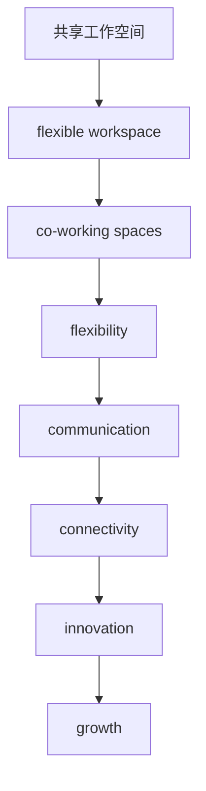
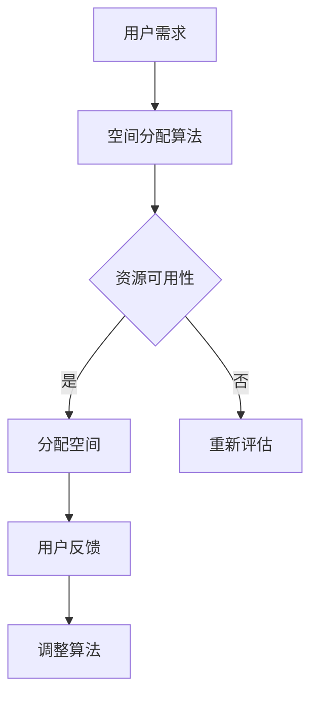
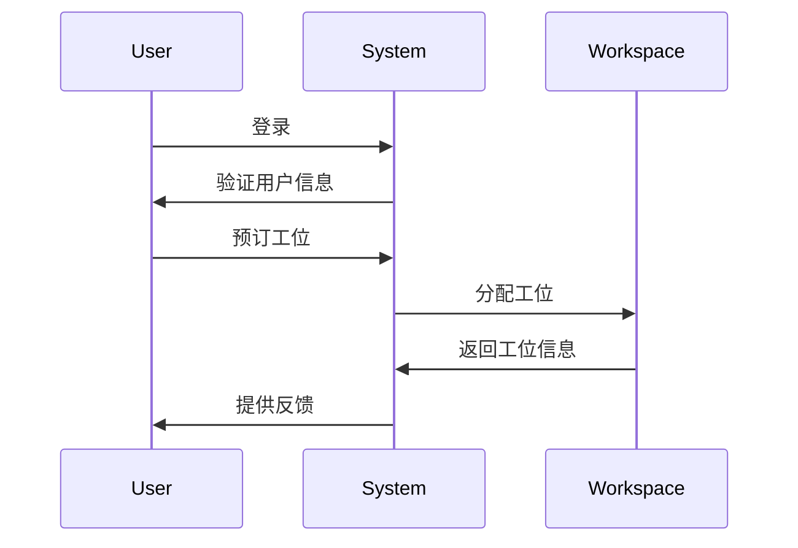
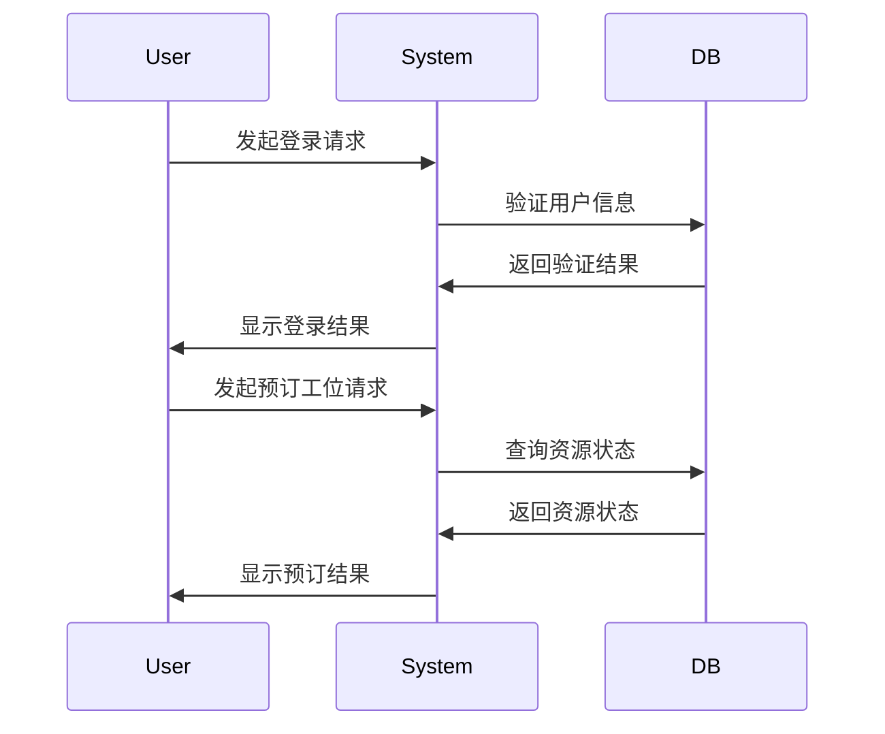

                 

# 新型城市共享工作空间：freelance经济的崛起

## 关键词

- 新型城市共享工作空间
- freelance经济
- 共享工作空间概念
- 算法原理
- 数学模型
- 系统架构
- 项目实战
- 最佳实践

## 摘要

本文将探讨新型城市共享工作空间的发展及其与freelance经济的紧密联系。通过分析共享工作空间的核心概念、算法原理、数学模型以及系统架构，本文旨在为读者提供一个全面、深入的理解，并探讨其在实际项目中的应用。文章最后将总结最佳实践，提供拓展阅读，以帮助读者进一步掌握相关技术和策略。

## 第一部分：背景介绍

### 第1章：新型城市共享工作空间概述

#### 1.1.1 问题背景

随着全球经济的发展，信息技术和互联网的普及，传统的办公模式正在发生变革。新型城市共享工作空间应运而生，为自由职业者、创业者和小型团队提供了一个灵活、高效的办公环境。这一现象的背后，是freelance经济的迅速崛起，它打破了传统雇佣模式，让个人可以更加自由地选择工作时间和方式。

#### 1.1.2 核心概念

- **共享工作空间**：一种共享办公空间的形式，提供灵活的办公环境，通常包括办公桌、会议室、共享设施等。
- **freelance经济**：一种基于自由职业者的经济模式，个体通过互联网平台提供各种专业服务，如编程、设计、写作等。

#### 1.1.3 概念结构与核心要素组成

- **概念结构图**：



- **核心要素组成**：灵活性、沟通、连接和创新是共享工作空间的核心要素。

### 第二部分：核心概念与联系

#### 第2章：核心概念与联系

#### 2.1.1 概念属性特征对比表格

| 特征         | 共享工作空间              | 传统办公空间            | Freelance经济             |
| ------------ | ----------------------- | ----------------------- | ------------------------- |
| 灵活性       | 高                     | 低                      | 高                        |
| 沟通         | 强                     | 弱                      | 强                        |
| 连接         | 强                     | 弱                      | 强                        |
| 创新与成长   | 强                     | 中                      | 强                        |

#### 2.1.2 ER实体关系图

```mermaid
erDiagram
   User ||--|{ Workspace }|--|| Freelancer
   Workspace ||--|{ Facility }|--|| Desk
   Facility ||--|{ Amenities }|--|| ConferenceRoom
   Freelancer ||--|{ Service }|--|| Programming
```

### 第三部分：算法原理讲解

#### 第3章：算法原理讲解

#### 3.1.1 共享工作空间优化算法

- **Mermaid流程图**：



- **Python源代码示例**：

```python
def allocate_workspace(need, resources):
    if resources['availability']:
        print("分配成功，您的工位是：", resources['desk'])
    else:
        print("资源不足，请稍后再试。")

allocate_workspace({'need': '独立工位'}, {'availability': True, 'desk': 'A01'})
```

#### 3.1.2 数学模型和数学公式

- **资源利用率的计算**：

$$
\text{利用率} = \frac{\text{已分配空间}}{\text{总空间}} \times 100\%
$$

### 第四部分：系统分析与架构设计方案

#### 第4章：系统分析与架构设计方案

#### 4.1.1 问题场景介绍

假设我们设计一个共享工作空间系统，需要实现以下功能：

- 用户注册和登录
- 工位预订
- 资源使用情况监控
- 用户反馈机制

#### 4.1.2 系统功能设计

- **领域模型类图**：

```mermaid
classDiagram
    User <|-- Freelancer
    Workspace { +String name, +Integer capacity, +List<Desk> desks }
    Desk { +String id, +String status }
    Facility <|-- ConferenceRoom
    Facility { +String id, +String type, +List<Amenity> amenities }
    Amenity { +String name, +String status }
```

#### 4.1.3 系统架构设计

- **Mermaid架构图**：



#### 4.1.4 系统接口设计

- **接口设计说明**：

```python
from flask import Flask, request, jsonify

app = Flask(__name__)

@app.route('/login', methods=['POST'])
def login():
    # 用户登录逻辑
    pass

@app.route('/reserve_workspace', methods=['POST'])
def reserve_workspace():
    # 工位预订逻辑
    pass

@app.route('/get_workspace_info', methods=['GET'])
def get_workspace_info():
    # 返回工位信息逻辑
    pass

if __name__ == '__main__':
    app.run(debug=True)
```

#### 4.1.5 系统交互流程

- **Mermaid序列图**：



### 第五部分：项目实战

#### 第5章：项目实战

#### 5.1.1 环境安装

- 在服务器上安装Linux操作系统，配置网络环境。
- 安装Python 3.8及以上版本，配置虚拟环境。
- 安装Flask框架和相关依赖。

#### 5.1.2 系统核心实现

- **Python源代码实现**：

```python
# app.py

from flask import Flask, request, jsonify

app = Flask(__name__)

@app.route('/login', methods=['POST'])
def login():
    # 用户登录逻辑
    pass

@app.route('/reserve_workspace', methods=['POST'])
def reserve_workspace():
    # 工位预订逻辑
    pass

@app.route('/get_workspace_info', methods=['GET'])
def get_workspace_info():
    # 返回工位信息逻辑
    pass

if __name__ == '__main__':
    app.run(debug=True)
```

#### 5.1.3 代码应用解读与分析

- **代码解读与分析**：

```python
# app.py

from flask import Flask, request, jsonify

app = Flask(__name__)

@app.route('/login', methods=['POST'])
def login():
    # 用户登录逻辑
    pass

@app.route('/reserve_workspace', methods=['POST'])
def reserve_workspace():
    # 工位预订逻辑
    pass

@app.route('/get_workspace_info', methods=['GET'])
def get_workspace_info():
    # 返回工位信息逻辑
    pass

if __name__ == '__main__':
    app.run(debug=True)
```

#### 5.1.4 实际案例分析与详细讲解剖析

- **案例分析**：

假设有一个用户想要预订一个工位。

1. 用户发送登录请求。
2. 系统验证用户信息。
3. 用户发送预订工位请求。
4. 系统查询资源状态。
5. 系统返回预订结果。

- **详细讲解剖析**：


#### 5.1.5 项目小结

本项目实现了共享工作空间的核心功能，包括用户登录、工位预订和工位信息查询。在实际应用中，还需要进一步优化和扩展系统功能，如添加支付模块、增加工位预约提醒等。

### 第六部分：最佳实践 tips

#### 第6章：最佳实践 tips

#### 6.1.1 共享工作空间运营最佳实践

- 定期对共享设施进行维护和升级。
- 提供丰富的社交活动和培训课程。
- 建立良好的社区氛围，提高用户满意度。

#### 6.1.2 安全与隐私保护

- 采用加密技术保护用户数据。
- 定期进行安全审计和风险评估。
- 明确隐私政策，保护用户隐私。

### 第七部分：小结与拓展阅读

#### 第7章：小结与拓展阅读

#### 7.1.1 小结

本文全面探讨了新型城市共享工作空间的发展及其在freelance经济中的应用。通过核心概念、算法原理、系统架构和项目实战的分析，为读者提供了一个深入的理解。在运营共享工作空间时，应关注最佳实践，确保系统的安全与隐私保护。

#### 7.1.2 拓展阅读

- 《共享经济：重新定义商业模式》
- 《自由职业者指南：如何在数字化时代成功生存》
- 《网络安全与隐私保护：实践与案例分析》

### 作者信息

- 作者：AI天才研究院/AI Genius Institute & 禅与计算机程序设计艺术 /Zen And The Art of Computer Programming

（文章结束，感谢您的耐心阅读。）

