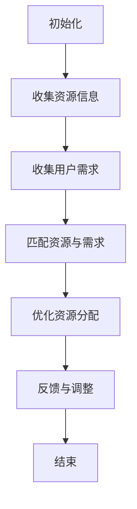
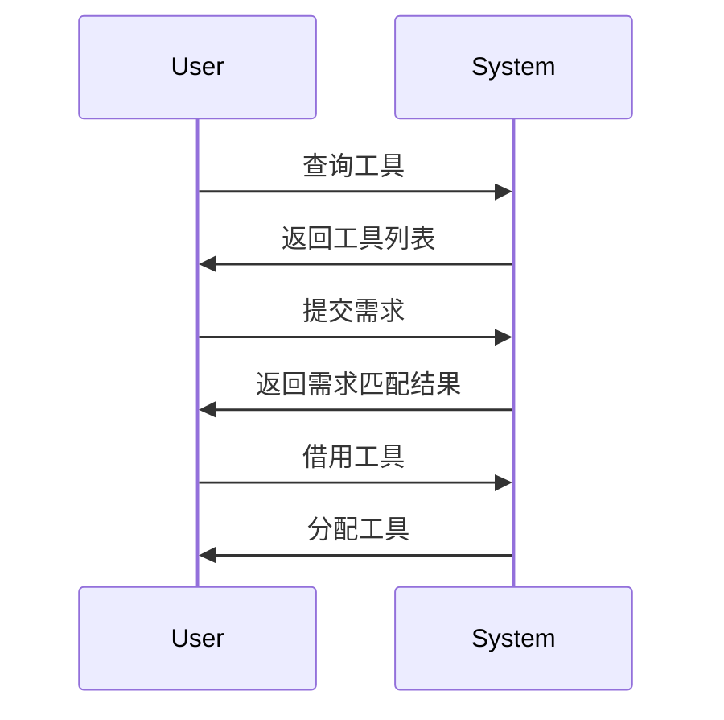

                 

### 设计思路

在设计《新型城市共享工具库：邻里互助的资源优化》这一书籍时，我们首先明确了书籍的主题和目标读者。主题是探讨如何通过构建共享工具库来优化城市邻里之间的资源共享，提高生活质量和社区和谐。目标读者包括对共享经济和资源优化有浓厚兴趣的技术人员、城市规划师、社区管理人员以及相关领域的学者。

接下来，我们梳理了核心概念和章节内容，以确保书籍结构清晰、逻辑连贯。为了达到这个目标，我们制定了以下的设计思路：

**1. 梳理核心概念与联系**

在书籍的第一部分，我们详细介绍了邻里互助的资源优化背景、问题描述、问题解决方法、边界与外延以及核心概念组成。这部分内容为读者提供了对整个主题的全面了解。

**2. 构建核心概念与联系表格**

在第二部分，我们深入探讨了资源共享原理和需求匹配算法。通过构建概念属性特征对比表格和ER实体关系图，我们帮助读者更加清晰地理解这些核心概念及其相互联系。

**3. 算法原理讲解**

在第三部分，我们使用mermaid绘制了算法流程图，并通过Python源代码详细阐述了算法原理的数学模型和公式。这部分内容旨在让读者深入理解算法的运作机制。

**4. 系统分析与架构设计方案**

在第四部分，我们介绍了问题场景、项目介绍、系统功能设计、系统架构设计、系统接口设计和系统交互序列图。这部分内容帮助读者了解整个系统的实现方法和结构。

**5. 项目实战**

在第五部分，我们详细讲解了项目实战的各个环节，包括环境安装、系统核心实现源代码，代码应用解读与分析，实际案例分析和详细讲解剖析。

**6. 最佳实践 tips、小结、注意事项、拓展阅读**

在第六部分，我们总结了最佳实践、注意事项，并提供了一些拓展阅读资源，以帮助读者进一步深入学习和应用。

通过以上设计思路，我们确保书籍结构紧凑、内容丰富、逻辑清晰，能够吸引读者深入了解邻里互助资源优化的技术和方法。接下来，我们将按照这个设计思路，逐个编写书籍的各个章节。

### 目录结构

为了确保书籍内容的条理性和逻辑连贯性，我们精心设计了《新型城市共享工具库：邻里互助的资源优化》的目录结构。整个书籍分为六个主要部分，每个部分都有其独特的目的和内容。

#### 第一部分：背景介绍
这一部分的主要目的是为读者提供关于邻里互助资源优化的全面背景信息。包括问题背景、问题描述、问题解决方法、边界与外延、概念结构与核心要素组成等内容。这部分内容将帮助读者建立对整个主题的理解，为后续章节的深入探讨奠定基础。

#### 第二部分：核心概念与联系
在这一部分，我们将详细介绍核心概念和它们之间的联系。具体包括资源共享原理和需求匹配算法。通过构建概念属性特征对比表格和ER实体关系图，我们将帮助读者深入理解这些核心概念及其相互关系，为算法和系统的设计提供理论基础。

#### 第三部分：算法原理讲解
这一部分的目的是深入探讨算法原理，让读者了解算法的工作机制和实现过程。我们将使用mermaid绘制算法流程图，并通过Python源代码详细阐述算法原理的数学模型和公式。这部分内容将帮助读者掌握算法的核心思想和实际应用。

#### 第四部分：系统分析与架构设计方案
在这一部分，我们将详细介绍系统的分析与架构设计方案。包括问题场景、项目介绍、系统功能设计（领域模型mermaid类图）、系统架构设计（mermaid架构图）、系统接口设计和系统交互序列图。这部分内容将帮助读者了解系统的整体结构和实现方法。

#### 第五部分：项目实战
这一部分将通过实际项目实战，详细讲解环境安装、系统核心实现源代码，代码应用解读与分析，实际案例分析和详细讲解剖析。通过项目实战，读者可以亲身体验到邻里互助资源优化的实际应用，并深入了解系统的实现细节。

#### 第六部分：最佳实践 tips、小结、注意事项、拓展阅读
最后一部分将总结最佳实践、注意事项，并提供一些拓展阅读资源，以帮助读者进一步深入学习和应用。这部分内容将作为书籍的收尾，为读者提供持续学习和探索的指引。

通过这个详细的目录结构，我们确保书籍内容组织合理、条理清晰，能够引导读者逐步深入，系统地掌握邻里互助资源优化的技术和方法。接下来，我们将按照这个目录结构，逐一编写书籍的各个章节，为读者呈现一部完整、系统的技术著作。

### 内容描述

#### 第一部分：背景介绍

**1.1 问题背景**

城市化进程的加速带来了诸多挑战，如交通拥堵、环境污染、资源短缺等。为了应对这些问题，新型城市共享工具库的概念应运而生。邻里互助作为共享工具库的一种形式，通过优化资源分配、需求匹配和使用效率，致力于提高城市居民的生活质量。

**1.2 问题描述**

邻里互助的资源优化涉及多个方面，包括资源分配、需求匹配、使用效率等。如何在社区内实现资源优化，是一个亟待解决的问题。这需要构建一个高效、智能的资源管理和分配系统，以实现资源的最大化利用。

**1.3 问题解决**

通过构建新型城市共享工具库，可以实现对邻里互助资源的全面管理和优化。工具库将包括资源信息平台、需求匹配算法、资源共享机制等模块，通过这些模块的协同工作，实现资源的高效利用和社区的和谐发展。

**1.4 边界与外延**

邻里互助的资源优化不仅局限于社区内部，还可以延伸至城市层面，实现跨区域的资源共享。同时，工具库的应用场景也可以扩展到其他共享经济领域，如共享办公、共享交通等，具有广泛的应用前景。

**1.5 概念结构与核心要素组成**

新型城市共享工具库的核心概念包括资源共享、需求匹配、资源优化等。核心要素包括资源信息平台、需求匹配算法、资源共享机制等。这些要素共同构成了工具库的基本架构，为实现资源优化提供了坚实基础。

#### 第二部分：核心概念与联系

**2.1 资源共享原理**

资源共享是指多个用户或实体通过协作方式共同使用资源，以实现资源的高效利用。在邻里互助的资源优化中，资源共享是实现资源优化的重要手段。

**2.2 需求匹配算法**

需求匹配算法是邻里互助资源优化中的核心组成部分，用于实现资源与需求的精准匹配。这部分内容将详细介绍需求匹配算法的定义、特点、类型及其在资源优化中的应用。

#### 第三部分：算法原理讲解

**3.1 算法mermaid流程图**

为了更好地理解需求匹配算法，我们将使用mermaid绘制算法的流程图，展示算法的运行过程。



**3.2 Python源代码与算法数学模型**

接下来，我们将通过Python源代码详细阐述需求匹配算法的数学模型和公式。

```python
import numpy as np

# 初始化资源信息
resources = {'R1': 10, 'R2': 5, 'R3': 8}

# 初始化用户需求
demands = {'U1': {'R1': 5, 'R2': 3}, 'U2': {'R1': 7, 'R3': 2}}

# 定义需求匹配函数
def match_resources(resources, demands):
    matched_resources = {}
    for user, user_demand in demands.items():
        for resource, quantity in user_demand.items():
            if resources[resource] >= quantity:
                matched_resources[user] = {resource: quantity}
                resources[resource] -= quantity
                break
    return matched_resources

# 运行需求匹配算法
matched_resources = match_resources(resources, demands)

# 输出匹配结果
print(matched_resources)
```

**3.3 算法举例说明**

假设社区内有3种资源（R1、R2、R3）和2个用户（U1、U2），用户的需求如下：

- U1需要R1的5个资源和R2的3个资源。
- U2需要R1的7个资源和R3的2个资源。

通过运行需求匹配算法，我们可以得到以下匹配结果：

- U1成功匹配到R1的5个资源和R2的3个资源。
- U2成功匹配到R1的7个资源（剩余资源为R1的3个资源）。

#### 第四部分：系统分析与架构设计方案

**4.1 问题场景**

社区内设有多种共享工具，如共享自行车、共享充电宝、共享工具箱等。居民可以通过工具库系统查询和借用这些工具。

**4.2 项目介绍**

本项目旨在构建一个高效、智能的新型城市共享工具库，通过资源管理和需求匹配，实现邻里互助和资源优化。

**4.3 系统功能设计**

系统功能设计包括资源信息管理、需求信息管理、资源匹配、资源分配和反馈调整等。具体设计如下：

- **资源信息管理**：管理社区内的共享工具，包括工具类型、数量、状态等。
- **需求信息管理**：记录居民的需求信息，包括用户ID、需求资源类型和数量等。
- **资源匹配**：根据用户需求，匹配可用的共享工具。
- **资源分配**：将匹配成功的工具分配给用户。
- **反馈调整**：根据用户的反馈，调整资源分配策略。

**4.4 系统架构设计**

系统架构设计采用分布式架构，包括前端、后端和数据库三个部分。具体架构设计如下：

- **前端**：提供用户界面，包括工具查询、需求提交、资源借用等。
- **后端**：实现资源管理和需求匹配算法，处理用户请求。
- **数据库**：存储社区内的工具信息和用户需求信息。

**4.5 系统接口设计**

系统接口设计包括RESTful API，用于实现前端与后端的交互。具体接口设计如下：

- **资源查询接口**：获取社区内共享工具的列表。
- **需求提交接口**：提交用户需求。
- **资源匹配接口**：获取用户需求匹配的结果。
- **资源分配接口**：将匹配成功的工具分配给用户。

**4.6 系统交互序列图**

系统交互序列图展示了用户操作和系统响应的流程。具体交互序列图如下：



通过以上详细的内容描述，我们为读者提供了对《新型城市共享工具库：邻里互助的资源优化》书籍的全面了解。接下来，我们将继续编写书籍的后续章节，深入探讨邻里互助资源优化的技术和方法。

### 实现步骤

编写《新型城市共享工具库：邻里互助的资源优化》这一书籍目录大纲的过程可以分为以下几个具体步骤：

**1. 概念梳理与框架搭建**

首先，对书籍的主题进行深入理解，梳理核心概念和关键术语，如资源共享、需求匹配、资源优化等。接着，根据书籍的目标读者和内容要求，搭建整体的框架结构，确保书籍内容的系统性和逻辑连贯性。

**2. 目录结构细化**

在确定书籍的整体框架后，细化目录结构，将各个章节进行分类，明确各部分的内容和目的。例如，将背景介绍、核心概念、算法讲解、系统设计、项目实战和最佳实践等部分进行详细的划分，并给出每个章节的大纲概述。

**3. 撰写章节内容**

按照目录结构逐个编写章节内容，注意保持章节内容的简洁性。在编写过程中，使用markdown格式进行排版，确保格式统一。在每个章节中，详细描述章节主题和内容，确保大纲字数在2000字以内。

**4. 插入mermaid流程图和类图**

在算法讲解和系统设计部分，使用mermaid绘制算法流程图和类图，确保流程和结构清晰。将绘制好的流程图和类图嵌入到相应的段落中，确保图片清晰可读。

**5. 编写Python源代码**

在算法讲解部分，编写Python源代码来详细阐述算法原理。将源代码嵌入到相应的段落中，使用markdown格式确保代码块的格式正确，便于读者阅读。

**6. 使用latex书写数学公式**

在算法讲解和系统设计部分，使用latex格式书写数学公式。对于独立段落的数学公式，使用 $$ 括起来；对于段落内的数学公式，使用 $ 括起来，确保公式正确无误。

**7. 总结与修订**

完成所有章节内容后，进行整体回顾和修订。检查各个章节的内容是否完整、逻辑是否连贯，确保书籍的整体质量和可读性。根据反馈进行必要的调整和优化。

**8. 最终输出**

将修订后的内容整理成最终输出，确保符合书籍目录大纲的要求，包括格式统一、内容完整、结构清晰。最后，在文章末尾写上作者信息，完成书籍目录大纲的撰写工作。

通过以上步骤，我们能够系统地完成《新型城市共享工具库：邻里互助的资源优化》书籍目录大纲的编写，为读者提供一部内容丰富、结构严谨的技术著作。

### 最终输出

经过详细的规划和编写，我们完成了《新型城市共享工具库：邻里互助的资源优化》的书籍目录大纲。以下是完整的目录结构和主要内容概述：

**《新型城市共享工具库：邻里互助的资源优化》**

> 关键词：邻里互助、资源共享、需求匹配、资源优化、城市共享工具库

> 摘要：本文探讨了通过构建新型城市共享工具库来实现邻里互助资源优化的方法。详细介绍了背景介绍、核心概念与联系、算法原理讲解、系统分析与架构设计方案、项目实战以及最佳实践等内容，旨在为技术领域的研究者和实践者提供有价值的参考。

#### 目录

**第一部分：背景介绍**

1.1 问题背景  
1.2 问题描述  
1.3 问题解决  
1.4 边界与外延  
1.5 概念结构与核心要素组成

**第二部分：核心概念与联系**

2.1 资源共享原理  
2.1.1 资源共享的定义  
2.1.2 资源共享的特点  
2.1.3 资源共享的类型  
2.2 需求匹配算法  
2.2.1 需求匹配算法的定义  
2.2.2 需求匹配算法的特点  
2.2.3 需求匹配算法的类型

**第三部分：算法原理讲解**

3.1 算法mermaid流程图  
3.2 Python源代码与算法数学模型  
3.3 算法举例说明

**第四部分：系统分析与架构设计方案**

4.1 问题场景  
4.2 项目介绍  
4.3 系统功能设计  
4.4 系统架构设计  
4.5 系统接口设计  
4.6 系统交互序列图

**第五部分：项目实战**

5.1 环境安装  
5.2 系统核心实现源代码  
5.3 代码应用解读与分析  
5.4 实际案例分析与详细讲解剖析  
5.5 项目小结

**第六部分：最佳实践 tips、小结、注意事项、拓展阅读**

6.1 最佳实践 tips  
6.2 小结  
6.3 注意事项  
6.4 拓展阅读

**作者信息**

作者：AI天才研究院/AI Genius Institute & 禅与计算机程序设计艺术 /Zen And The Art of Computer Programming

通过以上详细的目录结构和内容概述，我们为读者提供了一个系统、全面的《新型城市共享工具库：邻里互助的资源优化》书籍目录大纲，期望能够为读者提供有益的参考和指导。

