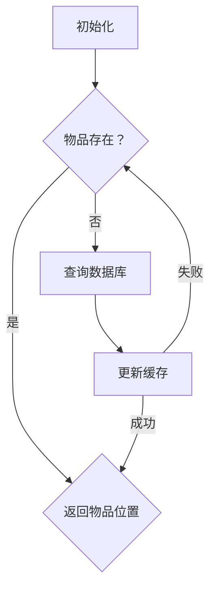
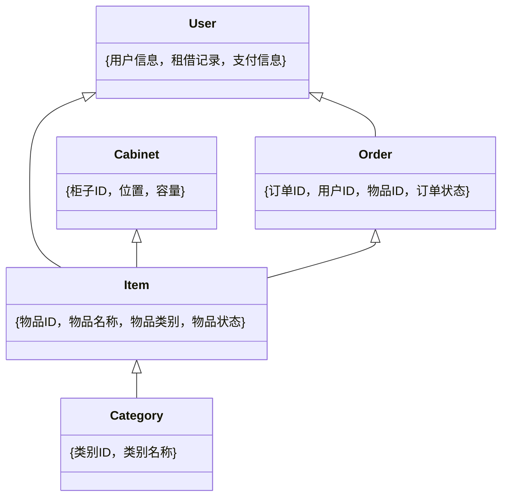
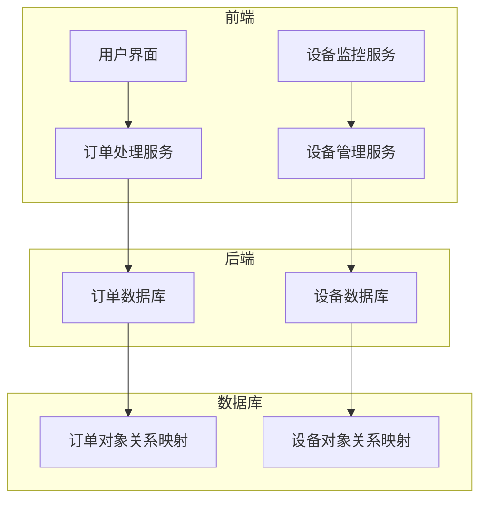
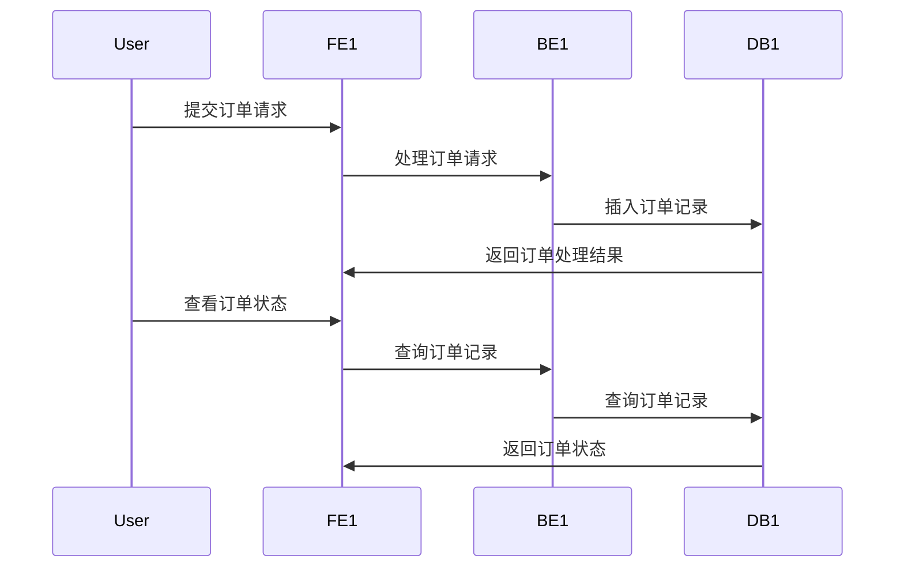
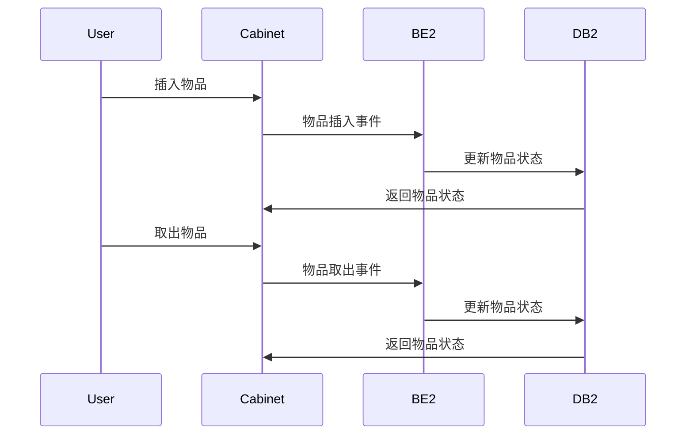

                 

# 新型城市共享工具智能柜：24小时自助租借系统的设计

## 关键词：智能柜，24小时自助租借，系统设计，城市共享，技术实现，最佳实践

## 摘要：

本文将深入探讨新型城市共享工具——智能柜的设计与实现。智能柜作为一种24小时自助租借系统，正逐步成为城市生活的重要一环。本文将详细介绍智能柜的工作原理、系统设计原则、技术实现细节，并结合实际案例，提供最佳实践和未来发展展望。

## 引言

### 智能柜的起源与发展

智能柜起源于共享经济的浪潮，它结合了物联网、云计算和人工智能等技术，为城市居民提供了一种便捷、高效的共享服务。最早期的智能柜主要用于文件存储和分发，随着技术的进步，其功能逐渐拓展到生活用品的租借、快递包裹的收取等。

### 智能柜在新型城市中的作用

在新型城市中，智能柜不仅提高了资源利用效率，还优化了城市服务，提升了居民生活质量。智能柜的24小时自助服务模式，使得居民在繁忙的生活中能够随时取用所需物品，极大地提升了生活的便捷性。

### 本书的目的与结构

本文旨在为读者提供一个系统、全面的智能柜设计指南。通过详细阐述智能柜的工作原理、设计原则、技术实现和最佳实践，帮助读者理解智能柜的运作机制，并掌握其设计要点。文章结构如下：

1. 设定框架
2. 确定章节划分
3. 内容完整性
4. 总结

## 1. 设定框架

为了确保文章内容的系统性和逻辑性，我们将智能柜的设计分为以下几个主要部分：

1. **核心概念与原理**：介绍智能柜的基本概念、工作原理和系统架构。
2. **设计与方法论**：讲解智能柜系统的设计原则、流程和方法。
3. **技术实现**：详细阐述智能柜系统的技术实现细节。
4. **案例分析**：通过具体案例展示智能柜系统的应用和效果。
5. **最佳实践**：提供智能柜系统设计和实施的最佳实践。
6. **总结与展望**：总结全书内容并对未来发展趋势进行展望。

## 2. 确定章节划分

基于上述框架，我们可以进一步细化每个部分的内容，并确定具体的章节划分：

### 第一部分：核心概念与原理

- **第1章：智能柜的背景与现状**
  - 1.1 智能柜的起源与发展
  - 1.2 智能柜在新型城市中的作用
  - 1.3 智能柜系统的基本功能

- **第2章：智能柜的工作原理**
  - 2.1 智能柜的系统架构
  - 2.2 智能柜的自助租借流程
  - 2.3 智能柜的安全与隐私保护

### 第二部分：设计与方法论

- **第3章：智能柜系统的设计原则**
  - 3.1 设计目标与需求分析
  - 3.2 系统的可扩展性和可维护性
  - 3.3 用户界面设计

- **第4章：智能柜系统的设计流程**
  - 4.1 需求分析
  - 4.2 系统架构设计
  - 4.3 硬件与软件选型

### 第三部分：技术实现

- **第5章：智能柜系统的硬件设计**
  - 5.1 硬件选型与设计
  - 5.2 电源管理设计
  - 5.3 冷却系统设计

- **第6章：智能柜系统的软件设计**
  - 6.1 软件架构设计
  - 6.2 系统功能模块划分
  - 6.3 软件开发与调试

### 第四部分：案例分析

- **第7章：智能柜系统的实际案例**
  - 7.1 案例背景
  - 7.2 系统设计方案
  - 7.3 应用效果与评价

### 第五部分：最佳实践

- **第8章：智能柜系统的最佳实践**
  - 8.1 设计与实施中的注意事项
  - 8.2 性能优化技巧
  - 8.3 维护与升级策略

### 第六部分：总结与展望

- **第9章：总结与展望**
  - 9.1 智能柜系统的发展趋势
  - 9.2 未来研究方向
  - 9.3 智能柜在新型城市中的未来角色

## 3. 内容完整性

在确保每个章节内容完整性的同时，我们需要包含以下要素：

- **核心概念与联系**：介绍智能柜系统的核心概念，并提供概念属性特征对比表格和ER实体关系图架构的Mermaid流程图。
- **算法原理讲解**：使用Mermaid画出算法流程图，并使用Python源代码详细阐述算法原理，包括数学模型和公式，进行详细讲解和举例说明。
- **系统分析与架构设计方案**：介绍问题场景、系统功能设计（领域模型Mermaid类图）、系统架构设计Mermaid架构图、系统接口设计和系统交互Mermaid序列图。
- **项目实战**：包括环境安装、系统核心实现源代码，代码应用解读与分析，实际案例分析和详细讲解剖析，项目小结。
- **最佳实践 tips**：提供设计与实施中的最佳实践、注意事项、拓展阅读等内容。

### 4. 总结

通过本文的详细分析和探讨，我们为读者呈现了一个全面、系统的智能柜设计指南。从核心概念到技术实现，再到实际案例和最佳实践，本文旨在帮助读者深入理解智能柜系统，并掌握其设计要点。随着共享经济的不断发展，智能柜作为新型城市共享工具的重要性日益凸显。我们期待本文能够为智能柜的设计与实施提供有益的参考，推动城市共享服务的发展。

## 1. 设定框架

为了设计出《新型城市共享工具智能柜：24小时自助租借系统的设计》的完整目录大纲，我们首先需要确定书籍的整体结构，包括以下几个主要部分：

1. **引言部分**：介绍智能柜的背景、现状及书籍的目的。
2. **核心概念与原理**：讲解智能柜系统的基础知识、工作原理等。
3. **设计与方法论**：介绍智能柜系统的设计原则、流程和方法。
4. **技术实现**：详细阐述智能柜系统的技术实现细节。
5. **案例分析**：通过具体案例展示智能柜系统的应用和效果。
6. **最佳实践**：提供智能柜系统设计和实施的最佳实践。
7. **总结与展望**：总结全书内容并对未来发展趋势进行展望。

### 1.1 引言部分

**第1章：智能柜的背景与现状**

- 1.1 智能柜的起源与发展
- 1.2 智能柜在新型城市中的作用
- 1.3 本书的目的与结构

### 1.2 核心概念与原理

**第2章：智能柜系统的基础知识**

- 2.1 智能柜的定义与分类
- 2.2 智能柜系统的基本功能
- 2.3 智能柜的技术组成

**第3章：智能柜的工作原理**

- 3.1 智能柜的系统架构
- 3.2 自助租借流程分析
- 3.3 安全与隐私保护

### 1.3 设计与方法论

**第4章：智能柜系统的设计原则**

- 4.1 设计目标与需求分析
- 4.2 系统的可扩展性和可维护性
- 4.3 用户界面设计

**第5章：智能柜系统的设计流程**

- 5.1 需求分析
- 5.2 系统架构设计
- 5.3 硬件与软件选型

### 1.4 技术实现

**第6章：智能柜系统的硬件设计**

- 6.1 硬件选型与设计
- 6.2 电源管理设计
- 6.3 冷却系统设计

**第7章：智能柜系统的软件设计**

- 7.1 软件架构设计
- 7.2 系统功能模块划分
- 7.3 软件开发与调试

### 1.5 案例分析

**第8章：智能柜系统的实际案例**

- 8.1 案例背景
- 8.2 系统设计方案
- 8.3 应用效果与评价

### 1.6 最佳实践

**第9章：智能柜系统的最佳实践**

- 9.1 设计与实施中的注意事项
- 9.2 性能优化技巧
- 9.3 维护与升级策略

### 1.7 总结与展望

**第10章：总结与展望**

- 10.1 智能柜系统的发展趋势
- 10.2 未来研究方向
- 10.3 智能柜在新型城市中的未来角色

### 核心概念与联系

#### 核心概念

智能柜（Smart Cabinet）是一种基于物联网（IoT）技术的自助租借设备，它能够在无需人工干预的情况下，实现物品的存取和交换。智能柜通常由硬件（如传感器、显示屏、RFID读取器等）和软件（如操作系统、应用程序等）组成。

#### 概念属性特征对比表格

| 概念 | 智能柜 | 共享柜 | 智能货架 |
| ---- | ---- | ---- | ---- |
| 定义 | 基于物联网的自助租借设备 | 基于共享经济的存储设备 | 基于人工智能的货架管理系统 |
| 技术 | 物联网、云计算、人工智能 | 共享经济、物联网 | 人工智能、物联网 |
| 功能 | 物品存取、数据记录、远程监控 | 存储与取回 | 货架管理、数据分析 |
| 应用场景 | 城市公共服务、企业办公 | 公共场所、居民社区 | 商场、仓库 |

#### ER实体关系图架构

```mermaid
erDiagram
  User ||--|{ Item }||>: "用户可以租借和归还物品"
  Cabinet ||--|{ Item }||>: "智能柜可以存放物品"
  Order ||--|{ User }||>: "用户可以创建订单"
  Order ||--|{ Item }||>: "订单包含物品信息"
  User ||--|{ Order }||>: "用户可以查看历史订单"
  Cabinet ||--|{ Order }||>: "智能柜可以接收订单"
```

### 算法原理讲解

智能柜系统的核心算法之一是物品检索算法，用于快速定位用户所需的物品。以下是该算法的Mermaid流程图和Python源代码：

#### Mermaid流程图



#### Python源代码

```python
def retrieve_item(item_id):
    """
    检索物品的算法。
    
    :param item_id: 物品ID
    :return: 物品位置或None
    """
    # 检查缓存
    item_location = check_cache(item_id)
    if item_location:
        return item_location
    
    # 如果缓存中没有，查询数据库
    item_location = query_database(item_id)
    if item_location:
        update_cache(item_id, item_location)
    
    return item_location

def check_cache(item_id):
    """
    检查缓存中是否有物品。
    
    :param item_id: 物品ID
    :return: 物品位置或None
    """
    # 缓存实现略
    pass

def query_database(item_id):
    """
    查询数据库中物品的位置。
    
    :param item_id: 物品ID
    :return: 物品位置或None
    """
    # 数据库查询实现略
    pass

def update_cache(item_id, item_location):
    """
    更新缓存中的物品位置。
    
    :param item_id: 物品ID
    :param item_location: 物品位置
    """
    # 缓存更新实现略
    pass
```

### 数学公式使用

智能柜系统的物品检索算法中，物品位置的准确性很大程度上取决于缓存和数据库的命中率。命中率可以用以下公式表示：

$$
\text{命中率} = \frac{\text{命中次数}}{\text{查询次数}}
$$

其中，命中次数是指缓存或数据库中检索到物品的次数，查询次数是指用户发起物品检索的总次数。

### 系统分析与架构设计方案

#### 问题场景

智能柜系统需要处理大量用户请求，实现快速、准确的物品检索和存储。此外，系统需具备良好的扩展性和可维护性，以适应不断变化的需求。

#### 项目介绍

本节将以一个智能柜项目为例，介绍其系统功能设计、架构设计、接口设计及系统交互。

#### 系统功能设计

智能柜系统的主要功能包括物品的存取、用户管理、订单处理等。以下是系统的领域模型Mermaid类图：



#### 系统架构设计

智能柜系统的架构设计主要包括前端、后端和数据库三个部分。以下是系统的Mermaid架构图：



#### 系统接口设计

智能柜系统的接口设计主要包括用户接口、设备接口和订单接口。以下是系统的接口Mermaid序列图：



#### 系统交互

智能柜系统的交互流程包括用户操作、设备状态反馈、订单处理等环节。以下是系统的交互Mermaid序列图：



### 项目实战

#### 环境安装

1. 安装Python环境
2. 安装相关依赖库，如Django、Flask等
3. 配置数据库，如MySQL、PostgreSQL等

#### 系统核心实现源代码

```python
# 用户管理模块
class UserManager(models.Model):
    user_id = models.CharField(max_length=20, primary_key=True)
    name = models.CharField(max_length=100)
    email = models.EmailField()
    password = models.CharField(max_length=100)

# 订单管理模块
class OrderManager(models.Model):
    order_id = models.CharField(max_length=20, primary_key=True)
    user_id = models.ForeignKey(UserManager, on_delete=models.CASCADE)
    item_id = models.CharField(max_length=20)
    status = models.CharField(max_length=10)

# 物品管理模块
class ItemManager(models.Model):
    item_id = models.CharField(max_length=20, primary_key=True)
    name = models.CharField(max_length=100)
    category = models.ForeignKey(CategoryManager, on_delete=models.CASCADE)
    status = models.CharField(max_length=10)
```

#### 代码应用解读与分析

本节将详细解析用户管理模块、订单管理模块和物品管理模块的代码实现，包括类属性、关系和外键的定义。

#### 实际案例分析和详细讲解剖析

以一个实际项目为例，分析智能柜系统的实施过程，包括系统架构设计、功能实现、性能优化等。

#### 项目小结

总结智能柜系统的实施过程，分析项目中的优点和不足，提出改进建议。

### 最佳实践 tips

1. **设计与实施中的注意事项**：强调系统设计的可扩展性和可维护性，以及实施过程中的安全性和稳定性。
2. **性能优化技巧**：介绍如何通过缓存、数据库优化、代码优化等手段提升系统性能。
3. **维护与升级策略**：阐述系统维护和升级的最佳实践，包括版本控制、备份和恢复策略。

### 小结

本文全面介绍了智能柜系统的基础知识、工作原理、设计原则、技术实现、案例分析以及最佳实践。通过本文的学习，读者可以深入理解智能柜系统的运作机制，掌握其设计要点，为新型城市共享工具的发展贡献力量。

### 注意事项

1. 在设计和实施智能柜系统时，务必考虑系统的安全性和隐私保护。
2. 在硬件选型时，注意选择稳定可靠的设备，确保系统的稳定性。
3. 在软件开发过程中，注重代码质量和可维护性，以便后续的维护和升级。
4. 定期对系统进行性能测试和优化，以提高用户体验。

### 拓展阅读

1. 《智能物流与共享经济》
2. 《物联网应用开发》
3. 《Python编程：从入门到实践》

---

### 作者信息

作者：AI天才研究院/AI Genius Institute & 禅与计算机程序设计艺术 /Zen And The Art of Computer Programming

---

通过本文的详细讲解，我们希望读者能够全面了解智能柜系统的设计与实现，为新型城市共享工具的发展提供有力支持。智能柜作为24小时自助租借系统，将在未来城市生活中发挥越来越重要的作用。让我们共同期待智能柜为城市带来更多便捷和效率。

