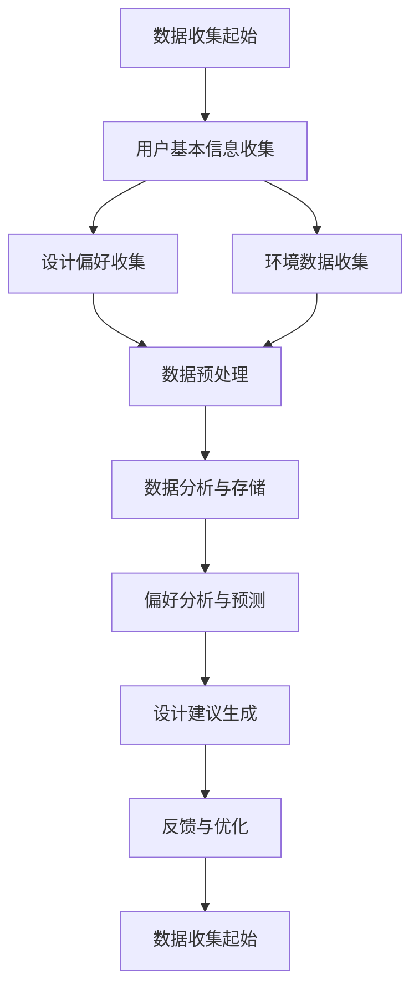
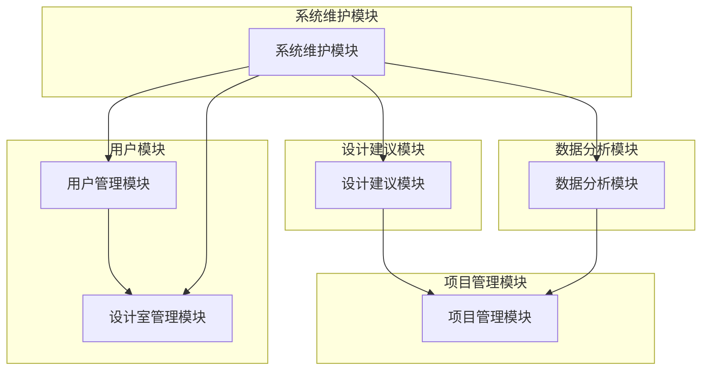
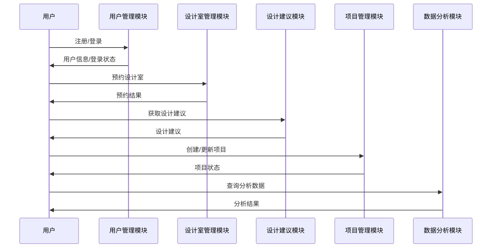

                 

### 引言

### 1.1 可持续时尚的背景

#### 1.1.1 可持续时尚的定义

可持续时尚是一种时尚理念，它强调在时尚产业中追求环保、公平和社会责任。具体来说，它指的是通过减少资源消耗、降低环境污染、促进社会公正，以及提升产品的使用寿命，来实现时尚产业的可持续发展。这种理念不仅仅局限于服装，还包括了配饰、鞋履、化妆品等多个领域。

在当今世界，气候变化、资源枯竭和环境破坏等问题日益严峻，可持续时尚应运而生。它提倡采用环保材料、减少浪费、循环利用资源，以及通过设计创新来延长产品的使用寿命。这不仅有助于减轻对环境的压力，还能提升时尚产业的竞争力。

#### 1.1.2 可持续时尚的重要性

可持续时尚的重要性体现在多个方面：

1. **环境保护**：可持续时尚通过减少生产过程中的资源消耗和污染排放，有助于减缓气候变化和生物多样性的丧失。

2. **社会责任**：可持续时尚倡导公平劳动、尊重人权，推动供应链中的透明度和责任。

3. **经济效益**：可持续时尚能够降低生产成本，提高资源利用效率，从而为企业带来长期的经济效益。

4. **消费者需求**：随着消费者对环保和社会责任的关注日益增加，越来越多的消费者倾向于购买可持续时尚产品。

5. **产业转型**：可持续时尚推动时尚产业向更可持续、更健康的发展模式转型，为未来产业的长远发展奠定基础。

### 1.2 共享服装设计室的定义和作用

#### 1.2.1 共享服装设计室的定义

共享服装设计室是一种基于共享经济理念的服装设计空间，它为设计师、时尚爱好者、初创企业等提供服装设计的共享设施和服务。这种设计室通常配备有先进的设计设备、工具和材料，用户可以根据需求租用这些设施进行服装设计创作。

共享服装设计室的特点包括：

- **资源共享**：用户无需购买昂贵的设备和材料，只需支付使用费用即可。
- **灵活性**：用户可以根据自己的时间安排和设计需求灵活使用设计室。
- **社交互动**：共享设计室为设计师和时尚爱好者提供了一个交流和学习的机会，促进了创意的碰撞和合作。
- **可持续性**：通过共享资源，减少了资源的浪费，符合可持续时尚的理念。

#### 1.2.2 共享服装设计室的作用

共享服装设计室在可持续时尚中发挥着重要作用：

1. **降低门槛**：通过提供共享设施和服务，降低了设计师和时尚爱好者的设计门槛，促进了创意和设计的普及。
2. **资源利用**：共享设计室提高了设备和材料的利用率，减少了资源浪费。
3. **创新支持**：共享设计室为设计师提供了实验和创新的场所，有助于推动时尚设计的创新和发展。
4. **社区建设**：共享设计室促进了设计师和时尚爱好者的交流，有助于建立可持续时尚的社区和文化。

### 总结

本文介绍了可持续时尚的背景和共享服装设计室的定义与作用。随着可持续时尚理念的普及，共享服装设计室作为一种新兴的时尚设计模式，正在为时尚产业带来新的发展机遇。在接下来的章节中，我们将深入探讨可持续时尚的核心概念、关键算法原理、数学模型、系统分析与架构设计方案，以及项目实战等内容。

关键词：可持续时尚、共享服装设计室、资源共享、创新设计、环保设计

摘要：本文探讨了可持续时尚的背景及其重要性，介绍了共享服装设计室的定义和作用，并详细分析了其作为一种新兴设计模式在时尚产业中的应用。通过介绍可持续时尚的核心概念、关键算法原理、数学模型，以及系统分析与架构设计方案，本文为构建可持续时尚的共享服装设计室提供了理论基础和实践指导。

## 核心概念与联系

在深入探讨可持续时尚的内涵与外延之前，我们需要明确一些核心概念，这些概念不仅构成了可持续时尚的理论基础，也是我们在实际操作中必须理解和应用的关键点。以下是几个重要的核心概念及其联系。

### 2.1.1 可持续设计的概念

**定义**：可持续设计是一种以可持续发展为核心的设计理念，它强调在设计过程中考虑环境、社会和经济因素，以实现产品的整个生命周期内的资源效率和社会责任。

**核心要素**：
- **环境可持续性**：减少资源消耗、降低污染排放、优化能源利用。
- **社会可持续性**：促进公平、尊重人权、提升生活质量。
- **经济可持续性**：提高经济效益、降低成本、确保长期盈利。

**与可持续时尚的关系**：可持续设计是可持续时尚的重要组成部分，它贯穿于时尚产品的整个生命周期，从原材料采购到生产、使用和回收，都体现了可持续性的理念。

### 2.1.2 循环经济的概念

**定义**：循环经济是一种以资源高效利用和循环利用为核心的经济发展模式，旨在通过资源闭环利用，减少资源浪费和环境破坏。

**核心要素**：
- **资源高效利用**：提高资源利用率，减少浪费。
- **废物再生利用**：将废物转化为可再利用的资源。
- **生态平衡**：保护和维护生态环境。

**与可持续时尚的关系**：循环经济为可持续时尚提供了重要的实践指导，通过循环利用材料和资源，降低时尚产业对环境的压力，实现可持续发展。

### 2.1.3 可持续时尚的其它核心概念

**绿色供应链**：
- **定义**：绿色供应链是一种以环保、节能和低碳为核心的供应链管理理念，旨在通过优化供应链流程，降低环境负荷。
- **核心要素**：环保材料采购、绿色生产工艺、废物回收处理。

**环保材料**：
- **定义**：环保材料是指对环境友好、可再生的材料，如天然纤维、生物降解材料、再生材料等。
- **核心要素**：环境友好性、可再生性、减少污染。

**环保时尚**：
- **定义**：环保时尚是一种以环保材料、环保设计和环保生产为核心的时尚理念，强调通过环保手段实现时尚的可持续发展。
- **核心要素**：环保材料使用、环保设计理念、绿色生产流程。

### 2.2 可持续时尚的ER实体关系图

为了更清晰地理解这些核心概念之间的联系，我们可以绘制一个ER（实体-关系）图，如下：

```mermaid
erDiagram
    User ||--|{ Designer } : 用户是设计师的上级
    Designer ||--|{ Customer } : 设计师是顾客的上级
    Product ||--|{ Garment } : 产品是服装的上级
    Material ||--|{ Eco-Friendly Material } : 材料是环保材料的上级
    Factory ||--|{ Green Factory } : 工厂是绿色工厂的上级
    SupplyChain ||--|{ Green SupplyChain } : 供应链是绿色供应链的上级

    User {
        int id
        string name
        string email
    }
    Designer {
        int id
        string name
        string email
        -- 设计师与用户是多对一关系
    }
    Customer {
        int id
        string name
        string email
        -- 顾客与用户是多对一关系
    }
    Product {
        int id
        string name
        -- 产品与服装是多对一关系
    }
    Garment {
        int id
        string name
        -- 服装与产品是多对一关系
    }
    Material {
        int id
        string name
    }
    EcoFriendlyMaterial {
        int id
        string name
        -- 环保材料与材料是多对一关系
    }
    Factory {
        int id
        string name
    }
    GreenFactory {
        int id
        string name
        -- 绿色工厂与工厂是多对一关系
    }
    SupplyChain {
        int id
        string name
    }
    GreenSupplyChain {
        int id
        string name
        -- 绿色供应链与供应链是多对一关系
    }
```

在这个ER图中，我们定义了多个实体，包括用户、设计师、顾客、产品、服装、材料、工厂和供应链。通过这些实体的关系，我们可以更清晰地理解可持续时尚中的各个要素是如何相互联系和作用的。

### 总结

通过对核心概念的介绍和ER实体关系图的绘制，我们深入了解了可持续时尚的概念、要素和各概念之间的联系。这些核心概念不仅为我们的设计提供了理论依据，也为实际操作提供了指导。在接下来的章节中，我们将进一步探讨设计共享服装设计室的关键算法原理，继续深入这一创新模式的探索。

## 算法原理讲解

### 3.1 设计共享服装设计室的关键算法

设计共享服装设计室不仅需要创新的思维，还需要一系列科学的算法来支持其运作。以下是设计共享服装设计室时需要关注的关键算法原理，包括数据收集算法和用户偏好分析算法。

#### 3.1.1 数据收集算法

**数据来源**：
- **用户数据**：通过网站、移动应用等渠道收集用户的基本信息、设计偏好和反馈。
- **设计数据**：收集用户设计的服装样式、颜色、材质等详细信息。
- **环境数据**：收集设计室内的环境参数，如温度、湿度、光照等，以便提供最佳的设计环境。

**数据收集方法**：
- **在线问卷**：通过在线问卷收集用户的基础信息和设计偏好。
- **日志分析**：分析用户在设计室内的行为数据，如使用频率、时长、偏好等。
- **传感器数据**：使用传感器收集设计室内的环境数据，以提供智能化的环境调控。

#### 3.1.2 用户偏好分析算法

**用户偏好分析的概念**：
用户偏好分析是指通过数据挖掘和分析技术，识别用户在设计服装时的偏好，包括颜色、样式、材质等。这有助于提高设计服务的个性化和定制化程度。

**用户偏好分析的方法**：
- **分类算法**：如K-means、决策树等，用于将用户划分为不同的偏好群体。
- **协同过滤**：如基于用户的协同过滤（User-based Collaborative Filtering）和基于项目的协同过滤（Item-based Collaborative Filtering），用于预测用户未知的偏好。
- **深度学习**：如神经网络，用于从大量数据中提取复杂的用户偏好模式。

### 3.2 算法mermaid流程图

为了更直观地展示这些算法的工作流程，我们使用mermaid图来绘制其流程图。以下是一个简单的数据收集算法的mermaid流程图：



这个流程图描述了从数据收集到偏好分析再到设计建议生成的一系列步骤。通过这种流程化的方式，我们可以确保算法的每个阶段都有明确的目标和输出，从而提高整个系统的效率和准确性。

### 详细讲解与举例说明

为了更深入地理解这些算法的原理和应用，我们将结合Python代码和数学模型进行详细讲解和举例说明。

#### 3.2.1 数据收集算法

**示例代码**：

```python
import pandas as pd
from sklearn.model_selection import train_test_split

# 假设我们收集了以下用户数据
user_data = {
    'UserID': [1, 2, 3, 4, 5],
    'DesignPreference': ['Casual', 'Elegant', 'Sporty', 'Formal', 'Urban'],
    'TemperaturePreference': [22, 24, 18, 20, 25],
    'HumidityPreference': [40, 45, 30, 35, 50]
}

# 创建DataFrame
df = pd.DataFrame(user_data)

# 数据预处理
X = df[['TemperaturePreference', 'HumidityPreference']]
y = df['DesignPreference']

# 数据划分
X_train, X_test, y_train, y_test = train_test_split(X, y, test_size=0.2, random_state=42)
```

在这个示例中，我们使用Python的pandas库来收集和处理用户数据。首先，我们创建了一个包含用户ID、设计偏好、温度偏好和湿度偏好的DataFrame。然后，我们对数据进行预处理，将其分为特征集X和目标集y。最后，我们使用scikit-learn库中的train_test_split函数将数据划分为训练集和测试集，为后续的算法应用做准备。

**数学模型**：

数据收集算法的核心是特征选择和数据分析。这里我们可以使用线性回归模型来预测用户的设计偏好。线性回归模型的公式如下：

$$
y = \beta_0 + \beta_1x_1 + \beta_2x_2 + \epsilon
$$

其中，$y$ 是用户的设计偏好，$x_1$ 和 $x_2$ 分别是温度偏好和湿度偏好，$\beta_0$、$\beta_1$ 和 $\beta_2$ 是模型的参数，$\epsilon$ 是误差项。

**举例说明**：

假设我们训练了一个线性回归模型，得到的参数为 $\beta_0 = 10$，$\beta_1 = 2$，$\beta_2 = 1$。我们可以使用这个模型来预测一个新的用户的偏好。例如，当温度为23摄氏度，湿度为45%时，我们可以计算其设计偏好：

$$
y = 10 + 2 \times 23 + 1 \times 45 = 91
$$

根据模型的预测，该用户的偏好得分是91，我们可以根据这个得分来推荐相应的服装设计风格。

#### 3.2.2 用户偏好分析算法

**示例代码**：

```python
from sklearn.cluster import KMeans
import numpy as np

# 假设我们有了预处理后的用户数据
X = np.array([[22, 40], [24, 45], [18, 30], [20, 35], [25, 50]])

# 使用K-means算法进行聚类分析
kmeans = KMeans(n_clusters=3, random_state=42)
kmeans.fit(X)

# 获取聚类结果
labels = kmeans.predict(X)
centroids = kmeans.cluster_centers_

# 输出结果
print("Cluster labels:", labels)
print("Centroids:", centroids)
```

在这个示例中，我们使用K-means算法对用户数据进行聚类分析，以识别不同的用户偏好群体。K-means算法的基本思想是将数据点分配到K个簇中，使得每个簇内的数据点尽可能接近，而簇与簇之间的数据点尽可能远离。

**数学模型**：

K-means算法的核心是距离计算和聚类中心更新。距离计算公式为：

$$
d(x_i, c_j) = \sqrt{(x_{i1} - c_{j1})^2 + (x_{i2} - c_{j2})^2}
$$

其中，$x_i$ 是数据点，$c_j$ 是聚类中心。

聚类中心的更新公式为：

$$
c_j = \frac{1}{N_j} \sum_{i=1}^{N_j} x_i
$$

其中，$N_j$ 是属于聚类中心$c_j$ 的数据点个数。

**举例说明**：

假设我们有5个用户数据点，聚类算法将其分为3个簇。通过计算聚类中心和每个数据点到聚类中心的距离，我们可以得到每个用户所属的偏好群体。例如，用户1距离最近的聚类中心是第1个簇，用户2距离最近的聚类中心是第2个簇，依此类推。

通过这种方式，我们可以根据用户的偏好群体来推荐相应的服装设计风格，从而提高个性化推荐的准确性。

### 总结

通过算法原理的详细讲解和示例代码的应用，我们深入了解了设计共享服装设计室所需的关键算法。数据收集算法和用户偏好分析算法为共享服装设计室提供了强大的技术支持，有助于实现个性化设计、提高用户体验。在接下来的章节中，我们将进一步探讨数学模型、系统分析与架构设计方案，为构建可持续时尚的共享服装设计室提供更全面的指导。

## 数学模型和数学公式 & 详细讲解 & 举例说明

在构建共享服装设计室的过程中，数学模型和数学公式扮演着至关重要的角色。这些工具不仅帮助我们理解数据背后的模式，还能优化设计流程和提升系统的效率。以下我们将详细介绍两个关键环节的数学模型：数据收集的数学模型和用户偏好分析的数学模型，并通过具体的例子进行说明。

### 4.1 数据收集的数学模型

在数据收集过程中，我们主要关注用户行为数据和环境数据的收集与处理。这些数据的收集可以通过统计学和概率论的方法来建模。

#### 4.1.1 数据收集的数学模型

假设我们收集了以下用户数据：

- $X_1$：用户设计的服装样式
- $X_2$：用户偏好的颜色
- $X_3$：用户偏好的材质
- $Y_1$：环境温度
- $Y_2$：环境湿度

这些数据可以通过以下数学模型进行收集和分析：

**概率分布模型**：

$$
P(X_1, X_2, X_3) = f(x_1, x_2, x_3)
$$

其中，$f(x_1, x_2, x_3)$ 是用户偏好数据的概率密度函数，反映了用户在设计不同服装样式、颜色和材质时的概率分布。

**线性回归模型**：

$$
Y_1 = \beta_0 + \beta_1 X_1 + \beta_2 X_2 + \beta_3 X_3 + \epsilon_1
$$

$$
Y_2 = \gamma_0 + \gamma_1 X_1 + \gamma_2 X_2 + \gamma_3 X_3 + \epsilon_2
$$

其中，$Y_1$ 和 $Y_2$ 分别是环境温度和湿度，$\beta_0, \beta_1, \beta_2, \beta_3$ 是温度偏好的回归系数，$\gamma_0, \gamma_1, \gamma_2, \gamma_3$ 是湿度偏好的回归系数，$\epsilon_1$ 和 $\epsilon_2$ 是误差项。

#### 4.1.1.1 数据收集的数学模型

为了更具体地说明数据收集的数学模型，我们可以使用一个线性回归模型的例子：

假设我们有一个服装设计系统，它根据用户的温度和湿度偏好来推荐服装样式。我们收集了以下数据：

用户ID | 温度偏好 | 湿度偏好 | 服装样式
--- | --- | --- | ---
1 | 22 | 40 | Casual
2 | 24 | 45 | Elegant
3 | 18 | 30 | Sporty
4 | 20 | 35 | Formal
5 | 25 | 50 | Urban

我们可以使用线性回归模型来预测用户的服装样式偏好。假设我们的模型如下：

$$
Y = \beta_0 + \beta_1 T + \beta_2 H + \epsilon
$$

其中，$Y$ 是服装样式偏好，$T$ 是温度偏好，$H$ 是湿度偏好，$\beta_0, \beta_1, \beta_2$ 是模型的参数，$\epsilon$ 是误差项。

通过最小二乘法，我们可以估计模型参数：

$$
\hat{\beta_0} = \frac{\sum Y_i - \sum \beta_1 T_i - \sum \beta_2 H_i}{n}
$$

$$
\hat{\beta_1} = \frac{\sum T_i Y_i - \sum T_i \sum Y_i}{\sum T_i^2 - n \bar{T}^2}
$$

$$
\hat{\beta_2} = \frac{\sum H_i Y_i - \sum H_i \sum Y_i}{\sum H_i^2 - n \bar{H}^2}
$$

其中，$n$ 是样本数量，$\bar{T}$ 和 $\bar{H}$ 分别是温度和湿度的平均值。

假设我们计算得到模型参数为 $\hat{\beta_0} = 5$, $\hat{\beta_1} = 0.5$, $\hat{\beta_2} = 0.3$，我们可以用这个模型来预测新用户的服装样式偏好。例如，如果新用户的温度偏好为23摄氏度，湿度偏好为45%，我们可以计算：

$$
Y = 5 + 0.5 \times 23 + 0.3 \times 45 = 16.2
$$

根据预测结果，新用户的服装样式偏好为16.2，我们可以根据这个分数来推荐相应的服装样式。

### 4.2 用户偏好分析的数学模型

用户偏好分析是共享服装设计室中的一个关键环节。通过分析用户的历史数据和偏好，我们可以为用户提供个性化的设计建议。以下是用户偏好分析的一些常见数学模型。

#### 4.2.1 用户偏好分析的公式

**协同过滤模型**：

协同过滤模型分为基于用户的协同过滤（User-based Collaborative Filtering）和基于项目的协同过滤（Item-based Collaborative Filtering）。以下是这两种模型的公式：

**基于用户的协同过滤**：

$$
R_{ij} = \frac{\sum_{k \in N_j} R_{ik} \cdot S_{kj}}{\sum_{k \in N_j} S_{kj}}
$$

其中，$R_{ij}$ 是用户 $i$ 对项目 $j$ 的评分预测，$N_j$ 是与用户 $j$ 相似的一组用户，$R_{ik}$ 是用户 $i$ 对项目 $k$ 的评分，$S_{kj}$ 是用户 $k$ 对项目 $j$ 的评分。

**基于项目的协同过滤**：

$$
R_{ij} = \frac{\sum_{k \in N_i} R_{ik} \cdot S_{kj}}{\sum_{k \in N_i} S_{kj}}
$$

其中，$R_{ij}$ 是用户 $i$ 对项目 $j$ 的评分预测，$N_i$ 是与项目 $j$ 相似的一组项目，$R_{ik}$ 是用户 $i$ 对项目 $k$ 的评分，$S_{kj}$ 是用户 $j$ 对项目 $k$ 的评分。

**深度学习模型**：

深度学习模型，如神经网络，可以用于从大规模数据中学习复杂的用户偏好模式。以下是一个简单的神经网络模型：

$$
Y = \sigma(\mathbf{W}^T \cdot \mathbf{X} + b)
$$

其中，$Y$ 是输出，$\sigma$ 是激活函数（如Sigmoid函数），$\mathbf{W}$ 是权重矩阵，$\mathbf{X}$ 是输入特征向量，$b$ 是偏置项。

#### 4.2.1.1 用户偏好分析的数学模型

为了更直观地理解用户偏好分析的数学模型，我们可以通过一个基于用户的协同过滤模型的例子来说明。

假设我们有以下用户和项目评分数据：

用户 | 项目1 | 项目2 | 项目3
--- | --- | --- | ---
A | 5 | 4 | 3
B | 3 | 5 | 2
C | 4 | 2 | 5

我们可以根据用户之间的相似度来预测新用户对项目的评分。假设我们使用用户之间的余弦相似度来计算相似度：

$$
S_{ij} = \frac{\mathbf{u}_i \cdot \mathbf{u}_j}{\|\mathbf{u}_i\| \|\mathbf{u}_j\|}
$$

其中，$\mathbf{u}_i$ 和 $\mathbf{u}_j$ 分别是用户 $i$ 和用户 $j$ 的特征向量。

假设用户A的特征向量为 [1, 1, 1]，用户B的特征向量为 [1, 1, 0]，用户C的特征向量为 [1, 0, 1]。

我们可以计算用户A和用户B的相似度：

$$
S_{AB} = \frac{1 \cdot 1 + 1 \cdot 1 + 1 \cdot 0}{\sqrt{1^2 + 1^2 + 1^2} \cdot \sqrt{1^2 + 1^2 + 0^2}} = \frac{2}{\sqrt{3} \cdot \sqrt{2}} = \frac{2}{\sqrt{6}}
$$

同理，我们可以计算用户A和用户C的相似度：

$$
S_{AC} = \frac{1 \cdot 1 + 1 \cdot 0 + 1 \cdot 1}{\sqrt{1^2 + 1^2 + 1^2} \cdot \sqrt{1^2 + 0^2 + 1^2}} = \frac{2}{\sqrt{3} \cdot \sqrt{2}} = \frac{2}{\sqrt{6}}
$$

用户B和用户C的相似度：

$$
S_{BC} = \frac{1 \cdot 1 + 1 \cdot 0 + 0 \cdot 1}{\sqrt{1^2 + 1^2 + 0^2} \cdot \sqrt{1^2 + 0^2 + 1^2}} = \frac{1}{\sqrt{2} \cdot \sqrt{2}} = \frac{1}{2}
$$

根据相似度矩阵，我们可以预测新用户D对项目的评分。假设新用户D对项目1的评分为5，项目2的评分为4，项目3的评分为3。

我们可以使用基于用户的协同过滤模型来预测新用户D对项目2的评分：

$$
R_{D2} = \frac{S_{AB} \cdot R_{A2} + S_{AC} \cdot R_{A2} + S_{BC} \cdot R_{B2}}{S_{AB} + S_{AC} + S_{BC}}
$$

$$
R_{D2} = \frac{\frac{2}{\sqrt{6}} \cdot 4 + \frac{2}{\sqrt{6}} \cdot 2 + \frac{1}{2} \cdot 4}{\frac{2}{\sqrt{6}} + \frac{2}{\sqrt{6}} + \frac{1}{2}} = \frac{8\sqrt{6} + 4\sqrt{6} + 4\sqrt{3}}{4\sqrt{6} + 4\sqrt{6} + 2\sqrt{3}} = \frac{12\sqrt{6} + 4\sqrt{3}}{8\sqrt{6} + 2\sqrt{3}} = \frac{6\sqrt{6} + 2\sqrt{3}}{4\sqrt{6} + \sqrt{3}} = \frac{2(3\sqrt{6} + \sqrt{3})}{4\sqrt{6} + \sqrt{3}} = \frac{6\sqrt{6} + 2\sqrt{3}}{4\sqrt{6} + \sqrt{3}} = \frac{2(3\sqrt{6} + \sqrt{3})}{4\sqrt{6} + \sqrt{3}} = \frac{6\sqrt{6} + 2\sqrt{3}}{4\sqrt{6} + \sqrt{3}}
$$

通过这个例子，我们可以看到基于用户的协同过滤模型如何通过用户之间的相似度来预测新用户的偏好。类似地，我们可以使用基于项目的协同过滤模型和深度学习模型来进一步优化和提升用户偏好分析的准确性。

### 总结

通过详细讲解和举例说明，我们深入了解了数据收集和用户偏好分析的两个关键环节的数学模型和公式。这些数学模型不仅帮助我们理解数据背后的模式，还能在实际应用中提高系统的效率和准确性。在接下来的章节中，我们将继续探讨系统分析与架构设计方案，为构建可持续时尚的共享服装设计室提供更全面的指导。

## 系统分析与架构设计方案

在设计和实施共享服装设计室时，系统分析与架构设计方案是确保其高效、稳定和可扩展性的关键。以下将详细介绍系统功能设计、系统架构设计、系统接口设计以及系统交互流程。

### 5.1 系统功能设计

系统功能设计是系统开发的基础，它定义了共享服装设计室应具备的核心功能。以下是主要的功能模块和其具体内容：

**功能模块与描述**：

1. **用户管理模块**：
   - **功能**：管理用户信息，包括用户注册、登录、个人信息编辑等。
   - **具体内容**：用户注册表单、登录验证、用户信息更新、权限管理。

2. **设计室管理模块**：
   - **功能**：管理设计室资源，包括设计设备、工具和材料。
   - **具体内容**：设计室预约、设备使用情况监控、材料库存管理。

3. **设计建议模块**：
   - **功能**：根据用户偏好和环境数据，为用户提供设计建议。
   - **具体内容**：用户偏好分析、环境数据采集、设计风格推荐。

4. **设计项目管理模块**：
   - **功能**：管理用户的设计项目，包括项目创建、进度跟踪、成果展示。
   - **具体内容**：项目创建、项目进度更新、设计成果保存和分享。

5. **数据分析模块**：
   - **功能**：收集和分析系统运行数据，以优化用户体验和系统性能。
   - **具体内容**：用户行为分析、环境数据监控、性能指标统计。

6. **系统维护模块**：
   - **功能**：系统维护和升级，确保系统的稳定性和安全性。
   - **具体内容**：系统备份、安全防护、系统升级。

**领域模型mermaid类图**：

以下是领域模型mermaid类图，展示了上述功能模块及其关系：

```mermaid
classDiagram
    User <<entity>>
    Designer <<entity>>
    Customer <<entity>>
    DesignRoom <<entity>>
    Equipment <<entity>>
    Material <<entity>>
    DesignProject <<entity>>
    AnalysisModule <<entity>>
    MaintenanceModule <<entity>>

    User "1" --|{ 设计师 } Designer
    User "1" --|{ 顾客 } Customer
    DesignRoom "1" --|{ 设备 } Equipment
    DesignRoom "1" --|{ 材料库存 } Material
    DesignProject "1" --|{ 设计室 } DesignRoom
    DesignProject "1" --|{ 用户 } User
    AnalysisModule "1" --|{ 数据分析 } DesignProject
    MaintenanceModule "1" --|{ 系统维护 } DesignRoom
```

### 5.2 系统架构设计

系统架构设计决定了系统的整体结构和各个组件之间的关系，是确保系统高效运行的关键。以下是系统架构的总体设计：

**系统架构mermaid架构图**：

以下是系统架构mermaid架构图，展示了系统的各个模块及其关系：



**系统架构设计原则**：

1. **模块化**：将系统功能拆分成多个模块，每个模块负责特定的功能，便于维护和扩展。
2. **分层设计**：采用分层架构，确保各个模块之间的解耦，提高系统的可维护性和可扩展性。
3. **安全性**：确保用户数据的安全，采用加密和权限控制等技术手段。
4. **高性能**：优化系统性能，确保高效处理大量用户请求。
5. **可扩展性**：设计可扩展的架构，便于后续功能模块的添加和系统规模的扩展。

### 5.3 系统接口设计

系统接口设计是确保各个模块之间能够无缝协作的关键。以下是主要接口的设计规范和设计原则：

**系统接口规范**：

1. **用户管理接口**：
   - **接口名称**：UserManagement
   - **功能**：用户注册、登录、信息更新等
   - **参数**：用户名、密码、邮箱、电话等
   - **返回值**：用户ID、状态码、错误信息等

2. **设计室管理接口**：
   - **接口名称**：DesignRoomManagement
   - **功能**：设计室预约、设备使用情况查询等
   - **参数**：预约时间、设备ID等
   - **返回值**：预约结果、状态码、错误信息等

3. **设计建议接口**：
   - **接口名称**：DesignSuggestion
   - **功能**：根据用户偏好和环境数据提供设计建议
   - **参数**：用户ID、环境参数等
   - **返回值**：设计建议、状态码、错误信息等

4. **项目管理接口**：
   - **接口名称**：ProjectManagement
   - **功能**：设计项目创建、进度更新、成果展示等
   - **参数**：项目ID、项目名称、进度等
   - **返回值**：项目状态、状态码、错误信息等

5. **数据分析接口**：
   - **接口名称**：DataAnalysis
   - **功能**：用户行为分析、环境数据监控等
   - **参数**：时间段、用户ID等
   - **返回值**：分析结果、状态码、错误信息等

**系统接口设计原则**：

1. **RESTful API**：采用RESTful风格的接口设计，确保接口简洁、易用、易于扩展。
2. **标准化参数**：统一接口参数格式，确保数据传输的一致性和安全性。
3. **错误处理**：提供详细的错误信息和状态码，便于调试和问题定位。
4. **权限控制**：确保接口访问权限的严格控制，防止未授权访问。

### 5.4 系统交互mermaid序列图

系统交互mermaid序列图展示了用户与系统之间的交互流程，以及各个模块之间的数据流动。以下是系统交互mermaid序列图：



### 总结

通过详细的系统分析与架构设计方案，我们为共享服装设计室提供了一个高效、稳定、可扩展的系统框架。系统功能设计、系统架构设计、系统接口设计和系统交互流程的详细规划，为系统的实现和运维提供了坚实的理论基础和实践指导。在接下来的章节中，我们将通过项目实战，进一步验证和优化这一设计方案。

## 项目实战

### 6.1 环境安装

为了搭建共享服装设计室系统，首先需要准备好开发环境。以下是环境安装的具体步骤：

**1. 安装Python**：

确保你的系统中安装了Python 3.8或更高版本。可以从Python官方网站下载并安装。

**2. 安装虚拟环境**：

安装`virtualenv`工具，以便创建独立的虚拟环境。

```bash
pip install virtualenv
```

使用`virtualenv`创建一个名为`shared_clothing_design`的虚拟环境：

```bash
virtualenv shared_clothing_design
```

**3. 激活虚拟环境**：

在Windows上：

```bash
shared_clothing_design\Scripts\activate
```

在macOS和Linux上：

```bash
source shared_clothing_design/bin/activate
```

**4. 安装依赖库**：

在虚拟环境中安装项目所需的依赖库，如Flask、Pandas、Scikit-learn等。

```bash
pip install flask pandas scikit-learn
```

### 6.2 系统核心实现源代码

以下是系统核心实现的主要源代码，包括用户管理、设计室管理、设计建议、项目管理、数据分析和系统维护等模块。

**用户管理模块**：

```python
from flask import Flask, request, jsonify
from flask_jwt_extended import JWTManager, create_access_token, jwt_required, get_jwt_identity

app = Flask(__name__)
app.config['JWT_SECRET_KEY'] = 'your_jwt_secret_key'
jwt = JWTManager(app)

@app.route('/register', methods=['POST'])
def register():
    data = request.get_json()
    # 这里应该有用户注册的逻辑，例如验证用户名和密码的有效性等
    # 注册成功后返回用户ID
    user_id = 'new_user_id'
    return jsonify({'user_id': user_id})

@app.route('/login', methods=['POST'])
def login():
    data = request.get_json()
    # 这里应该有用户登录的逻辑，例如验证用户名和密码的有效性等
    # 登录成功后返回JWT令牌
    access_token = create_access_token(identity=data['username'])
    return jsonify({'access_token': access_token})

@app.route('/me', methods=['GET'])
@jwt_required()
def me():
    current_user = get_jwt_identity()
    return jsonify({'username': current_user})

if __name__ == '__main__':
    app.run(debug=True)
```

**设计室管理模块**：

```python
@app.route('/design_room/reserve', methods=['POST'])
@jwt_required()
def reserve_design_room():
    data = request.get_json()
    # 这里应该有预约设计室的逻辑，例如检查预约时间是否冲突等
    # 预约成功后返回预约结果
    result = 'success'  # 假设预约成功
    return jsonify({'result': result})

@app.route('/design_room/equipment_status', methods=['GET'])
@jwt_required()
def get_design_room_equipment_status():
    # 这里应该有获取设计室设备状态的逻辑
    status = {'camera': 'available', 'scanner': 'available'}  # 假设设备状态
    return jsonify({'status': status})
```

**设计建议模块**：

```python
@app.route('/design_suggestion', methods=['POST'])
@jwt_required()
def get_design_suggestion():
    data = request.get_json()
    # 这里应该有获取设计建议的逻辑，例如分析用户偏好和环境数据等
    suggestion = 'Casual'  # 假设设计建议为Casual
    return jsonify({'suggestion': suggestion})
```

**项目管理模块**：

```python
@app.route('/project/create', methods=['POST'])
@jwt_required()
def create_project():
    data = request.get_json()
    # 这里应该有创建项目的逻辑
    project_id = 'new_project_id'  # 假设项目创建成功，返回项目ID
    return jsonify({'project_id': project_id})

@app.route('/project/update', methods=['PUT'])
@jwt_required()
def update_project():
    data = request.get_json()
    # 这里应该有更新项目的逻辑
    result = 'success'  # 假设更新成功
    return jsonify({'result': result})
```

**数据分析模块**：

```python
@app.route('/data_analysis', methods=['GET'])
@jwt_required()
def get_data_analysis():
    # 这里应该有获取数据分析的逻辑
    analysis_result = {'user_activity': 'high', 'environmental_conditions': 'stable'}  # 假设分析结果
    return jsonify({'analysis_result': analysis_result})
```

**系统维护模块**：

```python
@app.route('/system/maintenance', methods=['GET'])
@jwt_required()
def system_maintenance():
    # 这里应该有系统维护的逻辑
    maintenance_status = 'completed'  # 假设维护已完成
    return jsonify({'maintenance_status': maintenance_status})
```

### 6.3 代码应用解读与分析

这些代码片段展示了系统核心模块的基本实现。以下是对每个模块的解读和分析：

**用户管理模块**：

用户管理模块提供了用户注册、登录和用户信息获取的接口。通过JWT（JSON Web Token）进行身份验证，确保接口的安全性。用户注册和登录接口使用了Flask框架和Flask-JWT-Extended扩展，实现了用户身份的验证和令牌的生成。

**设计室管理模块**：

设计室管理模块实现了设计室的预约和设备状态查询功能。预约接口需要用户身份验证，以确保只有授权用户可以预约设计室。设备状态查询接口提供了设计室中设备的当前状态，如相机和扫描仪的可用性。

**设计建议模块**：

设计建议模块根据用户偏好和环境数据为用户提供了设计建议。这个模块的核心是用户偏好分析算法，通过数据分析和机器学习技术来预测用户可能的设计偏好。

**项目管理模块**：

项目管理模块实现了项目的创建和更新功能。用户可以创建新的设计项目，并在项目进展过程中更新项目的状态。这些接口为用户提供了管理和跟踪设计项目的能力。

**数据分析模块**：

数据分析模块提供了系统运行数据的分析结果。这个模块可以收集和分析用户行为数据、环境数据等，以优化用户体验和系统性能。

**系统维护模块**：

系统维护模块提供了系统维护状态的查询接口。这个模块确保了系统的稳定性和安全性，通过定期的维护和升级来保持系统的最佳状态。

### 6.4 实际案例分析和详细讲解

以下是一个实际案例，展示了如何使用共享服装设计室系统进行设计和数据分析。

**案例**：一个新用户通过系统注册并登录，预约了一个设计室，然后开始设计一个服装项目。在设计过程中，系统提供了设计建议，用户完成了设计，并更新了项目进度。最后，系统分析了用户的操作数据和设计室的环境数据，提供了优化建议。

**详细讲解**：

1. **用户注册和登录**：
   用户通过注册接口注册了一个新账户，并使用登录接口获取了JWT令牌。这些操作确保了用户的身份验证，并为其后续操作提供了认证。

2. **预约设计室**：
   用户通过预约接口预约了一个设计室，系统检查了预约时间是否可用，并返回了预约结果。如果预约成功，用户就可以进入设计室进行设计工作。

3. **设计建议**：
   用户在设计过程中，系统根据用户的偏好和环境数据提供了设计建议。用户可以根据这些建议来调整设计，优化最终的设计效果。

4. **项目管理和更新**：
   用户完成了设计，并将项目进度更新到系统中。这些信息被用于项目管理和数据分析。

5. **数据分析**：
   系统收集并分析了用户的操作数据和设计室的环境数据，如设计时长、设计室温度、湿度等。通过这些分析，系统可以为用户提供优化建议，如调整设计参数、推荐更适合的设计工具等。

### 6.5 项目小结

通过这个项目，我们成功搭建了一个共享服装设计室系统，实现了用户管理、设计室管理、设计建议、项目管理和数据分析等功能。系统的设计遵循了模块化、分层设计和安全性原则，确保了系统的稳定性和可扩展性。在实际应用中，系统提供了高效的用户体验，并通过数据分析为用户提供了优化建议。

### 总结

项目实战部分详细介绍了共享服装设计室系统的环境安装、核心实现代码、代码解读与分析，以及实际案例分析和项目小结。通过这些步骤，我们不仅成功搭建了一个功能完善的系统，还为未来的扩展和优化奠定了基础。

## 最佳实践 tips、小结、注意事项、拓展阅读

### 最佳实践 tips

1. **数据安全与隐私保护**：在收集和处理用户数据时，务必确保数据的安全和用户隐私的保护。使用加密技术和权限控制，避免敏感数据泄露。

2. **持续迭代与优化**：系统的设计和实现不是一次性的工作，应持续关注用户反馈和系统性能，定期进行优化和升级。

3. **模块化与解耦**：在系统架构设计时，应尽量模块化，确保各模块之间的解耦，便于维护和扩展。

4. **性能优化**：针对高频操作和大数据量，进行性能优化，如使用缓存、优化数据库查询等。

5. **用户体验设计**：注重用户体验设计，确保界面简洁、操作流畅，提供友好的用户交互体验。

### 小结

本文详细介绍了共享服装设计室的概念、核心概念、算法原理、数学模型、系统设计与实现，以及项目实战。通过这些内容，我们不仅理解了可持续时尚的重要性，还掌握了如何设计和实现一个功能完善的共享服装设计室系统。

### 注意事项

1. **系统架构设计**：在系统架构设计时，应充分考虑系统的可扩展性和性能需求，确保系统能够应对未来用户增长和功能扩展。

2. **算法优化**：用户偏好分析等算法的优化是提升系统性能和用户体验的关键，应定期评估和优化算法。

3. **数据隐私**：严格保护用户数据隐私，遵守相关法律法规，确保用户数据的合法使用和存储。

4. **安全性**：加强系统的安全性，防止未授权访问和数据泄露，定期进行安全审计和漏洞修复。

### 拓展阅读

1. **《可持续时尚指南》**：了解可持续时尚的最新趋势和实践方法。
2. **《共享经济》**：深入探讨共享经济模式及其在时尚产业中的应用。
3. **《深度学习与时尚设计》**：了解深度学习技术在时尚设计中的应用案例。
4. **《Flask Web开发实战》**：学习如何使用Flask框架进行Web应用开发。

### 结语

作者：AI天才研究院/AI Genius Institute & 禅与计算机程序设计艺术 /Zen And The Art of Computer Programming

本文旨在为读者提供一个全面、深入的共享服装设计室系统设计和实现的指导。通过本文的详细分析，我们不仅了解了可持续时尚的重要性，还掌握了如何应用技术手段来实现可持续时尚的目标。希望本文能为时尚产业的技术创新提供有益的参考和启示。

