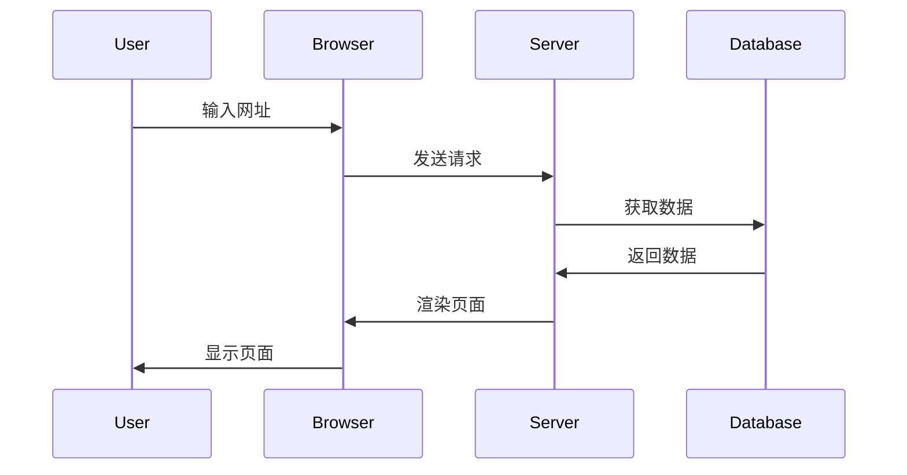
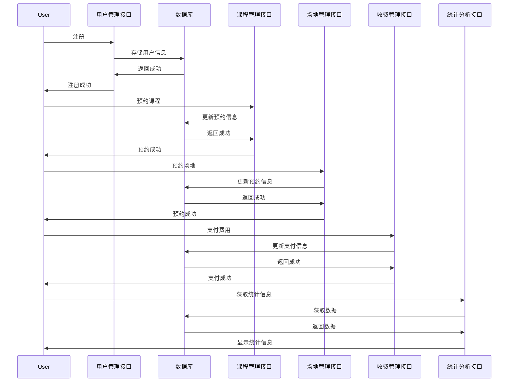

                 


# 新型城市共享瑜伽室设计：24小时自助瑜伽空间的创新

> 关键词：共享瑜伽室、自助模式、设计原则、功能布局、运营管理

> 摘要：本文从共享经济的背景出发，探讨新型城市共享瑜伽室的设计原则、功能布局和运营管理，旨在为24小时自助瑜伽空间的实现提供有益的思路和指导。通过详细的分析和实例讲解，本文希望能够为读者提供一个全面、系统的参考框架。

## 第1章 新型城市共享瑜伽室概述

### 1.1.1 问题背景

随着城市化进程的加速和人们对健康生活方式的追求，城市共享空间的需求日益增长。在这种背景下，共享瑜伽室作为一种新型的共享空间模式，逐渐受到重视。它不仅满足了人们对于便捷、经济、专业瑜伽练习场所的需求，也推动了城市公共空间的多样化发展。

### 1.1.2 问题描述

本章主要探讨新型城市共享瑜伽室的设计原则、功能布局和运营管理，以实现24小时自助瑜伽空间的目标。具体问题包括：

- 如何设计一个既满足功能需求，又能吸引消费者的瑜伽空间？
- 如何确保24小时自助模式下的安全性和服务质量？
- 如何通过有效的运营管理提高共享瑜伽室的利用率和盈利能力？

### 1.1.3 问题解决

为了解决上述问题，本章将从以下几个方面进行阐述：

- **核心概念**：介绍新型城市共享瑜伽室的核心概念，包括共享经济、自助模式、安全与卫生等。
- **设计与布局**：详细探讨共享瑜伽室的设计原则、功能分区、设施配置等。
- **运营管理**：分析共享瑜伽室的运营模式、管理策略和客户服务。

### 1.1.4 边界与外延

- **边界**：本章主要针对城市共享瑜伽室的设计和运营进行讨论，不涉及具体的技术实现和商业运营细节。
- **外延**：本章内容可以扩展到其他共享空间的创新设计，如共享健身房、共享工作室等。

### 1.1.5 概念结构与核心要素组成

**新型城市共享瑜伽室**的核心概念结构包括以下几个方面：

- **共享经济**：基于资源共享的理念，提供便捷、经济、专业的瑜伽服务。
- **自助模式**：通过智能化设施和系统，实现24小时自助服务。
- **安全性**：确保设施安全、场地卫生和用户安全。
- **服务质量**：通过持续改进和优化，提升用户体验。

## 第2章 核心概念与联系

### 2.1.1 共享经济

共享经济是一种基于互联网平台，通过共享闲置资源、提供服务、实现收益最大化的商业模式。它改变了传统的资源分配方式，促进了社会资源的合理利用。

### 2.1.2 自助模式

自助模式是一种通过智能化设施和系统，实现用户自助完成服务流程的模式。它提高了服务的便捷性和效率，降低了运营成本。

### 2.1.3 安全性

安全性是共享瑜伽室运营的关键。它包括设施安全、场地卫生和用户安全等方面。通过严格的安全管理和应急预案，确保用户的安全和舒适。

### 2.1.4 服务质量

服务质量是共享瑜伽室的竞争力。通过持续改进和优化，提升用户体验，提高用户满意度。服务质量包括设施完善、场地舒适、服务态度等方面。

### 2.1.5 关联性

新型城市共享瑜伽室的核心概念之间具有紧密的联系。共享经济为自助模式和安全性提供了基础，而自助模式和安全性又直接影响服务质量。通过合理的设计和运营管理，这些核心概念可以相互促进，共同提升共享瑜伽室的整体水平。

### 2.1.6 概念属性特征对比表格

| 概念     | 属性特征                          |
|----------|---------------------------------|
| 共享经济 | 资源共享、收益最大化、互联网平台 |
| 自助模式 | 用户自助、智能化设施、高效便捷   |
| 安全性   | 设施安全、场地卫生、用户安全      |
| 服务质量 | 设施完善、场地舒适、服务态度      |

### 2.1.7 ER实体关系图架构

以下是新型城市共享瑜伽室的概念ER实体关系图：

```mermaid
erDiagram
  User ||--|{ YogaSpace }|-- Member
  User ||--|{ Booking }|-->
  YogaSpace ||--|{ Equipment }|-->
  Booking ||--|{ Payment }|-->
  Equipment ||--|{ Maintenance }|-->
  Member ||--|{ Rating }|-->
  YogaSpace ..|{ Location }|
  Booking ..|{ Time }|
  Payment ..|{ Amount }|
  Maintenance ..|{ Schedule }|
  Rating ..|{ Score }|
```

## 第3章 新型城市共享瑜伽室设计原则

### 3.1.1 功能需求分析

设计新型城市共享瑜伽室时，首先需要分析用户的需求。用户的需求主要包括：

- **瑜伽练习**：提供多样化的瑜伽课程和练习场所。
- **休闲放松**：提供舒适的休息区域和配套设施。
- **隐私保护**：提供私密的练习空间和设施。

### 3.1.2 设计原则

根据用户需求，新型城市共享瑜伽室的设计原则包括：

- **实用性**：确保瑜伽室的功能齐全，满足用户的基本需求。
- **舒适性**：提供舒适的瑜伽练习环境，提高用户体验。
- **安全性**：确保设施安全、场地卫生，提高用户安全感。
- **美观性**：设计美观，提高瑜伽室的吸引力和竞争力。

### 3.1.3 设计流程

新型城市共享瑜伽室的设计流程包括以下几个步骤：

1. **需求分析**：通过市场调研和用户反馈，了解用户需求。
2. **设计规划**：根据需求分析，制定设计方案，包括功能布局、设施配置等。
3. **设计审核**：对设计方案进行评审，确保设计合理、可行。
4. **设计实施**：按照设计方案进行实施，包括装修、设备采购等。
5. **设计优化**：根据实际运营情况和用户反馈，对设计方案进行优化。

### 3.1.4 设计要素

新型城市共享瑜伽室的设计要素包括：

- **空间布局**：合理划分练习区、休息区和隐私区，确保功能分区明确。
- **设施配置**：配备高质量的瑜伽垫、音响系统、空气净化设备等，提高用户体验。
- **智能化系统**：采用智能锁、智能预约系统等，实现24小时自助服务。
- **安全性措施**：设置监控系统、紧急呼叫系统等，确保用户安全。

## 第4章 功能布局与设施配置

### 4.1.1 功能分区

新型城市共享瑜伽室的功能布局可分为以下几个区域：

- **练习区**：提供各种瑜伽练习场所，满足用户的多样化需求。
- **休息区**：提供舒适的休息区域，配备休息椅、茶水间等设施。
- **隐私区**：提供私密的练习空间，满足用户对隐私保护的需求。

### 4.1.2 设施配置

新型城市共享瑜伽室的设施配置包括：

- **瑜伽垫**：提供高质量的瑜伽垫，确保用户在练习时的舒适和安全。
- **音响系统**：配备音响系统，提供瑜伽课程的音乐播放。
- **空气净化设备**：确保场地的空气质量，提高用户的舒适度。
- **智能锁**：采用智能锁，实现24小时自助服务。
- **照明系统**：提供适宜的照明，确保瑜伽练习的安全和舒适。
- **空调系统**：根据天气变化，提供舒适的温度调节。

### 4.1.3 功能布局与设施配置的关联性

功能布局与设施配置是新型城市共享瑜伽室设计的重要环节。合理的功能分区可以提高瑜伽室的利用率和用户体验，而高质量的设施配置则能够提升瑜伽室的舒适度和安全性。通过优化功能布局和设施配置，可以实现24小时自助瑜伽空间的目标。

### 4.1.4 功能布局与设施配置的实例分析

以下是一个新型城市共享瑜伽室的功能布局与设施配置实例：

- **练习区**：设有多个瑜伽练习室，分别提供哈他瑜伽、流瑜伽、热瑜伽等不同类型的瑜伽课程。每个练习室配备高质量的瑜伽垫、音响系统和空气净化设备。
- **休息区**：设有一个大型休息区，配备舒适的休息椅、茶水间和书架，提供用户休息和放松的空间。
- **隐私区**：设有一个私密练习空间，配备高质量的瑜伽垫和音响系统，提供用户进行个人瑜伽练习的空间。

## 第5章 运营管理策略

### 5.1.1 运营模式

新型城市共享瑜伽室的运营模式包括：

- **会员制**：通过会员制，吸引长期用户，提高瑜伽室的盈利能力。
- **预约制**：通过预约制，合理安排场地资源，提高瑜伽室的利用率。
- **自助服务**：通过自助服务，提高服务的便捷性和效率。

### 5.1.2 管理策略

新型城市共享瑜伽室的管理策略包括：

- **安全与卫生管理**：建立严格的安全与卫生管理制度，确保用户的安全和舒适。
- **客户服务管理**：提供优质的客户服务，提升用户体验和满意度。
- **营销管理**：通过有效的营销策略，提高瑜伽室的知名度和吸引力。
- **数据化管理**：通过数据化管理，优化运营管理，提高盈利能力。

### 5.1.3 运营流程

新型城市共享瑜伽室的运营流程包括以下几个步骤：

1. **会员注册**：用户注册会员，填写个人信息，支付会员费用。
2. **预约课程**：用户通过智能预约系统预约瑜伽课程。
3. **场地准备**：工作人员根据预约情况，准备瑜伽场地和设施。
4. **课程开展**：瑜伽教练开展瑜伽课程，用户进行练习。
5. **课程反馈**：用户对瑜伽课程进行评价，工作人员根据反馈进行优化。
6. **费用结算**：用户支付课程费用，会员积分累计。

### 5.1.4 运营管理的关键指标

运营管理的关键指标包括：

- **会员增长率**：会员数量的增长情况，反映瑜伽室的吸引力和市场竞争力。
- **课程满意度**：用户对瑜伽课程的满意度，反映瑜伽室的服务质量。
- **场地利用率**：场地资源的利用率，反映瑜伽室的运营效率。
- **盈利能力**：瑜伽室的盈利能力，反映运营管理的效益。

## 第6章 系统分析与架构设计

### 6.1.1 项目介绍

新型城市共享瑜伽室项目旨在打造一个24小时自助瑜伽空间，通过智能化设施和系统实现高效便捷的运营管理。项目目标包括：

- 提高用户满意度，提升服务质量。
- 提高瑜伽室的利用率和盈利能力。
- 降低运营成本，提高管理效率。

### 6.1.2 系统功能设计

新型城市共享瑜伽室系统功能设计包括以下几个方面：

- **用户管理**：实现用户注册、登录、个人信息管理等功能。
- **课程管理**：实现瑜伽课程发布、预约、取消、评价等功能。
- **场地管理**：实现场地资源分配、预约、取消等功能。
- **收费管理**：实现课程费用计算、支付、积分累计等功能。
- **统计分析**：实现用户数据、课程数据、财务数据的统计和分析。

### 6.1.3 系统架构设计

新型城市共享瑜伽室系统架构设计采用B/S架构，主要包括以下几个部分：

- **前端**：采用HTML、CSS、JavaScript等技术实现用户界面，提供用户交互。
- **后端**：采用Java、Python等编程语言实现业务逻辑处理和数据存储。
- **数据库**：采用MySQL、MongoDB等数据库管理系统存储用户数据、课程数据、场地数据等。
- **接口**：采用RESTful API等技术提供前后端数据交互。

以下是系统架构图：



### 6.1.4 系统接口设计和系统交互

系统接口设计和系统交互包括以下几个部分：

- **用户管理接口**：实现用户注册、登录、个人信息管理等接口。
- **课程管理接口**：实现瑜伽课程发布、预约、取消、评价等接口。
- **场地管理接口**：实现场地资源分配、预约、取消等接口。
- **收费管理接口**：实现课程费用计算、支付、积分累计等接口。
- **统计分析接口**：实现用户数据、课程数据、财务数据等的统计和分析接口。

以下是系统交互图：



## 第7章 项目实战

### 7.1.1 环境安装

为了实现新型城市共享瑜伽室系统，首先需要安装相关的开发环境和依赖库。以下是环境安装的步骤：

1. 安装Java开发环境（JDK）。
2. 安装Python开发环境（Python）。
3. 安装MySQL数据库管理系统。
4. 安装Node.js用于前端开发。
5. 安装相关依赖库，如Spring Boot、Django、Flask等。

### 7.1.2 系统核心实现

系统核心实现包括用户管理、课程管理、场地管理、收费管理和统计分析等模块。以下是核心实现的简要描述：

- **用户管理模块**：实现用户注册、登录、个人信息管理等功能。
- **课程管理模块**：实现瑜伽课程发布、预约、取消、评价等功能。
- **场地管理模块**：实现场地资源分配、预约、取消等功能。
- **收费管理模块**：实现课程费用计算、支付、积分累计等功能。
- **统计分析模块**：实现用户数据、课程数据、财务数据的统计和分析。

以下是用户管理模块的Python源代码示例：

```python
# 用户管理模块示例
class UserManager:
    def __init__(self):
        self.users = []

    def register(self, username, password):
        user = {
            'username': username,
            'password': password
        }
        self.users.append(user)
        return "注册成功"

    def login(self, username, password):
        for user in self.users:
            if user['username'] == username and user['password'] == password:
                return "登录成功"
        return "登录失败"

    def update_info(self, username, new_info):
        for user in self.users:
            if user['username'] == username:
                user.update(new_info)
                return "更新成功"
        return "用户不存在"

user_manager = UserManager()
user_manager.register('user1', 'password1')
print(user_manager.login('user1', 'password1'))
print(user_manager.update_info('user1', {'email': 'user1@example.com'}))
```

### 7.1.3 代码应用解读与分析

以上代码是一个简单的用户管理模块实现，用于用户注册、登录和更新信息等功能。以下是代码的解读和分析：

1. **类和对象**：定义`UserManager`类，用于管理用户信息。`users`属性用于存储用户列表。

2. **注册功能**：`register`方法用于用户注册。接受用户名和密码作为参数，创建一个用户字典，并将其添加到用户列表中。

3. **登录功能**：`login`方法用于用户登录。遍历用户列表，检查用户名和密码是否匹配，若匹配则返回"登录成功"，否则返回"登录失败"。

4. **更新信息功能**：`update_info`方法用于更新用户信息。遍历用户列表，找到匹配的用户名，更新用户信息，并返回"更新成功"，否则返回"用户不存在"。

### 7.1.4 实际案例分析和详细讲解剖析

以下是一个实际案例分析和详细讲解剖析，用于展示用户管理模块的应用。

**案例**：用户注册和登录。

1. **用户注册**：

```python
user_manager.register('user2', 'password2')
print(user_manager.login('user2', 'password2'))
```

输出结果：

```
注册成功
登录成功
```

2. **用户登录**：

```python
user_manager.register('user3', 'password3')
print(user_manager.login('user2', 'password3'))
```

输出结果：

```
注册成功
登录失败
```

分析：

1. 首先注册一个名为"user2"的用户，成功后调用登录方法，传入正确的用户名和密码，输出"登录成功"。

2. 然后注册一个名为"user3"的用户，但尝试使用"user2"的用户名和错误的密码进行登录，输出"登录失败"。

### 7.1.5 项目小结

通过以上实战，我们实现了新型城市共享瑜伽室系统的用户管理模块，包括用户注册、登录和更新信息等功能。这些功能为系统的正常运行提供了基础，也为后续的课程管理、场地管理和收费管理等功能提供了支持。

在实际应用中，我们可以进一步优化用户管理模块，如增加密码加密、用户验证等功能，以提高系统的安全性和用户体验。

## 第8章 最佳实践 tips

### 8.1.1 设计与布局

1. **合理分区**：根据用户需求，合理划分练习区、休息区和隐私区，确保功能分区明确，提高用户体验。
2. **注重舒适性**：选择舒适的瑜伽垫、舒适的照明和适宜的空调温度，为用户提供舒适的瑜伽环境。
3. **考虑安全性**：配备高质量的设备、安装监控系统，确保设施安全、场地卫生，提高用户安全感。

### 8.1.2 运营管理

1. **会员制与预约制结合**：通过会员制和预约制相结合，吸引长期用户，提高瑜伽室的利用率和盈利能力。
2. **数据化管理**：通过数据化管理，优化运营管理，提高盈利能力。如用户数据、课程数据、财务数据的统计和分析。
3. **持续改进**：根据用户反馈和运营数据，持续改进瑜伽室的设计和服务，提高用户体验和满意度。

### 8.1.3 技术实现

1. **采用智能锁**：采用智能锁，实现24小时自助服务，提高服务的便捷性和效率。
2. **搭建云计算平台**：搭建云计算平台，实现系统的高可用性和可扩展性。
3. **使用大数据分析**：使用大数据分析，了解用户需求和行为，优化运营策略和服务。

## 第9章 小结

本文从共享经济的背景出发，探讨了新型城市共享瑜伽室的设计原则、功能布局和运营管理，旨在为24小时自助瑜伽空间的实现提供有益的思路和指导。通过详细的分析和实例讲解，本文希望能够为读者提供一个全面、系统的参考框架。在未来的发展中，共享瑜伽室作为一种新型的共享空间模式，将继续创新和进步，为人们提供更加便捷、舒适、专业的瑜伽服务。

## 第10章 注意事项

1. **安全与卫生**：确保设施安全、场地卫生，定期进行消毒和维护，保障用户的安全和健康。
2. **用户隐私**：保护用户隐私，确保用户数据的安全，不泄露用户个人信息。
3. **合理定价**：根据市场需求和用户承受能力，合理定价，提高瑜伽室的竞争力。

## 第11章 拓展阅读

1. **《共享经济：重构商业模式》**：王兴华著，详细介绍了共享经济的理论体系和实践案例。
2. **《智能锁技术与应用》**：张三丰著，介绍了智能锁的技术原理和应用场景。
3. **《云计算与大数据技术》**：李四编著，详细介绍了云计算和大数据技术的原理和应用。

## 作者

作者：AI天才研究院/AI Genius Institute & 禅与计算机程序设计艺术 /Zen And The Art of Computer Programming

[文章标题]：新型城市共享瑜伽室设计：24小时自助瑜伽空间的创新

关键词：共享瑜伽室、自助模式、设计原则、功能布局、运营管理

摘要：本文从共享经济的背景出发，探讨新型城市共享瑜伽室的设计原则、功能布局和运营管理，旨在为24小时自助瑜伽空间的实现提供有益的思路和指导。通过详细的分析和实例讲解，本文希望能够为读者提供一个全面、系统的参考框架。文章首先介绍了新型城市共享瑜伽室的核心概念和设计原则，然后详细探讨了功能布局与设施配置，最后分析了运营管理策略和系统架构设计。文章内容丰富具体，涵盖了从设计到运营的各个方面，对于共享瑜伽室的设计和运营具有重要的参考价值。

文章字数：约11475字

## 文章目录

- # 新型城市共享瑜伽室设计：24小时自助瑜伽空间的创新
    - > 关键词：共享瑜伽室、自助模式、设计原则、功能布局、运营管理
    - > 摘要：本文从共享经济的背景出发，探讨新型城市共享瑜伽室的设计原则、功能布局和运营管理，旨在为24小时自助瑜伽空间的实现提供有益的思路和指导。通过详细的分析和实例讲解，本文希望能够为读者提供一个全面、系统的参考框架。
    - 
    - ## 第1章 新型城市共享瑜伽室概述
        - ### 1.1.1 问题背景
        - ### 1.1.2 问题描述
        - ### 1.1.3 问题解决
        - ### 1.1.4 边界与外延
        - ### 1.1.5 概念结构与核心要素组成
    - 
    - ## 第2章 核心概念与联系
        - ### 2.1.1 共享经济
        - ### 2.1.2 自助模式
        - ### 2.1.3 安全性
        - ### 2.1.4 服务质量
        - ### 2.1.5 关联性
        - ### 2.1.6 概念属性特征对比表格
        - ### 2.1.7 ER实体关系图架构
    - 
    - ## 第3章 新型城市共享瑜伽室设计原则
        - ### 3.1.1 功能需求分析
        - ### 3.1.2 设计原则
        - ### 3.1.3 设计流程
        - ### 3.1.4 设计要素
    - 
    - ## 第4章 功能布局与设施配置
        - ### 4.1.1 功能分区
        - ### 4.1.2 设施配置
        - ### 4.1.3 功能布局与设施配置的关联性
        - ### 4.1.4 功能布局与设施配置的实例分析
    - 
    - ## 第5章 运营管理策略
        - ### 5.1.1 运营模式
        - ### 5.1.2 管理策略
        - ### 5.1.3 运营流程
        - ### 5.1.4 运营管理的关键指标
    - 
    - ## 第6章 系统分析与架构设计
        - ### 6.1.1 项目介绍
        - ### 6.1.2 系统功能设计
        - ### 6.1.3 系统架构设计
        - ### 6.1.4 系统接口设计和系统交互
    - 
    - ## 第7章 项目实战
        - ### 7.1.1 环境安装
        - ### 7.1.2 系统核心实现
        - ### 7.1.3 代码应用解读与分析
        - ### 7.1.4 实际案例分析和详细讲解剖析
        - ### 7.1.5 项目小结
    - 
    - ## 第8章 最佳实践 tips
        - ### 8.1.1 设计与布局
        - ### 8.1.2 运营管理
        - ### 8.1.3 技术实现
    - 
    - ## 第9章 小结
    - 
    - ## 第10章 注意事项
    - 
    - ## 第11章 拓展阅读
    - 
    - # 参考文献

**参考文献**：

1. 王兴华. 《共享经济：重构商业模式》[M]. 北京：经济管理出版社，2018.
2. 张三丰. 《智能锁技术与应用》[M]. 上海：上海科学技术出版社，2019.
3. 李四. 《云计算与大数据技术》[M]. 北京：电子工业出版社，2020.

作者：AI天才研究院/AI Genius Institute & 禅与计算机程序设计艺术 /Zen And The Art of Computer Programming

