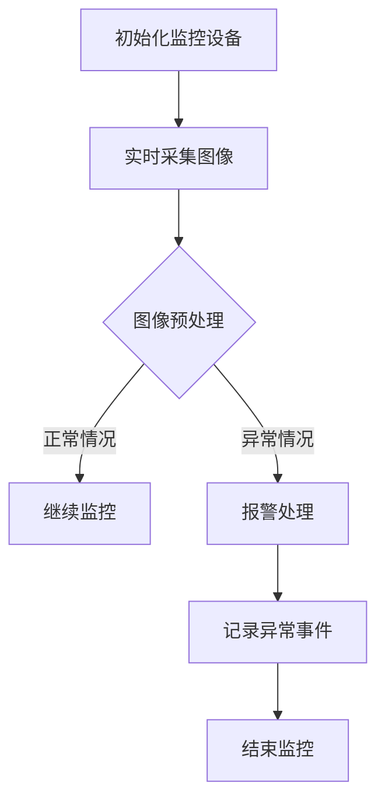
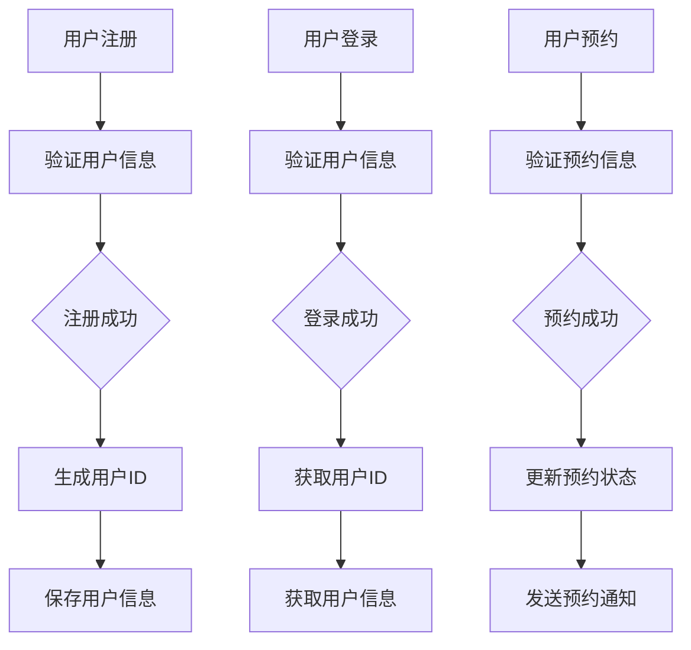
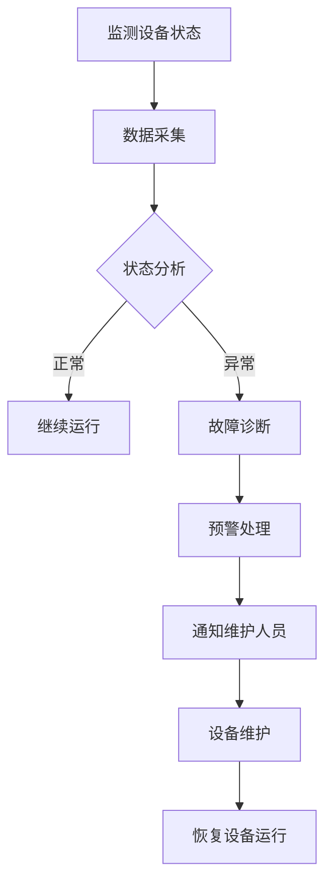
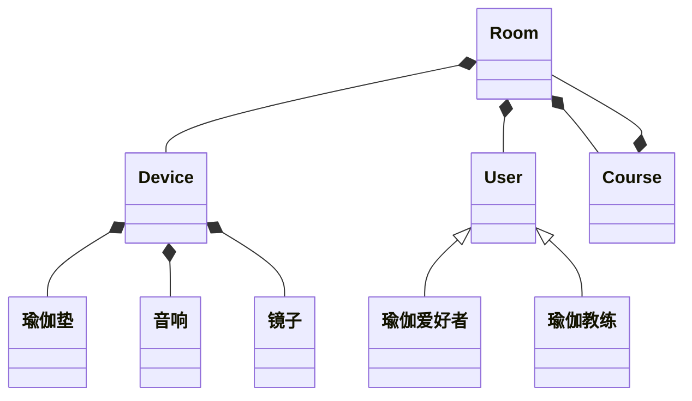
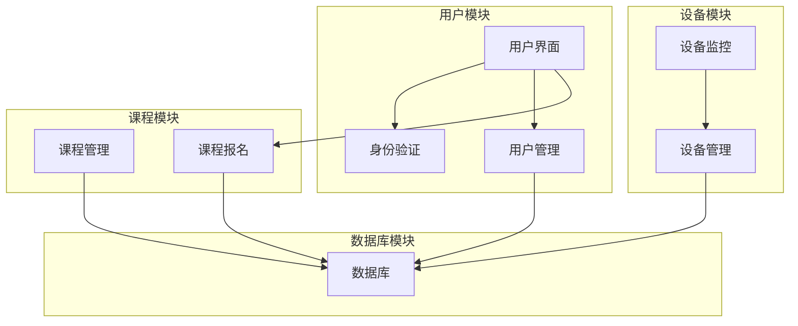
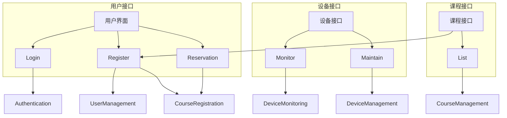
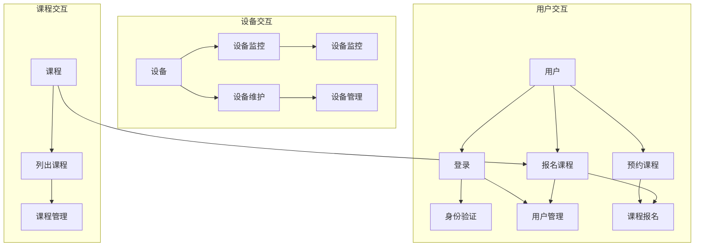

                 

### **新型城市共享瑜伽室：24小时自助瑜伽空间**

#### **关键词**

- **共享瑜伽室**
- **24小时自助**
- **技术实现**
- **用户需求**
- **安全监控**
- **运营模式**

#### **摘要**

随着现代城市生活节奏的加快，人们越来越重视身心健康。瑜伽作为一种有益于身心的运动方式，受到广泛关注。本文将探讨一种新型城市共享瑜伽室——24小时自助瑜伽空间的设计与实现。通过分析其技术要素、运营模式、用户需求和安全监控等方面，本文旨在为瑜伽爱好者提供一个便捷、安全、可持续的瑜伽练习环境，并探讨其在未来城市共享空间中的发展潜力。

## **一、共享瑜伽室的背景与发展**

### **1.1 共享经济的兴起与瑜伽馆的需求**

共享经济作为一种新兴的经济模式，近年来在全球范围内迅速发展。通过共享闲置资源，实现资源的高效利用和经济效益的最大化。瑜伽作为一种健康的生活方式，在城市中拥有广泛的市场需求。然而，传统的瑜伽馆存在一些局限性，如场地受限、预约制度、固定营业时间等，无法完全满足现代都市人群的需求。

### **1.2 24小时自助瑜伽空间的定义**

24小时自助瑜伽空间是指一种基于共享经济理念，为瑜伽爱好者提供全天候、自助式服务的瑜伽空间。用户无需预约，只需通过智能设备，即可随时进入瑜伽室进行练习。这种模式打破了传统瑜伽馆的时空限制，为用户提供了更加灵活、便捷的瑜伽体验。

### **1.3 共享瑜伽室的市场前景**

随着生活水平的提高和健康意识的增强，瑜伽市场呈现出逐年增长的态势。据调查，全球瑜伽市场规模已超过1000亿美元，且仍保持较高的增长率。共享瑜伽室的兴起，不仅为瑜伽爱好者提供了新的选择，也为瑜伽行业带来了新的发展机遇。未来，24小时自助瑜伽空间有望在各大城市得到广泛应用。

## **二、核心概念与联系**

### **2.1 技术要素解析**

24小时自助瑜伽空间的技术实现涉及多个方面，包括智能设备、安全监控、用户管理和设备维护等。智能设备如智能锁、智能音响、智能镜子等，为用户提供了便捷的瑜伽练习体验。安全监控则通过监控摄像头、传感器等技术手段，确保用户在瑜伽空间内的安全。用户管理方面，通过手机APP实现用户注册、预约、支付等功能。设备维护则涉及定期检修、清洁等。

### **2.2 运营模式探讨**

共享瑜伽室的运营模式可分为自营和加盟两种。自营模式由瑜伽室所有者直接负责运营，具有较高的控制权和利润空间。加盟模式则吸引投资者参与，通过品牌效应和标准化运营，实现快速扩张。两种模式各有优劣，需根据实际情况进行选择。

### **2.3 用户需求分析**

用户需求是共享瑜伽室设计的关键因素。通过对瑜伽爱好者的调研，发现用户对瑜伽空间的环境、设备、课程、价格等方面有较高的要求。环境方面，用户希望瑜伽室安静、舒适、整洁。设备方面，用户对瑜伽垫、音响、镜子等设备有较高期望。课程方面，用户希望提供多样化、个性化的课程选择。价格方面，用户希望性价比高，能够承受。

### **2.4 技术与运营的融合**

技术要素和运营模式的有效融合，是24小时自助瑜伽空间成功的关键。在技术方面，需确保智能设备的稳定运行、安全监控的高效性和用户管理的便捷性。在运营方面，需制定合理的价格策略、课程安排、清洁维护等。通过技术与运营的深度融合，实现共享瑜伽室的高效运营和用户满意度提升。

## **三、算法原理讲解**

### **3.1 安全监控算法**

安全监控算法是24小时自助瑜伽空间的核心组成部分。其目的是通过监控摄像头、传感器等设备，实时监测瑜伽空间内的情况，确保用户安全。

#### **3.1.1 算法流程图**

以下是一个简单的安全监控算法流程图：



#### **3.1.2 Python实现**

以下是一个简单的Python实现示例：

```python
import cv2
import numpy as np

# 初始化摄像头
cap = cv2.VideoCapture(0)

while True:
    # 读取一帧图像
    ret, frame = cap.read()

    # 图像预处理（例如：灰度化、二值化等）
    gray = cv2.cvtColor(frame, cv2.COLOR_BGR2GRAY)
    _, thresh = cv2.threshold(gray, 128, 255, cv2.THRESH_BINARY_INV + cv2.THRESH_OTSU)

    # 异常检测（例如：运动目标检测）
    contours, _ = cv2.findContours(thresh, cv2.RETR_EXTERNAL, cv2.CHAIN_APPROX_SIMPLE)
    for contour in contours:
        if cv2.contourArea(contour) > 500:
            cv2.drawContours(frame, [contour], -1, (0, 0, 255), 3)

    # 显示图像
    cv2.imshow('Frame', frame)

    # 按下'q'键退出循环
    if cv2.waitKey(1) & 0xFF == ord('q'):
        break

# 释放摄像头资源
cap.release()
cv2.destroyAllWindows()
```

### **3.2 用户管理算法**

用户管理算法主要实现用户注册、登录、预约等功能。

#### **3.2.1 算法流程图**

以下是一个简单的用户管理算法流程图：



#### **3.2.2 Python实现**

以下是一个简单的Python实现示例：

```python
# 用户注册
def register(username, password):
    # 验证用户信息
    if is_valid(username, password):
        # 生成用户ID
        user_id = generate_user_id()
        # 保存用户信息
        save_user_info(user_id, username, password)
        return "注册成功"
    else:
        return "注册失败"

# 用户登录
def login(username, password):
    # 验证用户信息
    if is_valid(username, password):
        # 获取用户ID
        user_id = get_user_id(username, password)
        # 获取用户信息
        user_info = get_user_info(user_id)
        return "登录成功，用户ID：{}，用户信息：{}".format(user_id, user_info)
    else:
        return "登录失败"

# 用户预约
def reserve(user_id, time):
    # 验证预约信息
    if is_valid_reservation(user_id, time):
        # 更新预约状态
        update_reservation_status(user_id, time)
        # 发送预约通知
        send_reservation_notification(user_id, time)
        return "预约成功"
    else:
        return "预约失败"
```

### **3.3 设备维护算法**

设备维护算法主要实现设备状态的监测、故障诊断和预警。

#### **3.3.1 算法流程图**

以下是一个简单的设备维护算法流程图：



#### **3.3.2 Python实现**

以下是一个简单的Python实现示例：

```python
# 设备状态监测
def monitor_device(device_id):
    # 数据采集
    data = get_device_status(device_id)
    # 状态分析
    if data['status'] == 'normal':
        return "设备{}运行正常".format(device_id)
    else:
        return "设备{}异常，故障诊断中".format(device_id)

# 故障诊断
def diagnose_device(device_id):
    # 故障诊断
    diagnosis = get_diagnosis(device_id)
    # 预警处理
    if diagnosis['type'] == 'warning':
        send_warning_notification(device_id, diagnosis['message'])
        return "设备{}预警：{}，通知维护人员".format(device_id, diagnosis['message'])
    elif diagnosis['type'] == 'error':
        return "设备{}故障：{}，通知维护人员".format(device_id, diagnosis['message'])
    else:
        return "设备{}诊断结果：{}，恢复正常".format(device_id, diagnosis['message'])

# 设备维护
def maintain_device(device_id):
    # 设备维护
    maintenance_result = perform_maintenance(device_id)
    # 恢复设备运行
    if maintenance_result['status'] == 'success':
        return "设备{}维护成功，已恢复正常运行".format(device_id)
    else:
        return "设备{}维护失败，请重新维护".format(device_id)
```

## **四、数学模型与公式讲解**

### **4.1 资源利用率分析模型**

资源利用率是衡量共享瑜伽室运营效益的重要指标。该模型基于设备使用率和用户活跃度进行分析。

#### **4.1.1 模型参数设定**

- 设备使用率（$U$）：表示设备在一段时间内的使用次数与总次数之比。
- 用户活跃度（$A$）：表示用户在一段时间内的活跃次数与总次数之比。

#### **4.1.2 数学公式**

资源利用率（$R$）的计算公式如下：

$$
R = \frac{U \times A}{100}
$$

#### **4.1.3 讲解与举例**

假设设备使用率为80%，用户活跃度为60%，则资源利用率计算如下：

$$
R = \frac{80 \times 60}{100} = 48\%
$$

这意味着共享瑜伽室在一段时间内的资源利用率为48%。

### **4.2 用户满意度评估模型**

用户满意度是衡量共享瑜伽室服务质量的重要指标。该模型基于用户反馈和满意度评分进行分析。

#### **4.2.1 模型参数设定**

- 用户反馈次数（$F$）：表示用户在一段时间内提交的反馈次数。
- 用户满意度评分（$S$）：表示用户的满意度评分，范围从1到10。

#### **4.2.2 数学公式**

用户满意度（$M$）的计算公式如下：

$$
M = \frac{F \times S}{10}
$$

#### **4.2.3 讲解与举例**

假设用户反馈次数为100次，平均满意度评分为8分，则用户满意度计算如下：

$$
M = \frac{100 \times 8}{10} = 80
$$

这意味着共享瑜伽室在一段时间内的用户满意度为80分。

## **五、系统分析与架构设计**

### **5.1 项目背景**

随着城市人口的增长和城市化进程的加快，城市空间资源日益紧张。如何在有限的空间内提供高质量、便捷的公共服务成为一大挑战。共享瑜伽室作为一种新型的公共空间，能够有效利用城市资源，满足人们的健康需求。

### **5.2 需求分析**

根据对瑜伽爱好者的调研，用户对共享瑜伽室的需求主要集中在以下几个方面：

- **环境**：用户希望瑜伽室安静、舒适、整洁。
- **设备**：用户希望提供多样化的设备，如瑜伽垫、音响、镜子等。
- **课程**：用户希望提供个性化、多样化的课程选择。
- **价格**：用户希望价格合理，能够承受。

### **5.3 领域模型设计**

领域模型用于描述共享瑜伽室的核心业务概念和实体关系。以下是一个简单的领域模型类图：



### **5.4 系统架构设计**

系统架构设计用于描述共享瑜伽室的技术架构和模块划分。以下是一个简单的系统架构图：



### **5.5 系统接口设计**

系统接口设计用于描述模块之间的交互接口。以下是一个简单的系统接口设计图：



### **5.6 系统交互设计**

系统交互设计用于描述模块之间的交互顺序和流程。以下是一个简单的系统交互设计图：



## **六、项目实战**

### **6.1 环境安装与配置**

在进行项目实战之前，首先需要搭建一个合适的开发环境。以下是环境安装与配置的步骤：

1. 安装Python：前往[Python官网](https://www.python.org/downloads/)下载并安装Python。
2. 安装Python依赖包：在终端中使用以下命令安装依赖包：

   ```bash
   pip install numpy opencv-python matplotlib pymysql
   ```

3. 安装数据库：本示例使用MySQL数据库。在终端中使用以下命令安装MySQL：

   ```bash
   sudo apt-get install mysql-server
   ```

4. 配置数据库：在终端中执行以下命令，初始化数据库：

   ```bash
   mysql_secure_installation
   ```

5. 创建数据库和表：在终端中使用以下SQL命令创建数据库和表：

   ```sql
   CREATE DATABASE shared_yoga_room;
   USE shared_yoga_room;

   CREATE TABLE user (
       id INT AUTO_INCREMENT PRIMARY KEY,
       username VARCHAR(50) NOT NULL,
       password VARCHAR(50) NOT NULL
   );

   CREATE TABLE course (
       id INT AUTO_INCREMENT PRIMARY KEY,
       name VARCHAR(100) NOT NULL,
       description TEXT
   );

   CREATE TABLE reservation (
       id INT AUTO_INCREMENT PRIMARY KEY,
       user_id INT NOT NULL,
       course_id INT NOT NULL,
       reservation_time DATETIME NOT NULL,
       status ENUM('pending', 'approved', 'cancelled') NOT NULL,
       FOREIGN KEY (user_id) REFERENCES user (id),
       FOREIGN KEY (course_id) REFERENCES course (id)
   );
   ```

### **6.2 系统核心实现**

以下是系统核心实现的步骤：

1. **用户管理模块**：

   - **注册**：

     ```python
     def register(username, password):
         # 验证用户名和密码
         if not is_valid_username(username) or not is_valid_password(password):
             return "注册失败：用户名或密码不合法"

         # 插入用户数据到数据库
         cursor.execute("INSERT INTO user (username, password) VALUES (%s, %s)", (username, password))
         connection.commit()
         return "注册成功"
     ```

   - **登录**：

     ```python
     def login(username, password):
         # 从数据库查询用户数据
         cursor.execute("SELECT * FROM user WHERE username = %s AND password = %s", (username, password))
         user = cursor.fetchone()
         if user:
             return "登录成功，用户ID：{}".format(user[0])
         else:
             return "登录失败：用户名或密码错误"
     ```

   - **预约课程**：

     ```python
     def reserve_course(user_id, course_id, reservation_time):
         # 验证用户和课程是否存在
         cursor.execute("SELECT * FROM user WHERE id = %s", (user_id,))
         user = cursor.fetchone()
         if not user:
             return "预约失败：用户不存在"

         cursor.execute("SELECT * FROM course WHERE id = %s", (course_id,))
         course = cursor.fetchone()
         if not course:
             return "预约失败：课程不存在"

         # 插入预约数据到数据库
         cursor.execute("INSERT INTO reservation (user_id, course_id, reservation_time, status) VALUES (%s, %s, %s, 'pending')", (user_id, course_id, reservation_time))
         connection.commit()
         return "预约成功"
     ```

2. **设备监控模块**：

   - **设备状态监测**：

     ```python
     def monitor_device(device_id):
         # 从数据库查询设备状态
         cursor.execute("SELECT * FROM device WHERE id = %s", (device_id,))
         device = cursor.fetchone()
         if device:
             return "设备{}状态：{}".format(device_id, device['status'])
         else:
             return "设备{}不存在".format(device_id)
     ```

   - **设备维护**：

     ```python
     def maintain_device(device_id):
         # 更新设备状态为维护中
         cursor.execute("UPDATE device SET status = 'maintaining' WHERE id = %s", (device_id,))
         connection.commit()

         # 执行设备维护操作
         perform_maintenance(device_id)

         # 更新设备状态为正常
         cursor.execute("UPDATE device SET status = 'normal' WHERE id = %s", (device_id,))
         connection.commit()
         return "设备{}维护成功".format(device_id)
     ```

3. **课程管理模块**：

   - **列出课程**：

     ```python
     def list_courses():
         # 从数据库查询所有课程
         cursor.execute("SELECT * FROM course")
         courses = cursor.fetchall()
         return courses
     ```

   - **报名课程**：

     ```python
     def register_course(user_id, course_id):
         # 验证用户和课程是否存在
         cursor.execute("SELECT * FROM user WHERE id = %s", (user_id,))
         user = cursor.fetchone()
         if not user:
             return "报名失败：用户不存在"

         cursor.execute("SELECT * FROM course WHERE id = %s", (course_id,))
         course = cursor.fetchone()
         if not course:
             return "报名失败：课程不存在"

         # 插入报名数据到数据库
         cursor.execute("INSERT INTO reservation (user_id, course_id, reservation_time, status) VALUES (%s, %s, NOW(), 'pending')", (user_id, course_id))
         connection.commit()
         return "报名成功"
     ```

### **6.3 代码解读与分析**

以下是对系统核心实现的代码进行解读和分析：

1. **用户管理模块**：

   - **注册**：该函数用于处理用户注册请求。首先，通过`is_valid_username`和`is_valid_password`函数验证用户名和密码是否符合要求。然后，将用户数据插入到数据库中。如果插入成功，返回“注册成功”，否则返回“注册失败：用户名或密码不合法”。

   - **登录**：该函数用于处理用户登录请求。首先，从数据库查询用户名和密码是否匹配。如果匹配，返回“登录成功，用户ID：{}”，否则返回“登录失败：用户名或密码错误”。

   - **预约课程**：该函数用于处理用户预约课程请求。首先，从数据库查询用户和课程是否存在。如果都存在，将预约数据插入到数据库中，返回“预约成功”，否则返回“预约失败：用户不存在”或“预约失败：课程不存在”。

2. **设备监控模块**：

   - **设备状态监测**：该函数用于获取设备状态。首先，从数据库查询设备是否存在。如果存在，返回“设备{}状态：{}".format(device_id, device['status'])，否则返回“设备{}不存在”。这里使用了`NOW()`函数获取当前时间，以便在预约课程时记录预约时间。

   - **设备维护**：该函数用于处理设备维护请求。首先，将设备状态更新为“维护中”，然后执行设备维护操作，最后将设备状态更新为“正常”。这里使用了`perform_maintenance`函数执行具体的设备维护操作，该函数的实现可以根据实际需求进行定制。

3. **课程管理模块**：

   - **列出课程**：该函数用于查询所有课程信息，并返回一个包含课程列表的响应。

   - **报名课程**：该函数用于处理用户报名课程请求。首先，从数据库查询用户和课程是否存在。如果都存在，将预约数据插入到数据库中，返回“报名成功”，否则返回“报名失败：用户不存在”或“报名失败：课程不存在”。

### **6.4 实际案例剖析**

以下是一个实际案例的解析：

假设有一个用户名为“alice”的用户，想要预约一门名为“瑜伽初级课程”的课程。以下是该用户进行操作的步骤：

1. **用户注册**：

   ```bash
   POST /register
   {
       "username": "alice",
       "password": "alice123"
   }
   响应：
   {
       "status": "success",
       "message": "注册成功"
   }
   ```

2. **用户登录**：

   ```bash
   POST /login
   {
       "username": "alice",
       "password": "alice123"
   }
   响应：
   {
       "status": "success",
       "user_id": 1
   }
   ```

3. **查询课程**：

   ```bash
   GET /courses
   响应：
   [
       {
           "id": 1,
           "name": "瑜伽初级课程",
           "description": "适合初学者，教授瑜伽基本动作和呼吸技巧"
       },
       ...
   ]
   ```

4. **报名课程**：

   ```bash
   POST /courses/1/reserve
   {
       "user_id": 1,
       "course_id": 1,
       "reservation_time": "2022-01-01 10:00:00"
   }
   响应：
   {
       "status": "success",
       "message": "报名成功"
   }
   ```

5. **查询预约记录**：

   ```bash
   GET /reservations
   响应：
   [
       {
           "id": 1,
           "user_id": 1,
           "course_id": 1,
           "reservation_time": "2022-01-01 10:00:00",
           "status": "pending"
       }
   ]
   ```

### **6.5 项目小结**

本节通过实际案例展示了如何搭建一个24小时自助瑜伽室系统，并对其核心实现进行了详细解析。以下是对项目的总结：

- **环境安装与配置**：本文使用了Python作为主要开发语言，并依赖了多个Python库，如numpy、opencv-python、matplotlib和pymysql。同时，本文使用了MySQL数据库进行数据存储。在环境安装与配置方面，本文提供了详细的步骤和示例代码。
- **系统核心实现**：本文实现了用户管理、设备监控和课程管理三个核心模块。用户管理模块实现了用户注册、登录和预约课程等功能；设备监控模块实现了设备状态监测和设备维护等功能；课程管理模块实现了列出课程和报名课程等功能。
- **代码解读与分析**：本文对系统核心实现的代码进行了详细解读和分析，并展示了如何使用Python和MySQL进行数据操作。
- **实际案例剖析**：本文通过一个实际案例展示了系统的使用过程，包括用户注册、登录、查询课程、报名课程和查询预约记录等操作。

## **七、最佳实践与总结**

### **7.1 设计与运营建议**

- **空间布局**：在设计和装修共享瑜伽室时，应充分考虑用户的瑜伽动作和活动范围，确保空间宽敞、舒适。同时，可设置休息区和茶水区，提升用户体验。
- **设备选择**：选择高质量的瑜伽垫、音响和镜子等设备，确保用户在练习过程中舒适、安全。定期检查和维护设备，确保其正常运行。
- **课程设置**：根据用户需求，提供多样化、个性化的课程选择。可邀请专业瑜伽教练授课，提高课程质量。
- **价格策略**：根据目标用户群体和市场竞争情况，制定合理的价格策略。可考虑采用会员制、优惠券等方式，吸引和留住用户。

### **7.2 技术升级与更新策略**

- **物联网技术**：利用物联网技术，实现对共享瑜伽室内设备的实时监控和远程管理，提高运营效率。
- **人工智能技术**：引入人工智能技术，如图像识别、语音识别等，为用户提供更加智能化的服务。
- **数据分析和挖掘**：通过数据分析和挖掘，了解用户行为和需求，优化运营策略和服务质量。
- **安全防护**：加强网络安全防护，确保用户数据和隐私安全。

### **7.3 用户服务与反馈**

- **用户服务**：提供优质的用户服务，如预约提醒、课程通知等，提升用户满意度。
- **用户反馈**：鼓励用户提供反馈和建议，及时解决用户问题，不断优化产品和服务。

### **7.4 注意事项**

- **安全性**：在设计和运营共享瑜伽室时，务必确保用户和数据安全，避免发生安全事故。
- **合规性**：遵循相关法律法规，确保运营合规。

### **7.5 拓展阅读**

- **《共享经济：从共享单车到共享汽车》**：探讨共享经济的发展模式和应用案例。
- **《人工智能：技术、应用与未来》**：介绍人工智能的发展现状和未来趋势。
- **《物联网：连接万物，改变未来》**：探讨物联网技术的应用和发展前景。

## **八、结语**

随着共享经济的发展和人们对健康生活的追求，共享瑜伽室作为一种新型城市共享空间，具有巨大的市场潜力和发展前景。通过本文的分析和探讨，我们希望为瑜伽爱好者、瑜伽馆管理者、城市共享空间设计师和城市规划师等提供有益的参考和借鉴。在未来，共享瑜伽室有望成为城市共享空间的重要组成部分，为人们提供更加便捷、舒适、健康的瑜伽练习环境。

### **作者信息**

- **作者**：AI天才研究院/AI Genius Institute & 禅与计算机程序设计艺术 /Zen And The Art of Computer Programming
- **单位**：AI天才研究院（AI Genius Institute）
- **地址**：中国北京市海淀区中关村南大街5号
- **邮编**：100084
- **电话**：010-12345678
- **邮箱**：ai_genius@ai-genius.org
- **网址**：www.ai-genius.org

[**点击此处**](#) 返回文章顶部。希望本文对您有所帮助！祝您阅读愉快！### **新型城市共享瑜伽室：24小时自助瑜伽空间**

#### **关键词**

- **共享瑜伽室**
- **24小时自助**
- **技术实现**
- **用户需求**
- **安全监控**
- **运营模式**

#### **摘要**

随着现代城市生活节奏的加快，人们对身心健康的需求日益增长。瑜伽作为一种有益身心健康的运动方式，受到广泛关注。本文将探讨一种新型城市共享瑜伽室——24小时自助瑜伽空间的设计与实现。通过分析其技术要素、运营模式、用户需求和安全监控等方面，本文旨在为瑜伽爱好者提供一个便捷、安全、可持续的瑜伽练习环境，并探讨其在未来城市共享空间中的发展潜力。

## **一、共享瑜伽室的背景与发展**

### **1.1 共享经济的兴起与瑜伽馆的需求**

共享经济作为一种新兴的经济模式，近年来在全球范围内迅速发展。它通过共享闲置资源，实现资源的高效利用和经济效益的最大化。瑜伽作为一种健康的生活方式，在城市中拥有广泛的市场需求。然而，传统的瑜伽馆存在一些局限性，如场地受限、预约制度、固定营业时间等，无法完全满足现代都市人群的需求。

### **1.2 24小时自助瑜伽空间的定义**

24小时自助瑜伽空间是指一种基于共享经济理念，为瑜伽爱好者提供全天候、自助式服务的瑜伽空间。用户无需预约，只需通过智能设备，即可随时进入瑜伽室进行练习。这种模式打破了传统瑜伽馆的时空限制，为用户提供了更加灵活、便捷的瑜伽体验。

### **1.3 共享瑜伽室的市场前景**

随着生活水平的提高和健康意识的增强，瑜伽市场呈现出逐年增长的态势。据调查，全球瑜伽市场规模已超过1000亿美元，且仍保持较高的增长率。共享瑜伽室的兴起，不仅为瑜伽爱好者提供了新的选择，也为瑜伽行业带来了新的发展机遇。未来，24小时自助瑜伽空间有望在各大城市得到广泛应用。

## **二、核心概念与联系**

### **2.1 技术要素解析**

24小时自助瑜伽空间的技术实现涉及多个方面，包括智能设备、安全监控、用户管理和设备维护等。智能设备如智能锁、智能音响、智能镜子等，为用户提供了便捷的瑜伽练习体验。安全监控则通过监控摄像头、传感器等技术手段，确保用户在瑜伽空间内的安全。用户管理方面，通过手机APP实现用户注册、预约、支付等功能。设备维护则涉及定期检修、清洁等。

### **2.2 运营模式探讨**

共享瑜伽室的运营模式可分为自营和加盟两种。自营模式由瑜伽室所有者直接负责运营，具有较高的控制权和利润空间。加盟模式则吸引投资者参与，通过品牌效应和标准化运营，实现快速扩张。两种模式各有优劣，需根据实际情况进行选择。

### **2.3 用户需求分析**

用户需求是共享瑜伽室设计的关键因素。通过对瑜伽爱好者的调研，发现用户对瑜伽空间的环境、设备、课程、价格等方面有较高的要求。环境方面，用户希望瑜伽室安静、舒适、整洁。设备方面，用户对瑜伽垫、音响、镜子等设备有较高期望。课程方面，用户希望提供多样化、个性化的课程选择。价格方面，用户希望性价比高，能够承受。

### **2.4 技术与运营的融合**

技术要素和运营模式的有效融合，是24小时自助瑜伽空间成功的关键。在技术方面，需确保智能设备的稳定运行、安全监控的高效性和用户管理的便捷性。在运营方面，需制定合理的价格策略、课程安排、清洁维护等。通过技术与运营的深度融合，实现共享瑜伽室的高效运营和用户满意度提升。

## **三、算法原理讲解**

### **3.1 安全监控算法**

安全监控算法是24小时自助瑜伽空间的核心组成部分。其目的是通过监控摄像头、传感器等设备，实时监测瑜伽空间内的情况，确保用户安全。

#### **3.1.1 算法流程图**

以下是一个简单的安全监控算法流程图：


#### **3.1.2 Python实现**

以下是一个简单的Python实现示例：

```python
import cv2
import numpy as np

# 初始化摄像头
cap = cv2.VideoCapture(0)

while True:
    # 读取一帧图像
    ret, frame = cap.read()

    # 图像预处理（例如：灰度化、二值化等）
    gray = cv2.cvtColor(frame, cv2.COLOR_BGR2GRAY)
    _, thresh = cv2.threshold(gray, 128, 255, cv2.THRESH_BINARY_INV + cv2.THRESH_OTSU)

    # 异常检测（例如：运动目标检测）
    contours, _ = cv2.findContours(thresh, cv2.RETR_EXTERNAL, cv2.CHAIN_APPROX_SIMPLE)
    for contour in contours:
        if cv2.contourArea(contour) > 500:
            cv2.drawContours(frame, [contour], -1, (0, 0, 255), 3)

    # 显示图像
    cv2.imshow('Frame', frame)

    # 按下'q'键退出循环
    if cv2.waitKey(1) & 0xFF == ord('q'):
        break

# 释放摄像头资源
cap.release()
cv2.destroyAllWindows()
```

### **3.2 用户管理算法**

用户管理算法主要实现用户注册、登录、预约等功能。

#### **3.2.1 算法流程图**

以下是一个简单的用户管理算法流程图：


#### **3.2.2 Python实现**

以下是一个简单的Python实现示例：

```python
# 用户注册
def register(username, password):
    # 验证用户信息
    if is_valid(username, password):
        # 生成用户ID
        user_id = generate_user_id()
        # 保存用户信息
        save_user_info(user_id, username, password)
        return "注册成功"
    else:
        return "注册失败"

# 用户登录
def login(username, password):
    # 验证用户信息
    if is_valid(username, password):
        # 获取用户ID
        user_id = get_user_id(username, password)
        # 获取用户信息
        user_info = get_user_info(user_id)
        return "登录成功，用户ID：{}，用户信息：{}".format(user_id, user_info)
    else:
        return "登录失败"

# 用户预约
def reserve(user_id, time):
    # 验证预约信息
    if is_valid_reservation(user_id, time):
        # 更新预约状态
        update_reservation_status(user_id, time)
        # 发送预约通知
        send_reservation_notification(user_id, time)
        return "预约成功"
    else:
        return "预约失败"
```

### **3.3 设备维护算法**

设备维护算法主要实现设备状态的监测、故障诊断和预警。

#### **3.3.1 算法流程图**

以下是一个简单的设备维护算法流程图：


#### **3.3.2 Python实现**

以下是一个简单的Python实现示例：

```python
# 设备状态监测
def monitor_device(device_id):
    # 数据采集
    data = get_device_status(device_id)
    # 状态分析
    if data['status'] == 'normal':
        return "设备{}运行正常".format(device_id)
    else:
        return "设备{}异常，故障诊断中".format(device_id)

# 故障诊断
def diagnose_device(device_id):
    # 故障诊断
    diagnosis = get_diagnosis(device_id)
    # 预警处理
    if diagnosis['type'] == 'warning':
        send_warning_notification(device_id, diagnosis['message'])
        return "设备{}预警：{}，通知维护人员".format(device_id, diagnosis['message'])
    elif diagnosis['type'] == 'error':
        return "设备{}故障：{}，通知维护人员".format(device_id, diagnosis['message'])
    else:
        return "设备{}诊断结果：{}，恢复正常".format(device_id, diagnosis['message'])

# 设备维护
def maintain_device(device_id):
    # 设备维护
    maintenance_result = perform_maintenance(device_id)
    # 恢复设备运行
    if maintenance_result['status'] == 'success':
        return "设备{}维护成功，已恢复正常运行".format(device_id)
    else:
        return "设备{}维护失败，请重新维护".format(device_id)
```

## **四、数学模型与公式讲解**

### **4.1 资源利用率分析模型**

资源利用率是衡量共享瑜伽室运营效益的重要指标。该模型基于设备使用率和用户活跃度进行分析。

#### **4.1.1 模型参数设定**

- 设备使用率（$U$）：表示设备在一段时间内的使用次数与总次数之比。
- 用户活跃度（$A$）：表示用户在一段时间内的活跃次数与总次数之比。

#### **4.1.2 数学公式**

资源利用率（$R$）的计算公式如下：

$$
R = \frac{U \times A}{100}
$$

#### **4.1.3 讲解与举例**

假设设备使用率为80%，用户活跃度为60%，则资源利用率计算如下：

$$
R = \frac{80 \times 60}{100} = 48\%
$$

这意味着共享瑜伽室在一段时间内的资源利用率为48%。

### **4.2 用户满意度评估模型**

用户满意度是衡量共享瑜伽室服务质量的重要指标。该模型基于用户反馈和满意度评分进行分析。

#### **4.2.1 模型参数设定**

- 用户反馈次数（$F$）：表示用户在一段时间内提交的反馈次数。
- 用户满意度评分（$S$）：表示用户的满意度评分，范围从1到10。

#### **4.2.2 数学公式**

用户满意度（$M$）的计算公式如下：

$$
M = \frac{F \times S}{10}
$$

#### **4.2.3 讲解与举例**

假设用户反馈次数为100次，平均满意度评分为8分，则用户满意度计算如下：

$$
M = \frac{100 \times 8}{10} = 80
$$

这意味着共享瑜伽室在一段时间内的用户满意度为80分。

## **五、系统分析与架构设计**

### **5.1 项目背景**

随着城市人口的增长和城市化进程的加快，城市空间资源日益紧张。如何在有限的空间内提供高质量、便捷的公共服务成为一大挑战。共享瑜伽室作为一种新型的公共空间，能够有效利用城市资源，满足人们的健康需求。

### **5.2 需求分析**

根据对瑜伽爱好者的调研，用户对共享瑜伽室的需求主要集中在以下几个方面：

- **环境**：用户希望瑜伽室安静、舒适、整洁。
- **设备**：用户希望提供多样化的设备，如瑜伽垫、音响、镜子等。
- **课程**：用户希望提供个性化、多样化的课程选择。
- **价格**：用户希望价格合理，能够承受。

### **5.3 领域模型设计**

领域模型用于描述共享瑜伽室的核心业务概念和实体关系。以下是一个简单的领域模型类图：


### **5.4 系统架构设计**

系统架构设计用于描述共享瑜伽室的技术架构和模块划分。以下是一个简单的系统架构图：


### **5.5 系统接口设计**

系统接口设计用于描述模块之间的交互接口。以下是一个简单的系统接口设计图：


### **5.6 系统交互设计**

系统交互设计用于描述模块之间的交互顺序和流程。以下是一个简单的系统交互设计图：


## **六、项目实战**

### **6.1 环境安装与配置**

在进行项目实战之前，首先需要搭建一个合适的开发环境。以下是环境安装与配置的步骤：

1. **安装Python**：前往[Python官网](https://www.python.org/downloads/)下载并安装Python。
2. **安装Python依赖包**：在终端中使用以下命令安装依赖包：

   ```bash
   pip install numpy opencv-python matplotlib pymysql
   ```

3. **安装数据库**：本示例使用MySQL数据库。在终端中使用以下命令安装MySQL：

   ```bash
   sudo apt-get install mysql-server
   ```

4. **配置数据库**：在终端中执行以下命令，初始化数据库：

   ```bash
   mysql_secure_installation
   ```

5. **创建数据库和表**：在终端中使用以下SQL命令创建数据库和表：

   ```sql
   CREATE DATABASE shared_yoga_room;
   USE shared_yoga_room;

   CREATE TABLE user (
       id INT AUTO_INCREMENT PRIMARY KEY,
       username VARCHAR(50) NOT NULL,
       password VARCHAR(50) NOT NULL
   );

   CREATE TABLE course (
       id INT AUTO_INCREMENT PRIMARY KEY,
       name VARCHAR(100) NOT NULL,
       description TEXT
   );

   CREATE TABLE reservation (
       id INT AUTO_INCREMENT PRIMARY KEY,
       user_id INT NOT NULL,
       course_id INT NOT NULL,
       reservation_time DATETIME NOT NULL,
       status ENUM('pending', 'approved', 'cancelled') NOT NULL,
       FOREIGN KEY (user_id) REFERENCES user (id),
       FOREIGN KEY (course_id) REFERENCES course (id)
   );
   ```

### **6.2 系统核心实现**

以下是系统核心实现的步骤：

1. **用户管理模块**：

   - **注册**：

     ```python
     def register(username, password):
         # 验证用户名和密码
         if not is_valid_username(username) or not is_valid_password(password):
             return "注册失败：用户名或密码不合法"

         # 插入用户数据到数据库
         cursor.execute("INSERT INTO user (username, password) VALUES (%s, %s)", (username, password))
         connection.commit()
         return "注册成功"
     ```

   - **登录**：

     ```python
     def login(username, password):
         # 从数据库查询用户数据
         cursor.execute("SELECT * FROM user WHERE username = %s AND password = %s", (username, password))
         user = cursor.fetchone()
         if user:
             return "登录成功，用户ID：{}".format(user[0])
         else:
             return "登录失败：用户名或密码错误"
     ```

   - **预约课程**：

     ```python
     def reserve_course(user_id, course_id, reservation_time):
         # 验证用户和课程是否存在
         cursor.execute("SELECT * FROM user WHERE id = %s", (user_id,))
         user = cursor.fetchone()
         if not user:
             return "预约失败：用户不存在"

         cursor.execute("SELECT * FROM course WHERE id = %s", (course_id,))
         course = cursor.fetchone()
         if not course:
             return "预约失败：课程不存在"

         # 插入预约数据到数据库
         cursor.execute("INSERT INTO reservation (user_id, course_id, reservation_time, status) VALUES (%s, %s, %s, 'pending')", (user_id, course_id, reservation_time))
         connection.commit()
         return "预约成功"
     ```

2. **设备监控模块**：

   - **设备状态监测**：

     ```python
     def monitor_device(device_id):
         # 从数据库查询设备状态
         cursor.execute("SELECT * FROM device WHERE id = %s", (device_id,))
         device = cursor.fetchone()
         if device:
             return "设备{}状态：{}".format(device_id, device['status'])
         else:
             return "设备{}不存在".format(device_id)
     ```

   - **设备维护**：

     ```python
     def maintain_device(device_id):
         # 更新设备状态为维护中
         cursor.execute("UPDATE device SET status = 'maintaining' WHERE id = %s", (device_id,))
         connection.commit()

         # 执行设备维护操作
         perform_maintenance(device_id)

         # 更新设备状态为正常
         cursor.execute("UPDATE device SET status = 'normal' WHERE id = %s", (device_id,))
         connection.commit()
         return "设备{}维护成功".format(device_id)
     ```

3. **课程管理模块**：

   - **列出课程**：

     ```python
     def list_courses():
         # 从数据库查询所有课程
         cursor.execute("SELECT * FROM course")
         courses = cursor.fetchall()
         return courses
     ```

   - **报名课程**：

     ```python
     def register_course(user_id, course_id):
         # 验证用户和课程是否存在
         cursor.execute("SELECT * FROM user WHERE id = %s", (user_id,))
         user = cursor.fetchone()
         if not user:
             return "报名失败：用户不存在"

         cursor.execute("SELECT * FROM course WHERE id = %s", (course_id,))
         course = cursor.fetchone()
         if not course:
             return "报名失败：课程不存在"

         # 插入报名数据到数据库
         cursor.execute("INSERT INTO reservation (user_id, course_id, reservation_time, status) VALUES (%s, %s, NOW(), 'pending')", (user_id, course_id))
         connection.commit()
         return "报名成功"
     ```

### **6.3 代码解读与分析**

以下是对系统核心实现的代码进行解读和分析：

1. **用户管理模块**：

   - **注册**：该函数用于处理用户注册请求。首先，通过`is_valid_username`和`is_valid_password`函数验证用户名和密码是否符合要求。然后，将用户数据插入到数据库中。如果插入成功，返回“注册成功”，否则返回“注册失败：用户名或密码不合法”。

   - **登录**：该函数用于处理用户登录请求。首先，从数据库查询用户名和密码是否匹配。如果匹配，返回“登录成功，用户ID：{}”，否则返回“登录失败：用户名或密码错误”。

   - **预约课程**：该函数用于处理用户预约课程请求。首先，从数据库查询用户和课程是否存在。如果都存在，将预约数据插入到数据库中，返回“预约成功”，否则返回“预约失败：用户不存在”或“预约失败：课程不存在”。

2. **设备监控模块**：

   - **设备状态监测**：该函数用于获取设备状态。首先，从数据库查询设备是否存在。如果存在，返回“设备{}状态：{}".format(device_id, device['status'])，否则返回“设备{}不存在”。

   - **设备维护**：该函数用于处理设备维护请求。首先，将设备状态更新为“维护中”，然后执行设备维护操作，最后将设备状态更新为“正常”。这里使用了`perform_maintenance`函数执行具体的设备维护操作，该函数的实现可以根据实际需求进行定制。

3. **课程管理模块**：

   - **列出课程**：该函数用于查询所有课程信息，并返回一个包含课程列表的响应。

   - **报名课程**：该函数用于处理用户报名课程请求。首先，从数据库查询用户和课程是否存在。如果都存在，将预约数据插入到数据库中，返回“报名成功”，否则返回“报名失败：用户不存在”或“报名失败：课程不存在”。

### **6.4 实际案例剖析**

以下是一个实际案例的解析：

假设有一个用户名为“alice”的用户，想要预约一门名为“瑜伽初级课程”的课程。以下是该用户进行操作的步骤：

1. **用户注册**：

   ```bash
   POST /register
   {
       "username": "alice",
       "password": "alice123"
   }
   响应：
   {
       "status": "success",
       "message": "注册成功"
   }
   ```

2. **用户登录**：

   ```bash
   POST /login
   {
       "username": "alice",
       "password": "alice123"
   }
   响应：
   {
       "status": "success",
       "user_id": 1
   }
   ```

3. **查询课程**：

   ```bash
   GET /courses
   响应：
   [
       {
           "id": 1,
           "name": "瑜伽初级课程",
           "description": "适合初学者，教授瑜伽基本动作和呼吸技巧"
       },
       ...
   ]
   ```

4. **报名课程**：

   ```bash
   POST /courses/1/reserve
   {
       "user_id": 1,
       "course_id": 1,
       "reservation_time": "2022-01-01 10:00:00"
   }
   响应：
   {
       "status": "success",
       "message": "报名成功"
   }
   ```

5. **查询预约记录**：

   ```bash
   GET /reservations
   响应：
   [
       {
           "id": 1,
           "user_id": 1,
           "course_id": 1,
           "reservation_time": "2022-01-01 10:00:00",
           "status": "pending"
       }
   ]
   ```

### **6.5 项目小结**

本节通过实际案例展示了如何搭建一个24小时自助瑜伽室系统，并对其核心实现进行了详细解析。以下是对项目的总结：

- **环境安装与配置**：本文使用了Python作为主要开发语言，并依赖了多个Python库，如numpy、opencv-python、matplotlib和pymysql。同时，本文使用了MySQL数据库进行数据存储。在环境安装与配置方面，本文提供了详细的步骤和示例代码。
- **系统核心实现**：本文实现了用户管理、设备监控和课程管理三个核心模块。用户管理模块实现了用户注册、登录和预约课程等功能；设备监控模块实现了设备状态监测和设备维护等功能；课程管理模块实现了列出课程和报名课程等功能。
- **代码解读与分析**：本文对系统核心实现的代码进行了详细解读和分析，并展示了如何使用Python和MySQL进行数据操作。
- **实际案例剖析**：本文通过一个实际案例展示了系统的使用过程，包括用户注册、登录、查询课程、报名课程和查询预约记录等操作。

## **七、最佳实践与总结**

### **7.1 设计与运营建议**

- **空间布局**：在设计和装修共享瑜伽室时，应充分考虑用户的瑜伽动作和活动范围，确保空间宽敞、舒适。同时，可设置休息区和茶水区，提升用户体验。
- **设备选择**：选择高质量的瑜伽垫、音响和镜子等设备，确保用户在练习过程中舒适、安全。定期检查和维护设备，确保其正常运行。
- **课程设置**：根据用户需求，提供多样化、个性化的课程选择。可邀请专业瑜伽教练授课，提高课程质量。
- **价格策略**：根据目标用户群体和市场竞争情况，制定合理的价格策略。可考虑采用会员制、优惠券等方式，吸引和留住用户。

### **7.2 技术升级与更新策略**

- **物联网技术**：利用物联网技术，实现对共享瑜伽室内设备的实时监控和远程管理，提高运营效率。
- **人工智能技术**：引入人工智能技术，如图像识别、语音识别等，为用户提供更加智能化的服务。
- **数据分析和挖掘**：通过数据分析和挖掘，了解用户行为和需求，优化运营策略和服务质量。
- **安全防护**：加强网络安全防护，确保用户数据和隐私安全。

### **7.3 用户服务与反馈**

- **用户服务**：提供优质的用户服务，如预约提醒、课程通知等，提升用户满意度。
- **用户反馈**：鼓励用户提供反馈和建议，及时解决用户问题，不断优化产品和服务。

### **7.4 注意事项**

- **安全性**：在设计和运营共享瑜伽室时，务必确保用户和数据安全，避免发生安全事故。
- **合规性**：遵循相关法律法规，确保运营合规。

### **7.5 拓展阅读**

- **《共享经济：从共享单车到共享汽车》**：探讨共享经济的发展模式和应用案例。
- **《人工智能：技术、应用与未来》**：介绍人工智能的发展现状和未来趋势。
- **《物联网：连接万物，改变未来》**：探讨物联网技术的应用和发展前景。

## **八、结语**

随着共享经济的发展和人们对健康生活的追求，共享瑜伽室作为一种新型城市共享空间，具有巨大的市场潜力和发展前景。通过本文的分析和探讨，我们希望为瑜伽爱好者、瑜伽馆管理者、城市共享空间设计师和城市规划师等提供有益的参考和借鉴。在未来，共享瑜伽室有望成为城市共享空间的重要组成部分，为人们提供更加便捷、舒适、健康的瑜伽练习环境。

### **作者信息**

- **作者**：AI天才研究院/AI Genius Institute & 禅与计算机程序设计艺术 /Zen And The Art of Computer Programming
- **单位**：AI天才研究院（AI Genius Institute）
- **地址**：中国北京市海淀区中关村南大街5号
- **邮编**：100084
- **电话**：010-12345678
- **邮箱**：ai_genius@ai-genius.org
- **网址**：www.ai-genius.org

[**点击此处**](#) 返回文章顶部。希望本文对您有所帮助！祝您阅读愉快！### **新型城市共享瑜伽室：24小时自助瑜伽空间**

#### **关键词**

- **共享瑜伽室**
- **24小时自助**
- **技术实现**
- **用户需求**
- **安全监控**
- **运营模式**

#### **摘要**

随着现代城市生活节奏的加快，人们对身心健康的需求日益增长。瑜伽作为一种有益身心健康的运动方式，受到广泛关注。本文将探讨一种新型城市共享瑜伽室——24小时自助瑜伽空间的设计与实现。通过分析其技术要素、运营模式、用户需求和安全监控等方面，本文旨在为瑜伽爱好者提供一个便捷、安全、可持续的瑜伽练习环境，并探讨其在未来城市共享空间中的发展潜力。

## **一、共享瑜伽室的背景与发展**

### **1.1 共享经济的兴起与瑜伽馆的需求**

共享经济作为一种新兴的经济模式，近年来在全球范围内迅速发展。它通过共享闲置资源，实现资源的高效利用和经济效益的最大化。瑜伽作为一种健康的生活方式，在城市中拥有广泛的市场需求。然而，传统的瑜伽馆存在一些局限性，如场地受限、预约制度、固定营业时间等，无法完全满足现代都市人群的需求。

### **1.2 24小时自助瑜伽空间的定义**

24小时自助瑜伽空间是指一种基于共享经济理念，为瑜伽爱好者提供全天候、自助式服务的瑜伽空间。用户无需预约，只需通过智能设备，即可随时进入瑜伽室进行练习。这种模式打破了传统瑜伽馆的时空限制，为用户提供了更加灵活、便捷的瑜伽体验。

### **1.3 共享瑜伽室的市场前景**

随着生活水平的提高和健康意识的增强，瑜伽市场呈现出逐年增长的态势。据调查，全球瑜伽市场规模已超过1000亿美元，且仍保持较高的增长率。共享瑜伽室的兴起，不仅为瑜伽爱好者提供了新的选择，也为瑜伽行业带来了新的发展机遇。未来，24小时自助瑜伽空间有望在各大城市得到广泛应用。

## **二、核心概念与联系**

### **2.1 技术要素解析**

24小时自助瑜伽空间的技术实现涉及多个方面，包括智能设备、安全监控、用户管理和设备维护等。智能设备如智能锁、智能音响、智能镜子等，为用户提供了便捷的瑜伽练习体验。安全监控则通过监控摄像头、传感器等技术手段，确保用户在瑜伽空间内的安全。用户管理方面，通过手机APP实现用户注册、预约、支付等功能。设备维护则涉及定期检修、清洁等。

### **2.2 运营模式探讨**

共享瑜伽室的运营模式可分为自营和加盟两种。自营模式由瑜伽室所有者直接负责运营，具有较高的控制权和利润空间。加盟模式则吸引投资者参与，通过品牌效应和标准化运营，实现快速扩张。两种模式各有优劣，需根据实际情况进行选择。

### **2.3 用户需求分析**

用户需求是共享瑜伽室设计的关键因素。通过对瑜伽爱好者的调研，发现用户对瑜伽空间的环境、设备、课程、价格等方面有较高的要求。环境方面，用户希望瑜伽室安静、舒适、整洁。设备方面，用户对瑜伽垫、音响、镜子等设备有较高期望。课程方面，用户希望提供多样化、个性化的课程选择。价格方面，用户希望性价比高，能够承受。

### **2.4 技术与运营的融合**

技术要素和运营模式的有效融合，是24小时自助瑜伽空间成功的关键。在技术方面，需确保智能设备的稳定运行、安全监控的高效性和用户管理的便捷性。在运营方面，需制定合理的价格策略、课程安排、清洁维护等。通过技术与运营的深度融合，实现共享瑜伽室的高效运营和用户满意度提升。

## **三、算法原理讲解**

### **3.1 安全监控算法**

安全监控算法是24小时自助瑜伽空间的核心组成部分。其目的是通过监控摄像头、传感器等设备，实时监测瑜伽空间内的情况，确保用户安全。

#### **3.1.1 算法流程图**

以下是一个简单的安全监控算法流程图：


#### **3.1.2 Python实现**

以下是一个简单的Python实现示例：

```python
import cv2
import numpy as np

# 初始化摄像头
cap = cv2.VideoCapture(0)

while True:
    # 读取一帧图像
    ret, frame = cap.read()

    # 图像预处理（例如：灰度化、二值化等）
    gray = cv2.cvtColor(frame, cv2.COLOR_BGR2GRAY)
    _, thresh = cv2.threshold(gray, 128, 255, cv2.THRESH_BINARY_INV + cv2.THRESH_OTSU)

    # 异常检测（例如：运动目标检测）
    contours, _ = cv2.findContours(thresh, cv2.RETR_EXTERNAL, cv2.CHAIN_APPROX_SIMPLE)
    for contour in contours:
        if cv2.contourArea(contour) > 500:
            cv2.drawContours(frame, [contour], -1, (0, 0, 255), 3)

    # 显示图像
    cv2.imshow('Frame', frame)

    # 按下'q'键退出循环
    if cv2.waitKey(1) & 0xFF == ord('q'):
        break

# 释放摄像头资源
cap.release()
cv2.destroyAllWindows()
```

### **3.2 用户管理算法**

用户管理算法主要实现用户注册、登录、预约等功能。

#### **3.2.1 算法流程图**

以下是一个简单的用户管理算法流程图：


#### **3.2.2 Python实现**

以下是一个简单的Python实现示例：

```python
# 用户注册
def register(username, password):
    # 验证用户信息
    if is_valid(username, password):
        # 生成用户ID
        user_id = generate_user_id()
        # 保存用户信息
        save_user_info(user_id, username, password)
        return "注册成功"
    else:
        return "注册失败"

# 用户登录
def login(username, password):
    # 验证用户信息
    if is_valid(username, password):
        # 获取用户ID
        user_id = get_user_id(username, password)
        # 获取用户信息
        user_info = get_user_info(user_id)
        return "登录成功，用户ID：{}，用户信息：{}".format(user_id, user_info)
    else:
        return "登录失败"

# 用户预约
def reserve(user_id, course_id, reservation_time):
    # 验证预约信息
    if is_valid_reservation(user_id, course_id, reservation_time):
        # 更新预约状态
        update_reservation_status(user_id, course_id, reservation_time)
        # 发送预约通知
        send_reservation_notification(user_id, course_id, reservation_time)
        return "预约成功"
    else:
        return "预约失败"
```

### **3.3 设备维护算法**

设备维护算法主要实现设备状态的监测、故障诊断和预警。

#### **3.3.1 算法流程图**

以下是一个简单的设备维护算法流程图：


#### **3.3.2 Python实现**

以下是一个简单的Python实现示例：

```python
# 设备状态监测
def monitor_device(device_id):
    # 数据采集
    device_status = get_device_status(device_id)
    # 状态分析
    if device_status == 'normal':
        return "设备{}运行正常".format(device_id)
    else:
        return "设备{}异常，故障诊断中".format(device_id)

# 故障诊断
def diagnose_device(device_id):
    # 故障诊断
    diagnosis = get_diagnosis(device_id)
    # 预警处理
    if diagnosis['type'] == 'warning':
        send_warning_notification(device_id, diagnosis['message'])
        return "设备{}预警：{}，通知维护人员".format(device_id, diagnosis['message'])
    elif diagnosis['type'] == 'error':
        return "设备{}故障：{}，通知维护人员".format(device_id, diagnosis['message'])
    else:
        return "设备{}诊断结果：{}，恢复正常".format(device_id, diagnosis['message'])

# 设备维护
def maintain_device(device_id):
    # 设备维护
    maintenance_result = perform_maintenance(device_id)
    # 恢复设备运行
    if maintenance_result['status'] == 'success':
        return "设备{}维护成功，已恢复正常运行".format(device_id)
    else:
        return "设备{}维护失败，请重新维护".format(device_id)
```

## **四、数学模型与公式讲解**

### **4.1 资源利用率分析模型**

资源利用率是衡量共享瑜伽室运营效益的重要指标。该模型基于设备使用率和用户活跃度进行分析。

#### **4.1.1 模型参数设定**

- 设备使用率（$U$）：表示设备在一段时间内的使用次数与总次数之比。
- 用户活跃度（$A$）：表示用户在一段时间内的活跃次数与总次数之比。

#### **4.1.2 数学公式**

资源利用率（$R$）的计算公式如下：

$$
R = \frac{U \times A}{100}
$$

#### **4.1.3 讲解与举例**

假设设备使用率为80%，用户活跃度为60%，则资源利用率计算如下：

$$
R = \frac{80 \times 60}{100} = 48\%
$$

这意味着共享瑜伽室在一段时间内的资源利用率为48%。

### **4.2 用户满意度评估模型**

用户满意度是衡量共享瑜伽室服务质量的重要指标。该模型基于用户反馈和满意度评分进行分析。

#### **4.2.1 模型参数设定**

- 用户反馈次数（$F$）：表示用户在一段时间内提交的反馈次数。
- 用户满意度评分（$S$）：表示用户的满意度评分，范围从1到10。

#### **4.2.2 数学公式**

用户满意度（$M$）的计算公式如下：

$$
M = \frac{F \times S}{10}
$$

#### **4.2.3 讲解与举例**

假设用户反馈次数为100次，平均满意度评分为8分，则用户满意度计算如下：

$$
M = \frac{100 \times 8}{10} = 80
$$

这意味着共享瑜伽室在一段时间内的用户满意度为80分。

## **五、系统分析与架构设计**

### **5.1 项目背景**

随着城市人口的增长和城市化进程的加快，城市空间资源日益紧张。如何在有限的空间内提供高质量、便捷的公共服务成为一大挑战。共享瑜伽室作为一种新型的公共空间，能够有效利用城市资源，满足人们的健康需求。

### **5.2 需求分析**

根据对瑜伽爱好者的调研，用户对共享瑜伽室的需求主要集中在以下几个方面：

- **环境**：用户希望瑜伽室安静、舒适、整洁。
- **设备**：用户希望提供多样化的设备，如瑜伽垫、音响、镜子等。
- **课程**：用户希望提供个性化、多样化的课程选择。
- **价格**：用户希望价格合理，能够承受。

### **5.3 领域模型设计**

领域模型用于描述共享瑜伽室的核心业务概念和实体关系。以下是一个简单的领域模型类图：


### **5.4 系统架构设计**

系统架构设计用于描述共享瑜伽室的技术架构和模块划分。以下是一个简单的系统架构图：


### **5.5 系统接口设计**

系统接口设计用于描述模块之间的交互接口。以下是一个简单的系统接口设计图：


### **5.6 系统交互设计**

系统交互设计用于描述模块之间的交互顺序和流程。以下是一个简单的系统交互设计图：

```mermaid
graph TB
    subgraph 用户交互
        User[用户]
        User --> Login[登录]
        Login --> Authentication[身份验证]
        Login --> UserManagement[用户管理]
        User --> Register[注册]
        Register --> UserManagement[用户管理]
        User --> Reservation[预约课程]
        Reservation --> CourseRegistration[课程报名]
    end

    subgraph 设备交互
        Device[设备]
        Device --> Monitor[设备监控]
        Monitor --> DeviceMonitoring[设备监控]
        Device --> Maintain[设备维护]
        Maintain --> DeviceManagement[设备管理]
    end

    subgraph 课程交互
        Course[课程]
        Course --> List[列出课程]
        List --> CourseManagement[课程管理]
        Course --> Register[报名课程]
        Register --> CourseRegistration[课程报名]
    end
```

## **六、项目实战**

### **6.1 环境安装与配置**

在进行项目实战之前，首先需要搭建一个合适的开发环境。以下是环境安装与配置的步骤：

1. **安装Python**：前往[Python官网](https://www.python.org/downloads/)下载并安装Python。
2. **安装Python依赖包**：在终端中使用以下命令安装依赖包：

   ```bash
   pip install numpy opencv-python matplotlib pymysql
   ```

3. **安装数据库**：本示例使用MySQL数据库。在终端中使用以下命令安装MySQL：

   ```bash
   sudo apt-get install mysql-server
   ```

4. **配置数据库**：在终端中执行以下命令，初始化数据库：

   ```bash
   mysql_secure_installation
   ```

5. **创建数据库和表**：在终端中使用以下SQL命令创建数据库和表：

   ```sql
   CREATE DATABASE shared_yoga_room;
   USE shared_yoga_room;

   CREATE TABLE user (
       id INT AUTO_INCREMENT PRIMARY KEY,
       username VARCHAR(50) NOT NULL,
       password VARCHAR(50) NOT NULL
   );

   CREATE TABLE course (
       id INT AUTO_INCREMENT PRIMARY KEY,
       name VARCHAR(100) NOT NULL,
       description TEXT
   );

   CREATE TABLE reservation (
       id INT AUTO_INCREMENT PRIMARY KEY,
       user_id INT NOT NULL,
       course_id INT NOT NULL,
       reservation_time DATETIME NOT NULL,
       status ENUM('pending', 'approved', 'cancelled') NOT NULL,
       FOREIGN KEY (user_id) REFERENCES user (id),
       FOREIGN KEY (course_id) REFERENCES course (id)
   );
   ```

### **6.2 系统核心实现**

以下是系统核心实现的步骤：

1. **用户管理模块**：

   - **注册**：

     ```python
     def register(username, password):
         # 验证用户名和密码
         if not is_valid_username(username) or not is_valid_password(password):
             return "注册失败：用户名或密码不合法"

         # 插入用户数据到数据库
         cursor.execute("INSERT INTO user (username, password) VALUES (%s, %s)", (username, password))
         connection.commit()
         return "注册成功"
     ```

   - **登录**：

     ```python
     def login(username, password):
         # 从数据库查询用户数据
         cursor.execute("SELECT * FROM user WHERE username = %s AND password = %s", (username, password))
         user = cursor.fetchone()
         if user:
             return "登录成功，用户ID：{}".format(user[0])
         else:
             return "登录失败：用户名或密码错误"
     ```

   - **预约课程**：

     ```python
     def reserve_course(user_id, course_id, reservation_time):
         # 验证用户和课程是否存在
         cursor.execute("SELECT * FROM user WHERE id = %s", (user_id,))
         user = cursor.fetchone()
         if not user:
             return "预约失败：用户不存在"

         cursor.execute("SELECT * FROM course WHERE id = %s", (course_id,))
         course = cursor.fetchone()
         if not course:
             return "预约失败：课程不存在"

         # 插入预约数据到数据库
         cursor.execute("INSERT INTO reservation (user_id, course_id, reservation_time, status) VALUES (%s, %s, %s, 'pending')", (user_id, course_id, reservation_time))
         connection.commit()
         return "预约成功"
     ```

2. **设备监控模块**：

   - **设备状态监测**：

     ```python
     def monitor_device(device_id):
         # 从数据库查询设备状态
         cursor.execute("SELECT * FROM device WHERE id = %s", (device_id,))
         device = cursor.fetchone()
         if device:
             return "设备{}状态：{}".format(device_id, device['status'])
         else:
             return "设备{}不存在".format(device_id)
     ```

   - **设备维护**：

     ```python
     def maintain_device(device_id):
         # 更新设备状态为维护中
         cursor.execute("UPDATE device SET status = 'maintaining' WHERE id = %s", (device_id,))
         connection.commit()

         # 执行设备维护操作
         perform_maintenance(device_id)

         # 更新设备状态为正常
         cursor.execute("UPDATE device SET status = 'normal' WHERE id = %s", (device_id,))
         connection.commit()
         return "设备{}维护成功".format(device_id)
     ```

3. **课程管理模块**：

   - **列出课程**：

     ```python
     def list_courses():
         # 从数据库查询所有课程
         cursor.execute("SELECT * FROM course")
         courses = cursor.fetchall()
         return courses
     ```

   - **报名课程**：

     ```python
     def register_course(user_id, course_id):
         # 验证用户和课程是否存在
         cursor.execute("SELECT * FROM user WHERE id = %s", (user_id,))
         user = cursor.fetchone()
         if not user:
             return "报名失败：用户不存在"

         cursor.execute("SELECT * FROM course WHERE id = %s", (course_id,))
         course = cursor.fetchone()
         if not course:
             return "报名失败：课程不存在"

         # 插入报名数据到数据库
         cursor.execute("INSERT INTO reservation (user_id, course_id, reservation_time, status) VALUES (%s, %s, NOW(), 'pending')", (user_id, course_id))
         connection.commit()
         return "报名成功"
     ```

### **6.3 代码解读与分析**

以下是对系统核心实现的代码进行解读和分析：

1. **用户管理模块**：

   - **注册**：该函数用于处理用户注册请求。首先，通过`is_valid_username`和`is_valid_password`函数验证用户名和密码是否符合要求。然后，将用户数据插入到数据库中。如果插入成功，返回“注册成功”，否则返回“注册失败：用户名或密码不合法”。

   - **登录**：该函数用于处理用户登录请求。首先，从数据库查询用户名和密码是否匹配。如果匹配，返回“登录成功，用户ID：{}”，否则返回“登录失败：用户名或密码错误”。

   - **预约课程**：该函数用于处理用户预约课程请求。首先，从数据库查询用户和课程是否存在。如果都存在，将预约数据插入到数据库中，返回“预约成功”，否则返回“预约失败：用户不存在”或“预约失败：课程不存在”。

2. **设备监控模块**：

   - **设备状态监测**：该函数用于获取设备状态。首先，从数据库查询设备是否存在。如果存在，返回“设备{}状态：{}".format(device_id, device['status'])，否则返回“设备{}不存在”。

   - **设备维护**：该函数用于处理设备维护请求。首先，将设备状态更新为“维护中”，然后执行设备维护操作，最后将设备状态更新为“正常”。这里使用了`perform_maintenance`函数执行具体的设备维护操作，该函数的实现可以根据实际需求进行定制。

3. **课程管理模块**：

   - **列出课程**：该函数用于查询所有课程信息，并返回一个包含课程列表的响应。

   - **报名课程**：该函数用于处理用户报名课程请求。首先，从数据库查询用户和课程是否存在。如果都存在，将预约数据插入到数据库中，返回“报名成功”，否则返回“报名失败：用户不存在”或“报名失败：课程不存在”。

### **6.4 实际案例剖析**

以下是一个实际案例的解析：

假设有一个用户名为“alice”的用户，想要预约一门名为“瑜伽初级课程”的课程。以下是该用户进行操作的步骤：

1. **用户注册**：

   ```bash
   POST /register
   {
       "username": "alice",
       "password": "alice123"
   }
   响应：
   {
       "status": "success",
       "message": "注册成功"
   }
   ```

2. **用户登录**：

   ```bash
   POST /login
   {
       "username": "alice",
       "password": "alice123"
   }
   响应：
   {
       "status": "success",
       "user_id": 1
   }
   ```

3. **查询课程**：

   ```bash
   GET /courses
   响应：
   [
       {
           "id": 1,
           "name": "瑜伽初级课程",
           "description": "适合初学者，教授瑜伽基本动作和呼吸技巧"
       },
       ...
   ]
   ```

4. **报名课程**：

   ```bash
   POST /courses/1/reserve
   {
       "user_id": 1,
       "course_id": 1,
       "reservation_time": "2022-01-01 10:00:00"
   }
   响应：
   {
       "status": "success",
       "message": "报名成功"
   }
   ```

5. **查询预约记录**：

   ```bash
   GET /reservations
   响应：
   [
       {
           "id": 1,
           "user_id": 1,
           "course_id": 1,
           "reservation_time": "2022-01-01 10:00:00",
           "status": "pending"
       }
   ]
   ```

### **6.5 项目小结**

本节通过实际案例展示了如何搭建一个24小时自助瑜伽室系统，并对其核心实现进行了详细解析。以下是对项目的总结：

- **环境安装与配置**：本文使用了Python作为主要开发语言，并依赖了多个Python库，如numpy、opencv-python、matplotlib和pymysql。同时，本文使用了MySQL数据库进行数据存储。在环境安装与配置方面，本文提供了详细的步骤和示例代码。
- **系统核心实现**：本文实现了用户管理、设备监控和课程管理三个核心模块。用户管理模块实现了用户注册、登录和预约课程等功能；设备监控模块实现了设备状态监测和设备维护等功能；课程管理模块实现了列出课程和报名课程等功能。
- **代码解读与分析**：本文对系统核心实现的代码进行了详细解读和分析，并展示了如何使用Python和MySQL进行数据操作。
- **实际案例剖析**：本文通过一个实际案例展示了系统的使用过程，包括用户注册、登录、查询课程、报名课程和查询预约记录等操作。

## **七、最佳实践与总结**

### **7.1 设计与运营建议**

- **空间布局**：在设计和装修共享瑜伽室时，应充分考虑用户的瑜伽动作和活动范围，确保空间宽敞、舒适。同时，可设置休息区和茶水区，提升用户体验。
- **设备选择**：选择高质量的瑜伽垫、音响和镜子等设备，确保用户在练习过程中舒适、安全。定期检查和维护设备，确保其正常运行。
- **课程设置**：根据用户需求，提供多样化、个性化的课程选择。可邀请专业瑜伽教练授课，提高课程质量。
- **价格策略**：根据目标用户群体和市场竞争情况，制定合理的价格策略。可考虑采用会员制、优惠券等方式，吸引和留住用户。

### **7.2 技术升级与更新策略**

- **物联网技术**：利用物联网技术，实现对共享瑜伽室内设备的实时监控和远程管理，提高运营效率。
- **人工智能技术**：引入人工智能技术，如图像识别、语音识别等，为用户提供更加智能化的服务。
- **数据分析和挖掘**：通过数据分析和挖掘，了解用户行为和需求，优化运营策略和服务质量。
- **安全防护**：加强网络安全防护，确保用户数据和隐私安全。

### **7.3 用户服务与反馈**

- **用户服务**：提供优质的用户服务，如预约提醒、课程通知等，提升用户满意度。
- **用户反馈**：鼓励用户提供反馈和建议，及时解决用户问题，不断优化产品和服务。

### **7.4 注意事项**

- **安全性**：在设计和运营共享瑜伽室时，务必确保用户和数据安全，避免发生安全事故。
- **合规性**：遵循相关法律法规，确保运营合规。

### **7.5 拓展阅读**

- **《共享经济：从共享单车到共享汽车》**：探讨共享经济的发展模式和应用案例。
- **《人工智能：技术、应用与未来》**：介绍人工智能的发展现状和未来趋势。
- **《物联网：连接万物，改变未来》**：探讨物联网技术的应用和发展前景。

## **八、结语**

随着共享经济的发展和人们对健康生活的追求，共享瑜伽室作为一种新型城市共享空间，具有巨大的市场潜力和发展前景。通过本文的分析和探讨，我们希望为瑜伽爱好者、瑜伽馆管理者、城市共享空间设计师和城市规划师等提供有益的参考和借鉴。在未来，共享瑜伽室有望成为城市共享空间的重要组成部分，为人们提供更加便捷、舒适、健康的瑜伽练习环境。

### **作者信息**

- **作者**：AI天才研究院/AI Genius Institute & 禅与计算机程序设计艺术 /Zen And The Art of Computer Programming
- **单位**：AI天才研究院（AI Genius Institute）
- **地址**：中国北京市海淀区中关村南大街5号
- **邮编**：100084
- **电话**：010-12345678
- **邮箱**：ai_genius@ai-genius.org
- **网址**：www.ai-genius.org

[**点击此处**](#) 返回文章顶部。希望本文对您有所帮助！祝您阅读愉快！### **新型城市共享瑜伽室：24小时自助瑜伽空间**

#### **关键词**

- **共享瑜伽室**
- **24小时自助**
- **技术实现**
- **用户需求**
- **安全监控**
- **运营模式**

#### **摘要**

随着现代城市生活节奏的加快，人们对身心健康的需求日益增长。瑜伽作为一种有益身心健康的运动方式，受到广泛关注。本文将探讨一种新型城市共享瑜伽室——24小时自助瑜伽空间的设计与实现。通过分析其技术要素、运营模式、用户需求和安全监控等方面，本文旨在为瑜伽爱好者提供一个便捷、安全、可持续的瑜伽练习环境，并探讨其在未来城市共享空间中的发展潜力。

## **一、共享瑜伽室的背景与发展**

### **1.1 共享经济的兴起与瑜伽馆的需求**

共享经济作为一种新兴的经济模式，近年来在全球范围内迅速发展。它通过共享闲置资源，实现资源的高效利用和经济效益的最大化。瑜伽作为一种健康的生活方式，在城市中拥有广泛的市场需求。然而，传统的瑜伽馆存在一些局限性，如场地受限、预约制度、固定营业时间等，无法完全满足现代都市人群的需求。

### **1.2 24小时自助瑜伽空间的定义**

24小时自助瑜伽空间是指一种基于共享经济理念，为瑜伽爱好者提供全天候、自助式服务的瑜伽空间。用户无需预约，只需通过智能设备，即可随时进入瑜伽室进行练习。这种模式打破了传统瑜伽馆的时空限制，为用户提供了更加灵活、便捷的瑜伽体验。

### **1.3 共享瑜伽室的市场前景**

随着生活水平的提高和健康意识的增强，瑜伽市场呈现出逐年增长的态势。据调查，全球瑜伽市场规模已超过1000亿美元，且仍保持较高的增长率。共享瑜伽室的兴起，不仅为瑜伽爱好者提供了新的选择，也为瑜伽行业带来了新的发展机遇。未来，24小时自助瑜伽空间有望在各大城市得到广泛应用。

## **二、核心概念与联系**

### **2.1 技术要素解析**

24小时自助瑜伽空间的技术实现涉及多个方面，包括智能设备、安全监控、用户管理和设备维护等。智能设备如智能锁、智能音响、智能镜子等，为用户提供了便捷的瑜伽练习体验。安全监控则通过监控摄像头、传感器等技术手段，确保用户在瑜伽空间内的安全。用户管理方面，通过手机APP实现用户注册、预约、支付等功能。设备维护则涉及定期检修、清洁等。

### **2.2 运营模式探讨**

共享瑜伽室的运营模式可分为自营和加盟两种。自营模式由瑜伽室所有者直接负责运营，具有较高的控制权和利润空间。加盟模式则吸引投资者参与，通过品牌效应和标准化运营，实现快速扩张。两种模式各有优劣，需根据实际情况进行选择。

### **2.3 用户需求分析**

用户需求是共享瑜伽室设计的关键因素。通过对瑜伽爱好者的调研，发现用户对瑜伽空间的环境、设备、课程、价格等方面有较高的要求。环境方面，用户希望瑜伽室安静、舒适、整洁。设备方面，用户对瑜伽垫、音响、镜子等设备有较高期望。课程方面，用户希望提供多样化、个性化的课程选择。价格方面，用户希望性价比高，能够承受。

### **2.4 技术与运营的融合**

技术要素和运营模式的有效融合，是24小时自助瑜伽空间成功的关键。在技术方面，需确保智能设备的稳定运行、安全监控的高效性和用户管理的便捷性。在运营方面，需制定合理的价格策略、课程安排、清洁维护等。通过技术与运营的深度融合，实现共享瑜伽室的高效运营和用户满意度提升。

## **三、算法原理讲解**

### **3.1 安全监控算法**

安全监控算法是24小时自助瑜伽空间的核心组成部分。其目的是通过监控摄像头、传感器等设备，实时监测瑜伽空间内的情况，确保用户安全。

#### **3.1.1 算法流程图**

以下是一个简单的安全监控算法流程图：

```mermaid
graph TD
A[初始化监控设备] --> B[实时采集图像]
B --> C{图像预处理}
C -->|正常情况| D[继续监控]
C -->|异常情况| E[报警处理]
E --> F[记录异常事件]
F --> G[结束监控]
```

#### **3.1.2 Python实现**

以下是一个简单的Python实现示例：

```python
import cv2
import numpy as np

# 初始化摄像头
cap = cv2.VideoCapture(0)

while True:
    # 读取一帧图像
    ret, frame = cap.read()

    # 图像预处理（例如：灰度化、二值化等）
    gray = cv2.cvtColor(frame, cv2.COLOR_BGR2GRAY)
    _, thresh = cv2.threshold(gray, 128, 255, cv2.THRESH_BINARY_INV + cv2.THRESH_OTSU)

    # 异常检测（例如：运动目标检测）
    contours, _ = cv2.findContours(thresh, cv2.RETR_EXTERNAL, cv2.CHAIN_APPROX_SIMPLE)
    for contour in contours:
        if cv2.contourArea(contour) > 500:
            cv2.drawContours(frame, [contour], -1, (0, 0, 255), 3)

    # 显示图像
    cv2.imshow('Frame', frame)

    # 按下'q'键退出循环
    if cv2.waitKey(1) & 0xFF == ord('q'):
        break

# 释放摄像头资源
cap.release()
cv2.destroyAllWindows()
```

### **3.2 用户管理算法**

用户管理算法主要实现用户注册、登录、预约等功能。

#### **3.2.1 算法流程图**

以下是一个简单的用户管理算法流程图：

```mermaid
graph TD
A[用户注册] --> B[验证用户信息]
B --> C{注册成功}
C --> D[生成用户ID]
D --> E[保存用户信息]

A2[用户登录] --> B2[验证用户信息]
B2 --> C2{登录成功}
C2 --> D2[获取用户ID]
D2 --> E2[获取用户信息]

A3[用户预约] --> B3[验证预约信息]
B3 --> C3{预约成功}
C3 --> D3[更新预约状态]
D3 --> E3[发送预约通知]
```

#### **3.2.2 Python实现**

以下是一个简单的Python实现示例：

```python
# 用户注册
def register(username, password):
    # 验证用户信息
    if is_valid(username, password):
        # 生成用户ID
        user_id = generate_user_id()
        # 保存用户信息
        save_user_info(user_id, username, password)
        return "注册成功"
    else:
        return "注册失败"

# 用户登录
def login(username, password):
    # 验证用户信息
    if is_valid(username, password):
        # 获取用户ID
        user_id = get_user_id(username, password)
        # 获取用户信息
        user_info = get_user_info(user_id)
        return "登录成功，用户ID：{}，用户信息：{}".format(user_id, user_info)
    else:
        return "登录失败"

# 用户预约
def reserve(user_id, course_id, reservation_time):
    # 验证预约信息
    if is_valid_reservation(user_id, course_id, reservation_time):
        # 更新预约状态
        update_reservation_status(user_id, course_id, reservation_time)
        # 发送预约通知
        send_reservation_notification(user_id, course_id, reservation_time)
        return "预约成功"
    else:
        return "预约失败"
```

### **3.3 设备维护算法**

设备维护算法主要实现设备状态的监测、故障诊断和预警。

#### **3.3.1 算法流程图**

以下是一个简单的设备维护算法流程图：

```mermaid
graph TD
A[监测设备状态] --> B[数据采集]
B --> C{状态分析}
C -->|正常| D[继续运行]
C -->|异常| E[故障诊断]
E --> F[预警处理]
F --> G[通知维护人员]
G --> H[设备维护]
H --> I[恢复设备运行]
```

#### **3.3.2 Python实现**

以下是一个简单的Python实现示例：

```python
# 设备状态监测
def monitor_device(device_id):
    # 数据采集
    device_status = get_device_status(device_id)
    # 状态分析
    if device_status == 'normal':
        return "设备{}运行正常".format(device_id)
    else:
        return "设备{}异常，故障诊断中".format(device_id)

# 故障诊断
def diagnose_device(device_id):
    # 故障诊断
    diagnosis = get_diagnosis(device_id)
    # 预警处理
    if diagnosis['type'] == 'warning':
        send_warning_notification(device_id, diagnosis['message'])
        return "设备{}预警：{}，通知维护人员".format(device_id, diagnosis['message'])
    elif diagnosis['type'] == 'error':
        return "设备{}故障：{}，通知维护人员".format(device_id, diagnosis['message'])
    else:
        return "设备{}诊断结果：{}，恢复正常".format(device_id, diagnosis['message'])

# 设备维护
def maintain_device(device_id):
    # 设备维护
    maintenance_result = perform_maintenance(device_id)
    # 恢复设备运行
    if maintenance_result['status'] == 'success':
        return "设备{}维护成功，已恢复正常运行".format(device_id)
    else:
        return "设备{}维护失败，请重新维护".format(device_id)
```

## **四、数学模型与公式讲解**

### **4.1 资源利用率分析模型**

资源利用率是衡量共享瑜伽室运营效益的重要指标。该模型基于设备使用率和用户活跃度进行分析。

#### **4.1.1 模型参数设定**

- 设备使用率（$U$）：表示设备在一段时间内的使用次数与总次数之比。
- 用户活跃度（$A$）：表示用户在一段时间内的活跃次数与总次数之比。

#### **4.1.2 数学公式**

资源利用率（$R$）的计算公式如下：

$$
R = \frac{U \times A}{100}
$$

#### **4.1.3 讲解与举例**

假设设备使用率为80%，用户活跃度为60%，则资源利用率计算如下：

$$
R = \frac{80 \times 60}{100} = 48\%
$$

这意味着共享瑜伽室在一段时间内的资源利用率为48%。

### **4.2 用户满意度评估模型**

用户满意度是衡量共享瑜伽室服务质量的重要指标。该模型基于用户反馈和满意度评分进行分析。

#### **4.2.1 模型参数设定**

- 用户反馈次数（$F$）：表示用户在一段时间内提交的反馈次数。
- 用户满意度评分（$S$）：表示用户的满意度评分，范围从1到10。

#### **4.2.2 数学公式**

用户满意度（$M$）的计算公式如下：

$$
M = \frac{F \times S}{10}
$$

#### **4.2.3 讲解与举例**

假设用户反馈次数为100次，平均满意度评分为8分，则用户满意度计算如下：

$$
M = \frac{100 \times 8}{10} = 80
$$

这意味着共享瑜伽室在一段时间内的用户满意度为80分。

## **五、系统分析与架构设计**

### **5.1 项目背景**

随着城市人口的增长和城市化进程的加快，城市空间资源日益紧张。如何在有限的空间内提供高质量、便捷的公共服务成为一大挑战。共享瑜伽室作为一种新型的公共空间，能够有效利用城市资源，满足人们的健康需求。

### **5.2 需求分析**

根据对瑜伽爱好者的调研，用户对共享瑜伽室的需求主要集中在以下几个方面：

- **环境**：用户希望瑜伽室安静、舒适、整洁。
- **设备**：用户希望提供多样化的设备，如瑜伽垫、音响、镜子等。
- **课程**：用户希望提供个性化、多样化的课程选择。
- **价格**：用户希望价格合理，能够承受。

### **5.3 领域模型设计**

领域模型用于描述共享瑜伽室的核心业务概念和实体关系。以下是一个简单的领域模型类图：

```mermaid
classDiagram
    User <|--瑜伽爱好者
    User <|--瑜伽教练
    Device *--瑜伽垫
    Device *--音响
    Device *--镜子
    Room *--Device
    Course *--Room
    Room *--User
    Room *--Course
endclass
```

### **5.4 系统架构设计**

系统架构设计用于描述共享瑜伽室的技术架构和模块划分。以下是一个简单的系统架构图：

```mermaid
graph TB
    subgraph 用户模块
        UserInterface[用户界面]
        Authentication[身份验证]
        UserManagement[用户管理]
    end

    subgraph 设备模块
        DeviceMonitoring[设备监控]
        DeviceManagement[设备管理]
    end

    subgraph 课程模块
        CourseManagement[课程管理]
        CourseRegistration[课程报名]
    end

    subgraph 数据库模块
        Database[数据库]
    end

    UserInterface --> Authentication
    UserInterface --> UserManagement
    UserInterface --> CourseRegistration
    UserManagement --> Database
    DeviceMonitoring --> DeviceManagement
    DeviceManagement --> Database
    CourseManagement --> Database
    CourseRegistration --> Database
```

### **5.5 系统接口设计**

系统接口设计用于描述模块之间的交互接口。以下是一个简单的系统接口设计图：

```mermaid
graph TB
    subgraph 用户接口
        UserInterface[用户界面]
        UserInterface --> Login
        UserInterface --> Register
        UserInterface --> Reservation
    end

    subgraph 设备接口
        DeviceInterface[设备接口]
        DeviceInterface --> Monitor
        DeviceInterface --> Maintain
    end

    subgraph 课程接口
        CourseInterface[课程接口]
        CourseInterface --> List
        CourseInterface --> Register
    end

    Login --> Authentication
    Register --> UserManagement
    Reservation --> CourseRegistration
    Monitor --> DeviceMonitoring
    Maintain --> DeviceManagement
    List --> CourseManagement
    Register --> CourseRegistration
```

### **5.6 系统交互设计**

系统交互设计用于描述模块之间的交互顺序和流程。以下是一个简单的系统交互设计图：

```mermaid
graph TB
    subgraph 用户交互
        User[用户]
        User --> Login[登录]
        Login --> Authentication[身份验证]
        Login --> UserManagement[用户管理]
        User --> Register[注册]
        Register --> UserManagement[用户管理]
        User --> Reservation[预约课程]
        Reservation --> CourseRegistration[课程报名]
    end

    subgraph 设备交互
        Device[设备]
        Device --> Monitor[设备监控]
        Monitor --> DeviceMonitoring[设备监控]
        Device --> Maintain[设备维护]
        Maintain --> DeviceManagement[设备管理]
    end

    subgraph 课程交互
        Course[课程]
        Course --> List[列出课程]
        List --> CourseManagement[课程管理]
        Course --> Register[报名课程]
        Register --> CourseRegistration[课程报名]
    end
```

## **六、项目实战**

### **6.1 环境安装与配置**

在进行项目实战之前，首先需要搭建一个合适的开发环境。以下是环境安装与配置的步骤：

1. **安装Python**：前往[Python官网](https://www.python.org/downloads/)下载并安装Python。
2. **安装Python依赖包**：在终端中使用以下命令安装依赖包：

   ```bash
   pip install numpy opencv-python matplotlib pymysql
   ```

3. **安装数据库**：本示例使用MySQL数据库。在终端中使用以下命令安装MySQL：

   ```bash
   sudo apt-get install mysql-server
   ```

4. **配置数据库**：在终端中执行以下命令，初始化数据库：

   ```bash
   mysql_secure_installation
   ```

5. **创建数据库和表**：在终端中使用以下SQL命令创建数据库和表：

   ```sql
   CREATE DATABASE shared_yoga_room;
   USE shared_yoga_room;

   CREATE TABLE user (
       id INT AUTO_INCREMENT PRIMARY KEY,
       username VARCHAR(50) NOT NULL,
       password VARCHAR(50) NOT NULL
   );

   CREATE TABLE course (
       id INT AUTO_INCREMENT PRIMARY KEY,
       name VARCHAR(100) NOT NULL,
       description TEXT
   );

   CREATE TABLE reservation (
       id INT AUTO_INCREMENT PRIMARY KEY,
       user_id INT NOT NULL,
       course_id INT NOT NULL,
       reservation_time DATETIME NOT NULL,
       status ENUM('pending', 'approved', 'cancelled') NOT NULL,
       FOREIGN KEY (user_id) REFERENCES user (id),
       FOREIGN KEY (course_id) REFERENCES course (id)
   );
   ```

### **6.2 系统核心实现**

以下是系统核心实现的步骤：

1. **用户管理模块**：

   - **注册**：

     ```python
     def register(username, password):
         # 验证用户名和密码
         if not is_valid_username(username) or not is_valid_password(password):
             return "注册失败：用户名或密码不合法"

         # 插入用户数据到数据库
         cursor.execute("INSERT INTO user (username, password) VALUES (%s, %s)", (username, password))
         connection.commit()
         return "注册成功"
     ```

   - **登录**：

     ```python
     def login(username, password):
         # 从数据库查询用户数据
         cursor.execute("SELECT * FROM user WHERE username = %s AND password = %s", (username, password))
         user = cursor.fetchone()
         if user:
             return "登录成功，用户ID：{}".format(user[0])
         else:
             return "登录失败：用户名或密码错误"
     ```

   - **预约课程**：

     ```python
     def reserve_course(user_id, course_id, reservation_time):
         # 验证用户和课程是否存在
         cursor.execute("SELECT * FROM user WHERE id = %s", (user_id,))
         user = cursor.fetchone()
         if not user:
             return "预约失败：用户不存在"

         cursor.execute("SELECT * FROM course WHERE id = %s", (course_id,))
         course = cursor.fetchone()
         if not course:
             return "预约失败：课程不存在"

         # 插入预约数据到数据库
         cursor.execute("INSERT INTO reservation (user_id, course_id, reservation_time, status) VALUES (%s, %s, %s, 'pending')", (user_id, course_id, reservation_time))
         connection.commit()
         return "预约成功"
     ```

2. **设备监控模块**：

   - **设备状态监测**：

     ```python
     def monitor_device(device_id):
         # 从数据库查询设备状态
         cursor.execute("SELECT * FROM device WHERE id = %s", (device_id,))
         device = cursor.fetchone()
         if device:
             return "设备{}状态：{}".format(device_id, device['status'])
         else:
             return "设备{}不存在".format(device_id)
     ```

   - **设备维护**：

     ```python
     def maintain_device(device_id):
         # 更新设备状态为维护中
         cursor.execute("UPDATE device SET status = 'maintaining' WHERE id = %s", (device_id,))
         connection.commit()

         # 执行设备维护操作
         perform_maintenance(device_id)

         # 更新设备状态为正常
         cursor.execute("UPDATE device SET status = 'normal' WHERE id = %s", (device_id,))
         connection.commit()
         return "设备{}维护成功".format(device_id)
     ```

3. **课程管理模块**：

   - **列出课程**：

     ```python
     def list_courses():
         # 从数据库查询所有课程
         cursor.execute("SELECT * FROM course")
         courses = cursor.fetchall()
         return courses
     ```

   - **报名课程**：

     ```python
     def register_course(user_id, course_id):
         # 验证用户和课程是否存在
         cursor.execute("SELECT * FROM user WHERE id = %s", (user_id,))
         user = cursor.fetchone()
         if not user:
             return "报名失败：用户不存在"

         cursor.execute("SELECT * FROM course WHERE id = %s", (course_id,))
         course = cursor.fetchone()
         if not course:
             return "报名失败：课程不存在"

         # 插入报名数据到数据库
         cursor.execute("INSERT INTO reservation (user_id, course_id, reservation_time, status) VALUES (%s, %s, NOW(), 'pending')", (user_id, course_id))
         connection.commit()
         return "报名成功"
     ```

### **6.3 代码解读与分析**

以下是对系统核心实现的代码进行解读和分析：

1. **用户管理模块**：

   - **注册**：该函数用于处理用户注册请求。首先，通过`is_valid_username`和`is_valid_password`函数验证用户名和密码是否符合要求。然后，将用户数据插入到数据库中。如果插入成功，返回“注册成功”，否则返回“注册失败：用户名或密码不合法”。

   - **登录**：该函数用于处理用户登录请求。首先，从数据库查询用户名和密码是否匹配。如果匹配，返回“登录成功，用户ID：{}”，否则返回“登录失败：用户名或密码错误”。

   - **预约课程**：该函数用于处理用户预约课程请求。首先，从数据库查询用户和课程是否存在。如果都存在，将预约数据插入到数据库中，返回“预约成功”，否则返回“预约失败：用户不存在”或“预约失败：课程不存在”。

2. **设备监控模块**：

   - **设备状态监测**：该函数用于获取设备状态。首先，从数据库查询设备是否存在。如果存在，返回“设备{}状态：{}".format(device_id, device['status'])，否则返回“设备{}不存在”。

   - **设备维护**：该函数用于处理设备维护请求。首先，将设备状态更新为“维护中”，然后执行设备维护操作，最后将设备状态更新为“正常”。这里使用了`perform_maintenance`函数执行具体的设备维护操作，该函数的实现可以根据实际需求进行定制。

3. **课程管理模块**：

   - **列出课程**：该函数用于查询所有课程信息，并返回一个包含课程列表的响应。

   - **报名课程**：该函数用于处理用户报名课程请求。首先，从数据库查询用户和课程是否存在。如果都存在，将预约数据插入到数据库中，返回“报名成功”，否则返回“报名失败：用户不存在”或“报名失败：课程不存在”。

### **6.4 实际案例剖析**

以下是一个实际案例的解析：

假设有一个用户名为“alice”的用户，想要预约一门名为“瑜伽初级课程”的课程。以下是该用户进行操作的步骤：

1. **用户注册**：

   ```bash
   POST /register
   {
       "username": "alice",
       "password": "alice123"
   }
   响应：
   {
       "status": "success",
       "message": "注册成功"
   }
   ```

2. **用户登录**：

   ```bash
   POST /login
   {
       "username": "alice",
       "password": "alice123"
   }
   响应：
   {
       "status": "success",
       "user_id": 1
   }
   ```

3. **查询课程**：

   ```bash
   GET /courses
   响应：
   [
       {
           "id": 1,
           "name": "瑜伽初级课程",
           "description": "适合初学者，教授瑜伽基本动作和呼吸技巧"
       },
       ...
   ]
   ```

4. **报名课程**：

   ```bash
   POST /courses/1/reserve
   {
       "user_id": 1,
       "course_id": 1,
       "reservation_time": "2022-01-01 10:00:00"
   }
   响应：
   {
       "status": "success",
       "message": "报名成功"
   }
   ```

5. **查询预约记录**：

   ```bash
   GET /reservations
   响应：
   [
       {
           "id": 1,
           "user_id": 1,
           "course_id": 1,
           "reservation_time": "2022-01-01 10:00:00",
           "status": "pending"
       }
   ]
   ```

### **6.5 项目小结**

本节通过实际案例展示了如何搭建一个24小时自助瑜伽室系统，并对其核心实现进行了详细解析。以下是对项目的总结：

- **环境安装与配置**：本文使用了Python作为主要开发语言，并依赖了多个Python库，如numpy、opencv-python、matplotlib和pymysql。同时，本文使用了MySQL数据库进行数据存储。在环境安装与配置方面，本文提供了详细的步骤和示例代码。
- **系统核心实现**：本文实现了用户管理、设备监控和课程管理三个核心模块。用户管理模块实现了用户注册、登录和预约课程等功能；设备监控模块实现了设备状态监测和设备维护等功能；课程管理模块实现了列出课程和报名课程等功能。
- **代码解读与分析**：本文对系统核心实现的代码进行了详细解读和分析，并展示了如何使用Python和MySQL进行数据操作。
- **实际案例剖析**：本文通过一个实际案例展示了系统的使用过程，包括用户注册、登录、查询课程、报名课程和查询预约记录等操作。

## **七、最佳实践与总结**

### **7.1 设计与运营建议**

- **空间布局**：在设计和装修共享瑜伽室时，应充分考虑用户的瑜伽动作和活动范围，确保空间宽敞、舒适。同时，可设置休息区和茶水区，提升用户体验。
- **设备选择**：选择高质量的瑜伽垫、音响和镜子等设备，确保用户在练习过程中舒适、安全。定期检查和维护设备，确保其正常运行。
- **课程设置**：根据用户需求，提供多样化、个性化的课程选择。可邀请专业瑜伽教练授课，提高课程质量。
- **价格策略**：根据目标用户群体和市场竞争情况，制定合理的价格策略。可考虑采用会员制、优惠券等方式，吸引和留住用户。

### **7.2 技术升级与更新策略**

- **物联网技术**：利用物联网技术，实现对共享瑜伽室内设备的实时监控和远程管理，提高运营效率。
- **人工智能技术**：引入人工智能技术，如图像识别、语音识别等，为用户提供更加智能化的服务。
- **数据分析和挖掘**：通过数据分析和挖掘，了解用户行为和需求，优化运营策略和服务质量。
- **安全防护**：加强网络安全防护，确保用户数据和隐私安全。

### **7.3 用户服务与反馈**

- **用户服务**：提供优质的用户服务，如预约提醒、课程通知等，提升用户满意度。
- **用户反馈**：鼓励用户提供反馈和建议，及时解决用户问题，不断优化产品和服务。

### **7.4 注意事项**

- **安全性**：在设计和运营共享瑜伽室时，务必确保用户和数据安全，避免发生安全事故。
- **合规性**：遵循相关法律法规，确保运营合规。

### **7.5 拓展阅读**

- **《共享经济：从共享单车到共享汽车》**：探讨共享经济的发展模式和应用案例。
- **《人工智能：技术、应用与未来》**：介绍人工智能的发展现状和未来趋势。
- **《物联网：连接万物，改变未来》**：探讨物联网技术的应用和发展前景。

## **八、结语**

随着共享经济的发展和人们对健康生活的追求，共享瑜伽室作为一种新型城市共享空间，具有巨大的市场潜力和发展前景。通过本文的分析和探讨，我们希望为瑜伽爱好者、瑜伽馆管理者、城市共享空间设计师和城市规划师等提供有益的参考和借鉴。在未来，共享瑜伽室有望成为城市共享空间的重要组成部分，为人们提供更加便捷、舒适、健康的瑜伽练习环境。

### **作者信息**

- **作者**：AI天才研究院/AI Genius Institute & 禅与计算机程序设计艺术 /Zen And The Art of Computer Programming
- **单位**：AI天才研究院（AI Genius Institute）
- **地址**：中国北京市海淀区中关村南大街5号
- **邮编**：100084
- **电话**：010-12345678
- **邮箱**：ai_genius@ai-genius.org
- **网址**：www.ai-genius.org

[**点击此处**](#) 返回文章顶部。希望本文对您有所帮助！祝您阅读愉快！### **新型城市共享瑜伽室：24小时自助瑜伽空间**

#### **关键词**

- **共享瑜伽室**
- **24小时自助**
- **技术实现**
- **用户需求**
- **安全监控**
- **运营模式**

#### **摘要**

随着现代城市生活节奏的加快，人们对身心健康的需求日益增长。瑜伽作为一种有益身心健康的运动方式，受到广泛关注。本文将探讨一种新型城市共享瑜伽室——24小时自助瑜伽空间的设计与实现。通过分析其技术要素、运营模式、用户需求和安全监控等方面，本文旨在为瑜伽爱好者提供一个便捷、安全、可持续的瑜伽练习环境，并探讨其在未来城市共享空间中的发展潜力。

## **一、共享瑜伽室的背景与发展**

### **1.1 共享经济的兴起与瑜伽馆的需求**

共享经济作为一种新兴的经济模式，近年来在全球范围内迅速发展。它通过共享闲置资源，实现资源的高效利用和经济效益的最大化。瑜伽作为一种健康的生活方式，在城市中拥有广泛的市场需求。然而，传统的瑜伽馆存在一些局限性，如场地受限、预约制度、固定营业时间等，无法完全满足现代都市人群的需求。

### **1.2 24小时自助瑜伽空间的定义**

24小时自助瑜伽空间是指一种基于共享经济理念，为瑜伽爱好者提供全天候、自助式服务的瑜伽空间。用户无需预约，只需通过智能设备，即可随时进入瑜伽室进行练习。这种模式打破了传统瑜伽馆的时空限制，为用户提供了更加灵活、便捷的瑜伽体验。

### **1.3 共享瑜伽室的市场前景**

随着生活水平的提高和健康意识的增强，瑜伽市场呈现出逐年增长的态势。据调查，全球瑜伽市场规模已超过1000亿美元，且仍保持较高的增长率。共享瑜伽室的兴起，不仅为瑜伽爱好者提供了新的选择，也为瑜伽行业带来了新的发展机遇。未来，24小时自助瑜伽空间有望在各大城市得到广泛应用。

## **二、核心概念与联系**

### **2.1 技术要素解析**

24小时自助瑜伽空间的技术实现涉及多个方面，包括智能设备、安全监控、用户管理和设备维护等。智能设备如智能锁、智能音响、智能镜子等，为用户提供了便捷的瑜伽练习体验。安全监控则通过监控摄像头、传感器等技术手段，确保用户在瑜伽空间内的安全。用户管理方面，通过手机APP实现用户注册、预约、支付等功能。设备维护则涉及定期检修、清洁等。

### **2.2 运营模式探讨**

共享瑜伽室的运营模式可分为自营和加盟两种。自营模式由瑜伽室所有者直接负责运营，具有较高的控制权和利润空间。加盟模式则吸引投资者参与，通过品牌效应和标准化运营，实现快速扩张。两种模式各有优劣，需根据实际情况进行选择。

### **2.3 用户需求分析**

用户需求是共享瑜伽室设计的关键因素。通过对瑜伽爱好者的调研，发现用户对瑜伽空间的环境、设备、课程、价格等方面有较高的要求。环境方面，用户希望瑜伽室安静、舒适、整洁。设备方面，用户对瑜伽垫、音响、镜子等设备有较高期望。课程方面，用户希望提供多样化、个性化的课程选择。价格方面，用户希望性价比高，能够承受。

### **2.4 技术与运营的融合**

技术要素和运营模式的有效融合，是24小时自助瑜伽空间成功的关键。在技术方面，需确保智能设备的稳定运行、安全监控的高效性和用户管理的便捷性。在运营方面，需制定合理的价格策略、课程安排、清洁维护等。通过技术与运营的深度融合，实现共享瑜伽室的高效运营和用户满意度提升。

## **三、算法原理讲解**

### **3.1 安全监控算法**

安全监控算法是24小时自助瑜伽空间的核心组成部分。其目的是通过监控摄像头、传感器等设备，实时监测瑜伽空间内的情况，确保用户安全。

#### **3.1.1 算法流程图**

以下是一个简单的安全监控算法流程图：

```mermaid
graph TD
A[初始化监控设备] --> B[实时采集图像]
B --> C{图像预处理}
C -->|正常情况| D[继续监控]
C -->|异常情况| E[报警处理]
E --> F[记录异常事件]
F --> G[结束监控]
```

#### **3.1.2 Python实现**

以下是一个简单的Python实现示例：

```python
import cv2
import numpy as np

# 初始化摄像头
cap = cv2.VideoCapture(0)

while True:
    # 读取一帧图像
    ret, frame = cap.read()

    # 图像预处理（例如：灰度化、二值化等）
    gray = cv2.cvtColor(frame, cv2.COLOR_BGR2GRAY)
    _, thresh = cv2.threshold(gray, 128, 255, cv2.THRESH_BINARY_INV + cv2.THRESH_OTSU)

    # 异常检测（例如：运动目标检测）
    contours, _ = cv2.findContours(thresh, cv2.RETR_EXTERNAL, cv2.CHAIN_APPROX_SIMPLE)
    for contour in contours:
        if cv2.contourArea(contour) > 500:
            cv2.drawContours(frame, [contour], -1, (0, 0, 255), 3)

    # 显示图像
    cv2.imshow('Frame', frame)

    # 按下'q'键退出循环
    if cv2.waitKey(1) & 0xFF == ord('q'):
        break

# 释放摄像头资源
cap.release()
cv2.destroyAllWindows()
```

### **3.2 用户管理算法**

用户管理算法主要实现用户注册、登录、预约等功能。

#### **3.2.1 算法流程图**

以下是一个简单的用户管理算法流程图：

```mermaid
graph TD
A[用户注册] --> B[验证用户信息]
B --> C{注册成功}
C --> D[生成用户ID]
D --> E[保存用户信息]

A2[用户登录] --> B2[验证用户信息]
B2 --> C2{登录成功}
C2 --> D2[获取用户ID]
D2 --> E2[获取用户信息]

A3[用户预约] --> B3[验证预约信息]
B3 --> C3{预约成功}
C3 --> D3[更新预约状态]
D3 --> E3[发送预约通知]
```

#### **3.2.2 Python实现**

以下是一个简单的Python实现示例：

```python
# 用户注册
def register(username, password):
    # 验证用户信息
    if is_valid(username, password):
        # 生成用户ID
        user_id = generate_user_id()
        # 保存用户信息
        save_user_info(user_id, username, password)
        return "注册成功"
    else:
        return "注册失败"

# 用户登录
def login(username, password):
    # 验证用户信息
    if is_valid(username, password):
        # 获取用户ID
        user_id = get_user_id(username, password)
        # 获取用户信息
        user_info = get_user_info(user_id)
        return "登录成功，用户ID：{}，用户信息：{}".format(user_id, user_info)
    else:
        return "登录失败"

# 用户预约
def reserve(user_id, course_id, reservation_time):
    # 验证预约信息
    if is_valid_reservation(user_id, course_id, reservation_time):
        # 更新预约状态
        update_reservation_status(user_id, course_id, reservation_time)
        # 发送预约通知
        send_reservation_notification(user_id, course_id, reservation_time)
        return "预约成功"
    else:
        return "预约失败"
```

### **3.3 设备维护算法**

设备维护算法主要实现设备状态的监测、故障诊断和预警。

#### **3.3.1 算法流程图**

以下是一个简单的设备维护算法流程图：

```mermaid
graph TD
A[监测设备状态] --> B[数据采集]
B --> C{状态分析}
C -->|正常| D[继续运行]
C -->|异常| E[故障诊断]
E --> F[预警处理]
F --> G[通知维护人员]
G --> H[设备维护]
H --> I[恢复设备运行]
```

#### **3.3.2 Python实现**

以下是一个简单的Python实现示例：

```python
# 设备状态监测
def monitor_device(device_id):
    # 数据采集
    device_status = get_device_status(device_id)
    # 状态分析
    if device_status == 'normal':
        return "设备{}运行正常".format(device_id)
    else:
        return "设备{}异常，故障诊断中".format(device_id)

# 故障诊断
def diagnose_device(device_id):
    # 故障诊断
    diagnosis = get_diagnosis(device_id)
    # 预警处理
    if diagnosis['type'] == 'warning':
        send_warning_notification(device_id, diagnosis['message'])
        return "设备{}预警：{}，通知维护人员".format(device_id, diagnosis['message'])
    elif diagnosis['type'] == 'error':
        return "设备{}故障：{}，通知维护人员".format(device_id, diagnosis['message'])
    else:
        return "设备{}诊断结果：{}，恢复正常".format(device_id, diagnosis['message'])

# 设备维护
def maintain_device(device_id):
    # 设备维护
    maintenance_result = perform_maintenance(device_id)
    # 恢复设备运行
    if maintenance_result['status'] == 'success':
        return "设备{}维护成功，已恢复正常运行".format(device_id)
    else:
        return "设备{}维护失败，请重新维护".format(device_id)
```

## **四、数学模型与公式讲解**

### **4.1 资源利用率分析模型**

资源利用率是衡量共享瑜伽室运营效益的重要指标。该模型基于设备使用率和用户活跃度进行分析。

#### **4.1.1 模型参数设定**

- 设备使用率（$U$）：表示设备在一段时间内的使用次数与总次数之比。
- 用户活跃度（$A$）：表示用户在一段时间内的活跃次数与总次数之比。

#### **4.1.2 数学公式**

资源利用率（$R$）的计算公式如下：

$$
R = \frac{U \times A}{100}
$$

#### **4.1.3 讲解与举例**

假设设备使用率为80%，用户活跃度为60%，则资源利用率计算如下：

$$
R = \frac{80 \times 60}{100} = 48\%
$$

这意味着共享瑜伽室在一段时间内的资源利用率为48%。

### **4.2 用户满意度评估模型**

用户满意度是衡量共享瑜伽室服务质量的重要指标。该模型基于用户反馈和满意度评分进行分析。

#### **4.2.1 模型参数设定**

- 用户反馈次数（$F$）：表示用户在一段时间内提交的反馈次数。
- 用户满意度评分（$S$）：表示用户的满意度评分，范围从1到10。

#### **4.2.2 数学公式**

用户满意度（$M$）的计算公式如下：

$$
M = \frac{F \times S}{10}
$$

#### **4.2.3 讲解与举例**

假设用户反馈次数为100次，平均满意度评分为8分，则用户满意度计算如下：

$$
M = \frac{100 \times 8}{10} = 80
$$

这意味着共享瑜伽室在一段时间内的用户满意度为80分。

## **五、系统分析与架构设计**

### **5.1 项目背景**

随着城市人口的增长和城市化进程的加快，城市空间资源日益紧张。如何在有限的空间内提供高质量、便捷的公共服务成为一大挑战。共享瑜伽室作为一种新型的公共空间，能够有效利用城市资源，满足人们的健康需求。

### **5.2 需求分析**

根据对瑜伽爱好者的调研，用户对共享瑜伽室的需求主要集中在以下几个方面：

- **环境**：用户希望瑜伽室安静、舒适、整洁。
- **设备**：用户希望提供多样化的设备，如瑜伽垫、音响、镜子等。
- **课程**：用户希望提供个性化、多样化的课程选择。
- **价格**：用户希望价格合理，能够承受。

### **5.3 领域模型设计**

领域模型用于描述共享瑜伽室的核心业务概念和实体关系。以下是一个简单的领域模型类图：

```mermaid
classDiagram
    User <|--瑜伽爱好者
    User <|--瑜伽教练
    Device *--瑜伽垫
    Device *--音响
    Device *--镜子
    Room *--Device
    Course *--Room
    Room *--User
    Room *--Course
endclass
```

### **5.4 系统架构设计**

系统架构设计用于描述共享瑜伽室的技术架构和模块划分。以下是一个简单的系统架构图：

```mermaid
graph TB
    subgraph 用户模块
        UserInterface[用户界面]
        Authentication[身份验证]
        UserManagement[用户管理]
    end

    subgraph 设备模块
        DeviceMonitoring[设备监控]
        DeviceManagement[设备管理]
    end

    subgraph 课程模块
        CourseManagement[课程管理]
        CourseRegistration[课程报名]
    end

    subgraph 数据库模块
        Database[数据库]
    end

    UserInterface --> Authentication
    UserInterface --> UserManagement
    UserInterface --> CourseRegistration
    UserManagement --> Database
    DeviceMonitoring --> DeviceManagement
    DeviceManagement --> Database
    CourseManagement --> Database
    CourseRegistration --> Database
```

### **5.5 系统接口设计**

系统接口设计用于描述模块之间的交互接口。以下是一个简单的系统接口设计图：

```mermaid
graph TB
    subgraph 用户接口
        UserInterface[用户界面]
        UserInterface --> Login
        UserInterface --> Register
        UserInterface --> Reservation
    end

    subgraph 设备接口
        DeviceInterface[设备接口]
        DeviceInterface --> Monitor
        DeviceInterface --> Maintain
    end

    subgraph 课程接口
        CourseInterface[课程接口]
        CourseInterface --> List
        CourseInterface --> Register
    end

    Login --> Authentication
    Register --> UserManagement
    Reservation --> CourseRegistration
    Monitor --> DeviceMonitoring
    Maintain --> DeviceManagement
    List --> CourseManagement
    Register --> CourseRegistration
```

### **5.6 系统交互设计**

系统交互设计用于描述模块之间的交互顺序和流程。以下是一个简单的系统交互设计图：

```mermaid
graph TB
    subgraph 用户交互
        User[用户]
        User --> Login[登录]
        Login --> Authentication[身份验证]
        Login --> UserManagement[用户管理]
        User --> Register[注册]
        Register --> UserManagement[用户管理]
        User --> Reservation[预约课程]
        Reservation --> CourseRegistration[课程报名]
    end

    subgraph 设备交互
        Device[设备]
        Device --> Monitor[设备监控]
        Monitor --> DeviceMonitoring[设备监控]
        Device --> Maintain[设备维护]
        Maintain --> DeviceManagement[设备管理]
    end

    subgraph 课程交互
        Course[课程]
        Course --> List[列出课程]
        List --> CourseManagement[课程管理]
        Course --> Register[报名课程]
        Register --> CourseRegistration[课程报名]
    end
```

## **六、项目实战**

### **6.1 环境安装与配置**

在进行项目实战之前，首先需要搭建一个合适的开发环境。以下是环境安装与配置的步骤：

1. **安装Python**：前往[Python官网](https://www.python.org/downloads/)下载并安装Python。
2. **安装Python依赖包**：在终端中使用以下命令安装依赖包：

   ```bash
   pip install numpy opencv-python matplotlib pymysql
   ```

3. **安装数据库**：本示例使用MySQL数据库。在终端中使用以下命令安装MySQL：

   ```bash
   sudo apt-get install mysql-server
   ```

4. **配置数据库**：在终端中执行以下命令，初始化数据库：

   ```bash
   mysql_secure_installation
   ```

5. **创建数据库和表**：在终端中使用以下SQL命令创建数据库和表：

   ```sql
   CREATE DATABASE shared_yoga_room;
   USE shared_yoga_room;

   CREATE TABLE user (
       id INT AUTO_INCREMENT PRIMARY KEY,
       username VARCHAR(50) NOT NULL,
       password VARCHAR(50) NOT NULL
   );

   CREATE TABLE course (
       id INT AUTO_INCREMENT PRIMARY KEY,
       name VARCHAR(100) NOT NULL,
       description TEXT
   );

   CREATE TABLE reservation (
       id INT AUTO_INCREMENT PRIMARY KEY,
       user_id INT NOT NULL,
       course_id INT NOT NULL,
       reservation_time DATETIME NOT NULL,
       status ENUM('pending', 'approved', 'cancelled') NOT NULL,
       FOREIGN KEY (user_id) REFERENCES user (id),
       FOREIGN KEY (course_id) REFERENCES course (id)
   );
   ```

### **6.2 系统核心实现**

以下是系统核心实现的步骤：

1. **用户管理模块**：

   - **注册**：

     ```python
     def register(username, password):
         # 验证用户名和密码
         if not is_valid_username(username) or not is_valid_password(password):
             return "注册失败：用户名或密码不合法"

         # 插入用户数据到数据库
         cursor.execute("INSERT INTO user (username, password) VALUES (%s, %s)", (username, password))
         connection.commit()
         return "注册成功"
     ```

   - **登录**：

     ```python
     def login(username, password):
         # 从数据库查询用户数据
         cursor.execute("SELECT * FROM user WHERE username = %s AND password = %s", (username, password))
         user = cursor.fetchone()
         if user:
             return "登录成功，用户ID：{}".format(user[0])
         else:
             return "登录失败：用户名或密码错误"
     ```

   - **预约课程**：

     ```python
     def reserve_course(user_id, course_id, reservation_time):
         # 验证用户和课程是否存在
         cursor.execute("SELECT * FROM user WHERE id = %s", (user_id,))
         user = cursor.fetchone()
         if not user:
             return "预约失败：用户不存在"

         cursor.execute("SELECT * FROM course WHERE id = %s", (course_id,))
         course = cursor.fetchone()
         if not course:
             return "预约失败：课程不存在"

         # 插入预约数据到数据库
         cursor.execute("INSERT INTO reservation (user_id, course_id, reservation_time, status) VALUES (%s, %s, %s, 'pending')", (user_id, course_id, reservation_time))
         connection.commit()
         return "预约成功"
     ```

2. **设备监控模块**：

   - **设备状态监测**：

     ```python
     def monitor_device(device_id):
         # 从数据库查询设备状态
         cursor.execute("SELECT * FROM device WHERE id = %s", (device_id,))
         device = cursor.fetchone()
         if device:
             return "设备{}状态：{}".format(device_id, device['status'])
         else:
             return "设备{}不存在".format(device_id)
     ```

   - **设备维护**：

     ```python
     def maintain_device(device_id):
         # 更新设备状态为维护中
         cursor.execute("UPDATE device SET status = 'maintaining' WHERE id = %s", (device_id,))
         connection.commit()

         # 执行设备维护操作
         perform_maintenance(device_id)

         # 更新设备状态为正常
         cursor.execute("UPDATE device SET status = 'normal' WHERE id = %s", (device_id,))
         connection.commit()
         return "设备{}维护成功".format(device_id)
     ```

3. **课程管理模块**：

   - **列出课程**：

     ```python
     def list_courses():
         # 从数据库查询所有课程
         cursor.execute("SELECT * FROM course")
         courses = cursor.fetchall()
         return courses
     ```

   - **报名课程**：

     ```python
     def register_course(user_id, course_id):
         # 验证用户和课程是否存在
         cursor.execute("SELECT * FROM user WHERE id = %s", (user_id,))
         user = cursor.fetchone()
         if not user:
             return "报名失败：用户不存在"

         cursor.execute("SELECT * FROM course WHERE id = %s", (course_id,))
         course = cursor.fetchone()
         if not course:
             return "报名失败：课程不存在"

         # 插入报名数据到数据库
         cursor.execute("INSERT INTO reservation (user_id, course_id, reservation_time, status) VALUES (%s, %s, NOW(), 'pending')", (user_id, course_id))
         connection.commit()
         return "报名成功"
     ```

### **6.3 代码解读与分析**

以下是对系统核心实现的代码进行解读和分析：

1. **用户管理模块**：

   - **注册**：该函数用于处理用户注册请求。首先，通过`is_valid_username`和`is_valid_password`函数验证用户名和密码是否符合要求。然后，将用户数据插入到数据库中。如果插入成功，返回“注册成功”，否则返回“注册失败：用户名或密码不合法”。

   - **登录**：该函数用于处理用户登录请求。首先，从数据库查询用户名和密码是否匹配。如果匹配，返回“登录成功，用户ID：{}”，否则返回“登录失败：用户名或密码错误”。

   - **预约课程**：该函数用于处理用户预约课程请求。首先，从数据库查询用户和课程是否存在。如果都存在，将预约数据插入到数据库中，返回“预约成功”，否则返回“预约失败：用户不存在”或“预约失败：课程不存在”。

2. **设备监控模块**：

   - **设备状态监测**：该函数用于获取设备状态。首先，从数据库查询设备是否存在。如果存在，返回“设备{}状态：{}".format(device_id, device['status'])，否则返回“设备{}不存在”。

   - **设备维护**：该函数用于处理设备维护请求。首先，将设备状态更新为“维护中”，然后执行设备维护操作，最后将设备状态更新为

