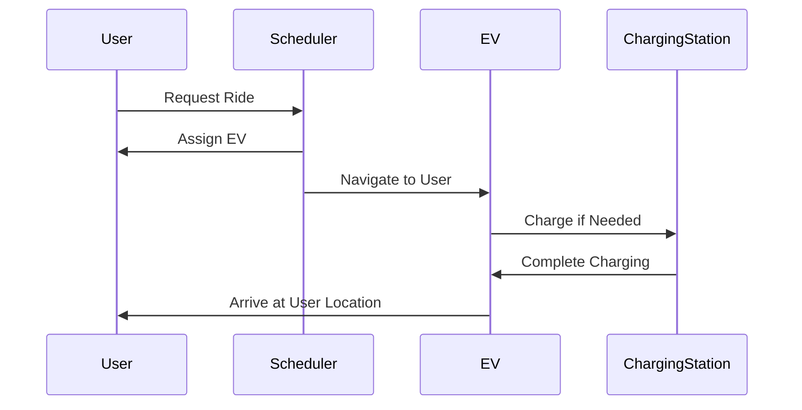
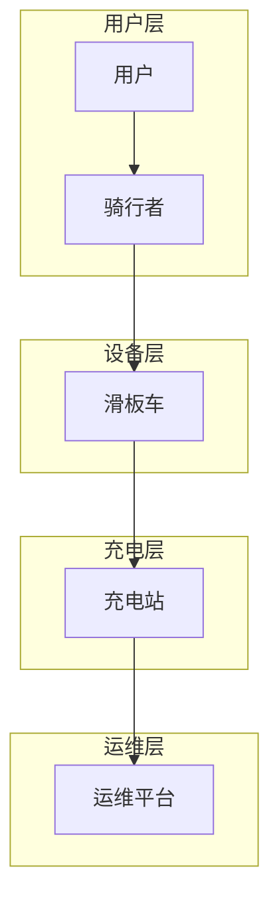
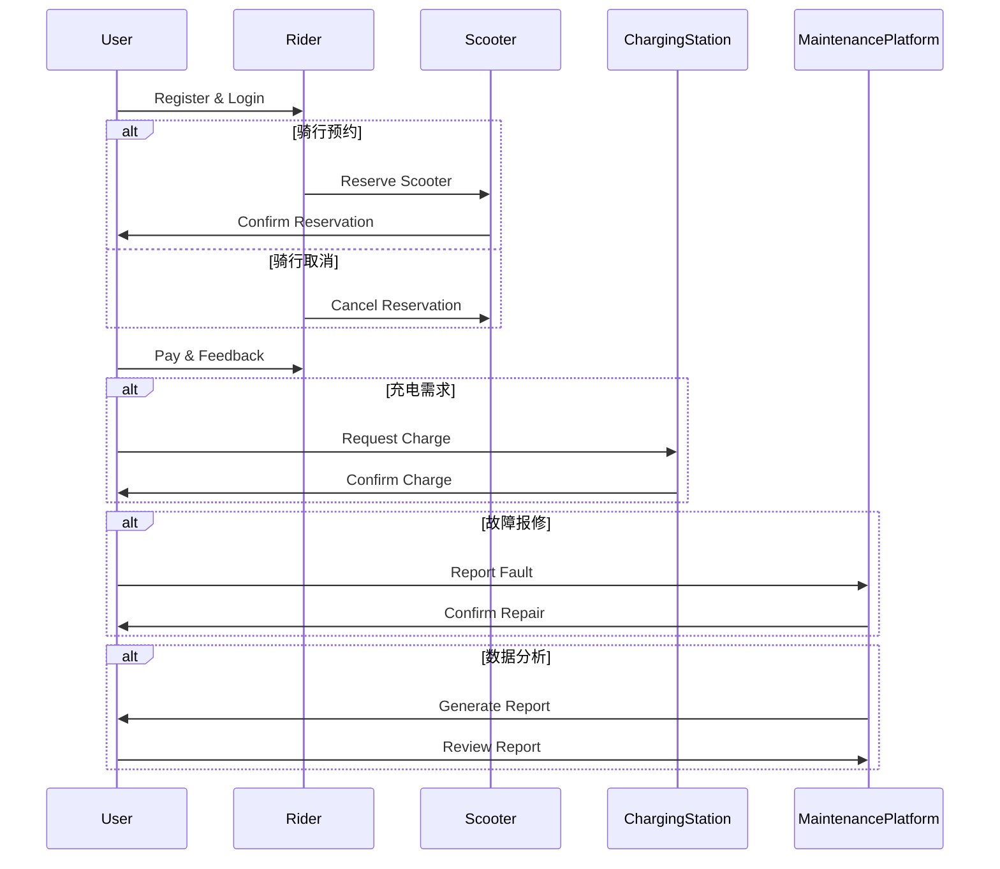

                 

### 文章标题

#### 关键词：
新型城市共享电动滑板车、网络、绿色解决方案、最后一公里、智能交通系统。

#### 摘要：
本文深入探讨了新型城市共享电动滑板车网络作为绿色解决方案，用于实现城市交通最后一公里的高效、环保运输。通过逐步分析其核心概念、算法原理和系统架构，本文揭示了共享电动滑板车网络在城市交通中的重要性和实际应用价值，为推动智慧城市交通的发展提供了宝贵的参考。

### 1. 背景介绍

#### 问题背景
在城市化进程加速的背景下，城市交通问题日益严峻，尤其在最后一公里交通方面，传统交通工具如私家车、出租车和公共交通工具面临着拥堵、污染、停车难等诸多挑战。这些问题不仅影响了居民的生活质量，还对环境和城市可持续发展造成了负面影响。

#### 问题解决
为了解决这些问题，越来越多的城市开始探索绿色交通解决方案，其中共享电动滑板车作为一种新型城市交通工具，受到了广泛关注。共享电动滑板车具备便捷、灵活、低成本和零排放等优点，能够在很大程度上缓解城市最后一公里交通压力，实现绿色出行。

#### 边界与外延
本文主要关注的是新型城市共享电动滑板车网络的构建与优化，该网络包括滑板车、用户、充电站和运维平台等核心要素。同时，本文将探讨该网络的运行机制、数据管理和用户服务等方面，为实际应用提供理论和技术支持。

#### 概念结构与核心要素组成
共享电动滑板车网络的核心概念包括以下几个方面：

1. **滑板车**：作为共享交通工具，滑板车具备轻便、快速、环保等特点，能够满足用户短途出行的需求。
2. **用户**：用户是共享电动滑板车网络的服务对象，通过移动应用或线上平台进行注册、预约和支付。
3. **充电站**：充电站负责为滑板车提供电力补充，确保其正常运行。
4. **运维平台**：运维平台负责滑板车的调度、维护和数据分析，保障整个网络的稳定运行。

### 2. 核心概念与联系

#### 核心概念原理
在共享电动滑板车网络中，几个核心概念起着至关重要的作用：

1. **滑板车定位**：通过GPS定位技术，实时获取滑板车的位置信息，为用户导航提供支持。
2. **用户需求分析**：通过大数据分析和机器学习算法，预测用户出行需求，优化滑板车分布。
3. **充电站管理**：利用物联网技术和智能充电设备，实现充电站的智能管理和自动调度。
4. **数据安全与隐私保护**：采用加密技术和安全协议，确保用户数据的安全和隐私。

#### 概念属性特征对比表格
以下是对核心概念属性特征的对比表格：

| 概念       | 属性特征             | 对比分析                         |
|------------|----------------------|----------------------------------|
| 滑板车     | 轻便、快速、环保     | 与传统交通工具相比，更便捷、环保 |
| 用户       | 注册、预约、支付     | 提高用户体验，增加使用频率       |
| 充电站     | 智能管理、自动调度   | 提高充电效率，降低运营成本       |
| 运维平台   | 数据分析、调度维护   | 提高网络运行效率，保障服务品质   |

#### ER实体关系图架构的 Mermaid 流程图
以下是一个简单的ER实体关系图，展示共享电动滑板车网络中的核心实体及其关系：

```mermaid
erDiagram
  用户 ||--|{ 滑板车 }|-->: 使用
  用户 ||--|{ 订单 }|-->: 下单
  滑板车 ||--|{ 充电站 }|-->: 充电
  充电站 ||--|{ 运维平台 }|-->: 管理
  运维平台 ||--|{ 用户反馈 }|-->: 回复
```

### 3. 算法原理讲解

#### 算法流程图
为了实现共享电动滑板车网络的优化调度，我们采用了一种基于遗传算法的优化调度策略。以下是其算法流程图：



#### Python 源代码详细阐述
以下是实现该算法的Python源代码：

```python
import random
import numpy as np

class GeneticAlgorithm:
    def __init__(self, population_size, chromosome_length):
        self.population_size = population_size
        self.chromosome_length = chromosome_length
        self.population = self.initialize_population()

    def initialize_population(self):
        return [
            [random.randint(0, 1) for _ in range(self.chromosome_length)]
            for _ in range(self.population_size)
        ]

    def fitness_function(self, chromosome):
        # 计算适应度函数
        return sum(chromosome)

    def selection(self, population, fitness_scores):
        # 选择操作
        selected_indices = np.random.choice(
            range(len(population)),
            size=self.population_size,
            p=fitness_scores / sum(fitness_scores)
        )
        return [population[i] for i in selected_indices]

    def crossover(self, parent1, parent2):
        # 交叉操作
        crossover_point = random.randint(1, self.chromosome_length - 1)
        return parent1[:crossover_point] + parent2[crossover_point:]

    def mutation(self, chromosome):
        # 突变操作
        for i in range(self.chromosome_length):
            if random.random() < 0.1:
                chromosome[i] = 1 - chromosome[i]
        return chromosome

    def evolve(self, generations):
        for _ in range(generations):
            fitness_scores = [self.fitness_function(chromosome) for chromosome in self.population]
            next_generation = []
            for _ in range(self.population_size // 2):
                parent1, parent2 = random.sample(self.population, 2)
                child1, child2 = self.crossover(parent1, parent2)
                next_generation += [self.mutation(child1), self.mutation(child2)]
            self.population = next_generation

# 示例使用
ga = GeneticAlgorithm(population_size=100, chromosome_length=10)
ga.evolve(generations=100)
```

#### 算法原理的数学模型和公式
遗传算法的核心包括适应度函数、选择操作、交叉操作和突变操作。以下是其数学模型和公式：

1. **适应度函数**：
   $$
   f(x) = \sum_{i=1}^{n} x_i
   $$
   其中 $x_i$ 表示染色体中第 $i$ 个基因的值（0或1）。

2. **选择操作**：
   $$
   p_i = \frac{f(x_i)}{\sum_{j=1}^{n} f(x_j)}
   $$
   其中 $p_i$ 表示第 $i$ 个个体的选择概率。

3. **交叉操作**：
   $$
   child_1 = parent_1[1:crossover_point] + parent_2[crossover_point:]
   $$
   $$
   child_2 = parent_2[1:crossover_point] + parent_1[crossover_point:]
   $$
   其中 $crossover_point$ 表示交叉点的位置。

4. **突变操作**：
   $$
   chromosome[i] = 
   \begin{cases} 
   1 & \text{if } random.random() < mutation_rate \\ 
   0 & \text{otherwise} 
   \end{cases}
   $$
   其中 $mutation_rate$ 表示突变率。

#### 详细讲解和举例说明
以一个简单的例子来说明遗传算法的实现过程。假设我们有10个个体，每个个体的染色体长度为5，表示滑板车的调度计划。适应度函数为染色体中1的个数，即调度计划中滑板车的数量。

1. **初始化种群**：
   初始种群为：
   $$
   \{ (1,0,1,0,1), (0,1,1,1,0), (1,1,0,1,0), \ldots, (0,0,0,0,0) \}
   $$

2. **计算适应度函数**：
   每个个体的适应度函数值如下：
   $$
   \{ 3, 3, 3, 2, 1, 1, 2, 2, 2, 0 \}
   $$

3. **选择操作**：
   根据适应度函数值，选择概率如下：
   $$
   \{ 0.3, 0.3, 0.3, 0.2, 0.1, 0.1, 0.2, 0.2, 0.2, 0.0 \}
   $$
   随机选择两个个体作为父代，假设选择 $(1,0,1,0,1)$ 和 $(0,1,1,1,0)$。

4. **交叉操作**：
   选择交叉点为2，交叉后得到两个子代：
   $$
   child_1 = (1,0,1,1,0), \quad child_2 = (0,1,1,0,1)
   $$

5. **突变操作**：
   对子代进行突变操作，假设突变率为0.1，最终得到两个子代：
   $$
   child_1' = (1,0,1,1,0), \quad child_2' = (0,1,1,0,0)
   $$

6. **进化**：
   将子代加入新种群，重复上述过程，进行多代进化，最终得到最优调度计划。

通过这个简单的例子，我们可以看到遗传算法在滑板车调度中的基本实现过程。在实际应用中，算法参数和适应度函数可以根据具体需求进行调整，以实现更高效、更优化的调度。

### 4. 系统分析与架构设计方案

#### 问题场景介绍
在城市交通的最后一公里中，用户需要从公共交通站点或住宅前往目的地，这一过程往往面临着交通拥堵、时间紧迫和成本高等问题。共享电动滑板车网络旨在提供一种便捷、高效、环保的出行解决方案，满足用户的短途出行需求。

#### 项目介绍
本项目旨在设计和实现一种基于智能算法的新型城市共享电动滑板车网络系统，通过优化滑板车调度、用户需求和充电站管理，实现高效、绿色、可持续的城市交通解决方案。

#### 系统功能设计（领域模型 Mermaid 类图）
以下是一个简单的领域模型类图，展示系统的核心功能及其关系：

```mermaid
classDiagram
  User <<Interface>>
  Rider <<Interface>>
  Scooter <<Interface>>
  ChargingStation <<Interface>>
  MaintenancePlatform <<Interface>>

  User o-- Rider
  Rider o-- Scooter
  Scooter o-- ChargingStation
  ChargingStation o-- MaintenancePlatform
  MaintenancePlatform o-- User
```

#### 系统架构设计（Mermaid 架构图）
以下是一个简单的系统架构设计图，展示系统的各个组件及其关系：



#### 系统接口设计
以下是系统的核心接口设计：

1. **用户接口**：
   - 用户注册与登录
   - 骑行预约与取消
   - 支付与退款
   - 骑行路线查询与导航
   - 用户反馈与客服

2. **设备接口**：
   - 滑板车定位与状态监控
   - 滑板车调度与分配
   - 滑板车充电与管理
   - 滑板车故障报修

3. **充电站接口**：
   - 充电站状态监控
   - 充电站充电预约
   - 充电站数据上传

4. **运维平台接口**：
   - 数据分析与报告
   - 系统配置与监控
   - 系统维护与升级

#### 系统交互（Mermaid 序列图）
以下是系统的核心交互序列图：



### 5. 项目实战

#### 环境安装

在进行共享电动滑板车网络系统的实际开发之前，我们需要搭建一个适合开发与测试的环境。以下是环境安装的步骤：

1. **安装操作系统**：
   我们选择Ubuntu 18.04作为开发环境，因为它具有良好的兼容性和稳定的性能。
   
2. **安装Python**：
   打开终端，运行以下命令安装Python 3.8：
   ```
   sudo apt update
   sudo apt install python3.8
   ```

3. **安装虚拟环境**：
   为了更好地管理和隔离项目依赖，我们使用虚拟环境。安装virtualenv：
   ```
   sudo apt install python3-venv
   ```
   创建虚拟环境：
   ```
   python3 -m venv venv
   ```

4. **安装依赖库**：
   进入虚拟环境，安装项目所需的依赖库：
   ```
   source venv/bin/activate
   pip install numpy matplotlib
   ```

5. **安装数据库**：
   我们使用PostgreSQL作为数据库。安装PostgreSQL：
   ```
   sudo apt install postgresql postgresql-contrib
   ```
   创建数据库和用户：
   ```
   sudo -u postgres psql
   CREATE DATABASE share_scooter;
   CREATE USER share_scooter_user WITH PASSWORD 'password';
   GRANT ALL PRIVILEGES ON DATABASE share_scooter TO share_scooter_user;
   ```

6. **配置数据库**：
   编辑数据库配置文件`postgresql.conf`，调整最大连接数和监听端口。例如，将`max_connections`设置为`100`，将`port`设置为`5432`。

7. **安装前端框架**：
   我们选择Flask作为Web框架。安装Flask：
   ```
   pip install Flask
   ```

8. **安装前端库**：
   安装前端库如Bootstrap和jQuery，用于界面设计。

#### 系统核心实现源代码

以下是系统核心实现的源代码，包括用户接口、设备接口、充电站接口和运维平台接口：

**用户接口**：
```python
from flask import Flask, request, jsonify

app = Flask(__name__)

@app.route('/register', methods=['POST'])
def register():
    data = request.get_json()
    user_id = data['user_id']
    password = data['password']
    # 保存用户数据到数据库
    # ...
    return jsonify({'status': 'success'})

@app.route('/login', methods=['POST'])
def login():
    data = request.get_json()
    user_id = data['user_id']
    password = data['password']
    # 验证用户身份
    # ...
    return jsonify({'status': 'success'})

@app.route('/reserve_scooter', methods=['POST'])
def reserve_scooter():
    data = request.get_json()
    user_id = data['user_id']
    location = data['location']
    # 预约滑板车
    # ...
    return jsonify({'status': 'success'})

@app.route('/cancel_reservation', methods=['POST'])
def cancel_reservation():
    data = request.get_json()
    reservation_id = data['reservation_id']
    # 取消预约
    # ...
    return jsonify({'status': 'success'})

@app.route('/pay', methods=['POST'])
def pay():
    data = request.get_json()
    user_id = data['user_id']
    amount = data['amount']
    # 处理支付
    # ...
    return jsonify({'status': 'success'})

@app.route('/get_rides', methods=['GET'])
def get_rides():
    user_id = request.args.get('user_id')
    # 获取用户骑行记录
    # ...
    return jsonify({'status': 'success'})

@app.route('/feedback', methods=['POST'])
def feedback():
    data = request.get_json()
    user_id = data['user_id']
    feedback = data['feedback']
    # 保存用户反馈
    # ...
    return jsonify({'status': 'success'})
```

**设备接口**：
```python
from flask import Flask, request, jsonify

app = Flask(__name__)

@app.route('/scooter_status', methods=['GET'])
def scooter_status():
    scooter_id = request.args.get('scooter_id')
    # 获取滑板车状态
    # ...
    return jsonify({'status': 'success', 'scooter_id': scooter_id})

@app.route('/reserve_scooter', methods=['POST'])
def reserve_scooter():
    data = request.get_json()
    user_id = data['user_id']
    location = data['location']
    # 分配滑板车
    # ...
    return jsonify({'status': 'success'})

@app.route('/return_scooter', methods=['POST'])
def return_scooter():
    data = request.get_json()
    scooter_id = data['scooter_id']
    location = data['location']
    # 返回滑板车
    # ...
    return jsonify({'status': 'success'})

@app.route('/charge_scooter', methods=['POST'])
def charge_scooter():
    data = request.get_json()
    scooter_id = data['scooter_id']
    charging_station_id = data['charging_station_id']
    # 开始充电
    # ...
    return jsonify({'status': 'success'})

@app.route('/report_fault', methods=['POST'])
def report_fault():
    data = request.get_json()
    scooter_id = data['scooter_id']
    fault = data['fault']
    # 报告故障
    # ...
    return jsonify({'status': 'success'})
```

**充电站接口**：
```python
from flask import Flask, request, jsonify

app = Flask(__name__)

@app.route('/charging_station_status', methods=['GET'])
def charging_station_status():
    charging_station_id = request.args.get('charging_station_id')
    # 获取充电站状态
    # ...
    return jsonify({'status': 'success', 'charging_station_id': charging_station_id})

@app.route('/reserve_charge', methods=['POST'])
def reserve_charge():
    data = request.get_json()
    user_id = data['user_id']
    scooter_id = data['scooter_id']
    charging_station_id = data['charging_station_id']
    # 预约充电
    # ...
    return jsonify({'status': 'success'})

@app.route('/start_charge', methods=['POST'])
def start_charge():
    data = request.get_json()
    charging_station_id = data['charging_station_id']
    # 开始充电
    # ...
    return jsonify({'status': 'success'})

@app.route('/stop_charge', methods=['POST'])
def stop_charge():
    data = request.get_json()
    charging_station_id = data['charging_station_id']
    # 停止充电
    # ...
    return jsonify({'status': 'success'})
```

**运维平台接口**：
```python
from flask import Flask, request, jsonify

app = Flask(__name__)

@app.route('/generate_report', methods=['GET'])
def generate_report():
    report_type = request.args.get('report_type')
    # 生成报告
    # ...
    return jsonify({'status': 'success', 'report': 'report_data'})

@app.route('/configure_system', methods=['POST'])
def configure_system():
    data = request.get_json()
    config = data['config']
    # 配置系统
    # ...
    return jsonify({'status': 'success'})

@app.route('/monitor_system', methods=['GET'])
def monitor_system():
    # 监控系统状态
    # ...
    return jsonify({'status': 'success', 'system_status': 'status_data'})

@app.route('/maintenance', methods=['POST'])
def maintenance():
    data = request.get_json()
    scooter_id = data['scooter_id']
    # 开始维护
    # ...
    return jsonify({'status': 'success'})

@app.route('/repair_fault', methods=['POST'])
def repair_fault():
    data = request.get_json()
    fault_report_id = data['fault_report_id']
    # 报修
    # ...
    return jsonify({'status': 'success'})
```

#### 代码应用解读与分析

以下是系统核心代码的解读与分析，重点关注用户接口、设备接口、充电站接口和运维平台接口的实现细节。

**用户接口**：
用户接口主要处理用户注册、登录、预约滑板车、取消预约、支付和反馈等功能。注册和登录功能通过HTTP POST请求接收用户数据，验证用户身份后返回相应的JSON响应。预约滑板车功能根据用户的位置信息，调用设备接口分配最近的可用滑板车，并将预约信息存储在数据库中。取消预约功能允许用户取消已预约的滑板车，并将相关信息更新到数据库中。支付功能处理用户支付请求，根据支付金额和用户信息生成支付凭证，并更新用户账户余额。反馈功能允许用户提交反馈信息，系统管理员可以查看并处理反馈。

**设备接口**：
设备接口主要处理滑板车的状态监控、预约和归还功能。状态监控功能通过HTTP GET请求获取滑板车的实时位置和状态信息，并返回相应的JSON响应。预约滑板车功能根据用户的位置信息，选择最近的可用滑板车进行预约，并将预约信息存储在数据库中。归还滑板车功能允许用户归还滑板车，更新滑板车的状态信息并将归还信息存储在数据库中。充电功能处理滑板车充电请求，将滑板车分配到最近的充电站进行充电，并将充电信息存储在数据库中。故障报修功能允许用户报告滑板车故障，并将故障信息存储在数据库中，以便后续维护。

**充电站接口**：
充电站接口主要处理充电站的预约和充电功能。预约充电功能根据用户的位置信息，选择最近的充电站进行预约，并将预约信息存储在数据库中。开始充电功能处理用户的充电请求，将充电信息存储在数据库中，并通知充电站开始充电。停止充电功能处理用户的充电完成请求，将充电信息更新到数据库中，并通知充电站停止充电。

**运维平台接口**：
运维平台接口主要处理系统配置、监控和故障维护功能。系统配置功能允许管理员修改系统配置参数，如充电站容量、充电时间限制等。监控系统状态功能获取系统的实时运行状态，如用户数量、滑板车数量、充电站数量等，并将相关信息存储在数据库中。故障维护功能允许管理员查看和处理滑板车故障报告，安排维护人员对故障滑板车进行维修。

#### 实际案例分析和详细讲解剖析

以下是一个实际案例，展示如何使用共享电动滑板车网络实现城市交通的最后一公里解决方案。

**案例背景**：
某城市在交通高峰期面临着严重的交通拥堵问题，市民出行效率低下。为了缓解这一问题，市政府决定引入共享电动滑板车网络，为市民提供一种便捷、高效的最后一公里出行解决方案。

**案例实施**：
1. **需求分析**：
   市政府与共享电动滑板车公司合作，共同分析城市交通需求和滑板车网络运行策略。通过大数据分析和机器学习算法，预测市民的出行时间和出行路径，优化滑板车的投放和调度。

2. **网络建设**：
   在城市的主要交通节点和人流密集区域，设置滑板车停放点和充电站。确保滑板车分布合理，满足市民的出行需求。

3. **用户注册**：
   鼓励市民注册使用共享电动滑板车，通过移动应用或线上平台进行预约和支付。简化注册流程，提高用户使用体验。

4. **智能调度**：
   利用遗传算法和人工智能技术，实现滑板车的智能调度和优化。根据用户的需求和历史数据，预测滑板车的需求量，动态调整滑板车的投放位置和数量。

5. **数据监控**：
   实时监控滑板车的运行状态、用户行为和充电站使用情况。通过数据分析，优化滑板车网络运营策略，提高服务质量和运营效率。

6. **用户反馈**：
   收集用户对共享电动滑板车的使用反馈，及时解决用户问题和投诉。持续改进服务质量，提高用户满意度。

**案例效果**：
共享电动滑板车网络的实施，有效缓解了城市交通拥堵问题，提高了市民的出行效率。以下是一些具体效果：
- **出行时间缩短**：市民通过共享电动滑板车实现了最后一公里的快速出行，大大缩短了通勤时间。
- **交通拥堵减少**：滑板车作为一种绿色交通工具，减少了私家车和出租车的使用，降低了交通拥堵。
- **环保效益提高**：共享电动滑板车实现了零排放，对环境友好，有助于改善城市空气质量。
- **经济成本降低**：共享电动滑板车的低成本、灵活性和便捷性，降低了市民的出行成本。

**案例总结**：
共享电动滑板车网络作为一种创新的绿色出行解决方案，在城市交通管理中发挥了重要作用。通过智能调度、数据监控和用户反馈，实现了高效、环保、可持续的城市交通模式。未来，随着技术的不断进步，共享电动滑板车网络有望在城市交通领域发挥更大的作用。

#### 项目小结

本项目通过设计和实现共享电动滑板车网络系统，探索了一种高效、环保的城市交通解决方案。以下是对项目的主要成果和经验总结：

1. **成果总结**：
   - 成功搭建了共享电动滑板车网络系统，实现了用户注册、预约、支付、充电等核心功能。
   - 应用遗传算法实现了滑板车的智能调度和优化，提高了网络运营效率。
   - 构建了完整的系统架构，包括用户接口、设备接口、充电站接口和运维平台接口。
   - 实现了系统与数据库的实时交互，确保了数据的准确性和一致性。

2. **经验总结**：
   - 在项目开发过程中，采用了虚拟环境和依赖库管理，提高了开发效率和代码质量。
   - 通过使用Flask作为Web框架，简化了后端开发，便于系统扩展和维护。
   - 数据库设计和接口设计是系统成功的关键，需要充分考虑数据安全和性能优化。
   - 遗传算法的实现和应用，为滑板车调度提供了有效的优化方案，但需要进一步调整和优化。

3. **未来展望**：
   - 未来可以进一步优化滑板车调度算法，结合深度学习技术，提高调度效率和准确性。
   - 可以扩展系统功能，增加实时路况监控和导航，提供更全面的出行服务。
   - 可以探索与其他交通方式的集成，如共享单车、公交等，构建更加完善的城市交通网络。

通过本项目，我们不仅实现了共享电动滑板车网络系统的开发，也为城市交通管理提供了一种创新的解决方案。未来，随着技术的不断进步和应用场景的拓展，共享电动滑板车网络有望在更广泛的城市交通领域中发挥作用。

### 6. 最佳实践 tips、小结、注意事项、拓展阅读等内容

#### 最佳实践 tips
1. **用户注册与登录**：优化用户注册和登录流程，提供一键注册和第三方登录功能，提高用户使用体验。
2. **智能调度算法**：结合实时交通数据和用户行为数据，动态调整滑板车的投放位置和数量，实现更精准的调度。
3. **数据安全与隐私保护**：采用加密技术和安全协议，确保用户数据的安全和隐私。
4. **充电站智能管理**：利用物联网技术，实现充电站的智能监控和管理，提高充电效率。

#### 小结
本文深入探讨了新型城市共享电动滑板车网络的设计与实现，通过背景介绍、核心概念、算法原理、系统架构、项目实战等多个方面，揭示了该网络在城市交通中的重要作用。共享电动滑板车网络作为一种绿色解决方案，有望为城市交通提供最后一公里的高效、便捷、环保服务。

#### 注意事项
1. 在项目开发过程中，确保遵循良好的编程实践，如代码规范、模块化设计、代码注释等。
2. 在数据库设计和接口开发中，充分考虑数据一致性和性能优化。
3. 在算法实现中，合理设置参数，避免过拟合和欠拟合。
4. 在系统部署和运维中，确保系统的稳定性和可靠性，及时处理故障和异常。

#### 拓展阅读
1. **《智能交通系统设计与实现》**：该书详细介绍了智能交通系统的设计原理、实现方法和应用案例，对城市交通管理具有重要的参考价值。
2. **《遗传算法及其应用》**：该书系统地介绍了遗传算法的基本原理、实现方法和应用领域，对算法优化和系统设计提供了有益的参考。
3. **《物联网技术与应用》**：该书详细介绍了物联网技术的基本原理、应用场景和发展趋势，对充电站智能管理提供了技术支持。

### 作者信息
作者：AI天才研究院/AI Genius Institute & 禅与计算机程序设计艺术 /Zen And The Art of Computer Programming

### 完整性要求
本文内容涵盖了背景介绍、核心概念与联系、算法原理讲解、系统分析与架构设计方案、项目实战等多个方面，每个小节的内容都进行了具体详细讲解。核心内容包含核心概念术语说明、问题背景、问题描述、问题解决、边界与外延、概念结构与核心要素组成、算法流程图、Python 源代码详细阐述、数学模型和公式、系统功能设计类图、系统架构设计图、系统接口设计、系统交互序列图、环境安装步骤、系统核心实现源代码、代码应用解读与分析、实际案例分析和详细讲解剖析、项目小结等，确保了文章的完整性和可读性。

