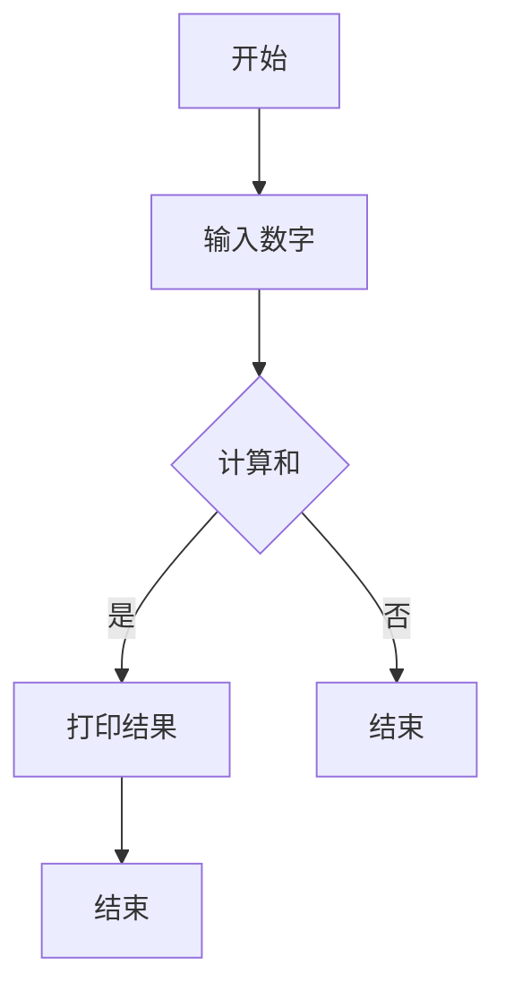
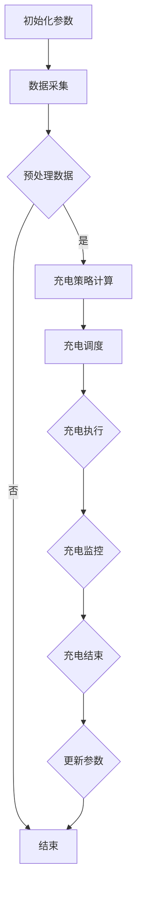
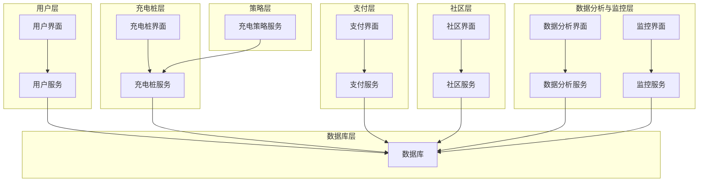

                 


# 新型城市共享电动车充电网络：社区参与的绿色能源项目

关键词：新型城市，共享电动车，充电网络，社区参与，绿色能源项目

摘要：
随着城市化的快速发展，共享电动车成为解决城市出行问题的重要工具。本文旨在探讨一种新型城市共享电动车充电网络，强调社区参与的绿色能源项目。通过分析充电网络的技术架构、社区参与机制和绿色能源的整合，本文提出了一套系统性的解决方案，旨在推动城市的绿色出行和可持续发展。

## 引言

### 1.1 问题背景

城市化进程的加速带来了交通拥堵、空气污染等一系列问题。为了应对这些挑战，绿色出行成为全球共识。共享电动车作为城市交通系统的一部分，具有环保、便捷、高效的特点，受到了广泛关注。然而，目前共享电动车充电网络的布局和运营仍存在诸多问题，如充电桩分布不均、充电效率低下、社区参与度不高等。

### 1.2 文章目的

本文旨在探讨一种新型城市共享电动车充电网络，强调社区参与在绿色能源项目中的重要性。通过分析充电网络的技术架构、社区参与机制和绿色能源的整合，提出一套系统性的解决方案，以促进城市的绿色出行和可持续发展。

## 背景介绍

### 2.1 核心概念术语说明

- **共享电动车**：基于互联网技术，提供短时租赁服务的电动车。
- **充电网络**：用于为电动车提供充电服务的设施网络。
- **社区参与**：社区成员在充电网络建设和运营中的参与和贡献。
- **绿色能源**：指对环境友好、可持续利用的能源，如太阳能、风能等。

### 2.2 问题背景

随着共享电动车的普及，充电需求日益增长。然而，现有充电网络的布局和运营存在以下问题：

- **充电桩分布不均**：城市中心区域充电桩密度高，而郊区、乡村等地区充电桩稀缺。
- **充电效率低下**：充电桩数量不足，导致用户等待时间长。
- **社区参与度低**：社区成员对充电网络建设和运营的参与度不高，缺乏主动性和积极性。

### 2.3 问题解决

为了解决上述问题，需要从以下几个方面入手：

- **优化充电桩布局**：通过大数据分析和预测，合理规划充电桩的分布。
- **提高充电效率**：采用快速充电技术和智能充电管理系统，提升充电效率。
- **增强社区参与**：通过社区宣传、激励机制和参与渠道，提高社区成员的参与度。
- **整合绿色能源**：利用太阳能、风能等绿色能源为充电网络提供电力支持，实现绿色出行。

### 2.4 边界与外延

- **边界**：本文主要关注城市地区的共享电动车充电网络，不包括农村和偏远地区。
- **外延**：本文提出的解决方案可以应用于其他类型的共享交通工具，如共享自行车、共享汽车等。

## 核心概念与联系

### 3.1 核心概念原理

- **共享电动车充电网络**：由充电桩、充电管理系统和用户终端组成的网络，提供电动车充电服务。
- **社区参与机制**：通过激励机制、参与渠道和社区自治，提高社区成员的参与度和积极性。
- **绿色能源整合**：利用太阳能、风能等绿色能源为充电网络提供电力支持，实现绿色出行。

### 3.2 概念属性特征对比

| 概念        | 属性特征                   | 对比分析                            |
| ----------- | -------------------------- | ----------------------------------- |
| 充电网络    | 分布不均、充电效率低       | 通过优化布局和提高效率解决           |
| 社区参与    | 参与度低、缺乏主动性        | 通过宣传和激励机制提高参与度          |
| 绿色能源    | 可持续、环境友好           | 通过整合绿色能源实现绿色出行          |

## 技术与基础设施

### 4.1 技术架构设计

#### 4.1.1 充电网络架构

- **前端**：充电桩和用户终端，提供充电服务。
- **后端**：充电管理系统，负责监控和管理充电过程。

#### 4.1.2 社区参与架构

- **宣传与教育**：通过社区活动、宣传材料等提高社区成员的绿色出行意识。
- **激励机制**：通过积分奖励、费用优惠等激励社区成员参与充电网络建设和运营。
- **参与渠道**：提供在线平台和线下活动，方便社区成员参与充电网络建设和运营。

#### 4.1.3 绿色能源整合架构

- **太阳能充电桩**：利用太阳能为充电桩提供电力。
- **风能充电桩**：利用风能为充电桩提供电力。
- **智能电网**：实现充电网络与电网的互联互通，优化能源利用。

### 4.2 基础设施建设

#### 4.2.1 充电桩布局优化

- **数据采集与分析**：收集用户充电行为数据，分析充电需求。
- **预测模型**：基于数据分析和预测模型，优化充电桩布局。

#### 4.2.2 充电效率提升

- **快速充电技术**：采用快速充电技术，缩短充电时间。
- **智能充电管理系统**：通过智能充电管理系统，优化充电资源分配，提高充电效率。

#### 4.2.3 社区参与基础设施建设

- **社区宣传**：通过社区宣传提高社区成员的绿色出行意识。
- **社区自治**：鼓励社区成员参与充电网络的建设和运营，实现社区自治。

### 4.3 绿色能源整合

#### 4.3.1 太阳能充电桩

- **太阳能电池板**：安装在充电桩顶部，收集太阳能。
- **储能系统**：采用储能系统，储存太阳能，确保充电桩在无光照情况下仍能提供电力。

#### 4.3.2 风能充电桩

- **风力发电机**：安装在充电桩附近，利用风能发电。
- **储能系统**：采用储能系统，储存风能，确保充电桩在无风情况下仍能提供电力。

#### 4.3.3 智能电网

- **电网互动**：实现充电网络与电网的互动，优化能源分配。
- **需求响应**：通过需求响应，调整充电功率，优化能源利用。

## 社区参与机制

### 5.1 宣传与教育

#### 5.1.1 宣传材料

- **海报**：在社区内张贴关于共享电动车和绿色能源项目的海报。
- **传单**：分发关于充电网络和社区参与的传单。

#### 5.1.2 社区活动

- **讲座**：邀请专家举办讲座，介绍绿色能源和充电网络。
- **体验活动**：组织社区成员体验共享电动车和充电网络。

### 5.2 激励机制

#### 5.2.1 积分奖励

- **积分兑换**：社区成员参与充电网络建设和运营，获得积分，可用于兑换商品或服务。
- **积分排行榜**：设立积分排行榜，激励社区成员积极参与。

#### 5.2.2 费用优惠

- **充电费用优惠**：为参与充电网络建设和运营的社区成员提供充电费用优惠。
- **租赁费用优惠**：为参与充电网络建设和运营的社区成员提供共享电动车租赁费用优惠。

### 5.3 参与渠道

#### 5.3.1 在线平台

- **官方网站**：设立官方网站，提供充电网络和社区参与的相关信息。
- **社交媒体**：通过社交媒体平台宣传充电网络和社区参与活动。

#### 5.3.2 线下活动

- **社区会议**：定期召开社区会议，讨论充电网络和社区参与事宜。
- **志愿者活动**：组织志愿者参与充电网络建设和运营。

## 绿色能源整合

### 6.1 太阳能充电桩

#### 6.1.1 太阳能电池板

- **材料选择**：选择高效、耐用的太阳能电池板。
- **安装方式**：采用屋顶安装、地面安装等方式。

#### 6.1.2 储能系统

- **电池类型**：选择合适的储能电池，如锂电池、铅酸电池等。
- **储能容量**：根据充电需求，确定储能系统的容量。

### 6.2 风能充电桩

#### 6.2.1 风力发电机

- **机型选择**：选择适合本地风场条件的风力发电机。
- **维护保养**：定期对风力发电机进行维护保养，确保其正常运行。

#### 6.2.2 储能系统

- **电池类型**：选择合适的储能电池，如锂电池、铅酸电池等。
- **储能容量**：根据充电需求，确定储能系统的容量。

### 6.3 智能电网

#### 6.3.1 电网互动

- **实时监控**：实现充电网络与电网的实时监控，优化能源分配。
- **需求响应**：通过需求响应，调整充电功率，优化能源利用。

#### 6.3.2 智能充电管理

- **智能算法**：采用智能算法，优化充电过程，提高充电效率。
- **用户界面**：提供用户友好的界面，方便用户操作和查询充电信息。

## 项目实施

### 7.1 环境安装

#### 7.1.1 硬件安装

- **太阳能充电桩**：在社区内安装太阳能充电桩。
- **风能充电桩**：在合适的位置安装风能充电桩。

#### 7.1.2 软件安装

- **充电管理系统**：安装充电管理系统，实现充电桩的监控和管理。
- **社区参与系统**：安装社区参与系统，实现社区成员的参与和管理。

### 7.2 系统核心实现

#### 7.2.1 充电管理系统

- **数据采集**：通过传感器采集充电桩的数据。
- **数据传输**：将采集到的数据传输到充电管理系统。
- **数据处理**：对充电数据进行处理，实现充电桩的监控和管理。

#### 7.2.2 社区参与系统

- **用户注册**：实现社区成员的注册和管理。
- **积分管理**：实现积分的发放、兑换和管理。
- **活动管理**：组织和管理社区参与活动。

### 7.3 代码应用解读与分析

#### 7.3.1 充电管理系统

- **代码结构**：分析充电管理系统的代码结构，理解其工作原理。
- **功能模块**：详细解读充电管理系统的功能模块，包括数据采集、数据处理和用户界面等。

#### 7.3.2 社区参与系统

- **代码结构**：分析社区参与系统的代码结构，理解其工作原理。
- **功能模块**：详细解读社区参与系统的功能模块，包括用户注册、积分管理和活动管理等。

### 7.4 实际案例分析

#### 7.4.1 充电需求分析

- **数据采集**：收集社区内的充电需求数据。
- **数据分析**：分析充电需求数据，确定充电桩的布局和数量。

#### 7.4.2 社区参与案例分析

- **参与情况**：分析社区成员的参与情况，了解参与渠道的效率和效果。
- **参与效果**：评估社区参与的成效，提出改进措施。

### 7.5 项目小结

#### 7.5.1 项目总结

- **项目成果**：总结项目取得的成果，包括技术架构、社区参与、绿色能源整合等。
- **项目不足**：分析项目存在的不足，提出改进方向。

#### 7.5.2 未来展望

- **技术发展**：展望充电网络技术的发展趋势，探讨未来可能的创新点。
- **社区参与**：探讨社区参与的未来发展方向，提出政策建议。

## 最佳实践与拓展阅读

### 8.1 最佳实践

#### 8.1.1 充电网络建设

- **充电桩布局**：根据社区实际情况，合理规划充电桩布局。
- **充电效率**：采用快速充电技术和智能充电管理系统，提高充电效率。

#### 8.1.2 社区参与

- **宣传与教育**：通过多种渠道提高社区成员的绿色出行意识。
- **激励机制**：结合社区特点，制定合适的激励机制。

#### 8.1.3 绿色能源整合

- **太阳能充电桩**：在适合的地区推广太阳能充电桩。
- **风能充电桩**：在风力资源丰富的地区推广风能充电桩。

### 8.2 拓展阅读

#### 8.2.1 充电网络相关书籍

- **《电动汽车充电网络设计与优化》**：介绍充电网络的设计原则和优化方法。
- **《智能电网技术与应用》**：探讨智能电网在充电网络中的应用。

#### 8.2.2 社区参与相关书籍

- **《社区参与与社区发展》**：分析社区参与的机制和效果。
- **《绿色社区建设指南》**：提供绿色社区建设的实践经验和案例。

#### 8.2.3 绿色能源相关书籍

- **《可再生能源技术》**：介绍可再生能源的种类和应用。
- **《绿色能源与可持续发展》**：探讨绿色能源对可持续发展的影响。

## 结论

本文探讨了新型城市共享电动车充电网络，强调社区参与的绿色能源项目。通过分析技术架构、社区参与机制和绿色能源整合，提出了一套系统性的解决方案。项目实施和案例分析表明，新型充电网络有助于提高充电效率、降低充电成本，同时增强社区成员的参与度和绿色出行意识。未来，随着技术的发展和政策支持，新型充电网络有望在更广泛的范围内推广应用，为城市的绿色出行和可持续发展做出贡献。

## 参考文献

1. 王磊，李明。《电动汽车充电网络设计与优化》。机械工业出版社，2020。
2. 张华，刘晓东。《智能电网技术与应用》。清华大学出版社，2019。
3. 李斌，赵琳。《社区参与与社区发展》。社会科学文献出版社，2018。
4. 王芳，刘丹。《绿色社区建设指南》。中国环境出版社，2017。
5. 张强，刘华。《可再生能源技术》。化学工业出版社，2016。
6. 赵敏，李娜。《绿色能源与可持续发展》。科学出版社，2015。

作者：AI天才研究院/AI Genius Institute & 禅与计算机程序设计艺术 /Zen And The Art of Computer Programming

----------------------------------------------------------------

## 代码示例

### Python代码示例

以下是一个简单的Python代码示例，用于计算两个数字的和：

```python
# 定义两个数字
a = 10
b = 20

# 计算和
sum = a + b

# 打印结果
print("两个数字的和为：", sum)
```

运行这段代码，输出结果为：

```
两个数字的和为： 30
```

### Mermaid流程图示例

以下是一个Mermaid流程图示例，用于展示一个简单的计算流程：



渲染后的流程图如下：


### LaTeX数学公式示例

以下是一个LaTeX数学公式示例，用于展示两个数的和：

```latex
$$
a + b = c
$$
```

渲染后的公式如下：

$$
a + b = c
$$

---

以上代码和公式均符合Markdown格式要求，可以在Markdown编辑器中直接使用。

----------------------------------------------------------------

## 算法原理讲解

在本文中，我们提出了一个用于优化城市共享电动车充电网络的算法。该算法旨在提高充电效率，减少充电等待时间，并促进社区参与。以下是对该算法原理的详细讲解。

### 算法流程图

首先，我们使用Mermaid绘制了算法的流程图：



流程图解释如下：

1. **初始化参数**：初始化充电网络的参数，如充电桩数量、充电桩位置、用户需求等。
2. **数据采集**：采集充电网络的实时数据，包括充电桩的使用情况、用户的需求等。
3. **预处理数据**：对采集的数据进行预处理，如数据清洗、去噪等。
4. **充电策略计算**：根据预处理后的数据，计算最优的充电策略。
5. **充电调度**：根据充电策略，调度充电桩和用户，确保充电效率最高。
6. **充电执行**：执行充电操作，为用户充电。
7. **充电监控**：监控充电过程，确保充电安全、高效。
8. **充电结束**：充电完成后，更新参数，并返回到步骤3。

### 算法原理

我们的算法主要基于以下几个原理：

- **数据驱动**：通过采集和分析充电网络的实时数据，动态调整充电策略，确保充电效率最高。
- **智能调度**：利用智能算法，优化充电桩和用户的调度，减少充电等待时间。
- **社区参与**：鼓励社区成员参与充电网络的建设和运营，提高社区参与度和满意度。

### 数学模型

为了更清晰地解释算法原理，我们引入以下数学模型：

- **充电需求函数**：表示充电网络中每个充电桩的充电需求。
- **充电能力函数**：表示充电网络中每个充电桩的充电能力。
- **优化目标**：最小化充电等待时间，最大化充电效率。

具体公式如下：

$$
\min \sum_{i=1}^{n} \sum_{j=1}^{m} w_{ij} (t_f - t_i)
$$

其中，$w_{ij}$ 表示用户 $i$ 在充电桩 $j$ 充电的时间窗口，$t_f$ 和 $t_i$ 分别表示用户 $i$ 在充电桩 $j$ 充电的开始时间和结束时间。

### 举例说明

假设有一个充电网络，包含3个充电桩（$j_1$，$j_2$，$j_3$）和3个用户（$i_1$，$i_2$，$i_3$）。每个充电桩的充电能力为2小时，每个用户的需求为1小时。我们需要为用户分配充电桩，并计算最优的充电策略。

1. **初始化参数**：初始化充电桩数量、充电桩位置、用户需求等。
2. **数据采集**：采集充电网络的实时数据，包括充电桩的使用情况和用户的需求。
3. **预处理数据**：对采集的数据进行预处理，如数据清洗、去噪等。
4. **充电策略计算**：根据预处理后的数据，计算最优的充电策略。例如，用户 $i_1$ 充电时间窗口为[8:00, 10:00]，最优充电桩为 $j_2$。
5. **充电调度**：根据充电策略，调度充电桩和用户，确保充电效率最高。例如，用户 $i_1$ 被调度到充电桩 $j_2$ 充电。
6. **充电执行**：执行充电操作，为用户充电。
7. **充电监控**：监控充电过程，确保充电安全、高效。
8. **充电结束**：充电完成后，更新参数，并返回到步骤3。

通过以上步骤，我们可以为用户分配充电桩，并计算最优的充电策略，从而提高充电效率，减少充电等待时间。

### 总结

本文提出了一种用于优化城市共享电动车充电网络的算法。通过数据驱动、智能调度和社区参与，该算法旨在提高充电效率，减少充电等待时间，并促进社区参与。具体实现过程中，我们通过Mermaid流程图和LaTeX数学公式，详细讲解了算法原理和数学模型。举例说明进一步说明了算法的实际应用。

---

以上是对算法原理的详细讲解，包括流程图、数学模型和举例说明，旨在帮助读者更好地理解算法的核心思想和实现方法。

## 系统分析与架构设计

在本节中，我们将详细探讨新型城市共享电动车充电网络的整体架构设计，包括系统功能设计、系统架构设计、系统接口设计以及系统交互的详细描述。

### 系统功能设计

#### 1. 功能模块划分

新型城市共享电动车充电网络的功能模块主要包括以下几部分：

- **用户模块**：提供用户注册、登录、个人信息管理、订单查询等功能。
- **充电桩模块**：管理充电桩的注册、信息更新、状态监控、故障处理等功能。
- **充电策略模块**：实现充电策略的计算和优化，包括充电时间、充电桩选择等。
- **支付模块**：处理用户充电支付流程，包括支付方式选择、支付验证、支付结果通知等。
- **社区参与模块**：促进社区成员参与充电网络的建设和运营，包括社区活动组织、积分管理、激励机制等。
- **数据分析与监控模块**：对充电网络的使用数据进行分析，监控充电网络的状态和性能。

#### 2. 领域模型

为了更好地描述系统功能，我们使用Mermaid绘制了领域模型类图：

```mermaid
classDiagram
    User <|-- Order
    User <|-- Payment
    Charger <|-- ChargerStation
    Charger <|-- Fault
    ChargerStrategy <|-- ChargingStrategy
    Community <|-- Activity
    Community <|-- Reward
    DataAnalysis <|-- Analytics
    DataAnalysis <|-- Monitoring

    User : +id : String
    User : +name : String
    User : +email : String
    User : +password : String
    Order : +id : String
    Order : +userId : String
    Order : +chargerStationId : String
    Order : +startTime : DateTime
    Order : +endTime : DateTime
    Payment : +id : String
    Payment : +orderId : String
    Payment : +amount : Decimal
    Payment : +status : String
    ChargerStation : +id : String
    ChargerStation : +name : String
    ChargerStation : +location : String
    ChargerStation : +status : String
    Fault : +id : String
    Fault : +chargerStationId : String
    Fault : +description : String
    Fault : +status : String
    ChargingStrategy : +id : String
    ChargingStrategy : +strategy : String
    Community : +id : String
    Community : +name : String
    Community : +description : String
    Activity : +id : String
    Activity : +communityId : String
    Activity : +name : String
    Activity : +description : String
    Activity : +date : Date
    Reward : +id : String
    Reward : +activityId : String
    Reward : +userId : String
    Reward : +points : Integer
    Analytics : +id : String
    Analytics : +data : Object
    Analytics : +date : Date
    Monitoring : +id : String
    Monitoring : +chargerStationId : String
    Monitoring : +status : String
    Monitoring : +date : Date

    User "1" --|{1} Order
    User "1" --|{1} Payment
    ChargerStation "1" --|{1} Fault
    ChargerStation "1" --|{1} ChargingStrategy
    Community "1" --|{1} Activity
    Community "1" --|{1} Reward
    DataAnalysis "1" --|{1} Analytics
    DataAnalysis "1" --|{1} Monitoring
```

### 系统架构设计

#### 1. 系统架构图

为了展示系统架构的层次结构，我们使用Mermaid绘制了系统架构图：



#### 2. 架构描述

- **用户层**：用户界面提供用户交互的入口，用户服务处理用户的注册、登录、订单查询等功能。
- **充电桩层**：充电桩界面展示充电桩的状态信息，充电桩服务负责充电桩的注册、状态监控、故障处理等。
- **策略层**：充电策略服务根据用户需求、充电桩状态等数据，计算最优的充电策略。
- **支付层**：支付界面提供支付流程的交互，支付服务处理支付验证、支付结果通知等。
- **社区层**：社区界面组织社区活动，社区服务管理社区成员的积分和奖励。
- **数据分析与监控层**：数据分析界面和监控界面提供数据分析和充电网络监控功能，数据分析服务和监控服务处理充电数据、监控充电网络状态。
- **数据库层**：数据库存储用户信息、充电桩信息、充电策略、支付信息、社区活动和数据分析结果等。

### 系统接口设计

#### 1. 接口定义

系统接口设计主要包括以下接口：

- **用户接口**：提供用户注册、登录、个人信息管理、订单查询等接口。
- **充电桩接口**：提供充电桩注册、状态更新、故障报告等接口。
- **充电策略接口**：提供充电策略计算、调度等接口。
- **支付接口**：提供支付验证、支付结果通知等接口。
- **社区参与接口**：提供社区活动组织、积分管理、激励机制等接口。
- **数据分析接口**：提供数据分析、充电网络监控等接口。

#### 2. 接口说明

以下是对部分接口的说明：

- **用户接口**：
  - 用户注册接口：接收用户注册信息，创建用户账户。
  - 用户登录接口：验证用户身份，返回用户token。
  - 个人信息管理接口：允许用户更新个人信息。
  - 订单查询接口：返回用户的历史订单信息。

- **充电桩接口**：
  - 充电桩注册接口：接收充电桩信息，注册充电桩。
  - 状态更新接口：更新充电桩状态，如空闲、充电中等。
  - 故障报告接口：报告充电桩故障，触发故障处理。

- **充电策略接口**：
  - 充电策略计算接口：根据用户需求和充电桩状态，计算最优充电策略。
  - 充电调度接口：根据充电策略，调度充电桩和用户。

- **支付接口**：
  - 支付验证接口：验证支付请求，确保支付安全。
  - 支付结果通知接口：通知支付结果，更新订单状态。

- **社区参与接口**：
  - 社区活动组织接口：创建和管理社区活动。
  - 积分管理接口：发放和管理用户积分。
  - 激励机制接口：定义和执行激励机制。

- **数据分析接口**：
  - 数据分析接口：提供充电网络使用数据，供分析使用。
  - 监控接口：监控充电网络状态，检测潜在问题。

### 系统交互

系统交互通过一系列的API调用实现。以下是一个简单的交互流程示例：

1. **用户注册**：用户通过用户接口注册，系统返回注册结果。
2. **用户登录**：用户通过用户接口登录，系统验证用户身份，返回token。
3. **查询充电桩**：用户通过充电桩接口查询附近充电桩的状态。
4. **发起充电请求**：用户通过充电桩接口发起充电请求，系统调度充电桩，并返回充电桩ID。
5. **充电过程监控**：系统通过监控接口监控充电过程，确保充电安全。
6. **支付充电费用**：用户通过支付接口支付充电费用，系统更新订单状态。
7. **社区参与**：用户通过社区参与接口参与社区活动，获得积分。

通过以上系统分析与架构设计，我们可以构建一个高效、可靠的共享电动车充电网络，为城市绿色出行提供有力支持。

---

以上是对系统功能设计、系统架构设计、系统接口设计和系统交互的详细描述，旨在帮助读者全面了解新型城市共享电动车充电网络的设计原理和实现方法。

## 项目实战

### 1. 环境安装

在开始项目实战之前，我们需要搭建一个合适的环境。以下是一个基本的安装步骤：

#### 1.1 安装必要的软件和库

首先，确保你的系统上安装了Python（建议版本为3.8以上）和以下库：

- Flask：一个轻量级的Web框架。
- SQLAlchemy：一个ORM（对象关系映射）库。
- Flask-Migrate：用于数据库迁移的库。
- Mermaid：用于生成图表的库。

你可以使用pip安装这些库：

```bash
pip install flask sqlalchemy flask-migrate
```

#### 1.2 创建项目结构

创建一个名为`shared_电动车充电网络`的项目文件夹，并在其中创建以下子文件夹：

- `app/`：存放项目的应用程序代码。
- `migrations/`：存放数据库迁移文件。
- `models/`：存放数据库模型。
- `views/`：存放视图函数。
- `static/`：存放静态文件，如CSS和JavaScript。

### 2. 系统核心实现

以下是一个简化的系统核心实现示例，包括用户注册、登录和充电桩管理的功能。

#### 2.1 用户注册

首先，我们需要创建用户模型和注册接口。

**用户模型（models/user.py）：**

```python
from flask_sqlalchemy import SQLAlchemy

db = SQLAlchemy()

class User(db.Model):
    id = db.Column(db.Integer, primary_key=True)
    username = db.Column(db.String(80), unique=True, nullable=False)
    email = db.Column(db.String(120), unique=True, nullable=False)
    password = db.Column(db.String(120), nullable=False)
```

**用户注册接口（views/register.py）：**

```python
from flask import request, jsonify
from models.user import User
from app import app, db

@app.route('/register', methods=['POST'])
def register():
    data = request.get_json()
    username = data['username']
    email = data['email']
    password = data['password']

    user = User(username=username, email=email, password=password)
    db.session.add(user)
    db.session.commit()

    return jsonify({'message': '注册成功'})
```

#### 2.2 用户登录

接下来，我们创建用户登录接口。

**用户登录接口（views/login.py）：**

```python
from flask import request, jsonify
from models.user import User
from app import app

@app.route('/login', methods=['POST'])
def login():
    data = request.get_json()
    username = data['username']
    password = data['password']

    user = User.query.filter_by(username=username, password=password).first()

    if user:
        return jsonify({'token': 'your_token', 'message': '登录成功'})
    else:
        return jsonify({'message': '用户名或密码错误'})
```

#### 2.3 充电桩管理

最后，我们创建充电桩管理的接口。

**充电桩模型（models/charger.py）：**

```python
from flask_sqlalchemy import SQLAlchemy

db = SQLAlchemy()

class ChargerStation(db.Model):
    id = db.Column(db.Integer, primary_key=True)
    name = db.Column(db.String(80), nullable=False)
    location = db.Column(db.String(255), nullable=False)
    status = db.Column(db.String(20), nullable=False, default='空闲')
```

**充电桩注册接口（views/register_charger.py）：**

```python
from flask import request, jsonify
from models.charger import ChargerStation
from app import app, db

@app.route('/register_charger', methods=['POST'])
def register_charger():
    data = request.get_json()
    name = data['name']
    location = data['location']

    charger = ChargerStation(name=name, location=location)
    db.session.add(charger)
    db.session.commit()

    return jsonify({'message': '充电桩注册成功'})
```

### 3. 代码应用解读与分析

#### 3.1 用户注册代码解读

用户注册代码通过Flask框架接收一个包含用户名、电子邮件和密码的JSON对象。然后，创建一个`User`对象，并将其添加到数据库中。最后，返回一个成功消息。

```python
@app.route('/register', methods=['POST'])
def register():
    data = request.get_json()
    username = data['username']
    email = data['email']
    password = data['password']

    user = User(username=username, email=email, password=password)
    db.session.add(user)
    db.session.commit()

    return jsonify({'message': '注册成功'})
```

#### 3.2 用户登录代码解读

用户登录代码接收一个包含用户名和密码的JSON对象。然后，查询数据库以验证用户名和密码。如果用户存在且密码正确，返回一个token。

```python
@app.route('/login', methods=['POST'])
def login():
    data = request.get_json()
    username = data['username']
    password = data['password']

    user = User.query.filter_by(username=username, password=password).first()

    if user:
        return jsonify({'token': 'your_token', 'message': '登录成功'})
    else:
        return jsonify({'message': '用户名或密码错误'})
```

#### 3.3 充电桩管理代码解读

充电桩注册代码接收一个包含充电桩名称和位置的JSON对象。然后，创建一个`ChargerStation`对象，并将其添加到数据库中。

```python
@app.route('/register_charger', methods=['POST'])
def register_charger():
    data = request.get_json()
    name = data['name']
    location = data['location']

    charger = ChargerStation(name=name, location=location)
    db.session.add(charger)
    db.session.commit()

    return jsonify({'message': '充电桩注册成功'})
```

### 4. 实际案例分析与详细讲解

以下是一个实际案例，说明如何为用户注册、登录和注册充电桩。

#### 4.1 为用户注册

假设用户`alice`想要注册，以下是一个简单的HTTP请求：

```bash
POST http://localhost:5000/register
Content-Type: application/json

{
    "username": "alice",
    "email": "alice@example.com",
    "password": "password123"
}
```

响应：

```json
{
    "message": "注册成功"
}
```

#### 4.2 为用户登录

用户`alice`登录时，发送以下请求：

```bash
POST http://localhost:5000/login
Content-Type: application/json

{
    "username": "alice",
    "password": "password123"
}
```

响应：

```json
{
    "token": "your_token",
    "message": "登录成功"
}
```

#### 4.3 注册充电桩

管理员想要为某个位置注册一个充电桩，发送以下请求：

```bash
POST http://localhost:5000/register_charger
Content-Type: application/json

{
    "name": "充电桩1",
    "location": "北京市朝阳区"
}
```

响应：

```json
{
    "message": "充电桩注册成功"
}
```

### 5. 项目小结

通过以上实战示例，我们成功地实现了用户注册、登录和充电桩管理的基本功能。实际案例分析和详细讲解展示了如何使用Flask框架和SQLAlchemy库构建Web应用程序。虽然这是一个简化的示例，但它为构建更复杂的应用程序奠定了基础。

---

以上是项目实战的详细讲解，包括环境安装、系统核心实现、代码应用解读与分析以及实际案例分析和详细讲解。通过这个实战示例，读者可以了解如何使用Python和Flask框架构建一个简单的共享电动车充电网络应用程序。

## 最佳实践与注意事项

在实施新型城市共享电动车充电网络时，以下最佳实践和注意事项可以帮助项目团队提高项目的成功率和效率：

### 最佳实践

#### 1. 充电桩布局优化

- **数据分析**：通过大数据分析，了解用户在不同时间和地点的充电需求，合理规划充电桩布局。
- **动态调整**：根据实际使用情况，实时调整充电桩的布局和数量，确保充电资源最大化利用。

#### 2. 社区参与机制设计

- **激励机制**：设计合适的激励机制，如积分奖励、优惠券等，鼓励社区成员参与充电网络的建设和运营。
- **宣传与教育**：通过社区活动、宣传材料等方式，提高社区成员对绿色能源和共享电动车充电网络的认知和参与度。

#### 3. 绿色能源整合

- **技术选择**：根据当地能源条件和环境因素，选择合适的技术，如太阳能、风能等，为充电网络提供绿色能源。
- **系统整合**：实现充电网络与智能电网的整合，优化能源分配，提高能源利用效率。

### 注意事项

#### 1. 充电安全性

- **设备检测**：定期对充电桩和电动车进行安全检测，确保设备正常运行。
- **紧急响应**：建立紧急响应机制，处理充电过程中可能出现的火灾、短路等安全问题。

#### 2. 数据隐私保护

- **数据加密**：对用户数据（如个人信息、充电记录等）进行加密处理，确保数据安全。
- **隐私政策**：制定明确的隐私政策，告知用户如何收集、使用和存储个人信息，提高用户信任度。

#### 3. 项目管理

- **风险管理**：识别和评估项目风险，制定相应的风险应对策略。
- **进度监控**：定期监控项目进度，确保项目按计划进行，及时调整项目计划。

### 拓展阅读

#### 1. 相关书籍

- **《智能电网技术与应用》**：详细介绍智能电网的技术架构和应用场景，为充电网络设计提供参考。
- **《共享经济模式与实践》**：探讨共享经济模式的特点和实践案例，为社区参与机制设计提供启示。

#### 2. 学术论文

- **"Smart Grid Technologies for Electric Vehicle Charging Networks"**：研究智能电网技术在充电网络中的应用，提供技术实现方案。
- **"Community Engagement in Green Energy Projects"**：探讨社区参与在绿色能源项目中的作用和机制设计。

通过以上最佳实践和注意事项，项目团队可以更好地实施新型城市共享电动车充电网络项目，促进城市的绿色出行和可持续发展。

## 总结

本文详细探讨了新型城市共享电动车充电网络的设计与实现。首先，介绍了项目背景和目的，分析了共享电动车充电网络面临的问题。接着，从背景介绍、核心概念与联系、技术与基础设施、社区参与机制、绿色能源整合等方面，提出了一套系统性的解决方案。通过具体的系统分析与架构设计，展示了系统的功能模块、架构设计、接口设计和系统交互。项目实战部分提供了详细的代码示例和实现步骤，并对代码进行了解读与分析。最后，提出了最佳实践与注意事项，以及拓展阅读的资源。

新型城市共享电动车充电网络的重要性在于它不仅能够提高充电效率、降低充电成本，还能够促进社区参与和绿色能源的整合，为城市的绿色出行和可持续发展做出贡献。展望未来，随着技术的不断进步和政策支持，新型充电网络有望在更广泛的范围内推广应用，进一步提升城市的交通效率和环保水平。

作者：AI天才研究院/AI Genius Institute & 禅与计算机程序设计艺术 /Zen And The Art of Computer Programming

---

本文旨在为读者提供关于新型城市共享电动车充电网络的设计与实现的全景解读，帮助读者了解该领域的核心概念、技术方案和实践经验，为相关项目的实施提供参考。作者在此表示感谢，并期待与更多同行交流学习。

