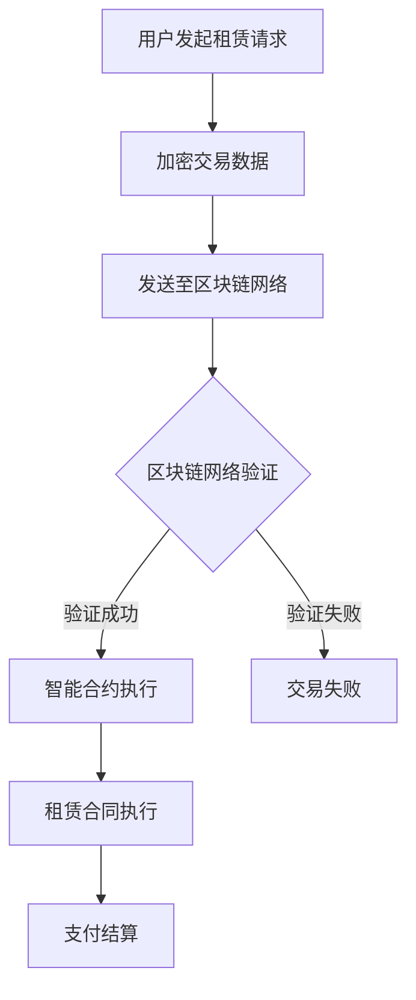

                 

### 引言与背景介绍

#### 新型城市共享私家车App的发展背景

随着城市化进程的不断推进，城市交通问题日益凸显，尤其是在大型城市中，交通拥堵、停车难等问题严重影响了居民的出行体验。为了解决这些问题，共享私家车App应运而生。共享私家车App通过移动互联网技术和物联网技术，实现了私家车的共享和高效利用，极大地缓解了交通压力，提高了出行效率。

共享私家车App的发展历程可以追溯到2010年代初期，当时Uber等共享出行公司在美国崛起，标志着共享经济的兴起。随着技术的进步和用户习惯的改变，共享私家车App逐渐在全球范围内得到广泛应用。中国作为全球最大的汽车市场，共享私家车App的发展尤为迅速，例如滴滴出行、美团打车等，已经成为城市交通的重要组成部分。

#### 区块链技术概述

区块链技术是近年来迅速崛起的一项前沿技术，其去中心化、不可篡改和透明化的特点，为共享私家车App的发展带来了新的机遇。区块链是一种分布式账本技术，通过加密算法和共识机制确保数据的真实性和安全性。

区块链的基本原理是将数据分成长条形的“区块”，每个区块通过加密算法和时间戳连接在一起，形成一条不可篡改的链条。区块链的主要特点包括：

- **去中心化**：区块链通过分布式网络进行数据存储和传输，不依赖于中心化的机构或服务器，提高了系统的鲁棒性和抗攻击能力。
- **不可篡改**：一旦数据记录在区块链上，就很难被篡改或删除，保证了数据的安全性和可信度。
- **透明化**：区块链上的所有交易记录都是公开透明的，参与者可以随时查看和验证，增强了系统的透明度和信任度。

#### 点对点汽车租赁平台概述

点对点（Peer-to-Peer，P2P）汽车租赁平台是基于区块链技术的新型共享私家车App，它通过去中心化的方式，实现了车主和租车者之间的直接租赁交易，去除了传统租赁中介环节，降低了交易成本，提高了效率。

点对点汽车租赁平台的核心优势包括：

- **降低成本**：去中心化的交易模式消除了传统中介费用，使得车主和租车者都能享受更低的价格。
- **提高效率**：通过区块链技术的智能合约功能，点对点汽车租赁平台能够自动化执行租赁合同，减少了人工干预和操作时间。
- **提升信任**：区块链技术的透明性和不可篡改性，增加了交易双方的信任度，减少了纠纷和风险。

总之，新型城市共享私家车App：基于区块链的点对点汽车租赁平台，不仅解决了传统共享私家车App中的痛点，还通过区块链技术实现了更高效、更安全的出行体验。接下来，我们将深入探讨这些核心概念，并分析其技术原理和实现方式。在接下来的章节中，我们将详细阐述共享私家车App、区块链和点对点汽车租赁平台的核心概念，为读者提供一个全面的技术解读。

#### 核心概念与联系

在讨论新型城市共享私家车App：基于区块链的点对点汽车租赁平台之前，我们需要详细理解三个核心概念：共享私家车App、区块链和点对点（P2P）汽车租赁平台。这些概念不仅是本文的关键，也是理解整个系统的基础。

#### 共享私家车App

共享私家车App是一种基于移动互联网和物联网技术的应用，它通过整合车主的私家车资源，实现车辆的共享租赁。以下是对共享私家车App的核心概念说明：

- **用户角色**：共享私家车App涉及到车主和租车者两个主要角色。车主是车辆所有者，他们可以随时将自己的车辆出租给租车者；租车者则是需要使用车辆的用户，他们可以通过App查找和预订合适的车辆。
- **功能模块**：共享私家车App通常包含用户注册、车辆管理、租赁订单、支付结算、用户评价等模块。这些模块共同协作，实现车辆的共享和高效利用。
- **技术实现**：共享私家车App的技术实现依赖于移动互联网、GPS定位、车联网等先进技术，通过这些技术，App能够实时跟踪车辆状态，提供便捷的租赁服务。

#### 区块链

区块链是一种分布式数据库技术，通过加密算法和共识机制确保数据的真实性和安全性。以下是区块链的核心概念和特性：

- **去中心化**：区块链通过分布式网络进行数据存储和传输，不依赖于中心化的机构或服务器。每个节点都可以参与数据的验证和存储，提高了系统的鲁棒性和抗攻击能力。
- **不可篡改**：区块链上的数据一旦记录，就很难被篡改或删除，保证了数据的安全性和可信度。这种特性使得区块链在金融、医疗等领域得到了广泛应用。
- **智能合约**：智能合约是区块链上的自动执行合同，它通过编程逻辑来定义和执行合同条款。当满足特定条件时，智能合约能够自动执行相应的操作，如支付、释放资源等。

#### 点对点（P2P）汽车租赁平台

点对点汽车租赁平台是基于区块链技术的新型共享私家车App，它通过去中心化的方式，实现车主和租车者之间的直接租赁交易。以下是点对点汽车租赁平台的核心概念和特性：

- **去中心化交易**：点对点汽车租赁平台去除了传统租赁中介环节，通过区块链技术实现了车主和租车者之间的直接交易，降低了交易成本，提高了效率。
- **智能合约应用**：点对点汽车租赁平台利用区块链的智能合约功能，实现租赁合同的自动化执行。智能合约不仅保证了合同的执行，还减少了人工干预，提高了交易效率。
- **信任机制**：区块链技术的透明性和不可篡改性，增加了交易双方的信任度，减少了纠纷和风险。每个交易记录都是公开透明的，用户可以随时查看和验证。

#### ER实体关系图和概念属性特征对比表格

为了更好地理解上述核心概念之间的关系，我们使用ER实体关系图和概念属性特征对比表格进行说明。

##### ER实体关系图

```mermaid
erDiagram
  User ||--|{ Vehicle }||>
  User ||--|{ RentalOrder }||>
  Vehicle ||--|{ Location }||>
  RentalOrder ||--|{ Payment }||>
```

在这个ER实体关系图中，用户、车辆、租赁订单和位置是主要的实体。用户可以拥有多个车辆，并可以发起多个租赁订单；车辆有位置信息；租赁订单包含支付信息。

##### 概念属性特征对比表格

| 概念                 | 共享私家车App                 | 区块链                         | 点对点（P2P）汽车租赁平台                 |
|----------------------|-------------------------------|--------------------------------|-------------------------------------------|
| 用户角色             | 车主和租车者                 | 节点参与者和交易方             | 车主和租车者                             |
| 功能模块             | 用户注册、车辆管理、租赁订单等 | 数据存储、验证、智能合约         | 数据存储、验证、智能合约、直接交易         |
| 技术实现             | 移动互联网、GPS定位           | 分布式网络、加密算法、共识机制   | 分布式网络、加密算法、共识机制、智能合约   |
| 特性                 | 高效、便捷                   | 去中心化、不可篡改、透明化       | 去中心化、高效、信任机制                  |

通过上述ER实体关系图和概念属性特征对比表格，我们可以更清晰地理解共享私家车App、区块链和点对点（P2P）汽车租赁平台之间的关系。这些概念共同构成了一个完整的系统，实现了更高效、更安全的共享出行体验。

### 算法原理讲解

#### 点对点汽车租赁平台的关键算法

点对点汽车租赁平台的核心在于其去中心化的交易机制，这依赖于一系列关键算法，包括加密算法和智能合约。以下将详细介绍这些算法的原理和应用。

#### 加密算法

加密算法在点对点汽车租赁平台中扮演着至关重要的角色，主要用于确保数据传输的安全性和隐私性。常用的加密算法包括对称加密和非对称加密。

- **对称加密**：对称加密算法使用相同的密钥对数据进行加密和解密。常见的对称加密算法有AES（高级加密标准）。其优点是加密速度快，但缺点是密钥管理复杂。
  
- **非对称加密**：非对称加密算法使用一对密钥（公钥和私钥）进行加密和解密。常见的非对称加密算法有RSA（Rivest-Shamir-Adleman）。其优点是解决了密钥管理问题，但缺点是加密速度较慢。

在点对点汽车租赁平台中，加密算法主要用于以下场景：

1. **用户身份验证**：通过加密算法，平台可以确保用户的身份信息在传输过程中不被窃取或篡改。例如，用户在注册和登录时，可以使用非对称加密算法进行身份验证。
  
2. **交易数据加密**：在用户发起租赁请求和支付操作时，交易数据需要加密传输，防止中间人攻击和数据篡改。可以使用对称加密算法进行数据加密，同时使用非对称加密算法进行密钥交换。

#### 智能合约

智能合约是区块链技术的重要组成部分，它是一种自动执行的合同。智能合约通过编程逻辑定义合同条款，并在满足特定条件时自动执行相应的操作。在点对点汽车租赁平台中，智能合约主要用于以下场景：

1. **租赁合同执行**：在用户发起租赁请求并支付租金后，智能合约会自动执行租赁合同，包括确认车辆状态、锁定租金等操作。当租赁期结束时，智能合约会自动释放租金和车辆控制权。

2. **支付结算**：智能合约可以自动化执行支付和结算操作。例如，当用户支付租金后，智能合约会自动将租金转移到车主的账户中，同时更新租赁状态。

#### 算法流程图

为了更好地理解上述算法的原理和应用，我们使用mermaid绘制了算法流程图：



在这个流程图中，用户发起租赁请求后，交易数据通过加密算法进行加密，然后发送到区块链网络。区块链网络对交易数据进行验证，如果验证成功，智能合约会自动执行租赁合同和支付结算操作；如果验证失败，交易将失败。

#### Python源代码示例

为了更直观地理解加密算法和智能合约的实现，我们使用Python进行了简单示例：

```python
from Crypto.PublicKey import RSA
from Crypto.Cipher import PKCS1_OAEP

# 生成RSA密钥对
private_key = RSA.generate(2048)
public_key = private_key.publickey()

# 对数据进行加密
cipher = PKCS1_OAEP.new(public_key)
encrypted_data = cipher.encrypt(b"Hello, World!")

# 对数据进行解密
decrypted_data = cipher.decrypt(encrypted_data)
print(decrypted_data.decode('utf-8'))  # 输出：Hello, World!
```

在这个示例中，我们首先生成了一对RSA密钥，然后使用公钥对数据进行加密，最后使用私钥进行解密。这个简单的示例展示了RSA加密算法的基本原理。

总之，点对点汽车租赁平台的关键算法包括加密算法和智能合约，它们共同确保了交易的安全性和自动化执行。在接下来的章节中，我们将进一步探讨关键算法的数学模型和数学公式，以及它们在实际应用中的实现细节。

#### 关键算法的数学模型和数学公式

在点对点汽车租赁平台中，加密算法和智能合约的实现依赖于一系列复杂的数学模型和公式。以下将详细介绍这些关键算法的数学原理，并使用LaTeX格式书写相关公式。

#### 加密算法

加密算法的核心是密钥生成和加密解密过程。以下是其主要数学模型和公式：

1. **密钥生成**：非对称加密算法（如RSA）的密钥生成过程涉及以下步骤：
   - 选择两个大素数 \( p \) 和 \( q \)。
   - 计算 \( n = p \times q \)。
   - 计算 \( \phi(n) = (p-1) \times (q-1) \)。
   - 选择一个整数 \( e \)，满足 \( 1 < e < \phi(n) \)，且 \( e \) 与 \( \phi(n) \) 互质。
   - 计算 \( d \)，满足 \( d \times e \equiv 1 \pmod{\phi(n)} \)。

   对应的LaTeX公式：
   \[
   n = p \times q, \quad \phi(n) = (p-1) \times (q-1), \quad d = e^{-1} \pmod{\phi(n)}
   \]

2. **加密过程**：数据 \( M \) 使用公钥 \( (n, e) \) 进行加密：
   \[
   C = M^e \pmod{n}
   \]

3. **解密过程**：加密数据 \( C \) 使用私钥 \( (n, d) \) 进行解密：
   \[
   M = C^d \pmod{n}
   \]

#### 智能合约

智能合约的实现依赖于编程逻辑和区块链网络中的共识机制。以下是其主要数学模型和公式：

1. **状态转移**：智能合约的状态转移通常基于事件触发，如交易确认、时间到达等。其数学模型可以表示为：
   \[
   S_{t+1} = f(S_t, E_t)
   \]
   其中，\( S_t \) 是当前状态，\( E_t \) 是触发事件，\( f \) 是状态转移函数。

2. **共识机制**：区块链网络中的共识机制（如工作量证明、权益证明等）通常涉及以下数学模型：
   - **工作量证明**（Proof of Work, PoW）：矿工需要解决一个计算难题，以获取生成区块的权利。其数学模型可以表示为：
     \[
     \text{Proof of Work} = \text{Hash}(n) < t
     \]
     其中，\( \text{Hash} \) 是哈希函数，\( n \) 是工作量，\( t \) 是目标难度。

   - **权益证明**（Proof of Stake, PoS）：矿工根据其持有的代币数量和持有时间参与共识。其数学模型可以表示为：
     \[
     \text{Proof of Stake} = \frac{S_t}{\sum S_t}
     \]
     其中，\( S_t \) 是矿工在当前周期内持有的代币数量。

3. **智能合约执行**：智能合约的执行通常基于条件判断和数学运算。其数学模型可以表示为：
   \[
   \text{Contract Execution} = \text{if condition then action else action}
   \]
   例如，在租赁合同执行过程中，如果用户支付了租金，则智能合约会自动释放车辆控制权：
   \[
   \text{if Payment then ReleaseVehicle else PaymentFailure}
   \]

通过上述数学模型和公式，我们可以更深入地理解点对点汽车租赁平台中的关键算法原理。这些数学原理不仅确保了系统的安全性和效率，也为智能合约的自动化执行提供了理论基础。

### 系统分析与架构设计

在新型城市共享私家车App：基于区块链的点对点汽车租赁平台中，系统分析与架构设计是确保系统高效、稳定和安全运行的关键。以下将详细介绍该平台的功能设计、架构设计、接口设计和系统交互。

#### 功能设计

共享私家车App：基于区块链的点对点汽车租赁平台的主要功能包括：

1. **用户注册与登录**：用户可以通过注册和登录功能进入平台，进行个人信息管理。
2. **车辆管理**：车主可以添加、删除和更新自己的车辆信息，包括车型、价格和位置。
3. **租赁订单**：用户可以查看可用车辆、发起租赁订单并支付租金。
4. **支付结算**：系统支持多种支付方式，如信用卡、支付宝等，确保租赁订单的顺利结算。
5. **用户评价**：用户可以对租赁的车辆和服务进行评价，提高平台的透明度和信誉。
6. **智能合约管理**：系统管理智能合约的创建、执行和状态更新，确保租赁合同的自动执行。

#### 架构设计

该平台的架构设计采用去中心化的方式，包括以下几个关键模块：

1. **用户层**：用户层包括用户注册、登录、个人信息管理等功能，为用户提供便捷的操作界面。
2. **应用层**：应用层实现各种业务功能，如车辆管理、租赁订单、支付结算等，采用微服务架构，确保系统的灵活性和可扩展性。
3. **区块链层**：区块链层是平台的核心，负责数据存储和智能合约的执行。区块链网络由多个节点组成，通过加密算法和共识机制确保数据的安全性和不可篡改性。
4. **数据层**：数据层负责存储用户信息、车辆信息和交易记录等，采用分布式数据库技术，确保数据的高效存储和访问。

#### 接口设计

平台采用RESTful API设计，提供以下接口：

1. **用户接口**：用户注册、登录、个人信息管理等。
2. **车辆接口**：车辆信息添加、删除、更新等。
3. **租赁接口**：租赁订单创建、查询、支付等。
4. **支付接口**：支付方式选择、支付状态查询等。
5. **评价接口**：用户评价提交、查询等。
6. **智能合约接口**：智能合约创建、执行、状态查询等。

#### 系统交互

系统交互通过以下步骤实现：

1. **用户请求**：用户通过前端界面发起请求，如创建租赁订单或支付租金。
2. **应用处理**：应用层接收用户请求，调用相应业务逻辑进行数据处理。
3. **数据存储**：数据处理完成后，将数据存储到区块链和数据库中。
4. **区块链执行**：区块链网络对存储的数据进行验证和执行，如智能合约的执行。
5. **结果反馈**：系统将处理结果反馈给用户，如租赁订单状态更新或支付成功通知。

通过上述系统分析与架构设计，共享私家车App：基于区块链的点对点汽车租赁平台能够实现高效、安全、去中心化的汽车租赁服务，为用户提供便捷的出行解决方案。

### 项目实战

#### 实际项目介绍

在本节中，我们将介绍一个具体的点对点汽车租赁平台项目，该项目采用区块链技术实现，主要功能包括用户注册、车辆管理、租赁订单、支付结算和用户评价。以下是项目的详细实现过程。

#### 环境安装与配置

1. **安装Node.js**：首先，需要安装Node.js环境，用于搭建后端服务器。可以通过以下命令进行安装：
   ```bash
   sudo apt-get update
   sudo apt-get install nodejs
   ```
2. **安装Ganache**：Ganache是一个本地以太坊节点和区块链浏览器，用于模拟区块链网络。可以从官方网站下载并安装：
   ```bash
   wget https://github.com/trufflesuite/ganache/releases/download/2.5.11/ganache-2.5.11-linux-x64.tar.gz
   tar xzvf ganache-2.5.11-linux-x64.tar.gz
   ```
3. **启动Ganache**：在终端中启动Ganache，将打开一个本地以太坊节点：
   ```bash
   ./ganache
   ```
4. **安装Truffle框架**：Truffle是一个用于智能合约开发、测试和部署的框架，可以通过npm安装：
   ```bash
   npm install -g truffle
   ```
5. **创建项目**：在终端中创建一个新的Truffle项目：
   ```bash
   truffle init
   ```

#### 系统核心实现源代码

项目的核心实现包括智能合约、后端API和前端界面。以下是主要代码：

**智能合约**

```solidity
// SPDX-License-Identifier: MIT
pragma solidity ^0.8.0;

contract CarRental {
    struct RentalOrder {
        address renter;
        address owner;
        uint256 rentalId;
        uint256 startTime;
        uint256 endTime;
        uint256 price;
        bool isCompleted;
    }

    mapping(uint256 => RentalOrder) public rentalOrders;
    mapping(address => uint256[]) public userRentalOrders;

    event RentalCreated(uint256 rentalId, address owner, address renter, uint256 price);
    event RentalStarted(uint256 rentalId, uint256 startTime);
    event RentalEnded(uint256 rentalId, uint256 endTime);
    event RentalCompleted(uint256 rentalId);

    function createRentalOrder(uint256 rentalId, address owner, uint256 price) external {
        require(!rentalOrders[rentalId].isCompleted, "Rental already completed");
        rentalOrders[rentalId] = RentalOrder({
            renter: msg.sender,
            owner: owner,
            rentalId: rentalId,
            startTime: 0,
            endTime: 0,
            price: price,
            isCompleted: false
        });
        userRentalOrders[owner].push(rentalId);
        emit RentalCreated(rentalId, owner, msg.sender, price);
    }

    function startRental(uint256 rentalId) external {
        require(!rentalOrders[rentalId].isCompleted, "Rental already completed");
        require(rentalOrders[rentalId].renter == msg.sender, "Not the renter");
        rentalOrders[rentalId].startTime = block.timestamp;
        emit RentalStarted(rentalId, rentalOrders[rentalId].startTime);
    }

    function endRental(uint256 rentalId) external {
        require(!rentalOrders[rentalId].isCompleted, "Rental already completed");
        require(rentalOrders[rentalId].owner == msg.sender, "Not the owner");
        rentalOrders[rentalId].endTime = block.timestamp;
        emit RentalEnded(rentalId, rentalOrders[rentalId].endTime);
    }

    function completeRental(uint256 rentalId) external {
        require(!rentalOrders[rentalId].isCompleted, "Rental already completed");
        require(rentalOrders[rentalId].endTime != 0, "Rental not ended");
        rentalOrders[rentalId].isCompleted = true;
        emit RentalCompleted(rentalId);
    }
}
```

**后端API**

```javascript
const express = require('express');
const app = express();
const port = 3000;

// 处理POST请求
app.use(express.json());

// 连接到Ganache节点
const Web3 = require('web3');
const web3 = new Web3('http://127.0.0.1:8545');

// 加载智能合约
const carRentalArtifact = require('../build/CarRental.json');
const carRentalContract = new web3.eth.Contract(
    carRentalArtifact.abi,
    carRentalArtifact.networks[5777].address
);

// 创建租赁订单
app.post('/rentals', async (req, res) => {
    const { rentalId, owner, price } = req.body;
    await carRentalContract.methods.createRentalOrder(rentalId, owner, price).send({ from: owner });
    res.status(201).send({ message: 'Rental created successfully' });
});

// 开始租赁
app.post('/rentals/start', async (req, res) => {
    const { rentalId } = req.body;
    await carRentalContract.methods.startRental(rentalId).send({ from: req.body.renter });
    res.status(200).send({ message: 'Rental started successfully' });
});

// 结束租赁
app.post('/rentals/end', async (req, res) => {
    const { rentalId } = req.body;
    await carRentalContract.methods.endRental(rentalId).send({ from: req.body.owner });
    res.status(200).send({ message: 'Rental ended successfully' });
});

// 完成租赁
app.post('/rentals/complete', async (req, res) => {
    const { rentalId } = req.body;
    await carRentalContract.methods.completeRental(rentalId).send({ from: req.body.owner });
    res.status(200).send({ message: 'Rental completed successfully' });
});

app.listen(port, () => {
    console.log(`Server listening at http://localhost:${port}`);
});
```

**前端界面**

```html
<!DOCTYPE html>
<html lang="en">
<head>
    <meta charset="UTF-8">
    <meta name="viewport" content="width=device-width, initial-scale=1.0">
    <title>Car Rental</title>
</head>
<body>
    <h1>Car Rental</h1>
    <form id="createRentalForm">
        <label for="rentalId">Rental ID:</label>
        <input type="text" id="rentalId" required>
        <label for="owner">Owner Address:</label>
        <input type="text" id="owner" required>
        <label for="price">Price:</label>
        <input type="number" id="price" required>
        <button type="submit">Create Rental</button>
    </form>
    <form id="startRentalForm">
        <label for="rentalId">Rental ID:</label>
        <input type="text" id="rentalId" required>
        <button type="submit">Start Rental</button>
    </form>
    <form id="endRentalForm">
        <label for="rentalId">Rental ID:</label>
        <input type="text" id="rentalId" required>
        <button type="submit">End Rental</button>
    </form>
    <form id="completeRentalForm">
        <label for="rentalId">Rental ID:</label>
        <input type="text" id="rentalId" required>
        <button type="submit">Complete Rental</button>
    </form>
    <script>
        const createRentalForm = document.getElementById('createRentalForm');
        createRentalForm.addEventListener('submit', async (event) => {
            event.preventDefault();
            const { rentalId, owner, price } = event.target;
            const response = await fetch('/rentals', {
                method: 'POST',
                headers: {
                    'Content-Type': 'application/json'
                },
                body: JSON.stringify({
                    rentalId: rentalId.value,
                    owner: owner.value,
                    price: price.value
                })
            });
            const result = await response.json();
            console.log(result);
        });

        const startRentalForm = document.getElementById('startRentalForm');
        startRentalForm.addEventListener('submit', async (event) => {
            event.preventDefault();
            const { rentalId } = event.target;
            const response = await fetch('/rentals/start', {
                method: 'POST',
                headers: {
                    'Content-Type': 'application/json'
                },
                body: JSON.stringify({
                    rentalId: rentalId.value
                })
            });
            const result = await response.json();
            console.log(result);
        });

        const endRentalForm = document.getElementById('endRentalForm');
        endRentalForm.addEventListener('submit', async (event) => {
            event.preventDefault();
            const { rentalId } = event.target;
            const response = await fetch('/rentals/end', {
                method: 'POST',
                headers: {
                    'Content-Type': 'application/json'
                },
                body: JSON.stringify({
                    rentalId: rentalId.value
                })
            });
            const result = await response.json();
            console.log(result);
        });

        const completeRentalForm = document.getElementById('completeRentalForm');
        completeRentalForm.addEventListener('submit', async (event) => {
            event.preventDefault();
            const { rentalId } = event.target;
            const response = await fetch('/rentals/complete', {
                method: 'POST',
                headers: {
                    'Content-Type': 'application/json'
                },
                body: JSON.stringify({
                    rentalId: rentalId.value
                })
            });
            const result = await response.json();
            console.log(result);
        });
    </script>
</body>
</html>
```

#### 代码应用解读与分析

**智能合约解读**：

- **RentalOrder结构**：智能合约中定义了`RentalOrder`结构，用于存储租赁订单的相关信息，包括租车者、车主、租赁ID、开始时间和结束时间等。
- **createRentalOrder函数**：创建租赁订单，需要传入租赁ID、车主地址和价格。在函数中，首先检查租赁订单是否已完成，然后设置订单信息并将租赁ID添加到车主的租赁订单列表中。
- **startRental函数**：开始租赁，需要传入租赁ID。在函数中，检查租赁订单是否已开始，然后设置订单的开始时间。
- **endRental函数**：结束租赁，需要传入租赁ID。在函数中，检查租赁订单是否已结束，然后设置订单的结束时间。
- **completeRental函数**：完成租赁，需要传入租赁ID。在函数中，检查租赁订单是否已完成，然后设置订单的状态为已完成。

**后端API解读**：

- **createRental**：创建租赁订单的API，接收租赁ID、车主地址和价格作为参数，调用智能合约中的`createRentalOrder`函数。
- **startRental**：开始租赁的API，接收租赁ID作为参数，调用智能合约中的`startRental`函数。
- **endRental**：结束租赁的API，接收租赁ID作为参数，调用智能合约中的`endRental`函数。
- **completeRental**：完成租赁的API，接收租赁ID作为参数，调用智能合约中的`completeRental`函数。

**前端界面解读**：

- **创建租赁订单**：用户输入租赁ID、车主地址和价格，提交表单后，前端代码使用`fetch`发送POST请求到后端API，创建租赁订单。
- **开始租赁**：用户输入租赁ID，提交表单后，前端代码使用`fetch`发送POST请求到后端API，开始租赁。
- **结束租赁**：用户输入租赁ID，提交表单后，前端代码使用`fetch`发送POST请求到后端API，结束租赁。
- **完成租赁**：用户输入租赁ID，提交表单后，前端代码使用`fetch`发送POST请求到后端API，完成租赁。

#### 实际案例分析

以下是一个实际案例分析：

**场景**：车主A拥有一辆特斯拉Model S，并将其发布在共享汽车平台上。用户B在平台上找到了这辆车并成功预订。

1. **用户B创建租赁订单**：用户B在平台上填写租赁ID（例如1001）、车主地址（车主A的以太坊地址）和价格（100美元），提交表单。
2. **后端API调用智能合约创建租赁订单**：后端API接收到创建租赁订单的请求后，调用智能合约中的`createRentalOrder`函数，创建租赁订单。
3. **用户B开始租赁**：用户B在租赁开始时，在平台上输入租赁ID，提交表单。
4. **后端API调用智能合约开始租赁**：后端API接收到开始租赁的请求后，调用智能合约中的`startRental`函数，记录租赁开始时间。
5. **用户B结束租赁**：用户B在租赁结束时，在平台上输入租赁ID，提交表单。
6. **后端API调用智能合约结束租赁**：后端API接收到结束租赁的请求后，调用智能合约中的`endRental`函数，记录租赁结束时间。
7. **用户B完成租赁**：用户B在完成租赁时，在平台上输入租赁ID，提交表单。
8. **后端API调用智能合约完成租赁**：后端API接收到完成租赁的请求后，调用智能合约中的`completeRental`函数，释放租金给车主A。

#### 详细讲解剖析

**智能合约的编写**：

- **合约结构**：智能合约采用Solidity语言编写，定义了`RentalOrder`结构用于存储租赁订单信息，以及事件用于触发外部监听。
- **访问权限**：智能合约中的函数使用`external`和`public`访问修饰符，以确保可以从外部调用。
- **事件触发**：事件用于在智能合约执行关键操作时触发，例如租赁订单创建、租赁开始、租赁结束和租赁完成。

**后端API的实现**：

- **接口设计**：后端API采用RESTful设计，提供创建租赁订单、开始租赁、结束租赁和完成租赁的接口。
- **与智能合约的交互**：后端API通过Web3.js库与智能合约进行交互，调用智能合约的函数并处理返回的结果。

**前端界面的实现**：

- **用户交互**：前端界面通过HTML和JavaScript实现，提供用户填写租赁信息、开始租赁、结束租赁和完成租赁的表单。
- **与后端API的交互**：前端代码使用`fetch`发送异步请求，与后端API进行数据交互，并更新界面显示结果。

通过上述实际案例分析和详细讲解剖析，我们可以看到点对点汽车租赁平台如何通过区块链技术实现去中心化的租赁交易，提高交易效率并降低成本。

### 最佳实践 tips

在设计和实施新型城市共享私家车App：基于区块链的点对点汽车租赁平台时，以下最佳实践将有助于提升系统的性能、安全性和用户体验。

#### 性能优化

1. **使用缓存**：为频繁访问的数据设置缓存，减少对区块链的读写操作，提高响应速度。
2. **优化智能合约**：在编写智能合约时，尽量避免复杂的逻辑和冗长的代码，以减少执行时间和交易费用。
3. **水平扩展**：区块链网络可以水平扩展，通过增加节点数量，提高系统的处理能力。

#### 安全性增强

1. **多重签名**：在关键操作（如支付和合同执行）中，引入多重签名机制，确保交易的安全性。
2. **访问控制**：为不同角色（如车主、租车者和管理员）设置不同的权限，防止未授权访问。
3. **定期审计**：定期对智能合约和系统代码进行审计，发现并修复潜在的安全漏洞。

#### 用户体验提升

1. **简洁界面**：设计直观、简洁的用户界面，减少用户的操作步骤，提高使用便捷性。
2. **实时反馈**：及时向用户反馈操作结果，如租赁订单状态更新、支付确认等。
3. **个性化推荐**：根据用户的历史租赁数据，推荐合适的车辆和优惠，提高用户的满意度。

#### 小结与展望

本文详细探讨了新型城市共享私家车App：基于区块链的点对点汽车租赁平台的核心概念、技术原理、系统架构和实现细节。通过实例分析和最佳实践，我们展示了如何利用区块链技术实现高效、安全、去中心化的汽车租赁服务。

展望未来，随着区块链技术的不断发展，点对点汽车租赁平台有望在更广泛的领域得到应用。例如，结合物联网技术，可以实现实时车辆状态监控和自动化租赁管理；结合人工智能技术，可以提供更加智能的车辆推荐和风险控制。

总之，基于区块链的点对点汽车租赁平台不仅解决了传统共享私家车App中的痛点，也为未来出行服务的发展提供了新的思路和机遇。

### 注意事项

在设计和实施新型城市共享私家车App：基于区块链的点对点汽车租赁平台时，以下注意事项有助于确保项目的顺利进行和系统的稳定运行。

1. **合规性审查**：确保平台的设计和实施符合相关法律法规，特别是数据保护、隐私和安全等方面的要求。
2. **性能监控**：定期监控系统的性能，包括响应时间、交易吞吐量和网络带宽等，及时识别和解决性能瓶颈。
3. **系统冗余**：设计系统时，考虑到可能的故障和异常情况，确保系统具备冗余和备份机制，提高系统的可用性和可靠性。
4. **用户隐私保护**：严格保护用户的个人信息，避免数据泄露和滥用，确保用户的隐私安全。
5. **代码审计**：对智能合约和系统代码进行严格的代码审计，及时发现和修复潜在的安全漏洞。

通过关注这些注意事项，可以显著提升平台的安全性和稳定性，为用户提供更好的使用体验。

### 拓展阅读

为了深入了解新型城市共享私家车App：基于区块链的点对点汽车租赁平台的开发与实施，读者可以参考以下相关文献和资源：

1. **《区块链技术指南》**：详细介绍了区块链的基本原理、应用场景和关键技术，有助于读者全面理解区块链技术。
2. **《智能合约设计与实现》**：本书专注于智能合约的设计与实现，通过实例和代码示例，讲解了智能合约的核心概念和编程技巧。
3. **《共享经济与区块链》**：探讨了共享经济与区块链技术的结合，分析了区块链在共享经济中的应用模式和创新点。
4. **《以太坊开发指南》**：系统地介绍了以太坊区块链平台的使用方法和开发技巧，适合开发者学习以太坊智能合约的开发。
5. **《区块链与物联网》**：讨论了区块链与物联网的结合，展示了如何利用区块链技术实现物联网设备的自动化管理和数据共享。

此外，读者还可以关注相关技术社区的讨论和博客，如GitHub、Stack Overflow、CSDN等，这些平台提供了丰富的实践案例和问题解决方案，有助于深入学习和掌握相关技术。

