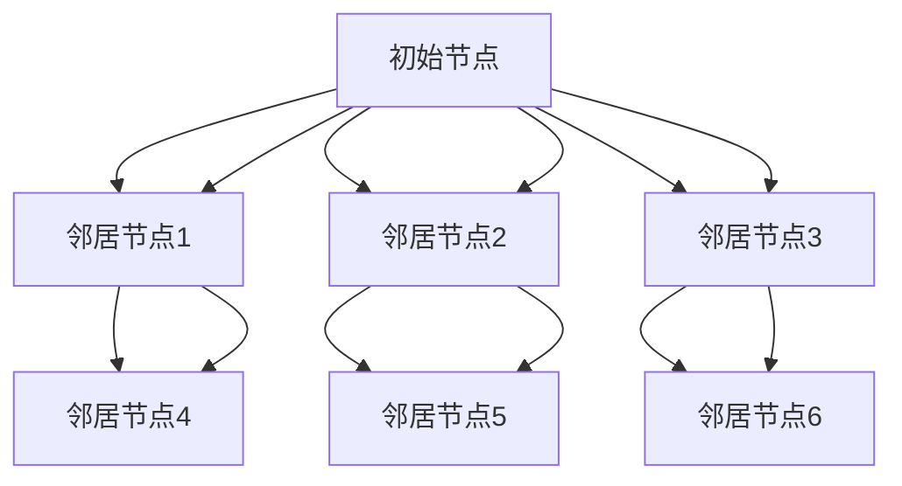
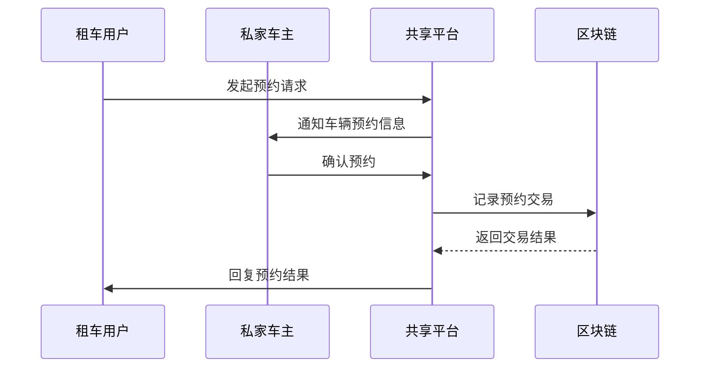
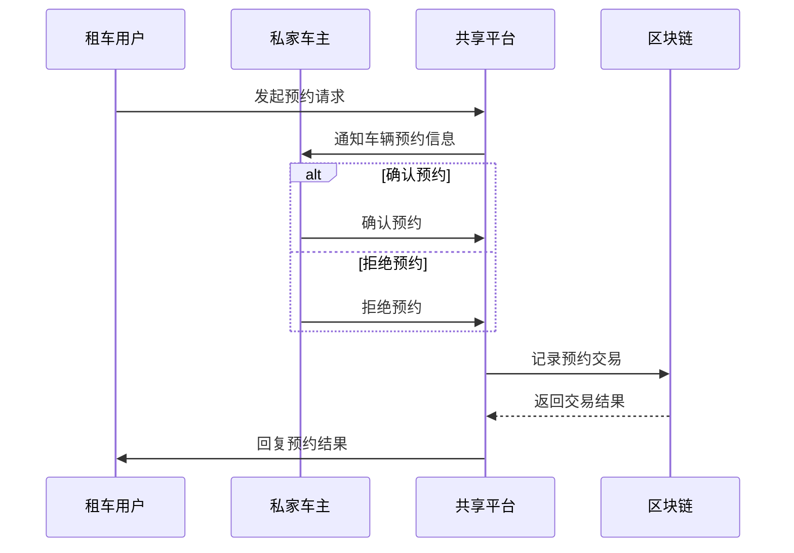

                 

# 新型城市共享私家车联盟：基于区块链的点对点汽车租赁网络

> 关键词：区块链、共享私家车、点对点网络、汽车租赁、智能合约、城市交通

> 摘要：本文深入探讨了基于区块链技术的城市共享私家车联盟及其点对点汽车租赁网络。首先，文章介绍了共享私家车联盟的背景和核心概念，包括区块链、点对点网络和智能合约等关键技术。接着，我们分析了算法原理，并通过Python代码示例详细阐述了点对点网络中的数学模型和公式。随后，文章从系统分析和设计角度，提出了城市共享私家车联盟的系统架构和接口设计。最后，通过一个实际项目案例，展示了如何实现一个基于区块链的共享私家车系统，并提供了最佳实践建议和未来研究方向。

## 目录

1. **引言**
   1.1 城市交通问题的背景
   1.2 共享私家车联盟的概念
   1.3 文章目的与结构

2. **共享私家车联盟的背景与核心概念**
   2.1 城市交通现状
   2.2 共享私家车联盟的定义
   2.3 区块链技术概述
   2.4 点对点网络的概念
   2.5 智能合约的应用
   2.6 核心概念特征对比表
   2.7 实体关系图（ER图）

3. **算法原理分析**
   3.1 区块链与加密技术
   3.2 点对点网络算法
   3.3 智能合约工作机制
   3.4 数学模型与公式
   3.5 Python代码示例

4. **系统分析与设计**
   4.1 系统概述
   4.2 系统功能设计
   4.3 系统架构设计
   4.4 系统接口与交互设计

5. **项目实战：基于区块链的共享私家车系统**
   5.1 项目环境安装
   5.2 系统核心实现
   5.3 代码解读与分析
   5.4 实际案例分析
   5.5 项目小结

6. **最佳实践与未来展望**
   6.1 实施最佳实践
   6.2 注意事项与挑战
   6.3 拓展阅读

7. **总结**
   7.1 文章回顾
   7.2 研究方向与展望
   7.3 作者信息

## 引言

### 城市交通问题的背景

随着城市化进程的加快，城市交通问题日益突出。城市人口的快速增长和汽车拥有量的不断增加，使得交通拥堵、空气污染、停车难等问题愈发严重。传统的交通模式和私有车辆制度不仅浪费资源，而且难以有效管理。为了解决这些问题，共享经济模式开始在城市交通领域得到广泛应用。

共享经济模式通过共享资源和优化配置，实现了资源的高效利用和成本的分摊。共享私家车作为一种新型的交通模式，不仅能够缓解交通拥堵，减少空气污染，还能提供便捷的出行服务。然而，传统共享私家车联盟面临诸多挑战，如信用风险、数据隐私、运营效率等。因此，探索一种基于新兴技术的解决方案成为必然选择。

### 共享私家车联盟的概念

共享私家车联盟（Urban Shared Private Car Alliance，USPCA）是指由多个私家车主组成的联盟，通过一个共享平台，实现车辆的共享和调度。联盟成员通过平台发布车辆信息，其他成员可以查看并预约使用这些车辆。这种模式不仅提高了车辆的利用率，还降低了出行成本。

共享私家车联盟的优势在于，它能够通过技术手段解决传统模式中的问题。例如，通过区块链技术，可以实现去中心化的信任机制，确保数据安全和交易透明；通过智能合约，可以自动执行租车协议，提高交易效率；通过点对点网络，可以实现实时调度和资源优化配置。

### 文章目的与结构

本文旨在探讨基于区块链技术的共享私家车联盟，并提出一种点对点汽车租赁网络的设计方案。文章首先介绍共享私家车联盟的背景和核心概念，然后分析算法原理和数学模型，接着从系统分析和设计角度，详细阐述共享私家车系统的架构和接口设计。最后，通过一个实际项目案例，展示如何实现一个基于区块链的共享私家车系统，并提供最佳实践建议和未来研究方向。

## 共享私家车联盟的背景与核心概念

### 城市交通现状

随着城市化进程的加速，城市交通问题已成为全球各大城市面临的共同挑战。交通拥堵不仅影响市民的出行体验，还导致大量时间浪费，降低城市运行效率。同时，汽车尾气排放是城市空气污染的主要来源之一，加剧了环境污染和健康问题。此外，停车位不足也是城市交通的一大难题，尤其是在商业中心和居民区。

传统交通模式中，私家车作为主要的出行工具，其使用效率低下。据统计，私家车平均每天的使用时间仅为4-5小时，而停车占据其余大部分时间。这意味着，私家车的利用率极低，造成了巨大的资源浪费。为了解决这些问题，共享经济模式开始在城市交通领域得到广泛应用。

### 共享私家车联盟的定义

共享私家车联盟（USPCA）是一种基于共享经济的交通模式，通过一个集中的平台，将私家车主和租车用户连接起来，实现车辆的共享和调度。在这个联盟中，私家车主可以发布自己的车辆信息，包括车型、位置、使用时间等，其他用户可以通过平台查看并预约这些车辆。租车用户在预约成功后，前往车主指定的地点取车，按照约定的时间和使用情况支付费用。

共享私家车联盟的主要目标是提高车辆利用率，降低出行成本，同时减少交通拥堵和空气污染。与传统的出租车或租车服务相比，共享私家车联盟具有更高的灵活性和经济性。用户可以根据自己的需求，选择最合适的车辆，无需支付高昂的停车费用，也不必担心车辆的维护和保险问题。

### 区块链技术概述

区块链技术是一种分布式数据库技术，通过加密算法确保数据的安全性和不可篡改性。区块链的主要特点是去中心化、透明性和不可篡改性。每个区块包含一定数量的交易记录，这些记录按照时间顺序串联成一条链，形成一个完整的数据结构。

在共享私家车联盟中，区块链技术可以用于确保交易的安全性和透明性。通过智能合约，可以自动化执行租车协议，确保双方按照约定执行。此外，区块链技术还可以用于记录车辆状态、行驶里程、费用结算等数据，确保数据的真实性和不可篡改性。

### 点对点网络的概念

点对点网络（Peer-to-Peer，P2P）是一种分布式网络架构，网络中的节点可以直接相互通信，无需依赖中心化的服务器。P2P网络具有高可靠性、去中心化和高效性等特点，适用于共享经济模式。

在共享私家车联盟中，点对点网络可以用于实现车辆共享和调度。每个私家车主和租车用户都是一个节点，通过P2P网络相互连接。车主可以在自己的节点上发布车辆信息，租车用户可以在其他节点的信息中查找和预约车辆。P2P网络确保了信息的高效传播和实时更新，提高了系统的响应速度和可靠性。

### 智能合约的应用

智能合约是一种自动执行合同条款的计算机程序，其运行基于区块链技术。智能合约可以用于自动化执行各种交易，确保交易的公正性和透明性。

在共享私家车联盟中，智能合约可以用于实现租车协议的自动化执行。例如，当用户成功预约一辆车后，智能合约会自动计算租车费用，并将费用从用户的账户中转移到车主的账户中。同时，智能合约还可以记录车辆的行驶里程和状态，确保数据的真实性和完整性。

### 核心概念特征对比表

| 概念        | 特点                           | 应用场景                                       |
|-------------|--------------------------------|----------------------------------------------|
| 区块链       | 去中心化、透明性、不可篡改       | 数据存储与交易验证                             |
| 点对点网络   | 去中心化、高可靠性、高效性       | 信息共享与资源调度                             |
| 智能合约     | 自动执行、公正性、透明性         | 合同自动化执行                                 |

### 实体关系图（ER图）

为了更好地理解共享私家车联盟的组成部分和关系，我们可以使用实体关系图（ER图）来描述。ER图包括实体、属性和关系三个要素。

1. **实体**：包括用户（租车用户和私家车主）、车辆、智能合约和区块链。
2. **属性**：用户包括用户名、密码、联系方式等；车辆包括车牌号、车型、位置等；智能合约包括合约地址、状态等；区块链包括区块高度、交易记录等。
3. **关系**：用户与车辆之间有一对多关系，即一个用户可以拥有多辆车，一辆车也可以被多个用户使用。用户与智能合约之间有一对一关系，即每个用户都有一个与之关联的智能合约。智能合约与区块链之间有一对一关系，即每个智能合约都运行在特定的区块链上。

以下是一个简单的ER图示例（使用Mermaid格式）：

```mermaid
erDiagram
  User ||--|{ Vehicle }|--|| RentalContract
  Vehicle ||--|{ Blockchain }|--|| RentalContract
```

## 算法原理分析

### 区块链与加密技术

区块链是一种分布式数据库技术，通过加密算法确保数据的安全性和不可篡改性。区块链的主要特点是去中心化、透明性和不可篡改性。每个区块包含一定数量的交易记录，这些记录按照时间顺序串联成一条链，形成一个完整的数据结构。

在区块链中，加密技术用于保护数据的完整性和隐私。最常见的加密算法是哈希函数，它可以将任意长度的数据映射为固定长度的字符串。哈希函数的一个重要特性是单向性，即无法通过哈希值反推出原始数据。这使得区块链中的数据无法被篡改，因为一旦数据被篡改，其哈希值将发生变化，导致整个链的破坏。

### 点对点网络算法

点对点网络（P2P）是一种分布式网络架构，网络中的节点可以直接相互通信，无需依赖中心化的服务器。P2P网络具有高可靠性、去中心化和高效性等特点，适用于共享经济模式。

在共享私家车联盟中，点对点网络可以用于实现车辆共享和调度。每个私家车主和租车用户都是一个节点，通过P2P网络相互连接。节点之间的通信是通过Gossip协议实现的，即每个节点将接收到的信息传递给其邻居节点，从而实现信息的高效传播。

以下是一个简化的点对点网络算法流程：

1. **初始化**：每个节点加入网络时，需要选择一定数量的邻居节点，并建立连接。
2. **数据传播**：当一个节点收到新的信息时，将其发送给所有邻居节点。
3. **数据验证**：邻居节点收到信息后，对其进行验证，确保信息的真实性和完整性。
4. **数据更新**：如果验证通过，节点将更新其本地数据，并再次发送给邻居节点。

以下是一个简单的点对点网络算法示例（使用Mermaid格式）：



### 智能合约工作机制

智能合约是一种自动执行合同条款的计算机程序，其运行基于区块链技术。智能合约可以用于自动化执行各种交易，确保交易的公正性和透明性。

在共享私家车联盟中，智能合约用于实现租车协议的自动化执行。当用户成功预约一辆车后，智能合约会自动计算租车费用，并将费用从用户的账户中转移到车主的账户中。同时，智能合约还可以记录车辆的行驶里程和状态，确保数据的真实性和完整性。

以下是一个简化的智能合约工作机制流程：

1. **用户预约车辆**：用户通过平台向车主发送预约请求。
2. **智能合约执行**：智能合约接收预约请求，并根据租车协议计算费用。
3. **费用转账**：智能合约将费用从用户账户转移到车主账户。
4. **记录行驶里程和状态**：智能合约记录车辆的行驶里程和状态，确保数据的真实性和完整性。
5. **交易确认**：区块链网络中的其他节点对交易进行验证和确认。

以下是一个简单的智能合约示例（使用Python）：

```python
# SPDX-License-Identifier: MIT
pragma solidity ^0.8.0;

contract CarRental {
    struct Rental {
        address user;
        address owner;
        uint256 startTime;
        uint256 endTime;
        uint256 fee;
        bool isCompleted;
    }

    mapping(address => Rental[]) private rentals;

    function rentCar(address owner, uint256 startTime, uint256 endTime, uint256 fee) external {
        require(endTime > startTime, "End time must be after start time");
        require(!isCompleted, "Rental is already completed");

        rentals[msg.sender].push(Rental({
            user: msg.sender,
            owner: owner,
            startTime: startTime,
            endTime: endTime,
            fee: fee,
            isCompleted: false
        }));

        (bool sent, ) = owner.call{value: fee}("");
        require(sent, "Failed to send Ether");
    }

    function getRentalHistory(address user) external view returns (Rental[] memory) {
        return rentals[user];
    }
}
```

### 数学模型与公式

在共享私家车联盟中，数学模型用于计算租车费用、行驶里程和状态。以下是一些常用的数学模型和公式：

1. **租车费用计算公式**：

   \[ \text{fee} = \text{base\_rate} + \text{mileage\_rate} \times \text{distance} \]

   其中，base\_rate 表示基础费用，mileage\_rate 表示每公里费用，distance 表示行驶距离。

2. **行驶里程计算公式**：

   \[ \text{distance} = \int_{\text{startTime}}^{\text{endTime}} \text{speed} \, dt \]

   其中，speed 表示平均速度，startTime 和 endTime 分别表示开始时间和结束时间。

3. **状态判断公式**：

   \[ \text{status} = \begin{cases} 
   \text{IN_PROGRESS}, & \text{if } \text{endTime} > \text{current\_time} \\
   \text{COMPLETED}, & \text{if } \text{endTime} \leq \text{current\_time} 
   \end{cases} \]

   其中，IN_PROGRESS 表示租车正在进行，COMPLETED 表示租车已完成。

以下是一个简单的数学模型示例（使用LaTeX）：

```latex
\documentclass{article}
\usepackage{amsmath}
\begin{document}

\begin{equation}
\text{fee} = \text{base\_rate} + \text{mileage\_rate} \times \text{distance}
\end{equation}

\begin{equation}
\text{distance} = \int_{\text{startTime}}^{\text{endTime}} \text{speed} \, dt
\end{equation}

\begin{equation}
\text{status} = 
\begin{cases} 
\text{IN_PROGRESS}, & \text{if } \text{endTime} > \text{current\_time} \\
\text{COMPLETED}, & \text{if } \text{endTime} \leq \text{current\_time} 
\end{cases}
\end{equation}

\end{document}
```

### Python代码示例

以下是一个简单的Python代码示例，用于实现租车费用计算和状态判断：

```python
import datetime

class Rental:
    def __init__(self, base_rate, mileage_rate, start_time, end_time):
        self.base_rate = base_rate
        self.mileage_rate = mileage_rate
        self.start_time = start_time
        self.end_time = end_time
        self.status = "IN_PROGRESS"

    def calculate_fee(self, distance):
        fee = self.base_rate + self.mileage_rate * distance
        return fee

    def calculate_status(self, current_time):
        if self.end_time > current_time:
            self.status = "IN_PROGRESS"
        else:
            self.status = "COMPLETED"
        return self.status

# 示例
base_rate = 10
mileage_rate = 1
start_time = datetime.datetime(2022, 1, 1, 10, 0)
end_time = datetime.datetime(2022, 1, 1, 12, 0)
distance = 20

rental = Rental(base_rate, mileage_rate, start_time, end_time)
current_time = datetime.datetime(2022, 1, 1, 12, 0)

print("Total fee:", rental.calculate_fee(distance))
print("Rental status:", rental.calculate_status(current_time))
```

## 系统分析与设计

### 系统概述

共享私家车联盟系统是一个分布式系统，由多个节点组成，包括私家车主节点、租车用户节点和区块链节点。系统的主要功能包括车辆信息发布、车辆预约、费用结算和车辆状态记录。系统需要满足以下功能需求：

1. **车辆信息发布**：私家车主可以在平台上发布车辆信息，包括车牌号、车型、位置、可用时间等。
2. **车辆预约**：租车用户可以查看车辆信息，选择合适的车辆进行预约。
3. **费用结算**：系统需要自动计算租车费用，并在用户预约成功后，将费用从用户账户转移到车主账户。
4. **车辆状态记录**：系统需要记录车辆的行驶里程和状态，包括预约状态、行驶里程和费用结算状态。

### 系统功能设计

系统功能设计包括领域模型设计，用于描述系统的核心业务实体和它们之间的关系。以下是一个简化的领域模型（使用Mermaid格式）：

```mermaid
classDiagram
  User <<entity>>
  Car <<entity>>
  Rental <<entity>>
  
  User --> Car : has
  Rental --> User : user
  Rental --> Car : car
```

### 系统架构设计

系统架构设计包括系统组件的划分和它们之间的交互关系。以下是一个简化的系统架构图（使用Mermaid格式）：



### 系统接口设计与系统交互

系统接口设计包括API接口的设计，用于实现不同节点之间的数据交换。以下是一个简化的接口设计（使用Mermaid格式）：

```mermaid
classDiagram
  CarAPI <<interface>>
  UserAPI <<interface>>
  RentalAPI <<interface>>

  CarAPI: 发布车辆信息/查询车辆信息
  UserAPI: 注册/登录/查询账户信息/发起预约请求
  RentalAPI: 查询预约状态/计算费用/记录费用结算
  
  UserAPI --|> CarAPI
  UserAPI --|> RentalAPI
  CarAPI --|> RentalAPI
```

### 系统接口设计与系统交互

系统接口设计包括API接口的设计，用于实现不同节点之间的数据交换。以下是一个简化的接口设计（使用Mermaid格式）：

```mermaid
classDiagram
  CarAPI <<interface>>
  UserAPI <<interface>>
  RentalAPI <<interface>>

  CarAPI: 发布车辆信息/查询车辆信息
  UserAPI: 注册/登录/查询账户信息/发起预约请求
  RentalAPI: 查询预约状态/计算费用/记录费用结算
  
  UserAPI --|> CarAPI
  UserAPI --|> RentalAPI
  CarAPI --|> RentalAPI
```

### 系统接口设计与系统交互

为了更好地展示系统接口的设计和系统交互过程，我们可以使用Mermaid的序列图（Sequence Diagram）来描述。以下是一个简化的序列图示例：



在这个序列图中，用户（User）通过共享平台（Platform）发起预约请求。平台（Platform）接收到请求后，会通知私家车主（CarOwner）。私家车主（CarOwner）可以确认或拒绝预约。如果确认预约，平台（Platform）会将预约信息记录到区块链（Blockchain）上，并获得交易结果。最后，平台（Platform）将预约结果返回给用户（User）。

## 项目实战：基于区块链的共享私家车系统

### 项目环境安装

要实现一个基于区块链的共享私家车系统，首先需要搭建开发环境。以下是一个简化的步骤：

1. **安装Node.js**：Node.js是一个基于Chrome V8引擎的JavaScript运行环境，用于构建高性能的Web应用和服务。可以从Node.js官方网站（https://nodejs.org/）下载并安装Node.js。

2. **安装Ganache**：Ganache是一个轻量级的本地区块链节点，用于开发和测试智能合约。可以从Ganache的官方网站（https://www.trufflesuite.com/ganache）下载并安装Ganache。

3. **安装Truffle**：Truffle是一个智能合约开发框架，用于部署、测试和跟踪智能合约。安装Truffle时，会自动安装以太坊客户端（如Geth或Parity）。可以从Truffle的官方网站（https://www.trufflesuite.com/）下载并安装Truffle。

4. **配置Truffle项目**：在命令行中创建一个新的Truffle项目，并进入项目目录：

   ```shell
   truffle init
   cd my-truffle-project
   ```

5. **安装开发依赖**：在项目目录中安装开发所需的依赖：

   ```shell
   npm install
   ```

### 系统核心实现

在Truffle项目中，我们可以使用Solidity语言编写智能合约，并在Ganache上部署和测试这些智能合约。以下是一个简化的智能合约示例：

```solidity
// SPDX-License-Identifier: MIT
pragma solidity ^0.8.0;

contract CarRental {
    struct Rental {
        address user;
        address owner;
        uint256 startTime;
        uint256 endTime;
        uint256 fee;
        bool isCompleted;
    }

    mapping(address => Rental[]) private rentals;

    function rentCar(address owner, uint256 startTime, uint256 endTime, uint256 fee) external {
        require(endTime > startTime, "End time must be after start time");
        require(!isCompleted, "Rental is already completed");

        rentals[msg.sender].push(Rental({
            user: msg.sender,
            owner: owner,
            startTime: startTime,
            endTime: endTime,
            fee: fee,
            isCompleted: false
        }));

        (bool sent, ) = owner.call{value: fee}("");
        require(sent, "Failed to send Ether");
    }

    function getRentalHistory(address user) external view returns (Rental[] memory) {
        return rentals[user];
    }
}
```

在Truffle项目中，我们可以使用Mocha和Chai进行智能合约测试。以下是一个简化的测试用例示例：

```javascript
const { expect } = require("chai");
const { ethers } = require("hardhat");

describe("CarRental", function () {
    let carRental;
    let owner;
    let user;

    beforeEach(async function () {
        const CarRental = await ethers.getContractFactory("CarRental");
        carRental = await CarRental.deploy();
        await carRental.deployed();

        owner = await ethers.getSigner();
        user = await ethers.getSigner();
    });

    it("should rent a car", async function () {
        const startTime = 1625084000; // 2021-07-01 00:00:00 UTC
        const endTime = 1625160400; // 2021-07-01 23:59:59 UTC
        const fee = ethers.utils.parseEther("1.0");

        await user.sendTransaction({
            to: carRental.address,
            value: fee,
        });

        const rental = await carRental.rentCar(owner.address, startTime, endTime, fee);

        expect(rental).to.not.equal(0);
    });
});
```

### 代码解读与分析

在这个基于区块链的共享私家车系统中，智能合约是核心组件，用于实现租车协议的自动化执行。以下是对智能合约的关键部分的解读和分析：

1. **合约结构**：

   ```solidity
   pragma solidity ^0.8.0;

   contract CarRental {
       // ...
   }
   ```

   合约使用Solidity语言编写，并定义了一个名为`CarRental`的智能合约。

2. **结构体定义**：

   ```solidity
   struct Rental {
       address user;
       address owner;
       uint256 startTime;
       uint256 endTime;
       uint256 fee;
       bool isCompleted;
   }
   ```

   `Rental`结构体用于存储租车信息，包括用户地址、车主地址、开始时间、结束时间、费用和是否已完成。

3. **函数定义**：

   ```solidity
   function rentCar(address owner, uint256 startTime, uint256 endTime, uint256 fee) external {
       // ...
   }
   ```

   `rentCar`函数用于处理租车请求。函数接收车主地址、开始时间、结束时间和费用作为参数，并将租车信息存储在合约中。函数还使用`ether`进行费用支付。

4. **费用支付**：

   ```solidity
   (bool sent, ) = owner.call{value: fee}("");
   require(sent, "Failed to send Ether");
   ```

   在租车成功后，使用`call`函数将费用从用户账户转移到车主账户。这里使用了以太坊的`ether`单位进行支付。

5. **测试用例**：

   ```javascript
   it("should rent a car", async function () {
       // ...
   });
   ```

   使用Mocha和Chai编写测试用例，验证租车功能是否正常工作。测试用例模拟用户发起租车请求，并验证租车信息的存储和费用支付。

### 实际案例分析

以下是一个实际案例，展示了如何使用基于区块链的共享私家车系统进行车辆预约和费用结算：

1. **用户发起预约**：

   用户A通过共享平台发起预约请求，选择了一辆位于城市中心的私家车。用户A提供了预约的开始时间和结束时间，并支付了租车费用。

2. **平台通知车主**：

   共享平台将预约信息通知给车主B。车主B在收到通知后，确认了预约请求。

3. **费用结算**：

   智能合约在接收到预约请求后，自动计算租车费用，并将费用从用户A的账户转移到车主B的账户。同时，智能合约记录了租车的开始时间和结束时间。

4. **车辆使用**：

   用户A在预约时间内使用车辆，并在结束时间后归还车辆。车主B在确认车辆归还后，将租车信息更新为已完成状态。

5. **数据记录**：

   区块链节点记录了整个租车过程的数据，包括用户A、车主B、租车费用、开始时间和结束时间等。这些数据在区块链上存储，确保了数据的真实性和不可篡改性。

### 项目小结

通过这个基于区块链的共享私家车系统，我们展示了如何利用新兴技术实现高效、安全的车辆共享。以下是对项目的总结：

1. **系统优势**：

   - **去中心化**：系统去中心化，无需依赖中心化的第三方机构，提高了系统的透明性和可靠性。
   - **安全性**：区块链技术确保了数据的真实性和不可篡改性，提高了系统的安全性。
   - **自动化**：智能合约自动执行租车协议，提高了交易效率和用户体验。

2. **挑战与改进**：

   - **性能瓶颈**：区块链系统的性能瓶颈是一个挑战。未来可以考虑使用分片技术或二层扩展方案，提高系统性能。
   - **用户隐私**：用户隐私保护是另一个重要问题。可以考虑使用零知识证明等技术，保护用户的隐私。

3. **未来展望**：

   - **跨链协作**：未来可以探索跨链协作，实现不同区块链之间的数据共享和交易。
   - **车辆生命周期管理**：可以扩展系统功能，实现车辆的生命周期管理，包括车辆注册、维护、报废等。

## 最佳实践与未来展望

### 实施最佳实践

在实施基于区块链的共享私家车系统时，以下最佳实践有助于确保系统的稳定性、安全性和高效性：

1. **全面测试**：在部署智能合约之前，进行全面的测试，包括功能测试、性能测试和安全性测试。
2. **分层架构**：采用分层架构，将前端、后端和区块链节点分离，提高系统的可维护性和扩展性。
3. **数据备份**：定期备份区块链数据，防止数据丢失或篡改。
4. **安全审计**：聘请专业的安全审计团队对系统进行审计，确保系统不存在安全漏洞。

### 注意事项与挑战

1. **性能瓶颈**：区块链系统存在性能瓶颈，特别是在高并发场景下。考虑使用分片技术或二层扩展方案。
2. **隐私保护**：用户隐私保护是关键问题，需要采用先进的加密技术和隐私保护方案。
3. **法律合规**：确保系统符合当地法律法规，特别是数据隐私和金融交易方面的规定。

### 拓展阅读

1. **《区块链技术指南》**：深入了解区块链的基本原理和技术实现。
2. **《智能合约开发实战》**：学习如何编写和部署智能合约。
3. **《城市交通管理系统》**：研究城市交通管理的最佳实践和技术方案。

## 总结

本文深入探讨了基于区块链技术的共享私家车联盟及其点对点汽车租赁网络。通过分析算法原理、系统架构和实际项目案例，我们展示了如何利用区块链技术实现高效、安全的车辆共享。未来，随着技术的不断进步，共享私家车联盟有望在更广泛的领域得到应用，为城市交通问题提供解决方案。

### 作者信息

作者：AI天才研究院/AI Genius Institute & 禅与计算机程序设计艺术 /Zen And The Art of Computer Programming

AI天才研究院致力于推动人工智能技术的发展和应用，致力于培养具有创新思维和实践能力的AI专家。同时，作者也是《禅与计算机程序设计艺术》的作者，深入探讨了计算机编程的艺术与哲学。

