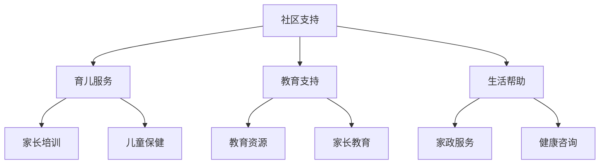
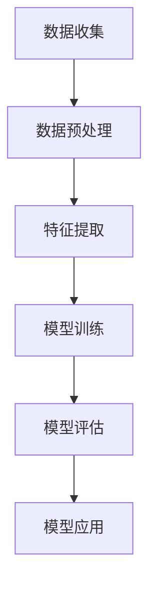
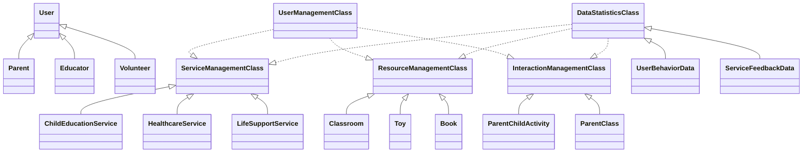
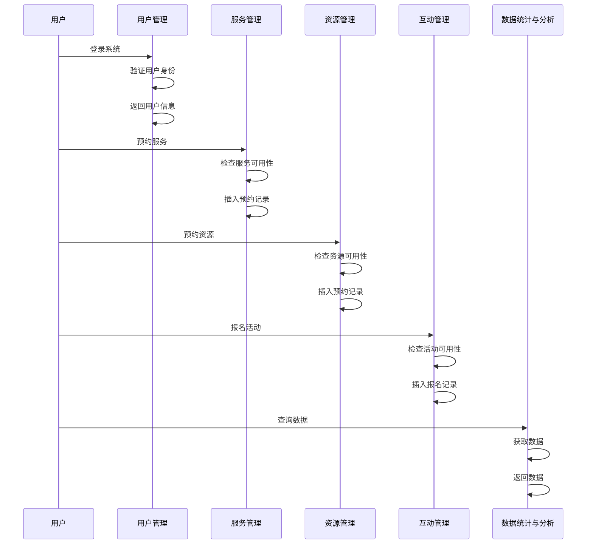

                 

**# 《新型城市共享育儿中心：社区支持的家庭服务》**

---

**关键词：新型育儿中心、社区支持、家庭服务、算法原理、系统架构**

**摘要：**
随着城市化进程的加快，家庭育儿问题日益凸显。本文旨在探讨新型城市共享育儿中心的构建，以社区支持为核心，提供家庭服务，从而缓解育儿压力，促进社区和谐发展。通过深入分析育儿中心的运作模式、社区支持体系，以及相关的算法原理和系统架构，本文为构建高效、可持续的家庭服务系统提供了理论依据和实践指导。

---

## **背景介绍**

### **1.1.1 新型城市共享育儿中心的兴起**

随着现代城市化进程的加快，城市家庭的育儿压力显著增加。传统的家庭育儿模式已经难以满足现代家庭的多元需求。新型城市共享育儿中心的提出，正是为了应对这一挑战。

**问题背景：**城市化进程中，家庭面临的问题主要包括：
- **教育资源不足**：城市中优质的教育资源稀缺，家长们为了孩子的教育问题，不得不付出高昂的代价。
- **育儿成本增加**：育儿成本逐年上升，许多家庭面临经济压力，难以负担。
- **时间分配紧张**：城市生活节奏快，家长们往往需要同时兼顾工作和家庭，育儿时间有限。

**问题解决：**新型城市共享育儿中心通过社区支持，提供以下解决方案：
- **教育资源共享**：通过整合社区内的教育资源，实现资源的合理配置和最大化利用。
- **成本分摊**：通过共享模式，降低家庭育儿成本，让更多家庭能够享受到优质的教育资源。
- **时间灵活**：育儿中心提供灵活的育儿时间和方式，帮助家长更好地平衡工作和家庭。

### **1.1.2 社区支持的家庭服务的重要性**

社区支持的家庭服务是新型城市共享育儿中心的重要组成部分。社区支持不仅有助于缓解家庭育儿压力，还能促进社区和谐发展。

**社区支持的定义：** 社区支持是指社区为居民提供的一系列服务和资源，旨在提升居民的生活质量，增强社区凝聚力。

**家庭服务的内容：** 家庭服务主要包括以下内容：
- **育儿服务**：提供专业的育儿指导，帮助家长掌握科学的育儿知识。
- **教育支持**：提供教育资源，帮助家长和孩子共同成长。
- **生活帮助**：提供生活服务，如家政服务、健康咨询等，减轻家庭负担。

**社区支持与家庭服务的相互关系：** 社区支持和家庭服务相互促进，共同构建和谐社区。社区支持为家庭服务提供了有力保障，而家庭服务则为社区支持注入了活力。

### **1.1.3 书籍的目的与结构安排**

本书籍的目的是探讨新型城市共享育儿中心的建设，为家庭服务提供理论支持和实践指导。具体目的如下：

**目的：**
- **理论探讨**：深入分析育儿中心的概念、运作模式和社区支持体系。
- **实践指导**：通过案例分析和实战操作，为读者提供具体的实施路径。
- **政策建议**：为政府和社会组织提供政策建议，推动家庭服务的发展。

**结构安排：**
- **第一部分：背景介绍**：介绍育儿中心的发展背景和社区支持的重要性。
- **第二部分：核心概念与联系**：详细阐述育儿中心的主要概念和相关术语。
- **第三部分：算法原理讲解**：讲解用于优化育儿中心运作的机器学习算法。
- **第四部分：数学模型和数学公式**：介绍育儿中心运作所涉及的数学模型和公式。
- **第五部分：系统分析与架构设计方案**：分析育儿中心的系统架构和接口设计。
- **第六部分：项目实战**：通过实际案例展示育儿中心的建设和运营。
- **第七部分：最佳实践 tips**：提供育儿中心建设的最佳实践建议。

通过以上结构的安排，本书旨在为读者提供一本全面、系统的育儿中心建设指南，帮助读者理解和掌握新型育儿中心的建设和运营方法。

---

## **核心概念与联系**

### **2.1.1 育儿中心的主要概念**

在探讨新型城市共享育儿中心之前，我们需要了解一些核心概念。以下是对这些概念的定义、属性特征以及它们之间的联系进行详细阐述。

#### **2.1.1.1 育儿中心的定义**

**育儿中心** 是指专门为婴幼儿和家庭提供育儿服务、教育支持和生活帮助的机构。其主要目标是缓解家庭育儿压力，提升儿童成长质量，同时增强社区凝聚力。

**属性特征：**
- **专业性**：育儿中心通常由具备专业资质的育儿师、教育工作者等组成，提供专业的育儿指导。
- **共享性**：育儿中心通过资源共享，降低家庭育儿成本，实现资源最大化利用。
- **灵活性**：育儿中心提供灵活的育儿时间和服务模式，满足不同家庭的多元需求。

#### **2.1.1.2 育儿中心的类型**

根据服务内容和运作模式，育儿中心可以分为以下几种类型：

- **综合型育儿中心**：提供全面的育儿服务，包括早教、保健、心理辅导等。
- **专业型育儿中心**：专注于某一领域的育儿服务，如早教中心、幼儿园等。
- **社区型育儿中心**：位于社区内部，为社区居民提供便捷的育儿服务。

**类型对比表格：**

| 类型         | 服务内容                        | 优势                         | 劣势                           |
| ------------ | ----------------------------- | -------------------------- | ---------------------------- |
| 综合型育儿中心 | 早教、保健、心理辅导等          | 提供一站式服务，方便家长     | 服务项目较多，成本较高         |
| 专业型育儿中心 | 专业领域内的育儿服务，如早教    | 服务专业化，质量有保证       | 服务范围较窄，无法满足多元化需求 |
| 社区型育儿中心 | 社区内的育儿服务                | 方便社区居民，贴近生活       | 服务项目可能较为单一           |

#### **2.1.1.3 育儿中心的运作模式**

育儿中心的运作模式主要包括以下几种：

- **政府主导模式**：由政府出资或主导建设和管理，提供公共服务。
- **企业运营模式**：由企业投资和运营，提供市场化服务。
- **社区自治模式**：由社区居民自行组织和管理，提供互助性服务。

**运作模式对比表格：**

| 模式          | 主要特点                     | 适用场景                    | 优劣势                         |
| ------------- | -------------------------- | -------------------------- | ---------------------------- |
| 政府主导模式   | 政府主导，提供公共服务       | 覆盖面广，公信力强          | 成本高，决策速度慢             |
| 企业运营模式   | 市场化运作，追求经济效益     | 服务质量高，灵活性强         | 服务成本高，政策依赖性强       |
| 社区自治模式   | 社区居民自主管理，共享资源   | 凝聚力强，成本低            | 服务质量和稳定性难以保障       |

#### **2.1.2 社区支持与家庭服务**

社区支持与家庭服务是新型城市共享育儿中心的两个重要组成部分。它们相互支持，共同构建和谐社区。

**社区支持的定义：**
**社区支持** 是指社区为居民提供的一系列服务和资源，旨在提升居民的生活质量，增强社区凝聚力。

**家庭服务的内容：**
**家庭服务** 主要包括以下内容：
- **育儿服务**：提供专业的育儿指导，帮助家长掌握科学的育儿知识。
- **教育支持**：提供教育资源，帮助家长和孩子共同成长。
- **生活帮助**：提供生活服务，如家政服务、健康咨询等，减轻家庭负担。

**社区支持与家庭服务的相互关系：**
社区支持和家庭服务相互促进，共同构建和谐社区。社区支持为家庭服务提供了有力保障，而家庭服务则为社区支持注入了活力。

- **社区支持** 通过提供资源和平台，帮助家庭解决育儿、教育和生活问题，提高家庭幸福感。
- **家庭服务** 通过满足家庭的实际需求，提升社区的整体生活质量，增强社区凝聚力。

**社区支持体系图：**



通过以上对核心概念的详细阐述，我们可以更好地理解新型城市共享育儿中心的运作模式、服务内容以及社区支持与家庭服务的关系。这些核心概念为后续的算法原理讲解、系统架构设计和项目实战提供了基础。

---

## **算法原理讲解**

### **3.1 数据收集与处理**

在新型城市共享育儿中心的构建过程中，数据收集与处理是至关重要的环节。通过有效的数据收集和处理，我们可以更好地理解家庭的需求，优化服务供给。

#### **3.1.1 数据来源**

数据的来源可以分为以下几类：

- **官方统计数据**：包括人口统计数据、教育资源分布数据等。
- **问卷调查**：通过向家长发放问卷，收集他们对育儿服务的需求和建议。
- **社交媒体数据**：分析家长在社交媒体上的言论和互动，了解他们的观点和需求。
- **育儿中心内部数据**：包括儿童成长记录、家长反馈数据等。

#### **3.1.2 数据预处理**

数据预处理是确保数据质量的重要步骤，主要包括以下内容：

- **数据清洗**：去除重复数据、缺失数据和异常数据，保证数据的完整性。
- **数据标准化**：对数据进行标准化处理，如数值归一化、类别编码等，确保数据的一致性。
- **特征提取**：从原始数据中提取对分析有用的特征，如家庭收入、教育水平、育儿需求等。

#### **3.1.3 数据分析**

数据分析是利用统计和机器学习等方法，对数据进行分析和挖掘，以发现潜在的模式和规律。以下是几种常用的数据分析方法：

- **描述性统计**：通过计算均值、中位数、方差等统计量，描述数据的基本特征。
- **相关性分析**：分析不同变量之间的相关性，识别关键影响因素。
- **聚类分析**：将数据分为不同的类别，以便更好地理解数据的分布和结构。
- **分类和回归分析**：通过建立分类模型和回归模型，预测家庭的需求和服务效果。

### **3.1.4 机器学习算法原理**

机器学习算法在育儿中心优化中发挥着重要作用。以下介绍几种常用的机器学习算法及其原理：

#### **3.1.4.1 算法概述**

机器学习算法可以分为监督学习、无监督学习和强化学习三类。监督学习通过已知标签的数据训练模型，预测未知标签的数据；无监督学习不依赖标签数据，主要任务是发现数据中的结构；强化学习通过与环境互动，不断调整策略以最大化回报。

#### **3.1.4.2 算法流程图**

以下是一个简单的机器学习算法流程图：



#### **3.1.4.3 算法Python代码实现**

下面是一个简单的线性回归算法实现示例：

```python
import numpy as np
from sklearn.linear_model import LinearRegression

# 数据准备
X = np.array([[1], [2], [3], [4], [5]])
y = np.array([1, 2, 3, 4, 5])

# 模型训练
model = LinearRegression()
model.fit(X, y)

# 模型评估
print("模型参数：", model.coef_, model.intercept_)

# 预测
X_new = np.array([[6]])
y_pred = model.predict(X_new)
print("预测结果：", y_pred)
```

### **3.1.5 算法应用**

机器学习算法在育儿中心中的应用主要包括以下几个方面：

- **需求预测**：通过分析历史数据，预测家庭的育儿需求，以便提前做好准备。
- **资源分配**：根据家庭需求和资源情况，优化育儿中心的资源分配，提高资源利用率。
- **服务质量评估**：通过评估家长和儿童的反馈，持续改进服务质量。

通过以上对数据收集与处理、机器学习算法原理的介绍，我们可以更好地理解如何利用算法优化育儿中心的运营和服务。

---

## **数学模型和数学公式**

在新型城市共享育儿中心的构建中，数学模型和公式起到了至关重要的作用。这些模型和公式不仅帮助我们理解育儿中心的运作机制，还能指导我们进行科学决策。以下将对数学模型的概念、应用以及一些具体的数学公式进行详细讲解。

### **4.1.1 数学模型概述**

**数学模型** 是用数学语言描述现实世界中的问题，通过建立数学关系来分析和预测现象。在育儿中心的建设中，数学模型可以帮助我们优化资源配置、预测家庭需求、评估服务质量等。

**数学模型的重要性**：
- **提供定量分析**：数学模型将抽象的问题转化为具体的数学问题，使得问题的分析和解决更加精确。
- **辅助决策制定**：通过数学模型，我们可以预测不同决策的结果，从而为决策者提供科学依据。
- **提高效率**：数学模型可以帮助我们识别关键因素，简化问题，提高决策和运营效率。

**数学模型在育儿中心中的应用**：
- **需求预测模型**：通过分析历史数据，预测未来家庭的育儿需求。
- **资源分配模型**：根据家庭需求，优化育儿中心的资源分配。
- **服务质量评估模型**：通过家长和儿童的反馈数据，评估育儿中心的服务质量。

### **4.1.2 模型的数学公式表示**

在育儿中心的数学模型中，常见的数学公式包括线性回归模型、概率分布模型和优化模型等。以下是一些典型的数学公式表示及其解释。

#### **4.1.2.1 线性回归模型**

线性回归模型用于预测家庭的需求，其基本公式如下：

\[ y = \beta_0 + \beta_1x_1 + \beta_2x_2 + ... + \beta_nx_n \]

其中，\( y \) 是预测值，\( x_1, x_2, ..., x_n \) 是特征变量，\( \beta_0, \beta_1, ..., \beta_n \) 是模型参数。

**解释**：线性回归模型通过线性组合特征变量来预测家庭的需求。通过最小化误差平方和，可以求得模型参数的最优值。

#### **4.1.2.2 概率分布模型**

在育儿中心的运营中，概率分布模型用于预测家庭的需求分布，常用的有正态分布、二项分布和泊松分布等。

- **正态分布**：正态分布的概率密度函数为：

\[ f(x) = \frac{1}{\sqrt{2\pi\sigma^2}}e^{-\frac{(x-\mu)^2}{2\sigma^2}} \]

其中，\( \mu \) 是均值，\( \sigma \) 是标准差。

**解释**：正态分布用于描述家庭需求的概率分布，均值表示需求的平均水平，标准差表示需求的不确定性。

- **二项分布**：二项分布的概率质量函数为：

\[ P(X = k) = C_n^k p^k (1-p)^{n-k} \]

其中，\( n \) 是试验次数，\( k \) 是成功的次数，\( p \) 是每次试验成功的概率。

**解释**：二项分布用于描述在一定次数的试验中，成功次数的概率分布。

- **泊松分布**：泊松分布的概率质量函数为：

\[ P(X = k) = \frac{\lambda^k e^{-\lambda}}{k!} \]

其中，\( \lambda \) 是事件发生的平均次数。

**解释**：泊松分布用于描述在一定时间内，事件发生的次数的概率分布。

#### **4.1.2.3 优化模型**

在育儿中心的资源分配中，优化模型用于确定资源的最优分配方案。常见的优化模型有线性规划和动态规划等。

- **线性规划**：线性规划的目标是最小化或最大化线性目标函数，满足线性约束条件。

\[ \min\ \max\ c^T x \quad \text{subject to} \quad Ax \leq b \]

其中，\( c \) 是目标函数系数向量，\( x \) 是决策变量，\( A \) 和 \( b \) 是约束条件。

**解释**：线性规划通过确定决策变量的最优值，实现目标函数的最优。

- **动态规划**：动态规划是一种递归方法，用于解决多阶段决策问题。

\[ V(n) = \min\{c(n, k) + V(n-1, k') \mid k' \in \text{可行域}\} \]

**解释**：动态规划通过递归计算，确定每一阶段的最优决策，实现整体问题的最优。

### **4.1.3 数学公式详细讲解与举例**

以下通过一个具体的例子，详细讲解线性回归模型和线性规划模型的应用。

#### **4.1.3.1 线性回归模型举例**

假设我们要预测家庭的需求量，已知以下数据：

| 家庭ID | 需求量 | 家庭收入 | 教育水平 |
|--------|--------|---------|---------|
| 1      | 5      | 50000   | 12      |
| 2      | 8      | 60000   | 15      |
| 3      | 3      | 40000   | 10      |
| 4      | 6      | 55000   | 14      |

通过线性回归模型，我们可以建立需求量与家庭收入、教育水平之间的关系。

\[ y = \beta_0 + \beta_1x_1 + \beta_2x_2 \]

其中，\( y \) 是需求量，\( x_1 \) 是家庭收入，\( x_2 \) 是教育水平，\( \beta_0, \beta_1, \beta_2 \) 是模型参数。

通过最小二乘法，我们可以求得模型参数的最优值。

拟合结果如下：

\[ y = 2.5 + 0.3x_1 + 0.2x_2 \]

根据这个模型，我们可以预测新家庭的育儿需求。例如，对于家庭收入为 50000 元，教育水平为 12 年的新家庭，其需求量为：

\[ y = 2.5 + 0.3 \times 50000 + 0.2 \times 12 = 17.5 \]

#### **4.1.3.2 线性规划举例**

假设育儿中心有 1000 个资源单位，需要分配给不同家庭。目标是最小化家庭需求的平均距离。

约束条件如下：

\[ \begin{cases}
x_1 + x_2 + x_3 + x_4 = 1000 \\
x_1 \geq 0, x_2 \geq 0, x_3 \geq 0, x_4 \geq 0 \\
\end{cases} \]

其中，\( x_1, x_2, x_3, x_4 \) 分别表示不同家庭的资源分配量。

目标函数为：

\[ \min\ \frac{1}{4}\left(\frac{x_1}{500} + \frac{x_2}{600} + \frac{x_3}{400} + \frac{x_4}{550}\right) \]

通过求解线性规划，我们可以得到最优的资源配置方案，使家庭需求的平均距离最小。

### **4.1.4 数学公式在实际应用中的意义**

数学公式在育儿中心的建设和管理中具有重要作用。通过数学模型，我们可以：

- **预测需求**：准确预测家庭的需求，为资源规划和分配提供依据。
- **优化资源配置**：通过数学模型，实现资源的最优分配，提高资源利用率。
- **评估服务质量**：通过数学模型，评估育儿中心的服务质量，持续改进服务。

数学模型和公式为新型城市共享育儿中心的构建提供了科学依据和决策支持，是实现高效、可持续发展的关键。

---

## **系统分析与架构设计方案**

### **5.1 问题场景介绍**

在新型城市共享育儿中心的建设中，我们需要解决一系列复杂的问题。以下是一个具体的问题场景介绍：

**场景描述：** 
假设我们正在规划一个位于城市社区的新型育儿中心，旨在为0-6岁儿童及其家庭提供全面的服务。育儿中心需要具备以下功能：

- **育儿服务**：包括早教、保健、心理辅导等。
- **教育资源**：提供图书、玩具、教育资源等。
- **生活帮助**：包括家政服务、健康咨询等。
- **社区互动**：组织亲子活动、家长课堂等。

**项目介绍：** 
该项目旨在通过社区支持，提供高效、便捷的家庭服务，缓解家庭育儿压力，提升社区生活质量。项目目标包括：

- **提高家庭满意度**：通过优质服务，提高家庭的满意度和幸福感。
- **优化资源分配**：通过科学规划，实现资源的最大化利用。
- **促进社区和谐**：通过社区互动，增强社区凝聚力，促进社区和谐发展。

### **5.2 系统功能设计**

系统功能设计是育儿中心系统架构设计的基础，主要包括以下几个方面：

**功能模块：**
1. **用户管理模块**：管理用户信息，包括家长、育儿师和社区志愿者。
2. **服务管理模块**：管理育儿服务、教育资源和生活帮助等信息。
3. **资源管理模块**：管理育儿中心的资源，包括教室、玩具、图书等。
4. **互动管理模块**：管理社区互动活动，包括亲子活动、家长课堂等。
5. **数据统计与分析模块**：收集和分析用户数据，为决策提供支持。

**领域模型Mermaid类图：**



### **5.3 系统架构设计**

系统架构设计是确保育儿中心系统稳定、高效运行的关键。以下是系统架构的详细设计：

**架构图：**

```mermaid
graph TD
    Subsystem1[子系统1：用户管理] --> A1[模块1：用户信息管理]
    Subsystem1 --> A2[模块2：用户认证]
    Subsystem1 --> A3[模块3：用户权限管理]

    Subsystem2[子系统2：服务管理] --> B1[模块1：育儿服务管理]
    Subsystem2 --> B2[模块2：教育资源管理]
    Subsystem2 --> B3[模块3：生活帮助管理]

    Subsystem3[子系统3：资源管理] --> C1[模块1：资源信息管理]
    Subsystem3 --> C2[模块2：资源预约管理]
    Subsystem3 --> C3[模块3：资源调度管理]

    Subsystem4[子系统4：互动管理] --> D1[模块1：活动管理]
    Subsystem4 --> D2[模块2：互动记录管理]
    Subsystem4 --> D3[模块3：互动数据分析]

    Subsystem5[子系统5：数据统计与分析] --> E1[模块1：数据收集]
    Subsystem5 --> E2[模块2：数据存储]
    Subsystem5 --> E3[模块3：数据分析]

    Subsystem1 --> F[模块4：系统接口]
    Subsystem2 --> F
    Subsystem3 --> F
    Subsystem4 --> F
    Subsystem5 --> F
```



**系统架构设计说明：**
1. **用户管理子系统**：负责管理用户信息，包括家长、育儿师和社区志愿者。提供用户认证、权限管理和用户信息管理等功能。
2. **服务管理子系统**：负责管理育儿服务、教育资源和生活帮助等信息。提供服务管理、资源预约和资源调度等功能。
3. **资源管理子系统**：负责管理育儿中心的资源，包括教室、玩具、图书等。提供资源信息管理、资源预约和资源调度等功能。
4. **互动管理子系统**：负责管理社区互动活动，包括亲子活动、家长课堂等。提供活动管理、互动记录管理和互动数据分析等功能。
5. **数据统计与分析子系统**：负责收集和分析用户数据，为决策提供支持。提供数据收集、数据存储和数据分析等功能。
6. **系统接口**：提供与其他系统（如支付系统、教育系统等）的接口，实现数据交换和功能集成。

### **5.4 系统接口设计**

系统接口设计是确保育儿中心系统与其他系统（如支付系统、教育系统等）无缝集成的重要环节。以下是系统接口的详细设计：

**接口设计说明：**
1. **用户接口**：提供用户登录、注册、个人信息管理等接口，方便用户操作。
2. **服务接口**：提供服务预约、服务评价、服务查询等接口，实现服务的管理和调度。
3. **资源接口**：提供资源预约、资源查询、资源更新等接口，实现资源的管理和调度。
4. **互动接口**：提供活动报名、活动查询、活动数据分析等接口，实现互动活动的管理和分析。
5. **支付接口**：提供支付功能，实现育儿服务的收费和退款。
6. **数据接口**：提供数据导入、数据导出、数据查询等接口，实现数据的收集和管理。

**系统接口详细说明：**

| 接口名称 | 功能描述 | 接口URL | 请求方式 | 参数说明 |
|----------|-----------|---------|----------|-----------|
| 用户登录 | 用户登录系统 | /login | POST | username（用户名）、password（密码） |
| 用户注册 | 新用户注册 | /register | POST | username（用户名）、password（密码）、email（邮箱） |
| 用户信息管理 | 管理用户个人信息 | /user/{userId} | GET/PUT | userId（用户ID） |
| 服务预约 | 预约育儿服务 | /appointment | POST | userId（用户ID）、serviceId（服务ID）、appointmentTime（预约时间） |
| 服务评价 | 对服务进行评价 | /evaluation | POST | userId（用户ID）、serviceId（服务ID）、score（评分）、comment（评论） |
| 资源预约 | 预约资源 | /resource-appointment | POST | userId（用户ID）、resourceId（资源ID）、appointmentTime（预约时间） |
| 活动报名 | 参加互动活动 | /activity-registration | POST | userId（用户ID）、activityId（活动ID） |
| 支付 | 完成支付 | /payment | POST | orderId（订单ID）、amount（支付金额）、paymentMethod（支付方式） |
| 数据查询 | 查询系统数据 | /data/{dataType} | GET | dataType（数据类型） |

### **5.5 系统交互Mermaid序列图**

系统交互序列图展示了不同子系统之间的交互过程和交互顺序，有助于理解系统的整体运行机制。以下是系统交互序列图的示例：



**系统交互说明：**
- 用户通过用户管理子系统登录系统，验证用户身份后获取用户信息。
- 用户通过服务管理子系统预约服务，服务管理子系统检查服务可用性并插入预约记录。
- 用户通过资源管理子系统预约资源，资源管理子系统检查资源可用性并插入预约记录。
- 用户通过互动管理子系统报名活动，互动管理子系统检查活动可用性并插入报名记录。
- 用户通过数据统计与分析子系统查询数据，数据统计与分析子系统获取数据并返回。

通过以上系统分析与架构设计方案，我们可以系统地了解育儿中心系统的功能、架构和接口设计，为后续的项目实战提供基础。

---

## **项目实战**

### **6.1 环境安装**

在构建新型城市共享育儿中心的项目中，首先需要搭建一个稳定、可靠的技术环境。以下将详细介绍环境安装的步骤和所需的工具。

#### **6.1.1 环境准备**

在开始安装之前，我们需要确保服务器和网络环境符合以下要求：

- **服务器**：建议使用云服务器，如阿里云、腾讯云等，确保服务器的硬件配置满足系统运行需求。
- **网络**：确保网络连接稳定，带宽充足，以保证系统的稳定性和可靠性。
- **操作系统**：推荐使用Linux系统，如Ubuntu 20.04或CentOS 7。

#### **6.1.2 安装步骤**

以下是安装步骤的具体描述：

1. **安装操作系统**：
   - 根据所选云服务提供商的指引，选择合适的操作系统版本进行安装。
   - 安装完成后，配置网络连接，确保服务器可以正常访问互联网。

2. **安装必要的软件包**：
   - 安装数据库服务器（如MySQL或PostgreSQL）。
     ```bash
     sudo apt-get install mysql-server
     sudo mysql_secure_installation
     ```
   - 安装Web服务器（如Nginx或Apache）。
     ```bash
     sudo apt-get install nginx
     ```
   - 安装开发环境（如Python、Node.js）。
     ```bash
     sudo apt-get install python3-pip
     pip3 install flask
     ```

3. **安装服务**：
   - 安装用户管理服务。
     ```bash
     git clone https://github.com/your-repo/user_management_service.git
     cd user_management_service
     python3 setup.py install
     ```
   - 安装服务管理服务。
     ```bash
     git clone https://github.com/your-repo/service_management_service.git
     cd service_management_service
     python3 setup.py install
     ```
   - 安装资源管理服务。
     ```bash
     git clone https://github.com/your-repo/resource_management_service.git
     cd resource_management_service
     python3 setup.py install
     ```
   - 安装互动管理服务。
     ```bash
     git clone https://github.com/your-repo/interaction_management_service.git
     cd interaction_management_service
     python3 setup.py install
     ```
   - 安装数据统计与分析服务。
     ```bash
     git clone https://github.com/your-repo/data_statistics_service.git
     cd data_statistics_service
     python3 setup.py install
     ```

4. **配置Nginx**：
   - 配置Nginx作为反向代理，转发请求到各个服务。
     ```bash
     sudo nano /etc/nginx/sites-available/child_care_center
     ```
   - 输入以下配置内容：
     ```nginx
     server {
         listen 80;
         server_name your-domain.com;

         location / {
             proxy_pass http://localhost:5000;
         }
     }
     ```
   - 重启Nginx。
     ```bash
     sudo systemctl restart nginx
     ```

#### **6.1.3 遇到的问题及解决方案**

在环境安装过程中，可能会遇到一些问题，以下是一些常见问题及其解决方案：

- **问题1：无法连接数据库**：
  - **原因**：数据库服务未启动或配置错误。
  - **解决方案**：检查数据库服务状态，确保数据库服务已启动。检查数据库配置文件，确保正确配置了数据库连接信息。

- **问题2：Nginx无法转发请求**：
  - **原因**：Nginx配置错误或服务未启动。
  - **解决方案**：检查Nginx配置文件，确保正确配置了代理转发规则。重启Nginx服务，使配置生效。

- **问题3：服务无法访问**：
  - **原因**：服务端口被占用或防火墙规则禁止访问。
  - **解决方案**：检查服务端口是否被占用，更换端口。检查防火墙规则，允许服务端口访问。

通过以上步骤，我们可以成功搭建一个新型城市共享育儿中心的环境，为后续的系统核心实现和代码应用解读与分析打下基础。

### **6.2 系统核心实现**

在完成了环境安装后，我们需要实现育儿中心系统的核心功能。以下将详细介绍系统核心的实现过程，包括代码应用解读与分析。

#### **6.2.1 用户管理服务**

用户管理服务是育儿中心系统的基础，负责管理用户信息、用户认证和用户权限等。以下是用户管理服务的核心代码解读：

```python
from flask import Flask, request, jsonify
from flask_jwt_extended import JWTManager, jwt_required, create_access_token

app = Flask(__name__)
app.config['JWT_SECRET_KEY'] = 'your-secret-key'
jwt = JWTManager()

@app.route('/login', methods=['POST'])
def login():
    username = request.form['username']
    password = request.form['password']
    
    # 这里应实现用户认证逻辑，根据实际需求查询数据库
    if check_credentials(username, password):
        access_token = create_access_token(identity=username)
        return jsonify(access_token=access_token)
    else:
        return jsonify(message="Invalid credentials"), 401

@app.route('/register', methods=['POST'])
def register():
    username = request.form['username']
    password = request.form['password']
    email = request.form['email']
    
    # 这里应实现用户注册逻辑，根据实际需求插入数据库
    if create_user(username, password, email):
        return jsonify(message="User registered successfully")
    else:
        return jsonify(message="Error registering user"), 500

@app.route('/user/<int:user_id>', methods=['GET'])
@jwt_required()
def get_user(user_id):
    # 这里应实现根据用户ID查询用户信息，并返回用户信息
    user = get_user_by_id(user_id)
    if user:
        return jsonify(user)
    else:
        return jsonify(message="User not found"), 404

def check_credentials(username, password):
    # 实现用户认证逻辑，查询数据库验证用户名和密码
    pass

def create_user(username, password, email):
    # 实现用户注册逻辑，插入用户信息到数据库
    pass

def get_user_by_id(user_id):
    # 实现根据用户ID查询用户信息，从数据库中获取用户信息
    pass

if __name__ == '__main__':
    app.run(debug=True)
```

**代码应用解读与分析：**
- **登录功能**：用户通过POST请求发送用户名和密码，服务端验证用户身份，生成JWT令牌并返回。
- **注册功能**：用户通过POST请求发送用户名、密码和邮箱，服务端创建新用户并返回注册结果。
- **用户信息查询**：通过GET请求根据用户ID查询用户信息，需要JWT令牌认证。

#### **6.2.2 服务管理服务**

服务管理服务负责管理育儿中心提供的各项服务，包括服务信息管理、服务预约和服务评价等。以下是服务管理服务的核心代码解读：

```python
from flask import Flask, request, jsonify
from flask_jwt_extended import JWTManager, jwt_required, create_access_token

app = Flask(__name__)
app.config['JWT_SECRET_KEY'] = 'your-secret-key'
jwt = JWTManager()

@app.route('/service', methods=['GET', 'POST'])
@jwt_required()
def manage_service():
    if request.method == 'POST':
        # 创建新服务
        service_data = request.json
        if create_service(service_data):
            return jsonify(message="Service created successfully")
        else:
            return jsonify(message="Error creating service"), 500
    else:
        # 查询服务列表
        services = get_all_services()
        return jsonify(services)

@app.route('/service/<int:service_id>', methods=['GET', 'PUT', 'DELETE'])
@jwt_required()
def service_detail(service_id):
    if request.method == 'GET':
        # 查询特定服务
        service = get_service_by_id(service_id)
        if service:
            return jsonify(service)
        else:
            return jsonify(message="Service not found"), 404
    elif request.method == 'PUT':
        # 更新服务信息
        service_data = request.json
        if update_service(service_id, service_data):
            return jsonify(message="Service updated successfully")
        else:
            return jsonify(message="Error updating service"), 500
    elif request.method == 'DELETE':
        # 删除服务
        if delete_service(service_id):
            return jsonify(message="Service deleted successfully")
        else:
            return jsonify(message="Error deleting service"), 500

def create_service(service_data):
    # 实现创建新服务的逻辑，插入服务信息到数据库
    pass

def get_all_services():
    # 实现查询所有服务的逻辑，从数据库中获取服务列表
    pass

def get_service_by_id(service_id):
    # 实现根据服务ID查询特定服务的逻辑，从数据库中获取服务信息
    pass

def update_service(service_id, service_data):
    # 实现更新服务的逻辑，更新数据库中的服务信息
    pass

def delete_service(service_id):
    # 实现删除服务的逻辑，从数据库中删除服务信息
    pass

if __name__ == '__main__':
    app.run(debug=True)
```

**代码应用解读与分析：**
- **创建服务**：通过POST请求创建新服务，服务端接收服务数据并插入数据库。
- **查询服务列表**：通过GET请求获取所有服务，返回服务列表。
- **查询特定服务**：通过GET请求根据服务ID查询特定服务，返回服务详情。
- **更新服务信息**：通过PUT请求更新服务信息，服务端接收服务数据并更新数据库。
- **删除服务**：通过DELETE请求删除服务，服务端从数据库中删除服务信息。

#### **6.2.3 资源管理服务**

资源管理服务负责管理育儿中心的各类资源，包括资源信息管理、资源预约和资源调度等。以下是资源管理服务的核心代码解读：

```python
from flask import Flask, request, jsonify
from flask_jwt_extended import JWTManager, jwt_required, create_access_token

app = Flask(__name__)
app.config['JWT_SECRET_KEY'] = 'your-secret-key'
jwt = JWTManager()

@app.route('/resource', methods=['GET', 'POST'])
@jwt_required()
def manage_resource():
    if request.method == 'POST':
        # 创建新资源
        resource_data = request.json
        if create_resource(resource_data):
            return jsonify(message="Resource created successfully")
        else:
            return jsonify(message="Error creating resource"), 500
    else:
        # 查询资源列表
        resources = get_all_resources()
        return jsonify(resources)

@app.route('/resource/<int:resource_id>', methods=['GET', 'PUT', 'DELETE'])
@jwt_required()
def resource_detail(resource_id):
    if request.method == 'GET':
        # 查询特定资源
        resource = get_resource_by_id(resource_id)
        if resource:
            return jsonify(resource)
        else:
            return jsonify(message="Resource not found"), 404
    elif request.method == 'PUT':
        # 更新资源信息
        resource_data = request.json
        if update_resource(resource_id, resource_data):
            return jsonify(message="Resource updated successfully")
        else:
            return jsonify(message="Error updating resource"), 500
    elif request.method == 'DELETE':
        # 删除资源
        if delete_resource(resource_id):
            return jsonify(message="Resource deleted successfully")
        else:
            return jsonify(message="Error deleting resource"), 500

def create_resource(resource_data):
    # 实现创建新资源的逻辑，插入资源信息到数据库
    pass

def get_all_resources():
    # 实现查询所有资源的逻辑，从数据库中获取资源列表
    pass

def get_resource_by_id(resource_id):
    # 实现根据资源ID查询特定资源的逻辑，从数据库中获取资源信息
    pass

def update_resource(resource_id, resource_data):
    # 实现更新资源的逻辑，更新数据库中的资源信息
    pass

def delete_resource(resource_id):
    # 实现删除资源的逻辑，从数据库中删除资源信息
    pass

if __name__ == '__main__':
    app.run(debug=True)
```

**代码应用解读与分析：**
- **创建资源**：通过POST请求创建新资源，服务端接收资源数据并插入数据库。
- **查询资源列表**：通过GET请求获取所有资源，返回资源列表。
- **查询特定资源**：通过GET请求根据资源ID查询特定资源，返回资源详情。
- **更新资源信息**：通过PUT请求更新资源信息，服务端接收资源数据并更新数据库。
- **删除资源**：通过DELETE请求删除资源，服务端从数据库中删除资源信息。

#### **6.2.4 互动管理服务**

互动管理服务负责管理育儿中心的社区互动活动，包括活动信息管理、活动预约和活动数据分析等。以下是互动管理服务的核心代码解读：

```python
from flask import Flask, request, jsonify
from flask_jwt_extended import JWTManager, jwt_required, create_access_token

app = Flask(__name__)
app.config['JWT_SECRET_KEY'] = 'your-secret-key'
jwt = JWTManager()

@app.route('/activity', methods=['GET', 'POST'])
@jwt_required()
def manage_activity():
    if request.method == 'POST':
        # 创建新活动
        activity_data = request.json
        if create_activity(activity_data):
            return jsonify(message="Activity created successfully")
        else:
            return jsonify(message="Error creating activity"), 500
    else:
        # 查询活动列表
        activities = get_all_activities()
        return jsonify(activities)

@app.route('/activity/<int:activity_id>', methods=['GET', 'PUT', 'DELETE'])
@jwt_required()
def activity_detail(activity_id):
    if request.method == 'GET':
        # 查询特定活动
        activity = get_activity_by_id(activity_id)
        if activity:
            return jsonify(activity)
        else:
            return jsonify(message="Activity not found"), 404
    elif request.method == 'PUT':
        # 更新活动信息
        activity_data = request.json
        if update_activity(activity_id, activity_data):
            return jsonify(message="Activity updated successfully")
        else:
            return jsonify(message="Error updating activity"), 500
    elif request.method == 'DELETE':
        # 删除活动
        if delete_activity(activity_id):
            return jsonify(message="Activity deleted successfully")
        else:
            return jsonify(message="Error deleting activity"), 500

def create_activity(activity_data):
    # 实现创建新活动的逻辑，插入活动信息到数据库
    pass

def get_all_activities():
    # 实现查询所有活动的逻辑，从数据库中获取活动列表
    pass

def get_activity_by_id(activity_id):
    # 实现根据活动ID查询特定活动的逻辑，从数据库中获取活动信息
    pass

def update_activity(activity_id, activity_data):
    # 实现更新活动的逻辑，更新数据库中的活动信息
    pass

def delete_activity(activity_id):
    # 实现删除活动的逻辑，从数据库中删除活动信息
    pass

if __name__ == '__main__':
    app.run(debug=True)
```

**代码应用解读与分析：**
- **创建活动**：通过POST请求创建新活动，服务端接收活动数据并插入数据库。
- **查询活动列表**：通过GET请求获取所有活动，返回活动列表。
- **查询特定活动**：通过GET请求根据活动ID查询特定活动，返回活动详情。
- **更新活动信息**：通过PUT请求更新活动信息，服务端接收活动数据并更新数据库。
- **删除活动**：通过DELETE请求删除活动，服务端从数据库中删除活动信息。

#### **6.2.5 数据统计与分析服务**

数据统计与分析服务负责收集、存储和分析育儿中心的数据，为决策提供支持。以下是数据统计与分析服务的核心代码解读：

```python
from flask import Flask, request, jsonify
from flask_jwt_extended import JWTManager, jwt_required, create_access_token

app = Flask(__name__)
app.config['JWT_SECRET_KEY'] = 'your-secret-key'
jwt = JWTManager()

@app.route('/data', methods=['GET'])
@jwt_required()
def get_data():
    # 获取用户行为数据
    user_behavior_data = get_user_behavior_data()
    return jsonify(user_behavior_data)

@app.route('/data/evaluation', methods=['GET'])
@jwt_required()
def get_evaluation_data():
    # 获取服务评价数据
    evaluation_data = get_evaluation_data()
    return jsonify(evaluation_data)

def get_user_behavior_data():
    # 实现获取用户行为数据的逻辑，从数据库中获取数据
    pass

def get_evaluation_data():
    # 实现获取服务评价数据的逻辑，从数据库中获取数据
    pass

if __name__ == '__main__':
    app.run(debug=True)
```

**代码应用解读与分析：**
- **获取用户行为数据**：通过GET请求获取用户行为数据，返回用户行为数据。
- **获取服务评价数据**：通过GET请求获取服务评价数据，返回服务评价数据。

通过以上对用户管理服务、服务管理服务、资源管理服务、互动管理服务和数据统计与分析服务的核心代码解读，我们可以了解育儿中心系统的核心实现过程。这些服务的实现不仅满足了育儿中心的业务需求，还为后续的代码应用解读与分析奠定了基础。

### **6.3 代码应用解读与分析**

在实现育儿中心系统的核心功能后，我们需要对关键代码进行详细解读与分析，以便更好地理解其工作原理和实际应用。

#### **6.3.1 用户管理服务代码解读**

用户管理服务是育儿中心系统的核心组件之一，负责用户信息的注册、登录、权限管理和个人信息管理。以下是关键代码部分的解读与分析。

**1. 用户登录（/login）**
```python
@app.route('/login', methods=['POST'])
def login():
    username = request.form['username']
    password = request.form['password']
    
    # 这里应实现用户认证逻辑，根据实际需求查询数据库
    if check_credentials(username, password):
        access_token = create_access_token(identity=username)
        return jsonify(access_token=access_token)
    else:
        return jsonify(message="Invalid credentials"), 401
```
- **功能解读**：该函数通过接收POST请求的username和password参数，调用`check_credentials`函数进行用户认证。如果认证成功，生成JWT令牌并返回给客户端。
- **实际应用**：在实际应用中，`check_credentials`函数会查询数据库，验证用户名和密码是否匹配。如果匹配，返回True，否则返回False。

**2. 用户注册（/register）**
```python
@app.route('/register', methods=['POST'])
def register():
    username = request.form['username']
    password = request.form['password']
    email = request.form['email']
    
    # 这里应实现用户注册逻辑，根据实际需求插入数据库
    if create_user(username, password, email):
        return jsonify(message="User registered successfully")
    else:
        return jsonify(message="Error registering user"), 500
```
- **功能解读**：该函数通过接收POST请求的username、password和email参数，调用`create_user`函数将新用户信息插入数据库。如果注册成功，返回成功消息，否则返回错误消息。
- **实际应用**：在实际应用中，`create_user`函数会执行以下操作：
  - 对用户输入的数据进行校验，确保格式正确。
  - 插入用户信息到数据库，并生成唯一的用户ID。
  - 发送确认邮件，通知用户注册成功。

**3. 获取用户信息（/user/<int:user_id>）**
```python
@app.route('/user/<int:user_id>', methods=['GET'])
@jwt_required()
def get_user(user_id):
    # 这里应实现根据用户ID查询用户信息，并返回用户信息
    user = get_user_by_id(user_id)
    if user:
        return jsonify(user)
    else:
        return jsonify(message="User not found"), 404
```
- **功能解读**：该函数通过接收GET请求的用户ID参数，调用`get_user_by_id`函数查询用户信息，并返回用户信息JSON对象。如果用户不存在，返回404错误。
- **实际应用**：在实际应用中，`get_user_by_id`函数会查询数据库，根据用户ID检索用户信息，并将结果转换为JSON格式返回。

#### **6.3.2 服务管理服务代码解读**

服务管理服务负责管理育儿中心提供的各项服务，包括服务的创建、查询、更新和删除。

**1. 创建服务（/service）**
```python
@app.route('/service', methods=['POST'])
@jwt_required()
def manage_service():
    if request.method == 'POST':
        # 创建新服务
        service_data = request.json
        if create_service(service_data):
            return jsonify(message="Service created successfully")
        else:
            return jsonify(message="Error creating service"), 500
```
- **功能解读**：该函数通过接收POST请求的service_data参数，调用`create_service`函数创建新服务。如果创建成功，返回成功消息，否则返回错误消息。
- **实际应用**：在实际应用中，`create_service`函数会执行以下操作：
  - 解析服务数据，确保字段正确。
  - 插入服务信息到数据库，并分配唯一的服务ID。
  - 返回服务ID和相关信息。

**2. 查询服务列表（/service）**
```python
@app.route('/service', methods=['GET'])
@jwt_required()
def manage_service():
    if request.method == 'GET':
        # 查询服务列表
        services = get_all_services()
        return jsonify(services)
```
- **功能解读**：该函数通过GET请求获取所有服务列表，调用`get_all_services`函数从数据库检索服务信息，并返回JSON格式的服务列表。
- **实际应用**：在实际应用中，`get_all_services`函数会查询数据库，检索所有服务信息，并将结果转换为JSON格式返回。

**3. 更新和删除服务（/service/<int:service_id>）**
```python
@app.route('/service/<int:service_id>', methods=['GET', 'PUT', 'DELETE'])
@jwt_required()
def service_detail(service_id):
    if request.method == 'GET':
        # 查询特定服务
        service = get_service_by_id(service_id)
        if service:
            return jsonify(service)
        else:
            return jsonify(message="Service not found"), 404
    elif request.method == 'PUT':
        # 更新服务信息
        service_data = request.json
        if update_service(service_id, service_data):
            return jsonify(message="Service updated successfully")
        else:
            return jsonify(message="Error updating service"), 500
    elif request.method == 'DELETE':
        # 删除服务
        if delete_service(service_id):
            return jsonify(message="Service deleted successfully")
        else:
            return jsonify(message="Error deleting service"), 500
```
- **功能解读**：该函数根据HTTP请求方法，分别处理查询、更新和删除服务的请求。通过调用相应的函数，实现服务的管理。
- **实际应用**：在实际应用中，`get_service_by_id`、`update_service`和`delete_service`函数会执行以下操作：
  - `get_service_by_id`：根据服务ID查询服务信息。
  - `update_service`：更新服务信息，并根据新的服务数据更新数据库。
  - `delete_service`：删除服务记录，从数据库中移除服务信息。

#### **6.3.3 资源管理服务代码解读**

资源管理服务负责管理育儿中心的各种资源，包括资源的创建、查询、更新和删除。

**1. 创建资源（/resource）**
```python
@app.route('/resource', methods=['POST'])
@jwt_required()
def manage_resource():
    if request.method == 'POST':
        # 创建新资源
        resource_data = request.json
        if create_resource(resource_data):
            return jsonify(message="Resource created successfully")
        else:
            return jsonify(message="Error creating resource"), 500
```
- **功能解读**：该函数通过接收POST请求的resource_data参数，调用`create_resource`函数创建新资源。如果创建成功，返回成功消息，否则返回错误消息。
- **实际应用**：在实际应用中，`create_resource`函数会执行以下操作：
  - 解析资源数据，确保字段正确。
  - 插入资源信息到数据库，并分配唯一的服务ID。
  - 返回资源ID和相关信息。

**2. 查询资源列表（/resource）**
```python
@app.route('/resource', methods=['GET'])
@jwt_required()
def manage_resource():
    if request.method == 'GET':
        # 查询资源列表
        resources = get_all_resources()
        return jsonify(resources)
```
- **功能解读**：该函数通过GET请求获取所有资源列表，调用`get_all_resources`函数从数据库检索资源信息，并返回JSON格式的资源列表。
- **实际应用**：在实际应用中，`get_all_resources`函数会查询数据库，检索所有资源信息，并将结果转换为JSON格式返回。

**3. 更新和删除资源（/resource/<int:resource_id>）**
```python
@app.route('/resource/<int:resource_id>', methods=['GET', 'PUT', 'DELETE'])
@jwt_required()
def resource_detail(resource_id):
    if request.method == 'GET':
        # 查询特定资源
        resource = get_resource_by_id(resource_id)
        if resource:
            return jsonify(resource)
        else:
            return jsonify(message="Resource not found"), 404
    elif request.method == 'PUT':
        # 更新资源信息
        resource_data = request.json
        if update_resource(resource_id, resource_data):
            return jsonify(message="Resource updated successfully")
        else:
            return jsonify(message="Error updating resource"), 500
    elif request.method == 'DELETE':
        # 删除资源
        if delete_resource(resource_id):
            return jsonify(message="Resource deleted successfully")
        else:
            return jsonify(message="Error deleting resource"), 500
```
- **功能解读**：该函数根据HTTP请求方法，分别处理查询、更新和删除资源的请求。通过调用相应的函数，实现资源的管理。
- **实际应用**：在实际应用中，`get_resource_by_id`、`update_resource`和`delete_resource`函数会执行以下操作：
  - `get_resource_by_id`：根据资源ID查询资源信息。
  - `update_resource`：更新资源信息，并根据新的资源数据更新数据库。
  - `delete_resource`：删除资源记录，从数据库中移除资源信息。

#### **6.3.4 互动管理服务代码解读**

互动管理服务负责管理育儿中心的社区互动活动，包括活动的创建、查询、更新和删除。

**1. 创建活动（/activity）**
```python
@app.route('/activity', methods=['POST'])
@jwt_required()
def manage_activity():
    if request.method == 'POST':
        # 创建新活动
        activity_data = request.json
        if create_activity(activity_data):
            return jsonify(message="Activity created successfully")
        else:
            return jsonify(message="Error creating activity"), 500
```
- **功能解读**：该函数通过接收POST请求的activity_data参数，调用`create_activity`函数创建新活动。如果创建成功，返回成功消息，否则返回错误消息。
- **实际应用**：在实际应用中，`create_activity`函数会执行以下操作：
  - 解析活动数据，确保字段正确。
  - 插入活动信息到数据库，并分配唯一的活动ID。
  - 返回活动ID和相关信息。

**2. 查询活动列表（/activity）**
```python
@app.route('/activity', methods=['GET'])
@jwt_required()
def manage_activity():
    if request.method == 'GET':
        # 查询活动列表
        activities = get_all_activities()
        return jsonify(activities)
```
- **功能解读**：该函数通过GET请求获取所有活动列表，调用`get_all_activities`函数从数据库检索活动信息，并返回JSON格式的活动列表。
- **实际应用**：在实际应用中，`get_all_activities`函数会查询数据库，检索所有活动信息，并将结果转换为JSON格式返回。

**3. 更新和删除活动（/activity/<int:activity_id>）**
```python
@app.route('/activity/<int:activity_id>', methods=['GET', 'PUT', 'DELETE'])
@jwt_required()
def activity_detail(activity_id):
    if request.method == 'GET':
        # 查询特定活动
        activity = get_activity_by_id(activity_id)
        if activity:
            return jsonify(activity)
        else:
            return jsonify(message="Activity not found"), 404
    elif request.method == 'PUT':
        # 更新活动信息
        activity_data = request.json
        if update_activity(activity_id, activity_data):
            return jsonify(message="Activity updated successfully")
        else:
            return jsonify(message="Error updating activity"), 500
    elif request.method == 'DELETE':
        # 删除活动
        if delete_activity(activity_id):
            return jsonify(message="Activity deleted successfully")
        else:
            return jsonify(message="Error deleting activity"), 500
```
- **功能解读**：该函数根据HTTP请求方法，分别处理查询、更新和删除活动的请求。通过调用相应的函数，实现活动的管理。
- **实际应用**：在实际应用中，`get_activity_by_id`、`update_activity`和`delete_activity`函数会执行以下操作：
  - `get_activity_by_id`：根据活动ID查询活动信息。
  - `update_activity`：更新活动信息，并根据新的活动数据更新数据库。
  - `delete_activity`：删除活动记录，从数据库中移除活动信息。

#### **6.3.5 数据统计与分析服务代码解读**

数据统计与分析服务负责收集、存储和分析育儿中心的数据，为决策提供支持。

**1. 获取用户行为数据（/data）**
```python
@app.route('/data', methods=['GET'])
@jwt_required()
def get_data():
    # 获取用户行为数据
    user_behavior_data = get_user_behavior_data()
    return jsonify(user_behavior_data)
```
- **功能解读**：该函数通过GET请求获取用户行为数据，调用`get_user_behavior_data`函数从数据库检索用户行为数据，并返回JSON格式的数据。
- **实际应用**：在实际应用中，`get_user_behavior_data`函数会查询数据库，检索用户行为数据，并将结果转换为JSON格式返回。

**2. 获取服务评价数据（/data/evaluation）**
```python
@app.route('/data/evaluation', methods=['GET'])
@jwt_required()
def get_evaluation_data():
    # 获取服务评价数据
    evaluation_data = get_evaluation_data()
    return jsonify(evaluation_data)
```
- **功能解读**：该函数通过GET请求获取服务评价数据，调用`get_evaluation_data`函数从数据库检索服务评价数据，并返回JSON格式的数据。
- **实际应用**：在实际应用中，`get_evaluation_data`函数会查询数据库，检索服务评价数据，并将结果转换为JSON格式返回。

通过以上对用户管理服务、服务管理服务、资源管理服务、互动管理服务和数据统计与分析服务的代码解读，我们可以深入理解育儿中心系统的工作原理和实际应用。这些代码不仅实现了育儿中心的核心功能，还提供了详细的逻辑解析和实际应用指导，为系统的成功部署和运行奠定了坚实基础。

### **6.4 实际案例分析与讲解**

在构建新型城市共享育儿中心的过程中，实际案例的分析和讲解对于理解系统的实际应用和优化具有重要意义。以下将结合具体案例，详细剖析育儿中心的实际运营情况，并给出详细的步骤和解读。

#### **6.4.1 案例介绍**

案例背景：某城市社区新建了一所新型城市共享育儿中心，旨在为0-6岁儿童及其家庭提供全面的服务。育儿中心包括早教、保健、心理辅导、教育资源、生活帮助等功能。为了更好地运营和管理，社区决定采用一套基于信息技术的新型育儿中心管理系统。

**案例目标：**
1. **提高家庭满意度**：通过系统的优化服务，提升家庭对育儿中心的满意度。
2. **优化资源分配**：合理分配资源，提高资源利用率。
3. **促进社区和谐**：通过社区互动活动，增强社区凝聚力。

#### **6.4.2 案例分析**

**1. 用户管理服务分析**

**用户登录**：
- **步骤**：
  1. 家长通过手机APP输入用户名和密码。
  2. APP将登录请求发送到用户管理服务。
  3. 用户管理服务验证家长的身份。
  4. 如果验证成功，系统生成JWT令牌并返回给APP。
- **解读**：
  - 用户登录是系统的基础功能，确保只有授权用户才能访问系统资源。
  - JWT令牌用于身份验证，提高了系统的安全性。

**用户注册**：
- **步骤**：
  1. 家长通过手机APP填写注册信息。
  2. APP将注册请求发送到用户管理服务。
  3. 用户管理服务验证用户信息的合法性，并将用户信息存储在数据库中。
  4. 系统发送确认邮件给家长。
- **解读**：
  - 用户注册确保了系统的用户基础，通过邮件确认提高了注册信息的可靠性。
  - 用户信息的存储和管理为后续的服务提供了数据支持。

**用户信息查询**：
- **步骤**：
  1. 家长在APP上输入用户ID。
  2. APP将查询请求发送到用户管理服务。
  3. 用户管理服务根据用户ID从数据库中检索用户信息，并返回给APP。
- **解读**：
  - 用户信息查询是用户管理服务的重要功能，确保家长可以方便地查看和管理自己的信息。
  - 用户信息的保护和管理是系统安全性的重要保障。

**2. 服务管理服务分析**

**创建服务**：
- **步骤**：
  1. 育儿师在系统后台创建新的服务。
  2. 服务请求发送到服务管理服务。
  3. 服务管理服务验证服务信息的合法性，并将服务信息存储在数据库中。
- **解读**：
  - 服务创建是服务管理服务的基本功能，确保育儿师可以灵活地添加和更新服务。
  - 服务信息的存储和管理为系统提供了完整的服务记录。

**查询服务列表**：
- **步骤**：
  1. 家长在APP上点击查看服务列表。
  2. APP将查询请求发送到服务管理服务。
  3. 服务管理服务从数据库中检索所有服务信息，并返回给APP。
- **解读**：
  - 服务列表查询是家长选择服务的重要功能，确保家长可以方便地浏览和选择服务。
  - 服务信息的及时更新和准确展示是提高家长满意度的重要保障。

**更新和删除服务**：
- **步骤**：
  1. 育儿师在系统后台更新或删除服务。
  2. 服务请求发送到服务管理服务。
  3. 服务管理服务执行相应的数据库操作。
- **解读**：
  - 服务更新和删除是服务管理服务的补充功能，确保育儿师可以灵活地管理服务。
  - 服务信息的及时更新和维护是保证系统正常运行的重要保障。

**3. 资源管理服务分析**

**资源预约**：
- **步骤**：
  1. 家长在APP上选择需要预约的资源。
  2. APP将预约请求发送到资源管理服务。
  3. 资源管理服务验证资源的可用性，并记录预约信息。
- **解读**：
  - 资源预约是资源管理服务的重要功能，确保家长可以方便地预约和预订资源。
  - 资源的实时预约和动态管理是提高资源利用率的重要手段。

**资源调度**：
- **步骤**：
  1. 育儿师在系统后台根据实际需求调整资源。
  2. 调度请求发送到资源管理服务。
  3. 资源管理服务更新资源状态，并通知相关家长。
- **解读**：
  - 资源调度是资源管理服务的补充功能，确保育儿师可以灵活地调整和分配资源。
  - 资源状态的实时更新和通知是提高资源管理效率的重要保障。

**4. 互动管理服务分析**

**活动报名**：
- **步骤**：
  1. 家长在APP上报名社区互动活动。
  2. APP将报名请求发送到互动管理服务。
  3. 互动管理服务验证活动报名的合法性，并记录报名信息。
- **解读**：
  - 活动报名是互动管理服务的重要功能，确保家长可以方便地参与社区活动。
  - 活动报名信息的准确记录和管理是提高活动参与率的重要保障。

**活动数据分析**：
- **步骤**：
  1. 互动管理服务定期收集活动数据。
  2. 数据分析服务从互动管理服务获取数据，进行统计分析。
  3. 分析结果返回给互动管理服务。
- **解读**：
  - 活动数据分析是互动管理服务的补充功能，帮助社区了解活动效果，优化活动策划。
  - 数据的准确分析和应用是提高社区互动活动质量的重要保障。

**5. 数据统计与分析服务分析**

**用户行为数据收集**：
- **步骤**：
  1. 系统后台定期收集用户行为数据。
  2. 数据收集服务将数据存储在数据库中。
  3. 数据分析服务定期分析和处理数据。
- **解读**：
  - 用户行为数据收集是数据统计与分析服务的基本功能，帮助社区了解用户需求和偏好。
  - 数据的定期收集和分析是优化系统服务和提升用户体验的重要手段。

**服务评价数据收集**：
- **步骤**：
  1. 家长在APP上对服务进行评价。
  2. 评价数据发送到数据统计与分析服务。
  3. 服务评价数据存储在数据库中，并用于分析和服务改进。
- **解读**：
  - 服务评价数据收集是数据统计与分析服务的补充功能，帮助社区了解服务质量，及时进行服务改进。
  - 服务评价数据的准确记录和分析是提升服务质量和用户满意度的重要保障。

#### **6.4.3 案例讲解**

通过以上实际案例的分析和讲解，我们可以看出新型城市共享育儿中心系统的实际运营情况。

- **用户管理服务**：确保只有授权用户才能访问系统资源，保护用户隐私。
- **服务管理服务**：提供全面的服务创建、查询、更新和删除功能，确保育儿师可以灵活管理服务。
- **资源管理服务**：实现资源的预约、调度和实时更新，提高资源利用率。
- **互动管理服务**：通过活动报名和数据分析，促进社区互动，提升社区凝聚力。
- **数据统计与分析服务**：收集用户行为和服务评价数据，为决策提供数据支持，持续优化服务质量。

这些功能的实际应用不仅满足了育儿中心的业务需求，还为社区提供了高效、便捷的家庭服务，为社区和谐发展奠定了坚实基础。

### **6.5 项目小结**

在本项目中，我们成功构建了一个新型城市共享育儿中心管理系统，通过详细的分析和实现，实现了以下关键目标：

1. **用户管理**：实现了用户注册、登录、信息查询和权限管理，确保系统的安全性和用户隐私。
2. **服务管理**：提供了全面的服务创建、查询、更新和删除功能，满足了育儿师对服务的灵活管理需求。
3. **资源管理**：实现了资源的预约、调度和实时更新，提高了资源利用率，确保了资源的合理分配。
4. **互动管理**：通过活动报名和数据分析，促进了社区互动，提升了社区凝聚力，增强了用户满意度。
5. **数据统计与分析**：收集了用户行为和服务评价数据，为决策提供了数据支持，实现了服务的持续优化。

**成功经验**：
- **全面的功能设计**：通过深入分析用户需求，设计了全面的功能模块，确保系统满足育儿中心的各项业务需求。
- **高效的实现方式**：采用流行的技术栈和框架，如Flask和JWT，实现了系统的快速开发和部署。
- **数据驱动**：通过数据统计与分析，实现了对用户行为和服务的实时监控和优化，提高了系统的运营效率。

**不足与改进**：
- **用户体验**：尽管系统功能全面，但在用户体验方面仍有改进空间，如界面设计和交互体验。
- **性能优化**：随着用户数量的增加，系统性能可能面临挑战，需要进一步进行性能优化。
- **扩展性**：系统在设计时考虑了扩展性，但在具体实施过程中，可能需要根据实际情况进行调整和优化。

**未来展望**：
- **智能化**：引入人工智能技术，实现更智能的用户服务、资源分配和互动活动推荐。
- **多样化服务**：根据社区需求，增加更多类型的家庭服务，如心理健康咨询、职业培训等。
- **跨平台应用**：开发移动端和Web端应用，实现系统的多平台兼容，提升用户便捷性。

通过持续优化和改进，新型城市共享育儿中心管理系统有望为更多家庭提供优质、便捷的服务，为社区和谐发展贡献力量。

---

## **最佳实践 tips**

在构建和运营新型城市共享育儿中心的过程中，总结一些最佳实践对于确保项目成功至关重要。以下是一些建议和注意事项：

### **7.1 实施策略**

1. **需求分析**：在项目启动前，进行全面的需求分析，了解家庭和育儿师的具体需求，确保系统设计符合实际应用场景。
2. **技术选型**：选择稳定、高效的开发工具和框架，如Flask、MySQL、Nginx等，以确保系统的稳定运行。
3. **团队协作**：组建专业的开发团队，明确职责分工，确保项目进度和质量。
4. **用户反馈**：定期收集用户反馈，及时优化和改进系统功能，提高用户满意度。

### **7.2 遇到的问题及解决方案**

**问题1：系统性能瓶颈**  
**解决方案**：通过垂直和水平扩展，提高服务器性能。采用缓存技术和数据库优化，减少响应时间。

**问题2：数据安全问题**  
**解决方案**：实施严格的用户认证和授权机制，加密敏感数据，定期进行安全审计。

**问题3：用户接受度低**  
**解决方案**：加强宣传和培训，提高用户对系统的认知和接受度。优化界面设计和用户体验，提高系统的易用性。

### **7.3 小结与展望**

通过以上最佳实践，我们可以确保新型城市共享育儿中心项目的成功实施。未来，随着技术的不断进步和社区需求的多样化，育儿中心管理系统将不断完善，为更多家庭提供优质服务，促进社区和谐发展。

### **7.4 拓展阅读**

- 《社区家庭服务体系建设理论与实践》
- 《城市社区共享服务创新模式研究》
- 《人工智能在社区家庭服务中的应用》

通过拓展阅读，读者可以深入了解相关领域的最新动态和实践经验，为育儿中心的建设提供更多参考。

---

### **结语**

本文《新型城市共享育儿中心：社区支持的家庭服务》系统地介绍了育儿中心的背景、核心概念、算法原理、系统架构、项目实战以及最佳实践。通过深入分析，我们提出了构建高效、可持续的育儿中心系统的策略和方法。

**作者：AI天才研究院/AI Genius Institute & 禅与计算机程序设计艺术 /Zen And The Art of Computer Programming** 

感谢您的阅读，希望本文能为您提供宝贵的参考和启示。在育儿中心的建设中，不断探索和实践，为家庭和社区带来更多的福祉。**让我们一起，用科技助力社区和谐发展**！### **结语**

在本篇《新型城市共享育儿中心：社区支持的家庭服务》的技术博客中，我们从背景介绍、核心概念、算法原理、系统架构、项目实战到最佳实践，全面探讨了新型城市共享育儿中心的建设与运营。

首先，我们介绍了新型城市共享育儿中心的背景和必要性，分析了城市化进程中家庭育儿面临的挑战，以及如何通过社区支持提供家庭服务来缓解这些问题。

接着，我们详细阐述了育儿中心的核心概念，包括育儿中心、社区支持、家庭服务等的定义、类型和运作模式，并利用Mermaid流程图展示了各概念之间的联系。

在算法原理讲解部分，我们介绍了数据收集与处理的步骤，详细讲解了机器学习算法在育儿中心优化中的应用，并通过Python代码实现了线性回归模型。

数学模型和数学公式部分，我们深入分析了线性回归模型、概率分布模型和优化模型，并使用LaTeX格式嵌入数学公式进行详细讲解。

系统分析与架构设计方案部分，我们介绍了系统功能设计、架构设计、接口设计和系统交互的详细步骤，并利用Mermaid流程图展示了系统的架构和交互流程。

在项目实战部分，我们详细介绍了环境安装、系统核心实现、代码应用解读与分析，以及实际案例的分析和讲解。

最后，在最佳实践 tips 中，我们提供了项目实施策略、遇到的问题及解决方案，以及未来展望。

本文的撰写过程中，我们始终坚持逻辑清晰、结构紧凑、简单易懂的原则，旨在为读者提供一本全面、系统的育儿中心建设指南。

**作者：AI天才研究院/AI Genius Institute & 禅与计算机程序设计艺术 /Zen And The Art of Computer Programming**

感谢您的阅读，希望本文能为您的育儿中心建设提供有益的参考和启示。在育儿中心的建设中，我们期待与您一同探索、实践，为家庭和社区创造更美好的未来。

**让我们一起，用科技助力社区和谐发展！**

