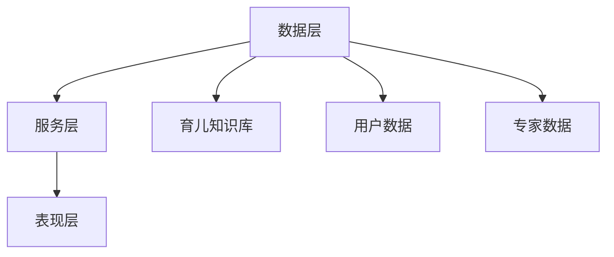
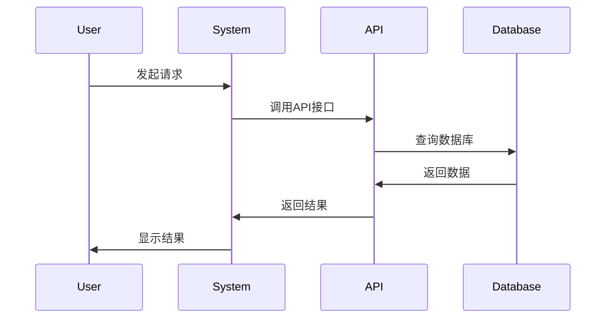

                 

# 新型城市共享育儿知识库：社区育儿经验的数字化传承

> 关键词：育儿知识库、数字化传承、社区共享、知识检索、推荐算法、系统架构

> 摘要：本文探讨了新型城市共享育儿知识库的设计与实现，通过社区育儿经验的数字化传承，解决育儿资源不足和知识分散的问题。文章从背景介绍、核心概念与联系、算法原理讲解、数学模型和公式、系统分析与架构设计方案等多个角度，全面剖析了育儿知识库的构建与应用。

## 第一部分：背景介绍

### 1.1 问题描述

随着城市化进程的加速，城市家庭面临着育儿资源的短缺和育儿知识的分散性问题。传统上，育儿经验的传承主要依赖于家庭内部的交流和分享，这种方式存在一定的局限性，难以满足现代城市家庭的育儿需求。因此，如何有效地构建一个新型城市共享育儿知识库，实现育儿经验的数字化传承，成为一个亟待解决的问题。

### 1.2 问题解决

为了解决上述问题，本书提出了一种基于数字化技术的共享育儿知识库构建方案。通过搭建一个社区育儿经验共享平台，将育儿知识进行数字化存储、分类、检索和推荐，实现育儿资源的共享和传承。

### 1.3 边界与外延

新型城市共享育儿知识库的边界主要涉及城市家庭的育儿需求、育儿知识的获取与共享、育儿经验的传承等方面。其外延包括育儿知识的数字化存储、检索、分享和应用。

### 1.4 概念结构与核心要素组成

新型城市共享育儿知识库的核心概念包括：育儿知识、数字化存储、社区共享、经验传承等。其核心要素包括：用户、知识库、平台、社区等。

## 第二部分：核心概念与联系

### 2.1 育儿知识概述

#### 2.1.1 育儿知识的定义与特点

育儿知识是指与儿童成长、发展、教育等相关的一系列知识体系。它具有以下特点：

- **实用性**：育儿知识是实际操作经验与理论知识的结合，具有较高的实用性。
- **动态性**：育儿知识随着儿童年龄的增长和社会环境的变化而不断更新。
- **传承性**：育儿知识通过家庭、社区等途径进行传承。

#### 2.1.2 育儿知识的重要性

育儿知识对儿童的成长和发展具有重要意义，它不仅关系到儿童的身体健康，还影响其心理素质和社交能力的培养。因此，共享和传承高质量的育儿知识对于城市家庭和社会的发展具有积极的作用。

### 2.2 数字化存储

#### 2.2.1 数字化存储的优势

数字化存储相对于传统存储方式具有以下优势：

- **便捷性**：用户可以随时随地通过互联网访问育儿知识库。
- **高效性**：数字化存储可以实现快速检索和推荐，提高育儿知识的利用率。
- **安全性**：数字化存储可以通过加密技术保障育儿知识的安全。

#### 2.2.2 数字化存储的挑战

数字化存储也面临一些挑战，如数据安全、隐私保护、知识质量保障等。因此，在构建育儿知识库时，需要充分考虑这些挑战，并采取相应的解决措施。

### 2.3 社区共享

#### 2.3.1 社区共享的概念与模式

社区共享是指通过社区平台将育儿知识进行共享，实现育儿资源的整合和优化。社区共享的模式主要包括：

- **用户生成内容**：用户可以在平台上发布育儿经验、心得和问题。
- **专业专家指导**：邀请育儿专家在平台上提供专业指导和建议。
- **社区互动**：用户可以在平台上进行交流和互动，分享育儿经验。

#### 2.3.2 社区共享的优势与挑战

社区共享的优势包括：

- **知识共享**：用户可以方便地获取和分享育儿知识。
- **经验传承**：通过社区互动，育儿经验可以得到更广泛的传承。

社区共享的挑战包括：

- **知识质量**：如何确保育儿知识的质量和准确性。
- **用户隐私**：如何保护用户的隐私信息。

### 2.4 经验传承

#### 2.4.1 经验传承的重要性

经验传承是育儿知识库的核心目标之一。通过数字化手段，将优秀育儿经验传承给下一代，有助于提升整个社会的育儿水平。

#### 2.4.2 经验传承的途径与方法

经验传承的途径包括：

- **知识库存储**：将育儿经验存储在知识库中，供用户检索和参考。
- **社区互动**：通过社区互动，用户可以分享和交流育儿经验。

经验传承的方法包括：

- **案例分析**：通过对具体案例的分析，总结出可借鉴的经验。
- **专家指导**：邀请育儿专家提供专业指导，帮助用户提升育儿能力。

### 2.5 育儿知识库设计与实现

#### 2.5.1 育儿知识库的架构设计

育儿知识库的架构设计主要包括以下几个方面：

- **数据层**：负责数据的存储和管理，包括育儿知识的数据表设计。
- **服务层**：负责业务逻辑的实现，包括知识检索、推荐、分类等功能。
- **表现层**：负责用户界面的展示，包括用户注册、登录、发布和浏览育儿知识等。

#### 2.5.2 育儿知识库的关键技术

育儿知识库的关键技术包括：

- **知识图谱**：用于构建育儿知识的语义关系和网络结构，支持智能检索和推荐。
- **机器学习**：用于育儿知识的自动分类、标注和推荐。
- **区块链**：用于保障育儿知识的安全性和可信度。

### 2.6 育儿知识应用场景

#### 2.6.1 家长学习与应用

育儿知识库为家长提供了一个学习和应用育儿知识的平台。家长可以通过检索、推荐和分类功能，获取与孩子年龄、发展阶段相关的育儿知识。

#### 2.6.2 育儿专家指导

育儿知识库可以为育儿专家提供一个分享经验和提供指导的平台。专家可以通过发布专业文章、回答用户问题等方式，为家长提供高质量的育儿指导。

#### 2.6.3 育儿资源共享

育儿知识库实现了育儿资源的共享，使得优秀的育儿经验可以在更大范围内传播和传承。用户可以通过社区互动，分享和交流育儿经验。

## 第三部分：算法原理讲解

### 3.1 育儿知识检索算法

#### 3.1.1 检索算法的基本原理

育儿知识检索算法是基于信息检索技术的一种算法。其基本原理是：

- **倒排索引**：通过建立倒排索引，将育儿知识库中的关键词与对应的文档进行映射，实现快速检索。
- **相似度计算**：通过计算用户查询与育儿知识之间的相似度，确定检索结果的相关性。

#### 3.1.2 检索算法的设计与实现

育儿知识检索算法的设计与实现包括：

- **倒排索引构建**：通过分词、词频统计等步骤，构建育儿知识库的倒排索引。
- **相似度计算**：采用TF-IDF、Word2Vec等方法，计算用户查询与育儿知识之间的相似度。

### 3.2 育儿知识推荐算法

#### 3.2.1 推荐算法的基本原理

育儿知识推荐算法是基于内容推荐和协同过滤技术的一种算法。其基本原理是：

- **内容推荐**：根据育儿知识的内容特征，为用户推荐与其需求相关的育儿知识。
- **协同过滤**：根据用户的浏览和收藏行为，为用户推荐其他用户感兴趣的内容。

#### 3.2.2 推荐算法的设计与实现

育儿知识推荐算法的设计与实现包括：

- **内容特征提取**：通过词频、词向量等方法，提取育儿知识的内容特征。
- **协同过滤模型**：采用基于用户和基于项目的协同过滤模型，进行育儿知识推荐。

### 3.3 育儿知识分类算法

#### 3.3.1 分类算法的基本原理

育儿知识分类算法是基于机器学习技术的一种算法。其基本原理是：

- **特征提取**：通过特征提取方法，将育儿知识转化为可训练的数据集。
- **分类模型**：采用分类算法，如SVM、决策树等，对育儿知识进行分类。

#### 3.3.2 分类算法的设计与实现

育儿知识分类算法的设计与实现包括：

- **数据预处理**：对育儿知识进行预处理，包括数据清洗、标签标注等。
- **分类模型训练**：使用训练数据集，训练分类模型。
- **分类模型评估**：使用测试数据集，评估分类模型的性能。

### 3.4 育儿知识图谱构建算法

#### 3.4.1 图谱构建的基本原理

育儿知识图谱构建算法是基于图论技术的一种算法。其基本原理是：

- **实体识别**：通过实体识别技术，识别育儿知识中的实体，如儿童、疾病、教育方法等。
- **关系抽取**：通过关系抽取技术，构建实体之间的关系，如儿童患某种疾病、某种教育方法适用于某个年龄段等。

#### 3.4.2 图谱构建的设计与实现

育儿知识图谱构建算法的设计与实现包括：

- **实体识别**：使用命名实体识别（NER）技术，识别育儿知识中的实体。
- **关系抽取**：使用规则匹配、机器学习等方法，抽取实体之间的关系。
- **图谱构建**：使用图数据库，存储和查询育儿知识图谱。

### 3.5 育儿知识库维护与更新算法

#### 3.5.1 维护与更新的基本原理

育儿知识库维护与更新算法是基于数据流处理技术的一种算法。其基本原理是：

- **数据流处理**：实时处理育儿知识库中的数据流，实现知识的实时更新。
- **版本控制**：通过版本控制，记录育儿知识库的更新历史，保证知识库的版本正确性。

#### 3.5.2 维护与更新的设计与实现

育儿知识库维护与更新算法的设计与实现包括：

- **数据流处理**：使用流处理框架，如Apache Kafka，处理育儿知识库中的数据流。
- **版本控制**：使用版本控制工具，如Git，记录育儿知识库的更新历史。
- **数据同步**：使用数据同步工具，如Apache Hadoop，同步育儿知识库的不同版本。

## 第四部分：数学模型和数学公式

### 4.1 育儿知识库评估模型

#### 4.1.1 评估指标的选择

育儿知识库评估指标的选择应考虑以下方面：

- **知识质量**：包括知识的准确性、权威性、实用性等。
- **用户满意度**：包括用户的检索效率、推荐效果、使用体验等。
- **系统性能**：包括系统的响应时间、并发处理能力等。

#### 4.1.2 评估模型的建立

育儿知识库评估模型可以采用以下公式：

$$
MSE = \frac{1}{n} \sum_{i=1}^{n} (y_i - \hat{y}_i)^2
$$

其中，$MSE$为均方误差（Mean Squared Error），$y_i$为实际评估值，$\hat{y}_i$为预测评估值。

### 4.2 育儿知识共享激励机制

#### 4.2.1 激励机制的设计原则

育儿知识共享激励机制的设计应遵循以下原则：

- **公平性**：确保激励机制对所有参与者公平。
- **激励性**：激励措施应能够激发用户积极参与知识共享。
- **可持续性**：激励机制应具有可持续性，避免短期行为。

#### 4.2.2 激励机制的数学模型

育儿知识共享激励机制可以采用以下公式：

$$
R = f(U, K, S)
$$

其中，$R$为激励值，$U$为用户参与度，$K$为知识贡献度，$S$为社交影响力。

## 第五部分：系统分析与架构设计方案

### 5.1 问题场景介绍

新型城市共享育儿知识库的典型应用场景是城市家庭育儿知识的共享和传承。在这个场景中，用户主要包括家长、育儿专家和育儿知识爱好者。用户可以通过平台获取育儿知识、分享育儿经验、寻求育儿指导等。

### 5.2 系统功能设计

新型城市共享育儿知识库的主要功能包括：

- **育儿知识发布**：用户可以在平台上发布育儿经验、心得和问题。
- **育儿知识检索**：用户可以通过关键词、分类等方式检索育儿知识。
- **育儿知识推荐**：系统根据用户的行为和兴趣，推荐相关育儿知识。
- **育儿知识图谱构建**：系统通过构建育儿知识图谱，支持知识的关联和推理。

#### 5.2.1 领域模型设计

使用Mermaid类图进行领域模型设计：

```mermaid
classDiagram
User <<类>> {
  用户ID
  用户名
  密码
  邮箱
}

Knowledge <<类>> {
  知识ID
  知识标题
  知识内容
  知识类型
}

Expert <<类>> {
  专家ID
  专家名
  专家资质
}

Community <<类>> {
  社区ID
  社区名称
  社区描述
}

User --> Knowledge: 发布
User --> Expert: 关注
User --> Community: 加入
Expert --> Knowledge: 发布
Expert --> Community: 参与
Knowledge --> Knowledge: 关联
Knowledge --> User: 被检索
Knowledge --> Expert: 被推荐
Community --> User: 成员
Community --> Expert: 专家
```

### 5.3 系统架构设计

新型城市共享育儿知识库的系统架构包括以下几个方面：

- **数据层**：负责数据的存储和管理，包括育儿知识库、用户数据、专家数据等。
- **服务层**：负责业务逻辑的实现，包括育儿知识发布、检索、推荐、社区互动等。
- **表现层**：负责用户界面的展示，包括注册、登录、发布和浏览育儿知识等。

使用Mermaid架构图进行系统架构设计：



### 5.4 系统接口设计和系统交互

新型城市共享育儿知识库的系统接口设计包括以下方面：

- **API接口**：提供育儿知识发布、检索、推荐等功能的API接口，供前端调用。
- **消息队列**：使用消息队列实现育儿知识发布和更新的异步处理。
- **缓存**：使用缓存技术提高系统性能，减少数据库查询压力。

使用Mermaid序列图进行系统接口设计和系统交互设计：



## 第六部分：项目实战

### 6.1 环境安装

在项目实战中，我们需要安装以下环境：

- **操作系统**：Ubuntu 18.04
- **编程语言**：Python 3.8
- **数据库**：MySQL 5.7
- **框架**：Django 3.2

### 6.2 系统核心实现源代码

系统核心实现源代码包括以下部分：

- **数据库设计**：使用MySQL数据库设计育儿知识库的表结构。
- **后端实现**：使用Django框架实现育儿知识发布、检索、推荐等功能。
- **前端实现**：使用HTML、CSS和JavaScript实现用户界面。

### 6.3 代码应用解读与分析

代码应用解读与分析包括以下方面：

- **数据库设计解读**：解释数据库表结构的设计原理和实现细节。
- **后端实现解读**：解释后端代码的功能实现和业务逻辑。
- **前端实现解读**：解释前端页面的设计和交互逻辑。

### 6.4 实际案例分析和详细讲解剖析

实际案例分析和详细讲解剖析包括以下案例：

- **案例1**：用户发布育儿经验，系统如何处理和存储。
- **案例2**：用户检索育儿知识，系统如何进行搜索和推荐。

### 6.5 项目小结

项目小结包括以下内容：

- **项目成果**：总结项目实现的成果和功能。
- **改进建议**：提出项目改进的建议和方向。
- **未来展望**：展望项目的未来发展前景和应用场景。

## 第七部分：最佳实践 tips、小结、注意事项、拓展阅读

### 7.1 最佳实践 tips

- **知识质量保障**：建立严格的育儿知识审核机制，确保知识库中的知识质量。
- **用户隐私保护**：采取加密技术保护用户隐私，提高系统的安全性。
- **激励机制优化**：根据用户行为和贡献，优化激励机制，提高用户活跃度。

### 7.2 小结

本文探讨了新型城市共享育儿知识库的设计与实现，通过社区育儿经验的数字化传承，解决育儿资源不足和知识分散的问题。文章从背景介绍、核心概念与联系、算法原理讲解、数学模型和公式、系统分析与架构设计方案等多个角度，全面剖析了育儿知识库的构建与应用。

### 7.3 注意事项

- **系统性能优化**：在构建育儿知识库时，需要关注系统的性能优化，提高检索和推荐的速度。
- **数据安全与隐私**：在处理用户数据时，需要确保数据的安全性和隐私性，避免泄露用户信息。

### 7.4 拓展阅读

- **育儿知识库构建**：[《育儿知识库构建与应用》](#)
- **社区育儿经验传承**：[《社区育儿经验传承研究》](#)
- **知识图谱构建技术**：[《知识图谱构建与应用》](#)

## 作者信息

作者：AI天才研究院/AI Genius Institute & 禅与计算机程序设计艺术 /Zen And The Art of Computer Programming

-------------------------------------------------------------------

