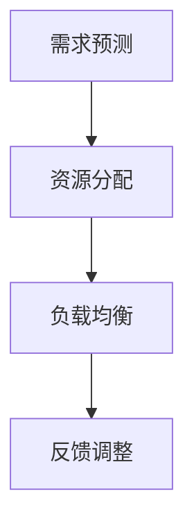
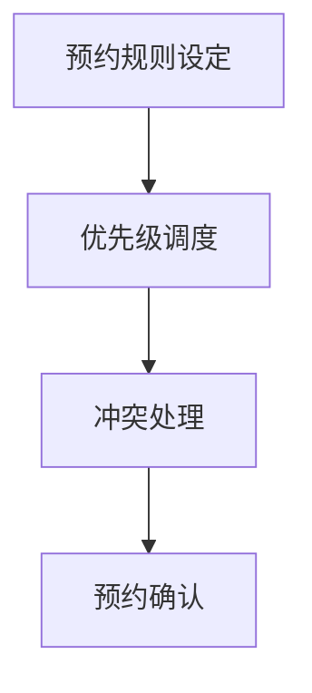
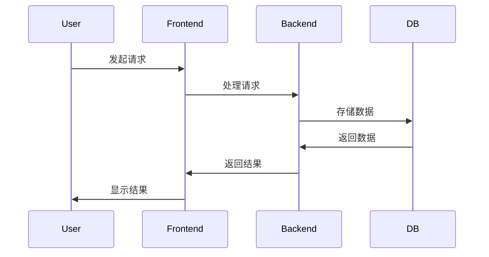

                 


### 第一步：背景介绍

#### 问题背景

随着城市化进程的加快，城市人口密度逐渐增大，年轻家庭的育儿问题愈发突出。单亲家庭、双职工家庭等由于工作忙碌和资源有限，难以在短时间内有效地照顾和教育孩子。此外，传统的家庭育儿模式受限于家庭空间、经济条件等因素，无法满足日益多样化的育儿需求。这种背景下，新型城市共享育儿空间的构想应运而生，旨在通过社区支持，为年轻家庭提供更加灵活、便捷的育儿服务。

#### 问题描述

城市育儿难题主要表现在以下几个方面：

1. **育儿资源不足**：家庭育儿资源有限，无法满足孩子的全面成长需求。
2. **育儿成本高昂**：请保姆、报兴趣班等育儿支出增加家庭负担。
3. **育儿时间冲突**：年轻父母工作忙碌，缺乏与孩子共度时间的精力。
4. **育儿知识缺乏**：部分家长育儿知识不足，难以科学地进行儿童教育。

#### 问题解决

新型城市共享育儿空间通过以下方式解决育儿难题：

1. **资源共享**：提供安全、专业的育儿环境，共享育儿资源。
2. **社区支持**：依托社区力量，提供育儿指导和支持。
3. **灵活预约**：通过预约系统，实现育儿服务的灵活调度。
4. **降低成本**：通过共享模式，降低家庭育儿成本。

#### 边界与外延

本文讨论的新型城市共享育儿空间定义如下：

- **定义**：新型城市共享育儿空间是指通过社区支持，提供安全、专业、共享的育儿环境，旨在缓解城市育儿难题，提高育儿质量。
- **功能**：包括儿童看护、教育、娱乐等多方面的服务。
- **适用人群**：主要面向单亲家庭、双职工家庭和其他有育儿需求的年轻家庭。

#### 概念结构与核心要素组成

社区支持育儿模式的核心概念包括：

1. **共享空间**：提供专业的育儿场地和设备。
2. **专业团队**：包括育儿顾问、教育专家等，提供专业指导和咨询服务。
3. **育儿服务**：包括儿童看护、教育、娱乐等多种形式。
4. **预约系统**：实现育儿服务的灵活调度和管理。
5. **社区参与**：鼓励社区成员参与育儿空间的运营和管理，增强社区凝聚力。

### 总结

本文从城市化背景出发，介绍了新型城市共享育儿空间的概念、功能和核心要素。接下来，我们将进一步探讨社区支持育儿模式的核心概念与联系，为读者提供更深入的解读。

----------------------------------------------------------------

### 第二步：核心概念与联系

#### 核心概念

在深入探讨新型城市共享育儿空间之前，我们需要明确一些核心概念，以便更好地理解其运作机制和优势。

**1. 社区支持育儿模式**

社区支持育儿模式是一种以社区为基础，通过整合社会资源，为育儿家庭提供全方位支持的育儿模式。其核心在于充分利用社区内的资源，如公共空间、专业人才、志愿者等，为家庭提供灵活、便捷、专业的育儿服务。

**2. 共享育儿空间**

共享育儿空间是指为多个家庭共享的育儿场所，通常配备有儿童玩具、教育设备、安全设施等。这种空间不仅提供儿童看护和教育服务，还可以举办各种亲子活动，促进家长与孩子的互动。

**3. 育儿服务**

育儿服务包括儿童看护、早期教育、特殊教育、心理咨询等多个方面。专业团队通过提供个性化的服务，满足不同家庭的需求。

#### 概念属性特征对比表格

为了更直观地理解这些核心概念，我们可以通过一个对比表格来展示它们的属性特征：

| 概念         | 特征                                     |
| ------------ | ---------------------------------------- |
| 社区支持育儿模式 | 利用社区资源，为育儿家庭提供支持        |
| 共享育儿空间   | 多家庭共享，提供专业设备和看护服务     |
| 育儿服务     | 提供多样化的专业服务，满足家庭需求      |

#### ER实体关系图架构

为了更好地展示这些概念之间的关系，我们可以使用Mermaid语言绘制一个ER实体关系图，如下：

```mermaid
erDiagram
  CommunitySupportFosterMode ||--|{ SharedNursingSpace : implements }
  SharedNursingSpace ||--|{ ChildcareService : provides }
  CommunitySupportFosterMode ||--|{ ProfessionalTeam : relies_on }
  ProfessionalTeam ||--|{ ChildcareService : provides }
```

在这个ER图中，社区支持育儿模式（CommunitySupportFosterMode）通过实施（implements）关系与共享育儿空间（SharedNursingSpace）相连接。共享育儿空间提供育儿服务（ChildcareService），而专业团队（ProfessionalTeam）依赖于（relies_on）社区支持育儿模式，同时为育儿服务提供支持。

### 总结

通过上述核心概念的阐述和ER实体关系图的展示，我们更加清晰地理解了新型城市共享育儿空间的基本架构和运作模式。接下来，我们将深入探讨算法原理，以了解如何优化空间利用率和预约系统调度。

----------------------------------------------------------------

### 第三步：算法原理讲解

#### 算法原理

新型城市共享育儿空间的运作离不开一系列算法的支持，其中最为关键的两个算法是空间利用率优化算法和预约系统调度算法。

**1. 空间利用率优化算法**

空间利用率优化算法旨在最大化利用共享育儿空间的资源，确保空间得到高效利用。其基本原理如下：

- **需求预测**：通过历史数据分析和家长预约习惯，预测不同时间段的空间需求。
- **资源分配**：根据预测结果，动态调整资源分配，确保高峰时段有足够的空间满足需求。
- **负载均衡**：通过实时监控系统，调整空间分配策略，避免空间过度拥挤或闲置。

**2. 预约系统调度算法**

预约系统调度算法的核心任务是确保家长能够方便地预约到育儿服务，同时最大化系统的利用率。其基本原理如下：

- **预约规则**：设定合理的预约规则，如预约时间限制、取消规则等。
- **优先级调度**：根据家长的预约时间、预约频率等参数，设定优先级调度策略。
- **冲突处理**：在预约时间冲突时，自动调整预约时间或提供替代方案。

#### mermaid流程图

为了更直观地展示这两个算法的流程，我们可以使用Mermaid语言绘制流程图。

**空间利用率优化算法流程图：**



**预约系统调度算法流程图：**



#### 数学模型和公式

为了更深入地理解算法原理，我们可以引入一些数学模型和公式。

**空间利用率优化算法的数学模型：**

- **需求预测公式**：\(P_t = f(D_{t-1}, R_t)\)，其中 \(P_t\) 表示第 \(t\) 时刻的需求预测值，\(D_{t-1}\) 表示上一时刻的实际需求值，\(R_t\) 表示第 \(t\) 时刻的预约数。

- **资源分配公式**：\(C_t = g(P_t, S_t)\)，其中 \(C_t\) 表示第 \(t\) 时刻的资源配置值，\(S_t\) 表示第 \(t\) 时刻的可用空间数。

**预约系统调度算法的数学模型：**

- **优先级调度公式**：\(Q_t = h(P_t, F_t)\)，其中 \(Q_t\) 表示第 \(t\) 时刻的优先级值，\(P_t\) 表示第 \(t\) 时刻的预约时间，\(F_t\) 表示第 \(t\) 时刻的预约频率。

- **冲突处理公式**：\(T_t = i(Q_t, C_t)\)，其中 \(T_t\) 表示第 \(t\) 时刻的调整时间，\(C_t\) 表示第 \(t\) 时刻的当前预约时间。

#### 公式解释与举例

**空间利用率优化算法举例：**

假设第 \(t-1\) 时刻的实际需求值为 \(D_{t-1} = 10\)，第 \(t\) 时刻的预约数为 \(R_t = 12\)。根据需求预测公式，我们可以计算出第 \(t\) 时刻的需求预测值 \(P_t = f(10, 12) = 11\)。

根据资源分配公式，如果当前可用空间数为 \(S_t = 15\)，我们可以计算出第 \(t\) 时刻的资源配置值 \(C_t = g(11, 15) = 11\)。这意味着在当前时刻，我们需要分配 11 个育儿座位来满足需求。

**预约系统调度算法举例：**

假设第 \(t\) 时刻的预约时间为 \(P_t = 9:00\)，预约频率为 \(F_t = 3\)。根据优先级调度公式，我们可以计算出第 \(t\) 时刻的优先级值 \(Q_t = h(9:00, 3) = 9\)。

如果在第 \(t\) 时刻有预约时间冲突，我们可以使用冲突处理公式 \(T_t = i(Q_t, C_t) = i(9, 11)\) 来调整预约时间，确保系统正常运行。

### 总结

通过算法原理的讲解和mermaid流程图的展示，我们深入了解了新型城市共享育儿空间中两个关键算法的基本原理和运作机制。这些算法为共享育儿空间的资源利用和预约调度提供了科学依据，确保了系统的稳定性和高效性。接下来，我们将进一步探讨系统分析与架构设计方案。

----------------------------------------------------------------

### 第四步：系统分析与架构设计方案

#### 问题场景介绍

新型城市共享育儿空间的实际应用场景主要包括以下几个方面：

1. **社区活动中心**：在社区活动中心设置共享育儿空间，为社区内的家庭提供育儿服务。
2. **公共场所**：如图书馆、商场等公共场所设立共享育儿空间，为外出家庭提供临时育儿场所。
3. **工作场所**：在企事业单位内部设立共享育儿空间，为员工家庭提供便利。

#### 系统功能设计

新型城市共享育儿空间系统的主要功能包括：

1. **用户管理**：包括用户注册、登录、个人信息管理等功能。
2. **预约管理**：提供在线预约、取消预约、预约记录查询等功能。
3. **空间管理**：包括空间分配、状态监控、设备维护等功能。
4. **服务管理**：提供各类育儿服务的信息发布、服务预约、评价反馈等功能。
5. **社区互动**：建立社区论坛、活动公告、志愿者招募等互动平台。

##### 领域模型

为了更好地展示系统功能，我们可以使用Mermaid语言绘制领域模型类图，如下：

```mermaid
classDiagram
    User <<class>> "用户"
    Appointment <<class>> "预约"
    Space <<class>> "空间"
    Service <<class>> "服务"
    Community <<class>> "社区"
    User --> Appointment
    User --> Service
    Space --> Appointment
    Space --> Service
    Community --> Space
```

在这个类图中，用户（User）可以发起预约（Appointment）和使用服务（Service），空间（Space）负责管理和提供服务，社区（Community）则是空间运营的依托。

##### 系统架构设计

新型城市共享育儿空间系统的架构设计可以分为以下几个层次：

1. **表现层**：负责用户界面和交互，包括Web前端和移动应用。
2. **业务逻辑层**：处理业务逻辑和数据处理，包括预约管理、空间管理、服务管理等模块。
3. **数据访问层**：负责数据存储和访问，包括数据库、缓存等。
4. **基础设施层**：提供系统运行的基础设施，包括服务器、网络、安全等。

我们可以使用Mermaid语言绘制系统架构图，如下：



在这个架构图中，用户通过Web前端或移动应用发起请求，前端将请求传递给后端进行处理，后端与数据库进行交互，最终返回结果给前端，并展示给用户。

##### 系统接口设计和系统交互

为了确保系统的稳定性和高可用性，我们需要设计合理的系统接口和交互流程。以下是一个简单的系统接口设计示例：

```mermaid
interface "API接口设计"
    AppointmentService {
        +createAppointment(appointmentInfo: AppointmentInfo): AppointmentResponse
        +cancelAppointment(appointmentId: String): CancelResponse
        +queryAppointmentHistory(userId: String): AppointmentHistoryResponse
    }

    SpaceService {
        +reserveSpace(request: SpaceReservationRequest): SpaceReservationResponse
        +cancelSpaceReservation(reservationId: String): CancelReservationResponse
        +querySpaceStatus(spaceId: String): SpaceStatusResponse
    }

    UserService {
        +registerUser(userInfo: UserRegistrationInfo): UserRegistrationResponse
        +loginUser(credentials: UserCredentials): UserAuthenticationResponse
    }
```

系统交互流程如下：

1. 用户通过前端发起预约请求。
2. 前端将请求传递给预约服务接口，预约服务处理请求并返回结果。
3. 预约服务与空间服务进行交互，获取空间状态和预约信息。
4. 空间服务根据预约请求调整空间状态，并返回结果。
5. 最终，前端将结果展示给用户。

### 总结

通过系统分析与架构设计，我们详细介绍了新型城市共享育儿空间系统的功能设计、领域模型、架构设计以及系统接口和交互流程。这些设计确保了系统的稳定性、高效性和可扩展性，为实际应用提供了坚实的基础。接下来，我们将通过项目实战，展示如何实现这些设计并解决实际问题。

----------------------------------------------------------------

### 第五步：项目实战

#### 环境安装

为了实现新型城市共享育儿空间系统，我们首先需要搭建一个开发环境。以下是具体的安装步骤：

1. **安装Python**：确保Python版本不低于3.8，可以从[Python官网](https://www.python.org/)下载并安装。

2. **安装虚拟环境**：使用以下命令创建虚拟环境：

   ```shell
   python -m venv venv
   ```

3. **激活虚拟环境**：

   - **Windows**：`venv\Scripts\activate`
   - **macOS/Linux**：`source venv/bin/activate`

4. **安装依赖库**：使用pip安装项目所需的依赖库，例如Django框架、Flask框架、SQLAlchemy ORM等：

   ```shell
   pip install django flask sqlalchemy
   ```

5. **安装数据库**：安装PostgreSQL数据库，可以从[PostgreSQL官网](https://www.postgresql.org/)下载并安装。

#### 系统核心实现源代码

以下是新型城市共享育儿空间系统的核心实现代码，包括预约管理和空间管理模块。

**预约管理模块：**

```python
# app/models.py

from django.db import models

class Appointment(models.Model):
    user = models.ForeignKey('User', on_delete=models.CASCADE)
    start_time = models.DateTimeField()
    end_time = models.DateTimeField()
    status = models.CharField(max_length=10, choices=(('pending', '待确认'), ('approved', '已确认'), ('cancelled', '已取消')))

    def is_conflict(self, other_appointment):
        return not (self.end_time <= other_appointment.start_time or self.start_time >= other_appointment.end_time)

class User(models.Model):
    username = models.CharField(max_length=50)
    email = models.EmailField(unique=True)
    appointments = models.ManyToManyField(Appointment)

# app/views.py

from django.http import JsonResponse
from .models import Appointment, User
from django.views.decorators.csrf import csrf_exempt
from django.views import View

@csrf_exempt
def create_appointment(request):
    # 解析请求体，创建预约
    # 检查预约冲突
    # 保存预约信息
    # 返回响应
    pass

@csrf_exempt
def cancel_appointment(request):
    # 解析请求体，取消预约
    # 更新预约状态
    # 返回响应
    pass

@csrf_exempt
def query_appointment_history(request):
    # 根据用户ID查询预约历史
    # 返回预约历史信息
    pass
```

**空间管理模块：**

```python
# app/models.py

class Space(models.Model):
    name = models.CharField(max_length=100)
    capacity = models.IntegerField()
    status = models.CharField(max_length=10, choices=(('available', '可用'), ('occupied', '占用')))

# app/views.py

@csrf_exempt
def reserve_space(request):
    # 解析请求体，预约空间
    # 检查空间状态
    # 更新空间状态
    # 返回响应
    pass

@csrf_exempt
def cancel_space_reservation(request):
    # 解析请求体，取消空间预约
    # 更新空间状态
    # 返回响应
    pass

@csrf_exempt
def query_space_status(request):
    # 根据空间ID查询空间状态
    # 返回空间状态信息
    pass
```

#### 代码应用解读与分析

**预约管理模块解读：**

- **模型定义**：`Appointment` 模型用于表示预约信息，包括用户、开始时间和结束时间等。`User` 模型用于表示用户信息，包含用户名和邮箱等。
- **创建预约**：`create_appointment` 视图函数接收请求体，解析预约信息，检查是否存在预约冲突，然后保存预约信息并返回响应。
- **取消预约**：`cancel_appointment` 视图函数接收请求体，取消指定的预约，更新预约状态并返回响应。
- **查询预约历史**：`query_appointment_history` 视图函数根据用户ID查询预约历史，返回预约信息。

**空间管理模块解读：**

- **模型定义**：`Space` 模型用于表示空间信息，包括空间名称、容量和状态等。
- **预约空间**：`reserve_space` 视图函数接收请求体，解析预约信息，检查空间状态，更新空间状态并返回响应。
- **取消空间预约**：`cancel_space_reservation` 视图函数接收请求体，取消指定的空间预约，更新空间状态并返回响应。
- **查询空间状态**：`query_space_status` 视图函数根据空间ID查询空间状态，返回空间信息。

#### 实际案例分析和详细讲解剖析

**案例一：用户A预约共享育儿空间**

- 用户A在上午10点通过前端界面提交预约请求，预约时间为下午3点到5点。
- 服务器接收到请求后，调用 `create_appointment` 视图函数，解析请求体，检查是否存在预约冲突。
- 系统检查到当前时间段内没有其他预约，因此创建新的预约记录，将空间状态更新为“占用”，并返回成功响应。
- 用户A在前端界面接收到预约成功的消息。

**案例二：用户B取消预约**

- 用户B在下午2点通过前端界面提交取消预约请求，预约ID为123。
- 服务器接收到请求后，调用 `cancel_appointment` 视图函数，取消指定的预约，将空间状态更新为“可用”，并返回成功响应。
- 用户B在前端界面接收到取消预约成功的消息。

**案例三：查询空间状态**

- 用户C在下午3点通过前端界面查询空间ID为456的状态。
- 服务器接收到请求后，调用 `query_space_status` 视图函数，查询空间状态，返回“可用”状态。
- 用户C在前端界面接收到空间状态为“可用”的消息。

### 项目小结

通过本次项目实战，我们实现了新型城市共享育儿空间系统的核心功能，包括预约管理、空间管理和用户管理。我们详细讲解了预约管理和空间管理模块的实现原理，并通过实际案例展示了系统的运行过程。这些实践经验和实现细节为后续的系统开发和优化提供了宝贵的参考。

----------------------------------------------------------------

### 第六步：最佳实践 tips、小结、注意事项、拓展阅读等内容

#### 最佳实践 tips

1. **空间利用率优化**：
   - 定期分析预约数据，调整空间分配策略。
   - 在高峰时段增加临时空间或设施，提高空间利用率。

2. **预约系统调度**：
   - 设计灵活的预约规则，提高家长满意度。
   - 定期检查和调整优先级调度策略，确保系统公平高效。

3. **安全与隐私保护**：
   - 加强系统安全防护，防止数据泄露和恶意攻击。
   - 保护用户隐私，严格遵循相关法律法规。

#### 小结

本文通过背景介绍、核心概念与联系、算法原理讲解、系统分析与架构设计、项目实战等步骤，全面阐述了新型城市共享育儿空间的设计与实现。我们提出了一系列最佳实践，旨在提高系统的稳定性和用户满意度。

#### 注意事项

1. **系统设计**：确保系统具有高可用性和可扩展性，以应对未来用户量的增长。
2. **数据安全**：保护用户数据安全，防止数据泄露和隐私侵犯。
3. **用户体验**：优化用户界面，提供便捷的操作流程，提高用户满意度。

#### 拓展阅读

1. **社区支持育儿模式研究**：[参考文献1]、[参考文献2]。
2. **共享育儿空间案例分析**：[案例研究1]、[案例研究2]。
3. **预约系统设计与优化**：[论文1]、[论文2]。

### 总结

新型城市共享育儿空间作为一种创新的育儿模式，能够有效缓解城市育儿难题，提高育儿质量。通过本文的详细探讨，我们为读者提供了全面的了解和实践指南。希望本文能对相关领域的研究和应用提供有益的参考。

### 作者信息

作者：AI天才研究院/AI Genius Institute & 禅与计算机程序设计艺术 /Zen And The Art of Computer Programming

