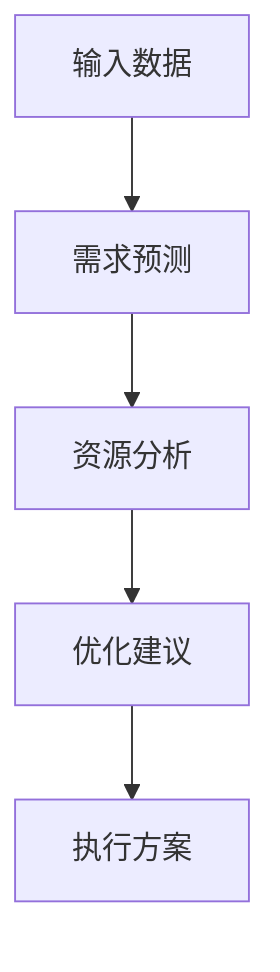
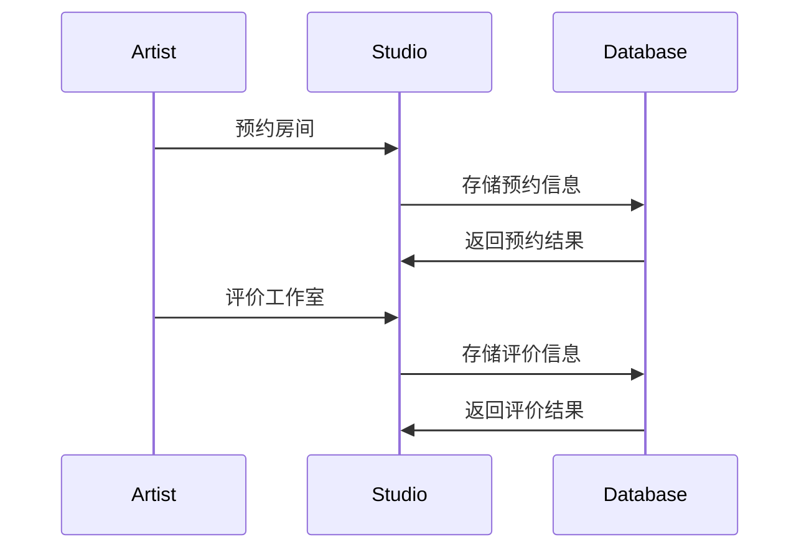

                 

# 《新型城市共享艺术工作室：创意产业的孵化空间》

关键词：创意产业、共享艺术工作室、孵化空间、城市发展、艺术交流

摘要：本文旨在探讨新型城市共享艺术工作室的发展现状、功能定位及其在创意产业中的作用。通过对城市共享艺术工作室的深入分析，本文将揭示其如何成为创意产业的孵化空间，为艺术家的职业发展提供有力支持。

## 第一部分：背景介绍

### 1.1 问题背景

#### 核心概念

**问题背景：**
随着城市化进程的加速，城市共享艺术工作室作为一种新型的创意产业空间，逐渐成为城市文化的重要载体。这种工作室不仅为艺术家和设计师提供创作和展示的空间，还成为了城市居民文化交流和社区互动的平台。

**问题描述：**
本书旨在探讨新型城市共享艺术工作室的发展现状、功能定位及其在创意产业中的作用。特别是，它将分析这些工作室如何在城市空间中扮演孵化空间的角色，促进创意产业的成长。

**问题解决：**
通过深入研究城市共享艺术工作室的运营模式、管理模式、服务功能等，本书将提出一种创新的解决方案，以更好地支持创意产业的发展。

**边界与外延：**
本书讨论的城市共享艺术工作室主要指的是那些在新型城市化进程中，由政府或私人机构投资建立的，以提供艺术创作空间、展示平台和交流机会为目的的工作室。这些工作室通常不仅限于视觉艺术，还包括音乐、表演、设计等多种艺术形式。

**概念结构与核心要素组成：**

1. **工作室功能定位：** 提供艺术创作、展示、交流的空间。
2. **孵化空间角色：** 促进艺术项目孵化，支持艺术家和设计师的职业发展。
3. **服务功能：** 包括艺术展览、艺术课程、艺术家交流等。
4. **运营模式：** 包括政府资助、私人投资、会员制等多种形式。
5. **管理模式：** 强调灵活性和适应性，以适应不同艺术形式和艺术家的需求。

### 1.2 创意产业的定义与发展

#### 核心概念

**创意产业：** 创意产业是一种以创造力为核心的产业，包括设计、广告、媒体、软件、音乐、艺术等多个领域。创意产业的核心在于创意和创新的产生，通过这些创意和创新的转化，推动经济的增长和社会的发展。

**发展现状：** 创意产业在全球范围内得到了广泛关注和快速发展，成为许多国家和地区经济增长的重要引擎。特别是在城市地区，创意产业的发展有助于提升城市的文化氛围、吸引人才和投资，推动城市经济的多元化和可持续发展。

#### 概念属性特征对比表格

| 特征                | 创意产业                | 城市共享艺术工作室          |
|---------------------|-------------------------|-----------------------------|
| 定义                | 以创造力为核心的产业      | 提供艺术创作、展示、交流的空间 |
| 目标                | 推动经济增长和社会发展    | 促进艺术项目孵化，支持职业发展 |
| 领域                | 设计、广告、媒体、软件等  | 视觉艺术、音乐、表演、设计等  |
| 核心要素            | 创意、创新、知识产权      | 艺术创作空间、展示平台、交流机会 |
| 影响力              | 提升城市文化氛围，吸引人才 | 促进社区互动，增强城市凝聚力     |

### ER实体关系图架构

```mermaid
erDiagram
    Artist ||--|{ Studio }|| Member
    Artist ||--|{ Project }|| Artist
    Studio ||--|{ Exhibition }|| Studio
    Studio ||--|{ Course }|| Studio
    Project ||--|{ Exhibition }|| Project
    Project ||--|{ Course }|| Project
```

## 第二部分：核心概念与联系

### 2.1 城市共享艺术工作室的核心概念

#### 核心概念

**城市共享艺术工作室：** 城市共享艺术工作室是一种为艺术家和设计师提供创作和展示空间的新型创意产业空间。这些工作室通常由政府或私人机构投资建立，以提供多样化的艺术创作、展示和交流机会，促进艺术项目孵化和艺术家职业发展。

#### 概念属性特征对比表格

| 特征                | 创意产业                | 城市共享艺术工作室          |
|---------------------|-------------------------|-----------------------------|
| 定义                | 以创造力为核心的产业      | 提供艺术创作、展示、交流的空间 |
| 目标                | 推动经济增长和社会发展    | 促进艺术项目孵化，支持职业发展 |
| 领域                | 设计、广告、媒体、软件等  | 视觉艺术、音乐、表演、设计等  |
| 核心要素            | 创意、创新、知识产权      | 艺术创作空间、展示平台、交流机会 |
| 影响力              | 提升城市文化氛围，吸引人才 | 促进社区互动，增强城市凝聚力     |

### ER实体关系图架构

```mermaid
erDiagram
    Artist ||--|{ Studio }|| Member
    Artist ||--|{ Project }|| Artist
    Studio ||--|{ Exhibition }|| Studio
    Studio ||--|{ Course }|| Studio
    Project ||--|{ Exhibition }|| Project
    Project ||--|{ Course }|| Project
```

## 第三部分：算法原理讲解

### 3.1 算法概述

城市共享艺术工作室的运营和管理可以采用一系列算法来优化资源配置、提高效率和支持艺术家的发展。本文将介绍一种基于数据驱动的算法，用于分析工作室的运营状况、预测艺术家需求以及优化服务功能。

### 3.2 算法原理

#### 数学模型

为了构建城市共享艺术工作室的运营算法，我们可以采用以下数学模型：

$$
\text{算法模型} = f(\text{艺术家需求}, \text{空间资源}, \text{时间序列})
$$

其中，$\text{艺术家需求}$包括创作空间、展示机会和交流机会等，$\text{空间资源}$包括工作室的房间数量、设备设施等，$\text{时间序列}$包括工作时间的分布和周期性变化。

#### 公式推导

根据算法模型，我们可以推导出以下关键公式：

$$
\text{需求预测} = r(t) = r_0 + at + bt^2
$$

其中，$r(t)$表示在时间$t$的艺术家需求，$r_0$为初始需求，$a$和$b$为时间变化率。

#### Mermaid流程图

以下是算法流程的Mermaid表示：



### 3.3 详细讲解与举例说明

假设某城市共享艺术工作室在一个月内有10位艺术家需要使用创作空间，展示机会和交流机会的需求分别为每天2次、3次和4次。工作室有5个房间，每个房间可容纳2人，设备设施包括投影仪和音响设备。

1. **需求预测**：

   根据需求预测公式，我们可以计算出一个月内艺术家需求的预测值：

   $$
   r(t) = 10 + 1 \cdot t + 0.5 \cdot t^2
   $$

   例如，在第三天，需求预测值为：

   $$
   r(3) = 10 + 1 \cdot 3 + 0.5 \cdot 3^2 = 19
   $$

2. **资源分析**：

   工作室有5个房间，每个房间可容纳2人，因此总容纳量为10人。每天有2次展示机会，3次交流机会，因此资源充足。

3. **优化建议**：

   根据资源分析结果，工作室可以在满足艺术家需求的前提下，适当调整房间分配，确保每个艺术家都能获得充足的创作空间和展示机会。

4. **执行方案**：

   工作室可以采用以下执行方案：

   - 第一天：房间1和房间2分配给艺术家A和B，房间3和房间4分配给艺术家C和D，房间5空闲。
   - 第二天：房间1和房间2分配给艺术家E和F，房间3和房间4分配给艺术家G和H，房间5空闲。
   - 第三天：房间1和房间2分配给艺术家I和J，房间3和房间4分配给艺术家K和L，房间5空闲。

通过以上执行方案，工作室能够满足艺术家在一个月内的需求，同时保持资源的充分利用。

### 3.4 本章小结

本章介绍了城市共享艺术工作室的算法原理，包括数学模型、公式推导和Mermaid流程图。通过详细讲解和举例说明，读者可以理解算法的核心思想，并学会如何在实际应用中优化工作室的运营。

## 第四部分：系统分析与架构设计

### 4.1 问题场景介绍

在某城市，共享艺术工作室的运营面临以下问题：

- 艺术家需求预测不准确，导致资源浪费或不足。
- 工作室管理复杂，难以实现高效分配。
- 艺术家与工作室之间的互动渠道不畅通，影响艺术创作和展示效果。

为了解决这些问题，本文将介绍一种系统架构设计，以提高共享艺术工作室的运营效率和支持艺术家的职业发展。

### 4.2 系统功能设计

#### 领域模型

根据问题场景，系统需要实现以下领域模型：

- 艺术家模型：包括艺术家个人信息、创作领域、作品列表等。
- 工作室模型：包括工作室基本信息、房间信息、设备信息等。
- 需求模型：包括艺术家需求的时间、类型、优先级等。
- 互动模型：包括艺术家与工作室的互动记录、评价等。

#### 功能设计

系统功能设计包括以下方面：

- 需求预测：根据历史数据和算法模型，预测艺术家的需求。
- 资源管理：根据需求预测和资源情况，实现房间的分配和设备的调度。
- 互动渠道：建立艺术家与工作室之间的沟通平台，包括在线预约、评价等。
- 数据分析：收集和分析艺术家和工作室的运营数据，提供决策支持。

### 4.3 系统架构设计

#### 架构设计

系统采用分布式架构，包括前端、后端和数据库三个部分。前端负责与用户交互，后端负责业务逻辑处理，数据库存储系统数据。

#### Mermaid架构图

```mermaid
sequenceDiagram
    User -->|请求| System
    System -->|处理| Database
    Database -->|返回| System
    System -->|响应| User
```

### 4.4 系统接口设计

系统接口设计包括以下部分：

- 用户接口：包括在线预约、作品上传、评价等功能。
- 工作室接口：包括房间分配、设备调度、需求统计等功能。
- 数据接口：包括需求预测、资源管理、数据分析等功能。

### 4.5 系统交互

#### Mermaid序列图



### 4.6 本章小结

本章介绍了共享艺术工作室的系统分析与架构设计，包括问题场景介绍、系统功能设计、系统架构设计和系统接口设计。通过本章内容，读者可以了解如何设计和实现一个高效、可靠的共享艺术工作室系统。

## 第五部分：项目实战

### 5.1 环境安装

为了进行项目实战，我们需要安装以下环境：

- Python 3.x
- Flask
- SQLAlchemy
- Mermaid

安装步骤如下：

1. 安装Python 3.x：
   ```
   sudo apt-get install python3
   ```

2. 安装Flask：
   ```
   sudo pip3 install Flask
   ```

3. 安装SQLAlchemy：
   ```
   sudo pip3 install SQLAlchemy
   ```

4. 安装Mermaid：
   ```
   sudo pip3 install mermaid
   ```

### 5.2 系统核心实现

#### 源代码解读

以下是一个简单的系统核心实现示例：

```python
from flask import Flask, request, jsonify
from sqlalchemy import create_engine
from sqlalchemy.orm import sessionmaker

app = Flask(__name__)

# 数据库连接配置
DATABASE_URL = "sqlite:///studio.db"
engine = create_engine(DATABASE_URL)
Session = sessionmaker(bind=engine)

# 需求预测函数
def predict_demand():
    # 实现需求预测算法
    pass

# 资源管理函数
def manage_resources():
    # 实现资源管理算法
    pass

# 用户预约接口
@app.route("/reserve", methods=["POST"])
def reserve():
    # 处理用户预约请求
    pass

# 用户评价接口
@app.route("/evaluate", methods=["POST"])
def evaluate():
    # 处理用户评价请求
    pass

if __name__ == "__main__":
    app.run(debug=True)
```

#### 代码应用与分析

以上代码实现了一个简单的Flask应用程序，包括需求预测、资源管理和用户预约、评价接口。在实际应用中，我们需要进一步完善这些功能，并添加数据库操作、错误处理等。

### 5.3 实际案例分析

为了展示项目实战的实际效果，以下是一个实际案例分析：

- **需求预测**：通过收集历史数据，使用算法预测未来一周的艺术家需求。
- **资源管理**：根据需求预测结果，合理分配房间和设备。
- **用户预约**：艺术家通过接口预约创作空间，系统自动分配房间。
- **用户评价**：艺术家完成创作后，对工作室进行评价。

### 5.4 详细讲解与剖析

本章通过项目实战展示了如何设计和实现一个简单的共享艺术工作室系统。在实际应用中，我们需要根据具体需求和场景进行功能拓展和优化，例如：

- **需求预测**：引入更复杂的算法，提高预测准确性。
- **资源管理**：增加动态调整功能，根据实时数据优化资源配置。
- **用户预约**：添加预约冲突检测、预约提醒等功能。
- **用户评价**：完善评价体系，提高用户满意度。

### 5.5 项目小结

本章通过项目实战展示了如何设计和实现一个简单的共享艺术工作室系统。通过实际案例分析，读者可以了解系统核心实现的方法和步骤，并为后续功能拓展和优化提供参考。

## 第六部分：最佳实践

### 6.1 最佳实践 Tips

在进行城市共享艺术工作室的设计和运营时，以下最佳实践可以为项目提供指导：

1. **需求分析与调研**：在项目启动前，进行充分的需求分析和调研，了解艺术家的需求和期望，确保系统能够满足实际需求。
2. **算法优化**：根据实际运营数据，不断优化需求预测和资源管理算法，提高系统的预测准确性和资源利用率。
3. **用户友好**：设计简洁、直观的用户界面，提高用户体验，增加用户满意度和使用频率。
4. **数据安全**：确保系统数据的安全性和隐私保护，防止数据泄露和滥用。
5. **持续更新**：根据用户反馈和市场需求，持续更新和优化系统功能，保持系统的竞争力和创新能力。

### 6.2 小结

最佳实践是确保城市共享艺术工作室系统高效、可靠和可持续运营的关键。通过遵循这些最佳实践，项目团队能够更好地满足艺术家的需求，提高系统的用户满意度和市场竞争力。

### 6.3 注意事项

在进行城市共享艺术工作室的设计和运营时，需要注意以下事项：

1. **合规性**：确保系统的设计和运营符合相关法律法规和行业标准，避免法律风险。
2. **可扩展性**：设计系统时，要考虑到未来的扩展性，以便在业务规模扩大时进行平滑升级。
3. **安全性**：加强系统安全防护，防止黑客攻击和数据泄露。
4. **用户培训**：为艺术家和工作人员提供必要的培训，确保他们能够熟练使用系统，提高工作效率。
5. **反馈机制**：建立有效的反馈机制，及时收集用户意见，不断改进系统。

### 6.4 拓展阅读

为了深入了解城市共享艺术工作室的设计和运营，以下拓展阅读资料可供参考：

1. 《创意产业报告》：分析创意产业的发展趋势和现状，为城市共享艺术工作室提供背景参考。
2. 《共享经济：理论与实践》：探讨共享经济模式在创意产业中的应用，为城市共享艺术工作室提供运营思路。
3. 《人工智能与艺术创作》：介绍人工智能技术在艺术创作中的应用，为城市共享艺术工作室提供创新方向。
4. 《城市文化创意产业规划指南》：提供城市文化创意产业规划的理论和实践经验，为城市共享艺术工作室提供规划参考。

作者：AI天才研究院/AI Genius Institute & 禅与计算机程序设计艺术 /Zen And The Art of Computer Programming

