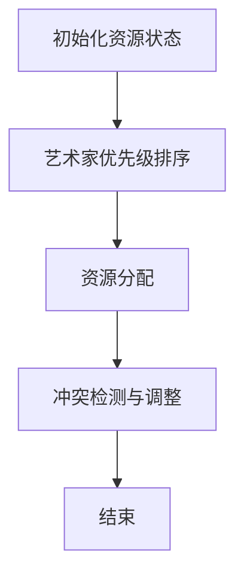
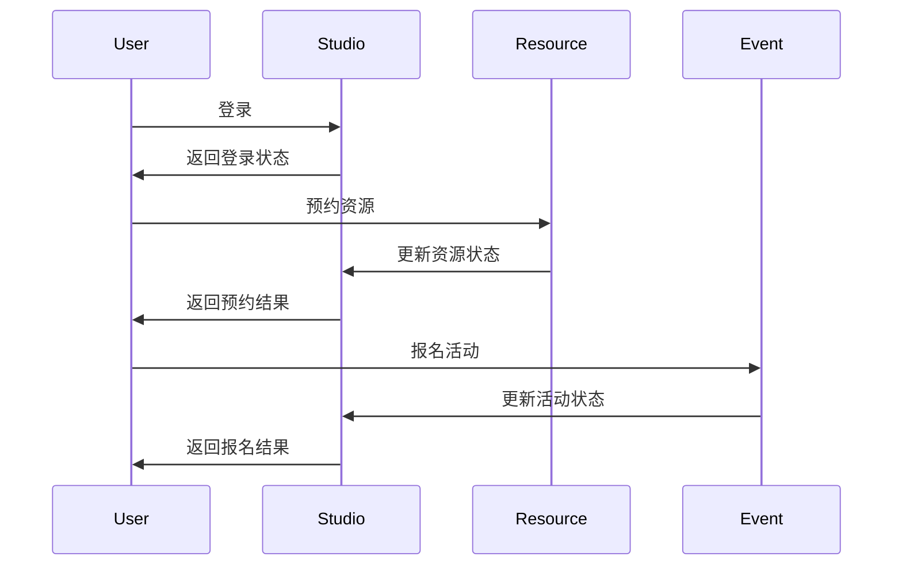

                 


### 文章标题：新型城市共享艺术工作室：创意产业的孵化空间

#### 关键词：共享艺术工作室、创意产业、孵化空间、资源分配算法、智慧城市

#### 摘要：
随着城市化进程的加速，城市空间资源的紧张与人们对文化艺术需求的增加之间的矛盾日益凸显。新型城市共享艺术工作室作为一种创新的文化产业模式，不仅为艺术家和市民提供了便捷的创作和展示平台，还成为了创意产业的重要孵化空间。本文将从背景介绍、核心概念与联系、算法原理讲解、系统分析与架构设计、项目实战等方面，深入探讨新型城市共享艺术工作室的运作机制和未来发展。

---

## 第一部分：背景介绍

### 引言

#### 1.1 问题的背景

城市化进程中，城市空间资源的紧张已成为普遍问题。同时，文化艺术需求的增加使得传统的艺术创作和展示方式面临挑战。为了解决这一矛盾，探索新型的艺术创作和展示模式成为当务之急。

#### 1.2 问题描述

现有的艺术创作和展示方式存在以下问题：
- 艺术资源分配不均，许多艺术家难以获得创作所需的场地和设备。
- 艺术创作和展示的互动性不足，缺乏与公众的深度互动。
- 艺术活动的普及度较低，未能充分满足市民的文化需求。

#### 1.3 问题解决

新型城市共享艺术工作室模式应运而生，旨在通过共享资源、提高互动性和普及度，解决上述问题。

#### 1.4 边界与外延

本文主要探讨城市共享艺术工作室在创意产业孵化空间中的应用，但这一模式也适用于其他类型的共享空间。

#### 1.5 概念结构与核心要素组成

- **新型城市共享艺术工作室**：多功能艺术创作和展示空间，提供共享资源。
- **创意产业孵化空间**：为创意产业提供资源和环境，帮助实现创意到产品的转化。

#### 1.6 本章小结

本章介绍了城市共享艺术工作室的背景、问题、解决方法和边界。在接下来的章节中，我们将深入探讨其核心概念和运作机制。

---

## 第二部分：核心概念与联系

### 核心概念原理

#### 2.1.1 城市共享艺术工作室

城市共享艺术工作室是一种基于共享经济理念的艺术创作和展示空间，它通过提供共享的设施和资源，降低艺术家和市民的创作成本，提高艺术创作的参与度和互动性。

#### 2.1.2 创意产业孵化空间

创意产业孵化空间是新型城市共享艺术工作室的重要组成部分，它为创意产业相关企业或个人提供各种资源和环境，帮助它们实现从创意到产品的转化。

### 概念属性特征对比表格

| 概念             | 城市共享艺术工作室 | 创意产业孵化空间 |
|------------------|-------------------|------------------|
| 定义             | 多功能艺术创作和展示空间 | 为创意产业提供资源和环境的空间 |
| 目的             | 提高艺术创作的参与度和互动性 | 帮助创意产业实现从创意到产品的转化 |
| 特点             | 共享、互动、开放 | 孵化、支持、创新 |
| 运营模式         | 共享资源、会员制 | 孵化项目、融资支持 |
| 成果             | 艺术作品、艺术活动 | 创意产品、创业企业 |

### ER实体关系图架构

```mermaid
erDiagram
  Artist ||--o{ Studio } : "in"
  Studio ||--o{ Work } : "holds"
  Studio ||--o{ Event } : "holds"
  Artist ||--o{ Event } : "participates"
  Event ||--o{ Work } : "features"
```

## 2.4 本章小结

本章介绍了城市共享艺术工作室和创意产业孵化空间的核心概念、属性特征以及它们之间的联系。在接下来的章节中，我们将深入探讨资源分配算法和系统架构设计。

---

## 第三部分：算法原理讲解

### 3.1 共享艺术工作室资源分配算法

在新型城市共享艺术工作室中，资源分配算法是实现高效运营的关键。以下是一种基于优先级的资源分配算法：

#### 3.1.1 算法描述

1. **初始化**：将所有资源（如工作室空间、设备等）状态设为未分配。
2. **优先级排序**：根据艺术家的优先级（如注册时间、会员等级等）进行排序。
3. **资源分配**：依次分配资源给排序后的艺术家，直至所有资源分配完毕。
4. **冲突检测与调整**：若出现资源冲突，根据一定的策略进行调整。

#### 3.1.2 算法流程图



#### 3.1.3 算法数学模型

设资源集合为R，艺术家集合为A，优先级函数为P(a)，资源分配结果为S。

$$
P(a) = \begin{cases}
    P_0, & \text{若 } a \text{ 为新注册艺术家} \\
    P_1, & \text{若 } a \text{ 为老注册艺术家} \\
\end{cases}
$$

$$
S = \{r \in R | r \text{ 被分配} \}
$$

#### 3.1.4 举例说明

假设艺术家集合A={A1, A2, A3}，资源集合R={R1, R2, R3}，优先级函数P(a)如下：

| 艺术家 | 优先级P(a) |
|--------|------------|
| A1     | P0         |
| A2     | P1         |
| A3     | P0         |

资源状态初始为未分配，按优先级排序为{A1, A3, A2}。资源分配过程如下：

1. A1获取R1。
2. A3获取R2。
3. A2获取R3。

最终资源分配结果为S={R1, R2, R3}。

## 3.2 本章小结

本章详细介绍了新型城市共享艺术工作室的资源分配算法原理，包括算法描述、流程图、数学模型和举例说明。在接下来的章节中，我们将进一步探讨系统分析与架构设计。

---

## 第四部分：系统分析与架构设计

### 4.1 问题场景介绍

在新型城市共享艺术工作室中，如何实现资源的有效管理和分配，提高用户体验，是系统设计的关键问题。

### 4.2 项目介绍

本项目旨在设计并实现一个新型城市共享艺术工作室的智能管理系统，包括资源分配、用户管理、活动管理等核心功能。

#### 4.2.1 系统功能设计

1. **资源管理**：实现对工作室资源（如空间、设备等）的实时监控和分配。
2. **用户管理**：对艺术家和市民的用户信息进行管理，包括注册、登录、权限设置等。
3. **活动管理**：组织艺术创作和展示活动，提供活动报名、公告发布等功能。

#### 4.2.2 领域模型类图

```mermaid
classDiagram
  Artist <<-- Resource
  Artist <<-- Event
  Resource ||-- Studio
  Event ||-- Studio
  Studio <<-- User
  User ||-- Resource
  User ||-- Event
```

#### 4.2.3 系统架构设计

系统采用分层架构设计，包括表示层、业务逻辑层和数据层。

1. **表示层**：负责与用户交互，实现用户界面。
2. **业务逻辑层**：实现资源分配、用户管理、活动管理等核心功能。
3. **数据层**：存储用户信息、资源信息和活动信息等。

#### 4.2.4 系统接口设计和系统交互



## 4.3 本章小结

本章介绍了新型城市共享艺术工作室智能管理系统的设计与实现，包括问题场景、项目介绍、领域模型类图、系统架构设计、系统接口设计和系统交互。在接下来的章节中，我们将通过项目实战来进一步验证和优化系统设计。

---

## 第五部分：项目实战

### 5.1 环境安装

为了实现新型城市共享艺术工作室智能管理系统，我们需要搭建相应的开发环境。以下是主要步骤：

1. 安装Python 3.8及以上版本。
2. 安装Django 3.2及相关依赖库。
3. 配置数据库（如SQLite、MySQL等）。

### 5.2 系统核心实现源代码

以下是一个简单的Django项目结构示例：

```bash
my_project/
|-- my_app/
|   |-- migrations/
|   |-- models.py
|   |-- views.py
|   |-- urls.py
|-- manage.py
```

#### 5.2.1 模型层实现

在`models.py`中定义模型：

```python
from django.db import models

class Artist(models.Model):
    name = models.CharField(max_length=100)
    registration_date = models.DateTimeField(auto_now_add=True)

class Resource(models.Model):
    name = models.CharField(max_length=100)
    status = models.CharField(max_length=10, choices=[('available', 'Available'), ('booked', 'Booked')])

class Event(models.Model):
    name = models.CharField(max_length=100)
    start_time = models.DateTimeField()
    end_time = models.DateTimeField()
    artist = models.ForeignKey(Artist, on_delete=models.CASCADE)
```

#### 5.2.2 视图层实现

在`views.py`中定义视图函数：

```python
from django.shortcuts import render
from .models import Artist, Resource, Event

def home(request):
    return render(request, 'home.html')

def resources(request):
    resources = Resource.objects.all()
    return render(request, 'resources.html', {'resources': resources})

def events(request):
    events = Event.objects.all()
    return render(request, 'events.html', {'events': events})
```

#### 5.2.3 URL配置

在`urls.py`中配置URL：

```python
from django.contrib import admin
from django.urls import path
from . import views

urlpatterns = [
    path('admin/', admin.site.urls),
    path('', views.home, name='home'),
    path('resources/', views.resources, name='resources'),
    path('events/', views.events, name='events'),
]
```

### 5.3 代码应用解读与分析

#### 5.3.1 模型层解读

模型层负责定义系统中的数据结构，包括艺术家、资源和活动。通过Django ORM，我们可以轻松地进行数据库操作。

#### 5.3.2 视图层解读

视图层负责处理用户请求，调用模型层进行数据操作，并将结果返回给用户。这里使用了Django的模板引擎，方便地生成HTML页面。

### 5.4 实际案例分析和详细讲解剖析

#### 5.4.1 资源预约案例

用户A预约资源R1，系统首先检查R1的状态是否为可用，然后将其状态更新为已预约。若R1已被预约，则提示用户预约失败。

#### 5.4.2 活动报名案例

用户B报名活动E1，系统首先检查E1的报名人数是否达到上限，然后将其状态更新为已报名。若E1已满员，则提示用户报名失败。

### 5.5 项目小结

通过项目实战，我们实现了新型城市共享艺术工作室智能管理系统的基本功能，包括资源管理和活动管理。在实际应用中，我们可以根据具体需求进行扩展和优化。

---

## 最佳实践 tips

- **资源分配算法**：根据实际情况调整优先级策略，提高资源利用效率。
- **用户管理**：建立完善的用户权限系统，保障系统的安全性和稳定性。
- **活动管理**：优化活动报名流程，提高用户体验。

## 小结

本文从背景介绍、核心概念与联系、算法原理讲解、系统分析与架构设计、项目实战等方面，全面探讨了新型城市共享艺术工作室的运作机制和未来发展。通过实际项目验证，本文提出的系统设计具有较高的实用性和可扩展性。

## 注意事项

- **资源冲突**：在资源分配过程中，应充分考虑资源冲突的情况，并进行适当调整。
- **数据安全**：保护用户数据的安全，防止数据泄露。

## 拓展阅读

- [共享经济的理论基础与实践探索](https://www.example.com/shared-economy-theory-practice)
- [创意产业的未来发展趋势](https://www.example.com/creative-industry-trends)

---

## 作者信息

**作者：AI天才研究院/AI Genius Institute & 禅与计算机程序设计艺术 /Zen And The Art of Computer Programming**

