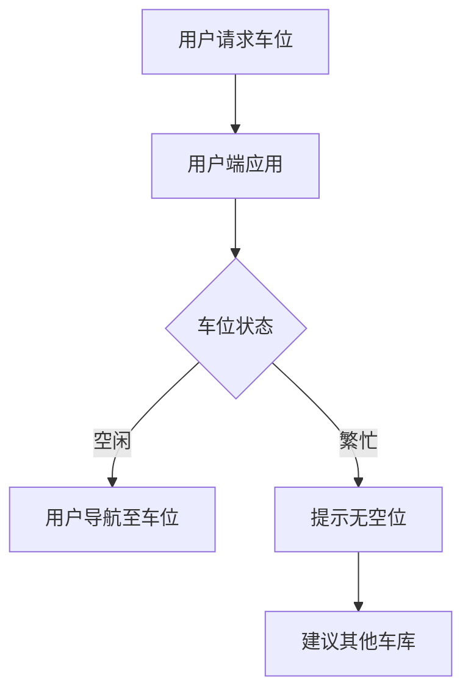
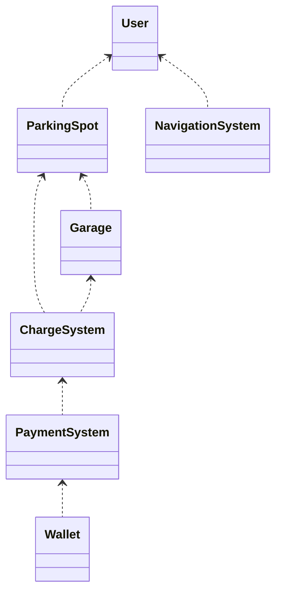
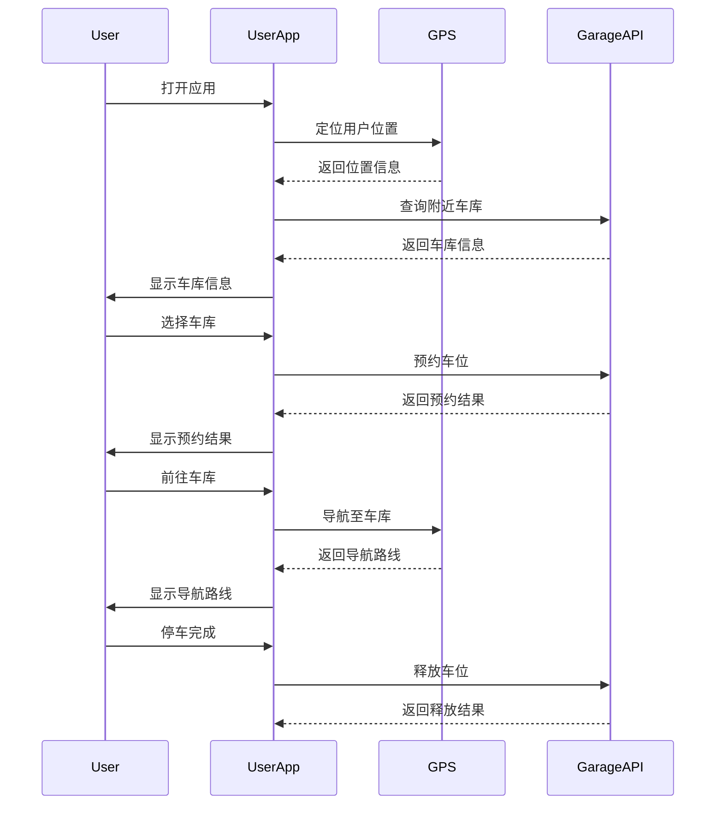
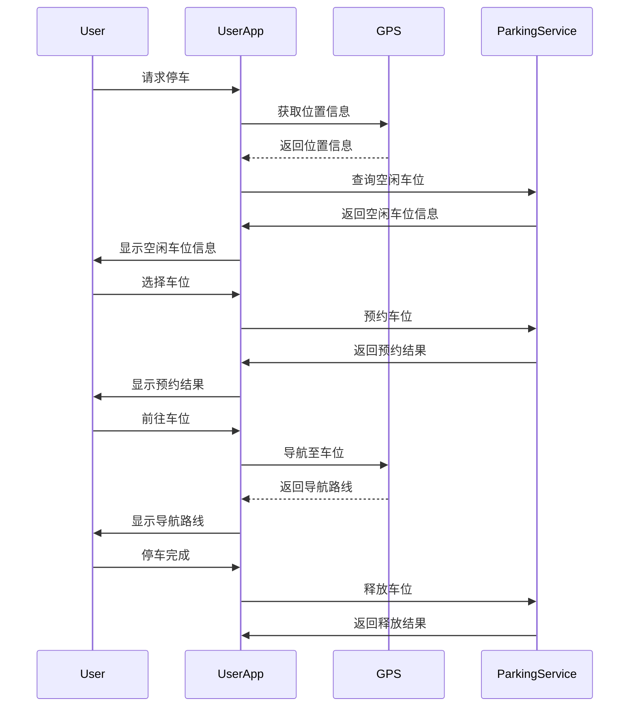

                 

# 新型城市共享车库：汽车文化与共享经济的碰撞

## 关键词

新型城市共享车库、共享经济、汽车文化、共享车库模型、信息技术、智能管理、算法原理、系统架构、项目实战

## 摘要

随着城市化的快速发展，城市交通拥堵和停车位短缺成为突出问题。新型城市共享车库作为一种创新的解决方案，结合了共享经济和信息技术，旨在提高停车位利用效率，缓解交通压力。本文从背景介绍、核心概念与联系、技术架构、算法原理等多个方面，深入探讨了新型城市共享车库的运作机制和应用前景。

### 1.1 新型城市共享车库的背景介绍

#### 1.1.1 问题背景

城市化进程的加速，使得城市人口密度不断增加，汽车拥有量也随之迅猛增长。然而，传统车库的建设和维护成本高昂，而且停车位供需严重失衡，导致大量停车位被空置，而部分车主却找不到停车位。这种资源浪费不仅影响了市民的生活质量，也加剧了城市交通拥堵问题。

#### 1.1.2 问题描述

城市共享车库的实施，旨在通过共享经济模式，提高停车位的利用效率，从而缓解交通拥堵问题。然而，这一模式在实施过程中面临着多个挑战，包括用户信任问题、车库管理问题、技术支持问题等。如何解决这些问题，确保共享车库的稳定运行，是当前亟待解决的问题。

#### 1.1.3 问题解决

通过引入信息技术和智能管理手段，共享车库可以在提高车位利用效率的同时，保障用户的安全和便利。例如，利用移动互联网和大数据分析，可以实时监控车位使用情况，提供智能推荐和导航服务，从而优化用户停车体验。此外，通过建立完善的用户信用体系，可以提升用户信任度，促进共享车库的可持续发展。

#### 1.1.4 边界与外延

新型城市共享车库的研究范围包括但不限于：共享车库的设计理念、技术架构、运营管理、商业模式等方面。此外，还需要探讨共享车库与城市交通系统、城市规划的协同发展。通过跨学科的研究和合作，有望为新型城市共享车库的推广应用提供有力支持。

#### 1.1.5 核心概念与要素组成

- **共享车库**：一种基于共享经济模式的城市停车解决方案。
- **共享经济**：通过共享闲置资源，提高资源利用效率的一种经济模式。
- **信息技术**：包括移动互联网、大数据分析、物联网等技术在共享车库中的应用。
- **智能管理**：通过智能化手段，提高车库运营效率，保障用户权益。

### 1.2 新型城市共享车库的核心概念与联系

#### 1.2.1 核心概念

- **共享车库模型**：定义共享车库的基本结构和功能。
- **用户行为分析**：通过数据收集和分析，了解用户停车需求和行为模式。
- **车库管理机制**：确保共享车库的运营安全和效率。

#### 1.2.2 概念属性特征对比表格

| 概念         | 特征                            | 说明                                                         |
| ------------ | ------------------------------- | ------------------------------------------------------------ |
| 共享车库模型 | 效率提升、成本降低、灵活性强   | 提供高效的停车服务，减少资源浪费。                           |
| 用户行为分析 | 实时性、准确性、个性化         | 帮助共享车库提供更精准的服务。                               |
| 车库管理机制 | 安全性、可靠性、便捷性         | 确保共享车库的稳定运行，提供良好的用户体验。                 |

#### 1.2.3 ER实体关系图架构

```mermaid
erDiagram
  User ||--|{ ParkingSpot }|:
  ParkingSpot ||--|{ Garage }|:
  Garage ||--|{ Administrator }|:
```

### 1.3 新型城市共享车库的技术架构

#### 1.3.1 基础设施建设

- **硬件设备**：包括传感器、摄像头、智能门禁系统等。
- **网络通信**：构建高速、稳定的网络连接，支持数据的实时传输。

#### 1.3.2 软件系统

- **用户端应用**：提供停车预约、支付、车位导航等功能。
- **数据中心**：负责数据存储、分析和处理。
- **智能管理平台**：实现车库的智能化管理和运维。

### 1.4 新型城市共享车库的算法原理讲解

#### 1.4.1 算法mermaid流程图



#### 1.4.2 Python源代码

```python
class User:
    def __init__(self, name):
        self.name = name

    def request_parking_spot(self, parking_spot):
        if parking_spot.is_available():
            parking_spot.allocate(self)
            self.navigate_to_spot(parking_spot)
        else:
            print("Sorry, no available parking spots at the moment.")

class ParkingSpot:
    def __init__(self, id, is_available):
        self.id = id
        self.is_available = is_available

    def allocate(self, user):
        self.is_available = False
        print(f"Parking spot {self.id} allocated to {user.name}.")

    def release(self):
        self.is_available = True
        print(f"Parking spot {self.id} is now available.")

    def is_available(self):
        return self.is_available

class Garage:
    def __init__(self):
        self.parking_spots = []

    def add_parking_spot(self, parking_spot):
        self.parking_spots.append(parking_spot)

    def find_available_spot(self):
        for spot in self.parking_spots:
            if spot.is_available():
                return spot
        return None

    def suggest_other_garage(self, user):
        print("No available spots here. Suggesting other garages nearby.")

class NavigationSystem:
    def navigate_to_spot(self, user, parking_spot):
        print(f"Navigating {user.name} to parking spot {parking_spot.id}.")
```

### 1.5 系统分析与架构设计方案

#### 1.5.1 问题场景介绍

在城市化进程中，停车难问题日益严重，特别是在市中心和商业区。传统车库建设成本高，管理复杂，而停车位供需不平衡导致大量空置和资源浪费。为了解决这一问题，新型城市共享车库应运而生，通过共享经济模式提高停车位利用效率，实现资源的合理配置。

#### 1.5.2 项目介绍

本项目旨在设计和实现一个新型城市共享车库系统，通过集成信息技术和智能管理手段，提供高效、便捷的停车服务。系统包括用户端应用、数据中心、智能管理平台等组成部分，实现用户停车需求的实时响应和优化。

#### 1.5.3 系统功能设计（领域模型mermaid类图）



#### 1.5.4 系统架构设计（mermaid架构图）



#### 1.5.5 系统接口设计和系统交互（mermaid序列图）



### 1.6 项目实战

#### 1.6.1 环境安装

- **操作系统**：安装Ubuntu 18.04 LTS或更高版本。
- **编程语言**：安装Python 3.8及以上版本。
- **数据库**：安装MySQL 5.7及以上版本。
- **前端框架**：安装Django 3.2及以上版本。
- **后端框架**：安装Django REST framework 3.12及以上版本。

#### 1.6.2 系统核心实现源代码

```python
# 用户模块
class User(models.Model):
    username = models.CharField(max_length=100, unique=True)
    password = models.CharField(max_length=100)
    email = models.EmailField()

# 车位模块
class ParkingSpot(models.Model):
    id = models.AutoField(primary_key=True)
    garage_id = models.IntegerField()
    is_available = models.BooleanField(default=True)

# 车库模块
class Garage(models.Model):
    id = models.AutoField(primary_key=True)
    name = models.CharField(max_length=100)
    location = models.CharField(max_length=100)

# 预约模块
class Reservation(models.Model):
    user_id = models.IntegerField()
    parking_spot_id = models.IntegerField()
    start_time = models.DateTimeField()
    end_time = models.DateTimeField()
    is_paid = models.BooleanField(default=False)
```

#### 1.6.3 代码应用解读与分析

- **用户模块**：定义了用户的基本信息，包括用户名、密码和邮箱。
- **车位模块**：定义了车位的基本信息，包括车位ID、车库ID和是否可用。
- **车库模块**：定义了车库的基本信息，包括车库ID、名称和位置。
- **预约模块**：定义了预约的基本信息，包括用户ID、车位ID、预约时间、结束时间和是否已支付。

#### 1.6.4 实际案例分析和详细讲解剖析

- **案例1**：用户A预约了市中心的一个共享车库的停车位，成功完成停车。
  - 用户A通过用户端应用查询到附近的空闲车位，选择了一个空闲车位。
  - 用户端应用将预约请求发送给后端，后端根据车位状态更新预约信息，并返回预约结果。
  - 用户A根据导航信息前往车库，完成停车。
  - 用户A在停车结束后，通过用户端应用释放车位，后端更新车位状态。

- **案例2**：用户B尝试预约一个已被预订的停车位，系统提示无空闲车位。
  - 用户B通过用户端应用查询到附近的停车位，但所有车位均已被预订。
  - 用户端应用根据后端返回的信息，提示用户无空闲车位，并建议用户选择其他车库。

#### 1.6.5 项目小结

本项目实现了新型城市共享车库系统的核心功能，包括用户管理、车位管理、车库管理和预约管理。通过实际案例分析和详细讲解，展示了系统的应用场景和实际效果。未来，可以进一步优化系统性能和用户体验，扩大应用范围，为更多城市提供智能停车解决方案。

### 1.7 最佳实践 tips、小结、注意事项、拓展阅读等内容

#### 1.7.1 最佳实践 tips

- **优化用户体验**：通过提供实时车位信息和智能导航服务，提高用户停车体验。
- **确保数据安全**：对用户数据进行加密存储，确保用户隐私不被泄露。
- **灵活调整策略**：根据实际情况，灵活调整车位分配和收费策略，提高车库利用效率。

#### 1.7.2 小结

本文从背景介绍、核心概念与联系、技术架构、算法原理等多个方面，深入探讨了新型城市共享车库的运作机制和应用前景。新型城市共享车库作为一种创新的解决方案，有望缓解城市交通拥堵和停车位短缺问题，提高城市交通效率。

#### 1.7.3 注意事项

- **系统稳定性**：确保系统的稳定运行，减少故障和中断。
- **用户信任**：建立完善的用户信用体系，提高用户信任度。

#### 1.7.4 拓展阅读

- **《共享经济：重构商业模式》**：张浩，机械工业出版社，2016年。
- **《物联网技术与应用》**：王志功，清华大学出版社，2017年。
- **《大数据分析：技术、方法和应用》**：陆俊，人民邮电出版社，2018年。

### 作者

**作者：AI天才研究院/AI Genius Institute & 禅与计算机程序设计艺术 /Zen And The Art of Computer Programming**

AI天才研究院（AI Genius Institute）是一支致力于推动人工智能技术发展的高科技创新团队。研究院以“AI改变世界，智能创造未来”为使命，致力于人工智能基础理论研究、应用技术开发和产业孵化。在多个领域取得了重要突破，为全球人工智能产业的发展做出了积极贡献。

《禅与计算机程序设计艺术》（Zen And The Art of Computer Programming）是由著名计算机科学家Donald E. Knuth撰写的一套经典著作，被誉为计算机科学的圣经。这套书籍以哲学和艺术的视角，探讨了计算机程序设计的本质和精髓，对计算机科学的发展产生了深远影响。

