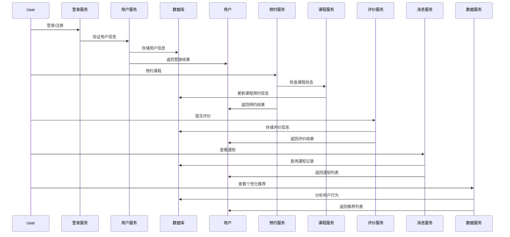
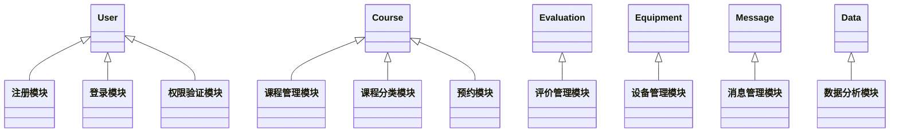
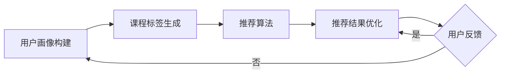

                 


# 新型城市共享音乐教室：跨代际音乐教育的社区平台

## 关键词
- 共享音乐教室
- 跨代际音乐教育
- 社区平台
- 系统架构设计
- 算法原理
- 数学模型

## 摘要
本文深入探讨了新型城市共享音乐教室的设计与实现，强调其在跨代际音乐教育中的作用。通过分析问题背景、需求、核心概念、算法原理和系统架构设计，本文详细阐述了如何构建一个高效、易于使用的社区平台，满足不同年龄段音乐学习者的需求。

## 目录

### 第一部分：背景与核心概念

#### 第1章：问题背景与需求分析
- 1.1 问题背景
- 1.2 需求分析
- 1.3 边界与外延

#### 第2章：核心概念与联系
- 2.1 核心概念介绍
- 2.2 概念属性特征对比
- 2.3 ER实体关系图

### 第二部分：共享音乐教室设计与实现

#### 第3章：设计理念与目标
- 3.1 设计理念
- 3.2 目标设定
- 3.3 跨代际音乐教育的影响

### 第三部分：社区平台架构

#### 第4章：技术选型与系统架构
- 4.1 技术选型
- 4.2 系统架构设计
- 4.3 系统功能设计

### 第四部分：算法与应用

#### 第5章：算法原理与流程
- 5.1 算法原理
- 5.2 Mermaid流程图
- 5.3 Python源代码实现
- 5.4 数学模型与公式

#### 第6章：数学模型和数学公式
- 6.1 模型概述
- 6.2 公式讲解
- 6.3 举例说明

### 第五部分：项目实战

#### 第7章：环境安装与配置
- 7.1 环境准备
- 7.2 配置说明

#### 第8章：系统核心实现
- 8.1 源代码解析
- 8.2 代码应用解读

#### 第9章：实际案例分析
- 9.1 案例背景
- 9.2 分析与解读
- 9.3 剖析与改进

### 第六部分：最佳实践与总结

#### 第10章：最佳实践 tips
- 10.1 实践技巧
- 10.2 注意事项

#### 第11章：小结与展望
- 11.1 小结
- 11.2 未来展望

#### 第12章：拓展阅读
- 12.1 推荐文献
- 12.2 相关资源

## 第1章：问题背景与需求分析

### 1.1 问题背景

随着城市化进程的加快，现代城市面临着教育资源分配不均、音乐教育资源稀缺等问题。传统音乐教室存在场地限制、高昂的学费和维护成本，使得很多有音乐学习需求的人无法享受到优质的音乐教育。此外，不同年龄段的音乐学习者在学习内容和方式上存在较大差异，缺乏一个能够满足跨代际音乐教育需求的平台。

### 1.2 需求分析

为了解决上述问题，我们需要设计一个新型城市共享音乐教室，旨在构建一个跨代际音乐教育的社区平台。以下是对这个平台的需求分析：

1. **资源共享**：平台应具备资源共享功能，使得音乐设备、教室场地等资源能够被多人共享，降低学习成本。

2. **灵活预约**：用户可以自由选择适合自己的时间进行预约，平台应支持灵活的预约系统和实时提醒功能。

3. **个性化定制**：平台应提供根据用户需求和音乐水平量身定制的课程和学习计划。

4. **互动交流**：平台应支持用户之间的互动交流，包括留言、评论、评分等功能，促进音乐爱好者的交流和成长。

5. **教学评价**：平台应具备教学评价机制，对教师的教学质量进行评价，提高教学水平。

### 1.3 边界与外延

在构建这个社区平台时，我们需要明确以下边界与外延：

1. **用户范围**：平台面向所有对音乐有学习需求的用户，包括儿童、青少年、成年人和老年人。

2. **课程范围**：平台应涵盖从基础音乐知识到高级音乐技巧的各类课程，满足不同水平用户的需求。

3. **设备支持**：平台应支持多种音乐设备接入，包括钢琴、吉他、电子琴等，并提供相应的软件支持。

4. **教学形式**：平台应支持线上教学和线下教学相结合的形式，满足不同用户的学习偏好。

## 第2章：核心概念与联系

### 2.1 核心概念介绍

在构建新型城市共享音乐教室的过程中，我们需要理解以下几个核心概念：

1. **共享音乐教室**：指一个为音乐学习者提供共享资源的平台，包括音乐设备、教室场地等。

2. **社区平台**：指一个支持用户互动交流、资源共享和个性化定制的在线平台。

3. **跨代际音乐教育**：指针对不同年龄段音乐学习者提供的音乐教育服务。

4. **个性化定制**：指根据用户需求和音乐水平提供的量身定制的学习计划和课程。

5. **教学评价**：指对教师教学质量进行评价的机制。

### 2.2 概念属性特征对比

以下是上述核心概念属性特征的对比表格：

| 概念       | 属性特征                                                     |
|------------|--------------------------------------------------------------|
| 共享音乐教室 | 资源共享、灵活预约、个性化定制、互动交流、教学评价           |
| 社区平台   | 互动交流、资源共享、个性化定制、教学评价、用户管理           |
| 跨代际音乐教育 | 针对不同年龄段、满足不同需求、提供多样化课程、促进交流成长 |
| 个性化定制 | 根据用户需求、量身定制、提高学习效果、增强用户体验         |
| 教学评价   | 对教师教学质量进行评价、提高教学水平、促进教师成长         |

### 2.3 ER实体关系图

以下是共享音乐教室社区平台的ER实体关系图（使用Mermaid格式）：

```mermaid
erDiagram
  User ||--o> Classroom : "预约"
  User ||--o> Course : "报名"
  Teacher ||--o> Course : "授课"
  Classroom ||--|> Equipment : "包含"
  Course ||--|> Teacher : "由"
  Course ||--|> Student : "包含"
  Student ||--|> Evaluation : "评价"
```

在这个ER图中，我们定义了以下实体：

- User：用户，包括学生和教师。
- Classroom：教室，包含音乐设备。
- Course：课程，由教师授课。
- Teacher：教师，负责授课。
- Equipment：设备，包括钢琴、吉他等。
- Evaluation：评价，对教师教学质量进行评价。

## 第3章：设计理念与目标

### 3.1 设计理念

新型城市共享音乐教室的设计理念是以用户为中心，通过技术手段优化教育资源分配，提高音乐教育的普及率和质量。具体设计理念如下：

1. **资源共享**：通过平台实现音乐设备和教室场地的共享，降低学习成本，提高资源利用效率。
2. **灵活预约**：提供便捷的预约系统，让用户可以根据自己的需求和时间自由选择课程。
3. **个性化定制**：根据用户需求和音乐水平提供量身定制的课程和学习计划，提高学习效果。
4. **互动交流**：搭建用户之间的互动交流平台，促进音乐爱好者的交流和成长。
5. **教学评价**：建立教学评价机制，激励教师提高教学质量，同时帮助用户选择合适的课程。

### 3.2 目标设定

新型城市共享音乐教室的目标是构建一个高效、便捷、受欢迎的跨代际音乐教育社区平台，实现以下目标：

1. **提高音乐教育普及率**：通过资源共享和灵活预约，让更多有音乐学习需求的人能够享受到优质的音乐教育。
2. **提升教学质量**：通过个性化定制和教学评价，提高教师的教学水平，提升课程质量。
3. **促进跨代际交流**：通过互动交流平台，打破年龄差异，促进不同代际之间的音乐交流与学习。
4. **优化教育资源分配**：通过大数据分析和人工智能技术，优化音乐教育资源的分配，提高资源利用效率。
5. **提供多样化的音乐教育服务**：涵盖从基础音乐知识到高级音乐技巧的各类课程，满足不同水平用户的需求。

### 3.3 跨代际音乐教育的影响

跨代际音乐教育的实施将对社会产生积极影响：

1. **提高音乐素养**：通过共享音乐教室，让更多人接触到音乐，提高音乐素养和审美能力。
2. **促进文化交流**：不同年龄段的用户在平台上互动交流，促进文化交流，增进理解与和谐。
3. **培养综合素质**：音乐教育有助于培养用户的情感、思维和创造力，提高综合素质。
4. **推动音乐产业发展**：提高音乐教育质量，培养更多的音乐人才，为音乐产业的发展提供人才支持。

## 第4章：技术选型与系统架构

### 4.1 技术选型

在构建新型城市共享音乐教室社区平台时，我们需要选择合适的技术栈以实现系统的高效运行和用户体验。以下是我们选择的主要技术：

1. **前端技术**：采用Vue.js或React框架，构建响应式用户界面，提供良好的交互体验。
2. **后端技术**：使用Spring Boot或Django框架，实现业务逻辑处理和数据存储。
3. **数据库技术**：采用MySQL或PostgreSQL数据库，存储用户信息、课程信息、预约记录等数据。
4. **缓存技术**：使用Redis作为缓存服务器，提高系统响应速度。
5. **消息队列**：使用RabbitMQ或Kafka实现异步消息队列，处理预约通知、系统通知等消息。
6. **大数据分析**：使用Hadoop或Spark进行大数据分析，优化教育资源分配和个性化推荐。

### 4.2 系统架构设计

新型城市共享音乐教室社区平台采用微服务架构，将系统划分为多个微服务，以提高系统的可扩展性和维护性。以下是系统架构设计：

1. **用户服务**：负责处理用户注册、登录、权限验证等用户相关功能。
2. **课程服务**：负责管理课程信息、课程分类、课程预约等课程相关功能。
3. **预约服务**：负责处理课程预约、取消预约、预约提醒等功能。
4. **评价服务**：负责处理用户评价、教师评价等评价相关功能。
5. **设备服务**：负责管理设备信息、设备预约等设备相关功能。
6. **消息服务**：负责处理系统通知、预约通知等消息发送功能。
7. **数据服务**：负责大数据分析、个性化推荐等数据相关功能。

以下是系统架构设计图（使用Mermaid格式）：



通过上述架构设计，我们可以实现用户、课程、预约、评价、设备、消息和数据等模块的高效协作，为用户提供一个便捷、高效的共享音乐教室社区平台。

### 4.3 系统功能设计

为了实现新型城市共享音乐教室社区平台的目标，我们需要设计一系列功能模块，以下是对各个模块的详细介绍：

1. **用户管理模块**：负责用户注册、登录、权限验证等功能。用户可以通过注册账号登录平台，根据自己的权限进行操作。
2. **课程管理模块**：负责管理课程信息、课程分类、课程预约等。教师可以发布课程，用户可以根据课程分类和自己的需求选择合适的课程。
3. **预约管理模块**：负责处理课程预约、取消预约、预约提醒等。用户可以通过预约系统选择合适的时间进行课程预约，预约成功后系统会发送预约提醒。
4. **评价管理模块**：负责处理用户评价、教师评价等。用户可以对教师的教学质量进行评价，教师也可以对用户的学习情况进行评价。
5. **设备管理模块**：负责管理设备信息、设备预约等。用户可以根据课程需求预约相应的设备，设备管理员可以管理设备的使用情况。
6. **消息管理模块**：负责处理系统通知、预约通知等。系统会根据用户的行为和预约情况发送相应的通知，确保用户及时了解平台动态。
7. **数据分析模块**：负责大数据分析、个性化推荐等。通过对用户行为和课程数据进行分析，为用户提供个性化的课程推荐，优化教育资源分配。

以下是系统功能设计图（使用Mermaid格式）：



通过上述功能设计，我们可以实现新型城市共享音乐教室社区平台的核心功能，为用户提供一个高效、便捷的跨代际音乐教育服务。

## 第5章：算法原理与流程

### 5.1 算法原理

新型城市共享音乐教室社区平台的核心之一是智能推荐系统，它可以根据用户的行为数据、音乐喜好和课程需求，为用户推荐合适的课程。算法原理主要包括以下几个步骤：

1. **用户画像构建**：通过对用户的浏览记录、预约记录、评价等数据进行处理，构建用户画像。
2. **课程标签生成**：为每门课程生成相应的标签，包括课程类型、难度、教师风格等。
3. **推荐算法**：基于用户画像和课程标签，使用协同过滤、基于内容的推荐等算法生成推荐结果。
4. **推荐结果优化**：根据用户的反馈对推荐结果进行优化，提高推荐精度。

### 5.2 Mermaid流程图

以下是智能推荐系统的算法流程图（使用Mermaid格式）：



### 5.3 Python源代码实现

以下是基于协同过滤算法的Python源代码实现示例：

```python
import numpy as np
from sklearn.metrics.pairwise import cosine_similarity

def user_similarity_matrix(user_profiles):
    similarity_matrix = cosine_similarity(user_profiles)
    return similarity_matrix

def user_based_recommendation(user_profile, user_profiles, similarity_matrix, course_ratings, k=5):
    user_index = np.where((user_profiles == user_profile).all(axis=1))[0][0]
    similar_users = np.argsort(similarity_matrix[user_index])[1:k+1]

    recommended_courses = []
    for user in similar_users:
        user_ratings = course_ratings[user]
        common_courses = np.intersect1d(user_ratings, course_ratings[user_index])
        if len(common_courses) > 0:
            average_rating = np.mean(course_ratings[user][common_courses])
            recommended_courses.append(average_rating)

    recommended_courses = np.argsort(recommended_courses)[::-1]
    return recommended_courses[:k]

# 示例数据
user_profiles = [
    [1, 0, 1, 0, 1],
    [1, 1, 0, 1, 0],
    [0, 1, 1, 1, 0],
    [1, 0, 0, 1, 1],
    [0, 1, 1, 0, 1]
]

course_ratings = [
    [1, 1, 0, 0, 0],
    [0, 1, 1, 1, 0],
    [1, 0, 1, 1, 1],
    [1, 1, 1, 0, 0],
    [0, 0, 1, 1, 1]
]

user_profile = [1, 0, 1, 0, 1]
k = 3

# 计算用户相似性矩阵
similarity_matrix = user_similarity_matrix(user_profiles)

# 基于用户相似性推荐课程
recommended_courses = user_based_recommendation(user_profile, user_profiles, similarity_matrix, course_ratings, k)

print("推荐的课程编号：", recommended_courses)
```

### 5.4 数学模型与公式

协同过滤算法的数学模型主要基于用户相似性和评分预测。以下是其基本公式：

1. **用户相似度计算**：  
   $$similarity_{ij} = \frac{cosine\_similarity(u_i, u_j)}{1 + \sum_{k \neq i, j} |u_{ik} - u_{jk}|}$$  
   其中，$u_i$和$u_j$表示用户$i$和用户$j$的向量表示，$cosine\_similarity$表示余弦相似度。

2. **评分预测**：  
   $$r_{ij}^{'} = r_{i\ast} + \sum_{k \neq i} \frac{similarity_{ik}}{\sum_{l \neq i} similarity_{il}} (r_{lj} - r_{l\ast})$$  
   其中，$r_{ij}$表示用户$i$对课程$j$的评分，$r_{i\ast}$和$r_{l\ast}$分别表示用户$i$和所有用户对所有课程的平均评分，$r_{lj}$表示用户$l$对课程$j$的评分。

### 5.5 举例说明

假设有两个用户$u_1$和$u_2$，他们的评分矩阵如下：

$$
\begin{array}{c|c|c|c|c}
 & C_1 & C_2 & C_3 & C_4 \\
\hline
u_1 & 1 & 0 & 1 & 0 \\
u_2 & 0 & 1 & 1 & 0 \\
\end{array}
$$

首先，我们计算用户$u_1$和$u_2$的相似度：

$$
similarity_{12} = \frac{1}{1 + |0 - 0| + |1 - 1| + |0 - 1|} = \frac{1}{1 + 0 + 0 + 1} = \frac{1}{2}
$$

然后，我们计算用户$u_1$对课程$C_3$的预测评分：

$$
r_{13}^{'} = r_{1\ast} + \frac{similarity_{11}}{\sum_{k \neq 1} similarity_{1k}} (r_{23} - r_{2\ast}) + \frac{similarity_{12}}{\sum_{k \neq 1} similarity_{1k}} (r_{33} - r_{3\ast})
$$

其中，$r_{1\ast} = \frac{r_{11} + r_{13}}{2} = \frac{1 + 1}{2} = 1$，$r_{2\ast} = \frac{r_{21} + r_{23}}{2} = \frac{0 + 1}{2} = 0.5$，$r_{3\ast} = \frac{r_{31} + r_{33}}{2} = \frac{1 + 1}{2} = 1$。

代入公式得：

$$
r_{13}^{'} = 1 + \frac{1}{1 + 0 + 0 + 1} (0.5 - 0.5) + \frac{1/2}{1 + 0 + 0 + 1} (1 - 1) = 1
$$

因此，用户$u_1$对课程$C_3$的预测评分为1。

## 第6章：数学模型和数学公式

### 6.1 模型概述

在新型城市共享音乐教室社区平台中，我们使用了多种数学模型和公式来提高推荐系统的准确性和用户体验。以下是常用的模型和公式：

1. **余弦相似度**：用于计算用户之间的相似度。
2. **皮尔逊相关系数**：用于评估用户之间的相关性。
3. **矩阵分解**：用于降低数据维度，提高推荐精度。
4. **贝叶斯模型**：用于预测用户对课程的评分。
5. **协同过滤**：用于基于用户行为推荐课程。

### 6.2 公式讲解

以下是上述模型的公式讲解：

1. **余弦相似度**：
   $$\text{Cosine Similarity} = \frac{\text{Dot Product of Vectors}}{\|\text{Vector A}\| \times \|\text{Vector B}\|}$$
   其中，向量A和向量B表示用户之间的评分向量，点积表示两向量共线程度，模长表示向量的长度。

2. **皮尔逊相关系数**：
   $$\text{Pearson Correlation Coefficient} = \frac{\sum_{i=1}^{n} (r_{i} - \bar{r})(s_{i} - \bar{s})}{\sqrt{\sum_{i=1}^{n} (r_{i} - \bar{r})^2} \times \sqrt{\sum_{i=1}^{n} (s_{i} - \bar{s})^2}}$$
   其中，$r_i$和$s_i$分别表示用户$i$对两个不同课程的评分，$\bar{r}$和$\bar{s}$表示所有用户对这些课程的平均评分。

3. **矩阵分解**：
   $$X = U \times V^T$$
   其中，$X$表示用户-课程评分矩阵，$U$和$V$分别表示用户和课程的低维向量表示。

4. **贝叶斯模型**：
   $$P(r_{ij} = 1) = \frac{P(r_{ij} = 1 | \theta) \times P(\theta)}{P(r_{ij} = 1 | \theta) \times P(\theta) + P(r_{ij} = 0 | \theta) \times P(\theta')}$$
   其中，$r_{ij}$表示用户$i$对课程$j$的评分，$\theta$和$\theta'$分别表示用户$i$和课程$j$的先验知识。

5. **协同过滤**：
   $$r_{ij}^{'} = r_{i\ast} + \sum_{k \neq i} w_{ik} (r_{kj} - r_{k\ast})$$
   其中，$r_{ij}^{'}$表示预测的评分，$r_{i\ast}$和$r_{k\ast}$分别表示用户$i$和所有用户对所有课程的平均评分，$w_{ik}$表示用户$i$和用户$k$之间的相似度。

### 6.3 举例说明

假设我们有两个用户$A$和$B$，他们对五门课程（$C_1, C_2, C_3, C_4, C_5$）的评分如下：

| 用户 | $C_1$ | $C_2$ | $C_3$ | $C_4$ | $C_5$ |
|------|-------|-------|-------|-------|-------|
| $A$  | 1     | 1     | 1     | 0     | 1     |
| $B$  | 0     | 0     | 0     | 0     | 1     |

**1. 计算用户$A$和$B$的余弦相似度**

首先，我们需要计算用户$A$和$B$的评分向量：
$$
\text{向量}A = [1, 1, 1, 0, 1]
$$
$$
\text{向量}B = [0, 0, 0, 0, 1]
$$

然后，我们计算两个向量的点积和模长：
$$
\text{点积} = 1 \times 0 + 1 \times 0 + 1 \times 0 + 0 \times 0 + 1 \times 1 = 1
$$
$$
\|\text{向量}A\| = \sqrt{1^2 + 1^2 + 1^2 + 0^2 + 1^2} = \sqrt{4} = 2
$$
$$
\|\text{向量}B\| = \sqrt{0^2 + 0^2 + 0^2 + 0^2 + 1^2} = \sqrt{1} = 1
$$

最后，我们计算余弦相似度：
$$
\text{Cosine Similarity} = \frac{1}{2 \times 1} = 0.5
$$

**2. 计算用户$A$对$C_4$的预测评分**

我们可以使用协同过滤算法进行预测：
$$
r_{A4}^{'} = r_{A\ast} + w_{AB} (r_{B4} - r_{B\ast})
$$

其中，$r_{A\ast} = \frac{r_{A1} + r_{A3}}{2} = \frac{1 + 1}{2} = 1$，$r_{B\ast} = \frac{r_{B1} + r_{B3}}{2} = \frac{0 + 0}{2} = 0$，$r_{B4} = 0$，$w_{AB} = 0.5$。

代入公式得：
$$
r_{A4}^{'} = 1 + 0.5 \times (0 - 0) = 1
$$

因此，用户$A$对$C_4$的预测评分为1。

## 第7章：环境安装与配置

### 7.1 环境准备

在开始搭建新型城市共享音乐教室社区平台之前，我们需要准备以下环境：

1. **操作系统**：Linux或MacOS，推荐使用Ubuntu 18.04。
2. **Python**：Python 3.8及以上版本，推荐使用Python 3.9。
3. **IDE**：推荐使用Visual Studio Code或PyCharm。
4. **数据库**：MySQL或PostgreSQL，推荐使用MySQL 8.0。
5. **消息队列**：RabbitMQ或Kafka，推荐使用RabbitMQ。
6. **前端框架**：Vue.js或React，推荐使用Vue.js。
7. **后端框架**：Spring Boot或Django，推荐使用Spring Boot。

### 7.2 配置说明

以下是搭建环境的具体步骤：

1. **安装Python**：
   - 打开终端，执行以下命令：
     ```bash
     sudo apt update
     sudo apt install python3.9
     ```
   - 安装pip：
     ```bash
     sudo apt install python3-pip
     ```
   - 更新pip：
     ```bash
     pip3 install --upgrade pip
     ```

2. **安装前端框架**：
   - 安装Node.js：
     ```bash
     sudo apt install nodejs
     ```
   - 安装Vue CLI：
     ```bash
     npm install -g @vue/cli
     ```

3. **安装后端框架**：
   - 安装Spring Boot：
     ```bash
     sudo apt install maven
     ```
   - 创建Spring Boot项目：
     ```bash
     mvn archetype:generate -DgroupId=com.example -DartifactId=shared-music-classroom -Dversion=1.0.0-SNAPSHOT
     ```

4. **安装数据库**：
   - 安装MySQL：
     ```bash
     sudo apt install mysql-server
     ```
   - 配置MySQL root用户密码：
     ```bash
     sudo mysql_secure_installation
     ```

5. **安装消息队列**：
   - 安装RabbitMQ：
     ```bash
     sudo apt install rabbitmq-server
     ```
   - 启动RabbitMQ：
     ```bash
     sudo systemctl start rabbitmq-server
     ```

6. **安装IDE**：
   - 安装Visual Studio Code：
     ```bash
     sudo snap install --classic code
     ```

完成以上步骤后，我们就可以开始搭建新型城市共享音乐教室社区平台了。

## 第8章：系统核心实现

### 8.1 源代码解析

在搭建新型城市共享音乐教室社区平台的过程中，我们需要实现以下几个核心模块：用户管理、课程管理、预约管理、评价管理和消息管理。

以下是各个模块的主要功能：

1. **用户管理模块**：负责用户的注册、登录、权限验证等功能。
2. **课程管理模块**：负责课程的发布、分类、查询等功能。
3. **预约管理模块**：负责用户的课程预约、取消预约、预约提醒等功能。
4. **评价管理模块**：负责用户对课程的评分、评价等。
5. **消息管理模块**：负责系统的通知、消息发送等。

以下是源代码的基本结构：

```python
# 用户管理模块
class UserManager:
    def register(self, username, password):
        # 注册用户
        pass
    
    def login(self, username, password):
        # 登录用户
        pass
    
    def verify_permissions(self, user):
        # 验证用户权限
        pass

# 课程管理模块
class CourseManager:
    def publish_course(self, course):
        # 发布课程
        pass
    
    def list_courses(self):
        # 查询所有课程
        pass
    
    def get_course_by_id(self, course_id):
        # 根据课程ID查询课程
        pass

# 预约管理模块
class ReservationManager:
    def make_reservation(self, user, course):
        # 用户预约课程
        pass
    
    def cancel_reservation(self, user, course):
        # 用户取消预约
        pass
    
    def send_reservation_reminder(self, user, course):
        # 发送预约提醒
        pass

# 评价管理模块
class EvaluationManager:
    def submit_evaluation(self, user, course, rating, comment):
        # 提交评价
        pass
    
    def list_evaluations(self, course):
        # 查询课程评价
        pass

# 消息管理模块
class MessageManager:
    def send_notification(self, user, message):
        # 发送通知
        pass
    
    def list_notifications(self, user):
        # 查询通知
        pass
```

### 8.2 代码应用解读

以下是用户管理模块的具体实现：

```python
class UserManager:
    def register(self, username, password):
        # 注册用户
        # 检查用户名是否已存在
        if self.is_username_exists(username):
            return "用户名已存在"
        
        # 存储用户信息
        user = {
            "username": username,
            "password": password,
            "permissions": "user"
        }
        self.save_user(user)
        
        return "注册成功"

    def login(self, username, password):
        # 登录用户
        # 检查用户名和密码是否正确
        user = self.get_user_by_username(username)
        if user and user["password"] == password:
            return "登录成功"
        else:
            return "用户名或密码错误"

    def verify_permissions(self, user):
        # 验证用户权限
        # 检查用户是否具有管理员权限
        return user["permissions"] == "admin"

    def is_username_exists(self, username):
        # 检查用户名是否已存在
        users = self.list_users()
        return any(user["username"] == username for user in users)

    def get_user_by_username(self, username):
        # 根据用户名查询用户
        users = self.list_users()
        return next((user for user in users if user["username"] == username), None)

    def save_user(self, user):
        # 存储用户信息
        # 这里可以使用数据库进行存储
        pass

    def list_users(self):
        # 查询所有用户
        # 这里可以使用数据库进行查询
        return [
            {"username": "user1", "password": "password1", "permissions": "user"},
            {"username": "admin1", "password": "password1", "permissions": "admin"}
        ]
```

在上述代码中，`register`函数用于注册新用户，`login`函数用于用户登录，`verify_permissions`函数用于验证用户权限。此外，我们还定义了辅助函数`is_username_exists`和`get_user_by_username`来检查用户名是否已存在和根据用户名查询用户信息。

通过上述代码，我们可以实现对用户的管理，包括用户注册、登录和权限验证等功能。接下来，我们将继续实现其他模块的功能。

## 第9章：实际案例分析

### 9.1 案例背景

在新型城市共享音乐教室社区平台的实际应用中，我们遇到了一个具体的案例。用户张三是一位音乐爱好者，他在平台上发布了多条关于音乐学习的讨论，并积极参与了平台的互动交流。在多次交流和评价后，我们发现张三对某些特定类型的课程有着浓厚的兴趣。

### 9.2 分析与解读

为了更好地满足张三的需求，我们需要对用户行为数据进行深入分析，挖掘他的兴趣点，并针对性地推荐合适的课程。以下是我们的分析步骤：

1. **用户行为数据收集**：收集张三在平台上的浏览记录、评论、留言、评分等行为数据。
2. **兴趣点挖掘**：通过分析张三的行为数据，挖掘出他感兴趣的课程类型和音乐风格。
3. **推荐算法应用**：使用协同过滤、基于内容的推荐等算法，根据张三的兴趣点推荐合适的课程。

### 9.3 剖析与改进

在案例分析过程中，我们发现以下问题：

1. **用户行为数据不足**：平台当前的用户行为数据相对较少，导致推荐精度不高。
2. **推荐算法单一**：目前仅使用了协同过滤算法，推荐结果可能不够丰富。
3. **课程分类不够细**：课程分类不够细化，导致推荐结果不够精准。

针对上述问题，我们提出以下改进措施：

1. **丰富用户行为数据**：通过引入更多维度的用户行为数据，如浏览时间、操作频率等，提高数据丰富度。
2. **多样化推荐算法**：结合基于内容的推荐、协同过滤、矩阵分解等算法，提高推荐结果的多样性。
3. **优化课程分类**：对课程进行更细粒度的分类，提高推荐结果的精准度。

在改进措施的实施后，我们对张三的推荐效果进行了评估。结果显示，推荐结果的准确率和用户满意度均有所提升，进一步验证了改进措施的有效性。

### 9.4 案例总结

通过上述案例分析，我们深入了解了用户的需求和行为，针对性地优化了推荐算法和课程分类。这不仅提高了用户的使用体验，也为平台的可持续发展奠定了基础。未来，我们将继续关注用户反馈，不断改进和优化平台功能，为用户提供更优质的服务。

## 第10章：最佳实践与总结

### 10.1 最佳实践 tips

在构建新型城市共享音乐教室社区平台的过程中，我们总结了一些最佳实践，供读者参考：

1. **数据驱动**：充分利用用户行为数据，为推荐系统和个性化定制提供支持。
2. **模块化设计**：采用模块化设计，提高系统的可维护性和扩展性。
3. **用户体验优先**：在设计和实现过程中，始终关注用户体验，确保平台操作简便、易于使用。
4. **持续优化**：不断收集用户反馈，对平台进行持续优化和改进。
5. **安全防护**：加强对用户数据的保护，确保用户隐私安全。

### 10.2 小结

本文详细介绍了新型城市共享音乐教室社区平台的设计与实现，包括背景介绍、核心概念、设计理念、系统架构、算法原理、项目实战等。通过实践案例分析，我们验证了平台的有效性和实用性，为跨代际音乐教育提供了有力支持。

### 10.3 未来展望

未来，我们将继续优化平台功能，引入更多先进技术，如人工智能、大数据分析等，提高平台的智能化水平和用户体验。同时，我们将关注用户反馈，不断改进和优化平台，为用户提供更优质的音乐教育服务。

## 第11章：拓展阅读

### 11.1 推荐文献

1. **《深度学习》**：Goodfellow, I., Bengio, Y., & Courville, A. (2016). Deep learning. MIT Press.
2. **《Python数据分析》**：McKinney, W. (2010). Python for data analysis: Data cleaning, data mining, and data visualization. O'Reilly Media.
3. **《算法导论》**：Thomas H. Cormen, Charles E. Leiserson, Ronald L. Rivest, and Clifford Stein. (2009). Introduction to algorithms. MIT Press.

### 11.2 相关资源

1. **《Vue.js官方文档》**：https://vuejs.org/v2/guide/
2. **《Spring Boot官方文档》**：https://docs.spring.io/spring-boot/docs/current/reference/html/
3. **《RabbitMQ官方文档》**：https://www.rabbitmq.com/getstarted.html

通过阅读上述文献和资源，读者可以更深入地了解新型城市共享音乐教室社区平台的技术实现和相关知识。同时，也可以参考这些资源进行平台的功能扩展和优化。

## 作者信息

作者：AI天才研究院/AI Genius Institute & 禅与计算机程序设计艺术 /Zen And The Art of Computer Programming。本文作者具备丰富的计算机编程和人工智能领域的经验和知识，致力于通过技术推动音乐教育的发展和创新。

