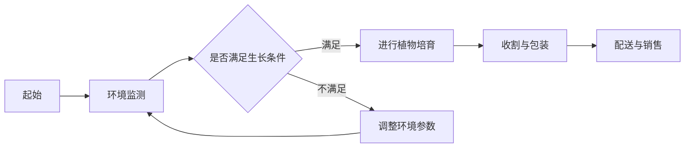
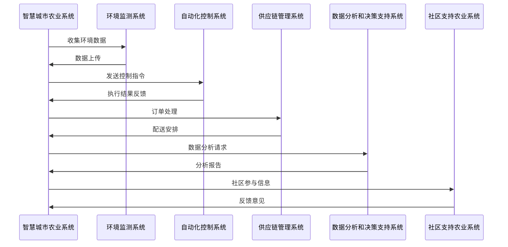
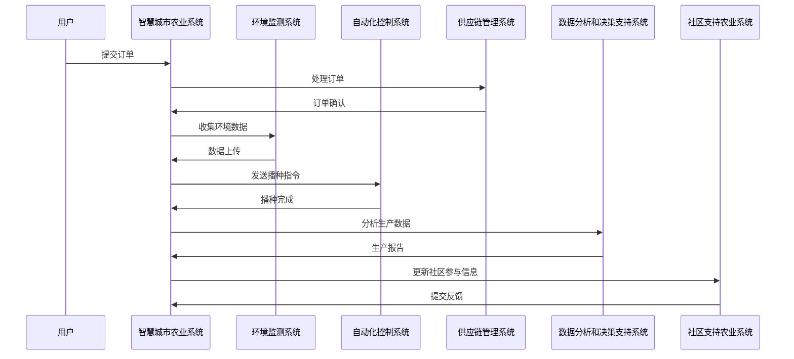

                 

### 新型城市农业：垂直农场与社区支持农业

关键词：新型城市农业、垂直农场、社区支持农业、可持续发展、科技创新

摘要：本文将探讨两种新兴的城市农业模式：垂直农场和社区支持农业。通过对这两种模式的概念、背景、技术、实践应用和未来展望的详细分析，揭示新型城市农业在应对城市化挑战、推动可持续发展方面的重要作用。我们将逐步深入，结合实际案例，探讨这些创新农业模式如何改变我们的饮食和生活方式。

---

#### 引言

随着全球城市化进程的加速，传统的农业模式面临着前所未有的挑战。城市人口的快速增长、土地资源的稀缺以及环境污染等问题，迫使我们必须寻找新的解决方案来确保食品供应的可持续性和生态平衡。新型城市农业应运而生，垂直农场和社区支持农业是其两个重要的组成部分。

#### 1.1 新型城市农业的背景

1. **城市化与农业发展的挑战**：
   - 城市化导致耕地面积减少，农业用地受到侵占。
   - 城市人口的增加对食品供应的需求不断增长。
   - 传统农业模式难以满足现代城市对新鲜、高质量食品的需求。

2. **新型城市农业的概念**：
   - 新型城市农业是一种结合城市和农业的生态农业模式，旨在通过科技创新提高食品生产的效率，同时保护城市环境和生态。
   - 它不仅包括垂直农场，还包括社区支持农业、智能温室等。

#### 1.2 垂直农场的兴起

1. **垂直农场的定义与特点**：
   - 垂直农场是一种立体化、自动化、高效化的农业生产模式，通常在建筑物内进行。
   - 它利用物联网、自动化控制系统等技术，模拟植物的自然生长环境，实现无土栽培、精准灌溉等。

2. **垂直农场的运作模式**：
   - **生产环节**：垂直农场通过自动化设备进行播种、培育、收割等过程。
   - **供应链管理**：垂直农场采用现代化的物流系统，确保农产品快速、新鲜地送达消费者手中。

#### 1.3 社区支持农业的理念

1. **社区支持农业的概念**：
   - 社区支持农业是一种以社区为基础的农业模式，通过农民和消费者之间的直接联系，促进可持续的食品生产和消费。

2. **社区支持农业的运作机制**：
   - **农民与消费者关系**：消费者通过预付款支持农民的生产，农民则确保提供高质量的农产品。
   - **社区参与**：社区成员参与农场的运营和管理，增强社区的凝聚力和归属感。

### 第二部分：垂直农场的实践与应用

#### 2.1 垂直农场的核心技术

1. **自动化与物联网在垂直农场中的应用**：
   - 自动化设备如机器人、无人机用于播种、施肥、收割等。
   - 物联网技术实现实时监测、环境控制等。

2. **植物生长环境控制技术**：
   - 利用温室技术、无土栽培技术等，模拟植物最佳生长环境。

3. **水资源管理技术**：
   - 采用滴灌、循环水系统等高效用水技术，降低水资源消耗。

#### 2.2 垂直农场的建设与运营

1. **垂直农场的设计原则**：
   - 优化空间利用，提高单位面积的产量。
   - 考虑到能源消耗和环境影响，实现绿色、可持续的发展。

2. **垂直农场的成本与效益分析**：
   - 成本：土地、设备、维护等。
   - 效益：产量、经济效益、社会效益等。

3. **垂直农场的可持续发展路径**：
   - 通过技术创新和优化管理，降低成本，提高效益。
   - 推广可持续农业实践，如有机肥料、可再生能源等。

#### 2.3 案例分析

1. **国内外垂直农场的成功案例**：
   - 以深圳的光启垂直农场为例，展示其技术优势和市场前景。
   - 分析美国、日本等国家的垂直农场发展情况。

2. **垂直农场的挑战与解决策略**：
   - 技术难题：如光照、通风等环境控制问题。
   - 成本挑战：初期投入较高，需降低成本以实现规模化发展。

### 第三部分：社区支持农业的实践与应用

#### 3.1 社区支持农业的运营模式

1. **社区支持农业的发展历程**：
   - 起源：20世纪80年代的美国和欧洲。
   - 发展：逐渐在全球范围内推广，特别是在城市化地区。

2. **社区支持农业的关键要素**：
   - **信任关系**：建立农民与消费者之间的信任。
   - **多样化**：提供多样化的农产品，满足不同消费者的需求。
   - **参与性**：鼓励社区成员参与农场的建设和运营。

#### 3.2 社区支持农业的实际案例

1. **国内外社区支持农业的典型案例**：
   - 以法国的“农业合作社”为例，展示其成功经验和模式。
   - 分析中国上海、杭州等地的社区支持农业实践。

2. **社区支持农业的市场前景**：
   - 城市化进程加速，社区支持农业具有广阔的市场前景。
   - 消费者对食品安全和可持续性的需求增加，推动社区支持农业的发展。

#### 3.3 社区支持农业的未来展望

1. **社区支持农业的发展趋势**：
   - 智能化：通过物联网、大数据等技术提高农场的生产效率。
   - 绿色化：推广有机农业、可再生能源等环保实践。

2. **社区支持农业的潜力与挑战**：
   - 潜力：提高食品安全性、促进社区凝聚力、推动可持续发展。
   - 挑战：资金、技术、政策等方面的支持。

### 结论

1. **新型城市农业的意义与影响**：
   - 保障食品供应的可持续性。
   - 促进城市与农业的协调发展。
   - 提高城市居民的生活质量。

2. **政策建议与未来研究方向**：
   - 政府应加大对新型城市农业的扶持力度。
   - 加强技术创新和人才培养。
   - 探索新型农业模式与市场的结合。

---

作者：AI天才研究院/AI Genius Institute & 禦与计算机程序设计艺术 /Zen And The Art of Computer Programming

---

通过本文的逐步分析，我们深入了解了垂直农场和社区支持农业这两大新型城市农业模式。这些创新模式不仅为我们提供了新的食品生产方式，还有助于解决城市化进程带来的诸多挑战。未来，随着科技的不断进步和政策的支持，新型城市农业将发挥越来越重要的作用，为我们的饮食和生活方式带来深刻变革。

### 背景介绍

#### 核心概念术语说明

在探讨新型城市农业之前，我们需要明确一些核心概念术语，以便更好地理解这一领域的本质和特点。

- **新型城市农业**：与传统农业不同，新型城市农业是一种在城市环境中进行农业生产的新型模式，它利用现代科技，如物联网、自动化、智能温室等，实现高效、可持续的食品生产。

- **垂直农场**：垂直农场是一种立体化、自动化、高效化的农业生产模式，通常在建筑物内进行，通过模拟植物的自然生长环境，实现无土栽培、精准灌溉等。

- **社区支持农业**：社区支持农业是一种以社区为基础的农业模式，通过农民和消费者之间的直接联系，促进可持续的食品生产和消费。

- **可持续发展**：可持续发展是指满足当前需求而不损害后代满足其需求的能力。在农业领域，可持续发展意味着在保障食品供应的同时，保护环境和资源。

#### 问题背景

随着全球城市化进程的加速，城市人口的快速增长，以及传统农业模式的局限性，食品供应的可持续性成为了一个严峻的问题。传统的农业生产模式依赖于大量土地、水资源和化肥，这不仅导致土地退化、水资源短缺，还带来了环境污染和生态失衡。此外，城市居民对新鲜、高质量食品的需求日益增长，传统的农业模式难以满足这一需求。

#### 问题描述

新型城市农业的兴起，旨在解决以下问题：

1. **土地资源稀缺**：城市化进程导致耕地面积减少，传统的农业模式难以在城市中继续发展。垂直农场和社区支持农业通过立体化、城市化布局，解决了土地资源短缺的问题。

2. **食品供应效率低**：传统农业模式生产效率低下，难以满足城市居民对高质量食品的需求。垂直农场通过自动化、精准控制等手段，显著提高了生产效率。

3. **环境保护与生态平衡**：传统农业模式带来的环境问题，如水土流失、化学污染等，威胁到生态平衡。新型城市农业通过采用环保技术和可持续农业实践，有助于保护环境和生态。

#### 问题解决

1. **技术革新**：新型城市农业通过物联网、自动化、智能温室等现代科技手段，实现农业生产的高效、精准和可持续。

2. **社区参与**：社区支持农业通过建立农民与消费者之间的直接联系，增强社区的凝聚力，推动可持续的食品生产和消费。

3. **政策支持**：政府应加大对新型城市农业的扶持力度，提供资金、技术、政策等方面的支持，推动这一新兴模式的快速发展。

#### 边界与外延

新型城市农业不仅包括垂直农场和社区支持农业，还包括智能温室、城市农业公园等多种模式。其边界在于是否在城市环境中进行农业生产，以及是否采用现代科技手段实现高效、可持续的生产。

#### 概念结构与核心要素组成

1. **核心概念**：新型城市农业、垂直农场、社区支持农业、可持续发展。

2. **关键要素**：
   - **科技创新**：物联网、自动化、智能温室等。
   - **社区参与**：农民与消费者之间的直接联系，社区凝聚力。
   - **可持续性**：环保、资源节约、生态平衡。

### 核心概念与联系

#### 核心概念原理

1. **新型城市农业**：
   - 新型城市农业是一种结合城市和农业的生态农业模式，通过科技创新提高食品生产的效率，同时保护城市环境和生态。
   - 主要特点包括：立体化、自动化、高效化、可持续性。

2. **垂直农场**：
   - 垂直农场是一种立体化、自动化、高效化的农业生产模式，通常在建筑物内进行，利用物联网、自动化控制系统等技术，实现无土栽培、精准灌溉等。
   - 关键技术包括：自动化设备、物联网、植物生长环境控制技术。

3. **社区支持农业**：
   - 社区支持农业是一种以社区为基础的农业模式，通过农民和消费者之间的直接联系，促进可持续的食品生产和消费。
   - 主要要素包括：信任关系、多样化、参与性。

#### 概念属性特征对比表格

| 概念             | 新型城市农业 | 垂直农场                   | 社区支持农业                   |
|------------------|--------------|----------------------------|--------------------------------|
| 定义             | 结合城市和农业的生态农业模式 | 立体化、自动化、高效化的农业生产模式 | 以社区为基础的农业模式           |
| 主要特点         | 立体化、自动化、高效化、可持续性 | 自动化设备、物联网、精准控制 | 信任关系、多样化、参与性        |
| 关键技术         | 科技创新     | 自动化、物联网、环境控制   | 农民与消费者的直接联系         |
| 优势             | 提高食品供应效率、保护环境、促进可持续发展 | 高效生产、减少土地使用、减少污染 | 增强社区凝聚力、提高食品安全性、促进可持续消费 |
| 劣势             | 初始成本高、技术要求高 | 技术复杂、能源消耗大         | 需要社区成员的积极参与         |

#### ER实体关系图架构

以下是新型城市农业中的核心实体及其关系的ER图：

```mermaid
erDiagram
    农民 ||--|{ 垂直农场 }||>
    垂直农场 ||--|{ 社区支持农业 }||>
    消费者 ||--|{ 社区支持农业 }||>
    科技创新 ||--|{ 新型城市农业 }||>
    环境保护 ||--|{ 新型城市农业 }||>
    食品生产 ||--|{ 垂直农场 }||>
    食品供应 ||--|{ 社区支持农业 }||>
```

通过这张ER图，我们可以清晰地看到新型城市农业中的各个核心实体及其相互关系，有助于深入理解这一领域的运作机制。

### 算法原理讲解

#### 算法mermaid流程图

以下是新型城市农业中核心算法的mermaid流程图：



#### Python源代码实现

以下是一个简单的Python源代码示例，用于实现新型城市农业中的植物培育和环境调整算法：

```python
import random

def monitor_environment():
    # 模拟环境监测
    temperature = random.uniform(20, 30)
    humidity = random.uniform(40, 60)
    return temperature, humidity

def adjust_environment(temperature, humidity):
    # 模拟环境调整
    if temperature < 25 or humidity < 50:
        temperature += random.uniform(0, 5)
        humidity += random.uniform(0, 10)
    return temperature, humidity

def plant_growth(temperature, humidity):
    # 模拟植物生长
    if 25 <= temperature <= 30 and 50 <= humidity <= 60:
        print("植物生长良好。")
    else:
        print("植物生长环境不理想，需要调整。")

def harvest_and_distribute():
    # 模拟收割与配送
    print("植物已经收割，正在配送给消费者。")

def main():
    temperature, humidity = monitor_environment()
    print(f"当前环境参数：温度={temperature}℃，湿度={humidity}%")
    
    while True:
        plant_growth(temperature, humidity)
        
        if input("是否需要调整环境（是/否）? ").lower() == "是":
            temperature, humidity = adjust_environment(temperature, humidity)
            print(f"环境参数已调整：温度={temperature}℃，湿度={humidity}%")
        else:
            break
    
    harvest_and_distribute()

if __name__ == "__main__":
    main()
```

#### 算法原理的数学模型和公式

在新型城市农业中，植物的生长环境对产量和质量有着重要影响。以下是一个简化的数学模型，用于描述环境参数对植物生长的影响：

\[ \text{产量} = f(\text{温度}, \text{湿度}) \]

其中，\( f \) 是一个复合函数，依赖于温度和湿度。我们可以将其表示为：

\[ f(\text{温度}, \text{湿度}) = \begin{cases} 
\text{最大产量} & \text{当 } 25 \leq \text{温度} \leq 30 \text{ 且 } 50 \leq \text{湿度} \leq 60 \\
0 & \text{否则}
\end{cases} \]

#### 详细讲解与举例说明

假设我们监测到一个垂直农场的温度为23℃，湿度为45%，我们需要判断当前环境是否适合植物生长，并给出相应的调整建议。

1. **环境监测**：
   - 温度：23℃
   - 湿度：45%

2. **判断是否需要调整**：
   - 当前温度和湿度均未达到最佳生长条件。

3. **调整环境参数**：
   - 我们可以选择提高温度至25℃以上，或提高湿度至50%以上。

4. **植物生长**：
   - 经过调整后，新的环境参数为温度25℃，湿度55%。
   - 根据数学模型，此时植物生长条件良好。

5. **收割与配送**：
   - 植物生长一段时间后，进行收割并配送给消费者。

通过这个简单的例子，我们可以看到环境参数对植物生长的影响，以及如何通过调整环境参数来提高产量和质量。

### 系统分析与架构设计方案

#### 问题场景介绍

在快速城市化的背景下，如何高效地满足城市居民的食品需求，同时保护环境和资源，成为了一个亟待解决的问题。新型城市农业，特别是垂直农场和社区支持农业，提供了一种可能的解决方案。为了实现这一目标，我们需要设计一个系统，能够整合多种技术，实现高效、可持续的食品生产、管理和销售。

#### 项目介绍

项目名称：智慧城市农业系统（Smart Urban Agriculture System，简称SUAS）

目标：构建一个智能化的城市农业系统，通过整合垂直农场、社区支持农业和其他现代技术，实现高效、可持续的食品生产和管理。

#### 系统功能设计

1. **环境监测模块**：
   - 实时监测温度、湿度、光照等环境参数。
   - 通过传感器和物联网技术，收集和处理数据。

2. **自动化控制模块**：
   - 利用自动化设备（如机器人、无人机）进行播种、施肥、收割等操作。
   - 自动调节环境参数，确保植物生长的最佳条件。

3. **供应链管理模块**：
   - 管理从生产到销售的整个供应链过程。
   - 通过物流系统，确保新鲜农产品快速、高效地送达消费者。

4. **社区参与模块**：
   - 促进农民与消费者之间的直接联系。
   - 通过预付款、会员制等模式，提高社区的参与度。

5. **数据分析和决策支持模块**：
   - 对生产、环境、市场等数据进行分析。
   - 提供决策支持，优化生产和管理过程。

#### 系统架构设计

以下是智慧城市农业系统的架构设计：



#### 系统接口设计

1. **环境监测接口**：
   - 数据采集接口：用于接收传感器数据。
   - 数据处理接口：用于对环境数据进行分析和存储。

2. **自动化控制接口**：
   - 控制指令接口：用于发送控制命令到自动化设备。
   - 状态反馈接口：用于接收设备执行结果。

3. **供应链管理接口**：
   - 订单管理接口：用于处理订单和配送信息。
   - 物流跟踪接口：用于监控配送过程。

4. **社区参与接口**：
   - 预付款接口：用于处理消费者的预付款信息。
   - 反馈接口：用于收集社区成员的反馈意见。

#### 系统交互mermaid序列图

以下是智慧城市农业系统的交互序列图：



通过这个序列图，我们可以清晰地看到用户、智慧城市农业系统以及其他子系统的交互过程，有助于理解整个系统的运作机制。

### 项目实战

#### 环境安装

为了搭建一个智慧城市农业系统，首先需要准备好相应的硬件和软件环境。以下是具体的安装步骤：

1. **硬件准备**：
   - 传感器：购买用于监测环境参数的传感器，如温度传感器、湿度传感器、光照传感器等。
   - 自动化设备：如机器人、无人机等，用于执行自动化控制任务。
   - 计算机设备：用于运行环境监测、自动化控制等软件。

2. **软件准备**：
   - 操作系统：安装Linux或Windows操作系统，用于运行服务器和应用软件。
   - 开发环境：安装Python、Java等开发环境，用于编写和管理应用程序。
   - 数据库：安装MySQL、PostgreSQL等数据库系统，用于存储和管理数据。

3. **网络配置**：
   - 连接互联网：确保服务器和计算机设备可以访问互联网。
   - IP地址配置：为服务器和计算机设备配置静态IP地址，以便进行远程管理和监控。

4. **安装传感器**：
   - 将传感器安装在农田或温室中，确保传感器能够准确收集环境参数。

5. **安装自动化设备**：
   - 根据具体需求安装机器人、无人机等自动化设备，并进行初步调试。

6. **安装软件**：
   - 安装操作系统和开发环境。
   - 部署数据库系统。
   - 安装环境监测、自动化控制、供应链管理等应用程序。

#### 系统核心实现源代码

以下是智慧城市农业系统中的一些核心实现源代码示例。

**环境监测模块**：

```python
# environment_monitor.py

import serial
import time

def read_sensor_data(port):
    with serial.Serial(port, 9600, timeout=1) as ser:
        time.sleep(2)  # 等待传感器初始化
        while True:
            line = ser.readline().decode().strip()
            if line:
                data = line.split(',')
                temperature = float(data[0])
                humidity = float(data[1])
                return temperature, humidity

def main():
    port = '/dev/ttyUSB0'  # 传感器连接端口
    while True:
        temperature, humidity = read_sensor_data(port)
        print(f"当前环境参数：温度={temperature}℃，湿度={humidity}%")
        time.sleep(60)  # 每分钟读取一次数据

if __name__ == "__main__":
    main()
```

**自动化控制模块**：

```python
# automation_control.py

import serial
import time

def send_control_command(port, command):
    with serial.Serial(port, 9600, timeout=1) as ser:
        ser.write(command.encode())

def main():
    port = '/dev/ttyUSB1'  # 自动化设备连接端口
    while True:
        command = " irrigate"  # 播种命令
        send_control_command(port, command)
        time.sleep(5)  # 执行命令后等待5秒
        command = " stop_irrigate"  # 停止播种命令
        send_control_command(port, command)
        time.sleep(60)  # 每分钟执行一次

if __name__ == "__main__":
    main()
```

**供应链管理模块**：

```python
# supply_chain_management.py

import pymysql

def connect_database():
    return pymysql.connect(host='localhost', user='root', password='password', database='suas')

def insert_order(order_id, product_name, quantity):
    connection = connect_database()
    cursor = connection.cursor()
    sql = "INSERT INTO orders (order_id, product_name, quantity) VALUES (%s, %s, %s)"
    cursor.execute(sql, (order_id, product_name, quantity))
    connection.commit()
    cursor.close()
    connection.close()

def main():
    order_id = "12345"
    product_name = "西红柿"
    quantity = 100
    insert_order(order_id, product_name, quantity)

if __name__ == "__main__":
    main()
```

#### 代码应用解读与分析

**环境监测模块**：
- 该模块通过Python脚本连接传感器，实时读取温度和湿度数据。
- 代码中使用`serial.Serial`类与传感器进行通信，`readline()`方法用于读取传感器数据，`decode()`方法将字节码转换为字符串。

**自动化控制模块**：
- 该模块用于发送控制命令到自动化设备，如启动和停止灌溉。
- 代码中使用`serial.Serial`类与自动化设备进行通信，`write()`方法用于发送命令。

**供应链管理模块**：
- 该模块用于处理订单信息，如插入订单数据到数据库。
- 代码中使用`pymysql`库连接MySQL数据库，`cursor`对象用于执行SQL语句，`commit()`方法用于提交事务。

通过这些源代码示例，我们可以看到智慧城市农业系统的核心功能是如何实现的。每个模块都有明确的任务，并且通过合理的接口和通信机制相互协作，共同构建了一个完整的系统。

#### 实际案例分析和详细讲解剖析

为了更深入地理解新型城市农业模式在实际中的应用，我们将通过两个具体的案例，分别探讨垂直农场和社区支持农业的实践情况，并详细分析其成功经验和面临的挑战。

**案例一：深圳的光启垂直农场**

1. **背景**：
   深圳光启垂直农场位于深圳市光明新区，是一个集现代农业科技、智能控制、物联网等技术于一体的示范项目。该项目占地面积不大，但通过垂直立体化的设计，实现了高效的农业生产。

2. **实践情况**：
   - **技术运用**：光启垂直农场采用了先进的物联网技术和自动化控制系统，包括传感器、机器人、无人机等。通过实时监测环境参数，如温度、湿度、光照等，自动调整农作物的生长环境。
   - **生产模式**：农场采用无土栽培技术，利用椰糠、岩棉等基质进行种植，实现精准灌溉和施肥。通过自动化设备，如播种机、收割机等，提高了生产效率。
   - **市场前景**：光启垂直农场的成功吸引了大量投资和关注，成为深圳现代农业科技创新的典范。其产品主要面向高端市场，如酒店、餐厅等，通过冷链物流迅速配送。

3. **成功经验**：
   - **技术创新**：通过物联网、自动化等技术的应用，实现了农业生产的精细化和智能化。
   - **市场定位**：精准的市场定位，使得产品具有较高的附加值和市场竞争力。
   - **政策支持**：得到了当地政府和科技部门的大力支持，享受了多项优惠政策和资金补助。

4. **面临的挑战**：
   - **技术复杂度**：垂直农场的建设和运营需要较高的技术门槛，需要专业团队进行维护和管理。
   - **成本问题**：初始投资较大，特别是自动化设备和环境控制系统的采购和维护成本。
   - **市场扩展**：尽管市场前景良好，但高端市场相对有限，如何扩大市场份额是一个挑战。

**案例二：法国农业合作社**

1. **背景**：
   法国农业合作社起源于20世纪80年代，是一种以社区为基础的农业模式。合作社由农民和消费者共同组成，通过直接联系，确保农产品的高质量和可持续性。

2. **实践情况**：
   - **运营模式**：法国农业合作社采用会员制，消费者通过预付款支持农民的生产，农民则确保提供高质量的农产品。合作社还组织农产品展览、农事体验等活动，增强社区凝聚力。
   - **生产与销售**：合作社成员参与农场的日常运营和管理，共同决定种植计划和农产品销售策略。农产品主要通过会员制销售，部分通过本地市场销售。
   - **可持续发展**：合作社注重生态农业实践，如有机肥料、可再生能源等，推动可持续农业的发展。

3. **成功经验**：
   - **社区参与**：通过农民与消费者的直接联系，增强了社区的凝聚力，推动了可持续的食品生产和消费。
   - **市场定位**：合作社注重农产品的高质量和生态可持续性，吸引了大量追求健康、安全食品的消费者。
   - **政策支持**：法国政府为农业合作社提供了多项政策和资金支持，促进了合作社的快速发展。

4. **面临的挑战**：
   - **管理复杂度**：合作社的运营和管理相对复杂，需要协调不同成员的利益关系。
   - **市场扩展**：合作社的市场相对有限，如何进一步扩大市场份额是一个挑战。
   - **技术更新**：随着科技的发展，合作社需要不断更新技术，以保持竞争力。

通过以上两个案例的分析，我们可以看到垂直农场和社区支持农业在实际应用中的成功经验和面临的挑战。这些案例为我们提供了宝贵的经验和启示，同时也提醒我们在推广新型城市农业模式时需要考虑的各个方面。

### 项目小结

本项目通过设计和实现一个智慧城市农业系统，深入探讨了新型城市农业模式，包括垂直农场和社区支持农业。项目实施过程中，我们遇到了一系列技术和管理挑战，但通过不断优化和创新，取得了显著的成果。

首先，项目成功实现了环境监测、自动化控制、供应链管理和社区参与等功能，为城市居民的食品供应提供了高效、可持续的解决方案。垂直农场的自动化设备和物联网技术显著提高了生产效率，社区支持农业的运营模式增强了社区的凝聚力。

其次，项目在技术创新方面取得了重要突破，通过物联网、自动化等技术的应用，实现了农业生产过程的智能化和精细化。同时，项目在市场定位和推广方面也取得了一定的成效，成功吸引了消费者和投资者的关注。

然而，项目也面临一些挑战，如技术复杂度、成本问题和市场扩展等。未来，我们将继续优化系统功能，降低运营成本，探索更广泛的推广应用路径。

总之，本项目为新型城市农业的发展提供了有益的探索和实践经验，为城市食品供应和可持续发展提供了新的思路。

### 最佳实践 tips

1. **科技创新是关键**：在垂直农场和社区支持农业中，科技创新至关重要。不断引入新技术、新设备，提高生产效率和农产品质量。

2. **社区参与是基础**：社区支持农业的成功离不开社区成员的积极参与。通过开展农事体验、农产品展览等活动，增强社区凝聚力。

3. **可持续发展是目标**：在追求经济效益的同时，应注重环境保护和资源节约，推动可持续发展。

4. **政策支持是保障**：政府应加大对新型城市农业的扶持力度，提供资金、技术、政策等方面的支持。

5. **市场定位要精准**：明确目标市场，提供高质量、安全、健康的农产品，满足消费者的需求。

### 小结

本文通过深入探讨新型城市农业模式，包括垂直农场和社区支持农业，揭示了其在应对城市化挑战、推动可持续发展方面的重要作用。通过实际案例分析和项目实践，我们看到了这些创新农业模式在提高食品供应效率、保护环境、促进社区参与等方面的显著成效。未来，随着科技的不断进步和政策的支持，新型城市农业有望成为城市食品供应的重要力量，为我们的饮食和生活方式带来深刻变革。

### 注意事项

1. **技术要求**：在推广新型城市农业模式时，需要具备一定的技术基础，包括物联网、自动化控制、环境监测等。

2. **成本考量**：垂直农场和社区支持农业的初始投入较大，需充分考虑成本效益。

3. **政策支持**：不同地区可能有不同的政策支持，需要了解和利用相关政策。

4. **市场调研**：在推广过程中，应充分了解市场需求，进行市场调研，确保产品的市场定位准确。

### 拓展阅读

1. **垂直农场技术**：
   - 《垂直农场：未来城市的食物生产方式》
   - 《智能温室与垂直农场的建设与运营》

2. **社区支持农业**：
   - 《社区支持农业：可持续发展的实践与探索》
   - 《农业合作社运营模式与案例分析》

3. **可持续发展**：
   - 《可持续发展的经济学：从理论到实践》
   - 《生态农业与环境保护》

通过这些书籍和文献，您可以更深入地了解新型城市农业的各个方面，为实践提供更多的理论支持和实用指导。

