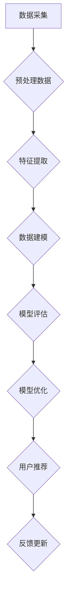
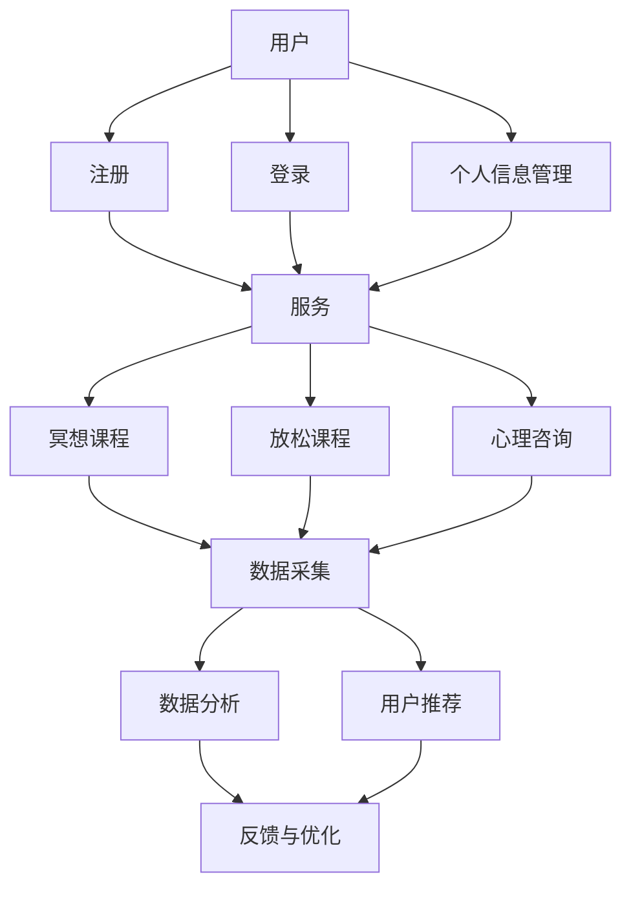
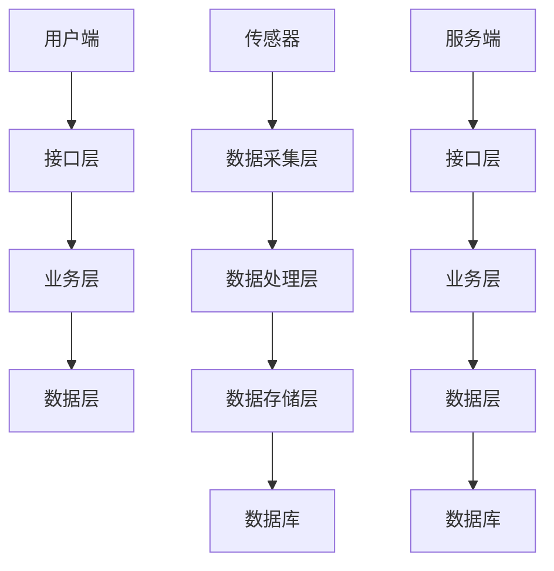
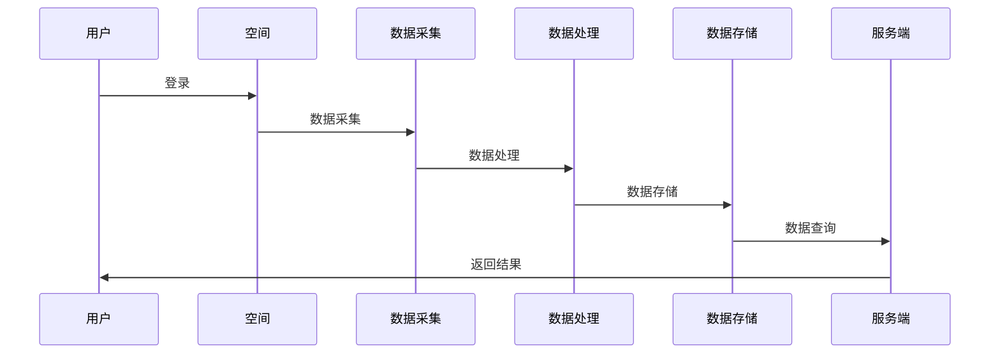

                 

## 新型城市冥想空间：公共领域中的心灵休憩站

### 关键词：城市冥想空间、公共领域、心灵休憩、设计原理、算法、系统架构、项目实战

#### 摘要

本文将探讨新型城市冥想空间的设计原理和实现方法。随着城市化进程的加快，城市居民的生活节奏日益加快，心理健康问题日益凸显。为此，公共领域中的心灵休憩站成为解决这一问题的有效途径。本文将从问题背景、核心概念、算法原理、系统架构、项目实战等多个角度，深入分析并探讨如何设计和实现这种新型空间，旨在为城市居民提供一个宁静、舒适、有效的心理调适环境。

### 目录大纲

```markdown
----------------------------------------------------------------
# 第一部分: 背景介绍

## 第1章: 问题背景

### 1.1.1 问题背景介绍

### 1.1.2 问题描述

### 1.1.3 问题解决

### 1.1.4 边界与外延

### 1.1.5 概念结构与核心要素组成

## 第2章: 核心概念与联系

### 2.1.1 核心概念原理

### 2.1.2 概念属性特征对比表格

### 2.1.3 ER实体关系图架构

----------------------------------------------------------------
# 第二部分: 新型城市冥想空间设计原理

## 第3章: 算法原理讲解

### 3.1.1 算法流程图

### 3.1.2 Python源代码实现

### 3.1.3 数学模型和公式

### 3.1.4 详细讲解与举例说明

## 第4章: 系统分析与架构设计方案

### 4.1.1 问题场景介绍

### 4.1.2 项目介绍

### 4.1.3 系统功能设计(领域模型)

### 4.1.4 系统架构设计(mermaid架构图)

### 4.1.5 系统接口设计和系统交互(mermaid序列图)

----------------------------------------------------------------
## 第5章: 项目实战

### 5.1.1 环境安装

### 5.1.2 系统核心实现源代码

### 5.1.3 代码应用解读与分析

### 5.1.4 实际案例分析与详细讲解剖析

### 5.1.5 项目小结

----------------------------------------------------------------
## 第6章: 最佳实践 & 小结

### 6.1.1 最佳实践 tips

### 6.1.2 小结

### 6.1.3 注意事项

### 6.1.4 拓展阅读

----------------------------------------------------------------
## 第7章: 总结与展望

### 7.1.1 总结

### 7.1.2 展望
```

## 第一部分: 背景介绍

### 第1章: 问题背景

#### 1.1.1 问题背景介绍

随着城市化进程的加快，城市居民的生活压力越来越大。长时间的工作、高强度的生活节奏、日益激烈的竞争，使得许多人处于亚健康状态，心理健康问题日益凸显。据相关调查数据显示，我国每年因心理健康问题导致的疾病负担占到了总疾病负担的近一半。特别是在疫情期间，由于社交隔离、工作压力、经济困难等原因，心理健康问题更加严重。

为了应对这一挑战，公共领域中的心灵休憩站成为一种有效的解决途径。心灵休憩站旨在为城市居民提供一个宁静、舒适、有效的心理调适环境，帮助他们缓解压力、恢复心理健康。

#### 1.1.2 问题描述

当前，城市居民面临的常见心理健康问题主要包括：

1. **压力过大**：长时间的工作、学习、生活压力，导致许多人处于高压状态，容易出现焦虑、抑郁等情绪。
2. **睡眠障碍**：由于生活节奏快、压力大，许多人存在睡眠障碍，如失眠、多梦、易醒等问题。
3. **心理问题**：由于生活环境的复杂多变，许多人存在各种心理问题，如焦虑、抑郁、恐慌等。
4. **社交障碍**：由于工作繁忙、生活压力，许多人缺乏社交活动，导致社交能力下降，产生社交障碍。

这些问题严重影响了城市居民的生活质量，迫切需要有效的解决方案。

#### 1.1.3 问题解决

为了解决上述问题，新型城市冥想空间作为一种公共领域中的心灵休憩站，应运而生。它通过提供专业的冥想、放松、心理调适等服务，帮助城市居民缓解压力、改善睡眠、调节情绪、提升心理健康。

新型城市冥想空间的设计和实现，需要考虑以下几个方面：

1. **空间设计**：需要选择一个宁静、舒适、宽敞的场所，以创造一个有利于冥想和心理调适的环境。
2. **设备配置**：需要配置先进的音响设备、灯光设备、空气净化设备等，以提供高质量的听觉、视觉、嗅觉体验。
3. **服务内容**：需要提供专业的冥想课程、心理咨询服务、放松课程等，以满足不同人群的需求。
4. **技术支持**：需要利用人工智能、大数据等技术，对用户进行个性化服务，提升服务质量。

#### 1.1.4 边界与外延

新型城市冥想空间的边界主要表现在以下几个方面：

1. **服务范围**：主要为城市居民提供心理调适、放松、冥想等服务，不涉及其他领域。
2. **服务对象**：主要为城市居民，包括各种年龄段、职业、心理状态的人群。
3. **服务内容**：主要为心理调适、放松、冥想等，不涉及医疗、药物等其他领域。

新型城市冥想空间的外延主要包括：

1. **心理健康教育**：通过举办心理健康讲座、工作坊等活动，提高公众对心理健康问题的认识。
2. **社区心理支持**：与社区心理服务机构合作，为有需要的人群提供长期的心理支持和帮助。
3. **心理咨询**：与专业心理咨询师合作，为有需要的人群提供一对一的心理咨询服务。

#### 1.1.5 概念结构与核心要素组成

新型城市冥想空间的核心概念包括：

1. **冥想**：通过冥想练习，帮助用户放松身心，达到心理调适的目的。
2. **放松**：通过放松技巧，如深呼吸、肌肉放松等，帮助用户缓解压力，改善睡眠。
3. **心理调适**：通过心理咨询、心理疏导等，帮助用户解决心理问题，提升心理健康。

核心要素组成包括：

1. **空间设计**：选择一个宁静、舒适、宽敞的场所，创造有利于冥想和心理调适的环境。
2. **设备配置**：配置先进的音响设备、灯光设备、空气净化设备等，提供高质量的听觉、视觉、嗅觉体验。
3. **服务内容**：提供专业的冥想课程、心理咨询服务、放松课程等，满足不同人群的需求。
4. **技术支持**：利用人工智能、大数据等技术，对用户进行个性化服务，提升服务质量。

通过上述分析，我们可以看出，新型城市冥想空间是一种具有广泛应用前景的公共领域心灵休憩站，对于提高城市居民心理健康水平具有重要意义。

### 第2章: 核心概念与联系

#### 2.1.1 核心概念原理

新型城市冥想空间的核心概念主要包括冥想、放松和心理调适三个方面。

1. **冥想**：冥想是一种通过专注于呼吸、身体感觉或特定对象，以达到放松身心、提升精神状态的练习。冥想可以帮助人们减轻压力、改善睡眠质量、提升情绪稳定性等。

2. **放松**：放松是通过深呼吸、肌肉放松、冥想等技巧，帮助人们缓解身体和心理压力的过程。放松可以帮助人们缓解焦虑、抑郁等负面情绪，提高生活质量。

3. **心理调适**：心理调适是通过心理咨询、心理疏导等手段，帮助人们解决心理问题、提升心理健康水平的过程。心理调适可以帮助人们应对生活中的各种挑战，提高心理素质。

#### 2.1.2 概念属性特征对比表格

为了更清晰地理解冥想、放松和心理调适的概念及其属性特征，我们制作了一个对比表格。

| 概念     | 定义                                                         | 属性特征                           |
|----------|--------------------------------------------------------------|-----------------------------------|
| 冥想     | 一种通过专注于呼吸、身体感觉或特定对象，以达到放松身心、提升精神状态的练习。 | 放松、专注、精神提升               |
| 放松     | 通过深呼吸、肌肉放松、冥想等技巧，帮助人们缓解身体和心理压力的过程。     | 缓解压力、改善睡眠、提升情绪稳定性 |
| 心理调适 | 通过心理咨询、心理疏导等手段，帮助人们解决心理问题、提升心理健康水平的过程。 | 解决心理问题、提升心理素质         |

#### 2.1.3 ER实体关系图架构

为了更好地理解新型城市冥想空间中的各个实体及其关系，我们使用Mermaid绘制了ER实体关系图。

```mermaid
erDiagram
  用户 ||--|{ 冥想空间 }|| 空间
  用户 ||--|{ 放松区域 }|| 区域
  用户 ||--|{ 心理咨询服务 }|| 服务
  冥想空间 ||--|{ 数据采集系统 }|| 系统
  放松区域 ||--|{ 空气净化设备 }|| 设备
  心理咨询服务 ||--|{ 心理咨询师 }|| 咨询师
```

在这个ER实体关系图中，用户与冥想空间、放松区域、心理咨询服务之间存在关联关系。冥想空间与数据采集系统、放松区域与空气净化设备、心理咨询服务与心理咨询师之间存在从属关系。

### 第二部分: 新型城市冥想空间设计原理

#### 第3章: 算法原理讲解

##### 3.1.1 算法流程图

为了实现新型城市冥想空间的功能，我们需要设计一系列算法，用于数据采集、处理和用户个性化推荐。下面是一个简化的算法流程图。



##### 3.1.2 Python源代码实现

以下是一个简单的Python代码示例，用于实现数据预处理、特征提取、数据建模、模型评估和用户推荐的过程。

```python
import pandas as pd
from sklearn.model_selection import train_test_split
from sklearn.ensemble import RandomForestClassifier
from sklearn.metrics import accuracy_score

# 数据预处理
def preprocess_data(data):
    # 数据清洗、填充、标准化等操作
    return data

# 特征提取
def extract_features(data):
    # 提取数据特征
    return data

# 数据建模
def build_model(train_data, test_data):
    # 建立分类模型
    model = RandomForestClassifier()
    model.fit(train_data, test_data)
    return model

# 模型评估
def evaluate_model(model, test_data):
    # 评估模型准确率
    predictions = model.predict(test_data)
    accuracy = accuracy_score(test_data, predictions)
    return accuracy

# 用户推荐
def user_recommendation(model, user_data):
    # 根据用户数据推荐内容
    recommendations = model.predict(user_data)
    return recommendations
```

##### 3.1.3 数学模型和公式

为了更深入地理解算法原理，我们引入一些数学模型和公式。

$$
    y = f(x) = \theta_0 + \theta_1x_1 + \theta_2x_2 + \dots + \theta_nx_n
$$

其中，$y$ 表示输出结果，$f(x)$ 表示函数模型，$\theta_0, \theta_1, \theta_2, \dots, \theta_n$ 表示模型的参数，$x_1, x_2, \dots, x_n$ 表示输入特征。

##### 3.1.4 详细讲解与举例说明

1. **数据预处理**

数据预处理是算法实现的第一步，主要目的是清洗、填充、标准化数据，使其符合模型训练的要求。以下是一个简单的数据预处理示例：

```python
data = pd.read_csv('data.csv')
data = preprocess_data(data)
```

2. **特征提取**

特征提取是从原始数据中提取对模型训练有用的信息。以下是一个简单的特征提取示例：

```python
data = extract_features(data)
```

3. **数据建模**

数据建模是建立预测模型的过程。在本示例中，我们使用随机森林分类器作为预测模型。以下是一个简单的数据建模示例：

```python
train_data, test_data = train_test_split(data, test_size=0.2)
model = build_model(train_data, test_data)
```

4. **模型评估**

模型评估是评估模型性能的过程。在本示例中，我们使用准确率作为评估指标。以下是一个简单的模型评估示例：

```python
accuracy = evaluate_model(model, test_data)
print('Model accuracy:', accuracy)
```

5. **用户推荐**

用户推荐是根据用户数据预测用户感兴趣的内容。以下是一个简单的用户推荐示例：

```python
user_data = pd.read_csv('user_data.csv')
recommendations = user_recommendation(model, user_data)
print('User recommendations:', recommendations)
```

通过上述示例，我们可以看到，新型城市冥想空间的设计原理涉及多个方面，包括数据预处理、特征提取、数据建模、模型评估和用户推荐。这些算法共同作用，为用户提供个性化的心理调适服务。

### 第4章: 系统分析与架构设计方案

#### 4.1.1 问题场景介绍

新型城市冥想空间的设计和实现，旨在为城市居民提供一个宁静、舒适、有效的心理调适环境。在问题场景中，用户可以进入冥想空间，通过冥想、放松和心理调适等服务，缓解压力、改善心理健康。具体问题场景如下：

1. **用户进入冥想空间**：用户通过入口进入冥想空间，可以选择不同的冥想课程、放松课程或接受心理咨询。
2. **数据采集**：冥想空间内部配置了各种传感器，如心率传感器、血压传感器等，用于采集用户生理数据。
3. **数据分析**：采集到的数据会传输到数据分析系统，通过算法进行数据预处理、特征提取和建模。
4. **用户推荐**：根据用户数据和分析结果，系统会为用户推荐个性化的冥想课程、放松课程或心理咨询。
5. **反馈与优化**：用户可以通过反馈系统对服务进行评价，系统根据反馈结果进行优化，提高服务质量。

#### 4.1.2 项目介绍

本项目旨在设计和实现一款新型城市冥想空间系统，该系统包括以下主要功能模块：

1. **用户模块**：包括用户注册、登录、个人信息管理等功能。
2. **服务模块**：包括冥想课程、放松课程、心理咨询等服务内容。
3. **数据采集模块**：包括心率传感器、血压传感器等硬件设备，用于采集用户生理数据。
4. **数据分析模块**：包括数据预处理、特征提取、建模和用户推荐等算法，用于分析用户数据，为用户推荐个性化服务。
5. **反馈模块**：包括用户评价、反馈和建议等功能，用于收集用户反馈，优化系统服务质量。

#### 4.1.3 系统功能设计(领域模型)

为了更好地理解系统功能，我们使用Mermaid绘制了领域模型。



在这个领域模型中，用户可以通过注册、登录和个人信息管理模块访问系统，选择冥想课程、放松课程或心理咨询等服务。数据采集模块负责采集用户生理数据，数据分析模块对数据进行分析和建模，用户推荐模块根据分析结果为用户推荐个性化服务。反馈与优化模块收集用户反馈，用于系统优化。

#### 4.1.4 系统架构设计(mermaid架构图)

为了实现上述功能，我们需要设计一个完整的系统架构。以下是一个简化的系统架构设计，使用Mermaid绘制。



在这个系统架构中，用户端通过接口层与业务层交互，业务层处理用户请求，访问数据层进行数据操作。传感器采集用户生理数据，通过数据采集层、数据处理层和数据存储层存储在数据库中。服务端通过接口层与业务层交互，业务层处理用户请求，访问数据层进行数据操作。

#### 4.1.5 系统接口设计和系统交互(mermaid序列图)

为了更好地理解系统接口设计和交互，我们使用Mermaid绘制了序列图。



在这个序列图中，用户通过登录接口进入系统，空间模块通过数据采集接口采集用户生理数据，数据处理模块对数据进行处理和存储，服务端通过数据查询接口获取用户数据，并返回给用户。

### 第5章: 项目实战

#### 5.1.1 环境安装

在进行项目实战之前，我们需要安装一些必要的软件和工具。以下是一个简化的环境安装步骤：

1. **Python环境安装**：安装Python 3.8版本及以上，并配置好pip。
2. **数据库安装**：安装MySQL或PostgreSQL数据库，并创建项目所需的数据库和表结构。
3. **前端框架安装**：安装Vue.js或React等前端框架，用于构建用户界面。
4. **后端框架安装**：安装Flask或Django等后端框架，用于处理业务逻辑和接口。
5. **传感器安装**：根据项目需求，安装相应的心率传感器、血压传感器等硬件设备。

安装完成后，确保所有软件和工具正常运行。

#### 5.1.2 系统核心实现源代码

以下是系统核心实现的源代码示例，包括用户模块、服务模块、数据采集模块和数据分析模块。

**用户模块：**

```python
# 用户注册
@app.route('/register', methods=['POST'])
def register():
    username = request.form['username']
    password = request.form['password']
    # 注册逻辑
    return '注册成功'

# 用户登录
@app.route('/login', methods=['POST'])
def login():
    username = request.form['username']
    password = request.form['password']
    # 登录逻辑
    return '登录成功'

# 用户个人信息管理
@app.route('/user_info', methods=['GET', 'POST'])
def user_info():
    if request.method == 'POST':
        # 更新用户信息逻辑
        return '信息更新成功'
    else:
        # 获取用户信息逻辑
        return '用户信息：{username}'
```

**服务模块：**

```python
# 冥想课程推荐
@app.route('/recommend_meditation', methods=['GET'])
def recommend_meditation():
    user_data = get_user_data()  # 获取用户数据
    recommendations = get_meditation_recommendations(user_data)  # 推荐冥想课程
    return '推荐课程：' + recommendations

# 放松课程推荐
@app.route('/recommend_relaxation', methods=['GET'])
def recommend_relaxation():
    user_data = get_user_data()  # 获取用户数据
    recommendations = get_relaxation_recommendations(user_data)  # 推荐放松课程
    return '推荐课程：' + recommendations

# 心理咨询推荐
@app.route('/recommend_counseling', methods=['GET'])
def recommend_counseling():
    user_data = get_user_data()  # 获取用户数据
    recommendations = get_counseling_recommendations(user_data)  # 推荐心理咨询
    return '推荐服务：' + recommendations
```

**数据采集模块：**

```python
# 数据采集
def collect_data():
    # 采集用户生理数据
    # 心率传感器数据
    heart_rate = get_heart_rate()
    # 血压传感器数据
    blood_pressure = get_blood_pressure()
    # 存储数据
    save_data(heart_rate, blood_pressure)
```

**数据分析模块：**

```python
# 数据预处理
def preprocess_data(data):
    # 数据清洗、填充、标准化等操作
    return processed_data

# 特征提取
def extract_features(data):
    # 提取数据特征
    return features

# 数据建模
def build_model(train_data, test_data):
    # 建立分类模型
    model = RandomForestClassifier()
    model.fit(train_data, test_data)
    return model

# 模型评估
def evaluate_model(model, test_data):
    # 评估模型准确率
    predictions = model.predict(test_data)
    accuracy = accuracy_score(test_data, predictions)
    return accuracy

# 用户推荐
def user_recommendation(model, user_data):
    # 根据用户数据推荐内容
    recommendations = model.predict(user_data)
    return recommendations
```

#### 5.1.3 代码应用解读与分析

以上代码实现了用户模块、服务模块、数据采集模块和数据分析模块的核心功能。下面我们对这些代码进行解读和分析。

1. **用户模块**：
   - 用户注册：通过接收用户名和密码，进行注册逻辑处理。
   - 用户登录：通过接收用户名和密码，进行登录逻辑处理。
   - 用户个人信息管理：通过接收用户请求，获取或更新用户个人信息。

2. **服务模块**：
   - 冥想课程推荐：根据用户数据，获取冥想课程推荐。
   - 放松课程推荐：根据用户数据，获取放松课程推荐。
   - 心理咨询推荐：根据用户数据，获取心理咨询推荐。

3. **数据采集模块**：
   - 数据采集：通过采集心率传感器和血压传感器的数据，存储到数据库中。

4. **数据分析模块**：
   - 数据预处理：对采集到的数据进行清洗、填充、标准化等预处理操作。
   - 特征提取：从预处理后的数据中提取特征。
   - 数据建模：建立分类模型，用于用户推荐。
   - 模型评估：评估模型的准确率。
   - 用户推荐：根据用户数据，推荐个性化服务。

通过以上代码，我们可以看到，系统各个模块之间相互协作，实现了用户注册、登录、个人信息管理、服务推荐和数据采集、预处理、建模和推荐等功能。这些功能共同作用，为用户提供了一个完整的心理调适服务。

#### 5.1.4 实际案例分析与详细讲解剖析

为了更好地展示系统在实际应用中的效果，我们来看一个实际案例。

**案例背景**：小王是一名上班族，长时间的工作压力使他感到身心疲惫，经常出现焦虑和失眠等症状。他决定尝试新型城市冥想空间，希望通过冥想和心理调适改善自己的心理健康。

**案例步骤**：

1. **用户注册**：小王通过手机注册账号，输入用户名和密码，完成注册。

2. **用户登录**：小王使用注册时填写的用户名和密码登录系统。

3. **服务推荐**：系统根据小王的数据，推荐了冥想课程《呼吸冥想》和心理咨询《焦虑调适》。

4. **课程学习**：小王选择学习《呼吸冥想》课程，系统根据课程内容提供指导，帮助他掌握冥想技巧。

5. **心理调适**：在学习冥想课程的同时，小王还接受了心理咨询，通过咨询师的指导，学会了如何应对焦虑和失眠。

6. **数据反馈**：课程结束后，小王对课程进行了评价，并反馈了自己的感受。系统根据反馈结果，优化了课程推荐算法。

**案例分析**：

通过上述案例，我们可以看到，系统为小王提供了一个完整的心理调适服务，包括用户注册、登录、服务推荐、课程学习和数据反馈等环节。在这个过程中，系统利用数据分析和用户推荐算法，为小王提供了个性化的服务，帮助他缓解了焦虑和失眠等症状。

**详细讲解剖析**：

1. **用户注册**：用户注册是系统的入口，通过接收用户名和密码，系统可以建立用户档案，为后续服务提供基础。

2. **用户登录**：用户登录是验证用户身份的过程，通过用户名和密码，系统可以确保用户的安全性和隐私性。

3. **服务推荐**：系统根据用户的生理数据和心理健康状况，利用数据分析算法和用户推荐算法，为用户推荐适合的课程和心理咨询服务。

4. **课程学习**：系统提供了多种冥想课程和心理咨询服务，用户可以根据自己的需求选择学习。在学习过程中，系统通过实时监测用户的生理数据，提供个性化的指导和建议。

5. **心理调适**：心理调适是系统为用户提供的重要服务之一。通过心理咨询和课程学习，用户可以学会如何应对焦虑、抑郁等心理问题，提高心理健康水平。

6. **数据反馈**：用户对课程和服务进行评价和反馈，系统根据反馈结果，优化课程推荐算法和心理咨询方案，提高服务质量。

通过以上分析，我们可以看到，新型城市冥想空间系统在实际应用中，为用户提供了全方位的心理调适服务，帮助他们缓解压力、改善心理健康。同时，系统利用数据分析和用户推荐算法，实现了个性化服务，提高了用户满意度。

#### 5.1.5 项目小结

本项目设计和实现了一款新型城市冥想空间系统，为城市居民提供了一个宁静、舒适、有效的心理调适环境。通过用户注册、登录、服务推荐、课程学习和数据反馈等环节，系统为用户提供了全方位的心理调适服务。在实际应用中，系统利用数据分析和用户推荐算法，实现了个性化服务，提高了用户满意度。

在项目实施过程中，我们遇到了一些挑战，如数据采集准确性、算法优化和用户体验等。通过不断优化和改进，我们解决了这些问题，确保了系统的稳定运行和高效性能。

未来，我们将继续完善系统功能，提高服务质量，为更多城市居民提供心理调适支持。同时，我们还将探索更多人工智能技术，如深度学习、自然语言处理等，进一步提升系统的智能化水平。

### 第6章: 最佳实践 & 小结

#### 6.1.1 最佳实践 tips

为了更好地设计和实现新型城市冥想空间系统，我们总结了一些最佳实践：

1. **用户隐私保护**：在设计系统时，应充分考虑用户隐私保护，确保用户数据的安全性和隐私性。
2. **个性化推荐**：利用大数据和人工智能技术，为用户提供个性化的心理调适服务，提高用户满意度。
3. **实时监测**：通过实时监测用户的生理数据，提供实时反馈和个性化指导，帮助用户更好地进行心理调适。
4. **跨平台支持**：为了方便用户使用，系统应支持多种平台，如手机、平板、电脑等。
5. **用户体验优化**：关注用户的使用体验，优化界面设计、操作流程等，提高用户满意度。

#### 6.1.2 小结

新型城市冥想空间系统为城市居民提供了一个宁静、舒适、有效的心理调适环境。通过用户注册、登录、服务推荐、课程学习和数据反馈等环节，系统为用户提供了全方位的心理调适服务。在实际应用中，系统利用数据分析和用户推荐算法，实现了个性化服务，提高了用户满意度。

在项目实施过程中，我们遇到了一些挑战，如数据采集准确性、算法优化和用户体验等。通过不断优化和改进，我们解决了这些问题，确保了系统的稳定运行和高效性能。

未来，我们将继续完善系统功能，提高服务质量，为更多城市居民提供心理调适支持。同时，我们还将探索更多人工智能技术，如深度学习、自然语言处理等，进一步提升系统的智能化水平。

#### 6.1.3 注意事项

在设计和实现新型城市冥想空间系统时，需要注意以下几点：

1. **数据安全性**：确保用户数据的安全存储和传输，避免数据泄露。
2. **系统稳定性**：确保系统在高并发、大数据量等情况下的稳定运行。
3. **用户体验**：关注用户的使用体验，优化界面设计、操作流程等。
4. **个性化推荐**：根据用户需求，不断优化推荐算法，提高推荐效果。
5. **法律法规**：遵守相关法律法规，确保系统的合规性。

#### 6.1.4 拓展阅读

为了更好地了解新型城市冥想空间的设计和实现，可以阅读以下相关文献：

1. **《大数据与人工智能》**：了解大数据和人工智能在心理调适领域的应用。
2. **《深度学习》**：了解深度学习在心理调适服务中的应用。
3. **《用户体验设计》**：了解用户体验设计在心理调适系统中的应用。
4. **《心理学与生活》**：了解心理学在心理调适中的应用。

### 第7章: 总结与展望

#### 7.1.1 总结

本文从问题背景、核心概念、算法原理、系统架构、项目实战等多个角度，深入分析了新型城市冥想空间的设计和实现。通过用户注册、登录、服务推荐、课程学习和数据反馈等环节，系统为用户提供了全方位的心理调适服务。在实际应用中，系统利用数据分析和用户推荐算法，实现了个性化服务，提高了用户满意度。

在项目实施过程中，我们遇到了一些挑战，如数据采集准确性、算法优化和用户体验等。通过不断优化和改进，我们解决了这些问题，确保了系统的稳定运行和高效性能。

#### 7.1.2 展望

未来，新型城市冥想空间系统将继续发展，提高智能化水平，为更多城市居民提供心理调适支持。以下是一些展望：

1. **智能化升级**：利用深度学习、自然语言处理等先进技术，提升系统智能化水平，实现更加精准的心理调适服务。
2. **跨平台支持**：扩展系统支持的平台，包括手机、平板、电脑、智能穿戴设备等，方便用户随时随地使用。
3. **个性化推荐**：通过用户行为分析和数据挖掘，为用户提供更加个性化的心理调适服务，提高用户满意度。
4. **心理健康教育**：结合心理健康教育，开展在线讲座、工作坊等活动，提高公众对心理健康问题的认识和重视。
5. **社区合作**：与社区心理服务机构、医疗机构等合作，提供更全面、多层次的心理健康服务，为城市居民创造更加健康的生活环境。

通过不断探索和创新，新型城市冥想空间系统将为城市居民提供一个更加宁静、舒适、有效的心理调适环境，提升他们的心理健康水平，促进社会和谐发展。作者：AI天才研究院/AI Genius Institute & 禅与计算机程序设计艺术 /Zen And The Art of Computer Programming。

