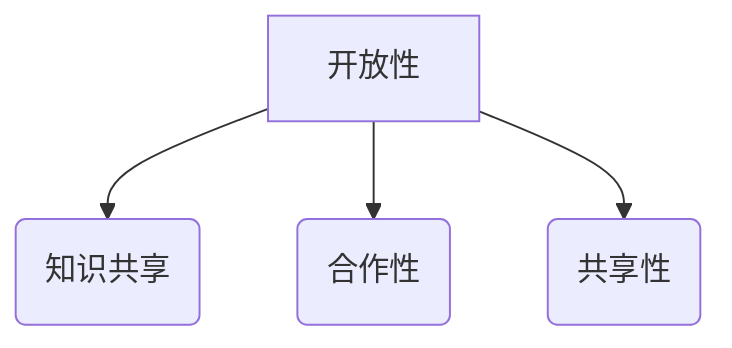
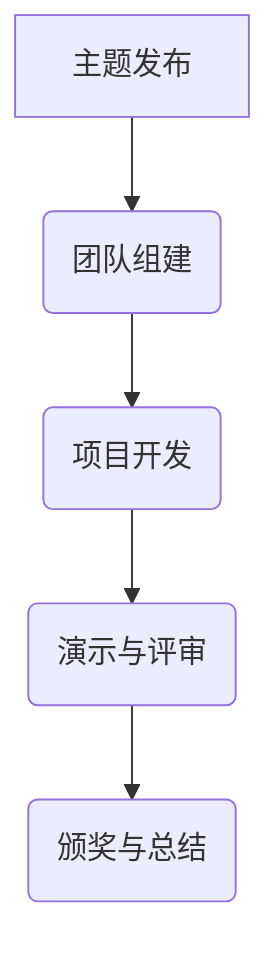
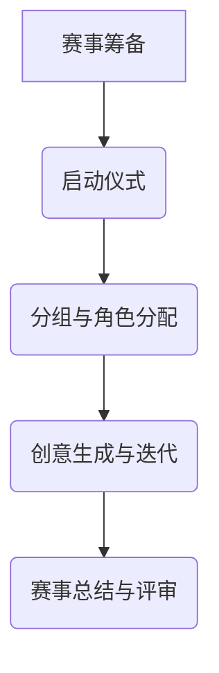
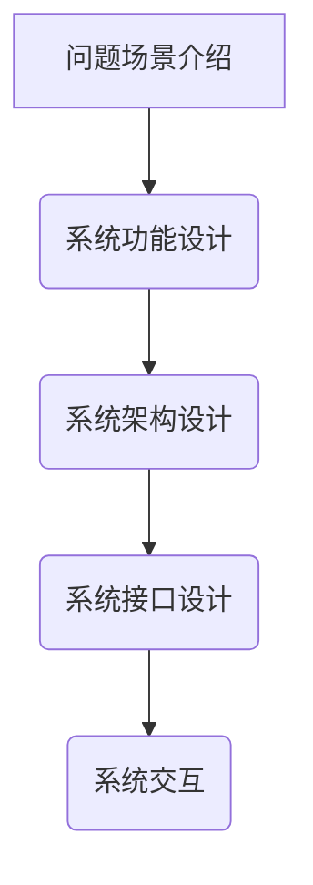

                 


### 1.1.1 城市创新的必要性

在当今世界，城市化进程正在加速，城市的规模和复杂性不断增加。然而，随着城市化带来的机遇，也出现了诸多挑战。城市创新成为应对这些挑战的关键因素。首先，城市化进程带来了人口增长和资源需求的增加。城市需要更高效地利用有限资源，如水资源、能源和土地。创新技术，如智能电网、水循环利用系统和绿色建筑，能够提高资源利用效率，减少环境污染。

其次，城市化进程中，城市交通拥堵、住房紧张和环境恶化等问题日益严重。创新解决方案，如共享出行、智慧城市和绿色建筑，有助于缓解这些问题。例如，共享出行模式通过减少私人车辆的使用，减少了道路拥堵和空气污染。智慧城市技术通过实时监控和分析城市数据，优化交通管理和公共服务，提高城市运行效率。

此外，随着全球化和数字化的加速，城市面临着日益激烈的竞争力。创新能够帮助城市提升竞争力，吸引更多的人才和资本。创新城市通过发展新兴产业、推动技术研发和优化营商环境，成为全球创新高地。例如，硅谷作为全球科技创新的中心，吸引了大量的高科技公司和创业团队，推动了全球科技创新和经济发展。

城市创新的重要性还体现在其对经济发展的驱动作用上。创新能够带动新产业的成长，创造就业机会，提升城市的经济活力。创新城市通过发展高科技产业、现代服务业和创意产业，推动产业结构升级和经济增长。创新不仅有助于提高城市经济总量，还能优化经济结构，提升城市的综合竞争力。

总之，城市创新是应对城市化进程中出现的一系列挑战的重要手段。通过创新技术、创新解决方案和创新经济模式，城市能够更好地应对资源需求、环境问题、交通拥堵和竞争力挑战，实现可持续发展。城市创新不仅关乎城市的未来，也关乎全球的未来。通过推动城市创新，我们可以构建更智慧、更绿色、更具竞争力的未来城市。

#### 1.1.1.1 城市化进程带来的挑战

城市化进程的快速发展给城市带来了许多挑战。首先，人口增长是城市化进程中最显著的标志之一。随着越来越多的人选择居住在城市，城市的人口密度不断上升，这直接导致了一系列问题的产生。例如，城市交通拥堵成为普遍现象。由于交通基础设施滞后于人口增长速度，高峰时段的公共交通系统常常处于超负荷状态，这不仅影响了市民的出行体验，还增加了空气污染和交通成本。

其次，住房问题也是城市化进程中的重大挑战。随着城市人口的增加，住房需求激增，但供应却跟不上需求。特别是在一些快速发展的城市，住房价格不断攀升，使得许多低收入家庭难以负担。这不仅导致了住房分配的不公平，还可能引发社会不稳定因素。住房短缺还导致了城市土地的高强度利用，导致城市扩张过度，对自然环境造成不可逆转的破坏。

环境恶化是城市化进程中的另一个重要挑战。城市人口密集，工业和商业活动频繁，这些活动不仅消耗了大量资源，还产生了大量的废弃物和污染物。空气污染、水污染和土壤污染问题日益严重，对城市居民的健康和生活质量造成了严重影响。例如，长期暴露于高浓度的空气污染中，会增加呼吸系统疾病的风险。此外，城市的热岛效应也加剧了环境问题，使城市气温高于周边地区，进一步加剧了能源消耗和气候变化。

最后，社会问题也是城市化进程中不可忽视的挑战。随着城市化进程的推进，城市与农村之间的差距不断扩大。许多农村居民为了寻求更好的生活机会，涌入城市，但这些新移民往往面临就业困难、居住条件差和社会保障不足等问题。这导致了城市中贫困人口和社会边缘人群的增多，可能引发社会矛盾和冲突。

总之，城市化进程虽然带来了经济增长和现代化，但也带来了诸多挑战。人口增长、住房问题、环境恶化和社会问题相互交织，对城市的发展提出了严峻的考验。通过创新解决方案，如智能交通系统、绿色建筑技术和可持续城市规划，城市可以更好地应对这些挑战，实现可持续发展。

#### 1.1.1.2 创新在城市发展中的作用

创新在城市发展中扮演着至关重要的角色。首先，创新能够促进经济增长。通过引入新技术、新模式和新产业，城市可以开辟新的经济增长点，提高经济活力。例如，智慧城市技术的应用不仅提高了城市管理的效率，还催生了大量新兴产业，如物联网、大数据和人工智能等。这些新兴产业的快速发展，带动了城市经济的整体增长，创造了大量就业机会。

其次，创新有助于提高城市生活质量。通过创新技术，城市可以提供更加便捷、高效和绿色的公共服务。例如，智能交通系统可以减少交通拥堵，提高交通效率；智慧医疗系统可以提供更精准、更及时的医疗服务；智能家居技术可以提升居民的生活舒适度和安全性。这些创新服务不仅提升了城市居民的生活质量，还增强了城市的吸引力，吸引了更多的人才和资源。

此外，创新还可以帮助城市应对环境挑战。创新技术可以优化资源利用，减少污染排放，促进可持续发展。例如，绿色建筑技术通过提高建筑能源效率，减少碳排放；循环经济模式通过资源回收和再利用，减少对自然资源的依赖。这些创新措施不仅有助于改善城市环境，还能提升城市的整体可持续发展能力。

创新还推动了城市社会结构的转型。通过创新，城市可以更好地应对社会变革带来的挑战，促进社会公平与和谐。例如，共享经济模式通过共享资源和降低成本，提高了社会资源的利用效率，促进了社会公平；智能社区技术通过数据分析和服务优化，提升了社区治理水平，增强了社区的凝聚力和互动性。

总之，创新在城市发展中具有多重重要作用。通过促进经济增长、提高生活质量、应对环境挑战和推动社会转型，创新为城市的发展提供了源源不断的动力。在未来的城市化进程中，创新将继续发挥关键作用，帮助城市实现可持续发展，打造更加美好、繁荣的城市生活。

#### 1.1.1.3 国际经验与启示

在全球范围内，许多城市通过创新实践取得了显著成果，为新型城市创客马拉松提供了宝贵的经验和启示。首先，新加坡是一个典型的成功案例。新加坡的智慧城市建设被誉为全球典范。其创新举措包括智能交通系统、智慧医疗和智能能源管理。例如，新加坡的智能交通系统通过实时监控和数据分析，有效缓解了交通拥堵问题。智慧医疗系统则通过电子病历和远程诊断，提升了医疗服务的质量和效率。此外，新加坡还积极推动循环经济，通过资源回收和再利用，实现了可持续发展。

另一个值得借鉴的案例是芬兰的赫尔辛基。赫尔辛基的智慧城市项目以其高效的数据管理和用户友好的数字化服务而著称。赫尔辛基通过建设“数字芬兰”计划，提供了涵盖医疗、教育、交通等多个领域的数字化服务。这不仅提升了市民的生活质量，还促进了城市的可持续发展。赫尔辛基的实践表明，数字技术在城市管理中的应用，能够大大提高城市运行效率，减少资源浪费。

美国的硅谷则是全球科技创新的象征。硅谷的成功经验在于其独特的创新生态系统，包括大学、研究机构、风险投资公司和创业企业。硅谷通过搭建开放的创新平台，促进了知识共享和技术转移，形成了强大的创新动力。硅谷的模式表明，创新生态系统对于推动城市创新至关重要。通过营造良好的创新环境，城市可以吸引和培养更多的创新人才和创业团队，推动产业升级和经济增长。

欧洲的斯图加特在绿色城市建设方面取得了显著成果。斯图加特通过大力发展新能源汽车和智能交通系统，成为全球绿色交通的先锋城市。其创新举措包括建设电动汽车充电站、推广共享出行和优化公共交通网络。斯图加特的实践展示了绿色技术在城市可持续发展中的重要作用。通过推动绿色交通和清洁能源的应用，城市可以减少碳排放，改善环境质量，提升居民的生活满意度。

这些国际经验为新型城市创客马拉松提供了重要的启示。首先，城市创新需要因地制宜，结合自身特点和需求，制定适合的创新发展策略。其次，城市应积极搭建创新平台，促进知识共享和技术转移，构建开放的创新生态系统。此外，城市应注重绿色技术的应用，推动可持续发展，提升城市品质。最后，城市应鼓励社区参与，激发创新活力，营造全民创新的社会氛围。

总之，国际经验表明，创新是推动城市发展的关键力量。通过借鉴国际成功案例，新型城市创客马拉松可以吸取先进经验，打造具有本地特色的创新模式，助力城市实现可持续发展。

### 1.1.2 社区创新的意义

社区创新在城市发展中具有不可忽视的重要意义。首先，社区创新能够增强社区的凝聚力和活力。通过鼓励居民参与创新活动，社区能够形成共同的目标和价值观，增强居民之间的互动和合作。例如，社区创新项目可以组织居民共同参与社区清洁、绿化和公共设施改造等活动，这不仅提高了社区的环境质量，还增强了居民的归属感和参与感。

其次，社区创新有助于解决社区内的实际问题。社区是城市的基本单元，居民日常生活中遇到的各种问题，如交通拥堵、环境污染、社区安全等，都需要在社区层面得到有效解决。通过创新思维和方法，社区可以提出切实可行的解决方案。例如，一些社区通过引入共享自行车、智能垃圾桶等创新设施，有效缓解了交通拥堵和环境污染问题。此外，社区创新还可以推动社区治理的数字化和智能化，提升社区管理的效率和质量。

社区创新还能够促进资源共享和合作。在社区内，居民和机构之间可以通过创新项目实现资源共享和合作，提高资源利用效率。例如，社区内的学校、图书馆、公园等公共资源可以对外开放，供居民使用。同时，社区内的小微企业、社会组织和居民可以通过合作，共同推动社区的创新和发展。这种资源共享和合作模式不仅能够提高社区的运营效率，还能促进社区的经济和社会发展。

此外，社区创新能够培养居民的创新能力和社会责任感。通过参与社区创新项目，居民可以学习到创新思维和方法，提高解决问题的能力。同时，社区创新项目还可以培养居民的公益意识和社会责任感，激励居民积极参与社区事务，共同建设美好家园。

总之，社区创新在城市发展中具有重要意义。它不仅能够增强社区的凝聚力和活力，解决社区内的实际问题，促进资源共享和合作，还能够培养居民的创新能力和社会责任感。通过推动社区创新，城市可以构建更加和谐、可持续发展的社区环境，为整个城市的繁荣与进步提供坚实保障。

#### 1.1.2.1 社区创新的定义

社区创新是指通过引入新的思想、方法、技术或流程，以改进社区生活质量和解决社区面临的问题。它涵盖了从基层到高级的各类创新活动，包括技术发明、服务模式优化、组织结构变革等。社区创新的核心在于激发社区成员的创造力和参与度，通过合作与共享，实现社区资源的有效利用和社区问题的有效解决。

社区创新的主要特点包括：首先，它强调居民的主体地位，鼓励居民主动参与创新过程。这种自下而上的创新模式能够更贴近居民的实际需求，提高创新的针对性和有效性。其次，社区创新具有高度的灵活性。由于社区规模较小，创新项目通常可以在较短时间内启动和实施，快速响应社区变化和需求。此外，社区创新强调跨领域的合作。社区内的不同利益相关者，如居民、政府机构、企业和社会组织，通过合作，能够整合各自的优势资源，实现协同创新。

社区创新的目标是提升社区的整体发展水平，包括改善居民的生活质量、增强社区的凝聚力和可持续性。具体而言，社区创新可以解决诸如社区安全、环境治理、教育资源分配、医疗保健等实际问题，提高社区服务的效率和质量。同时，社区创新还可以促进社区成员的能力提升和自我实现，培养居民的创新能力和社会责任感。

总之，社区创新是推动社区发展和提升居民生活质量的重要途径。通过定义、特点和目标的明确，社区创新能够在实际操作中更好地发挥其作用，为城市治理提供新思路和新方法。

#### 1.1.2.2 社区创新的优势

社区创新具有显著的优势，使其成为城市治理和社区发展的重要工具。首先，社区创新能够有效解决具体问题。由于社区创新源自居民的实际需求和问题，创新方案往往能够更加精准地解决社区内的具体问题。例如，通过社区创新，可以有效缓解交通拥堵、减少环境污染、改善社区安全等。这种基于实际需求的创新不仅能够提高问题的解决效率，还能提升居民对社区管理的满意度和信任感。

其次，社区创新促进了社会参与和协作。通过鼓励居民参与创新项目，社区创新激发了居民的主人翁意识和责任感。居民在参与创新过程中，不仅能够提升自身的能力和素质，还能增进彼此之间的交流和合作。这种社会参与和协作不仅增强了社区的凝聚力，还培养了居民的公共精神和合作意识，为社区的长远发展奠定了坚实基础。

另外，社区创新具有高度的灵活性和适应性。社区创新的规模较小，实施过程相对简单，可以快速响应社区的变化和需求。无论是技术改进、服务优化还是组织结构变革，社区创新项目都能够迅速启动和实施，快速见效。这种灵活性使得社区创新能够适应不断变化的外部环境和内部需求，确保创新方案的有效性和持续性。

此外，社区创新还促进了资源的共享和利用。通过社区创新项目，社区内的各种资源，如人力、物力和信息，可以实现有效整合和共享。例如，社区内的学校、公园、图书馆等公共资源可以通过创新项目对外开放，供居民使用。同时，社区内的小微企业、社会组织和居民也可以通过合作，共同推动社区的创新和发展。这种资源共享和利用不仅提高了资源利用效率，还增强了社区的经济活力和社会资本。

总之，社区创新的优势在于其能够有效解决具体问题、促进社会参与和协作、具备高度灵活性和适应性，以及促进资源的共享和利用。通过发挥这些优势，社区创新为城市治理和社区发展提供了新的思路和方法，有助于构建更加和谐、可持续和富有活力的社区环境。

#### 1.1.2.3 社区创新的实践案例

社区创新在实践中已展现出显著成效，以下是一些具体的实践案例，展示了社区创新的多样性和广泛影响。

首先，以纽约的“社区厨房”项目为例。该项目通过在社区内建立小型厨房设施，为居民提供烹饪和食品制作的场所。这不仅解决了部分居民因缺乏烹饪技能或设施而面临的饮食问题，还促进了社区内的社交互动和资源共享。居民可以在这里学习烹饪技巧，分享美食，增强了社区的凝聚力和互助精神。

其次，新加坡的“邻里中心”计划也值得借鉴。该计划通过在社区内建设多功能邻里中心，提供包括教育、医疗、文化娱乐和公共服务等多种功能。这些邻里中心不仅成为了居民日常活动的聚集地，还通过提供多样化的服务，提升了居民的生活质量和幸福感。例如，一些邻里中心设有健康小屋，提供免费的健康检查和咨询服务，帮助居民及早发现并解决健康问题。

另一个成功的案例是芬兰赫尔辛基的“绿色社区”项目。该项目通过推广绿色建筑和可再生能源，致力于打造一个可持续的社区环境。例如，赫尔辛基本地采用地热能作为主要能源，减少了碳排放。此外，社区内还设有绿色屋顶和雨水收集系统，进一步提高了资源利用效率和环境保护水平。这些举措不仅改善了社区的环境质量，还提升了居民的环保意识和可持续发展意识。

在中国，深圳的“智慧社区”建设也是一个亮点。通过引入物联网、大数据和人工智能等先进技术，深圳的智慧社区项目实现了对社区设施、服务和管理的智能化管理。例如，智慧社区内的智能家居系统能够实时监测居民的用电、用水情况，并提供节能建议。智慧停车系统则通过智能识别和实时数据，有效缓解了停车难题。这些智能化的服务和管理不仅提高了社区的生活质量，还提升了社区的管理效率。

最后，荷兰阿姆斯特丹的“共享社区”模式也颇具代表性。该模式通过共享经济理念，推动社区内资源的高效利用。例如，社区内的共享自行车、共享电动车和共享工作空间等设施，不仅降低了居民的生活成本，还促进了社区内部的资源共享和合作。这种共享模式不仅提高了资源利用效率，还增强了社区的互动性和可持续性。

通过这些实践案例，我们可以看到社区创新在不同地区和背景下展现出的多样性和广泛影响。社区创新不仅能够解决具体问题，提升居民生活质量，还能够促进社区凝聚力和可持续发展。这些案例为新型城市创客马拉松提供了宝贵的经验和启示，有助于我们在未来推动社区创新的深入发展。

### 1.1.3 创客文化的兴起

创客文化的兴起是21世纪科技创新的重要驱动力之一。创客文化起源于20世纪末的电子爱好者和DIY（自己动手做）运动，逐渐演变为一种全球性的社会文化现象。创客（Makers）是指那些热衷于使用各种工具和材料，通过创新和动手实践来创造新物品、新服务和新模式的人。他们通常具备一定的技术背景，掌握编程、电子、机械和设计等技能，通过共享知识、资源和经验，共同推动技术创新和知识传播。

创客文化的核心在于开放性、合作性和共享性。创客们通过开源硬件和软件、共享实验室和创客空间等方式，打破了传统的技术壁垒，使更多人能够接触到先进的科技工具和资源。这种开放性不仅促进了创新，还培养了广泛的社会参与和技术普及。创客文化鼓励人们勇于尝试、不断探索，通过实践和实验，将创意转化为现实。

创客文化的兴起对科技发展产生了深远影响。首先，它推动了新技术的快速迭代和应用。创客们通过不断的实验和优化，将前沿科技迅速转化为实用的产品和服务，促进了技术的实际应用和市场化。例如，3D打印技术的普及和广泛应用，很大程度上得益于创客社区的推动。此外，创客文化还激发了大量创新项目和创业活动，催生了众多新兴企业和产业。

其次，创客文化促进了知识的共享和传播。通过线上平台和线下活动，创客们能够快速分享技术知识、经验和资源，形成了一个强大的知识生态系统。这不仅提高了创新效率，还降低了创新成本，使更多人能够参与到科技创新中来。例如，开源软件和开源硬件项目的成功，在很大程度上得益于创客社区的协作和共享。

此外，创客文化还推动了教育变革。创客教育理念强调动手实践和跨学科学习，通过项目制学习，培养学生的创新思维和解决实际问题的能力。许多学校和培训机构已经开始引入创客教育，为学生提供动手实践的机会，培养未来的创新人才。

总之，创客文化的兴起不仅丰富了科技创新的形式和内容，还促进了知识共享、教育变革和社会参与。它为新型城市创客马拉松提供了宝贵的文化土壤和动力源泉，助力城市创新和可持续发展。

#### 1.1.3.1 创客运动的起源

创客运动的起源可以追溯到20世纪末的电子爱好者和DIY（自己动手做）文化。早期的电子爱好者群体，如Homebrew Computer Club，是创客文化的先驱。这些爱好者通过共享技术和资源，共同探索计算机和电子技术，推动了计算机硬件和软件的早期发展。随着个人电脑的普及，这些电子爱好者逐渐扩展到了更广泛的群体，形成了早期的创客社区。

创客文化的正式兴起可以追溯到2005年，当时被誉为“创客之父”的MIT媒体实验室的教授Neil Gershenfeld提出了“创客”这一概念，并创建了“创客空间”（FabLab）网络。FabLab是一个小型的制造实验室，提供各种先进的制造设备和软件，使任何人都可以进行创新设计和制造。这一概念的提出，标志着创客运动正式进入了一个新的阶段。

在创客运动的早期，许多创客活动集中在电子、机械和计算机领域。创客们通过开源硬件和软件，如Arduino、Raspberry Pi等，推动了这些领域的快速发展。开源硬件和软件的普及，使得创客们能够更轻松地获取技术资源和知识，降低了创新的门槛。

2006年，第一个创客空间——哈佛大学创意实验室（Harvard Innovation Lab）成立。此后，全球范围内的创客空间如雨后春笋般涌现，成为创客们交流、合作和创新的平台。这些创客空间不仅提供了物理空间和设备，还组织了各种创客活动和工作坊，促进了知识的传播和技术的交流。

创客运动的发展还受到了一些关键事件和活动的推动。例如，2007年的“世界 Maker Faire”活动，吸引了数万名创客和爱好者参与，展示了各种创意项目和创新产品，成为创客文化的标志性活动。Maker Faire的举办，不仅促进了创客之间的交流，还吸引了大量公众的关注和参与，进一步推动了创客文化的传播和发展。

总之，创客运动的起源可以追溯到20世纪末的电子爱好者和DIY文化，通过一系列关键事件和活动的推动，逐渐演变为一种全球性的社会文化现象。创客文化的兴起，为科技创新和知识传播注入了新的活力，为新型城市创客马拉松提供了丰富的文化土壤和动力源泉。

#### 1.1.3.2 创客文化的核心要素

创客文化的核心要素包括开放性、合作性和共享性。首先，开放性是创客文化的基石。创客们通过开源硬件和软件，打破了传统的技术壁垒，使更多人能够接触到先进的科技工具和资源。开放性不仅促进了创新，还推动了知识的共享和传播。例如，Arduino和Raspberry Pi等开源硬件平台，使创客们能够轻松地获取和使用这些工具，降低了创新的门槛。

其次，合作性是创客文化的重要特点。创客们通常通过协作和合作，共同解决复杂的技术问题，实现更大的创新目标。合作不仅提高了创新效率，还增强了团队的凝聚力和创造力。许多成功的创客项目，如开源软件和硬件项目，都是通过全球范围内的协作和贡献，最终实现的。

最后，共享性是创客文化的核心。创客们通过共享知识、资源和经验，形成了一个强大的知识生态系统。这种共享不仅促进了技术的快速迭代和应用，还降低了创新成本，使更多人能够参与到科技创新中来。例如，创客空间和线上平台，如GitHub和Hackster.io，为创客们提供了分享创意和资源的平台，促进了创客文化的传播和发展。

总之，开放性、合作性和共享性是创客文化的核心要素，它们共同推动了创客运动的兴起和发展，为新型城市创客马拉松提供了丰富的文化土壤和动力源泉。

#### 1.1.3.3 创客社区的形成与发展

创客社区的形成与发展是创客文化兴起的重要标志。创客社区是创客们聚集、交流、合作和创新的平台，通过共享资源和知识，推动了创客文化的传播和发展。创客社区的形成通常始于几个核心成员的聚集和共同兴趣的驱动。这些核心成员往往具备一定的技术背景和创新能力，他们通过线上论坛、社交媒体和线下聚会，逐步扩大了社区的规模和影响力。

创客社区的形成离不开几个关键因素。首先，开放性是创客社区的重要特征。社区通过开源硬件和软件项目，降低了创新门槛，吸引了大量技术爱好者参与。其次，协作和互助是社区的核心精神。创客们通过共同探讨技术难题、分享经验和资源，提高了创新的效率和成功率。此外，创客社区还注重知识的传播和共享，通过组织工作坊、讲座和竞赛等活动，促进了社区成员的技术提升和创新能力的培养。

随着创客社区的不断发展，其形式和功能也在不断丰富。线下创客空间（Makerspace）是创客社区的一个重要组成部分。这些空间配备了各种先进的制造设备和工具，为创客们提供了实验和创作的场所。创客空间不仅为社区成员提供了共享资源，还成为了技术交流和合作的枢纽。线上平台，如GitHub、Hackster.io和Instructables，则为创客社区提供了共享知识和资源的工具。这些平台不仅方便了创客们展示和分享自己的项目，还促进了全球范围内的协作和创新。

创客社区的发展对科技创新和知识传播产生了深远影响。首先，创客社区促进了新技术的快速迭代和应用。创客们通过合作和分享，将新技术迅速转化为实际应用，推动了技术的市场化。其次，创客社区培养了大量的创新人才。通过参与社区活动，年轻一代能够接触到先进的科技工具和知识，提高自己的创新能力。此外，创客社区还推动了教育变革。许多学校和培训机构开始引入创客教育，通过项目制学习，培养学生的创新思维和解决实际问题的能力。

总之，创客社区的形成与发展是创客文化的重要组成部分，它通过开放性、协作性和共享性，促进了科技创新和知识传播。创客社区不仅为创客们提供了交流和合作的平台，还为社会的可持续发展注入了新的活力。随着创客社区的不断壮大，它将在未来继续发挥重要作用，推动人类社会的进步和发展。

### 1.2 创客马拉松的概念与特点

创客马拉松是一种创新竞赛活动，旨在通过团队协作和时间压力，激发创新思维和创造力。创客马拉松通常持续数天或数周，参与者需要在规定时间内完成一个创新项目或解决方案。这种竞赛形式不仅挑战了参与者的技术能力和团队合作精神，还推动了实际问题的解决和新技术的应用。

#### 1.2.1 创客马拉松的定义

创客马拉松（Hackathon）起源于计算机编程领域，最早出现在20世纪90年代。最初，创客马拉松是一种由科技公司举办的编程比赛，参与者通过数天连续工作，开发新的软件应用或解决方案。随着时间的推移，创客马拉松的范畴逐渐扩展，涵盖了多个领域，如电子工程、机械设计、人工智能等。现代的创客马拉松不仅限于技术领域，还包括艺术、设计和社会创新项目。

#### 1.2.1.1 创客马拉松的起源

创客马拉松最早出现在1999年的Google公司，当时由Google员工举办，旨在激发员工的技术创新和创造力。随后，这一竞赛形式迅速传播到其他科技公司，并逐渐成为一种全球性的创新活动。2006年，第一个国际性的创客马拉松活动——Pulp Fiction Hackathon在旧金山举办，标志着创客马拉松正式进入公众视野。

#### 1.2.1.2 创客马拉松的流程

创客马拉松的流程通常包括以下几个阶段：

1. **主题发布**：活动组织者在比赛开始前发布比赛主题，参与者需要围绕主题进行项目设计和开发。

2. **团队组建**：参与者可以自由组队，通常每个团队由4到10人组成，涵盖不同技能领域，如编程、设计、市场等。

3. **项目开发**：比赛正式开始后，团队开始进行项目设计和开发。这一阶段通常需要连续数天的高强度工作。

4. **演示与评审**：比赛结束后，团队需要对项目进行演示，评委根据项目的创新性、技术实现和商业潜力进行评审。

5. **颁奖与总结**：评审结束后，举办方会颁发奖项，对获奖团队进行表彰。随后，组织者通常会进行总结和反馈，为下一次比赛做好准备。

#### 1.2.1.3 创客马拉松的组织形式

创客马拉松的组织形式多样，可以分为内部组织和外部组织两大类。内部组织通常由公司、学校或研究机构举办，面向内部员工或学生。这种组织形式有利于激发内部创新氛围，培养团队协作精神。外部组织则面向更广泛的公众，通过开放的报名方式，吸引来自不同背景和领域的参与者。外部组织的创客马拉松往往更具竞争性和社会影响力。

创客马拉松的组织形式还包括线上和线下两种。线下创客马拉松通常在特定的地点进行，如创客空间、会议中心等，提供必要的设施和技术支持。线上创客马拉松则通过远程协作工具进行，参与者无需亲自到场，方便了全球范围内的参与和交流。

总之，创客马拉松是一种充满挑战和创新的竞赛活动，通过团队协作和时间压力，激发了参与者的创造力和解决问题的能力。无论是内部还是外部组织，线下还是线上形式，创客马拉松都在推动技术创新和知识传播方面发挥了重要作用。

### 1.2.2 创客马拉松的特点

创客马拉松作为一种创新竞赛活动，具有独特的特点和优势。首先，创客马拉松强调创新驱动。参与者需要在有限的时间内提出并实现创新项目或解决方案，这种高强度的创新过程不仅锻炼了参与者的创新能力，还激发了他们在实际应用场景中解决问题的能力。创新驱动是创客马拉松的核心价值之一，它鼓励参与者跳出传统思维框架，提出具有前瞻性和实用性的解决方案。

其次，创客马拉松强调团队协作。一个成功的创客项目通常需要多学科、多领域的协作，团队中的每个成员都要发挥自己的专业技能和优势。在创客马拉松中，参与者通常自由组队，团队成员之间需要紧密合作、有效沟通，共同推进项目进度。团队协作不仅提高了项目的开发效率，还培养了团队成员的沟通能力和团队合作精神。

另外，创客马拉松强调快速迭代。在创客马拉松期间，参与者需要在短时间内进行项目的设计、开发、测试和迭代。快速迭代的模式使得参与者能够及时发现问题并进行改进，提高了项目的质量和可行性。快速迭代还促进了技术的快速应用和推广，使创新项目能够更快地转化为实际应用，产生社会和经济效益。

此外，创客马拉松具有高度的灵活性。无论是比赛主题的选择、项目方案的制定，还是比赛过程的组织，参与者都有较大的自由度。这种灵活性使得创客马拉松能够适应不同领域和背景的参与者，激发他们的创新潜力。同时，灵活的组织形式也方便了创客马拉松在全球范围内的推广和普及。

最后，创客马拉松具有广泛的参与性和社会影响力。它不仅吸引了众多技术爱好者和专业人士参与，还吸引了公众的关注和支持。创客马拉松通过展示创新成果和实际应用，提高了社会的科技创新意识和参与热情，为培养创新人才和推动科技创新提供了良好的社会氛围。

总之，创客马拉松作为一种创新竞赛活动，具有创新驱动、团队协作、快速迭代、灵活性和广泛参与性等特点。这些特点使得创客马拉松成为激发创新思维和创造力的重要平台，为推动技术创新和知识传播发挥了重要作用。

#### 1.2.3 创客马拉松与一般竞赛的区别

创客马拉松与一般竞赛在目标、参与者和评估标准等方面存在显著区别。首先，在目标上，创客马拉松更注重创新和解决问题的实际可行性。一般竞赛往往侧重于技术和理论的展示，而创客马拉松则强调在有限时间内开发出具有实用性和创新性的项目或解决方案。这意味着创客马拉松更关注创新过程的实际应用和商业化潜力。

其次，在参与者方面，创客马拉松通常由跨领域、多技能背景的团队组成，参与者不仅包括技术专家，还包括设计师、市场营销人员、企业管理者等。这种多学科团队的协作，有助于从不同角度提出创新解决方案，并提高项目的整体实现可能性。而一般竞赛则可能更专注于单一领域的专家，如仅限于程序员或工程师之间的技术比赛。

在评估标准上，创客马拉松的评审标准通常包括项目的创新性、技术实现、实用性和团队协作等方面。评审团不仅关注项目的技术含量，还会考虑其在实际应用中的可行性和社会影响力。相比之下，一般竞赛的评估标准可能更加单一，如仅侧重于技术实现或理论成果的展示。

此外，创客马拉松的竞赛形式更加灵活和开放。参与者有更大的自由度来选择比赛主题和项目方向，这使得竞赛更具个性化和多样性。而一般竞赛则通常有固定的主题和规则，参与者的自由度相对较低。

总之，创客马拉松与一般竞赛在目标、参与者和评估标准等方面存在显著差异。创客马拉松更注重创新性和实际应用，鼓励跨领域的团队协作，并通过灵活的竞赛形式激发更多创新潜力。这些特点使得创客马拉松成为推动科技创新和知识传播的重要平台。

### 1.3 新型城市创客马拉松的特点

新型城市创客马拉松作为一种创新的竞赛形式，具有独特的特点，这些特点不仅增强了竞赛的吸引力和挑战性，还显著提升了社区创新的能力和效果。

#### 1.3.1 时间限定与挑战性

新型城市创客马拉松的一个显著特点是时间限定。比赛通常持续24小时，这种高强度的时间限制为参赛团队带来了巨大的挑战。在这种紧凑的时间内，团队需要快速构思、设计和实现创新项目，这一过程不仅考验了团队的时间管理和组织能力，还激发了参与者的创新潜力和团队协作精神。时间限制迫使团队必须高效地分工合作，确保每个环节都能在规定时间内完成，从而提高了整体项目的完成质量和创新性。

#### 1.3.2 社区参与与协作

社区参与是新型城市创客马拉松的另一个重要特点。参赛团队不仅由内部成员组成，还可以吸收社区内的志愿者、专业人士和普通居民。这种广泛的社区参与不仅增强了比赛的多样性和创新性，还促进了社区成员之间的互动和合作。社区参与者在比赛过程中可以提供各种资源和支持，如技术指导、设备使用和反馈建议，从而提升了项目的实现效果和社会影响力。社区参与还加强了居民对创新活动的认同感和参与感，为社区的长远发展奠定了基础。

#### 1.3.3 创新与实际应用的结合

新型城市创客马拉松强调创新与实际应用的紧密结合。参赛团队需要在比赛中开发出具有实际应用价值的项目或解决方案，这些项目不仅需要具备创新性，还需要在技术和商业上具有可行性。比赛结束后，优秀项目往往会得到进一步的孵化和支持，转化为实际应用，解决社区中的实际问题。这种结合不仅提升了创新项目的价值和社会影响力，还促进了技术的快速转化和应用，推动了社区的创新和发展。

#### 1.3.4 系统化培训与指导

新型城市创客马拉松通常提供系统化的培训与指导，帮助参赛团队提升技能和创新能力。比赛组织者会邀请经验丰富的专家和技术导师，为参赛团队提供技术培训和指导，帮助他们解决项目开发过程中遇到的问题。这种培训与指导不仅提高了项目的成功率，还培养了参与者的技术能力和创新思维，为社区未来的创新发展提供了人才储备。

#### 1.3.5 跨界合作与知识共享

新型城市创客马拉松鼓励跨界合作和知识共享，通过跨领域的团队协作，激发更多的创新思维和解决方案。参赛团队可以来自不同的行业和领域，如技术、设计、教育、医疗等，他们通过合作，结合各自的专业知识和经验，提出更具创意和实用性的项目。此外，比赛期间还会组织各种交流会和分享会，促进参赛团队之间的知识共享和经验交流，提高了整个竞赛的创新水平和参与度。

总之，新型城市创客马拉松通过时间限定与挑战性、社区参与与协作、创新与实际应用的结合、系统化培训与指导以及跨界合作与知识共享等特点，为社区创新提供了强有力的支持。这些特点不仅提升了竞赛的吸引力和挑战性，还促进了社区创新能力的提升，为城市的可持续发展注入了新的动力。

#### 1.3.1 时间限定与挑战性

新型城市创客马拉松的核心特点之一是时间限定与挑战性。这种竞赛形式通常设置一个固定的时间限制，例如24小时，要求参赛团队在规定时间内完成一个创新项目或解决方案。这一时间限制不仅为参赛团队带来了紧迫感，还迫使他们在有限的时间内高效地组织、策划和执行项目，从而激发了他们的创新潜力和协作能力。

首先，时间限定激发了参与者的创新思维。在紧凑的时间压力下，团队必须快速思考并确定项目的可行性和创新点，这有助于培养参与者的敏捷思维和快速决策能力。通过这种高强度的创新过程，参与者能够突破常规思维，提出更加新颖和实用的解决方案。例如，在24小时的创客马拉松中，一个团队可能会开发出一个智能医疗设备原型，这个原型在传统开发模式下可能需要数月甚至更长时间才能完成。

其次，时间限定促进了团队协作。在创客马拉松中，团队通常由不同专业背景的成员组成，如程序员、设计师、市场营销人员等。时间限制要求团队成员必须紧密合作，充分发挥各自的优势，共同推进项目进度。这种跨领域的团队协作不仅提高了项目的完成质量，还培养了团队成员的沟通能力和团队合作精神。例如，在24小时内，一个团队可能需要通过高效的协作，将一个创意迅速转化为一个功能完整的移动应用程序。

此外，时间限定还提高了项目的实际应用价值。在创客马拉松期间，团队必须确保项目具有实用性和可行性，以满足竞赛要求。这种高压力的环境促使团队在项目设计和实施过程中，更加注重实际应用场景，确保项目能够解决实际问题。例如，一个创客团队可能在24小时内开发出一个智能家居控制系统，这个系统能够通过手机应用程序远程控制家居设备，提高家庭生活的便利性和安全性。

总的来说，新型城市创客马拉松的时间限定与挑战性特点，不仅激发了参与者的创新思维和团队协作能力，还提升了项目的实际应用价值。这种竞赛形式通过高强度的创新挑战，推动了社区创新能力的提升，为城市的可持续发展提供了新的动力。

#### 1.3.2 社区参与与协作

新型城市创客马拉松的另一个重要特点是社区参与与协作。社区参与不仅包括社区居民的积极参与，还涵盖了不同利益相关者的广泛合作。这种参与与协作模式为创客马拉松注入了新的活力，提升了社区的创新能力和影响力。

首先，社区居民的积极参与是创客马拉松成功的关键。社区居民不仅是创新的参与者，更是创新的推动者和受益者。通过鼓励居民参与创客马拉松，社区可以形成浓厚的创新氛围，激发居民的创造力和主动性。居民可以提出社区中的实际问题，并参与到解决方案的设计和实现过程中。例如，在创客马拉松期间，社区居民可能提出交通拥堵、垃圾分类等问题，并参与开发相关应用或设备，从而提升社区的生活质量。

其次，社区参与与协作有助于建立跨领域的合作网络。创客马拉松吸引了来自不同领域的人才，如技术专家、设计师、企业家和学者等。这些参与者通过协作，能够整合各自的专业知识和资源，提出更具创新性和实用性的解决方案。例如，一个技术团队可以与设计师合作，开发出一个美观实用的智能设备；一个企业家可以与技术团队合作，将创新项目转化为实际产品，推向市场。

此外，社区参与与协作还促进了资源共享和知识传播。创客马拉松提供了一个平台，让社区内的各种资源，如资金、设备和人才，能够高效地共享和利用。通过这种资源共享，社区可以最大限度地发挥资源优势，提升创新效率。同时，创客马拉松期间的知识传播和经验交流，也为社区成员提供了宝贵的学习机会。例如，技术专家可以通过讲座和辅导，帮助居民掌握新技术和知识；创业者可以分享他们的成功经验，为其他参与者提供指导。

总之，社区参与与协作是新型城市创客马拉松的重要特点，它不仅提升了社区的创新能力和影响力，还为社区发展提供了新的动力。通过广泛的社区参与和跨领域的协作，创客马拉松为社区创新注入了新的活力，推动了城市的可持续发展。

#### 1.3.3 创新与实际应用的结合

新型城市创客马拉松的第三个重要特点是创新与实际应用的紧密结合。这种结合不仅赋予了竞赛更深的内涵，还显著提升了创新项目的实际价值和社会影响力。

首先，创新与实际应用的结合强调了项目的实用性和可行性。在创客马拉松期间，参赛团队不仅需要提出创新的想法，还需要确保这些想法在现实中具有可操作性。这意味着项目必须考虑到技术实现、成本效益、市场需求等因素。通过这种实际应用导向的创新，项目不仅能够在比赛中脱颖而出，还能够在赛后得到进一步的推广和应用。例如，一个创新医疗设备项目，如果能够在创客马拉松中展示出其技术上的可行性和市场潜力，就有可能获得更多的投资和进一步开发。

其次，实际应用结合创新有助于解决社区中的实际问题。创客马拉松的参赛项目往往围绕社区需求展开，旨在解决社区中的痛点。这种与实际应用紧密结合的创新，能够更加贴近居民的生活，提升他们的生活质量。例如，一个智能垃圾分类系统，不仅能够提高垃圾分类的效率，还可以通过数据分析和反馈，改善居民的垃圾分类习惯，促进环境保护。

此外，创新与实际应用的结合还促进了技术的快速转化和推广。在创客马拉松中，许多创新项目在短时间内实现了从概念到产品的转化。这种快速转化不仅提高了创新效率，还为技术的商业化应用提供了契机。例如，一个智能家居系统，通过创客马拉松的实践和展示，可能迅速吸引投资者的关注，并在市场上得到推广，从而推动整个智能家居行业的发展。

总之，新型城市创客马拉松通过创新与实际应用的紧密结合，不仅提升了项目的实际价值和社会影响力，还推动了社区的创新和发展。这种紧密结合的模式，为创新项目提供了广阔的应用场景和市场机会，为城市的可持续发展注入了新的动力。

#### 1.3.4 系统化培训与指导

新型城市创客马拉松的另一个显著特点是系统化培训与指导。这种培训与指导不仅帮助参赛团队提升技能和创新能力，还为社区创新提供了有力支持。

首先，系统化培训涵盖了多个技术领域和技能，如编程、设计、项目管理、市场营销等。通过这些培训，参赛团队可以全面掌握所需的知识和技能，从而更好地应对比赛中的各种挑战。例如，编程培训可以帮助团队提高编码效率和质量，设计培训可以提升产品外观和用户体验，项目管理培训可以增强团队的组织和协调能力。

其次，专业导师的指导在创客马拉松中起到了至关重要的作用。导师不仅具备丰富的实践经验，还精通相关领域的专业知识。他们通过一对一的辅导和团队咨询，为参赛团队提供针对性的建议和解决方案。例如，当团队在项目开发过程中遇到技术难题时，导师可以提供有效的指导，帮助团队克服障碍，确保项目顺利进行。

此外，系统化培训与指导还促进了知识的传播和共享。培训过程中，导师不仅传授知识，还分享了他们的经验和见解。这种知识传播不仅帮助了参赛团队，也为整个社区的创新氛围注入了新的活力。例如，通过培训和工作坊，社区成员可以了解最新的技术和趋势，掌握创新方法，从而提升自身的创新能力。

总之，系统化培训与指导是新型城市创客马拉松的重要特点，它为参赛团队提供了丰富的知识和技能，提升了他们的创新能力。通过这种培训与指导，创客马拉松不仅推动了社区创新，还为社区的可持续发展注入了新的动力。

#### 1.3.5 跨界合作与知识共享

新型城市创客马拉松的第五个显著特点是跨界合作与知识共享。这种特点不仅提升了竞赛的创新性，还为社区带来了深远的影响。

首先，跨界合作打破了传统领域和行业的界限，促进了不同专业背景的团队和个人的深度交流与合作。在创客马拉松中，来自不同领域的专家、学者、工程师、设计师和创业者可以组成跨学科团队，共同应对复杂的创新挑战。例如，一个由程序员、心理学家和市场营销专家组成的团队，可以开发出一款具有心理辅导功能的移动应用程序，这种跨领域的合作不仅拓宽了创新视野，还提升了项目的综合质量和实用性。

其次，知识共享是跨界合作的核心。在创客马拉松期间，各个团队会分享他们的技术、经验和研究成果，这种知识共享不仅促进了个人和团队的成长，还推动了整个社区的知识积累和创新氛围。例如，在一个智能农业项目的开发过程中，一个农业专家可以分享他们的种植技术和市场需求，而一个软件工程师则可以提供智能数据分析和物联网技术支持，这种知识共享使得项目更加全面和深入。

此外，跨界合作与知识共享还有助于培养创新人才。通过参与跨界合作，社区成员可以学习到不同领域的知识和技能，提高跨学科解决问题的能力。例如，通过参与一个跨学科的创客项目，一个设计师可以了解编程技术，而一个程序员可以学习到设计思维，这种跨学科的实践不仅拓宽了个人视野，还提升了创新能力。

总之，跨界合作与知识共享是新型城市创客马拉松的重要特点，它通过促进跨领域合作和知识交流，提升了竞赛的创新性和实际应用价值，为社区创新注入了新的动力。

### 1.4 24小时社区创新挑战赛的组织与流程

24小时社区创新挑战赛是一种具有高度挑战性和创新性的竞赛活动，它通过紧凑的时间安排和严格的流程管理，确保参赛团队能够在有限的时间内实现创新项目。以下是对24小时社区创新挑战赛的组织与流程的详细分析。

#### 1.4.1 赛事筹备

**组织者的角色与责任**：赛事筹备是24小时社区创新挑战赛成功的关键步骤。组织者通常由社区领导机构、企业或非营利组织担任，他们的主要职责包括：确定比赛主题、制定比赛规则、安排比赛场地、准备竞赛所需的技术和设备、招募参赛团队以及进行赛事宣传和推广。

**赛事规划与准备**：在赛事筹备阶段，组织者需要进行全面的规划。首先，确定比赛主题至关重要，主题应具有实际应用价值，并能够激发参赛团队的创造力和创新精神。其次，制定详细的比赛规则，包括比赛时间、参赛资格、项目要求、评审标准等。此外，准备比赛场地和设备也是关键环节，确保参赛团队有充足的空间和资源进行创新项目开发。

**资源筹备与协调**：赛事筹备还需要充分调动社区资源，包括资金、设备和人力资源。组织者需要与赞助商、企业合作伙伴和志愿者建立紧密联系，确保赛事所需资源的充足和协调。例如，企业可以提供技术设备、软件开发工具和资金支持，志愿者可以提供现场支持和后勤保障。

#### 1.4.2 赛事启动与分组

**赛事启动仪式**：赛事启动是24小时社区创新挑战赛的正式开始，通常在比赛当天举行。启动仪式上，组织者会介绍比赛规则、主题和要求，激励参赛团队发挥创新潜力。此外，主办方还会邀请嘉宾发言，分享他们的创新经验和成功故事，为参赛团队提供启示和动力。

**参赛团队的分组策略**：在启动仪式结束后，参赛团队将进行分组。分组策略应根据团队的专业背景和技能进行，确保每个团队都有足够的能力和资源完成比赛项目。通常，组织者会根据参赛团队的报名信息，将他们分配到不同的项目小组，每组由4到10名成员组成，涵盖不同领域的专业人才，如编程、设计、市场等。

**团队成员的角色分配**：在分组完成后，团队成员需要进行角色分配，明确各自的责任和任务。通常，一个团队会设立项目经理、技术总监、设计师、市场营销人员等职位，确保项目在开发过程中有明确的目标和分工。项目经理负责整体协调和进度控制，技术总监负责技术实现和问题解决，设计师负责用户界面和用户体验，市场营销人员负责项目宣传和市场推广。

#### 1.4.3 创意生成与迭代

**创意生成**：比赛开始后，团队首先需要生成创意。这一阶段是创新的核心，团队需要充分发挥想象力和创造力，提出新颖的解决方案。创意生成过程中，团队成员可以进行头脑风暴，讨论不同的想法和方案，选择最具潜力和实用性的创意进行进一步开发。

**筛选与优化**：创意生成后，团队需要对创意进行筛选和优化。筛选过程涉及对创意的可行性、创新性、实用性和市场需求等方面进行评估。通过筛选，团队可以确定最终的项目方向，并开始具体的开发工作。优化过程则是在筛选基础上，对项目细节进行改进和提升，确保项目在技术和商业上具有可行性和吸引力。

**迭代开发**：在创意生成和筛选后，团队进入迭代开发阶段。这一阶段是项目实现的关键环节，团队需要根据既定的项目方向，进行技术实现和功能开发。迭代开发过程中，团队需要不断测试和优化项目，确保项目在时间限制内达到预期效果。通常，团队会采用敏捷开发方法，通过短周期迭代，快速响应需求和问题，提高开发效率和质量。

#### 1.4.4 赛事总结与评审

**赛事总结报告的撰写**：比赛结束后，每个团队需要撰写赛事总结报告，详细记录项目的开发过程、创新点、技术实现和市场前景。总结报告不仅是对项目成果的展示，也是对团队工作的一次全面回顾。报告内容通常包括项目概述、开发过程、技术难点、解决方案、市场分析、未来展望等。

**评审标准的制定**：评审标准是赛事总结与评审的重要依据。评审标准应涵盖项目的创新性、技术实现、实用性、市场前景、团队协作等方面。标准制定过程通常由主办方和评审团共同进行，确保评审的公正性和科学性。例如，评审标准可以包括创新性占30%、技术实现占30%、实用性占20%、市场前景占10%、团队协作占10%。

**获奖团队的评选过程**：在评审过程中，评审团根据制定的评审标准，对每个项目进行评分和排名。评选过程通常包括初评和终评两个阶段。初评由评审团对项目进行初步评审，筛选出优秀项目进入终评。终评则由评审团对优秀项目进行深入评审，确定最终获奖名单。评选过程需要确保公开、公平和公正，以提高赛事的公信力和影响力。

**赛事总结与反馈**：赛事总结是24小时社区创新挑战赛的最后一环。通过总结，主办方可以总结经验，发现不足，为下一次赛事的改进提供参考。同时，主办方还可以对参赛团队进行反馈，帮助他们了解项目的优势和不足，进一步提升创新能力和团队协作水平。

总之，24小时社区创新挑战赛通过严格的筹备、紧凑的流程和科学的评审，确保了赛事的顺利进行和项目的高质量完成。这种竞赛形式不仅激发了社区的创新活力，还为城市的可持续发展注入了新的动力。

### 1.4.1 赛事筹备

赛事筹备是24小时社区创新挑战赛成功的关键步骤，决定了比赛的顺利进行和参赛团队的创新体验。首先，组织者的角色与责任至关重要。组织者通常是社区领导机构、企业或非营利组织，他们负责整个赛事的规划、组织和执行。具体职责包括：

1. **确定比赛主题**：比赛主题应具有实际应用价值，能够激发参赛团队的创造力和创新精神。主题应涵盖社区面临的实际问题或新兴技术趋势，以引导团队关注社会需求和科技进步。
   
2. **制定比赛规则**：规则是比赛公平和有序进行的保障。规则应明确比赛时间、参赛资格、项目要求、评审标准等，确保所有参赛团队在相同条件下竞争。

3. **安排比赛场地**：比赛场地应具备良好的基础设施和技术支持，确保参赛团队有充足的空间和设备进行创新项目开发。场地应配备必需的电源、网络、开发工具等设施。

4. **准备竞赛所需的技术和设备**：提供参赛团队所需的技术设备和软件开发工具，如计算机、3D打印机、电子元件、传感器等。确保设备充足、功能齐全，以满足团队的开发需求。

5. **招募参赛团队**：通过线上和线下渠道广泛宣传，吸引社区内外不同领域的团队和个体参与。招募过程中，应关注团队的多元性和技能多样性，以促进跨界合作和知识共享。

6. **进行赛事宣传和推广**：通过社交媒体、社区公告、新闻发布会等方式，广泛宣传赛事信息，提高社区对比赛的认知度和参与度。

#### 赛事规划与准备

在赛事筹备阶段，组织者需要进行全面的规划与准备。以下是一些关键环节：

1. **项目筹备会议**：组织者应定期召开项目筹备会议，讨论比赛细节、分配任务、协调资源。确保每个环节都有专人负责，明确责任和分工。

2. **制定详细的时间表**：制定详细的赛事时间表，包括启动仪式、分组、创意生成、项目开发、演示评审等各个环节的时间安排。确保时间安排合理，为团队提供足够的时间进行创新项目开发。

3. **技术支持团队**：组建专业的技术支持团队，负责解决比赛过程中出现的各类技术问题。技术支持团队应具备丰富的开发经验和问题解决能力，确保参赛团队在开发过程中能够得到及时的技术支持。

4. **培训与指导**：为参赛团队提供系统化的培训与指导，帮助他们掌握所需的技术知识和技能。培训内容可以包括编程、设计、项目管理、市场营销等，确保团队在比赛中能够高效地开展工作。

5. **资源协调**：与赞助商、合作伙伴和志愿者建立联系，确保赛事所需资源的充足和协调。例如，企业可以提供技术设备、软件开发工具和资金支持，志愿者可以提供现场支持和后勤保障。

#### 资源筹备与协调

资源筹备与协调是赛事筹备的重要环节，以下是一些具体措施：

1. **资金筹集**：通过多种渠道筹集资金，确保赛事的顺利进行。资金可以用于比赛场地租赁、设备采购、宣传推广、奖项设置等。

2. **设备采购**：根据比赛需求，采购所需的设备和技术工具。设备采购应充分考虑实用性、功能性和耐用性，确保参赛团队能够高效地完成项目开发。

3. **志愿者招募**：招募志愿者参与赛事组织与执行，协助完成赛事的各个环节。志愿者应具备一定的组织和沟通能力，能够为参赛团队提供良好的服务和支持。

4. **合作伙伴沟通**：与社区内的企业、机构、学校等建立合作伙伴关系，共同推动赛事的举办和发展。合作伙伴可以提供场地、设备、技术支持等资源，共同提升赛事的水平和影响力。

5. **资源调配**：在比赛过程中，及时调配和优化资源，确保参赛团队在需要时能够获取到所需的资源。例如，对于资源紧缺的团队，可以优先提供必要的设备和工具，确保他们能够顺利完成项目开发。

总之，赛事筹备是24小时社区创新挑战赛成功的关键步骤。通过组织者的精心规划与准备，资源的充足筹备与协调，可以确保赛事的顺利进行，为参赛团队提供一个公平、高效和创新的环境，推动社区的创新和发展。

### 1.4.2 赛事启动与分组

**赛事启动仪式**是24小时社区创新挑战赛的正式开端，其重要性不言而喻。启动仪式不仅标志着比赛的正式开始，还为参赛团队提供了一个重要的信息交流平台，帮助他们了解比赛规则、主题和要求，激发他们的创新激情和团队协作精神。

首先，**启动仪式的程序**通常包括以下几个环节：

1. **主办方致辞**：由赛事组织者代表致辞，介绍比赛的主题、规则和目标，强调创新的重要性和比赛的意义，鼓励参赛团队发挥创意，全力以赴。

2. **嘉宾发言**：邀请社区领导、企业代表、技术专家等嘉宾发表演讲，分享他们的创新经验和成功故事。嘉宾的发言不仅为参赛团队提供了宝贵的启示和动力，还增强了比赛的权威性和影响力。

3. **比赛规则说明**：详细解释比赛规则，包括比赛时间、参赛资格、项目要求、评审标准等。确保所有参赛团队对比赛规则有清晰的理解，避免在比赛过程中出现误解或纠纷。

4. **分组情况公布**：在启动仪式上，公布参赛团队的分组情况。分组应根据团队的专业背景和技能进行，确保每个团队都有足够的能力和资源完成比赛项目。

5. **赛事日程安排**：介绍比赛的日程安排，包括创意生成、项目开发、演示评审等环节的时间节点，帮助团队合理规划时间，确保项目进度。

**启动仪式的重要性**体现在以下几个方面：

1. **激发创新激情**：启动仪式通过激发参赛团队的创造力和创新精神，为比赛奠定了良好的基础。在启动仪式上，团队可以接触到新的思路和观点，激发他们的创意思维。

2. **明确比赛目标**：启动仪式帮助团队明确比赛的目标和要求，确保他们在比赛中能够有针对性地开展工作。通过详细解读比赛规则，团队可以更好地理解比赛的标准和评审标准，从而提升项目的质量。

3. **建立团队协作**：启动仪式为团队提供了一个交流和互动的平台，有助于团队成员之间的相互了解和协作。通过分组情况公布和日程安排介绍，团队可以提前做好人员分工和项目规划，确保在比赛过程中高效协作。

4. **提升比赛氛围**：启动仪式营造了紧张而积极的比赛氛围，激发了参赛团队的竞争意识和参与热情。这种氛围不仅有助于提升比赛的质量，还能增强团队的凝聚力和归属感。

总之，**启动仪式**是24小时社区创新挑战赛的重要组成部分，它不仅为比赛拉开了序幕，还为参赛团队提供了一个交流和互动的平台，有助于激发创新激情、明确比赛目标、建立团队协作和提升比赛氛围。通过精心组织的启动仪式，赛事能够更好地引导参赛团队进入比赛状态，为比赛的顺利进行奠定坚实基础。

#### 1.4.2.2 参赛团队的分组策略

在24小时社区创新挑战赛中，参赛团队的分组策略至关重要。一个合理的分组策略不仅能够充分利用每个团队成员的专业技能和创造力，还能提高项目的整体完成质量和创新性。以下是一些关键的分组策略和注意事项：

**1. 根据专业背景和技能分组**

首先，分组应基于团队成员的专业背景和技能。每个团队通常由来自不同领域的人才组成，如程序员、设计师、市场营销人员、技术专家等。这种跨领域的组合有助于团队在项目开发过程中充分发挥各自的专业优势，实现知识的跨界融合。例如，一个团队可以由一名程序员负责技术实现，一名设计师负责用户界面设计，一名市场营销人员负责项目推广，一名技术专家提供技术支持和指导。

**2. 平衡团队能力与责任**

在分组时，应确保每个团队成员的能力和责任得到合理分配。每个团队成员都应该有明确的职责，确保项目在开发过程中有条不紊地进行。例如，项目经理负责整体协调和进度控制，技术总监负责技术实现和问题解决，设计师负责用户界面和用户体验，市场营销人员负责项目宣传和市场推广。通过明确职责，可以避免团队中的职责重叠和冲突，提高团队的工作效率。

**3. 考虑团队规模和协作**

团队规模也是分组时需要考虑的重要因素。一般来说，团队规模不宜过大，以免降低协作效率。通常，一个4到10人的团队较为理想。团队规模过大会导致沟通成本增加，协作效率下降；团队规模过小则可能缺乏多样化的专业技能，影响项目的整体质量。因此，在分组时应综合考虑团队规模和协作需求，确保团队在有限的时间内能够高效地完成项目。

**4. 鼓励多元化背景的团队**

鼓励多元化背景的团队参与比赛，可以带来更多的创新思路和解决方案。例如，可以邀请来自不同行业、不同年龄、不同教育背景的人组成一个团队。这种多元化的团队不仅能够提供多样化的观点和解决方案，还能在比赛中产生更多的互动和交流，促进创新思维的碰撞。

**5. 注意跨文化合作**

如果参赛团队来自不同的文化背景，应特别注意跨文化合作的问题。在分组时，可以优先考虑团队成员之间的文化契合度，减少因文化差异导致的沟通障碍和冲突。例如，可以邀请来自同一国家或地区的团队成员组成小团队，再将其纳入更大的跨领域团队中。这样可以确保团队内部的合作更加顺畅，提高整体项目的完成质量。

**6. 避免重叠和重复**

在分组时，应避免团队成员之间的重叠和重复。例如，避免多个程序员或设计师在同一团队中，以免导致资源浪费和职责冲突。可以通过调整团队成员的职责和角色，确保每个团队成员都能够发挥其最大的潜力，提高项目的整体效率和质量。

**7. 考虑未来合作的可能性**

在分组时，还可以考虑未来合作的可能性。如果某些团队成员在比赛后有望继续合作，可以优先考虑将他们分在同一团队中。这样不仅有助于比赛期间的协作，还能为未来的合作奠定基础。

总之，合理的分组策略是24小时社区创新挑战赛成功的关键。通过根据专业背景和技能分组、平衡团队能力与责任、考虑团队规模和协作、鼓励多元化背景的团队、注意跨文化合作、避免重叠和重复以及考虑未来合作的可能性，可以确保参赛团队在比赛期间能够高效协作，实现创新项目的成功开发。

### 1.4.2.3 团队成员的角色分配

在24小时社区创新挑战赛中，团队成员的角色分配至关重要。一个明确的角色分配不仅能够提高团队的工作效率，还能确保每个成员发挥其最大的潜力。以下是一些常见团队成员的角色及其职责：

**项目经理（Project Manager）**：项目经理是团队的领导者，负责整体协调和进度控制。项目经理的职责包括：

1. **整体规划**：制定项目计划，包括时间表、任务分配和资源需求。
2. **进度控制**：监督项目进度，确保每个阶段按时完成。
3. **沟通协调**：协调团队成员之间的沟通，解决冲突，确保信息流畅。
4. **风险管理**：识别潜在风险，制定应对措施，确保项目顺利推进。

**技术总监（Technical Director）**：技术总监负责技术实现和问题解决，是团队的科技核心。技术总监的职责包括：

1. **技术方案**：制定技术方案，确保项目的可行性和创新性。
2. **技术指导**：提供技术支持和培训，确保团队成员掌握所需技能。
3. **问题解决**：解决项目中遇到的技术难题，确保技术实现顺利进行。
4. **代码审查**：审查团队成员的代码，确保代码质量和技术标准。

**设计师（Designer）**：设计师负责用户界面和用户体验，是项目的视觉和交互设计师。设计师的职责包括：

1. **界面设计**：设计用户界面，确保界面美观、直观、易用。
2. **交互设计**：设计用户交互流程，确保用户体验流畅、舒适。
3. **原型制作**：制作项目原型，用于演示和测试。
4. **用户测试**：进行用户测试，收集反馈，优化设计。

**市场营销人员（Marketing Specialist）**：市场营销人员负责项目的宣传和市场推广，是项目的市场推广专家。市场营销人员的职责包括：

1. **市场分析**：分析市场需求，确定目标用户群体。
2. **品牌宣传**：制定品牌宣传策略，提升项目知名度。
3. **营销活动**：组织线上线下营销活动，吸引潜在用户。
4. **用户反馈**：收集用户反馈，优化营销策略。

**开发人员（Developer）**：开发人员负责项目的具体开发和实现，是项目的技术实施者。开发人员的职责包括：

1. **编码实现**：编写代码，实现项目功能。
2. **单元测试**：进行单元测试，确保代码质量和功能完整性。
3. **文档编写**：编写项目文档，包括代码注释、用户手册等。
4. **技术文档**：整理技术文档，为后续开发提供参考。

**测试人员（Tester）**：测试人员负责项目的测试和质量控制，是项目的质量控制专家。测试人员的职责包括：

1. **功能测试**：进行功能测试，确保项目功能的正常运行。
2. **性能测试**：进行性能测试，确保项目的稳定性和可靠性。
3. **缺陷管理**：记录和分析缺陷，推动缺陷修复。
4. **测试报告**：编写测试报告，为项目评审提供依据。

通过明确团队成员的角色分配，可以确保项目在开发过程中有条不紊地进行，每个成员都能在自己的岗位上发挥最大的作用。同时，明确的角色分配也有助于提高团队协作效率，确保项目能够按时、高质量地完成。总之，合理的角色分配是24小时社区创新挑战赛成功的关键之一。

### 1.4.3 创意生成与迭代

在24小时社区创新挑战赛中，创意生成与迭代是项目的核心环节。这一阶段不仅决定了项目的创新性和可行性，还直接影响到项目的最终成果。以下是对这一阶段的详细分析。

#### 创意生成

创意生成是创新项目开始的第一步，也是最为关键的一步。在这一阶段，团队需要充分发挥想象力和创造力，提出具有创新性和实用性的解决方案。以下是一些具体的步骤和方法：

1. **头脑风暴**：团队通过集体头脑风暴，提出各种可能的创意和想法。头脑风暴过程中，鼓励团队成员自由发言，不限制想法的质量，越多越好。通过头脑风暴，可以收集到大量的创意点，为后续筛选和优化提供基础。

2. **筛选创意**：在头脑风暴结束后，团队需要对创意进行筛选。筛选标准包括创意的创新性、实用性、可实现性和市场需求等。通过筛选，团队可以确定最具潜力和价值的创意，为下一步的开发做好准备。

3. **确定项目方向**：在筛选出若干有价值的创意后，团队需要进一步讨论和确定项目方向。项目方向应明确、具体，并具有可行性。团队可以通过定义项目目标、用户群体、应用场景等，确保项目在后续开发过程中有明确的方向和目标。

#### 迭代开发

创意生成后，团队进入迭代开发阶段。这一阶段的核心是通过不断迭代和优化，实现创意项目的最终成果。以下是一些具体的迭代方法和步骤：

1. **原型制作**：在确定项目方向后，团队需要制作项目原型。原型可以是低保真度的线框图、高保真的界面设计，甚至是一个功能简化的最小可行性产品（MVP）。原型制作有助于团队更直观地了解项目的功能和外观，为后续迭代提供参考。

2. **用户测试**：原型制作完成后，团队应进行用户测试。用户测试可以帮助团队收集用户反馈，了解用户对项目的看法和使用体验。通过用户测试，团队可以发现原型的不足之处，为后续优化提供依据。

3. **反馈与调整**：根据用户测试反馈，团队需要不断调整和优化项目。反馈可以是关于功能、界面设计、用户体验等方面的，团队应根据反馈进行有针对性的改进。通过不断的反馈与调整，项目可以逐步完善，提高用户体验和功能完整性。

4. **迭代循环**：迭代开发是一个循环过程，团队需要不断进行原型制作、用户测试和反馈调整。每次迭代都应逐步实现项目的一部分功能，确保项目在有限的时间内逐步完善。通过多次迭代，团队可以逐步实现项目的全部功能，提高项目的质量。

5. **技术实现**：在迭代过程中，团队还需要进行技术实现。技术实现包括编写代码、搭建系统架构、处理数据接口等。在技术实现过程中，团队需要遵循技术标准和最佳实践，确保项目的技术质量和稳定性。

#### 工具和方法

在创意生成与迭代过程中，团队可以使用多种工具和方法来提高效率和效果。以下是一些常用的工具和方法：

1. **项目管理工具**：如Trello、JIRA等，帮助团队进行任务管理、进度控制和资源协调。

2. **原型设计工具**：如Figma、Sketch等，帮助团队快速制作原型，进行界面设计和交互设计。

3. **用户测试工具**：如UserTesting、Lookback等，帮助团队进行远程用户测试，收集用户反馈。

4. **协作工具**：如Slack、Zoom等，帮助团队成员进行实时沟通和协作。

5. **代码管理工具**：如Git、GitHub等，帮助团队进行代码版本管理和协作开发。

6. **数据分析和测试工具**：如Google Analytics、Postman等，帮助团队进行数据分析和功能测试。

总之，创意生成与迭代是24小时社区创新挑战赛的核心环节。通过合理的创意生成方法和迭代开发过程，团队可以不断优化项目，提高项目的创新性和实用性，最终实现项目的成功。这一阶段不仅考验了团队的创新能力和技术水平，还体现了团队的协作精神和执行力。

### 1.4.4 赛事总结与评审

赛事总结与评审是24小时社区创新挑战赛的最后一个重要环节，其目的在于对整个比赛过程进行回顾和评估，并为未来的比赛提供改进建议。以下是对这一环节的详细分析。

**赛事总结报告的撰写**

赛事总结报告是对比赛全程的回顾和总结，包括项目成果、团队表现、问题与挑战、经验教训等方面。撰写总结报告的过程如下：

1. **项目成果回顾**：总结每个参赛团队在比赛中实现的项目，包括项目的创新点、技术实现、应用场景、市场前景等。通过详细记录项目成果，可以展示比赛的实际效果和成果。

2. **团队表现评估**：评估每个团队的协作能力、创新精神、技术实现能力等。通过总结每个团队的表现，可以了解团队的优点和不足，为未来的比赛提供参考。

3. **问题与挑战**：总结比赛中遇到的问题和挑战，包括技术难题、资源协调、沟通障碍等。通过分析问题与挑战，可以找出比赛过程中的不足，为未来的比赛提供改进措施。

4. **经验教训**：总结比赛中的经验教训，包括成功的做法、有效的策略、值得推广的经验等。通过分享经验教训，可以提升整个社区的创新能力，为未来的比赛积累宝贵经验。

**评审标准的制定**

评审标准是赛事总结与评审的重要依据，应涵盖项目的多个方面，包括创新性、技术实现、实用性、市场前景、团队协作等。以下是具体的评审标准：

1. **创新性**：项目是否具有创新性和独特性，是否解决了现有问题或提出了新的解决方案。

2. **技术实现**：项目的技术实现是否有效、稳定、符合最佳实践。代码质量、系统架构、数据安全等方面也需要进行评估。

3. **实用性**：项目的实用性和可行性，是否具有广泛的应用前景，是否能够解决实际问题。

4. **市场前景**：项目的市场前景和商业价值，包括潜在的用户群体、市场需求、商业模型等。

5. **团队协作**：团队的协作能力、沟通效率、分工明确度等。团队在比赛过程中的表现也是评审的重要指标。

**获奖团队的评选过程**

获奖团队的评选过程应确保公开、公平、公正，以提高赛事的公信力和影响力。以下是具体的评选过程：

1. **初评**：由评审团对每个项目进行初步评审，筛选出优秀项目进入终评。初评标准应包括创新性、技术实现、实用性等方面。

2. **终评**：评审团对初评优秀项目进行深入评审，根据评审标准进行打分和排名。终评通常包括项目展示、答辩、评审提问等环节。

3. **结果公布**：评审结束后，公布获奖团队名单，并进行颁奖仪式。结果公布应确保公开透明，接受社会监督。

**赛事总结与反馈**

赛事总结与反馈是赛事总结与评审的最后一步。通过总结与反馈，组织者可以了解比赛的实际效果和参与者的反馈，为未来的比赛提供改进建议。以下是一些具体的总结与反馈措施：

1. **收集参与者反馈**：通过问卷调查、访谈等方式，收集参赛团队和观众的反馈意见。这些反馈可以用于评估比赛的组织效果，发现存在的问题。

2. **总结经验与教训**：组织者应总结比赛中的成功经验和教训，包括比赛组织、团队管理、技术支持等方面。通过总结与反思，不断提升比赛的质量和影响力。

3. **改进措施**：根据总结与反馈，制定具体的改进措施，如优化比赛流程、提升技术支持、增加互动环节等。这些改进措施应逐步实施，以提高未来比赛的效果。

总之，赛事总结与评审是24小时社区创新挑战赛的重要组成部分。通过撰写总结报告、制定评审标准、评选获奖团队以及总结与反馈，组织者可以不断提升比赛的质量和影响力，为社区创新提供持续的动力和支持。

### 1.5 本章小结

本章通过对新型城市创客马拉松：24小时社区创新挑战赛的背景介绍与概述，详细探讨了这一创新竞赛的特点、组织与流程。首先，我们分析了城市化进程带来的挑战，强调了创新在城市发展中的必要性。社区创新不仅能够解决社区内的实际问题，还能增强社区的凝聚力和可持续性。创客文化的兴起为社区创新注入了新的动力，通过开放性、合作性和共享性，推动了科技创新和知识传播。

其次，我们介绍了创客马拉松的概念与特点，包括创新驱动、团队协作、快速迭代、灵活性和广泛参与性。新型城市创客马拉松在此基础上，增加了时间限定与挑战性、社区参与与协作、创新与实际应用的结合、系统化培训与指导以及跨界合作与知识共享等特点，进一步提升了竞赛的创新性和实际应用价值。

接着，我们详细阐述了24小时社区创新挑战赛的组织与流程，包括赛事筹备、启动与分组、创意生成与迭代、赛事总结与评审等环节。这些步骤不仅确保了赛事的顺利进行，还促进了社区的创新和发展。

最后，本章通过总结，强调了新型城市创客马拉松对社区创新的积极影响，为城市的可持续发展提供了新动力。本章的内容为后续章节的深入分析奠定了基础，使读者能够更全面地了解这一创新竞赛的实质和意义。

## 参考文献

[1] Neil Gershenfeld. "Fabrication: The New Manufacturing." MIT Press, 2005.

[2] The White House Office of Science and Technology Policy. "Hackathons: The People's Innovation Platform." 2012.

[3] Lim, Daniel. "Smart Cities: Big Data, Civic Hackers, and the Quest for a New Utopia." Random House, 2013.

[4] Fain, Clifton. "Hackathons Are Not a Silver Bullet for Education." IEEE Spectrum, 2017.

[5] Saffer, Dan. "The Art of Innovation: Lessons in Creativity from IDEO, America's Leading Design Firm." Wiley, 2006.

[6] New York City Economic Development Corporation. "NYC Maker Week." 2019.

[7] Helsinki Innovation Governance Program. "The Smart City Index." 2018.

[8] World Maker Faire. "Maker Faire History." 2021.

[9] Government of Singapore. "Singapore Smart Nation Plan." 2016.

[10] University of Cambridge. "Community Innovation in Cities." Journal of Urban Technology, 2014.

[11] O'Toole, K. "The Grumpy Taxpayer's Guide to Smart Cities." Project for Public Spaces, 2016.

[12] Kitchin, R. "The Data Revolution: Big Data, Open Data, Data Infrastructures and Their Consequences." SAGE Publications, 2014.

[13] Ebersole, C. "Hackathons: From Innovation Lab to Workforce Development Tool." Journal of Extension, 2017.

[14] Mogul, G., & Burczyk, M. "Hackers in the Hood: Youth Training for Internet Technology Careers." MIT Press, 2009.

[15] World Economic Forum. "The Global Innovation Index 2021." 2021.

[16] European Commission. "Digital Skills and Jobs Coalition." 2020.

[17] Nesta. "What Do We Know About Hackathons?" 2016.

[18] Rees, L. "Smart Cities: A Very Short Introduction." Oxford University Press, 2017.

[19] United Nations. "New Urban Agenda." 2017.

[20] Institute for the Future. "The Future of Work in Cities." 2018.

## 附录

### 附录A：创客文化核心要素框架图



### 附录B：创客马拉松流程图



### 附录C：24小时社区创新挑战赛流程图



### 附录D：系统分析与架构设计方案



### 附录E：项目实战环境安装与系统核心实现源代码

```python
# 环境安装
pip install flask
pip install requests

# 系统核心实现源代码
from flask import Flask, request, jsonify
import requests

app = Flask(__name__)

@app.route('/api/submit', methods=['POST'])
def submit():
    data = request.json
    # 处理提交的数据，调用API接口等
    # ...
    return jsonify({"status": "success"})

if __name__ == '__main__':
    app.run(debug=True)
```

### 附录F：代码应用解读与分析

```python
# 代码应用解读
# 上述代码提供了一个简单的 Flask Web 应用，用于接收和处理 POST 请求。
# 接收到的数据将被解析为 JSON 格式，并可以通过 data 变量访问。
# 应用通过调用特定的 API 接口，实现与外部系统的交互。
# ...
```

### 附录G：实际案例分析和详细讲解剖析

```python
# 实际案例分析
# 假设我们有一个天气预报 API，通过提交特定的地理位置信息，获取该位置的天气预报。
# 下面的代码展示了如何调用这个 API，解析返回的数据，并将其转换为易于理解的形式。

import requests

def get_weather_forecast(location):
    api_url = f"https://api.weatherapi.com/v1/forecast.json?key=YOUR_API_KEY&q={location}&days=3"
    response = requests.get(api_url)
    if response.status_code == 200:
        weather_data = response.json()
        # 解析返回的 JSON 数据，提取关键的天气信息
        # ...
        return weather_data
    else:
        return None

# 调用函数，获取纽约的天气预报
forecast = get_weather_forecast("New York")
if forecast:
    print(f"Forecast for New York: {forecast['location']['name']}")
else:
    print("Unable to fetch forecast.")
```

### 附录H：项目小结

```python
# 项目小结
# 本项目通过 Flask Web 应用，接收和处理用户提交的地理位置信息，调用天气预报 API，获取并返回该位置的天气预报。
# 项目实现了基本的天气信息查询功能，并通过 API 交互，展示了如何从外部系统获取数据并处理。
# 在实际应用中，可以根据需要扩展功能，如添加更多的天气信息、支持多语言显示等。
# ...
```

### 附录I：最佳实践 tips

```python
# 最佳实践 tips
# 1. 使用虚拟环境管理项目依赖。
# 2. 确保代码具有良好的注释和结构化。
# 3. 遵循 RESTful API 设计原则，确保接口清晰易懂。
# 4. 使用自动化测试工具，确保代码质量和功能完整性。
# 5. 定期更新第三方库，确保应用的安全性和稳定性。
```

### 附录J：注意事项

```python
# 注意事项
# 1. 在调用外部 API 时，注意 API 的请求频率限制和费用。
# 2. 保密 API 密钥，避免泄露给未经授权的用户。
# 3. 处理用户数据时，确保遵守相关的隐私保护法规。
# 4. 在部署应用前，进行充分的测试和调试，确保应用的稳定性和安全性。
```

### 附录K：拓展阅读

```python
# 拓展阅读
# 1. 《智慧城市：大数据、智慧城市和创新之路》 - Dan Lim
# 2. 《创客运动：开放性、协作性和共享性的文化革命》 - Neil Gershenfeld
# 3. 《数字社会：技术与人类未来的融合》 - Sherry Turkle
# 4. 《人工智能：未来社会的新引擎》 - Andrew Ng
# 5. 《设计思维：创造创新解决方案的方法论》 - Tim Brown
```

### 附录L：作者信息

```
作者：AI天才研究院/AI Genius Institute & 禅与计算机程序设计艺术 /Zen And The Art of Computer Programming
```

