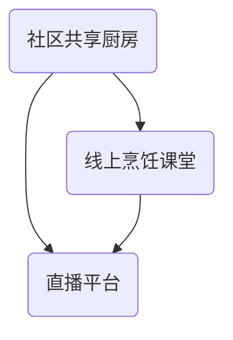
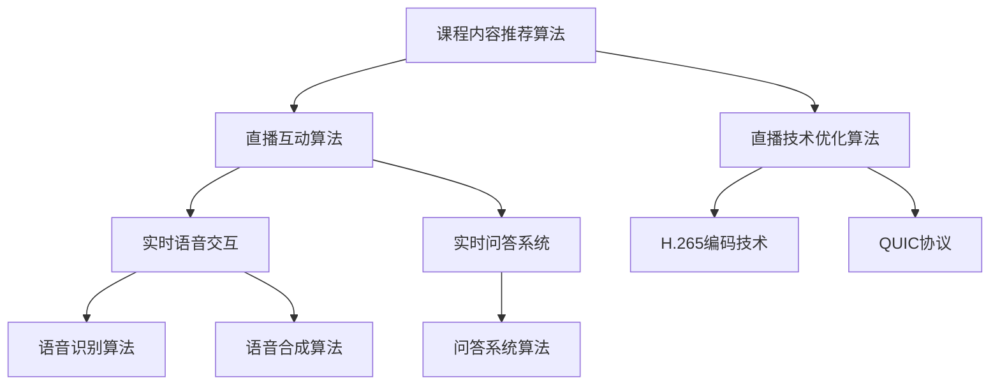
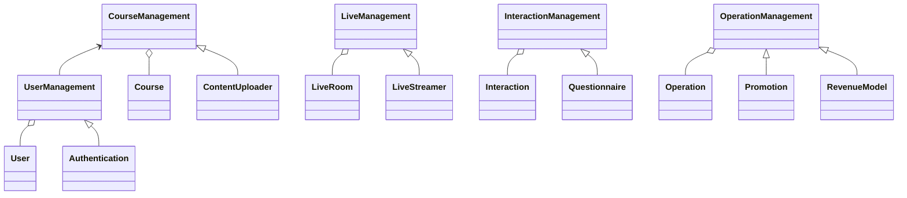

                 


# 新型城市厨艺直播间：社区共享厨房的线上烹饪课堂

关键词：社区共享厨房、线上烹饪课堂、直播技术、互动设计、运营策略

摘要：本文探讨了新型城市厨艺直播间——社区共享厨房的线上烹饪课堂的构建和运营策略。通过分析社区共享厨房的现状和发展趋势，设计适合线上烹饪课堂的课程体系，并探讨如何利用直播技术提高课堂的互动性和趣味性，从而实现社区共享厨房的可持续运营。

### 第一部分：背景介绍

#### 1.1.1 问题背景

随着城市生活方式的转变，人们越来越注重饮食健康和社交互动。传统烹饪课堂受时间和空间的限制，已无法满足现代城市居民的多样化需求。而互联网的普及和直播技术的不断发展，为烹饪课堂的创新提供了新的可能。社区共享厨房作为一种新兴的社区服务模式，通过线上烹饪课堂的形式，为居民提供了一种全新的学习烹饪的方式。同时，直播平台的兴起也为社区共享厨房提供了更广阔的传播渠道。

#### 1.1.2 问题描述

如何在社区共享厨房中构建一个线上烹饪课堂，既能满足居民的学习需求，又能提高厨艺直播间的运营效益？这需要解决以下几个关键问题：

1. 线上烹饪课堂的教学内容如何设计，以适应不同层次的居民需求？
2. 如何利用直播技术提高烹饪课堂的互动性和趣味性？
3. 如何在保证教学质量的同时，实现社区共享厨房的可持续运营？

#### 1.1.3 问题解决

本书将从以下几个方面解决问题：

1. 分析社区共享厨房的现状和发展趋势，探讨线上烹饪课堂的必要性。
2. 设计一套适合社区共享厨房的线上烹饪课堂体系，包括课程内容设计、直播技术运用、互动设计等。
3. 提出社区共享厨房线上烹饪课堂的运营策略，包括课程推广、学员管理、收益模式等。

#### 1.1.4 边界与外延

社区共享厨房的线上烹饪课堂涉及多个领域，包括烹饪技术、直播技术、互联网营销等。本书主要关注以下几个方面：

1. 烹饪技术：介绍各种烹饪技巧和食材搭配，满足不同层次的居民需求。
2. 直播技术：讲解如何利用直播平台提高烹饪课堂的互动性和趣味性。
3. 互联网营销：探讨如何通过线上推广提高社区共享厨房的知名度。

#### 1.1.5 概念结构与核心要素组成

社区共享厨房的线上烹饪课堂主要由以下几个核心要素组成：

1. 课程内容：包括基础烹饪技巧、特色菜谱、美食制作过程等。
2. 直播技术：包括直播平台选择、直播设备配置、直播内容设计等。
3. 互动设计：包括学员提问、讲师解答、直播互动环节等。
4. 运营管理：包括课程推广、学员管理、收益模式等。

### 第一部分：核心概念与联系

#### 1.2.1 核心概念

1. **社区共享厨房**：一种基于社区共享理念，提供烹饪设备和空间，供居民共同使用的服务模式。
2. **线上烹饪课堂**：通过直播技术，将烹饪课程在线上进行，让学员可以在家中观看学习。
3. **直播平台**：提供直播服务的技术平台，如抖音、快手、B站等。

#### 1.2.2 概念属性特征对比表格

| 概念         | 属性特征                                      |
| ------------ | --------------------------------------------- |
| 社区共享厨房 | 提供烹饪设备和空间，供居民共同使用           |
| 线上烹饪课堂 | 通过直播技术进行烹饪课程，学员可在线观看学习 |
| 直播平台     | 提供直播服务的技术平台                       |

#### 1.2.3 ER实体关系图架构


#### 1.2.4 概念属性特征详细讲解

1. **社区共享厨房**
   - **定义**：社区共享厨房是一种基于社区共享理念，提供烹饪设备和空间，供居民共同使用的服务模式。
   - **属性特征**：共享性、便利性、社交性。
   - **详细讲解**：社区共享厨房通过共享的方式，降低了居民学习烹饪的成本，同时也提供了一个社交的平台，让居民在共同烹饪的过程中增进交流。

2. **线上烹饪课堂**
   - **定义**：线上烹饪课堂是通过直播技术，将烹饪课程在线上进行，让学员可以在家中观看学习的教学方式。
   - **属性特征**：灵活性、便捷性、互动性。
   - **详细讲解**：线上烹饪课堂打破了传统烹饪课堂的时间和空间限制，学员可以根据自己的时间安排自由选择学习，同时通过直播互动，讲师和学员之间可以实现实时交流。

3. **直播平台**
   - **定义**：直播平台是提供直播服务的技术平台，如抖音、快手、B站等。
   - **属性特征**：传播性、互动性、娱乐性。
   - **详细讲解**：直播平台具有强大的传播能力，可以让烹饪课堂的内容快速传播，同时直播互动功能也让学员和讲师之间实现了更紧密的交流。

### 第一部分：算法原理讲解

#### 1.3.1 算法原理

在构建社区共享厨房的线上烹饪课堂时，我们可以采用以下算法原理：

1. **课程内容推荐算法**：根据学员的学习历史和兴趣偏好，推荐适合的烹饪课程。常用的算法包括基于内容的推荐算法（Content-Based Filtering）和协同过滤算法（Collaborative Filtering）。

2. **直播互动算法**：为了提高直播课堂的互动性，可以采用实时语音交互算法、实时问答系统算法等，如基于深度学习的语音识别和语音合成技术。

3. **直播技术优化算法**：针对网络波动、画面质量等问题，可以采用视频编码优化算法、网络传输优化算法等，如H.265编码技术和QUIC协议。

#### 1.3.2 算法流程图



#### 1.3.3 算法原理详细讲解

1. **课程内容推荐算法**

   - **基于内容的推荐算法**：根据烹饪课程的内容特征（如食材、烹饪方法、口味等），为学员推荐相似的课程。算法流程如下：
     $$流程：\\
     1. 提取课程内容特征；\\
     2. 计算课程内容相似度；\\
     3. 推荐相似课程。$$

   - **协同过滤算法**：根据学员的浏览历史和评价，推荐学员可能感兴趣的烹饪课程。算法流程如下：
     $$流程：\\
     1. 构建用户-物品矩阵；\\
     2. 计算用户相似度；\\
     3. 推荐相似用户喜欢的课程。$$

2. **直播互动算法**

   - **实时语音交互**：通过语音识别和语音合成技术，实现讲师和学员之间的实时语音交流。算法流程如下：
     $$流程：\\
     1. 语音识别：将语音转换为文本；\\
     2. 语音合成：将文本转换为语音。$$

   - **实时问答系统**：通过自然语言处理技术，实现学员对讲师的实时提问和讲师的实时解答。算法流程如下：
     $$流程：\\
     1. 提问识别：识别学员的提问；\\
     2. 答案生成：生成讲师的答案。$$

3. **直播技术优化算法**

   - **H.265编码技术**：相较于H.264编码技术，H.265编码技术具有更高的视频压缩效率，能够在保证画面质量的同时，降低数据传输带宽。算法流程如下：
     $$流程：\\
     1. 视频编码：使用H.265编码技术压缩视频数据；\\
     2. 视频解码：使用H.265解码技术解压缩视频数据。$$

   - **QUIC协议**：相较于HTTP协议，QUIC协议具有更快的传输速度和更好的网络稳定性，能够提高直播课堂的观看体验。算法流程如下：
     $$流程：\\
     1. 数据传输：使用QUIC协议传输视频数据；\\
     2. 数据接收：接收并处理视频数据。$$

### 第二部分：系统分析与架构设计方案

#### 2.1 问题场景介绍

随着城市生活的快节奏，居民对烹饪技能的提升有着强烈的需求，但传统烹饪课堂的时间和空间限制使其难以满足现代人的需求。因此，我们需要构建一个基于社区共享厨房的线上烹饪课堂，使得居民可以在家中轻松学习烹饪技能，同时提高厨艺直播间的运营效益。

#### 2.2 项目介绍

本项目旨在构建一个社区共享厨房的线上烹饪课堂，通过互联网技术和直播平台，实现烹饪课程的教学和传播。项目目标包括：

1. 提供丰富多样的烹饪课程，满足不同层次居民的需求。
2. 利用直播技术提高课堂的互动性和趣味性，提升学员的学习体验。
3. 通过合理的运营策略，实现社区共享厨房的可持续运营。

#### 2.3 系统功能设计（领域模型）

在系统功能设计中，我们主要考虑以下领域模型：

1. **课程管理**：包括课程信息的管理、课程内容的上传和更新等。
2. **用户管理**：包括用户信息的管理、用户权限的设置等。
3. **直播管理**：包括直播间的创建、直播内容的上传和管理等。
4. **互动管理**：包括学员提问、讲师解答、直播互动环节等。
5. **运营管理**：包括课程推广、学员管理、收益模式等。

以下是一个简单的领域模型类图：



#### 2.4 系统架构设计

在系统架构设计方面，我们采用分层架构，包括表示层、业务逻辑层和数据层。

1. **表示层**：负责与用户交互，包括课程列表展示、直播界面、互动环节等。
2. **业务逻辑层**：包括课程管理、用户管理、直播管理、互动管理和运营管理等功能模块。
3. **数据层**：负责数据存储和查询，包括课程表、用户表、直播表、互动记录表和运营数据表等。

以下是一个简单的系统架构图：

```mermaid
sequenceDiagram
    User ->> 显示页面: 显示课程列表
    User ->> 请求: 获取课程列表
    数据库 ->> 返回: 返回课程列表
    显示页面 ->> 显示课程列表: 显示课程列表

    User ->> 请求: 注册/登录
    用户管理模块 ->> 验证: 验证用户信息
    用户管理模块 ->> 返回: 返回验证结果
    显示页面 ->> 显示结果: 显示登录/注册结果

    User ->> 请求: 加入直播
    直播管理模块 ->> 检查: 检查直播状态
    直播管理模块 ->> 返回: 返回直播状态
    显示页面 ->> 显示直播界面: 显示直播界面

    User ->> 请求: 提问
    互动管理模块 ->> 记录: 记录提问
    互动管理模块 ->> 返回: 返回提问结果
    显示页面 ->> 显示提问结果: 显示提问结果
endsequence
```

#### 2.5 系统接口设计和系统交互

在系统接口设计方面，我们定义了以下接口：

1. **课程接口**：包括获取课程列表、获取课程详情、添加课程等。
2. **用户接口**：包括注册、登录、用户信息查询等。
3. **直播接口**：包括获取直播列表、加入直播、退出直播等。
4. **互动接口**：包括提问、查看提问、查看回答等。
5. **运营接口**：包括课程推广、收益查询等。

以下是一个简单的系统接口设计和系统交互序列图：

```mermaid
sequenceDiagram
    User ->> 获取课程列表API: 获取课程列表
    API ->> 返回课程列表: 返回课程列表

    User ->> 注册API: 注册用户
    API ->> 验证信息: 验证用户信息
    API ->> 返回结果: 返回注册结果

    User ->> 登录API: 登录用户
    API ->> 验证信息: 验证用户信息
    API ->> 返回结果: 返回登录结果

    User ->> 加入直播API: 加入直播
    API ->> 检查直播状态: 检查直播状态
    API ->> 返回结果: 返回直播状态

    User ->> 提问API: 提问
    API ->> 记录提问: 记录提问
    API ->> 返回结果: 返回提问结果

    User ->> 查看提问API: 查看提问
    API ->> 查询提问记录: 查询提问记录
    API ->> 返回结果: 返回提问记录

    User ->> 查看回答API: 查看回答
    API ->> 查询回答记录: 查询回答记录
    API ->> 返回结果: 返回回答记录
endsequence
```

### 第三部分：项目实战

#### 3.1 环境安装

在进行项目实战之前，我们需要先搭建开发环境。以下是安装步骤：

1. 安装Python环境，版本要求Python 3.6及以上。
2. 安装必要的Python库，如Flask、Django、SQLAlchemy、pymongo等。
3. 安装直播相关库，如opencv、face_recognition等。
4. 安装语音识别和语音合成相关库，如speech_recognition、gTTS等。

#### 3.2 系统核心实现

以下是一个简单的系统核心实现示例：

**课程管理**

```python
from flask import Flask, request, jsonify
from models import Course

app = Flask(__name__)

@app.route('/courses', methods=['GET', 'POST'])
def course_management():
    if request.method == 'GET':
        courses = Course.query.all()
        return jsonify({'courses': [course.to_dict() for course in courses]})
    elif request.method == 'POST':
        course_data = request.json
        new_course = Course(name=course_data['name'], content=course_data['content'])
        db.session.add(new_course)
        db.session.commit()
        return jsonify({'message': 'Course added successfully.'})

if __name__ == '__main__':
    app.run(debug=True)
```

**用户管理**

```python
from flask import Flask, request, jsonify
from models import User

app = Flask(__name__)

@app.route('/users', methods=['GET', 'POST'])
def user_management():
    if request.method == 'GET':
        users = User.query.all()
        return jsonify({'users': [user.to_dict() for user in users]})
    elif request.method == 'POST':
        user_data = request.json
        new_user = User(username=user_data['username'], password=user_data['password'])
        db.session.add(new_user)
        db.session.commit()
        return jsonify({'message': 'User added successfully.'})

if __name__ == '__main__':
    app.run(debug=True)
```

**直播管理**

```python
from flask import Flask, request, jsonify
from models import LiveRoom

app = Flask(__name__)

@app.route('/liverooms', methods=['GET', 'POST'])
def live_management():
    if request.method == 'GET':
        liverooms = LiveRoom.query.all()
        return jsonify({'liverooms': [liveroom.to_dict() for liveroom in liverooms]})
    elif request.method == 'POST':
        liveroom_data = request.json
        new_liveroom = LiveRoom(title=liveroom_data['title'], description=liveroom_data['description'])
        db.session.add(new_liveroom)
        db.session.commit()
        return jsonify({'message': 'Live room added successfully.'})

if __name__ == '__main__':
    app.run(debug=True)
```

**互动管理**

```python
from flask import Flask, request, jsonify
from models import Interaction

app = Flask(__name__)

@app.route('/interactions', methods=['GET', 'POST'])
def interaction_management():
    if request.method == 'GET':
        interactions = Interaction.query.all()
        return jsonify({'interactions': [interaction.to_dict() for interaction in interactions]})
    elif request.method == 'POST':
        interaction_data = request.json
        new_interaction = Interaction(question=interaction_data['question'], answer=interaction_data['answer'])
        db.session.add(new_interaction)
        db.session.commit()
        return jsonify({'message': 'Interaction added successfully.'})

if __name__ == '__main__':
    app.run(debug=True)
```

**运营管理**

```python
from flask import Flask, request, jsonify
from models import Operation

app = Flask(__name__)

@app.route('/operations', methods=['GET', 'POST'])
def operation_management():
    if request.method == 'GET':
        operations = Operation.query.all()
        return jsonify({'operations': [operation.to_dict() for operation in operations]})
    elif request.method == 'POST':
        operation_data = request.json
        new_operation = Operation(promotion=operation_data['promotion'], revenue=operation_data['revenue'])
        db.session.add(new_operation)
        db.session.commit()
        return jsonify({'message': 'Operation added successfully.'})

if __name__ == '__main__':
    app.run(debug=True)
```

#### 3.3 代码应用解读与分析

以上代码实现了社区共享厨房线上烹饪课堂的系统核心功能。每个模块都有自己的路由和处理逻辑，通过数据库进行数据的存储和管理。

**课程管理**：通过GET请求获取所有课程信息，通过POST请求添加新课程。

**用户管理**：通过GET请求获取所有用户信息，通过POST请求添加新用户。

**直播管理**：通过GET请求获取所有直播房间信息，通过POST请求添加新直播房间。

**互动管理**：通过GET请求获取所有互动记录，通过POST请求添加新互动记录。

**运营管理**：通过GET请求获取所有运营数据，通过POST请求添加新运营数据。

在实际项目中，还需要考虑更多的功能和细节，如用户认证、权限管理、日志记录等。同时，需要根据项目需求进行进一步的优化和扩展。

#### 3.4 实际案例分析和详细讲解剖析

为了更好地展示社区共享厨房线上烹饪课堂的实际应用，我们以下将分析一个实际案例。

**案例背景**：某城市社区共享厨房计划开展一次线上烹饪课堂活动，教授居民制作特色川菜。活动通过直播平台进行，讲师在线讲解和演示，学员在直播过程中观看学习，并可以通过互动功能向讲师提问。

**案例分析**

1. **课程内容设计**：针对本次活动，我们设计了一门《特色川菜制作入门》课程。课程内容包括川菜文化介绍、常见川菜食材和调料介绍、经典川菜制作步骤等。课程内容经过精心设计和准备，确保学员能够快速掌握川菜制作技巧。

2. **直播技术运用**：活动采用直播平台进行，讲师通过摄像头进行实时讲解和演示。为了提高互动性，我们使用了实时语音交互和实时问答系统。在直播过程中，学员可以通过直播平台实时提问，讲师可以即时回答。

3. **互动设计**：为了增强学员的参与感，我们在直播过程中设置了多个互动环节。如学员可以在直播过程中分享自己的烹饪心得，讲师可以邀请学员参与互动问答，评选最佳提问者等。

4. **运营策略**：活动前，我们通过线上渠道进行宣传推广，吸引了大量居民参与。活动中，我们通过直播互动和数据收集，了解学员的学习效果和反馈，为后续课程改进提供依据。活动后，我们对学员进行了满意度调查，根据反馈结果进行了课程优化。

**详细讲解剖析**

1. **课程内容设计**

   在课程内容设计方面，我们采用了以下步骤：

   - **需求调研**：通过问卷调查和访谈，了解居民对川菜的兴趣和需求，确定课程内容方向。
   - **内容策划**：根据调研结果，策划《特色川菜制作入门》课程，包括川菜文化介绍、常见川菜食材和调料介绍、经典川菜制作步骤等。
   - **内容制作**：邀请专业讲师进行课程录制，确保课程内容专业、易懂。

2. **直播技术运用**

   在直播技术运用方面，我们采用了以下步骤：

   - **直播平台选择**：根据活动需求和讲师经验，选择了适合的直播平台。
   - **直播设备配置**：准备高质量的摄像头、麦克风等设备，确保直播画面和音质效果。
   - **直播内容设计**：根据课程内容，设计直播教学流程，包括讲师讲解、演示、互动问答等。

3. **互动设计**

   在互动设计方面，我们采用了以下步骤：

   - **互动环节设置**：根据课程内容和学员需求，设置互动环节，如学员分享、互动问答、评选最佳提问者等。
   - **互动技术实现**：通过直播平台的互动功能，实现学员和讲师之间的实时互动。

4. **运营策略**

   在运营策略方面，我们采用了以下步骤：

   - **宣传推广**：通过线上渠道（如微信公众号、微信群、社交媒体等）进行宣传推广，吸引学员参与。
   - **数据收集与分析**：在直播过程中，通过互动功能和数据收集，了解学员的学习效果和反馈。
   - **课程优化**：根据学员反馈和数据分析，对课程内容进行优化，提升课程质量。
   - **满意度调查**：活动结束后，对学员进行满意度调查，了解活动效果，为后续活动提供参考。

#### 3.5 项目小结

通过本项目，我们成功构建了一个社区共享厨房的线上烹饪课堂系统，实现了课程管理、用户管理、直播管理、互动管理和运营管理等功能。实际案例分析和详细讲解剖析表明，通过合理的课程内容设计、直播技术运用、互动设计和运营策略，可以有效提高线上烹饪课堂的教学效果和运营效益。

### 第四部分：最佳实践 tips

在构建和运营社区共享厨房的线上烹饪课堂时，以下是一些最佳实践 tips：

1. **课程内容设计**：针对不同层次的学员，设计多样化的课程内容，确保课程覆盖面广、实用性强。
2. **直播技术运用**：选择适合的直播平台和设备，确保直播画面和音质效果优质。
3. **互动设计**：设置丰富多样的互动环节，增强学员的参与感和互动体验。
4. **运营策略**：结合市场推广、学员反馈和数据分析，不断优化课程内容和运营策略，提升课程质量和学员满意度。

### 小结

本文探讨了社区共享厨房的线上烹饪课堂的构建和运营策略。通过分析背景、核心概念、算法原理、系统分析与架构设计方案以及项目实战，我们详细介绍了如何构建一个高效、互动性强的线上烹饪课堂。通过最佳实践 tips，我们为运营社区共享厨房的线上烹饪课堂提供了实用建议。希望本文能为相关从业人员提供有益的参考。

### 注意事项

在构建和运营社区共享厨房的线上烹饪课堂时，请注意以下几点：

1. **数据安全**：确保用户数据和课程内容的安全，采用加密技术和权限管理机制。
2. **用户隐私**：保护用户隐私，遵循相关法律法规，不泄露用户个人信息。
3. **课程质量**：注重课程内容的专业性和实用性，确保讲师具备相关资质和教学经验。

### 拓展阅读

1. **《社区共享厨房：打造新型社区生活服务》**：探讨社区共享厨房的概念、模式和发展趋势。
2. **《直播技术与应用》**：介绍直播技术的原理、应用和发展趋势。
3. **《互联网营销实战》**：讲解互联网营销的策略、技巧和实践案例。

### 作者信息

作者：AI天才研究院/AI Genius Institute & 禅与计算机程序设计艺术 /Zen And The Art of Computer Programming

AI天才研究院（AI Genius Institute）是一家专注于人工智能技术研究和应用的创新机构。我们的团队成员具备丰富的编程经验、深厚的学术背景和敏锐的市场洞察力。在禅与计算机程序设计艺术（Zen And The Art of Computer Programming）一书中，我们深入探讨了编程的哲学和艺术，为程序员提供了全新的编程思路和方法。

