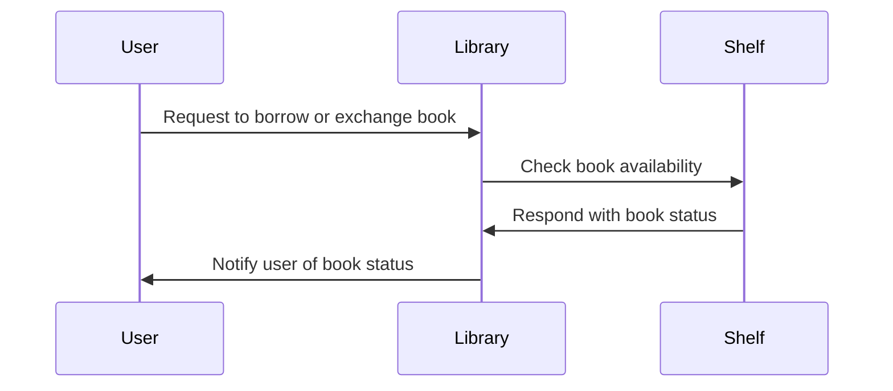
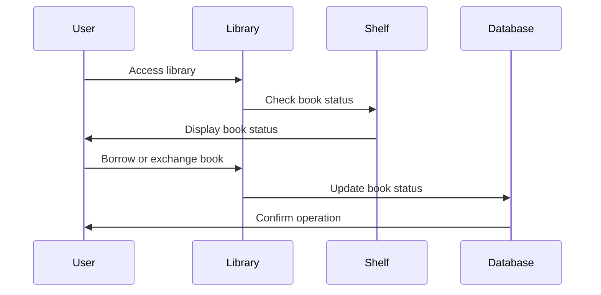
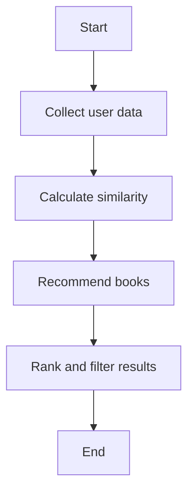
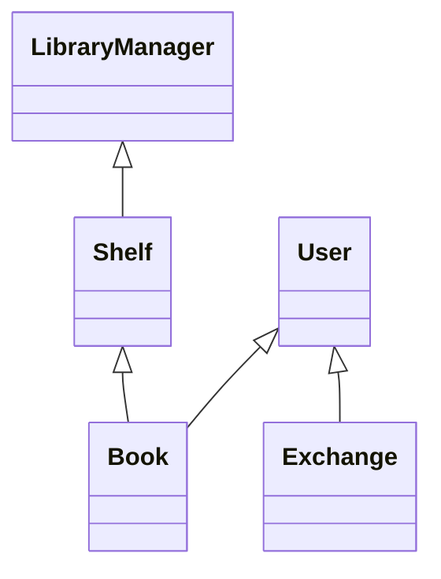

                 

### 新型城市图书漂流站：24小时自助图书交换系统

> 关键词：图书漂流、自助图书交换、24小时服务、系统架构设计、算法原理

> 摘要：本文探讨了新型城市图书漂流站的构建，一种24小时自助图书交换系统，旨在提高图书利用率，满足城市居民的阅读需求。文章详细介绍了系统的背景、核心概念、系统架构设计以及算法原理，并通过实际案例进行分析与实战讲解。

## 第一部分：背景介绍

### 第1章：问题背景与概述

#### 1.1 问题背景

随着城市化进程的加速，人们对阅读的需求日益增长。然而，传统的图书馆在时间和空间上存在诸多限制，无法完全满足居民的阅读需求。因此，如何搭建一种高效、便捷的图书交换系统成为了当务之急。

**核心概念**：城市图书漂流、自助图书交换、24小时服务。

**问题描述**：如何在城市中搭建一种高效、便捷的图书交换系统，以满足居民24小时阅读需求？

**问题解决**：通过构建24小时自助图书漂流站，实现图书的即时交换。

**边界与外延**：系统需覆盖不同地理区域，满足不同人群需求。

**概念结构与核心要素组成**：

1. 图书漂流站：提供图书交换的物理空间。
2. 用户：图书交换的参与者。
3. 图书：交换的对象。
4. 交换机制：图书借阅、归还、交换的规则。
5. 技术支持：系统运行的软硬件基础设施。

### 第2章：核心概念与联系

#### 2.1 核心概念原理

图书漂流站是一种以图书为媒介，通过用户自行借阅、归还，实现图书资源共享的模式。它旨在打破时间和空间的限制，让图书资源更加便捷地流通。

**属性特征对比表格**：

| 特征        | 传统图书馆             | 自助图书漂流站             |
| ----------- | ---------------------- | -------------------------- |
| 时间限制    | 工作时间               | 24小时全天候开放           |
| 空间限制    | 单一物理地址           | 分布在多个地理区域         |
| 借阅规则    | 需要预约或排队         | 自助借阅，无需预约         |
| 图书来源    | 图书馆采购             | 用户捐赠、交换             |
| 管理方式    | 专业人员管理           | 技术系统自动管理           |

**ER实体关系图架构**：

使用Mermaid绘制实体关系图，展示系统主要实体及其相互关系。

```mermaid
erDiagram
  User ||--|{ Book } : borrowed
  User ||--|{ Exchange } : exchange
  Book ||--|{ Shelf } : stored
  Shelf ||--|{ Book } : available
  Exchange ||--|{ User } : exchanged
```

## 第二部分：系统架构设计

### 第3章：系统功能设计

#### 3.1 项目介绍

**项目名称**：新型城市图书漂流站  
**项目目标**：构建一个全天候自助图书交换系统，提高图书利用率。  
**系统功能概述**：图书借阅、归还、交换、图书管理、用户管理等。

### 第4章：系统架构设计

**4.1 系统架构设计**

**Mermaid架构图**：



### 第5章：系统接口设计

**5.1 接口设计原则**

- **接口类型**：RESTful API、WebSocket  
- **接口规范**：遵循RESTful设计原则，使用HTTPS加密通信。

**5.2 接口详细设计**

- **图书借阅接口**：描述接口URL、请求参数、响应格式。  
- **图书归还接口**：描述接口URL、请求参数、响应格式。  
- **图书交换接口**：描述接口URL、请求参数、响应格式。

### 第6章：系统交互设计

**6.1 系统交互流程**

**Mermaid序列图**：



## 第三部分：算法原理讲解

### 第7章：图书推荐算法

**7.1 算法原理**

**基于协同过滤的图书推荐算法**：

- **协同过滤**：通过分析用户之间的共同偏好，为用户推荐感兴趣的图书。
- **算法流程**：

  1. 收集用户借阅历史数据。
  2. 计算用户之间的相似度。
  3. 根据相似度为用户推荐相似用户的借阅记录。
  4. 对推荐结果进行排序和筛选。

**Mermaid流程图**：



### 第8章：算法数学模型

**算法数学模型**：

$$
r_{ij} = \frac{\sum_{k \in N_j}(u_{ik} \cdot u_{jk})}{\sum_{k \in N_j}|u_{ik}||u_{jk}|}
$$

其中，$r_{ij}$ 表示用户 $i$ 对图书 $j$ 的评分预测，$N_j$ 表示与用户 $i$ 相似的一组用户，$u_{ik}$ 和 $u_{jk}$ 分别表示用户 $i$ 和用户 $j$ 对图书 $k$ 的评分。

### 第9章：算法举例说明

**举例说明**：

1. 用户 $A$ 借阅了图书 $X$、$Y$、$Z$。
2. 用户 $B$ 借阅了图书 $X$、$Y$、$W$。
3. 计算用户 $A$ 和用户 $B$ 之间的相似度。
4. 根据相似度为用户 $A$ 推荐用户 $B$ 的借阅记录。

**Python代码实现**：

```python
import numpy as np

# 假设用户A和用户B的评分矩阵
user_A = np.array([1, 1, 1])
user_B = np.array([1, 1, 0])

# 计算相似度
similarity = np.dot(user_A, user_B) / (np.linalg.norm(user_A) * np.linalg.norm(user_B))

print(f"User A and User B similarity: {similarity}")

# 根据相似度推荐图书
recommended_books = user_B[similarity > 0.5]

print(f"Recommended books for User A: {recommended_books}")
```

## 第四部分：系统分析与架构设计

### 第10章：问题场景介绍

**场景描述**：某城市居民小区内，居民们希望能够随时借阅和交换图书，提高图书利用率。

### 第11章：系统功能设计

**11.1 系统功能概述**

- **图书借阅**：用户可以在线上选择图书，并到线下图书漂流站自助借阅。
- **图书归还**：用户可以将借阅的图书归还到图书漂流站，便于其他用户借阅。
- **图书交换**：用户可以与其他用户交换图书，实现图书资源的最大化利用。
- **图书管理**：管理员可以实时监控图书漂流站的情况，进行图书更新、维护等操作。
- **用户管理**：系统可以记录用户的借阅历史和交换记录，便于分析用户需求和优化系统功能。

**11.2 领域模型设计**

**Mermaid类图**：



### 第12章：系统架构设计

**12.1 系统架构设计**

**Mermaid架构图**：


### 第13章：系统接口设计

**13.1 接口设计原则**

- **接口类型**：RESTful API、WebSocket  
- **接口规范**：遵循RESTful设计原则，使用HTTPS加密通信。

**13.2 接口详细设计**

- **图书借阅接口**：描述接口URL、请求参数、响应格式。
- **图书归还接口**：描述接口URL、请求参数、响应格式。
- **图书交换接口**：描述接口URL、请求参数、响应格式。

### 第14章：系统交互设计

**14.1 系统交互流程**

**Mermaid序列图**：


## 第五部分：项目实战

### 第15章：环境安装

**15.1 安装Python环境**

- 在官方网站下载Python安装包，安装Python。

**15.2 安装依赖库**

- 使用pip命令安装所需依赖库。

```bash
pip install flask mysqlclient
```

### 第16章：系统核心实现

**16.1 图书借阅实现**

- **图书借阅接口**：定义图书借阅接口，实现图书借阅功能。

**16.2 图书归还实现**

- **图书归还接口**：定义图书归还接口，实现图书归还功能。

**16.3 图书交换实现**

- **图书交换接口**：定义图书交换接口，实现图书交换功能。

### 第17章：代码应用解读与分析

**17.1 代码应用解读**

- 分析系统代码，解释各模块的功能和实现原理。

**17.2 代码分析**

- 使用代码分析工具，对系统代码进行质量评估和性能优化。

### 第18章：实际案例分析和详细讲解剖析

**18.1 案例背景**

- 某城市居民小区内，居民们希望能够随时借阅和交换图书。

**18.2 案例分析**

- 分析小区居民的借阅和交换行为，提出优化建议。

**18.3 剖析**

- 对系统架构和算法进行剖析，解释其优势和不足。

### 第19章：项目小结

**19.1 项目总结**

- 总结项目实施过程中的收获和不足。

**19.2 优化方向**

- 提出系统优化的方向和改进措施。

## 第六部分：最佳实践、小结、注意事项、拓展阅读

### 第20章：最佳实践

**20.1 设计原则**

- 提出系统设计应遵循的原则。

**20.2 实践经验**

- 分享项目实施过程中的最佳实践。

### 第21章：小结

**21.1 系统特点**

- 总结系统的特点和优势。

**21.2 系统不足**

- 分析系统的不足和改进空间。

### 第22章：注意事项

**22.1 系统维护**

- 提出系统维护的建议。

**22.2 数据安全**

- 强调数据安全的重要性。

### 第23章：拓展阅读

**23.1 相关研究**

- 推荐相关领域的学术论文和研究报告。

**23.2 实践案例**

- 分享其他城市成功实践的案例。

---

**作者：AI天才研究院/AI Genius Institute & 禅与计算机程序设计艺术 /Zen And The Art of Computer Programming**

