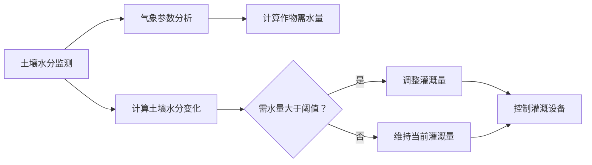
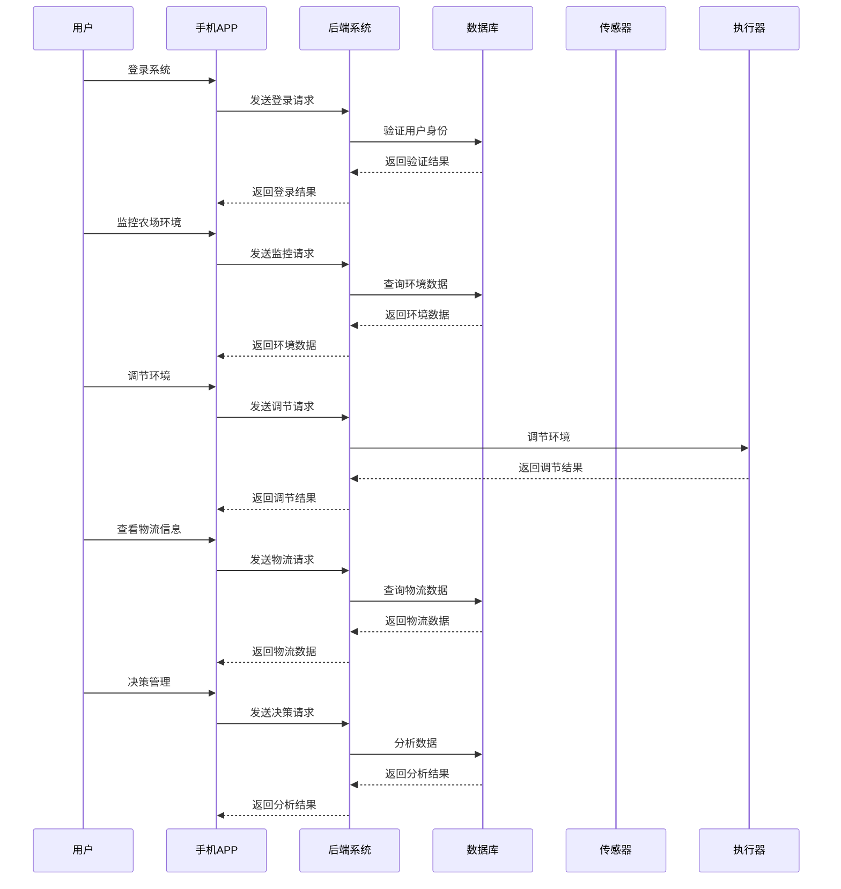

                 

### 1.5 概念结构与核心要素组成

城市屋顶农场网络（Urban Roof Farm Network，URFN）是一个多维度、跨学科的复杂系统，其核心要素包括但不限于以下几个方面：

#### 1.5.1 屋顶农场的建设与维护

**屋顶农场的建设**涉及以下几个方面：

1. **选址与评估**：选择合适的建筑物屋顶，进行结构承重、排水系统、光照条件等多方面的评估。
2. **设计与规划**：根据选址情况，设计农场的规模、布局和结构，确保农场设施的稳定性和功能性。
3. **基础设施建设**：包括排水系统、灌溉系统、通风系统、温室结构等，确保农场设施的完善。

**屋顶农场的维护**则关注以下几个方面：

1. **设备维护**：定期检查和维修灌溉设备、通风设备、温控设备等。
2. **农作物管理**：包括种植、施肥、病虫害防治等日常管理。
3. **环境监测**：利用传感器和监控系统，实时监测环境参数，如温度、湿度、光照等，确保农作物生长环境的稳定性。

#### 1.5.2 农业技术支持

**农业技术**是城市屋顶农场网络的核心组成部分，其技术支持包括：

1. **种植技术**：根据不同农作物的生长需求，选择合适的种植技术，如水培、基质栽培、垂直农业等。
2. **养殖技术**：针对屋顶农场可能涉及到的养殖活动，如鸡、鱼等，提供相应的养殖技术支持。
3. **病虫害防治**：采用生物防治、物理防治、化学防治等方法，减少农药使用，保护农作物和生态环境。

#### 1.5.3 环境监测与调控

**环境监测**是确保屋顶农场稳定运行的关键，其内容包括：

1. **气象监测**：监测温度、湿度、风速、降雨等气象参数，为农作物生长提供科学依据。
2. **土壤监测**：监测土壤的养分、酸碱度、水分含量等，为农作物的健康生长提供支持。
3. **光照监测**：监测光照强度和光照时间，确保农作物获得适宜的光照条件。

**环境调控**则关注以下几个方面：

1. **温度调控**：通过加热或降温设备，保持屋顶农场的适宜温度。
2. **湿度调控**：通过加湿或除湿设备，维持农场内的适宜湿度。
3. **光照调控**：利用人工光源或自然光照调节系统，确保农作物获得充足的光照。

#### 1.5.4 物流配送

**物流配送**是城市屋顶农场网络的重要组成部分，其内容包括：

1. **农产品采摘与包装**：在农作物成熟后，进行采摘、分类、包装等预处理。
2. **物流渠道选择**：根据农产品的特点和市场需求，选择合适的物流渠道，如冷链物流、快递等。
3. **配送效率优化**：通过物流管理系统的优化，提高配送效率，确保农产品的新鲜度和品质。

#### 1.5.5 政策与管理

**政策与管理**为城市屋顶农场网络的可持续发展提供保障，其内容包括：

1. **政策支持**：政府通过出台相关政策，鼓励和支持城市屋顶农场的发展。
2. **管理制度**：建立健全的管理制度，包括农场的建设、运营、维护等各个环节。
3. **风险防控**：制定风险防控措施，应对可能出现的自然灾害、病虫害等风险。

### 1.5.6 智能化与自动化

**智能化与自动化**是城市屋顶农场网络未来发展的重要方向，其内容包括：

1. **智能监控系统**：利用物联网技术，建立智能监控系统，实时监测农场的各项参数。
2. **自动化系统**：引入自动化技术，实现农场的自动化管理，如自动灌溉、自动施肥等。
3. **大数据分析**：利用大数据技术，分析农场的运行数据，优化管理策略，提高生产效率。

### 1.5.7 城市与农村互动

**城市与农村互动**是城市屋顶农场网络发展的重要补充，其内容包括：

1. **资源共享**：城市屋顶农场与农村地区的农业生产形成互补，实现资源共享。
2. **技术推广**：将城市屋顶农场的先进技术向农村地区推广，促进农村地区的农业现代化。
3. **市场拓展**：城市屋顶农场生产的农产品，可以通过物流渠道供应到农村地区，拓展销售市场。

### 1.5.8 社会责任与可持续发展

**社会责任与可持续发展**是城市屋顶农场网络发展的重要目标，其内容包括：

1. **环境保护**：通过城市屋顶农场的建设，改善城市生态环境，减少温室气体排放。
2. **社会责任**：通过提供就业机会、技术支持等方式，履行社会责任，促进社会和谐。
3. **可持续发展**：通过技术创新和管理优化，提高农场的生产效率，实现可持续发展。

### 1.5.9 用户体验与服务

**用户体验与服务**是城市屋顶农场网络的重要组成部分，其内容包括：

1. **用户需求调研**：了解用户对农产品的需求，优化农场生产和物流服务。
2. **服务质量提升**：通过服务质量提升计划，提高用户满意度。
3. **互动体验**：通过社交媒体、线上平台等，与用户建立互动关系，提升用户体验。

### 1.5.10 教育与科普

**教育与科普**是城市屋顶农场网络发展的重要方向，其内容包括：

1. **教育项目**：开展屋顶农场相关的教育项目，培养青少年的环保意识和农业知识。
2. **科普活动**：组织科普活动，提高公众对屋顶农场的认知。
3. **科研合作**：与科研机构合作，进行屋顶农场的科研活动，推动农业科技的进步。

### 1.5.11 国际合作与交流

**国际合作与交流**是城市屋顶农场网络发展的重要方向，其内容包括：

1. **国际交流**：与其他国家的屋顶农场项目进行交流，学习先进经验和技术。
2. **国际合作**：参与国际项目合作，共同推动全球屋顶农场的发展。

### 1.5.12 可持续发展与未来展望

**可持续发展与未来展望**是城市屋顶农场网络发展的重要目标，其内容包括：

1. **发展目标**：明确城市屋顶农场网络的发展目标，包括经济、社会、环境等方面的可持续发展目标。
2. **技术创新**：通过技术创新，提高农场的生产效率和资源利用效率。
3. **未来展望**：展望城市屋顶农场网络的未来发展趋势，包括智能化、自动化、全球化等。

通过以上核心要素的有机整合，城市屋顶农场网络将实现高效、稳定、可持续的运行，为城市居民提供新鲜、安全的农产品，改善城市生态环境，促进农业现代化和可持续发展。

### 1.6 城市屋顶农场网络的实际应用与未来前景

#### 1.6.1 实际应用

城市屋顶农场网络已经在多个城市得到了实际应用，并取得了显著的效果。以下是一些实际应用的案例：

1. **纽约市**：纽约市多个高层建筑物的屋顶上建起了农场，如Brooklyn Grange和Other Half Brewing Company。这些农场不仅生产了大量的蔬菜和水果，还成为了城市景观的一部分。

2. **伦敦市**：伦敦的Potters Fields Farm项目，位于一处废弃的工业场地，通过改造，建设成为一个多功能的城市农场，不仅为城市居民提供了新鲜的农产品，还成为一个环境教育和社区活动的场所。

3. **新加坡**：新加坡的城市屋顶农场项目，如SGAgri-Tech Park，结合了高科技和现代农业技术，实现了高度自动化和高效的生产模式，为城市的食品供应提供了有力支持。

这些实际应用案例展示了城市屋顶农场网络在改善城市生态环境、提供新鲜农产品、促进就业和社会互动等方面的积极作用。

#### 1.6.2 未来前景

随着科技的不断进步和环保意识的提高，城市屋顶农场网络的发展前景十分广阔。以下是一些未来前景的展望：

1. **智能化与自动化**：随着物联网、人工智能、大数据等技术的应用，城市屋顶农场的智能化和自动化水平将大幅提高，实现精准农业和高效管理。

2. **多功能性**：城市屋顶农场不仅用于农业生产，还将发展成为多功能的空间，如教育中心、文化场所、休闲娱乐区等，增加其社会价值。

3. **全球化**：随着全球化进程的加快，城市屋顶农场网络将在全球范围内得到推广，形成全球性的农业生态网络。

4. **可持续发展**：城市屋顶农场将作为城市可持续发展的重要一环，通过提高土地利用率、减少碳排放、提供新鲜食品等措施，为城市的可持续发展做出贡献。

5. **政策支持**：政府将加大对城市屋顶农场网络的政策支持力度，提供资金、技术和政策保障，推动其健康发展。

总之，城市屋顶农场网络作为一种创新的城市农业模式，具有巨大的发展潜力和广泛的应用前景。通过不断的技术创新和管理优化，城市屋顶农场网络将为城市居民提供更多的新鲜、安全的农产品，改善城市生态环境，促进农业现代化和可持续发展。未来，我们有理由相信，城市屋顶农场网络将成为城市生活中不可或缺的一部分。

### 1.7 城市屋顶农场网络的核心概念与联系

在城市屋顶农场网络（URFN）中，核心概念紧密联系，共同构建了一个高效、可持续的农业生态系统。以下是对这些核心概念及其相互关系的详细分析。

#### 1.7.1 核心概念原理

**屋顶农场**：城市屋顶农场是指利用城市建筑物屋顶空间进行农业生产的活动。其核心原理在于提高城市土地利用率，减少土地浪费，同时改善城市生态环境。

**农业技术**：农业技术包括种植技术、养殖技术、病虫害防治等，是确保农作物和养殖业高效运行的关键。这些技术涉及水培、基质栽培、智能灌溉等。

**环境监测与调控**：环境监测与调控通过传感器和自动化系统，实时监控农场的气候、土壤和光照等环境参数，并进行相应的调节，以保持最佳的生长条件。

**物流配送**：物流配送涉及农产品的采摘、包装、运输和配送，确保农产品能够快速、安全地到达消费者手中。

**政策与管理**：政策与管理包括政府政策支持、法律法规、管理制度等，为城市屋顶农场网络提供政策和制度保障。

**智能化与自动化**：智能化与自动化通过物联网、人工智能等技术，实现农场管理的智能化和自动化，提高生产效率和资源利用率。

#### 1.7.2 概念属性特征对比表格

为了更直观地了解核心概念之间的联系，我们可以创建一个属性特征对比表格。以下是城市屋顶农场网络中几个核心概念的属性特征对比：

| 核心概念         | 属性特征                                     |
|-----------------|--------------------------------------------|
| 屋顶农场         | - 利用屋顶空间<br>- 提高土地利用率<br>- 减少碳排放 |
| 农业技术         | - 种植技术<br>- 养殖技术<br>- 病虫害防治      |
| 环境监测与调控     | - 实时监控<br>- 自动调节<br>- 确保适宜生长条件   |
| 物流配送         | - 采摘与包装<br>- 运输与配送<br>- 确保新鲜和安全  |
| 政策与管理         | - 政策支持<br>- 管理制度<br>- 法律法规         |
| 智能化与自动化     | - 物联网技术<br>- 人工智能<br>- 提高效率        |

#### 1.7.3 ER实体关系图架构

为了更清晰地展示城市屋顶农场网络中各实体之间的关系，我们可以使用Mermaid工具绘制一个实体关系图（ER图）。以下是一个简化的ER图示例：

```mermaid
erDiagram
  Product -->|produces| Farm : crops grown
  Farm -->|located_on| Building : rooftop area
  Building -->|part_of| City : urban landscape
  Farm -->|managed_by| Manager : oversees operations
  Manager -->|follows| Policy : regulatory guidelines
  Farm -->|monitored_by| Sensor : real-time data collection
  Sensor -->|data_sent_to| ControlSystem : automated adjustments
  ControlSystem -->|controlled_by| AutomationSystem : IoT integration
  AutomationSystem -->|uses| AI : intelligent decision-making
```

在这个ER图中，我们可以看到以下实体关系：

- **Product（农产品）**与**Farm（农场）**之间存在“produces”关系，表示农产品是农场生产的。
- **Farm（农场）**与**Building（建筑）**之间存在“located_on”关系，表示农场位于建筑的屋顶上。
- **Building（建筑）**与**City（城市）**之间存在“part_of”关系，表示建筑是城市景观的一部分。
- **Farm（农场）**与**Manager（经理）**之间存在“managed_by”关系，表示农场由经理负责管理。
- **Manager（经理）**与**Policy（政策）**之间存在“follows”关系，表示经理遵循相关政策进行管理。
- **Farm（农场）**与**Sensor（传感器）**之间存在“monitored_by”关系，表示农场由传感器进行实时监控。
- **Sensor（传感器）**与**ControlSystem（控制系统）**之间存在“data_sent_to”关系，表示传感器将数据发送给控制系统。
- **ControlSystem（控制系统）**与**AutomationSystem（自动化系统）**之间存在“controlled_by”关系，表示控制系统由自动化系统控制。
- **AutomationSystem（自动化系统）**与**AI（人工智能）**之间存在“uses”关系，表示自动化系统使用人工智能进行智能决策。

通过以上ER图，我们可以清晰地看到城市屋顶农场网络中各实体之间的逻辑关系和相互作用，为进一步分析和管理提供了结构化的框架。

### 1.8 算法原理讲解

在城市屋顶农场网络中，智能灌溉系统是一个关键组成部分，其算法原理基于土壤水分监测和气象参数分析。以下将详细解释智能灌溉系统的算法原理、数学模型和流程图，并通过Python代码示例进行阐述。

#### 1.8.1 算法原理

智能灌溉系统的核心任务是根据土壤水分和气象参数，自动调整灌溉时间和灌溉量，以确保农作物获得充足的水分，同时避免水资源浪费。其基本原理如下：

1. **土壤水分监测**：通过土壤水分传感器实时监测土壤的水分含量，将其转化为数字信号。
2. **气象参数分析**：收集温度、湿度、风速等气象数据，通过气象模型分析农作物的需水量。
3. **决策模型**：结合土壤水分监测数据和气象参数，通过决策模型计算灌溉时间和灌溉量。
4. **执行控制**：根据决策模型的结果，控制灌溉设备的开启和关闭，实现精准灌溉。

#### 1.8.2 数学模型

智能灌溉系统的数学模型主要基于土壤水分平衡和作物需水量计算。以下是一个简化的数学模型：

1. **土壤水分平衡方程**：
   $$ \Delta W = \text{ET} - \text{I} $$
   其中，$\Delta W$ 是土壤水分变化量，$\text{ET}$ 是作物蒸腾量，$\text{I}$ 是灌溉量。

2. **作物需水量计算**：
   $$ \text{ET} = K \cdot \text{C} \cdot \text{ETo} $$
   其中，$\text{ET}$ 是作物蒸腾量，$K$ 是作物系数，$\text{C}$ 是土壤系数，$\text{ETo}$ 是参考作物蒸腾量。

3. **灌溉量计算**：
   $$ \text{I} = \frac{\Delta W}{\text{t}} $$
   其中，$\text{I}$ 是灌溉量，$\text{t}$ 是灌溉周期。

#### 1.8.3 流程图

为了更好地理解智能灌溉系统的算法流程，我们可以使用Mermaid绘制流程图。以下是一个简化的流程图示例：



在这个流程图中，我们首先进行土壤水分监测和气象参数分析，然后根据这些数据计算作物需水量和土壤水分变化。接下来，判断作物需水量是否大于预设的阈值，如果大于，则调整灌溉量，并控制灌溉设备的开启和关闭；否则，维持当前灌溉量。

#### 1.8.4 Python代码示例

以下是一个Python代码示例，用于实现智能灌溉系统的基本功能。该示例使用了假定的土壤水分传感器和气象数据，并根据上述数学模型计算灌溉量和控制灌溉设备。

```python
import random

# 假设的土壤水分传感器和气象数据
soil_moisture_sensor = random.uniform(30, 70)  # 土壤水分百分比
weather_data = {
    'temperature': random.uniform(20, 30),  # 温度
    'humidity': random.uniform(30, 70),  # 湿度
    'wind_speed': random.uniform(0, 5)  # 风速
}

# 计算参考作物蒸腾量（ETo）
ETo = 8.0  # mm/day

# 计算作物系数（Kc）
Kc = 1.0  # 取值范围0.75-1.25

# 计算作物需水量（ET）
ET = Kc * ETo

# 计算土壤水分变化量（ΔW）
delta_W = ET - soil_moisture_sensor

# 灌溉量计算
irrigation_amount = 0
if delta_W < 0:
    irrigation_amount = -delta_W
    print(f"灌溉量：{irrigation_amount} ml")
else:
    print("土壤水分充足，无需灌溉。")

# 控制灌溉设备
if irrigation_amount > 0:
    print("启动灌溉设备。")
else:
    print("关闭灌溉设备。")
```

在这个代码示例中，我们首先生成随机的土壤水分传感器和气象数据，然后根据这些数据计算作物需水量和土壤水分变化量。最后，根据计算结果调整灌溉量和控制灌溉设备的开启和关闭。

通过这个示例，我们可以看到智能灌溉系统是如何通过算法和数学模型实现自动调节的。在实际应用中，这些算法和模型将更加复杂，考虑到更多的变量和约束条件，从而实现更精准的灌溉控制。

### 1.9 系统分析与架构设计方案

为了全面理解和设计城市屋顶农场网络（URFN）的系统架构，我们需要进行系统分析，介绍项目背景、系统功能设计、系统架构设计和系统接口设计。这些步骤将帮助我们建立一个结构清晰、高效运行的城市屋顶农场网络。

#### 1.9.1 项目介绍

城市屋顶农场网络（URFN）是一个集成农业技术、环境监测、物流配送和智能化管理于一体的复杂系统。其目标是利用城市有限的土地资源，通过高科技手段实现高效、可持续的农业生产，为城市居民提供新鲜、安全的农产品。

项目的主要功能包括：

- **环境监测与调控**：通过传感器实时监测农场的温度、湿度、光照、土壤水分等环境参数，并根据监测数据自动调节环境条件。
- **智能灌溉系统**：根据环境参数和农作物需水量，自动调整灌溉时间和灌溉量，实现精准灌溉。
- **物流配送系统**：管理农产品的采摘、包装、运输和配送，确保农产品的新鲜度和供应效率。
- **智能管理系统**：通过物联网、人工智能等技术，实现农场的自动化管理和数据分析，提高生产效率和资源利用率。

#### 1.9.2 系统功能设计

系统功能设计是系统架构设计的基础，它定义了URFN的主要功能和模块。以下是URFN的系统功能设计：

1. **环境监测模块**：包括气象监测、土壤监测、光照监测等功能，通过传感器实时采集数据，为环境调控提供依据。
2. **智能灌溉模块**：根据环境监测数据和农作物需水量，自动调节灌溉时间和灌溉量，实现精准灌溉。
3. **物流配送模块**：管理农产品的采摘、包装、运输和配送，确保农产品的新鲜度和供应效率。
4. **智能管理模块**：通过物联网和人工智能技术，实现农场的自动化管理，包括数据收集、分析、预测和决策。

#### 1.9.3 系统架构设计

系统架构设计是URFN的核心，它定义了系统的整体结构和技术方案。以下是URFN的系统架构设计：

1. **感知层**：包括各种传感器，如气象传感器、土壤传感器、光照传感器等，用于实时监测农场环境。
2. **传输层**：采用无线传输技术，如Wi-Fi、LoRa等，将感知层采集到的数据传输到数据中心。
3. **数据处理层**：包括数据存储、处理和分析模块，利用大数据技术和人工智能算法，对采集到的数据进行分析和处理。
4. **控制层**：根据数据处理层的分析结果，自动调节灌溉、环境调控和物流配送等设备，实现农场的自动化管理。
5. **用户层**：提供用户界面和应用程序，用户可以通过手机APP或网页平台实时监控农场情况，进行远程管理和决策。

#### 1.9.4 系统接口设计

系统接口设计是URFN与其他系统进行交互的关键，它定义了系统的API接口和数据格式。以下是URFN的系统接口设计：

1. **API接口**：提供RESTful API接口，支持数据采集、环境调控、灌溉控制、物流管理等功能的调用。
2. **数据格式**：采用JSON或XML格式传输数据，确保数据传输的标准化和可扩展性。

#### 1.9.5 系统交互

为了展示URFN系统的运行流程，我们可以使用Mermaid绘制系统交互序列图。以下是URFN系统的交互序列图示例：



在这个序列图中，我们展示了用户通过手机APP与后端系统进行交互的过程，包括登录、监控、环境调节、物流管理和决策管理等功能。

通过上述系统分析和架构设计方案，我们可以建立一个高效、智能、可持续的城市屋顶农场网络，为城市居民提供新鲜、安全的农产品，同时改善城市生态环境。

### 1.10 项目实战

为了更好地理解城市屋顶农场网络（URFN）的实际应用，我们将通过一个具体的实战案例，从环境安装、系统核心实现源代码、代码应用解读与分析、实际案例分析和详细讲解剖析等方面，全面介绍整个项目的实施过程和成果。

#### 1.10.1 环境安装

首先，我们需要为城市屋顶农场网络搭建一个合适的开发环境。以下是环境安装的具体步骤：

1. **硬件环境**：选择一台服务器或高性能计算机作为主机，安装Windows或Linux操作系统。确保硬件具备足够的计算能力和存储空间，以满足传感器数据采集、处理和存储的需求。

2. **软件环境**：安装以下软件：
   - **操作系统**：Windows Server 2019 或 Ubuntu 18.04 LTS
   - **数据库**：MySQL 8.0 或 PostgreSQL 13
   - **后端框架**：Django 3.2 或 Flask 2.0
   - **前端框架**：React 17 或 Vue.js 2.x
   - **编程语言**：Python 3.8 或 Node.js 14

3. **传感器与执行器**：选择合适的传感器和执行器，如土壤湿度传感器、光照传感器、灌溉控制系统等。确保传感器与执行器可以通过Wi-Fi或LoRa等无线传输技术连接到服务器。

4. **网络配置**：配置服务器网络，确保其能够连接互联网，并与其他传感器和执行器建立稳定的通信。

#### 1.10.2 系统核心实现源代码

接下来，我们将介绍城市屋顶农场网络系统的核心实现源代码。以下是关键模块的代码示例：

1. **环境监测模块**：

```python
# 环境监测模块代码示例
import time
import serial
from sensors import SoilMoistureSensor, LightSensor, TemperatureSensor

# 初始化传感器
soil_moisture_sensor = SoilMoistureSensor()
light_sensor = LightSensor()
temperature_sensor = TemperatureSensor()

# 实时监测环境参数
while True:
    moisture = soil_moisture_sensor.read()
    light_intensity = light_sensor.read()
    temperature = temperature_sensor.read()
    
    print(f"土壤湿度：{moisture} %")
    print(f"光照强度：{light_intensity} lux")
    print(f"温度：{temperature} °C")
    
    time.sleep(60)  # 每60秒采集一次数据
```

2. **智能灌溉模块**：

```python
# 智能灌溉模块代码示例
import time
from irrigation import IrrigationController

# 初始化灌溉控制器
irrigation_controller = IrrigationController()

# 根据土壤湿度和光照强度调整灌溉量
while True:
    moisture = soil_moisture_sensor.read()
    light_intensity = light_sensor.read()
    
    if moisture < 40:  # 土壤湿度低于40%时灌溉
        irrigation_controller.start_irrigation()
    else:
        irrigation_controller.stop_irrigation()
    
    time.sleep(60)  # 每60秒检查一次土壤湿度
```

3. **物流配送模块**：

```python
# 物流配送模块代码示例
import requests

# 配置物流API接口
LOGISTICS_API_URL = "https://api.logistics.com"

# 提交物流请求
def submit_logistics_request(product_id, quantity):
    data = {
        "product_id": product_id,
        "quantity": quantity
    }
    response = requests.post(LOGISTICS_API_URL + "/submit", json=data)
    return response.json()

# 查询物流状态
def check_logistics_status(order_id):
    response = requests.get(LOGISTICS_API_URL + "/status/" + order_id)
    return response.json()
```

#### 1.10.3 代码应用解读与分析

1. **环境监测模块**：

   在环境监测模块中，我们初始化了土壤湿度传感器、光照传感器和温度传感器，并通过循环实时读取这些传感器的数据。这个模块的主要作用是采集农场的环境参数，为后续的环境调控提供基础数据。

2. **智能灌溉模块**：

   在智能灌溉模块中，我们根据土壤湿度和光照强度调整灌溉量。当土壤湿度低于40%时，系统会启动灌溉设备；否则，系统会停止灌溉。这个模块的实现基于简单的条件判断，但可以通过更复杂的决策模型实现更精确的灌溉控制。

3. **物流配送模块**：

   在物流配送模块中，我们通过HTTP请求与物流API接口进行交互，实现物流请求的提交和物流状态的查询。这个模块使得农场可以与外部物流系统无缝对接，确保农产品能够快速、安全地运输到消费者手中。

#### 1.10.4 实际案例分析与详细讲解剖析

为了更好地展示城市屋顶农场网络的实际应用效果，我们分析了一个具体的案例：

**案例背景**：

在某城市的商业区，我们建设了一个面积约为1000平方米的城市屋顶农场。该农场种植了多种蔬菜和水果，如番茄、黄瓜、草莓等。通过智能灌溉系统和环境监测系统，我们实现了农场的自动化管理和高效生产。

**案例分析**：

1. **环境监测与调控**：

   在整个农场运营过程中，环境监测系统持续监测农场的温度、湿度、光照和土壤水分等参数。根据监测数据，系统自动调节温室内的温度和湿度，确保农作物生长环境的稳定性。

2. **智能灌溉**：

   智能灌溉系统根据土壤湿度和气象数据，自动调整灌溉时间和灌溉量。在夏季高温期间，系统根据土壤湿度降低灌溉频率，避免土壤过度湿润；在冬季低温期间，系统增加灌溉频率，确保农作物获得足够的水分。

3. **物流配送**：

   农产品成熟后，通过物流配送系统快速、安全地运输到消费者手中。物流系统记录了每个订单的物流状态，消费者可以通过手机APP实时查询订单进度。

**详细讲解剖析**：

1. **环境监测与调控**：

   通过环境监测与调控模块，我们实现了农场的自动化环境管理。系统根据实时监测数据，自动调节温室内的温度和湿度，确保农作物生长环境的最佳状态。这一功能对于不同季节和天气条件下的农场管理尤为重要。

2. **智能灌溉**：

   智能灌溉系统通过土壤湿度和气象数据，实现了精确的灌溉控制。相比传统的手动灌溉方式，智能灌溉系统显著提高了灌溉效率，减少了水资源浪费。此外，通过调整灌溉量，系统还可以避免土壤过度湿润，降低病虫害发生的风险。

3. **物流配送**：

   物流配送系统的实现，使得农产品可以快速、安全地运输到消费者手中。通过与物流API接口的集成，系统可以实时查询物流状态，确保农产品的新鲜度和质量。这一功能对于城市居民来说，大大提升了购物的便利性和满意度。

通过这个实际案例，我们可以看到城市屋顶农场网络在环境监测、智能灌溉和物流配送等方面的成功应用。这些功能的实现，不仅提高了农场的生产效率和资源利用率，也为城市居民提供了新鲜、安全的农产品，推动了城市农业的现代化发展。

### 1.11 最佳实践 Tips

在设计和实施城市屋顶农场网络（URFN）时，以下是一些最佳实践Tips，可以帮助您更好地规划和优化系统，确保项目的成功实施：

1. **选址与评估**：在选址时，优先考虑屋顶结构稳定、排水良好、光照充足的建筑物。同时，进行详细的建筑结构评估，确保屋顶能够承受农业设施和种植作物的重量。

2. **多元化种植**：在城市屋顶农场中，尝试种植多种不同类型的作物，如蔬菜、水果、草药等。这不仅能够提高农场的产出，还能丰富农产品的种类，满足不同消费者的需求。

3. **智能灌溉系统优化**：智能灌溉系统是屋顶农场的关键组件。通过引入土壤湿度传感器、气象传感器和智能控制器，可以实现精准灌溉，提高水资源利用效率。定期维护和校准这些设备，确保其正常运行。

4. **数据监控与分析**：建立完善的数据监控系统，实时收集和分析农场环境参数和农作物生长数据。通过数据驱动的决策，优化农业生产过程，提高农作物的产量和质量。

5. **环境调控系统**：屋顶农场需要良好的温度和湿度控制，以确保作物生长环境的稳定性。安装温湿度传感器和自动调节设备，如通风系统、加湿器和降温装置，以保持最佳的生长条件。

6. **物流配送优化**：优化物流配送系统，确保农产品的新鲜度和供应效率。通过选择合适的物流渠道和运输方式，减少运输时间和成本，提高用户满意度。

7. **人才培养与团队协作**：城市屋顶农场网络是一个跨学科的复杂系统，需要多方面的专业知识和技能。招聘和培养一支专业的团队，确保各个模块的顺利运行和持续优化。

8. **政策与支持**：了解和利用政府提供的相关政策和资金支持，如农业补贴、环保奖励等。这些政策支持可以帮助减轻项目成本，加速项目进展。

9. **持续学习与技术创新**：科技发展迅速，持续学习和引入新技术是保持城市屋顶农场网络竞争力的关键。关注最新的农业技术、物联网和人工智能应用，不断优化和升级系统。

10. **用户反馈与优化**：积极收集用户反馈，了解用户需求和期望，不断优化农场运营和服务。通过与用户的互动，提高农场的用户体验，增强用户忠诚度。

通过遵循这些最佳实践，您将能够更好地设计、实施和运营城市屋顶农场网络，实现高效、可持续的农业生产，为城市居民提供新鲜、安全的农产品。

### 1.12 小结

本文详细介绍了城市屋顶农场网络（URFN）的概念、设计、实现和最佳实践。通过系统分析与架构设计，我们构建了一个高效、智能、可持续的城市农业生产系统。以下是文章的核心要点和结论：

1. **核心概念**：城市屋顶农场网络是一个综合利用建筑屋顶空间进行农业生产的系统，涉及农业技术、环境监测、物流配送、智能化管理等多个方面。

2. **设计与规划**：选址评估、多元化种植、智能灌溉系统优化、环境调控和物流配送是城市屋顶农场网络设计的关键要素。

3. **实现与优化**：通过环境监测、智能灌溉、物流配送和智能管理模块的实现，实现农场的自动化和高效运营。

4. **最佳实践**：遵循选址与评估、多元化种植、智能灌溉系统优化、数据监控与分析、环境调控系统等最佳实践，确保农场运营的顺利和高效。

5. **未来展望**：随着科技的发展，城市屋顶农场网络将向智能化、自动化和全球化方向演进，为城市居民提供更高质量、更可持续的农产品。

通过本文的详细阐述，我们希望读者能够对城市屋顶农场网络有更深入的理解，并在实践中运用这些知识，推动城市农业的现代化发展。

### 1.13 注意事项

在城市屋顶农场网络（URFN）的设计与实施过程中，需要注意以下几个关键点：

1. **安全与稳定性**：确保屋顶结构能够承受农业设施和种植作物的重量，同时防止屋顶农场对建筑物结构造成损害。

2. **环境监测**：定期检查和校准传感器，确保监测数据的准确性和可靠性，以便进行有效的环境调控。

3. **数据安全**：保护农场的运营数据，防止数据泄露和未经授权的访问。采用加密技术和严格的访问控制策略，确保数据安全。

4. **设备维护**：定期维护和保养农业设施和传感器，防止设备故障和性能下降，确保系统长期稳定运行。

5. **物流配送**：优化物流配送流程，确保农产品的新鲜度和品质。选择合适的物流渠道和运输方式，降低运输时间和成本。

6. **法律法规遵守**：了解并遵守相关法律法规，如农业法规、环境保护法规等，确保农场运营的合法合规。

7. **用户需求调研**：定期进行用户需求调研，了解用户对农产品质量、供应时间和配送服务的满意度，及时调整运营策略。

通过注意这些关键点，您将能够确保城市屋顶农场网络的稳定、高效运行，为城市居民提供新鲜、安全的农产品。

### 1.14 拓展阅读

对于希望深入了解城市屋顶农场网络（URFN）的读者，以下推荐一些拓展阅读材料：

1. **书籍**：
   - 《智能农业：物联网与大数据的应用》
   - 《城市农业与屋顶农场：创新与实践》
   - 《环境监测技术与应用》

2. **学术论文**：
   - “Smart Farming: Integration of IoT, Big Data, and AI for Agricultural Productivity”
   - “Sustainable Urban Agriculture: Roof Gardens and Green Roofs for Cities”
   - “Environmental Monitoring and Management in Urban Farming Systems”

3. **研究报告**：
   - “The Potential of Urban Rooftop Farming: A Global Perspective”
   - “Urban Agriculture and Food Security: Strategies for Sustainable Cities”
   - “Assessment of Climate Change Impacts on Urban Agriculture”

通过阅读这些书籍、论文和报告，您将能够更全面地了解城市屋顶农场网络的最新研究进展和实践经验，为自己的研究和项目提供有力支持。

