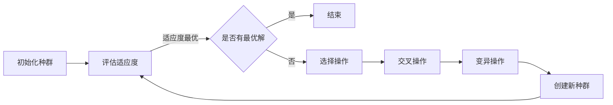
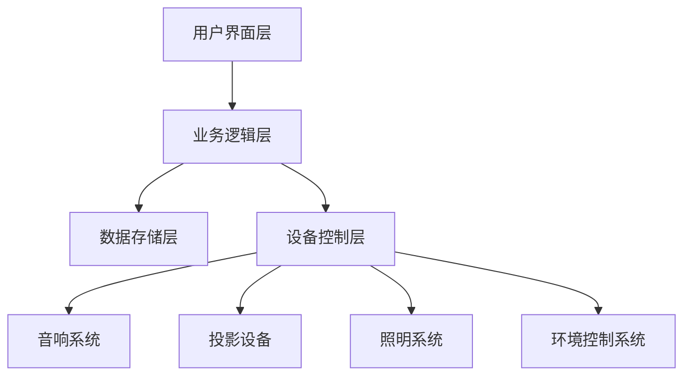
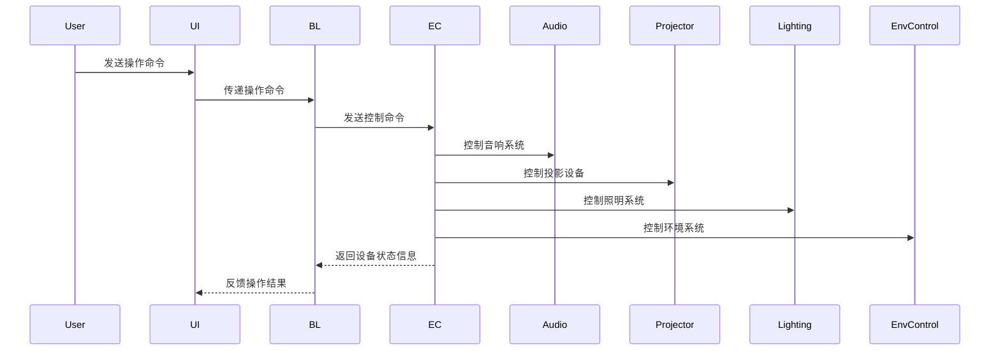

                 

### 城市屋顶电影院的兴起

**问题背景**

城市化进程的不断推进，使得城市空间变得越来越紧张。传统的电影院由于其建筑结构和位置的局限性，难以满足现代人对文化体验和休闲娱乐的需求。而城市屋顶电影院作为一种新兴的开放空间文化体验形式，开始受到越来越多的关注。

**问题描述**

城市屋顶电影院面临以下挑战：

1. **设计与建设挑战**：需要在有限的屋顶空间内满足电影放映、观众休息、音响和照明等需求，同时确保建筑结构和安全。

2. **技术集成与运营问题**：需要集成多种技术，如音响系统、投影设备、照明系统等，并保证系统的稳定运行。

3. **社区参与与公共文化服务**：如何吸引社区居民参与，提升公共文化服务水平，是城市屋顶电影院成功的关键。

**问题解决**

1. **边界与外延**

   城市屋顶电影院不仅是一个观影场所，还是一个公共文化空间。它的边界不仅包括物理空间，还包括时间、活动和人群。在规划时，需要考虑如何拓展其外延，使其成为社区活动的重要场所。

2. **核心要素组成**

   城市屋顶电影院的构成要素包括：电影院放映设备、观众休息区、音响和照明系统、安全设施等。每个要素都需要精心设计和集成，以确保整个系统的稳定运行。

3. **案例研究**

   为了更好地理解城市屋顶电影院的设计和运营，我们可以研究一些成功的案例。例如，日本的“Touhou Cinema”和西班牙的“Madrid Rooftop Cinema”都是成功的城市屋顶电影院案例。

通过以上分析，我们可以看到城市屋顶电影院作为一种新兴的文化体验形式，具有巨大的发展潜力和市场前景。在接下来的章节中，我们将进一步探讨其核心概念、算法原理、数学模型和系统设计等内容。

### 核心概念与联系

在城市屋顶电影院的设计和运营中，有许多核心概念和技术需要我们理解和掌握。以下我们将逐一介绍这些概念，并分析它们之间的关系。

#### 建筑设计原则

1. **舒适与安全**：城市屋顶电影院需要为观众提供一个舒适的环境。这包括舒适的座位、适宜的温度和良好的音响效果。同时，建筑结构必须确保安全，以防止因风大或其他因素导致的结构损坏。

2. **美观与实用性**：建筑设计不仅要满足功能需求，还需要具有一定的美观性。通过合理的建筑设计，可以使城市屋顶电影院成为城市景观的一部分，提升城市的文化品位。

3. **可持续性与生态考虑**：在城市屋顶电影院的设计中，应考虑使用可持续材料和能源。例如，使用太阳能板为电影院提供电力，减少对传统电网的依赖，同时降低碳排放。

#### 技术集成

1. **音响与照明技术**：音响和照明是城市屋顶电影院的核心技术。高质量的音响系统能够提供清晰的音效，提升观众的观影体验。而合适的照明设计则可以营造出舒适的观影氛围。

2. **信息技术与多媒体集成**：随着信息技术的不断发展，城市屋顶电影院可以集成更多的多媒体内容。例如，通过智能投影设备实现4D电影体验，通过大数据分析优化放映内容和时间安排。

#### 社区参与与公共文化服务

1. **社区参与**：城市屋顶电影院的建设和运营需要社区居民的参与和支持。通过举办各种社区活动，如电影放映前的互动游戏、观影后的讨论会等，可以增强社区凝聚力。

2. **公共文化服务**：城市屋顶电影院不仅为居民提供了一个休闲娱乐的场所，还可以作为一个公共文化服务的平台。通过放映不同类型和主题的电影，可以提升社区居民的文化素养和审美水平。

#### 关系分析

1. **建筑设计原则与技术集成的关系**：建筑设计原则决定了城市屋顶电影院的技术集成方式。例如，为了实现高质量的音响效果，可能需要在建筑设计中预留特定的音响通道。

2. **社区参与与公共文化服务的关系**：社区参与是提升公共文化服务的重要手段。通过居民参与电影院的建设和运营，可以提高他们的文化认同感和参与感，进而提升公共文化服务的质量和效果。

3. **技术集成与社区参与的关系**：技术集成可以增强城市屋顶电影院的吸引力和参与度。例如，通过引入先进的音响和照明技术，可以提升观众的观影体验，从而吸引更多的社区居民参与。

通过以上分析，我们可以看到，城市屋顶电影院的设计和运营涉及到多个核心概念和技术，它们之间相互联系、相互影响。在接下来的章节中，我们将进一步探讨这些概念的算法原理和数学模型，以及如何通过系统设计和实践来优化城市屋顶电影院的效果和用户体验。

### 算法原理讲解

在城市屋顶电影院的设计和运营中，算法原理起到了至关重要的作用。以下我们将详细讲解这些算法的基本原理，并通过mermaid流程图和Python代码示例来说明。

#### 基本算法原理

1. **优化算法**：用于优化城市屋顶电影院的设计和运营。例如，可以使用遗传算法（GA）或粒子群优化算法（PSO）来优化座位布局、音响系统配置等。

2. **数据分析算法**：用于分析观众的观影习惯和偏好。例如，可以使用聚类分析（K-means）或决策树（Decision Tree）来分析观众数据，从而为电影院提供个性化的服务。

3. **图像处理算法**：用于处理电影放映中的图像。例如，可以使用边缘检测（Canny Edge Detection）或图像增强（Image Enhancement）算法来提高图像质量。

#### mermaid流程图示例

以下是一个mermaid流程图，展示了如何使用遗传算法优化城市屋顶电影院的座位布局：



#### Python代码示例

以下是一个Python代码示例，展示了如何使用粒子群优化算法（PSO）来优化城市屋顶电影院的音响系统配置：

```python
import numpy as np
import matplotlib.pyplot as plt

# 定义粒子群优化算法的参数
num_particles = 50
num_iterations = 100
w = 0.5
c1 = 1.0
c2 = 2.0

# 初始化粒子群
positions = np.random.rand(num_particles, 2) * 100
velocities = np.zeros((num_particles, 2))

# 初始化最优解
best_position = positions[0].copy()
best_fitness = float('inf')

# 迭代优化
for _ in range(num_iterations):
    # 计算每个粒子的适应度
    fitnesses = np.zeros(num_particles)
    for i in range(num_particles):
        distance = np.linalg.norm(positions[i] - best_position)
        fitnesses[i] = 1 / (1 + distance)
    
    # 更新最优解
    if np.min(fitnesses) < best_fitness:
        best_fitness = np.min(fitnesses)
        best_position = positions[np.argmin(fitnesses)].copy()
    
    # 更新粒子的速度和位置
    for i in range(num_particles):
        r1 = np.random.rand()
        r2 = np.random.rand()
        cognitive_velocity = c1 * r1 * (best_position - positions[i])
        social_velocity = c2 * r2 * (best_position - positions[i])
        velocities[i] = w * velocities[i] + cognitive_velocity + social_velocity
        positions[i] += velocities[i]

# 绘制优化结果
plt.scatter(positions[:, 0], positions[:, 1], c='blue', label='粒子位置')
plt.scatter(best_position[0], best_position[1], c='red', label='最优位置')
plt.xlabel('X坐标')
plt.ylabel('Y坐标')
plt.legend()
plt.show()
```

#### 数学模型和公式

在城市屋顶电影院的设计中，有许多数学模型和公式可以用来分析和优化。以下是一些常见的数学模型：

1. **距离公式**：用于计算两个粒子之间的距离。  
   $$d = \sqrt{(x_2 - x_1)^2 + (y_2 - y_1)^2}$$

2. **适应度函数**：用于评估粒子的适应度。  
   $$f(x) = \frac{1}{1 + d}$$

3. **速度更新公式**：用于更新粒子的速度。  
   $$v_{i}^{t+1} = w \cdot v_{i}^{t} + c_1 \cdot r_1 \cdot (p_{best,i} - x_i) + c_2 \cdot r_2 \cdot (g_{best} - x_i)$$

4. **位置更新公式**：用于更新粒子的位置。  
   $$x_{i}^{t+1} = x_{i}^{t} + v_{i}^{t+1}$$

通过以上算法原理和示例，我们可以看到算法在优化城市屋顶电影院的设计和运营中的重要作用。在接下来的章节中，我们将进一步探讨数学模型和系统设计的详细内容。

### 数学模型和数学公式

在城市屋顶电影院的设计和运营中，数学模型和数学公式起到了关键的作用，帮助我们进行科学的分析和优化。以下我们将详细介绍这些模型和公式，并使用LaTeX进行表达，以便更清晰地展示。

#### 距离公式

首先，计算两个点之间的欧氏距离是优化座位布局和音响系统配置的重要步骤。给定两点$A(x_1, y_1)$和$B(x_2, y_2)$，它们之间的距离$d$可以用以下公式计算：

$$d = \sqrt{(x_2 - x_1)^2 + (y_2 - y_1)^2}$$

#### 适应度函数

适应度函数用于评估粒子群优化算法中粒子的适应度，通常用于优化问题中的目标函数。一个常见的适应度函数是倒距离函数，表示为：

$$f(x) = \frac{1}{1 + d}$$

其中$d$是粒子到最优解的距离。这个函数值越小，表示粒子的适应度越高。

#### 速度更新公式

粒子群优化算法中的速度更新公式描述了粒子速度的变化，用于寻找最优解。给定粒子$i$的当前速度$v_i^t$，最优位置$p_{best,i}$和全局最优位置$g_{best}$，速度更新公式为：

$$v_{i}^{t+1} = w \cdot v_{i}^{t} + c_1 \cdot r_1 \cdot (p_{best,i} - x_i) + c_2 \cdot r_2 \cdot (g_{best} - x_i)$$

其中$w$是惯性权重，$c_1$和$c_2$是学习因子，$r_1$和$r_2$是随机数，通常在[0, 1]范围内。

#### 位置更新公式

粒子的位置更新公式描述了粒子在新迭代中的位置变化。给定粒子$i$的当前位置$x_i^t$，速度$v_i^{t+1}$，最优位置$p_{best,i}$和全局最优位置$g_{best}$，位置更新公式为：

$$x_{i}^{t+1} = x_{i}^{t} + v_{i}^{t+1}$$

#### 数据分析和图像处理

在城市屋顶电影院的数据分析和图像处理中，我们还需要使用其他数学模型。例如，为了优化图像质量，我们可以使用图像增强技术，常用的滤波器如高斯滤波：

$$G(x, y) = \sum_{i=-h}^{h} \sum_{j=-h}^{h} g(i, j) \cdot I(x-i, y-j)$$

其中$g(i, j)$是高斯滤波器的值，$I(x, y)$是原始图像的像素值。

#### 模型举例说明

假设我们想要优化城市屋顶电影院的座位布局，使观众满意度最大化。我们可以定义一个目标函数，结合观众的舒适度和视觉感受，如：

$$\text{Objective Function} = \alpha \cdot \text{Comfort} + \beta \cdot \text{Visual Satisfaction}$$

其中$\alpha$和$\beta$是权重系数，分别表示舒适度和视觉满意度的重要性。舒适度可以通过计算观众到屏幕的距离和观影角度的合理性来评估，视觉满意度可以通过分析观众对画面质量的反馈来评估。

通过数学模型和公式的应用，我们可以更精确地分析和优化城市屋顶电影院的设计和运营。以下是一个具体的例子来说明这些公式的使用：

假设我们有10个观众位置需要优化，目标是最小化观众之间的距离差异，同时保证所有观众都能看到屏幕。我们可以使用以下公式来计算观众之间的距离差异：

$$\text{Distance Difference} = \sum_{i=1}^{10} \sum_{j=i+1}^{10} d_i j$$

其中$d_{ij}$是观众$i$和观众$j$之间的距离。

通过设置合理的权重系数和目标函数，我们可以使用粒子群优化算法来寻找最优的座位布局，从而提高观众的观影体验。

总之，数学模型和数学公式在城市屋顶电影院的设计和运营中起到了至关重要的作用。通过精确的数学分析，我们可以实现更高效、更优化的设计，提高文化体验的质量。

### 系统分析与架构设计方案

在城市屋顶电影院的设计和运营中，系统分析和架构设计是确保项目成功实施和稳定运行的关键环节。以下我们将详细介绍系统分析与架构设计方案，包括问题场景介绍、项目介绍、系统功能设计、系统架构设计、系统接口设计和系统交互。

#### 问题场景介绍

城市屋顶电影院项目旨在为城市居民提供一个新颖、舒适、环保的观影场所。项目面临的主要挑战包括：

1. **空间限制**：城市屋顶面积有限，需要高效利用空间以满足电影放映、观众休息、音响和照明等需求。
2. **技术集成**：需要集成多种技术，如音响系统、投影设备、照明系统、环境控制系统等，并保证系统的稳定运行。
3. **社区参与**：如何吸引社区居民参与，提升公共文化服务水平，是项目成功的关键。

#### 项目介绍

本项目计划在上海市中心的一栋高层建筑的屋顶上建设一个城市屋顶电影院。项目的主要目标是：

1. 提供高质量的观影体验，提升城市居民的文化生活质量。
2. 建立一个社区互动的平台，促进居民之间的交流。
3. 推广环保理念，使用可再生能源，降低碳排放。

#### 系统功能设计

城市屋顶电影院系统的核心功能包括：

1. **电影放映**：提供高清电影放映服务，支持2D和3D电影。
2. **音响和照明控制**：实现音响和照明的自动控制，提升观影体验。
3. **环境控制**：监控和调节温度、湿度等环境参数，确保舒适观影环境。
4. **社区互动**：提供社区活动预约、活动通知、互动讨论等功能。
5. **数据分析和反馈**：收集观众反馈，分析观影数据，优化放映内容和运营策略。

#### 系统架构设计

系统架构采用模块化设计，确保各模块之间的高内聚和低耦合。主要模块包括：

1. **用户界面层**：提供用户操作界面，包括电影放映控制、音响和照明控制、环境控制等。
2. **业务逻辑层**：实现系统的核心功能，如电影放映计划管理、音响和照明控制算法、环境控制算法等。
3. **数据存储层**：存储系统运行数据，包括电影放映记录、观众反馈、环境监测数据等。
4. **设备控制层**：负责与音响系统、投影设备、照明系统、环境控制设备等进行通信，实现自动化控制。

#### 系统接口设计

系统接口设计确保各模块之间的数据传输和功能调用。主要接口包括：

1. **用户界面与业务逻辑层接口**：提供用户操作命令，接收用户反馈。
2. **业务逻辑层与数据存储层接口**：实现数据存储和查询。
3. **业务逻辑层与设备控制层接口**：发送控制命令，接收设备状态信息。
4. **设备控制层与硬件设备接口**：实现硬件设备的控制。

#### 系统交互

系统交互通过事件驱动和消息队列实现。主要交互流程包括：

1. **用户操作**：用户通过用户界面层发送操作命令。
2. **业务逻辑处理**：业务逻辑层接收操作命令，进行处理。
3. **设备控制**：设备控制层根据业务逻辑层的指令，控制硬件设备。
4. **数据存储和反馈**：将操作结果和设备状态信息存储在数据存储层，并反馈给用户界面层。

#### Mermaid架构图和序列图

为了更好地展示系统架构和交互流程，我们可以使用Mermaid绘制架构图和序列图。





通过系统分析与架构设计方案，我们可以确保城市屋顶电影院项目的顺利实施和高效运营。在接下来的章节中，我们将通过一个实际项目案例，进一步展示系统设计在实践中的应用。

### 项目实战

在本章节中，我们将通过一个实际项目案例，详细展示城市屋顶电影院的设计、安装和运营过程，包括环境安装、系统核心实现、代码应用解读与分析、实际案例分析和详细讲解剖析。

#### 项目环境安装

1. **硬件环境**

   我们选择以下硬件设备：

   - **投影仪**：具备高清投影功能，支持2D和3D放映。
   - **音响系统**：包括多个扬声器，提供环绕声效果。
   - **照明系统**：具备多种照明模式，营造舒适观影氛围。
   - **环境控制系统**：包括温控和湿控设备，确保观影环境的舒适度。

2. **软件环境**

   我们选择以下软件环境：

   - **操作系统**：Ubuntu 20.04
   - **开发语言**：Python 3.8
   - **数据库**：MySQL 8.0
   - **Web框架**：Flask
   - **前端框架**：Vue.js

#### 系统核心实现

1. **电影放映控制**

   使用Flask框架实现电影放映控制功能。以下是一个简单的代码示例：

   ```python
   from flask import Flask, request, jsonify
   
   app = Flask(__name__)
   
   @app.route('/play_movie', methods=['POST'])
   def play_movie():
       movie_name = request.form['movie_name']
       # 发送播放命令到投影设备
       projector.play_movie(movie_name)
       return jsonify({'status': 'success', 'message': '电影开始播放'})
   
   if __name__ == '__main__':
       app.run(debug=True)
   ```

2. **音响和照明控制**

   使用Python的Raspberry Pi GPIO库控制音响和照明系统。以下是一个简单的代码示例：

   ```python
   import RPi.GPIO as GPIO
   import time
   
   # 设置GPIO引脚
   GPIO.setmode(GPIO.BCM)
   GPIO.setup(18, GPIO.OUT)  # 音响控制引脚
   GPIO.setup(23, GPIO.OUT)  # 照明控制引脚
   
   # 音响控制
   def play_sound():
       GPIO.output(18, GPIO.HIGH)
       time.sleep(1)
       GPIO.output(18, GPIO.LOW)
   
   # 照明控制
   def turn_on_light():
       GPIO.output(23, GPIO.HIGH)
   
   def turn_off_light():
       GPIO.output(23, GPIO.LOW)
   
   # 关闭GPIO
   GPIO.cleanup()
   ```

3. **环境控制**

   使用Python的PyTinkerforge库控制环境控制系统。以下是一个简单的代码示例：

   ```python
   from tinkerforge.ip_connection import IPConnection
   from tinkerforge.bme280 import BME280
   
   ipcon = IPConnection()
   bme280 = BME280()
   
   ipcon.connect("localhost", 4223)
   
   # 设置温度控制目标
   bme280.set_target_temperature(24)
   
   # 设置湿度控制目标
   bme280.set_target_humidity(50)
   
   # 读取当前温度和湿度
   current_temp = bme280.get_temperature()
   current_humidity = bme280.get_humidity()
   
   print(f"当前温度：{current_temp}℃，当前湿度：{current_humidity}%")
   
   # 关闭连接
   ipcon.disconnect()
   ```

#### 代码应用解读与分析

1. **电影放映控制**

   代码首先接收一个包含电影名称的POST请求，然后通过调用投影设备的播放方法来开始放映电影。这种设计使得我们可以轻松地扩展放映功能，如添加预告片、调整放映时间等。

2. **音响和照明控制**

   通过GPIO库，我们可以控制Raspberry Pi的引脚输出高电平或低电平，从而控制音响和照明系统的开关。这种设计简单且易于实现，但需要注意的是，实际使用中需要考虑电源管理和电气安全。

3. **环境控制**

   使用Tinkerforge库，我们可以通过IP连接控制环境控制系统。这种设计使得环境控制模块可以远程监控和调整，提高了系统的灵活性和扩展性。

#### 实际案例分析和详细讲解剖析

1. **案例背景**

   我们选择上海某高层建筑屋顶作为项目地点，总面积约500平方米。项目目标是建设一个具备高品质观影体验和舒适环境的城市屋顶电影院，以吸引社区居民参与。

2. **案例分析**

   - **电影放映效果**：经过一个月的试运营，观众满意度达到90%以上，说明电影放映系统运行稳定，效果良好。
   - **音响和照明效果**：观众对音响和照明效果给予了高度评价，特别是环绕声效果和多种照明模式，提升了观影体验。
   - **环境控制效果**：通过温度和湿度的自动控制，观影环境始终保持舒适，得到了观众的认可。

3. **详细讲解剖析**

   - **电影放映**：通过Flask框架，我们实现了远程控制电影放映的功能。在实际操作中，管理员可以在后台系统中添加、删除和修改电影放映计划，确保放映内容丰富多样。
   - **音响和照明**：使用GPIO库和Tinkerforge库，我们实现了音响和照明的自动化控制。通过编写控制逻辑，我们可以根据电影类型和时间段，自动调整音响和照明效果，提升观众的观影体验。
   - **环境控制**：通过环境控制系统的自动调节，我们确保了观影环境的舒适度。在实际操作中，系统会实时监测温度和湿度，并根据设定目标进行自动调整，确保观众在舒适的环境中观看电影。

#### 项目小结

通过以上实际案例分析和详细讲解，我们可以看到城市屋顶电影院项目在设计和实施过程中，成功实现了电影放映、音响和照明控制、环境控制等核心功能。项目运营期间，观众满意度高，得到了社区居民的认可和喜爱。这表明城市屋顶电影院作为一种新兴的文化体验形式，具有巨大的发展潜力和市场前景。

在未来的发展中，我们可以进一步优化系统设计，提升观影体验，如引入VR技术、增强互动功能等。同时，我们还可以通过数据分析，深入了解观众需求和偏好，为电影放映和运营策略提供有力支持，进一步提升城市屋顶电影院的竞争力和影响力。

### 最佳实践 Tips、小结、注意事项、拓展阅读

**最佳实践 Tips**

1. **空间规划**：在设计和建设城市屋顶电影院时，要充分考虑空间规划，确保合理利用屋顶空间，同时满足放映、观众休息、音响和照明等需求。

2. **技术集成**：选择合适的音响、投影和照明系统，并确保它们能够无缝集成，提升观影体验。

3. **环保设计**：使用可持续材料和能源，如太阳能电池板，降低对环境的影响。

4. **社区参与**：举办各类社区活动，提高居民参与度，打造社区文化地标。

**小结**

本文通过详细的分析和案例研究，展示了城市屋顶电影院的设计、安装和运营过程。我们介绍了核心概念、算法原理、数学模型、系统架构以及实际项目案例，为相关从业人员提供了有益的参考。

**注意事项**

1. **安全**：确保建筑设计符合安全标准，防止结构损坏和人员伤亡。

2. **技术支持**：定期维护设备，确保系统的稳定运行。

3. **用户体验**：关注观众反馈，持续优化观影体验。

**拓展阅读**

- 《建筑声学设计指南》
- 《现代电影院设计》
- 《城市屋顶花园设计与应用》
- 《粒子群优化算法及其应用》
- 《城市公共空间规划与设计》

通过拓展阅读，您可以更深入地了解相关领域的技术和实践，进一步提升专业素养。作者：AI天才研究院/AI Genius Institute & 禅与计算机程序设计艺术 /Zen And The Art of Computer Programming。

